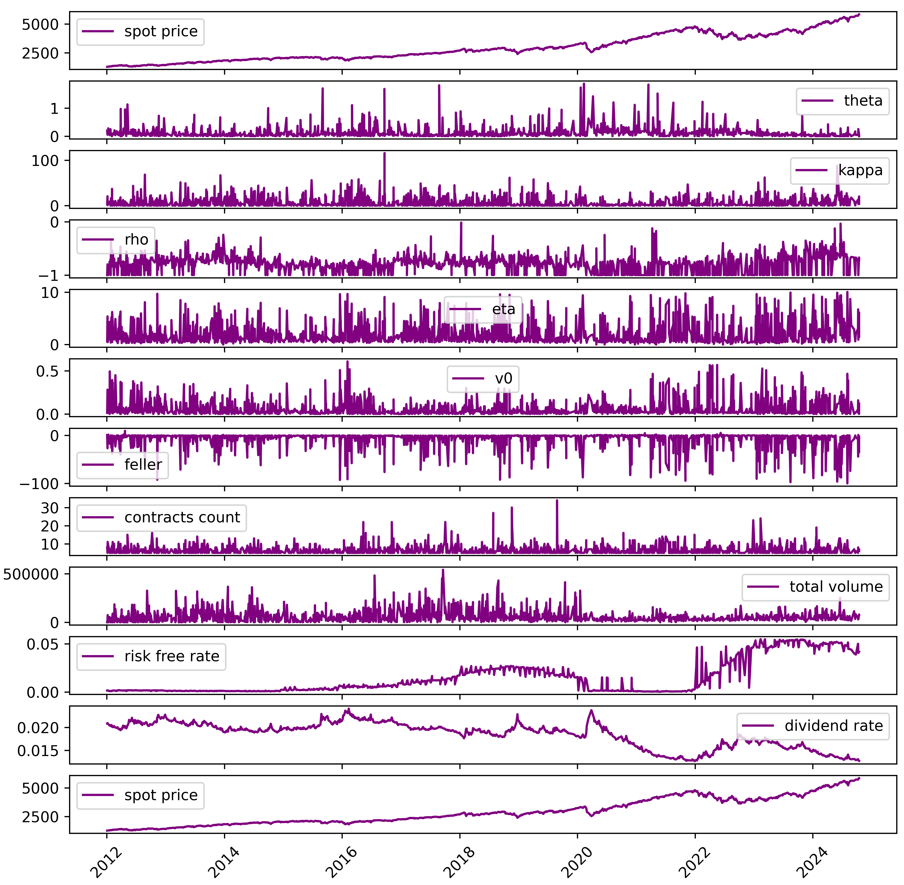
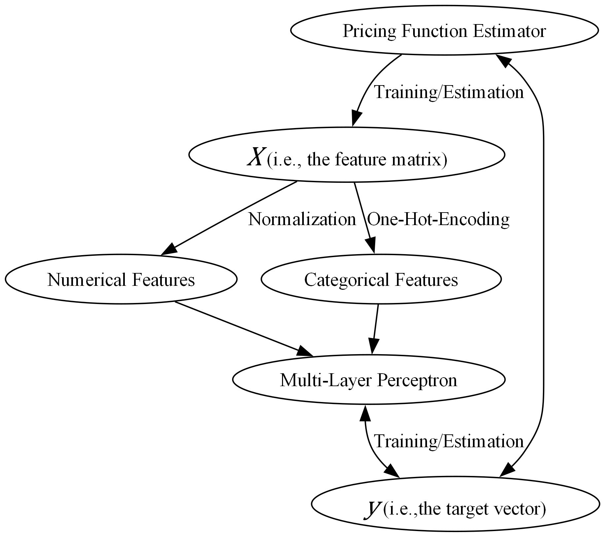
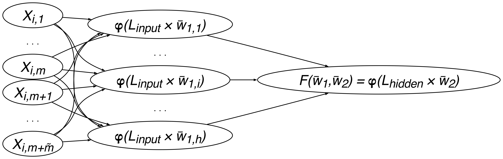

# Neural Networks for Exotic Option Pricing  
**Radu Briciu**  
*BSc Finance, PgDip Quantitative Finance*  

---

## Abstract
In this paper we will explore a proposed data generation method which will construct the feature matrix for a multi-layer perceptron model designed to estimate the pricing functional of path-dependent financial derivatives. We will explore the theoretical framework and specifications for barrier and Asian option feature generation along with their respective multi-layer perceptron architectures and model performance metrics. We will demonstrate how the proposed models can retain pricing errors below one percent while reducing the computation time by up to 99.8%.

---

## Table of Contents
- [Introduction](#introduction)  
- [Pricing Model](#pricing-model)  
<!-- - [Data Generation Method](#data-generation-method)  
- [Application to Path-Dependent Options](#application-of-data-generation-method-to-path-dependent-index-options) -->
- [Model Training](#model-training)  
- [Model Testing](#model-testing)  
- [Concluding Remarks](#concluding-remarks)  
- [Software Repositories](#software-repositories)    

---

## Introduction
In this paper we will explore a proposed method of pricing path-dependent index options via multi-layer perceptron approximations derived from the simulation of a multidimensional space representing a contract's price as a functional form of its features. Index options can generally be defined as financial derivative contracts facilitating a contingent claim on the value of a stock market index which is designed to aggregate performance across a sector or economy.  

It is therefore a complicated matter to evaluate the price of path-dependent option counterparts which introduce further non-linearities in their pricing functions. Path-dependent options often require statistical simulation to obtain the most accurate price, resulting in long computation times.  

We propose a method to generate possible values of a function which will proceed the optimization of a multi-layer perceptron model, effectively proxying the stochastic non-linear functional form between the output and its input features. To generate a representative sample space, we calibrate historical Heston (1993) parameters using market observed risk-free and dividend rates accompanied by live options trade data, thereby effectively simulating, in the case of this paper, the SPX index options market.  

The use of Heston’s stochastic volatility model as a pricing function for the underlying index allows for discrete monitoring of volatility and pricing of various market scenarios and contract types. This paper serves as a framework and demonstration of a generalized estimation process for barrier and Asian options along with model specifications and retraining analyses.  

---

## Pricing Model

### Specification
We use the Heston (1993) model to describe the log-price of the underlying, via the SDE system:

$$
dS_t = \left( r - \frac{v_t}{2} \right) dt + \sqrt{v_t} \left( \rho dW_t + \sqrt{1 - \rho^2} dB_t \right)
$$

$$
dv_t = \kappa (\theta - v_t) dt + \eta \sqrt{v_t} dW_t 
$$

where
1. $v_0$ = initial variance,  
2. $\theta$ = long-run variance,  
3. $\rho$ = correlation between log-price and variance process,  
4. $\kappa$ = mean reversion speed,  
5. $\eta$ = vol of variance process,  
6. $B_t, W_t$ = Brownian motions.  

Heston (1993) extends Black-Scholes (1973) by allowing stochastic volatility, making it suitable for pricing path-dependent options.

---

### Historical Parameter Retrieval
We construct a dataset of historical parameter sets by calibrating to live SPX options trades. This calibration yields ~1600 sets between 2012–2024.  

Filtering ensures each volatility surface has strikes both above and below the spot price (at least 2 each side, with ≥5 contracts) to allow reliable Heston calibration. Calibration is performed using the **Levenberg–Marquardt** algorithm as implemented in **QuantLib**.  

  

---
<!--
## Data Generation Method
We start with an initial feature matrix $\mathcal{D}$:

$$
\mathcal{D} =
\begin{bmatrix}
D_{1,1} & D_{1,2} & \cdots & D_{1,m} \\
D_{2,1} & D_{2,2} & \cdots & D_{2,m} \\
\vdots & \vdots & \ddots & \vdots \\
D_{n,1} & D_{n,2} & \cdots & D_{n,m}
\end{bmatrix}
$$

For each row $t$, construct sets of possible feature values:

$$
H_t = \{ \left[\mathcal{D}_{t,1}\left], \ldots, [\mathcal{D}_{t,m}], F^{(1)}_{\mathcal{D}_t}, \ldots, F^{(\tilde{m})}_{\mathcal{D}_t} \}
$$

Feature matrix $X_t$ is the Cartesian product:

$$
X_t = \{ (H_t^{(1)}, \ldots, H_t^{(k)}) \mid H_t^{(j)} \in H_t^{(j)} \}
$$

The final feature matrix $X$ is obtained by combining all $X_t$ across $n$ observations.

---

## Application of Data Generation Method to Path-Dependent Index Options

### Market Condition Matrix
Based on $n$ Heston calibrations:

$$
\mathcal{D}^{\text{Heston}} =
\begin{bmatrix}
    S_1 & \kappa_1 & \theta_1 & \rho_1 & \eta_1 & v_1 & r_1 & g_1 \\
    \vdots & \vdots & \vdots & \vdots & \vdots & \vdots & \vdots & \vdots \\
    S_n & \kappa_n & \theta_n & \rho_n & \eta_n & v_n & r_n & g_n
\end{bmatrix}
$$

### Barrier Option Price Functional
A Barrier option modifies the European call payoff $(S_T-K)^+$ with a barrier condition:

$$
\begin{aligned}
C^{\text{payoff}}_{\text{UpIn}} &= \mathbf{1}_{\{ S_t > B \,\forall\, t \}} (S_{T}-K)^{+}, \\
C^{\text{payoff}}_{\text{UpOut}} &= \mathbf{1}_{\{ S_t < B \,\forall\, t \}} (S_{T}-K)^{+}, \\
C^{\text{payoff}}_{\text{DownIn}} &= \mathbf{1}_{\{ S_t < B \,\forall\, t \}} (S_{T}-K)^{+}, \\
C^{\text{payoff}}_{\text{DownOut}} &= \mathbf{1}_{\{ S_t > B \,\forall\, t \}} (S_{T}-K)^{+}
\end{aligned}
$$

We generalize the barrier price functional:

$$
C^{\text{Barrier}} = F_{t}(S_0, \kappa, \theta, \rho, \eta, v_{0}, r, g, K, B, R, D^{\text{call/put}}, D^{\text{BarrierType}})
$$

Benchmark pricing is via Monte Carlo with control variates; finite-difference methods are used for computational savings during dataset generation.

---

### Asian Option Price Functional
The payoff is based on the average of the underlying over fixing dates:

Arithmetic average payoff:

$$
C^{\text{Arithmetic}}_t = e^{-r(T-t)} \cdot \frac{1}{m} \sum_{i=1}^{m} (S^{\text{Arithmetic}}_T - K)^{+}
$$

Geometric average payoff:

$$
C^{\text{Geometric}}_t = e^{-r(T-t)} \cdot \frac{1}{m} \sum_{i=1}^{m} (S^{\text{Geometric}}_T - K)^{+}
$$

Definitions of averages:

$$
S^{\text{Arithmetic}}_T = \frac{1}{n} \sum_{i=1}^{n} S^i_t \quad , \quad t_n = T
$$

$$
S^{\text{Geometric}}_T = \sqrt[n]{\prod_{i=1}^{n} S^i_t}
$$

Generalized pricing function:

$$
C^{\text{Asian}} = F_{t}(S_0, \kappa, \theta, \rho, \eta, v_{0}, r, g, K, n, P, D^{\text{call/put}}, D^{\text{Arithmetic/Geometric}})
$$

---

### Constructing $X^{\text{Barrier}}$

In order to simulate the multidimensional space representing a Barrier option's price as a function of its features, we begin by iterating through the row dimension of $\mathcal{D}^{\text{Heston}}$. For each row, we construct a set $H_{t}$ with auxiliary variables $F_{\mathcal{D}_{t}}^{(j)}$ defined as:

$$
\begin{aligned}
F_{\mathcal{D}_{t}}^{(1)} &= K_{S} = \left[ k_1, \ldots, k_j, \ldots, k_h \right], \quad  k_1 < S < k_h, \quad k_{\tilde{j}} < k_j \, \forall \, \tilde{j} < j, \\
F_{\mathcal{D}_{t}}^{(2)} &= T = \left[ \tau_1, \ldots, \tau_{t}, \ldots, \tau_h \right], \\
F_{\mathcal{D}_{t}}^{(3)} &= B = \left[ B_1, \ldots, B_j, \ldots, B_h \right], \quad  B_1 < S < B_h, \quad B_{\tilde{j}} < B_j \, \forall \, \tilde{j} < j, \\
F_{\mathcal{D}_{t}}^{(4)} &= R = \left[0\right], \\
F_{\mathcal{D}_{t}}^{(5)} &= F^{\text{call/put}} = \left[ D^{\text{call}}, D^{\text{put}} \right], \\
F_{\mathcal{D}_{t}}^{(6)} &= F^{\text{Out/In}} = \left[D^{\text{Out}}, D^{\text{In}}\right],
\end{aligned}
$$

where

1. $K_{S}$ is a set of strikes spread around the spot,  
2. $T$ is a set of maturities,  
3. $B$ is a set of barrier levels,  
4. $R$ is a set of rebates, which for the purposes of this study is a set consisting of only the element $0$ (zero),  
5. $F^{\text{call/put}}$ is a set of categorical variables representing the type of underlying European option, and  
6. $F^{\text{Out/In}}$ is a set of categorical variables representing the Barrier option type payoff.  

It is to be noted that the only feasible combinations are *Down* options with $B<S$ and *Up* options with $B>S$, where $B$ is the barrier level and $S$ is the underlying $S_{t}$ at time $i$.  

The subset feature matrix $X^{\text{Barrier}}_{t}$ will subsequently be defined as:

$$
X^{\text{Barrier}}_{t} =
\begin{bmatrix}
S_{t} & \kappa_{t} & \theta_{t} & \rho_{t} & \eta_{t} & v_{t} & r_{t} & g_{t} & k_{1} & \tau_{1} & b_{1} & r^{\text{rebate}}_{1} & D^{\text{call/put}}_{1} & D^{\text{barrier type}}_{1} \\
\vdots & \vdots & \vdots & \vdots & \vdots & \vdots & \vdots & \vdots & \vdots & \vdots & \vdots & \vdots & \vdots & \vdots \\
S_{t} & \kappa_{t} & \theta_{t} & \rho_{t} & \eta_{t} & v_{t} & r_{t} & g_{t} & k_{s} & t_{s} & n_{s} & r^{\text{rebate}}_{s} & D^{\text{call/put}}_{s} & D^{\text{barrier type}}_{s}
\end{bmatrix} 
$$

This essentially allows us to generate $k$ contracts at every observation across the rows (discrete observations in time) of our initial feature matrix $\mathcal{D}^{\text{Heston}}$, where the features carried over into $H_{t}$ from $\mathcal{D}_{t}$ are constant.

---

### Constructing $X^{\text{Asian}}$

In the case of Asian options, the feature matrix generation process is not as straightforward. In order to simulate an evenly distributed sample space, we need to take into account the relationship between an Asian option's maturity and its fixing dates. This will require careful construction of a maturities vector $T$, ensuring the congruency of feature combinations. Therefore, we must consider a set of maturities defined as

$$
T^{\text{Asian}} = \left[ \tau_1, \ldots, \tau_{i}, \ldots, \tau_{h} \right]
$$

which will precede the creation of $\dim{(T)}$ subsets within $X_{t}$ (eq.~\ref{eq:Xt}). Subsequently, every subset is generated by considering the $H^{(i)}_{t}$ (eq.~\ref{eq:Ht}) feature set with auxiliary variables $F_{\mathcal{D}_{t}}^{(j)}$ defined as:

$$
\begin{aligned}
F_{\mathcal{D}_{t}}^{(1)} &= T = \left[ \tau_{i} \right], \\
F_{\mathcal{D}_{t}}^{(2)} &= K_{S} = \left[ k_1, \ldots, k_{i}, \ldots, k_{h} \right], \quad  k_1 < S < k_t, \quad k_{\tilde{j}} < k_j \, \forall \, \tilde{j} < j, \\
F_{\mathcal{D}_{t}}^{(3)} &= A_{\tau} = \left[ a_1, \ldots, a_{i}, \ldots, a_{h} \right], \quad a_{h} \leq \tau \, \forall \, i, \\
F_{\mathcal{D}_{t}}^{(4)} &= P = \left[ 0 \right], \\
F_{\mathcal{D}_{t}}^{(5)} &= F^{\text{call/put}} = \left[ D^{\text{call}}, D^{\text{put}} \right], \\
F_{\mathcal{D}_{t}}^{(6)} &= F^{\text{arithmetic/geometric}} = \left[ D^{\text{arithmetic}}, D^{\text{geometric}} \right].
\end{aligned}
$$

where

1. $\tau$ is the iterated maturity in $T^{\text{Asian}}$ (eq.~\ref{eq:asianmats}),  
2. $K_{S}$ is a set of strikes spread around the spot price $S$,  
3. $A_{\tau}$ are factors of $\tau$ which will determine the number of fixing dates applicable to the contract,  
4. $P$ is a set of past fixings, which for the purposes of this study is a set consisting of only the element $0$ (zero),  
5. $F^{\text{call/put}}$ is a set of categorical variables representing the type of underlying European option, and  
6. $F^{\text{arithmetic/geometric}}$ is a set of categorical variables representing the contract's averaging type.  

---

The subset feature matrix $X^{\text{Asian}}_{t}$ will subsequently be defined as:

$$
X^{\text{Asian}}_{t} = 

\left[
\begin{array}{cccccccccccccc}
S_{t} & \kappa_{t} & \theta_{t} & \rho_{t} & \eta_{t} & v_{t} & r_{t} & g_{t} & k_{1} & \tau_{1} & a_{1} & p_{1} & D^{\text{call/put}}_{1} & D^{\text{arithmetic/geometric}}_{1} \\
\vdots & \vdots & \vdots & \vdots & \vdots & \vdots & \vdots & \vdots & \vdots & \vdots & \vdots & \vdots & \vdots & \vdots \\
S_{t} & \kappa_{t} & \theta_{t} & \rho_{t} & \eta_{t} & v_{t} & r_{t} & g_{t} & k_{s} & \tau_{s} & a_{s} & p_{s} & D^{\text{call/put}}_{s} & D^{\text{arithmetic/geometric}}_{s} \\
\end{array}
\right]
$$

essentially allowing us to generate $s$ contracts at every observation across the rows (discrete observations in time) of our initial feature matrix $\mathcal{D}^{\text{Heston}}$ where the features carried over into $H_{t}$  from $\mathcal{D}_{t}$ are constant.

---
-->

## Model Training
We train a multi-layer perceptron (MLP) on the feature matrix $X$ and target $y$.  

With squared error:

$$
\min_{w_1, w_2} \frac{1}{N} \sum_{i=1}^N (F_t(w_1,w_2) - y_t)^2
$$

Hyperparameter tuning across 6480 configurations ensures in-sample error ~0.5% and out-of-sample error <5% (Asian options).

---

## Model Testing

The model was tested with a negligible amount of data and tested for over 10 years of out of sample data.

### Performance

Figure: Barrier options out-of-sample errors

  

Figure: Asian options out-of-sample errors

Errors increase without retraining, due to unseen parameter combinations.

### Distribution Matching
The neural network preserves distributional shapes of option prices vs Heston parameters:

Figure: Barrier option price/parameter joint distribution

  

Figure: Asian option price/parameter joint distribution

---

## Concluding Remarks
We proposed a data generation routine to produce parsimonious training sets for exotic option pricing.  

- Barrier options priced via advection (approximate).  
- Asian options priced via Monte Carlo.  
- Neural networks approximate the Heston functional form.  
- Achieved **>99% reduction in computation time** with in-sample error <1%.  

---

## Software Repositories
1. [convsklearn](https://github.com/boomelage/convsklearn)  
2. [QuantLib Pricers](https://github.com/boomelage/quantlib_pricers)  
3. [Option Generator](https://github.com/boomelage/OptionGenerator)

