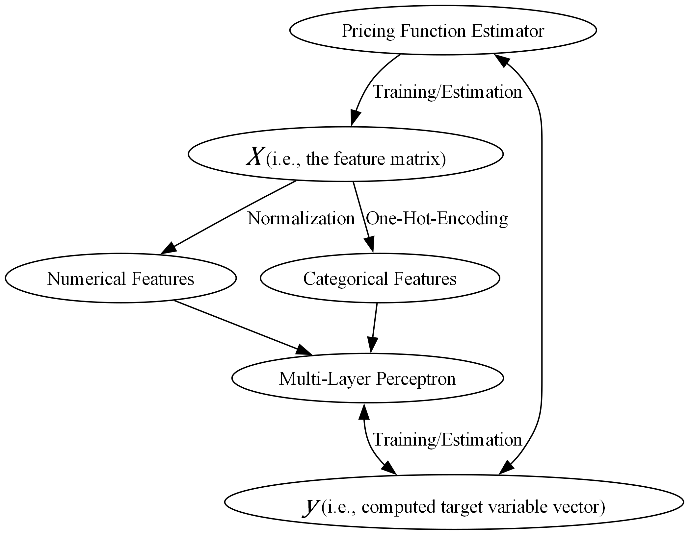

**Machine Learning Option Pricing:**  
An empirical approach based on SPX options trade data

# Table of Contents
1. [Introduction](#1-introduction)
2. [Pricing Model](#2-pricing-model) 
   2.1. [Specification](#21-specification) 
   2.2. [Historical Parameter Retrieval](#22-historical-parameter-retrieval)
4. [Data Generation](#3-data-generation) 
   3.1. [Barrier Options](#31-barrier-options) 
   3.2. [Asian Options](#32-asian-options)
5. [Model Training](#4-model-training)
6. [Model Testing](#5-model-testing)
7. [Reference List](#6-reference-list)

# 1. Introduction

In this paper we will explore a proposed method of pricing exotic options via multi-layer-perceptron-based approximations derived from the simulation of a multidimensional space representing an option's price as a functional form of its features. To achieve this, we calibrate historical Heston (1993) parameters using market observed risk-free and dividend rates accompanied by live options trade data, thereby effectively simulating, in the case of this paper, the SPX index options market. This paper serves as a framework and demonstration of a generalized estimation process for barrier and Asian options along with a model specification and retraining analysis of both pricing models. We will explore the estimation of barrier options priced via finite difference as well as Asian options priced via Monte Carlo simulation.

# 2. Pricing Model

## 2.1. Specification

To model the logarithmic price of our underlying security, we use the Heston (1993) model, described by the pair of stochastic differential equations:

$$
dX_t = \left( r - \frac{v_t}{2} \right) dt + \sqrt{v_t} \left( \rho dW_t + \sqrt{1 - \rho^2} dB_t \right) \quad (2.1)
$$

$$
\hspace{1.9cm}  dv_t = \kappa (\theta - v_t) dt + \eta \sqrt{v_t} dW_t \hspace{1.8cm} \quad (2.2)
$$

where
- $v_0$ represents the initial variance,
- $\theta$ is the long-run variance,
- $\rho$ is the correlation between the log-price process and its volatility,
- $\kappa$ is the mean reversion of the variance to **𝜃**,
- $\eta$ is the volatility of the variance process, and 
- $B_t$ , $W_t$ are continuous random walks. 

The implementation of stochastic volatility of the underlying log price is imperative to the functionality of our model as we are aiming to estimate the prices of path-dependent options which may require discrete monitoring of the spot price throughout the contracts' tenors.

## 2.2. Historical Parameter Retrieval

# 3. Data Generation

In the spirit of Liu et. al. (2019) and Frey et. al. (2022) we will generate a development dataset by simulating possible parameter combinations for a given security. Liu et. al. (2019) demonstrate a considerable increase in computational efficiency with retention of low errors for the estimation of implied volatilites via artificial neural networks by considering the relative spot price (i.e., the spot price $S$ divided by the strike price $K$) and the relative option price (i.e., the option's price $C$ divided by its strike $K$) of the option as opposed to their levels, a method we will be borrowing for our estimation. Frey et. al. (2022) propose a data generation method via Cartesian product to create a sample space of vanilla option pricing features to estimate the price level ($S$) using a multi-layer perceptron model. Testing of this method considering exotic options did not retain pricing accuracy as evidenced by high Root Mean Squared Error (RMSE), high Mean Absolute Error (MSE), and high partial dependence of the target price in relation to the underlying spot price level $S$ and the initial variance $v_0$. We therefore propose a new method combining the Carterisan product approach to retain control over feature combinations while conisdering the option's relative price ($C/K$) as well as any other linear features also scaled by the strike price $K$.

## 3.1. Barrier Options

In the case of barrier options, we begin generating the development dataset by iterating through the historical spot prices and volatility parameters and for each observation, performing the Cartesian product:

$$
S \times K \times T \times B \times R = \set{ (s, k, t, b, r_{\text{rebate}}) | \ s \in S, \ k \in K, \ t \in T, \ b \in B, \ \text{and} \ r_{\text{rebate}} \in R\} \quad (3.1)
$$

where
- $S$ is a single element set consisting of the underying spot price,  
- $K$ is a set of strikes spread around the spot,  
- $T$ is a set of maturities,  
- $B$ is a set of barrier levels, and  
- $R$ is a set of rebates which for the purposes of this study in a set consisting of only the element $0$ (zero)

and duplicating the data for calls/puts, down/in, and up/down option types which can also be achieved by their inclusion in the Cartesian product as string categories using software like itertools.

## 3.2. Asian Options
For the Asian option counterpart, we perform a similar iteration of our historical data, for each observation performing the Cartesian product:

$$
S \times K \times T \times A \times P = \set{ (s,k,t,a,p) | \ s \in S, \ k \in K, \ t \in T, \ a \in A, \text{and} \ p \in P \} \quad (3.2)
$$

where
- $S$ is a single element set consisting of the underying spot price,  
- $K$ is a set of strikes spread around the spot,  
- $T$ is a set of maturities,  
- $A$ is a set of time frequencies at which the Asian option fixes (i.e., a frequency which determines the number of monitoring dates), and
- $P$ is a set of past fixings which for the purposes of this study is a set consisting of only the element $0$ (zero)

and duplicating the data for calls/puts and arithmetic/geometric averaging which can similarly be achieved by their inclusion in the Cartesian product as string categories using software like itertools.

# 4. Model Training

# 5. Model Testing

# 6. Reference list
Blanda, V. (2023). FX Barrier Option Pricing. [online]   
Available at: https://www.imperial.ac.uk/media/imperial-college/faculty-of-natural-sciences/department-of-mathematics/math-finance/212252650---VALENTIN-BLANDA---BLANDA_VALENTIN_02293988.pdf.

Frey, C., Scheuch, C., Voigt , S. and Weiss, P. (2022). Option Pricing via Machine Learning with Python. [online] Tidy Finance.  
Available at: https://www.tidy-finance.org/python/option-pricing-via-machine-learning.html.

Gavin, H. (2024). The Levenberg-Marquardt algorithm for nonlinear least squares curve-fitting problems. [online]   
Available at: https://people.duke.edu/~hpgavin/lm.pdf.

Heston, S.L. (1993). A Closed-Form Solution for Options with Stochastic Volatility with Applications to Bond and Currency Options. Review of Financial Studies, 6(2), pp.327–343.   
doi: https://doi.org/10.1093/rfs/6.2.327.

Kruse, R., Sanaz Mostaghim, Borgelt, C., Braune, C. and Steinbrecher, M. (2022). Multi-layer Perceptrons. Texts in computer science, pp.53–124.   
doi: https://doi.org/10.1007/978-3-030-42227-1_5.

Liu, S., Oosterlee, C. and Bohte, S. (2019). Pricing Options and Computing Implied Volatilities using Neural Networks. Risks, 7(1), p.16.  
doi: https://doi.org/10.3390/risks7010016.

Schönbucher, P.J. (1999). A Market Model for Stochastic Implied Volatility. SSRN Electronic Journal, 21(4).   
doi: https://doi.org/10.2139/ssrn.182775.

Van Wieringen, W. (2021). Lecture notes on ridge regression. [online]   
Available at: https://arxiv.org/pdf/1509.09169.
