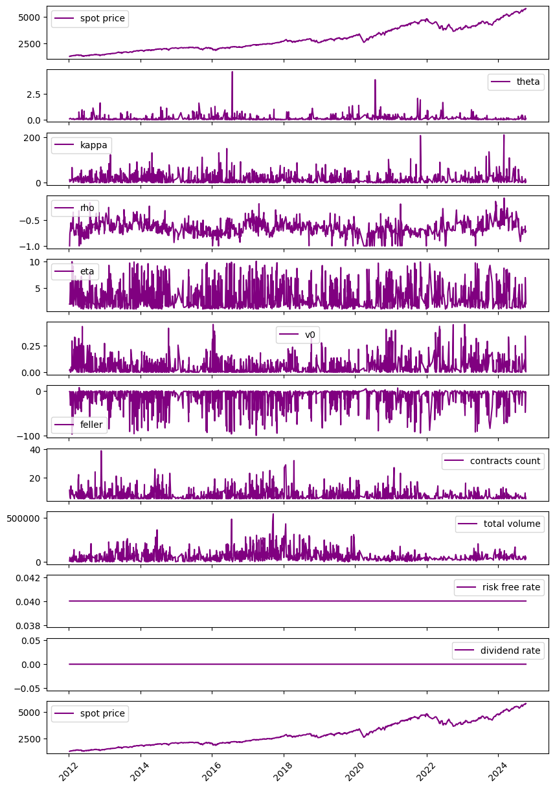
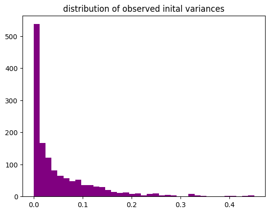

```python
import pandas as pd
import matplotlib.pyplot as plt
pd.set_option('display.float_format', '{:.10f}'.format)
from calibrations_collector import df
```


    

    


```python
V0 = df['v0'].squeeze()
df['v0'].describe()
```


    count   1397.0000000000
    mean       0.0540425465
    std        0.0742632019
    min        0.0000000003
    25%        0.0041399542
    50%        0.0235261474
    75%        0.0780895710
    max        0.4506142573
    Name: v0, dtype: float64


```python
plt.figure()
plt.hist(V0,bins=int(len(V0)**0.5),color='purple')
plt.title('distribution of observed inital variances') 
plt.show()
```


    

    


```python

```
