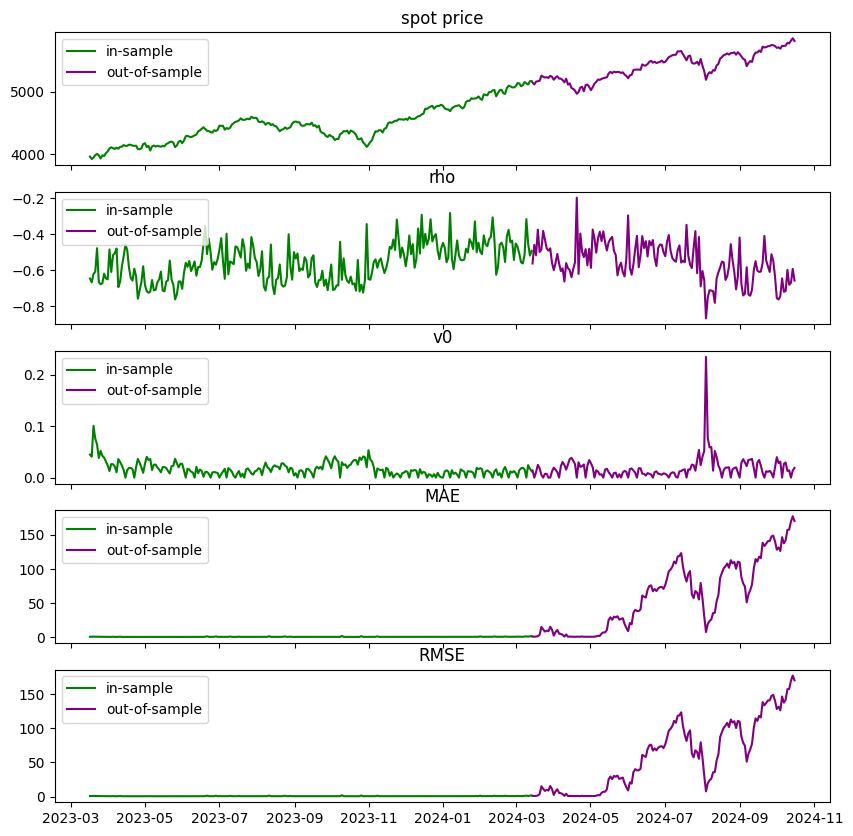
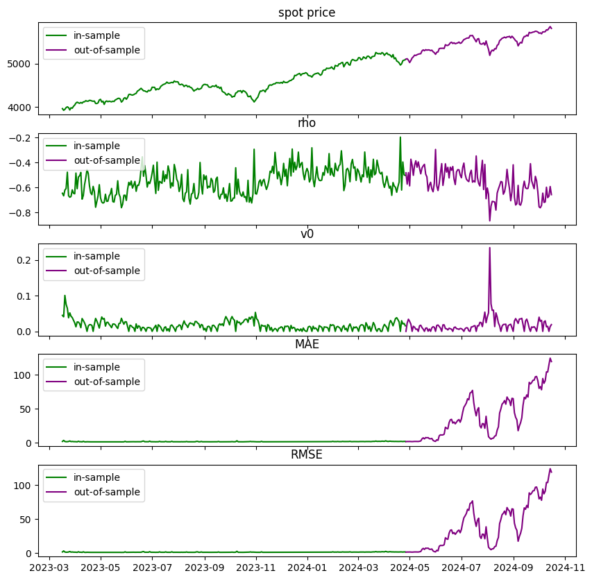
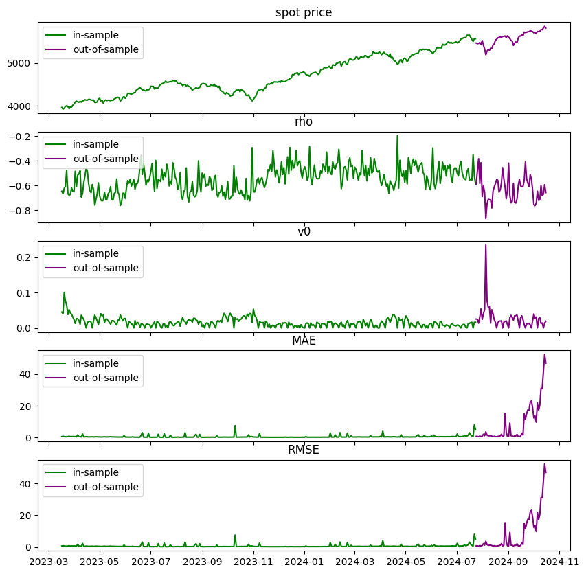
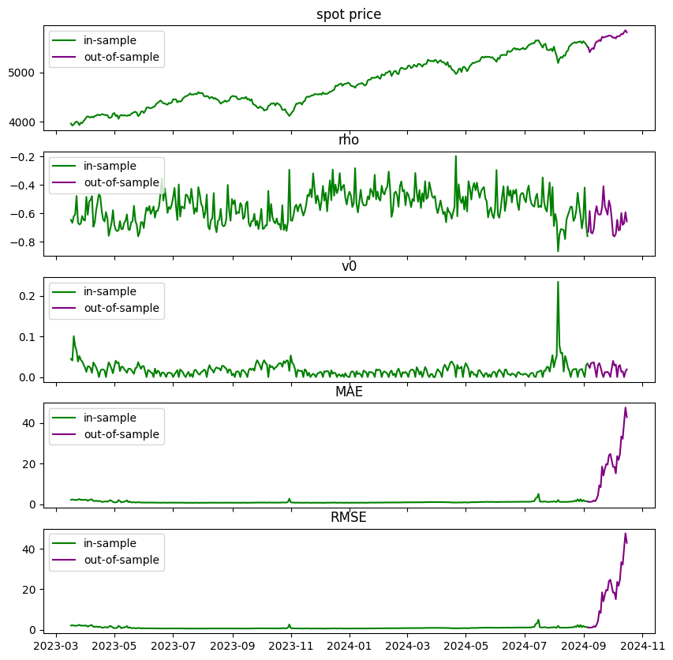

```python
import os
import joblib
import pandas as pd
import numpy as np
import matplotlib.pyplot as plt
from pathlib import Path
```

# functions

# loading model


```python
from model_settings import ms
root = Path().resolve().parent.parent
models_dir = os.path.join(root,ms.trained_models)
models = pd.Series([f for f in os.listdir(models_dir) if f.find('.')==-1])
for i,m in enumerate(models):
    print(f"{i}     {m}")
```

    0     2024_11_01 204910611379 bloomberg barriers
    1     2024_11_01 205356527985 bloomberg asians
    2     2024_11_05 184958719691 Oosterlee test
    3     2024_11_07 124002946108 cboe spx asian
    


```python
selected_model = models.iloc[3]
model_dir = os.path.join(models_dir,selected_model)
pickle = [f for f in os.listdir(model_dir) if f.endswith('.pkl')][0]
picke_dir = os.path.join(model_dir,pickle)
model = joblib.load(picke_dir)
model
```


    ---------------------------------------------------------------------------

    AttributeError                            Traceback (most recent call last)

    Cell In[48], line 1
    ----> 1 selected_model = models.iloc[3]
          2 model_dir = os.path.join(models_dir,selected_model)
          3 pickle = [f for f in os.listdir(model_dir) if f.endswith('.pkl')][0]
    

    AttributeError: 'dict' object has no attribute 'iloc'


```python
model['train_data']
```


<div>
<style scoped>
    .dataframe tbody tr th:only-of-type {
        vertical-align: middle;
    }

    .dataframe tbody tr th {
        vertical-align: top;
    }

    .dataframe thead th {
        text-align: right;
    }
</style>
<table border="1" class="dataframe">
  <thead>
    <tr style="text-align: right;">
      <th></th>
      <th>spot_price</th>
      <th>strike_price</th>
      <th>days_to_maturity</th>
      <th>n_fixings</th>
      <th>fixing_frequency</th>
      <th>past_fixings</th>
      <th>averaging_type</th>
      <th>w</th>
      <th>risk_free_rate</th>
      <th>dividend_rate</th>
      <th>...</th>
      <th>theta</th>
      <th>rho</th>
      <th>eta</th>
      <th>v0</th>
      <th>date</th>
      <th>asian_price</th>
      <th>observed_price</th>
      <th>insample_target</th>
      <th>insample_prediction</th>
      <th>insample_error</th>
    </tr>
  </thead>
  <tbody>
    <tr>
      <th>0</th>
      <td>3959.00</td>
      <td>1979.00</td>
      <td>7</td>
      <td>1.0</td>
      <td>7</td>
      <td>0</td>
      <td>geometric</td>
      <td>call</td>
      <td>0.04</td>
      <td>0.0</td>
      <td>...</td>
      <td>0.097475</td>
      <td>-0.613187</td>
      <td>2.478317</td>
      <td>0.043614</td>
      <td>2023-03-16</td>
      <td>1980.121502</td>
      <td>1980.121919</td>
      <td>1980.121919</td>
      <td>1981.674650</td>
      <td>1.552731</td>
    </tr>
    <tr>
      <th>341</th>
      <td>3960.75</td>
      <td>4950.75</td>
      <td>84</td>
      <td>12.0</td>
      <td>7</td>
      <td>0</td>
      <td>arithmetic</td>
      <td>put</td>
      <td>0.04</td>
      <td>0.0</td>
      <td>...</td>
      <td>0.070227</td>
      <td>-0.641217</td>
      <td>2.173351</td>
      <td>0.043379</td>
      <td>2023-03-16</td>
      <td>959.295638</td>
      <td>959.295487</td>
      <td>959.295487</td>
      <td>959.559485</td>
      <td>0.263998</td>
    </tr>
    <tr>
      <th>340</th>
      <td>3960.75</td>
      <td>4950.75</td>
      <td>84</td>
      <td>12.0</td>
      <td>7</td>
      <td>0</td>
      <td>geometric</td>
      <td>put</td>
      <td>0.04</td>
      <td>0.0</td>
      <td>...</td>
      <td>0.070227</td>
      <td>-0.641217</td>
      <td>2.173351</td>
      <td>0.043379</td>
      <td>2023-03-16</td>
      <td>962.992962</td>
      <td>962.993719</td>
      <td>962.993719</td>
      <td>963.155869</td>
      <td>0.162151</td>
    </tr>
    <tr>
      <th>339</th>
      <td>3960.75</td>
      <td>3960.50</td>
      <td>84</td>
      <td>12.0</td>
      <td>7</td>
      <td>0</td>
      <td>arithmetic</td>
      <td>put</td>
      <td>0.04</td>
      <td>0.0</td>
      <td>...</td>
      <td>0.070227</td>
      <td>-0.641217</td>
      <td>2.173351</td>
      <td>0.043379</td>
      <td>2023-03-16</td>
      <td>77.895017</td>
      <td>77.894539</td>
      <td>77.894539</td>
      <td>78.135346</td>
      <td>0.240807</td>
    </tr>
    <tr>
      <th>338</th>
      <td>3960.75</td>
      <td>3960.50</td>
      <td>84</td>
      <td>12.0</td>
      <td>7</td>
      <td>0</td>
      <td>arithmetic</td>
      <td>call</td>
      <td>0.04</td>
      <td>0.0</td>
      <td>...</td>
      <td>0.070227</td>
      <td>-0.641217</td>
      <td>2.173351</td>
      <td>0.043379</td>
      <td>2023-03-16</td>
      <td>99.826977</td>
      <td>99.823032</td>
      <td>99.823032</td>
      <td>100.103836</td>
      <td>0.280804</td>
    </tr>
    <tr>
      <th>...</th>
      <td>...</td>
      <td>...</td>
      <td>...</td>
      <td>...</td>
      <td>...</td>
      <td>...</td>
      <td>...</td>
      <td>...</td>
      <td>...</td>
      <td>...</td>
      <td>...</td>
      <td>...</td>
      <td>...</td>
      <td>...</td>
      <td>...</td>
      <td>...</td>
      <td>...</td>
      <td>...</td>
      <td>...</td>
      <td>...</td>
      <td>...</td>
    </tr>
    <tr>
      <th>171228</th>
      <td>4470.25</td>
      <td>3352.50</td>
      <td>28</td>
      <td>1.0</td>
      <td>28</td>
      <td>0</td>
      <td>arithmetic</td>
      <td>call</td>
      <td>0.04</td>
      <td>0.0</td>
      <td>...</td>
      <td>0.040097</td>
      <td>-0.712814</td>
      <td>2.314096</td>
      <td>0.029393</td>
      <td>2023-08-08</td>
      <td>1121.178642</td>
      <td>1121.181291</td>
      <td>1121.181291</td>
      <td>1120.085108</td>
      <td>-1.096184</td>
    </tr>
    <tr>
      <th>171227</th>
      <td>4470.25</td>
      <td>3352.50</td>
      <td>28</td>
      <td>1.0</td>
      <td>28</td>
      <td>0</td>
      <td>geometric</td>
      <td>call</td>
      <td>0.04</td>
      <td>0.0</td>
      <td>...</td>
      <td>0.040097</td>
      <td>-0.712814</td>
      <td>2.314096</td>
      <td>0.029393</td>
      <td>2023-08-08</td>
      <td>1120.285606</td>
      <td>1120.284114</td>
      <td>1120.284114</td>
      <td>1119.009773</td>
      <td>-1.274341</td>
    </tr>
    <tr>
      <th>171226</th>
      <td>4470.25</td>
      <td>2235.00</td>
      <td>28</td>
      <td>1.0</td>
      <td>28</td>
      <td>0</td>
      <td>arithmetic</td>
      <td>call</td>
      <td>0.04</td>
      <td>0.0</td>
      <td>...</td>
      <td>0.040097</td>
      <td>-0.712814</td>
      <td>2.314096</td>
      <td>0.029393</td>
      <td>2023-08-08</td>
      <td>2235.251086</td>
      <td>2235.250618</td>
      <td>2235.250618</td>
      <td>2232.948501</td>
      <td>-2.302117</td>
    </tr>
    <tr>
      <th>171196</th>
      <td>4469.50</td>
      <td>2234.00</td>
      <td>84</td>
      <td>1.0</td>
      <td>84</td>
      <td>0</td>
      <td>arithmetic</td>
      <td>call</td>
      <td>0.04</td>
      <td>0.0</td>
      <td>...</td>
      <td>0.057179</td>
      <td>-0.749865</td>
      <td>1.819486</td>
      <td>0.030833</td>
      <td>2023-08-08</td>
      <td>2235.090530</td>
      <td>2235.091536</td>
      <td>2235.091536</td>
      <td>2229.577967</td>
      <td>-5.513569</td>
    </tr>
    <tr>
      <th>172436</th>
      <td>4497.50</td>
      <td>6746.00</td>
      <td>84</td>
      <td>1.0</td>
      <td>84</td>
      <td>0</td>
      <td>arithmetic</td>
      <td>put</td>
      <td>0.04</td>
      <td>0.0</td>
      <td>...</td>
      <td>0.037897</td>
      <td>-0.668246</td>
      <td>1.604673</td>
      <td>0.023194</td>
      <td>2023-08-08</td>
      <td>2207.705724</td>
      <td>2207.707605</td>
      <td>2207.707605</td>
      <td>2212.109097</td>
      <td>4.401492</td>
    </tr>
  </tbody>
</table>
<p>172437 rows × 22 columns</p>
</div>


```python
print('model attributes:\n')
for k in model.keys():
    print(k)
```

    model attributes:
    
    raw_data
    dataset
    target_name
    excluded_features
    numerical_features
    categorical_features
    feature_set
    n_features
    development_dates
    test_dates
    train_data
    test_data
    train_X
    train_y
    test_X
    test_y
    preprocessor
    pipeline
    model
    model_fit
    dnn_runtime
    numerical_scaler
    dnn_params
    transformers
    regressor
    dnn_pipeline
    


```python
for col in model['feature_set']:
    print(f"{col.replace("_"," ")}:",f"\n{model['test_data'][col].copy().squeeze().sort_values().drop_duplicates().reset_index(drop=True)}\n")
print()
```

    spot price: 
    0       4106.00
    1       4108.50
    2       4110.75
    3       4112.75
    4       4114.00
             ...   
    3562    5864.25
    3563    5864.50
    3564    5865.00
    3565    5865.50
    3566    5866.50
    Name: spot_price, Length: 3567, dtype: float64
    
    strike price: 
    0       2053.0
    1       2054.0
    2       2055.0
    3       2056.0
    4       2057.0
             ...  
    7505    8795.0
    7506    8796.0
    7507    8797.0
    7508    8798.0
    7509    8799.0
    Name: strike_price, Length: 7510, dtype: float64
    
    days to maturity: 
    0     7
    1    28
    2    84
    Name: days_to_maturity, dtype: int64
    
    fixing frequency: 
    0     7
    1    28
    2    84
    Name: fixing_frequency, dtype: int64
    
    past fixings: 
    0    0
    Name: past_fixings, dtype: int64
    
    risk free rate: 
    0    0.04
    Name: risk_free_rate, dtype: float64
    
    dividend rate: 
    0    0.0
    Name: dividend_rate, dtype: float64
    
    kappa: 
    0         0.000004
    1         0.000238
    2         0.000824
    3         0.001284
    4         0.001362
               ...    
    5486    194.119326
    5487    198.548712
    5488    201.729013
    5489    222.834541
    5490    326.631238
    Name: kappa, Length: 5491, dtype: float64
    
    theta: 
    0         0.011056
    1         0.011549
    2         0.011632
    3         0.011831
    4         0.011890
               ...    
    5486     25.968767
    5487     32.275708
    5488     33.237322
    5489     45.374701
    5490    199.685113
    Name: theta, Length: 5491, dtype: float64
    
    rho: 
    0      -0.878653
    1      -0.869045
    2      -0.866640
    3      -0.862340
    4      -0.861312
              ...   
    5486   -0.197912
    5487   -0.197241
    5488   -0.193686
    5489   -0.186944
    5490   -0.107984
    Name: rho, Length: 5491, dtype: float64
    
    eta: 
    0       1.000078
    1       1.000184
    2       1.001397
    3       1.002052
    4       1.002340
              ...   
    5486    9.199660
    5487    9.237272
    5488    9.305510
    5489    9.450265
    5490    9.846639
    Name: eta, Length: 5491, dtype: float64
    
    v0: 
    0       3.401120e-12
    1       4.845611e-12
    2       5.292657e-12
    3       1.004460e-11
    4       1.131993e-11
                ...     
    5486    1.790538e-01
    5487    1.901946e-01
    5488    1.951745e-01
    5489    2.338909e-01
    5490    2.347798e-01
    Name: v0, Length: 5491, dtype: float64
    
    asian price: 
    0           41.162574
    1           41.221199
    2           41.243964
    3           41.347836
    4           41.359320
                 ...     
    329962    2937.102582
    329963    2937.152195
    329964    2937.286111
    329965    2937.975238
    329966    2938.133931
    Name: asian_price, Length: 329967, dtype: float64
    
    averaging type: 
    0    arithmetic
    1     geometric
    Name: averaging_type, dtype: object
    
    w: 
    0    call
    1     put
    Name: w, dtype: object
    
    
    
from sklearn.inspection import partial_dependence,PartialDependenceDisplay

part_disp_X = train_data[model_fit.feature_names_in_]
fig, ax = plt.subplots(figsize=(12, 6))
disp = PartialDependenceDisplay.from_estimator(model_fit, part_disp_X, ['spot_price','v0'], ax=ax)

```python
def compute_RMSE(diff):
    if len(diff)>0:
        return np.sqrt(np.mean(diff.values**2))
        
def compute_MAE(diff):
    if len(diff)>0:
        return np.mean(np.abs(diff.values))

def plot_errors(train_data,test_data):
    test_diff = test_data['outofsample_error']
    train_diff = train_data['insample_error']
    
    test_plot = test_data[['date','spot_price','rho','v0']].copy()
    test_plot = test_plot.reset_index().set_index('date')
    test_plot['MAE'] = test_diff.resample('D').apply(compute_RMSE)
    test_plot['RMSE'] = test_diff.resample('D').apply(compute_RMSE)
    test_plot = test_plot.reset_index()
    test_plot = test_plot.drop_duplicates(subset=['date'],keep='last').set_index('date').drop(columns='calculation_date')
    
    train_plot = train_data[['date','spot_price','rho','v0']].copy()
    train_plot = train_plot.reset_index().set_index('date')
    train_plot['MAE'] = train_diff.resample('D').apply(compute_RMSE)
    train_plot['RMSE'] = train_diff.resample('D').apply(compute_RMSE)
    train_plot = train_plot.reset_index()
    train_plot = train_plot.drop_duplicates(subset=['date'],keep='last').set_index('date').drop(columns='calculation_date')

    
    trainx = pd.date_range(start=min(train_data.index),end=max(train_data.index),periods=train_plot.shape[0])
    testx = pd.date_range(start=min(test_data.index),end=max(test_data.index),periods=test_plot.shape[0])

    train_plot.index = trainx
    test_plot.index = testx
    
    
    fig,axs = plt.subplots(max(len(train_plot.columns),len(test_plot.columns)),figsize=(10,10),sharex=True)
    for i,col in enumerate(train_plot.columns):
        axs[i].plot(train_plot[col],color='green',label='in-sample')
        axs[i].set_title(col.replace('_',' '))
        axs[i].legend()
    for i,col in enumerate(test_plot.columns):
        axs[i].plot(test_plot[col],color='purple',label='out-of-sample')
        axs[i].set_title(col.replace('_',' '))
        axs[i].legend()
    plt.show()


train_data = model['train_data'].copy()
test_data = model['test_data'].copy()
train_data['calculation_date'] = pd.to_datetime(train_data['calculation_date'],format='mixed')
test_data['calculation_date'] = pd.to_datetime(test_data['calculation_date'],format='mixed')
test_data = test_data.set_index('calculation_date').sort_index()
train_data = train_data.set_index('calculation_date').sort_index()
plot_errors(train_data,test_data)
```


    

    


# retraining


```python
from convsklearn import convsklearn
help(convsklearn)
```

    Help on class convsklearn in module convsklearn.convsklearn:
    
    class convsklearn(builtins.object)
     |  convsklearn(target_name='observed_price', excluded_features=['barrier_price', 'asian', 'observed_price', 'outin', 'updown', 'n_fixings'])
     |
     |  a proprietary class of convenience wrappers for sklearn
     |
     |  Methods defined here:
     |
     |  __init__(self, target_name='observed_price', excluded_features=['barrier_price', 'asian', 'observed_price', 'outin', 'updown', 'n_fixings'])
     |      Initialize self.  See help(type(self)) for accurate signature.
     |
     |  load_data(self, data)
     |
     |  preprocess_data(self, development_dates, test_dates, plot=True)
     |
     |  run_dnn(self, print_details=True)
     |
     |  test_prediction_accuracy(self)
     |
     |  ----------------------------------------------------------------------
     |  Data descriptors defined here:
     |
     |  __dict__
     |      dictionary for instance variables
     |
     |  __weakref__
     |      list of weak references to the object
    
    


```python
retraining_frequency = 30 #days
test_dates = model['test_dates']
full_dataset = model['dataset']
models = {}
for i, date in enumerate(test_dates):
    development_dates = pd.concat([model['development_dates'],test_dates[:(i+1)*retraining_frequency]])
    subset_test_dates = test_dates[~test_dates.isin(development_dates)]
    if development_dates.shape == 0:
        break
    try:
        retrainer = convsklearn()
        retrainer.load_data(full_dataset)
        retrainer.preprocess_data(development_dates, subset_test_dates,plot=False)
        retrainer.run_dnn()
        retrainer.test_prediction_accuracy()
        models[date] = retrainer.__dict__
        plot_errors(retrainer.train_data.set_index('calculation_date'),retrainer.test_data.set_index('calculation_date'))
        print()
    except Exception as e:
        if str(e).find('Found array with 0 sample(s)')==-1:
            print(e)
        break
```

    
    training on 221958 samples...
    
    alpha: 0.01
    hidden_layer_sizes: (15, 15)
    learning_rate: adaptive
    learning_rate_init: 0.1
    solver: sgd
    early_stopping: False
    max_iter: 500
    warm_start: True
    tol: 0.0001
    cpu: 31.3729031085968
    
    in sample:
         RMSE: 1.9621670080637021
         MAE: 1.2168754346583572
    
    out of sample:
         RMSE: 72.83859817242308
         MAE: 50.67165115174172
    


    

    


    
    
    training on 278301 samples...
    
    alpha: 0.01
    hidden_layer_sizes: (15, 15)
    learning_rate: adaptive
    learning_rate_init: 0.1
    solver: sgd
    early_stopping: False
    max_iter: 500
    warm_start: True
    tol: 0.0001
    cpu: 41.27749848365784
    
    in sample:
         RMSE: 1.207433247275349
         MAE: 0.7295344830316332
    
    out of sample:
         RMSE: 215.7194782387785
         MAE: 161.87115379554615
    


    

    


    
    
    training on 322950 samples...
    
    alpha: 0.01
    hidden_layer_sizes: (15, 15)
    learning_rate: adaptive
    learning_rate_init: 0.1
    solver: sgd
    early_stopping: False
    max_iter: 500
    warm_start: True
    tol: 0.0001
    cpu: 47.83390021324158
    
    in sample:
         RMSE: 1.017089910688352
         MAE: 0.6230386022038913
    
    out of sample:
         RMSE: 141.61301677957883
         MAE: 113.54175394323543
    


    

    


    
    
    training on 368860 samples...
    
    alpha: 0.01
    hidden_layer_sizes: (15, 15)
    learning_rate: adaptive
    learning_rate_init: 0.1
    solver: sgd
    early_stopping: False
    max_iter: 500
    warm_start: True
    tol: 0.0001
    cpu: 58.132320404052734
    
    in sample:
         RMSE: 1.7967127313231286
         MAE: 1.066208302015189
    
    out of sample:
         RMSE: 44.570811698075275
         MAE: 28.422078795221935
    


    

    


    
    
    training on 419077 samples...
    
    alpha: 0.01
    hidden_layer_sizes: (15, 15)
    learning_rate: adaptive
    learning_rate_init: 0.1
    solver: sgd
    early_stopping: False
    max_iter: 500
    warm_start: True
    tol: 0.0001
    cpu: 62.90994453430176
    
    in sample:
         RMSE: 1.113786110684839
         MAE: 0.6255870083278792
    
    out of sample:
         RMSE: 77.20077732771904
         MAE: 41.46838650716509
    


    

    


    
    
    training on 471042 samples...
    
    alpha: 0.01
    hidden_layer_sizes: (15, 15)
    learning_rate: adaptive
    learning_rate_init: 0.1
    solver: sgd
    early_stopping: False
    max_iter: 500
    warm_start: True
    tol: 0.0001
    cpu: 76.06193327903748
    
    in sample:
         RMSE: 21.242712479265407
         MAE: 2.729654920859505
    
    out of sample:
         RMSE: 14.689257827712838
         MAE: 3.9574047549841427
    


    

    


    
    
    training on 511848 samples...
    
    alpha: 0.01
    hidden_layer_sizes: (15, 15)
    learning_rate: adaptive
    learning_rate_init: 0.1
    solver: sgd
    early_stopping: False
    max_iter: 500
    warm_start: True
    tol: 0.0001
    cpu: 69.99032044410706
    
    in sample:
         RMSE: 1.0161562197226255
         MAE: 0.5541982843123342
    
    out of sample:
         RMSE: 60.27511035249309
         MAE: 37.051441315923384
    


    

    


    
    
    training on 552467 samples...
    
    alpha: 0.01
    hidden_layer_sizes: (15, 15)
    learning_rate: adaptive
    learning_rate_init: 0.1
    solver: sgd
    early_stopping: False
    max_iter: 500
    warm_start: True
    tol: 0.0001
    cpu: 82.41364455223083
    
    in sample:
         RMSE: 0.2871240837862174
         MAE: 0.19744021454994756
    
    out of sample:
         RMSE: 2.0678720580773637
         MAE: 0.6086019827774417
    


    

    


    
    
    training on 604137 samples...
    
    alpha: 0.01
    hidden_layer_sizes: (15, 15)
    learning_rate: adaptive
    learning_rate_init: 0.1
    solver: sgd
    early_stopping: False
    max_iter: 500
    warm_start: True
    tol: 0.0001
    cpu: 96.12209987640381
    
    in sample:
         RMSE: 0.12510751307090764
         MAE: 0.06364703474845504
    
    out of sample:
         RMSE: 15.80885696674977
         MAE: 5.620448306451588
    


    

    


    
    
    training on 656647 samples...
    
    alpha: 0.01
    hidden_layer_sizes: (15, 15)
    learning_rate: adaptive
    learning_rate_init: 0.1
    solver: sgd
    early_stopping: False
    max_iter: 500
    warm_start: True
    tol: 0.0001
    cpu: 91.56787538528442
    


```python
pd.concat([model['development_dates'],model['test_dates']])
```


    0      2023-03-16
    1      2023-03-17
    2      2023-03-20
    3      2023-03-21
    4      2023-03-22
              ...    
    394    2024-10-09
    395    2024-10-10
    396    2024-10-11
    397    2024-10-14
    398    2024-10-15
    Length: 399, dtype: object


```python
for k,m in models.items():
    print(k)
    print(m['test_data'].iloc[:,-4:].describe())
    print()
    print('%'*20)
```

    2023-08-09
           observed_price  outofsample_target  outofsample_prediction  \
    count   434689.000000       434689.000000           434689.000000   
    mean      1557.725800         1557.725800             1606.990365   
    std        919.198017          919.198017              922.580661   
    min         41.159813           41.159813               14.789337   
    25%       1114.788312         1114.788312             1115.001972   
    50%       1363.688955         1363.688955             1490.132685   
    75%       2488.197847         2488.197847             2504.530514   
    max       2938.135999         2938.135999             3063.498234   
    
           outofsample_error  
    count      434689.000000  
    mean           49.264566  
    std            53.651380  
    min          -213.061855  
    25%             1.245129  
    50%            37.247481  
    75%            78.833949  
    max           415.473337  
    
    %%%%%%%%%%%%%%%%%%%%
    2023-08-10
           observed_price  outofsample_target  outofsample_prediction  \
    count   378346.000000       378346.000000           378346.000000   
    mean      1608.507782         1608.507782             1664.925293   
    std        924.141825          924.141825              845.845383   
    min         43.139266           43.139266               42.811035   
    25%       1191.225350         1191.225350             1261.843257   
    50%       1375.514240         1375.514240             1780.441118   
    75%       2538.211153         2538.211153             2430.785838   
    max       2938.135999         2938.135999             2639.487304   
    
           outofsample_error  
    count      378346.000000  
    mean           56.417511  
    std           208.211605  
    min          -299.843446  
    25%          -106.930584  
    50%             2.835912  
    75%           215.812958  
    max           573.902064  
    
    %%%%%%%%%%%%%%%%%%%%
    2023-08-11
           observed_price  outofsample_target  outofsample_prediction  \
    count   333697.000000       333697.000000           333697.000000   
    mean      1630.847529         1630.847529             1624.073901   
    std        939.967303          939.967303              861.906748   
    min         47.028094           47.028094               34.409480   
    25%       1232.668775         1232.668775             1291.663551   
    50%       1382.334561         1382.334561             1572.319898   
    75%       2569.795921         2569.795921             2451.522017   
    max       2938.135999         2938.135999             2629.161799   
    
           outofsample_error  
    count      333697.000000  
    mean           -6.773628  
    std           141.451138  
    min          -321.897196  
    25%          -118.701630  
    50%             2.615842  
    75%           104.729840  
    max           268.058121  
    
    %%%%%%%%%%%%%%%%%%%%
    2023-08-14
           observed_price  outofsample_target  outofsample_prediction  \
    count   287787.000000       287787.000000           287787.000000   
    mean      1643.740873         1643.740873             1663.363586   
    std        958.224549          958.224549              949.910016   
    min         48.967591           48.967591               29.852219   
    25%       1261.910812         1261.910812             1282.452847   
    50%       1388.395288         1388.395288             1480.155833   
    75%       2603.068399         2603.068399             2596.134250   
    max       2938.135999         2938.135999             2916.037442   
    
           outofsample_error  
    count      287787.000000  
    mean           19.622713  
    std            40.018895  
    min           -38.068276  
    25%            -7.199261  
    50%            -1.972527  
    75%            41.582986  
    max           150.551950  
    
    %%%%%%%%%%%%%%%%%%%%
    2023-08-15
           observed_price  outofsample_target  outofsample_prediction  \
    count   237570.000000       237570.000000           237570.000000   
    mean      1654.198004         1654.198004             1689.670510   
    std        974.108772          974.108772              962.874282   
    min         49.821138           49.821138               49.349126   
    25%       1282.882152         1282.882152             1285.435241   
    50%       1395.005732         1395.005732             1559.802632   
    75%       2646.224852         2646.224852             2640.872480   
    max       2938.135999         2938.135999             2920.080461   
    
           outofsample_error  
    count      237570.000000  
    mean           35.472506  
    std            68.568806  
    min           -21.309112  
    25%            -4.949286  
    50%            -0.229072  
    75%            52.130322  
    max           275.602149  
    
    %%%%%%%%%%%%%%%%%%%%
    2023-08-16
           observed_price  outofsample_target  outofsample_prediction  \
    count   185605.000000       185605.000000           185605.000000   
    mean      1680.025883         1680.025883             1677.538811   
    std        984.180592          984.180592              988.089866   
    min         50.388514           50.388514               66.982804   
    25%       1310.563081         1310.563081             1310.847935   
    50%       1405.214162         1405.214162             1405.227459   
    75%       2706.545615         2706.545615             2706.367561   
    max       2938.135999         2938.135999             2937.754219   
    
           outofsample_error  
    count      185605.000000  
    mean           -2.487072  
    std            14.477220  
    min          -120.428023  
    25%            -0.388325  
    50%            -0.124918  
    75%             0.121361  
    max           880.431315  
    
    %%%%%%%%%%%%%%%%%%%%
    2023-08-17
           observed_price  outofsample_target  outofsample_prediction  \
    count   144799.000000       144799.000000           144799.000000   
    mean      1683.069814         1683.069814             1711.886064   
    std       1005.676151         1005.676151              993.047455   
    min         52.079378           52.079378               53.191618   
    25%       1336.635893         1336.635893             1362.221234   
    50%       1411.679901         1411.679901             1524.393468   
    75%       2739.005818         2739.005818             2732.409086   
    max       2938.135999         2938.135999             2883.806676   
    
           outofsample_error  
    count      144799.000000  
    mean           28.816250  
    std            52.940835  
    min           -55.484006  
    25%            -4.722417  
    50%             1.095289  
    75%            59.268162  
    max           197.623997  
    
    %%%%%%%%%%%%%%%%%%%%
    2023-08-18
           observed_price  outofsample_target  outofsample_prediction  \
    count   104180.000000       104180.000000           104180.000000   
    mean      1635.868931         1635.868931             1635.447059   
    std       1032.618274         1032.618274             1031.986020   
    min         52.079378           52.079378               52.575503   
    25%       1320.944766         1320.944766             1320.765368   
    50%       1415.669814         1415.669814             1415.449638   
    75%       2745.624603         2745.624603             2745.539542   
    max       2938.135999         2938.135999             2913.510076   
    
           outofsample_error  
    count      104180.000000  
    mean           -0.421872  
    std             2.024391  
    min           -25.336961  
    25%            -0.234888  
    50%            -0.111950  
    75%             0.042861  
    max             0.745483  
    
    %%%%%%%%%%%%%%%%%%%%
    2023-08-21
           observed_price  outofsample_target  outofsample_prediction  \
    count    52510.000000        52510.000000            52510.000000   
    mean      1688.612104         1688.612104             1683.076066   
    std       1041.205071         1041.205071             1034.819427   
    min         54.154970           54.154970               54.298710   
    25%       1365.215908         1365.215908             1365.254975   
    50%       1436.772564         1436.772564             1436.812555   
    75%       2813.968101         2813.968101             2812.716399   
    max       2938.135999         2938.135999             2843.649312   
    
           outofsample_error  
    count       52510.000000  
    mean           -5.536038  
    std            14.807985  
    min           -94.486687  
    25%            -1.104626  
    50%             0.028643  
    75%             0.050467  
    max             0.176735  
    
    %%%%%%%%%%%%%%%%%%%%
    


```python
joblib.dump(models,'asian_options_retraining_test.pkl')
```


    ['asian_options_retraining_test.pkl']


