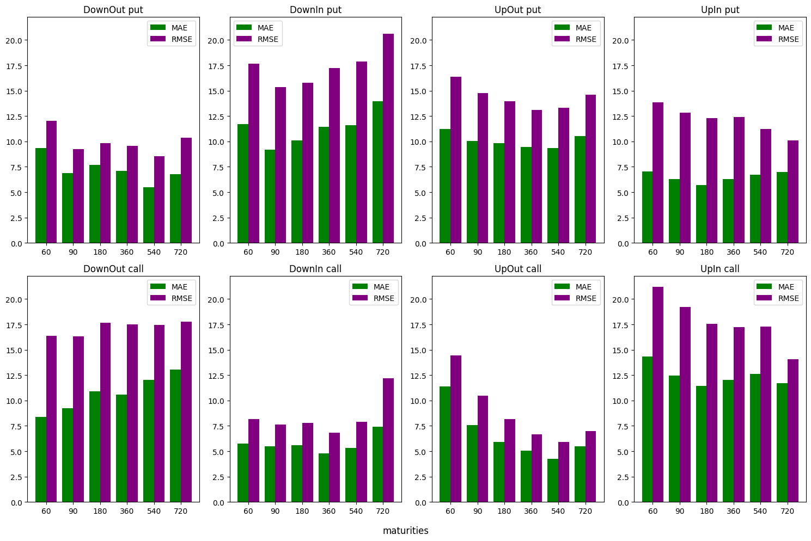

```python
import os
import modin.pandas as pd
import numpy as np
import matplotlib.pyplot as plt
from pathlib import Path
import warnings
warnings.filterwarnings("ignore", message=".*defaulting to pandas implementation.*")
pd.set_option('display.float_format', '{:.6f}'.format)
```

# Import Model


```python
jupyter_dir = os.path.abspath(str(Path()))
jupyter_dir
```


    'E:\\git\\machine-learning-option-pricing'


```python
models_path = os.path.join(jupyter_dir,'trained_models','trained_models')
models = os.listdir(models_path)
for i, path in enumerate(models):
    print(f"{i}   {path}")
```

    0   2024_10_09 23-01-12 Deep Neural Network otm
    1   2024_10_09 23-11-23 Deep Neural Network
    2   2024_10_10 11-56-07 Deep Neural Network
    3   2024_10_10 12-04-22 Deep Neural Network
    4   2024_10_11 10-19-52 Deep Neural Network
    5   2024_10_11 11-25-11 Deep Neural Network
    6   2024_10_11 12-08-00 Deep Neural Network
    7   2024_10_11 12-45-52 Deep Neural Network
    


```python
model = models[7]
model
```


    '2024_10_11 12-45-52 Deep Neural Network'


```python
model_path = os.path.join(models_path,model)
```


```python
model_files = os.listdir(model_path)
model_files
```


    ['2024_10_11 12-45-52 Deep Neural Network insample.csv',
     '2024_10_11 12-45-52 Deep Neural Network outsample.csv',
     '2024_10_11 12-45-52 Deep Neural Network.pkl',
     '2024_10_11 12-45-52 Deep Neural Network.txt']


```python
spec_path = os.path.join(model_path,[file for file in model_files if file.endswith('.txt')][0])
```
with open(spec_path, "r") as specs:
    for line in specs:
        print(line.strip())

```python
model_files
```


    ['2024_10_11 12-45-52 Deep Neural Network insample.csv',
     '2024_10_11 12-45-52 Deep Neural Network outsample.csv',
     '2024_10_11 12-45-52 Deep Neural Network.pkl',
     '2024_10_11 12-45-52 Deep Neural Network.txt']


```python
pd.reset_option("display.max_rows")
pd.reset_option("display.max_columns")
outsample_path = os.path.join(model_path,[file for file in model_files if file.find('outsample') != -1][0])
outsample = pd.read_csv(outsample_path).iloc[:,1:]
outsample
```

    2024-10-11 15:14:27,962	INFO worker.py:1786 -- Started a local Ray instance.
    


<div>
<style scoped>
    .dataframe tbody tr th:only-of-type {
        vertical-align: middle;
    }

    .dataframe tbody tr th {
        vertical-align: top;
    }

    .dataframe thead th {
        text-align: right;
    }
</style>
<table border="1" class="dataframe">
  <thead>
    <tr style="text-align: right;">
      <th></th>
      <th>calculation_date</th>
      <th>spot_price</th>
      <th>strike_price</th>
      <th>barrier</th>
      <th>days_to_maturity</th>
      <th>barrier_price</th>
      <th>updown</th>
      <th>outin</th>
      <th>w</th>
      <th>barrier_type_name</th>
      <th>...</th>
      <th>kappa</th>
      <th>rho</th>
      <th>eta</th>
      <th>v0</th>
      <th>expiration_date</th>
      <th>moneyness</th>
      <th>observed_price</th>
      <th>outofsample_target</th>
      <th>outofsample_prediction</th>
      <th>outofsample_error</th>
    </tr>
  </thead>
  <tbody>
    <tr>
      <th>0</th>
      <td>2008-06-26</td>
      <td>1283.570000</td>
      <td>1155.213000</td>
      <td>641.785000</td>
      <td>60</td>
      <td>8.333303</td>
      <td>Down</td>
      <td>Out</td>
      <td>put</td>
      <td>DownOut</td>
      <td>...</td>
      <td>1.421590</td>
      <td>-1.000000</td>
      <td>0.169391</td>
      <td>0.051732</td>
      <td>2008-08-25</td>
      <td>-0.948062</td>
      <td>8.496853</td>
      <td>8.496853</td>
      <td>4.940286</td>
      <td>-3.556568</td>
    </tr>
    <tr>
      <th>1</th>
      <td>2008-06-26</td>
      <td>1283.570000</td>
      <td>1155.213000</td>
      <td>641.785000</td>
      <td>90</td>
      <td>14.450123</td>
      <td>Down</td>
      <td>Out</td>
      <td>put</td>
      <td>DownOut</td>
      <td>...</td>
      <td>1.421590</td>
      <td>-1.000000</td>
      <td>0.169391</td>
      <td>0.051732</td>
      <td>2008-09-24</td>
      <td>-0.922092</td>
      <td>14.277631</td>
      <td>14.277631</td>
      <td>5.527019</td>
      <td>-8.750612</td>
    </tr>
    <tr>
      <th>2</th>
      <td>2008-06-26</td>
      <td>1283.570000</td>
      <td>1155.213000</td>
      <td>641.785000</td>
      <td>90</td>
      <td>0.000114</td>
      <td>Down</td>
      <td>In</td>
      <td>put</td>
      <td>DownIn</td>
      <td>...</td>
      <td>1.421590</td>
      <td>-1.000000</td>
      <td>0.169391</td>
      <td>0.051732</td>
      <td>2008-09-24</td>
      <td>-0.922092</td>
      <td>0.407132</td>
      <td>0.407132</td>
      <td>5.276474</td>
      <td>4.869342</td>
    </tr>
    <tr>
      <th>3</th>
      <td>2008-06-26</td>
      <td>1283.570000</td>
      <td>1155.213000</td>
      <td>641.785000</td>
      <td>180</td>
      <td>29.783522</td>
      <td>Down</td>
      <td>Out</td>
      <td>put</td>
      <td>DownOut</td>
      <td>...</td>
      <td>1.421590</td>
      <td>-1.000000</td>
      <td>0.169391</td>
      <td>0.051732</td>
      <td>2008-12-23</td>
      <td>-0.844185</td>
      <td>29.735953</td>
      <td>29.735953</td>
      <td>19.042632</td>
      <td>-10.693322</td>
    </tr>
    <tr>
      <th>4</th>
      <td>2008-06-26</td>
      <td>1283.570000</td>
      <td>1155.213000</td>
      <td>641.785000</td>
      <td>180</td>
      <td>0.601677</td>
      <td>Down</td>
      <td>In</td>
      <td>put</td>
      <td>DownIn</td>
      <td>...</td>
      <td>1.421590</td>
      <td>-1.000000</td>
      <td>0.169391</td>
      <td>0.051732</td>
      <td>2008-12-23</td>
      <td>-0.844185</td>
      <td>0.799405</td>
      <td>0.799405</td>
      <td>9.388062</td>
      <td>8.588657</td>
    </tr>
    <tr>
      <th>...</th>
      <td>...</td>
      <td>...</td>
      <td>...</td>
      <td>...</td>
      <td>...</td>
      <td>...</td>
      <td>...</td>
      <td>...</td>
      <td>...</td>
      <td>...</td>
      <td>...</td>
      <td>...</td>
      <td>...</td>
      <td>...</td>
      <td>...</td>
      <td>...</td>
      <td>...</td>
      <td>...</td>
      <td>...</td>
      <td>...</td>
      <td>...</td>
    </tr>
    <tr>
      <th>913080</th>
      <td>2008-09-26</td>
      <td>1214.590000</td>
      <td>1336.049000</td>
      <td>1821.885000</td>
      <td>360</td>
      <td>41.074382</td>
      <td>Up</td>
      <td>In</td>
      <td>call</td>
      <td>UpIn</td>
      <td>...</td>
      <td>10.371795</td>
      <td>-0.400391</td>
      <td>0.901972</td>
      <td>0.148215</td>
      <td>2009-09-21</td>
      <td>2.711247</td>
      <td>41.267661</td>
      <td>41.267661</td>
      <td>66.402945</td>
      <td>25.135284</td>
    </tr>
    <tr>
      <th>913081</th>
      <td>2008-09-26</td>
      <td>1214.590000</td>
      <td>1336.049000</td>
      <td>1821.885000</td>
      <td>540</td>
      <td>34.759713</td>
      <td>Up</td>
      <td>Out</td>
      <td>call</td>
      <td>UpOut</td>
      <td>...</td>
      <td>10.371795</td>
      <td>-0.400391</td>
      <td>0.901972</td>
      <td>0.148215</td>
      <td>2010-03-20</td>
      <td>1.474165</td>
      <td>34.835709</td>
      <td>34.835709</td>
      <td>32.007070</td>
      <td>-2.828638</td>
    </tr>
    <tr>
      <th>913082</th>
      <td>2008-09-26</td>
      <td>1214.590000</td>
      <td>1336.049000</td>
      <td>1821.885000</td>
      <td>540</td>
      <td>75.538637</td>
      <td>Up</td>
      <td>In</td>
      <td>call</td>
      <td>UpIn</td>
      <td>...</td>
      <td>10.371795</td>
      <td>-0.400391</td>
      <td>0.901972</td>
      <td>0.148215</td>
      <td>2010-03-20</td>
      <td>1.474165</td>
      <td>75.739054</td>
      <td>75.739054</td>
      <td>118.250957</td>
      <td>42.511903</td>
    </tr>
    <tr>
      <th>913083</th>
      <td>2008-09-26</td>
      <td>1214.590000</td>
      <td>1336.049000</td>
      <td>1821.885000</td>
      <td>720</td>
      <td>28.078404</td>
      <td>Up</td>
      <td>Out</td>
      <td>call</td>
      <td>UpOut</td>
      <td>...</td>
      <td>10.371795</td>
      <td>-0.400391</td>
      <td>0.901972</td>
      <td>0.148215</td>
      <td>2010-09-16</td>
      <td>0.855624</td>
      <td>27.885024</td>
      <td>27.885024</td>
      <td>28.650350</td>
      <td>0.765325</td>
    </tr>
    <tr>
      <th>913084</th>
      <td>2008-09-26</td>
      <td>1214.590000</td>
      <td>1336.049000</td>
      <td>1821.885000</td>
      <td>720</td>
      <td>105.840866</td>
      <td>Up</td>
      <td>In</td>
      <td>call</td>
      <td>UpIn</td>
      <td>...</td>
      <td>10.371795</td>
      <td>-0.400391</td>
      <td>0.901972</td>
      <td>0.148215</td>
      <td>2010-09-16</td>
      <td>0.855624</td>
      <td>105.898096</td>
      <td>105.898096</td>
      <td>137.650010</td>
      <td>31.751914</td>
    </tr>
  </tbody>
</table>
<p>913085 rows x 24 columns</p>
</div>


# Test Model


```python
maturities = outsample['days_to_maturity'].unique().tolist()
barrier_type_names = outsample['barrier_type_name'].unique().tolist()
ws = outsample['w'].unique().tolist()
print(f"\nmaturities:\n     maturities = {maturities}")
print(f"\ntypes:\n     barrier_type_names = {barrier_type_names}\n     ws = {ws}\n")
```

    
    maturities:
         maturities = [60, 90, 180, 360, 540, 720]
    
    types:
         barrier_type_names = ['DownOut', 'DownIn', 'UpOut', 'UpIn']
         ws = ['put', 'call']
    
    


```python
by_wbt = outsample.copy().set_index(['w','barrier_type_name','days_to_maturity']).sort_index()
```


```python
RMSE = pd.DataFrame(
    np.zeros((len(maturities),len(barrier_type_names)),dtype=float),
    columns = barrier_type_names,
    index = maturities
)

for t in maturities:
    for b in barrier_type_names:
        RMSE.loc[t,b] = np.sqrt(np.average((by_wbt.loc[(slice(None), b, t),'outofsample_error'])**2))
print(f"\nRMSE:\n{RMSE}")
```

    
    RMSE:
          DownOut    DownIn     UpOut      UpIn
    60  14.464611 14.128014 15.480705 17.892786
    90  13.411065 12.356520 12.897013 16.261613
    180 14.465497 12.516362 11.576552 15.133375
    360 14.285705 13.114471 10.551158 14.992325
    540 13.917252 13.824221 10.457383 14.569312
    720 14.729111 16.942909 11.628011 12.237543
    


```python
MAE = pd.DataFrame(
    np.zeros((len(maturities),len(barrier_type_names)),dtype=float),
    index = maturities,
    columns = barrier_type_names
)
for t in maturities:
    for b in barrier_type_names:
        MAE.loc[t,b] = np.average(np.abs(by_wbt.loc[(slice(None), b, t),'outofsample_error']))
print(f"\nMAE:\n{MAE}")
```

    
    MAE:
          DownOut    DownIn     UpOut      UpIn
    60   8.839602  8.984878 11.286540 10.667579
    90   8.099856  7.428498  8.875588  9.300975
    180  9.357800  7.874801  7.970261  8.553640
    360  8.917415  8.109636  7.344790  9.163510
    540  8.906035  8.457959  6.927285  9.689336
    720 10.057571 10.703680  8.126924  9.337396
    


```python
MAE
```


<div>
<style scoped>
    .dataframe tbody tr th:only-of-type {
        vertical-align: middle;
    }

    .dataframe tbody tr th {
        vertical-align: top;
    }

    .dataframe thead th {
        text-align: right;
    }
</style>
<table border="1" class="dataframe">
  <thead>
    <tr style="text-align: right;">
      <th></th>
      <th>DownOut</th>
      <th>DownIn</th>
      <th>UpOut</th>
      <th>UpIn</th>
    </tr>
  </thead>
  <tbody>
    <tr>
      <th>60</th>
      <td>8.839602</td>
      <td>8.984878</td>
      <td>11.286540</td>
      <td>10.667579</td>
    </tr>
    <tr>
      <th>90</th>
      <td>8.099856</td>
      <td>7.428498</td>
      <td>8.875588</td>
      <td>9.300975</td>
    </tr>
    <tr>
      <th>180</th>
      <td>9.357800</td>
      <td>7.874801</td>
      <td>7.970261</td>
      <td>8.553640</td>
    </tr>
    <tr>
      <th>360</th>
      <td>8.917415</td>
      <td>8.109636</td>
      <td>7.344790</td>
      <td>9.163510</td>
    </tr>
    <tr>
      <th>540</th>
      <td>8.906035</td>
      <td>8.457959</td>
      <td>6.927285</td>
      <td>9.689336</td>
    </tr>
    <tr>
      <th>720</th>
      <td>10.057571</td>
      <td>10.703680</td>
      <td>8.126924</td>
      <td>9.337396</td>
    </tr>
  </tbody>
</table>
</div>


```python
errors_bypayoff = {}
for w in ws:
    errors = {}
    print(
        f"\n         {'#'*(len(w)+5)}"
        f"\n         # {w}s #"
        f"\n         {'#'*(len(w)+5)}"
    )
    RMSE = pd.DataFrame(
        np.zeros((len(maturities),len(barrier_type_names)),dtype=float),
        columns = barrier_type_names
        )
    RMSE[w] = maturities
    RMSE = RMSE.set_index(w,drop=True)
    for t in maturities:
        for b in barrier_type_names:
            RMSE.loc[t,b] = np.sqrt(np.average((by_wbt.loc[(w, b, t),'outofsample_error'])**2))
    print(f"RMSE:\n{RMSE}")
    print()
    errors['RMSE'] = RMSE
    


    MAE = pd.DataFrame(
        np.zeros((len(maturities),len(barrier_type_names)),dtype=float),
        columns = barrier_type_names
    )
    MAE[w] = maturities
    MAE = MAE.set_index(w,drop=True)
    for t in maturities:
        for b in barrier_type_names:
            MAE.loc[t,b] = np.average(np.abs(by_wbt.loc[(w, b, t),'outofsample_error']))
    print(f"MAE:\n{MAE}")
    print()
    errors['MAE'] = MAE
    errors_bypayoff[w] = errors
```

    
             ########
             # puts #
             ########
    RMSE:
          DownOut    DownIn     UpOut      UpIn
    put                                        
    60  12.039250 17.669908 16.367519 13.842776
    90   9.247909 15.369560 14.768029 12.824167
    180  9.839677 15.790292 13.974619 12.290799
    360  9.561107 17.239101 13.125419 12.384195
    540  8.518274 17.871992 13.302676 11.220778
    720 10.360973 20.626447 14.620890 10.102537
    
    MAE:
         DownOut    DownIn     UpOut     UpIn
    put                                      
    60  9.346600 11.707462 11.204323 7.016355
    90  6.870979  9.164596 10.056196 6.285447
    180 7.684554 10.075869  9.847285 5.708505
    360 7.111389 11.444895  9.445869 6.295932
    540 5.465944 11.587998  9.335758 6.743239
    720 6.759296 13.970801 10.505010 6.985419
    
    
             #########
             # calls #
             #########
    RMSE:
           DownOut    DownIn     UpOut      UpIn
    call                                        
    60   16.358255  8.153145 14.441160 21.197449
    90   16.294504  7.632583 10.455939 19.193996
    180  17.644780  7.803632  8.156888 17.547337
    360  17.503790  6.840476  6.648436 17.209630
    540  17.426271  7.925281  5.907854 17.280737
    720  17.789343 12.193195  6.977899 14.051821
    
    MAE:
           DownOut   DownIn     UpOut      UpIn
    call                                       
    60    8.379247 5.766678 11.377087 14.337287
    90    9.215675 5.466139  7.575360 12.436806
    180  10.877108 5.600376  5.903054 11.432889
    360  10.557287 4.774377  5.030827 12.031087
    540  12.029638 5.327920  4.274782 12.635434
    720  13.052405 7.436559  5.507887 11.689373
    
    


```python
max_MAE = max(errors['MAE'].values.flatten())
max_RMSE = max(errors['RMSE'].values.flatten())
plot_height = max(max_RMSE,max_MAE)*1.05
maturities = errors['MAE'].index.astype(str).tolist()
```


```python
fig, axs = plt.subplots(2, 4, figsize=(15,10))
bar_width = 0.4
i = 0
for w, errors in errors_bypayoff.items():
    for b in barrier_type_names:
        MAE = errors['MAE'][b]
        RMSE = errors['RMSE'][b]
        
        x_positions = range(len(maturities))
        
        axs[i // 4, i % 4].bar(
            [x - 0.5 * bar_width for x in x_positions], MAE, width=bar_width, color='green',label="MAE"
        )
        
        axs[i // 4, i % 4].bar(
            [x + 0.5 * bar_width for x in x_positions], RMSE, width=bar_width, color='purple', label="RMSE"
        )

        axs[i // 4, i % 4].set_title(f'{b} {w}')
        axs[i // 4, i % 4].set_xticks(x_positions)
        axs[i // 4, i % 4].set_xticklabels(maturities)
        axs[i // 4, i % 4].set_ylim(0, plot_height)
        
        axs[i // 4, i % 4].legend()

        i += 1

fig.supxlabel('maturities')

plt.tight_layout()
plt.show()
```


    

    


```python

```
