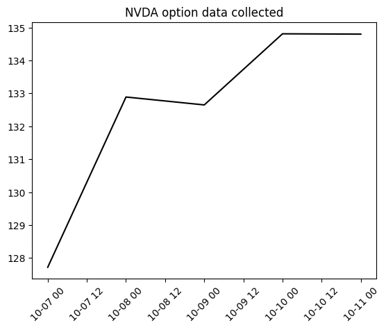
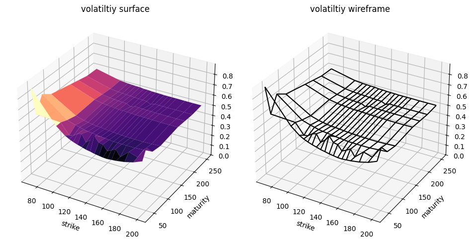
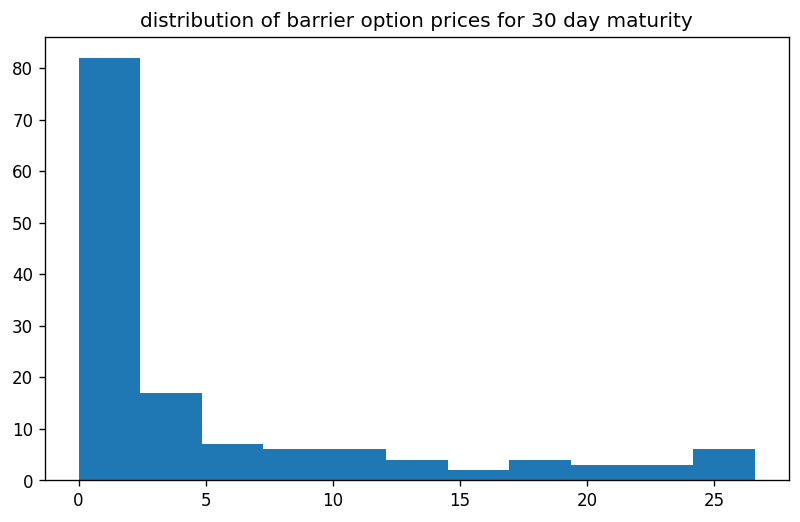
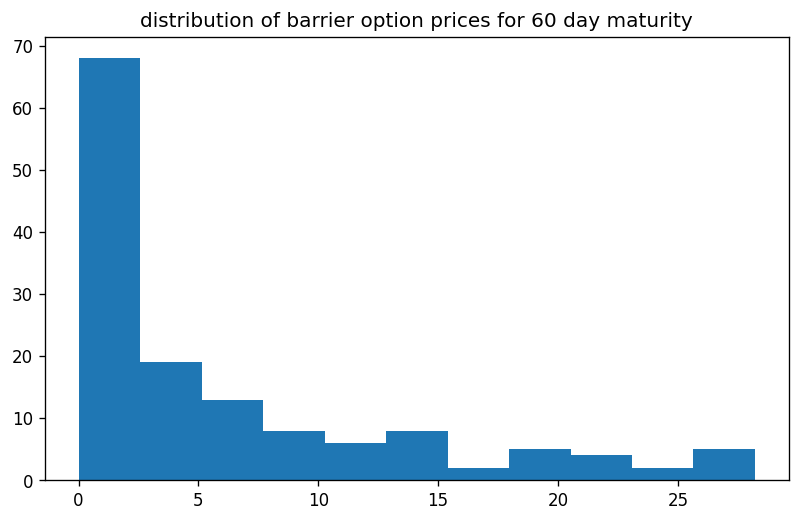
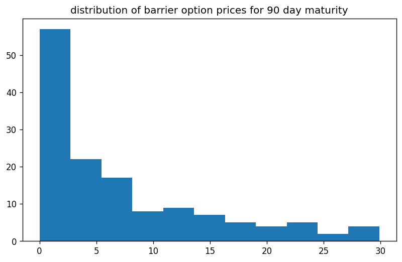
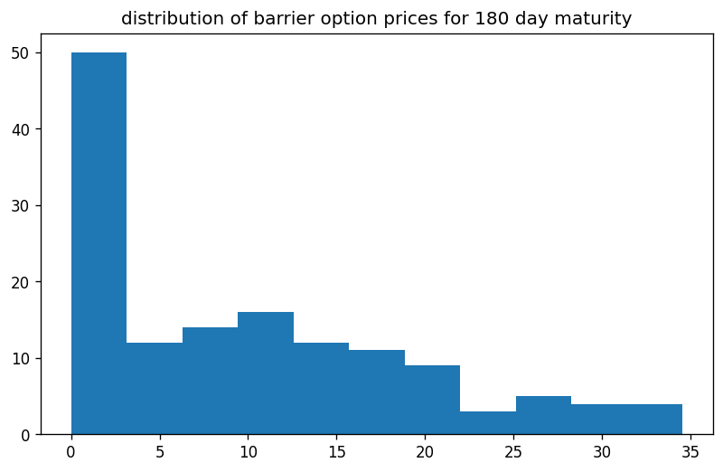
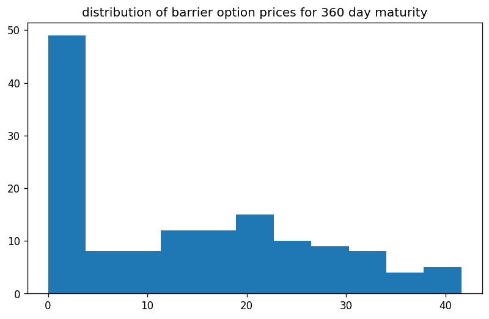
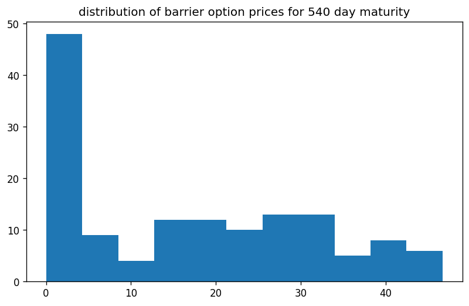
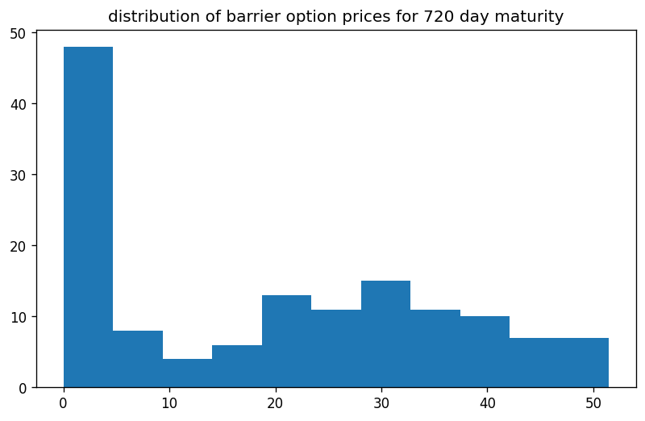

```python
import os
import sys
import requests
import pandas as pd
import numpy as np
import QuantLib as ql
from pathlib import Path
import matplotlib.pyplot as plt
from tqdm import tqdm
from itertools import product
from datetime import datetime
from datetime import timedelta
from model_settings import ms
from historical_av_plot_vol_surface import plot_vol_surface

symbol='NVDA'
url = str(
	'https://www.alphavantage.co/query?function=TIME_SERIES_DAILY&symbol='+
	symbol+'&outputsize=full&apikey='+
	ms.av_key)
print(symbol)
r = requests.get(url)
spots = pd.Series(pd.DataFrame(r.json()['Time Series (Daily)']).transpose()['4. close'].squeeze())
spots = pd.to_numeric(spots,errors='coerce')
print(spots)
```

    
    pricing settings:
    Actual/365 (Fixed) day counter
    New York stock exchange calendar
    compounding: continuous
    frequency: annual
    
    NVDA
    2024-10-11    134.80
    2024-10-10    134.81
    2024-10-09    132.65
    2024-10-08    132.89
    2024-10-07    127.72
                   ...  
    1999-11-05     28.25
    1999-11-04     29.19
    1999-11-03     27.44
    1999-11-02     25.00
    1999-11-01     23.50
    Name: 4. close, Length: 6277, dtype: float64
    

# example data collection

let us collect a few recent trading days and inspect the data


```python
dates = spots.index
dates = pd.Series(dates[:5])
print(dates)
```

    0    2024-10-11
    1    2024-10-10
    2    2024-10-09
    3    2024-10-08
    4    2024-10-07
    dtype: object
    


```python
from historical_alphaVantage_collection import collect_av_link
chain = {}
bar = tqdm(total=len(dates))
for date in dates:
    spot = float(spots[date])
    link = collect_av_link(date,spot,symbol)
    printdate = datetime.strptime(date, '%Y-%m-%d').strftime('%A, %Y-%m-%d')
    chain[date] = link
    bar.update(1)
bar.close()
```

    100%|████████████████████████████████████████████████████████████████████████████████████| 5/5 [00:06<00:00,  1.20s/it]
    


```python
demo_spots = spots[dates]
demo_spots.index = pd.to_datetime(demo_spots.index, format='%Y-%m-%d')
plt.figure()
plt.plot(demo_spots,color='black')
plt.title(f'{symbol} option data collected')
plt.xticks(rotation=45)
plt.show()
plt.clf()
```


    

    


    <Figure size 640x480 with 0 Axes>


# example calibraion

now why not select the one trading day and porceed with an example calibration of our Heston (1993) model


```python
date = dates[0]
raw_data = chain[date]
calculation_datetime = datetime.strptime(date,'%Y-%m-%d')
calculation_date = ql.Date(
    calculation_datetime.day,
    calculation_datetime.month,
    calculation_datetime.year,
)
notebook_printdate = str(calculation_datetime.strftime('%A, '))+str(calculation_date)
print(notebook_printdate)
```

    Friday, October 11th, 2024
    

## modelling the volatility surface


```python
df = raw_data.copy()
columns_to_convert = ['strike', 'last', 'mark',
       'bid', 'bid_size', 'ask', 'ask_size', 'volume', 'open_interest',
       'implied_volatility', 'delta', 'gamma', 'theta', 'vega', 'rho']
df[columns_to_convert] = df[
    columns_to_convert].apply(pd.to_numeric, errors='coerce')

df['expiration'] = pd.to_datetime(df['expiration'],format='%Y-%m-%d')
df['date'] = pd.to_datetime(df['date'],format='%Y-%m-%d')
df['days_to_maturity'] = df['expiration'] - df['date']
df['days_to_maturity'] = df['days_to_maturity'] / np.timedelta64(1, 'D')
df['days_to_maturity'] = df['days_to_maturity'].astype('int64')
df = df[(df['days_to_maturity']>=30)&(df['days_to_maturity']<=400)]

df = df[df['volume']>0].copy()
df['spot_price'] = spot

df['moneyness'] = ms.vmoneyness(df['spot_price'],df['strike'],df['type'])
df = df[(df['moneyness']<0)&(df['moneyness']>-0.5)]
indexed = df.copy().set_index(['strike','days_to_maturity'])

T = np.sort(df['days_to_maturity'].unique()).tolist()
K = np.sort(df['strike'].unique()).tolist()
volume_heatmap = pd.DataFrame(
    np.full((len(K), len(T)), np.nan), index=K, columns=T)
for k in K:
    for t in T:
        try:
            volume_heatmap.loc[k,t] = indexed.loc[(k,t),'volume']
        except Exception:
            pass
        
        
hottest_contracts = pd.DataFrame(
    volume_heatmap.unstack().sort_values(
        ascending=False)).head(50).reset_index()
hottest_contracts.columns = ['t','k','volume']
T = np.sort(hottest_contracts['t'].unique()).tolist()
K = np.sort(hottest_contracts['k'].unique()).tolist()

vol_matrix = pd.DataFrame(
    np.full((len(K),len(T)),np.nan),
    index = K,
    columns = T
)
for k in K:
    for t in T:
        try:
            vol_matrix.loc[k,t] = indexed.loc[(k,float(t)),'implied_volatility']
        except Exception:
            pass

vol_matrix = vol_matrix.dropna().copy()
T = vol_matrix.columns.tolist()
K = vol_matrix.index.tolist()

cols_to_map = [
        'contractID', 'symbol', 'expiration', 'type', 'last', 'mark',
        'bid', 'bid_size', 'ask', 'ask_size', 'volume', 'open_interest', 'date',
        'implied_volatility', 'delta', 'gamma', 'theta', 'vega', 'rho',
        'spot_price', 'moneyness'
]
for col in cols_to_map:
    for i,row in hottest_contracts.iterrows():
        hottest_contracts.at[i,col] = indexed.loc[(row['k'],row['t']),col]
        
hottest_contracts = hottest_contracts.rename(
    columns={'t':'days_to_maturity','k':'strike_price'}).copy()
```


```python
s = float(df['spot_price'].unique()[0])
print(f"\n{symbol} spot price: {s}")
print(f"\n{vol_matrix}\n")
plot_vol_surface(vol_matrix)
```

    
    NVDA spot price: 127.72
    
               35       49       70       98       161      188      217      252
    70.0   0.89969  0.61311  0.75427  0.69055  0.64253  0.62226  0.60031  0.59573
    100.0  0.60213  0.60244  0.57500  0.55000  0.55823  0.54802  0.53826  0.54208
    110.0  0.53720  0.50427  0.55046  0.52668  0.54497  0.53659  0.52927  0.53415
    115.0  0.51509  0.51174  0.54040  0.51951  0.53948  0.53217  0.52576  0.53156
    120.0  0.49848  0.54131  0.53110  0.51266  0.53583  0.52958  0.52348  0.52942
    125.0  0.48537  0.55381  0.52500  0.50747  0.53201  0.52698  0.52180  0.52836
    130.0  0.47424  0.48491  0.52073  0.50610  0.52805  0.52516  0.51860  0.52317
    135.0  0.46266  0.51616  0.51555  0.50183  0.52942  0.50534  0.51570  0.52256
    140.0  0.45595  0.57058  0.51067  0.49802  0.52668  0.52043  0.51448  0.51921
    145.0  0.44680  0.51967  0.50808  0.49513  0.52455  0.51830  0.51266  0.51830
    150.0  0.44147  0.51113  0.50336  0.49238  0.52287  0.51708  0.49330  0.51738
    155.0  0.43598  0.46296  0.49970  0.49025  0.52211  0.51525  0.50945  0.51525
    160.0  0.43476  0.48247  0.49985  0.48872  0.52089  0.51494  0.50595  0.51555
    165.0  0.43933  0.50534  0.49894  0.48766  0.52028  0.51387  0.50793  0.51509
    170.0  0.44314  0.44330  0.49817  0.48735  0.51891  0.51372  0.50519  0.51525
    180.0  0.45656  0.51509  0.49985  0.48781  0.51769  0.51311  0.50702  0.51418
    190.0  0.47836  0.49101  0.50671  0.49101  0.51814  0.51311  0.50732  0.51387
    200.0  0.51311  0.60625  0.51387  0.49650  0.51951  0.51357  0.50763  0.51433
    
    


    

    


    <Figure size 640x480 with 0 Axes>


## calibrating a Heston (1993) model


```python
vol_matrix = vol_matrix.sort_index().drop_duplicates()
pd.to_numeric(raw_data['last'])
raw_data['date'] = pd.to_datetime(raw_data['date'])
raw_data['expiration'] = pd.to_datetime(raw_data['expiration'])
raw_data['implied_volatility'] = pd.to_numeric(raw_data['implied_volatility']).astype(float)
raw_data['strike'] = pd.to_numeric(raw_data['strike'])
raw_data['last'] = pd.to_numeric(raw_data['last'])
contract_maturities = np.array((raw_data['expiration'] - raw_data['date']) / timedelta(days=1)).astype(int)
raw_data['days_to_maturity'] = contract_maturities

T = vol_matrix.columns.tolist()
K = vol_matrix.index.tolist()
r = 0.04
g = 0.0

ql.Settings.instance().evaluationDate = calculation_date
flat_ts, dividend_ts = ms.ql_ts_rg(r, g, calculation_date)
S_handle = ql.QuoteHandle(ql.SimpleQuote(s))

heston_helpers = []
v0 = 0.01; kappa = 0.2; theta = 0.02; rho = -0.75; eta = 0.5;
process = ql.HestonProcess(
    flat_ts,
    dividend_ts,
    S_handle,
    v0,                # Initial volatility
    kappa,             # Mean reversion speed
    theta,             # Long-run variance (volatility squared)
    eta,               # Volatility of the volatility
    rho                # Correlation between asset and volatility
)
model = ql.HestonModel(process)
engine = ql.AnalyticHestonEngine(model)

for t in T:
    for k in K:
        p = ql.Period(int(t),ql.Days)
        volatility = vol_matrix.loc[k,t]
        helper = ql.HestonModelHelper(
            p, ms.calendar, float(s), k, 
            ql.QuoteHandle(ql.SimpleQuote(volatility)), 
            flat_ts, 
            dividend_ts
            )
        helper.setPricingEngine(engine)
        heston_helpers.append(helper)

lm = ql.LevenbergMarquardt(1e-8, 1e-8, 1e-8)


model.calibrate(heston_helpers, lm,
                  ql.EndCriteria(1000, 50, 1.0e-8,1.0e-8, 1.0e-8))

theta, kappa, eta, rho, v0 = model.params()
heston_parameters = pd.Series(
    [theta, kappa, eta, rho, v0],
    index = ['theta', 'kappa', 'eta', 'rho', 'v0'],
    dtype = float
)
calibration_test_data = raw_data.copy()[['strike','type','last','implied_volatility','days_to_maturity']]
calibration_test_data.columns = ['strike_price','w','market_price','volatility','days_to_maturity']
calibration_test_data['spot_price'] = s
calibration_test_data['risk_free_rate'] = r
calibration_test_data['dividend_rate'] = g
calibration_test_data = calibration_test_data[calibration_test_data['days_to_maturity'].isin(df['days_to_maturity'])]
calibration_test_data[heston_parameters.index.tolist()] = np.tile(heston_parameters,(calibration_test_data.shape[0],1))
calibration_test_data.loc[:,'moneyness'] = ms.vmoneyness(
    calibration_test_data['spot_price'].values,
    calibration_test_data['strike_price'].values,
    calibration_test_data['w'].values)
calibration_test_data['calculation_date'] = calculation_datetime
calibration_test_data['black_scholes'] = ms.vector_black_scholes(calibration_test_data)
calibration_test_data['heston_price'] = ms.vector_heston_price(calibration_test_data)
```

## testing calibration accuracy


```python
calibration_test_data.loc[:,'error'] = calibration_test_data['heston_price'].values - calibration_test_data['black_scholes'].values
avg = np.mean(np.abs(calibration_test_data['error']))
print(f"\n{printdate}\n{heston_parameters}\naverage absolute error: {round(avg,3)}")
print(f"calibration testing dataset:\n{calibration_test_data.describe()}")
```

    
    Monday, 2024-10-07
    theta    0.354435
    kappa    5.625730
    eta      1.895844
    rho     -0.296811
    v0       0.196002
    dtype: float64
    average absolute error: 0.48
    calibration testing dataset:
           strike_price  market_price   volatility  days_to_maturity  spot_price  \
    count   3710.000000   3710.000000  3710.000000       3710.000000     3710.00   
    mean     112.509434     23.585275     0.703703        139.626415      127.72   
    min        0.500000      0.000000     0.042260         35.000000      127.72   
    25%       57.500000      0.000000     0.515740         70.000000      127.72   
    50%      106.000000      5.540000     0.559000         98.000000      127.72   
    75%      164.000000     39.152500     0.724042        217.000000      127.72   
    max      280.000000    139.550000     6.601530        343.000000      127.72   
    std       67.778216     32.884901     0.483879         92.253096        0.00   
    
           risk_free_rate  dividend_rate         theta         kappa  \
    count    3.710000e+03         3710.0  3.710000e+03  3.710000e+03   
    mean     4.000000e-02            0.0  3.544347e-01  5.625730e+00   
    min      4.000000e-02            0.0  3.544347e-01  5.625730e+00   
    25%      4.000000e-02            0.0  3.544347e-01  5.625730e+00   
    50%      4.000000e-02            0.0  3.544347e-01  5.625730e+00   
    75%      4.000000e-02            0.0  3.544347e-01  5.625730e+00   
    max      4.000000e-02            0.0  3.544347e-01  5.625730e+00   
    std      6.939829e-18            0.0  5.551863e-17  1.776596e-15   
    
                    eta          rho            v0    moneyness  \
    count  3.710000e+03  3710.000000  3.710000e+03  3710.000000   
    mean   1.895844e+00    -0.296811  1.960019e-01     1.464735   
    min    1.895844e+00    -0.296811  1.960019e-01    -0.996085   
    25%    1.895844e+00    -0.296811  1.960019e-01    -0.365800   
    50%    1.895844e+00    -0.296811  1.960019e-01     0.000002   
    75%    1.895844e+00    -0.296811  1.960019e-01     0.576790   
    max    1.895844e+00    -0.296811  1.960019e-01   254.440000   
    std    8.882981e-16     0.000000  5.551863e-17    11.699363   
    
              calculation_date  black_scholes  heston_price        error  
    count                 3710    3710.000000   3710.000000  3710.000000  
    mean   2024-10-11 00:00:00      33.138019     32.799657    -0.338363  
    min    2024-10-11 00:00:00       0.001913      0.000000    -7.382476  
    25%    2024-10-11 00:00:00       1.332189      1.153085    -0.482404  
    50%    2024-10-11 00:00:00      15.471997     15.430097    -0.183782  
    75%    2024-10-11 00:00:00      58.262060     57.859708    -0.012211  
    max    2024-10-11 00:00:00     152.219289    151.208117     2.111488  
    std                    NaN      37.990831     37.693878     0.757278  
    

# train data generation
now that we have calibrated our pricing engine, let us proceed with generating 
all real down barrier option contract combinations for this trading day
(i.e., all barriers less than underlying spot price)

```python
K = np.linspace(s*0.8,s*1.2,7).astype(int).tolist()
down_barriers =  np.linspace(s*0.5,s*0.99,5).astype(int).tolist()
T = [
    30,60,90,
    180,360,540,720
]
print(f"\n{symbol} spot price:\n     {spot}\nstrikes:\n     {K}\n\nbarriers:\n     {down_barriers}\n\nmaturities:\n     {T}\n")
```

    
    NVDA spot price:
         127.72
    strikes:
         [102, 110, 119, 127, 136, 144, 153]
    
    barriers:
         [63, 79, 95, 110, 126]
    
    maturities:
         [30, 60, 90, 180, 360, 540, 720]
    
    


```python
features = pd.DataFrame(
    product(
        [spot],
        K,
        T,
        down_barriers,
        [0.0], # rebate
        ['put','call'],
        [0.04], # risk-free rate
        [0.0], # dividend rate
        [theta], 
        [kappa], 
        [eta], 
        [rho], 
        [v0],
        [calculation_datetime],
        ['Out','In']
    ),
    columns = [
        'spot_price',
        'strike_price',
        'days_to_maturity',
        'barrier',
        'rebate',
        'w',
        'risk_free_rate',
        'dividend_rate',
        'theta', 'kappa', 'eta', 'rho', 'v0',
        'calculation_date',
        'outin',
    ]
)
features['moneyness'] = ms.vmoneyness(features['spot_price'],features['strike_price'],features['w'])
features['barrier_type_name'] = 'Down' + features['outin']
features['vanilla_price'] = ms.vector_heston_price(features)
features['barrier_price'] = ms.vector_barrier_price(features)
featuresby_t = features.copy().set_index('days_to_maturity')
```


```python
for t in T:
    plt.figure(figsize=plt.figaspect(0.6),dpi=120)
    prices= featuresby_t.loc[t,'barrier_price']
    plt.hist(prices,bins=int(np.sqrt(prices.shape[0])))
    plt.title(f'distribution of barrier option prices for {t} day maturity')
    plt.show()
    plt.clf()
```


    

    


    <Figure size 640x480 with 0 Axes>


    

    


    <Figure size 640x480 with 0 Axes>


    

    


    <Figure size 640x480 with 0 Axes>


    

    


    <Figure size 640x480 with 0 Axes>


    

    


    <Figure size 640x480 with 0 Axes>


    

    


    <Figure size 640x480 with 0 Axes>


    

    


    <Figure size 640x480 with 0 Axes>


# model training
now that we have a dataset, we can for example, test whether our model is able to predict 
the prices of our two year barrier options while only having seen the others in training

```python
import convsklearn
help(convsklearn)
```

    a proprietary package of convenience wrappers for sklearn
    test size: 1.0%
    random state: None
    maximum iterations: 1000
    
    target: 
    observed_price
    
    features: 
    ['spot_price', 'strike_price', 'days_to_maturity', 'risk_free_rate', 'dividend_rate', 'kappa', 'theta', 'rho', 'eta', 'v0', 'barrier', 'barrier_type_name', 'w']
    
    feature transformer(s):
    ('StandardScaler', StandardScaler(), ['spot_price', 'strike_price', 'days_to_maturity', 'risk_free_rate', 'dividend_rate', 'kappa', 'theta', 'rho', 'eta', 'v0', 'barrier'])
    
    ('OneHotEncoder', OneHotEncoder(sparse_output=False), ['barrier_type_name', 'w'])
    
    target transformer(s):
    StandardScaler()
    
    Help on package convsklearn:
    
    NAME
        convsklearn
    
    PACKAGE CONTENTS
        convsklearn
    
    DATA
        barrier_trainer = <convsklearn.convsklearn.convsklearn object>
        categorical_features = ['barrier_type_name', 'w']
        feature_set = ['spot_price', 'strike_price', 'days_to_maturity', 'risk...
        numerical_features = ['spot_price', 'strike_price', 'days_to_maturity'...
        target_name = 'observed_price'
        target_transformer_pipeline = Pipeline(steps=[('StandardScaler', Stand...
        transformers = [('StandardScaler', StandardScaler(), ['spot_price', 's...
    
    FILE
        e:\python\lib\site-packages\convsklearn\__init__.py
    
    
    


```python
help(convsklearn.convsklearn)
```

    Help on class convsklearn in module convsklearn.convsklearn:
    
    class convsklearn(builtins.object)
     |  convsklearn(target_name, numerical_features, categorical_features, transformers, target_transformer_pipeline, n_layers=None, random_state=None, test_size=0.01, max_iter=1000, solver='sgd', alpha=0.0001, learning_rate='adaptive', activation_function='relu', rf_n_estimators=50, rf_min_samples_leaf=2000)
     |
     |  Methods defined here:
     |
     |  __init__(self, target_name, numerical_features, categorical_features, transformers, target_transformer_pipeline, n_layers=None, random_state=None, test_size=0.01, max_iter=1000, solver='sgd', alpha=0.0001, learning_rate='adaptive', activation_function='relu', rf_n_estimators=50, rf_min_samples_leaf=2000)
     |      Initialize self.  See help(type(self)) for accurate signature.
     |
     |  get_train_test_arrays(self, train_data, test_data, feature_set=None, target_name=None)
     |
     |  plot_model_performance(self, df, X_name, Y_name, xlabel, ylabel, runtime, title)
     |
     |  preprocess(self)
     |
     |  run_dnn(self, preprocessor, train_X, train_y)
     |
     |  run_lm(self, train_X, train_y)
     |
     |  run_nnet(self, preprocessor, train_X, train_y)
     |
     |  run_rf(self, preprocessor, train_X, train_y)
     |
     |  test_model(self, test_data, test_X, test_y, model_fit)
     |
     |  test_prediction_accuracy(self, model_fit, test_data, train_data)
     |
     |  ----------------------------------------------------------------------
     |  Data descriptors defined here:
     |
     |  __dict__
     |      dictionary for instance variables
     |
     |  __weakref__
     |      list of weak references to the object
    
    


```python
from convsklearn import target_name, numerical_features, categorical_features, transformers, target_transformer_pipeline
```


```python
barrier_trainer = convsklearn.convsklearn(
    target_name=target_name, 
    numerical_features=numerical_features, 
    categorical_features=categorical_features, 
    transformers=transformers, 
    target_transformer_pipeline=target_transformer_pipeline, 
    max_iter=1000
)
```

    test size: 1.0%
    random state: None
    maximum iterations: 1000
    
    target: 
    observed_price
    
    features: 
    ['spot_price', 'strike_price', 'days_to_maturity', 'risk_free_rate', 'dividend_rate', 'kappa', 'theta', 'rho', 'eta', 'v0', 'barrier', 'barrier_type_name', 'w']
    
    feature transformer(s):
    ('StandardScaler', StandardScaler(), ['spot_price', 'strike_price', 'days_to_maturity', 'risk_free_rate', 'dividend_rate', 'kappa', 'theta', 'rho', 'eta', 'v0', 'barrier'])
    
    ('OneHotEncoder', OneHotEncoder(sparse_output=False), ['barrier_type_name', 'w'])
    
    target transformer(s):
    StandardScaler()
    
    


```python
features['observed_price'] = ms.noisyfier(features.loc[:,'barrier_price']) 
    # apply slight peturbation in the form of a random normal with standard deviation 0.15
train_data = features[features['days_to_maturity']!=720]
test_data = features[features['days_to_maturity']==720]
print(f"train data count: {train_data.shape[0]}")
print(f"test data count: {test_data.shape[0]}")
arrs = barrier_trainer.get_train_test_arrays(train_data,test_data)
train_X = arrs['train_X']
train_y = arrs['train_y']
test_X = arrs['test_X']
test_y = arrs['train_y']
preprocessor = barrier_trainer.preprocess()
dnn_barriers, runtime, specs = barrier_trainer.run_dnn(preprocessor, train_X, train_y)
in_sample, out_of_sample, errors = barrier_trainer.test_prediction_accuracy(dnn_barriers, test_data, train_data)
outsample = out_of_sample.rename(
    columns = {
        'strike_price':'k',
        'days_to_maturity':'t',
        'barrier_type_name':'type',
        'barrier_price':'price',
        'vanilla_price':'vanilla',
        'spot_price':'spot',
        'outofsample_target':'target', 
        'outofsample_prediction':'dnn', 
        'outofsample_error' : 'error',
        'barrier':'b'
        }
)
outsample = outsample[[
    'spot', 'k', 'b','price', 'vanilla', 'type', 'w','t', 
    'target', 'dnn', 'error'
]]
pd.set_option("display.float_format", "{:.2f}".format)
pd.set_option("display.max_rows",None)
print(f"\n{outsample.describe()}")
outsample_preview = outsample.copy().sort_values(by=['w','type','k','b'],ascending=False).reset_index(drop=True)
print(f"\n{symbol} down barrier options for {notebook_printdate}")
print(f"\n{outsample_preview}")
pd.reset_option("display.max_rows")
pd.reset_option("display.float_format") 
```

    train data count: 840
    test data count: 140
    
    training...
    
    Deep Neural Network
    hidden layers sizes: (13, 13, 13)
    learning rate: adaptive
    activation: relu
    solver: sgd
    alpha: 0.0001
    
    in sample:
         RSME: 2.6018013039764103
         MAE: 1.8664083933152358
    
    out of sample:
         RSME: 7.1738518060054215
         MAE: 5.534212539080165
    
            spot      k      b  price  vanilla      t  target    dnn  error
    count 140.00 140.00 140.00 140.00   140.00 140.00  140.00 140.00 140.00
    mean  127.72 127.29  94.60  19.20    38.38 720.00   19.20  22.58   3.38
    std     0.00  17.06  22.28  16.27     9.49   0.00   16.27  15.00   6.35
    min   127.72 102.00  63.00   0.00    20.17 720.00    0.00  -0.69 -18.43
    25%   127.72 110.00  79.00   1.99    32.66 720.00    1.95   7.34   0.28
    50%   127.72 127.00  95.00  19.59    38.75 720.00   19.50  23.76   3.22
    75%   127.72 144.00 110.00  32.69    46.15 720.00   32.84  35.50   6.51
    max   127.72 153.00 126.00  51.45    53.63 720.00   51.65  48.48  15.31
    
    NVDA down barrier options for Friday, October 11th, 2024
    
          spot    k    b  price  vanilla     type     w    t  target   dnn  error
    0   127.72  153  126   0.00    48.01  DownOut   put  720    0.08  5.52   5.44
    1   127.72  153  110   0.18    48.01  DownOut   put  720    0.28  6.78   6.51
    2   127.72  153   95   0.91    48.01  DownOut   put  720    1.03  6.50   5.47
    3   127.72  153   79   3.19    48.01  DownOut   put  720    3.01  7.39   4.38
    4   127.72  153   63   8.28    48.01  DownOut   put  720    8.40 14.94   6.53
    5   127.72  144  126   0.00    42.46  DownOut   put  720    0.06  3.94   3.88
    6   127.72  144  110   0.10    42.46  DownOut   put  720    0.12  3.23   3.11
    7   127.72  144   95   0.59    42.46  DownOut   put  720    0.33  2.74   2.42
    8   127.72  144   79   2.31    42.46  DownOut   put  720    2.23  4.94   2.71
    9   127.72  144   63   6.50    42.46  DownOut   put  720    6.54 11.66   5.11
    10  127.72  136  126   0.00    37.73  DownOut   put  720    0.00  2.91   2.91
    11  127.72  136  110   0.05    37.73  DownOut   put  720    0.00  1.84   1.84
    12  127.72  136   95   0.37    37.73  DownOut   put  720    0.73  1.77   1.04
    13  127.72  136   79   1.66    37.73  DownOut   put  720    1.63  2.71   1.08
    14  127.72  136   63   5.09    37.73  DownOut   put  720    5.19  9.53   4.34
    15  127.72  127  126   0.00    32.66  DownOut   put  720    0.21  2.36   2.15
    16  127.72  127  110   0.02    32.66  DownOut   put  720    0.00  0.69   0.69
    17  127.72  127   95   0.19    32.66  DownOut   put  720    0.01  0.72   0.71
    18  127.72  127   79   1.07    32.66  DownOut   put  720    1.13  1.28   0.15
    19  127.72  127   63   3.71    32.66  DownOut   put  720    3.69  7.20   3.51
    20  127.72  119  126   0.00    28.40  DownOut   put  720    0.00  1.99   1.99
    21  127.72  119  110   0.01    28.40  DownOut   put  720    0.00  0.45   0.45
    22  127.72  119   95   0.09    28.40  DownOut   put  720    0.00 -0.22  -0.22
    23  127.72  119   79   0.66    28.40  DownOut   put  720    0.74  0.59  -0.15
    24  127.72  119   63   2.67    28.40  DownOut   put  720    2.80  5.46   2.66
    25  127.72  110  126   0.00    23.89  DownOut   put  720    0.15  1.88   1.73
    26  127.72  110  110   0.00    23.89  DownOut   put  720    0.25  0.38   0.13
    27  127.72  110   95   0.03    23.89  DownOut   put  720    0.03 -0.69  -0.72
    28  127.72  110   79   0.34    23.89  DownOut   put  720    0.09  0.36   0.26
    29  127.72  110   63   1.72    23.89  DownOut   put  720    1.90  3.99   2.09
    30  127.72  102  126   0.00    20.17  DownOut   put  720    0.00  1.86   1.86
    31  127.72  102  110   0.00    20.17  DownOut   put  720    0.06  0.34   0.29
    32  127.72  102   95   0.01    20.17  DownOut   put  720    0.04 -0.66  -0.70
    33  127.72  102   79   0.16    20.17  DownOut   put  720    0.32  0.15  -0.17
    34  127.72  102   63   1.06    20.17  DownOut   put  720    1.23  4.61   3.38
    35  127.72  153  126  48.01    48.01   DownIn   put  720   47.75 46.85  -0.90
    36  127.72  153  110  47.84    48.01   DownIn   put  720   47.60 47.96   0.36
    37  127.72  153   95  47.10    48.01   DownIn   put  720   47.19 48.48   1.29
    38  127.72  153   79  44.82    48.01   DownIn   put  720   45.11 47.13   2.02
    39  127.72  153   63  39.73    48.01   DownIn   put  720   39.93 38.52  -1.41
    40  127.72  144  126  42.45    42.46   DownIn   put  720   42.44 43.54   1.10
    41  127.72  144  110  42.36    42.46   DownIn   put  720   42.27 44.74   2.47
    42  127.72  144   95  41.87    42.46   DownIn   put  720   41.79 45.79   4.00
    43  127.72  144   79  40.14    42.46   DownIn   put  720   40.06 43.89   3.83
    44  127.72  144   63  35.96    42.46   DownIn   put  720   35.84 37.37   1.54
    45  127.72  136  126  37.72    37.73   DownIn   put  720   37.75 40.60   2.85
    46  127.72  136  110  37.68    37.73   DownIn   put  720   37.57 41.88   4.32
    47  127.72  136   95  37.36    37.73   DownIn   put  720   37.50 42.76   5.26
    48  127.72  136   79  36.06    37.73   DownIn   put  720   36.40 39.64   3.24
    49  127.72  136   63  32.64    37.73   DownIn   put  720   32.95 36.32   3.37
    50  127.72  127  126  32.66    32.66   DownIn   put  720   32.67 36.73   4.07
    51  127.72  127  110  32.64    32.66   DownIn   put  720   32.81 37.54   4.72
    52  127.72  127   95  32.46    32.66   DownIn   put  720   32.42 37.85   5.43
    53  127.72  127   79  31.59    32.66   DownIn   put  720   31.57 35.06   3.50
    54  127.72  127   63  28.95    32.66   DownIn   put  720   28.73 31.43   2.70
    55  127.72  119  126  28.39    28.40   DownIn   put  720   28.40 32.67   4.27
    56  127.72  119  110  28.39    28.40   DownIn   put  720   28.24 33.62   5.38
    57  127.72  119   95  28.30    28.40   DownIn   put  720   28.33 33.73   5.39
    58  127.72  119   79  27.73    28.40   DownIn   put  720   27.67 31.10   3.44
    59  127.72  119   63  25.72    28.40   DownIn   put  720   25.67 27.23   1.56
    60  127.72  110  126  23.89    23.89   DownIn   put  720   23.81 28.27   4.46
    61  127.72  110  110  23.89    23.89   DownIn   put  720   23.83 29.16   5.33
    62  127.72  110   95  23.86    23.89   DownIn   put  720   24.03 29.31   5.28
    63  127.72  110   79  23.55    23.89   DownIn   put  720   23.56 26.75   3.20
    64  127.72  110   63  22.17    23.89   DownIn   put  720   22.35 23.25   0.91
    65  127.72  102  126  20.17    20.17   DownIn   put  720   20.06 24.36   4.29
    66  127.72  102  110  20.17    20.17   DownIn   put  720   19.99 25.21   5.22
    67  127.72  102   95  20.16    20.17   DownIn   put  720   19.90 25.31   5.42
    68  127.72  102   79  20.01    20.17   DownIn   put  720   20.01 23.79   3.79
    69  127.72  102   63  19.11    20.17   DownIn   put  720   19.10 20.14   1.04
    70  127.72  153  126   1.75    34.34  DownOut  call  720    1.71 14.22  12.51
    71  127.72  153  110  15.51    34.34  DownOut  call  720   15.41 23.73   8.32
    72  127.72  153   95  24.50    34.34  DownOut  call  720   24.43 31.32   6.89
    73  127.72  153   79  30.33    34.34  DownOut  call  720   30.49 30.00  -0.49
    74  127.72  153   63  33.14    34.34  DownOut  call  720   33.12 29.81  -3.31
    75  127.72  144  126   1.84    37.10  DownOut  call  720    1.73 11.54   9.81
    76  127.72  144  110  16.40    37.10  DownOut  call  720   16.37 19.26   2.89
    77  127.72  144   95  26.10    37.10  DownOut  call  720   26.21 28.10   1.90
    78  127.72  144   79  32.53    37.10  DownOut  call  720   32.40 32.11  -0.29
    79  127.72  144   63  35.71    37.10  DownOut  call  720   36.04 33.03  -3.01
    80  127.72  136  126   1.92    39.77  DownOut  call  720    1.83  8.69   6.86
    81  127.72  136  110  17.22    39.77  DownOut  call  720   17.17 15.20  -1.97
    82  127.72  136   95  27.59    39.77  DownOut  call  720   27.43 26.16  -1.27
    83  127.72  136   79  34.61    39.77  DownOut  call  720   34.68 34.38  -0.30
    84  127.72  136   63  38.16    39.77  DownOut  call  720   38.11 36.84  -1.27
    85  127.72  127  126   2.00    43.02  DownOut  call  720    1.85  6.57   4.72
    86  127.72  127  110  18.16    43.02  DownOut  call  720   18.33 12.48  -5.85
    87  127.72  127   95  29.33    43.02  DownOut  call  720   29.34 23.52  -5.81
    88  127.72  127   79  37.09    43.02  DownOut  call  720   37.10 35.72  -1.38
    89  127.72  127   63  41.13    43.02  DownOut  call  720   40.92 41.39   0.47
    90  127.72  119  126   2.08    46.15  DownOut  call  720    2.06  5.66   3.60
    91  127.72  119  110  19.01    46.15  DownOut  call  720   19.01 10.38  -8.63
    92  127.72  119   95  30.94    46.15  DownOut  call  720   30.66 22.54  -8.12
    93  127.72  119   79  39.41    46.15  DownOut  call  720   39.50 35.76  -3.74
    94  127.72  119   63  43.95    46.15  DownOut  call  720   43.99 45.44   1.45
    95  127.72  110  126   2.17    49.96  DownOut  call  720    2.33  5.40   3.06
    96  127.72  110  110  19.97    49.96  DownOut  call  720   20.17 10.21  -9.96
    97  127.72  110   95  32.80    49.96  DownOut  call  720   32.64 21.38 -11.25
    98  127.72  110   79  42.16    49.96  DownOut  call  720   42.23 35.61  -6.62
    99  127.72  110   63  47.34    49.96  DownOut  call  720   47.63 47.74   0.10
    100 127.72  102  126   2.25    53.63  DownOut  call  720    2.28  6.72   4.44
    101 127.72  102  110  20.83    53.63  DownOut  call  720   20.96 11.69  -9.27
    102 127.72  102   95  34.48    53.63  DownOut  call  720   34.32 20.09 -14.23
    103 127.72  102   79  44.71    53.63  DownOut  call  720   44.69 35.47  -9.23
    104 127.72  102   63  50.55    53.63  DownOut  call  720   50.80 47.68  -3.12
    105 127.72  153  126  32.62    34.34   DownIn  call  720   32.48 42.12   9.64
    106 127.72  153  110  18.86    34.34   DownIn  call  720   18.80 33.33  14.53
    107 127.72  153   95   9.87    34.34   DownIn  call  720    9.97 23.37  13.40
    108 127.72  153   79   4.04    34.34   DownIn  call  720    3.95 16.89  12.94
    109 127.72  153   63   1.23    34.34   DownIn  call  720    1.43 14.12  12.69
    110 127.72  144  126  35.30    37.10   DownIn  call  720   35.25 42.31   7.06
    111 127.72  144  110  20.74    37.10   DownIn  call  720   20.62 34.39  13.77
    112 127.72  144   95  11.04    37.10   DownIn  call  720   10.96 24.10  13.13
    113 127.72  144   79   4.61    37.10   DownIn  call  720    4.44 16.81  12.37
    114 127.72  144   63   1.43    37.10   DownIn  call  720    1.28 14.33  13.05
    115 127.72  136  126  37.89    39.77   DownIn  call  720   37.86 42.31   4.45
    116 127.72  136  110  22.59    39.77   DownIn  call  720   22.51 35.03  12.52
    117 127.72  136   95  12.22    39.77   DownIn  call  720   12.14 25.17  13.03
    118 127.72  136   79   5.20    39.77   DownIn  call  720    5.23 16.89  11.66
    119 127.72  136   63   1.64    39.77   DownIn  call  720    1.50 13.46  11.96
    120 127.72  127  126  41.06    43.02   DownIn  call  720   41.07 41.50   0.43
    121 127.72  127  110  24.90    43.02   DownIn  call  720   24.81 35.75  10.94
    122 127.72  127   95  13.73    43.02   DownIn  call  720   13.75 27.43  13.68
    123 127.72  127   79   5.97    43.02   DownIn  call  720    5.78 16.78  10.99
    124 127.72  127   63   1.93    43.02   DownIn  call  720    1.97 12.60  10.63
    125 127.72  119  126  44.12    46.15   DownIn  call  720   44.16 38.05  -6.11
    126 127.72  119  110  27.19    46.15   DownIn  call  720   26.85 36.83   9.97
    127 127.72  119   95  15.26    46.15   DownIn  call  720   15.32 29.66  14.34
    128 127.72  119   79   6.78    46.15   DownIn  call  720    6.86 18.80  11.95
    129 127.72  119   63   2.25    46.15   DownIn  call  720    2.43 12.39   9.96
    130 127.72  110  126  47.85    49.96   DownIn  call  720   47.92 34.97 -12.95
    131 127.72  110  110  30.05    49.96   DownIn  call  720   29.96 38.56   8.61
    132 127.72  110   95  17.22    49.96   DownIn  call  720   16.98 32.03  15.04
    133 127.72  110   79   7.86    49.96   DownIn  call  720    7.65 21.36  13.72
    134 127.72  110   63   2.68    49.96   DownIn  call  720    2.67 13.51  10.84
    135 127.72  102  126  51.45    53.63   DownIn  call  720   51.65 33.22 -18.43
    136 127.72  102  110  32.87    53.63   DownIn  call  720   32.93 37.16   4.23
    137 127.72  102   95  19.22    53.63   DownIn  call  720   18.94 34.24  15.31
    138 127.72  102   79   8.99    53.63   DownIn  call  720    9.00 23.64  14.64
    139 127.72  102   63   3.15    53.63   DownIn  call  720    3.00 14.50  11.50
    
