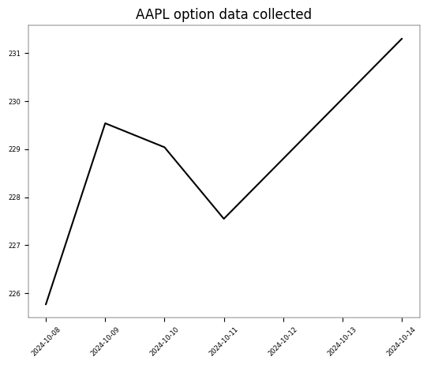

```python
import os
import sys
import requests
import pandas as pd
import numpy as np
import QuantLib as ql
from pathlib import Path
import matplotlib.pyplot as plt
from tqdm import tqdm
from itertools import product
from datetime import datetime
from datetime import timedelta
from model_settings import ms
from historical_av_plot_vol_surface import plot_vol_surface
fontsize=6
plt.rcParams.update(
    {
        'axes.labelsize': fontsize,
        'xtick.labelsize': fontsize,
        'ytick.labelsize': fontsize,
        'figure.titlesize': fontsize,
        'axes.linewidth': 1/3,
    }
)
search_symbol = 'SPY'
url = f"https://www.alphavantage.co/query?function=SYMBOL_SEARCH&keywords={search_symbol}&apikey={ms.av_key}"
r = requests.get(url)
data = r.json()
pd.DataFrame(data['bestMatches'])
```

    
    pricing settings:
    Actual/365 (Fixed) day counter
    New York stock exchange calendar
    compounding: continuous
    frequency: annual
    
    


<div>
<style scoped>
    .dataframe tbody tr th:only-of-type {
        vertical-align: middle;
    }

    .dataframe tbody tr th {
        vertical-align: top;
    }

    .dataframe thead th {
        text-align: right;
    }
</style>
<table border="1" class="dataframe">
  <thead>
    <tr style="text-align: right;">
      <th></th>
      <th>1. symbol</th>
      <th>2. name</th>
      <th>3. type</th>
      <th>4. region</th>
      <th>5. marketOpen</th>
      <th>6. marketClose</th>
      <th>7. timezone</th>
      <th>8. currency</th>
      <th>9. matchScore</th>
    </tr>
  </thead>
  <tbody>
    <tr>
      <th>0</th>
      <td>SPY</td>
      <td>SPDR S&amp;P 500 ETF Trust</td>
      <td>ETF</td>
      <td>United States</td>
      <td>09:30</td>
      <td>16:00</td>
      <td>UTC-04</td>
      <td>USD</td>
      <td>1.0000</td>
    </tr>
    <tr>
      <th>1</th>
      <td>SPY1.FRK</td>
      <td>SSgA SPDR ETFs Europe I Public Limited Company...</td>
      <td>ETF</td>
      <td>Frankfurt</td>
      <td>08:00</td>
      <td>20:00</td>
      <td>UTC+02</td>
      <td>EUR</td>
      <td>0.6667</td>
    </tr>
    <tr>
      <th>2</th>
      <td>SPY2.FRK</td>
      <td>SSgA SPDR ETFs Europe I Public Limited Company...</td>
      <td>ETF</td>
      <td>Frankfurt</td>
      <td>08:00</td>
      <td>20:00</td>
      <td>UTC+02</td>
      <td>EUR</td>
      <td>0.6667</td>
    </tr>
    <tr>
      <th>3</th>
      <td>SPY3.LON</td>
      <td>Leverage Shares 3x Long US 500 ETP Securities</td>
      <td>ETF</td>
      <td>United Kingdom</td>
      <td>08:00</td>
      <td>16:30</td>
      <td>UTC+01</td>
      <td>USD</td>
      <td>0.6667</td>
    </tr>
    <tr>
      <th>4</th>
      <td>SPY4.FRK</td>
      <td>SSgA SPDR S&amp;P 400 US Mid Cap</td>
      <td>ETF</td>
      <td>Frankfurt</td>
      <td>08:00</td>
      <td>20:00</td>
      <td>UTC+02</td>
      <td>EUR</td>
      <td>0.6667</td>
    </tr>
    <tr>
      <th>5</th>
      <td>SPY4.LON</td>
      <td>SPDR® S&amp;P 400 US Mid Cap UCITS ETF</td>
      <td>ETF</td>
      <td>United Kingdom</td>
      <td>08:00</td>
      <td>16:30</td>
      <td>UTC+01</td>
      <td>USD</td>
      <td>0.6667</td>
    </tr>
    <tr>
      <th>6</th>
      <td>SPY1.DEX</td>
      <td>SPDR® S&amp;P 500 Low Volatility UCITS ETF</td>
      <td>ETF</td>
      <td>XETRA</td>
      <td>08:00</td>
      <td>20:00</td>
      <td>UTC+02</td>
      <td>EUR</td>
      <td>0.6000</td>
    </tr>
    <tr>
      <th>7</th>
      <td>SPY2.DEX</td>
      <td>SPDR® Dow Jones Global Real Estate UCITS ETF U...</td>
      <td>ETF</td>
      <td>XETRA</td>
      <td>08:00</td>
      <td>20:00</td>
      <td>UTC+02</td>
      <td>EUR</td>
      <td>0.6000</td>
    </tr>
    <tr>
      <th>8</th>
      <td>SPY4.DEX</td>
      <td>SSgA SPDR S&amp;P 400 US Mid Cap</td>
      <td>ETF</td>
      <td>XETRA</td>
      <td>08:00</td>
      <td>20:00</td>
      <td>UTC+02</td>
      <td>EUR</td>
      <td>0.6000</td>
    </tr>
    <tr>
      <th>9</th>
      <td>SPY4.PAR</td>
      <td>SSgA SPDR S&amp;P 400 US Mid Cap</td>
      <td>ETF</td>
      <td>Paris</td>
      <td>09:00</td>
      <td>17:30</td>
      <td>UTC+02</td>
      <td>EUR</td>
      <td>0.6000</td>
    </tr>
  </tbody>
</table>
</div>


```python
symbol='SPY'
url = str(
	'https://www.alphavantage.co/query?function=TIME_SERIES_DAILY&symbol='+
	symbol+'&outputsize=full&apikey='+
	ms.av_key)
print(symbol)
r = requests.get(url)
spots = pd.Series(pd.DataFrame(r.json()['Time Series (Daily)']).transpose()['4. close'].squeeze())
spots = pd.to_numeric(spots,errors='coerce')
print(spots)
```

    SPY
    2024-10-14    584.2900
    2024-10-11    579.5800
    2024-10-10    576.1300
    2024-10-09    577.1400
    2024-10-08    573.1700
                    ...   
    1999-11-05    137.8750
    1999-11-04    136.5312
    1999-11-03    135.5000
    1999-11-02    134.5937
    1999-11-01    135.5625
    Name: 4. close, Length: 6278, dtype: float64
    

# example data collection

let us collect a few recent trading days and inspect the data


```python
dates = spots.index
dates = pd.Series(dates[:5])
print(dates)
```

    0    2024-10-14
    1    2024-10-11
    2    2024-10-10
    3    2024-10-09
    4    2024-10-08
    dtype: object
    


```python
from historical_alphaVantage_collection import collect_av_link
chain = {}
bar = tqdm(total=len(dates))
for date in dates:
    spot = float(spots[date])
    link = collect_av_link(date,spot,symbol)
    printdate = datetime.strptime(date, '%Y-%m-%d').strftime('%A, %Y-%m-%d')
    chain[date] = link
    bar.update(1)
bar.close()
```

    100%|████████████████████████████████████████████████████████████████████████████████████| 5/5 [00:05<00:00,  1.14s/it]
    


```python
demo_spots = spots[dates]
demo_spots.index = pd.to_datetime(demo_spots.index, format='%Y-%m-%d')
plt.figure()
plt.plot(demo_spots,color='black')
plt.title(f'{symbol} option data collected')
plt.xticks(rotation=45)
plt.show()
plt.clf()
```


    

    


    <Figure size 640x480 with 0 Axes>


# example calibraion

now why not select the one trading day and porceed with an example calibration of our Heston (1993) model


```python
date = dates[2]
raw_data = chain[date]
calculation_datetime = datetime.strptime(date,'%Y-%m-%d')
calculation_date = ql.Date(
    calculation_datetime.day,
    calculation_datetime.month,
    calculation_datetime.year,
)
notebook_printdate = str(calculation_datetime.strftime('%A, '))+str(calculation_date)
print(notebook_printdate)
```

    Thursday, October 10th, 2024
    

## modelling the volatility surface


```python
df = raw_data.copy()
df['volume'] = pd.to_numeric(df['volume'])
df['implied_volatility'] = pd.to_numeric(df['implied_volatility'])
df['strike'] = pd.to_numeric(df['strike'])
df['volume'] = pd.to_numeric(df['volume'])
df['expiration'] = pd.to_datetime(df['expiration'],format='%Y-%m-%d')
df['date'] = pd.to_datetime(df['date'],format='%Y-%m-%d')
df['days_to_maturity'] = df['expiration'] - df['date']
df['days_to_maturity'] = df['days_to_maturity'] / np.timedelta64(1, 'D')
df['days_to_maturity'] = df['days_to_maturity'].astype('int64')
df = df[(df['days_to_maturity']>=30)&(df['days_to_maturity']<=400)]
df = df[df['volume']>0].copy()
df['spot_price'] = spot
df['moneyness'] = ms.vmoneyness(df['spot_price'],df['strike'],df['type'])
df = df[(df['moneyness']<0)&(df['moneyness']>-0.5)]
indexed = df.copy().set_index(['strike','days_to_maturity'])

T = np.sort(df['days_to_maturity'].unique()).tolist()
K = np.sort(df['strike'].unique()).tolist()
volume_heatmap = pd.DataFrame(
    np.full((len(K), len(T)), np.nan), index=K, columns=T)
for k in K:
    for t in T:
        try:
            volume_heatmap.loc[k,t] = indexed.loc[(k,t),'volume']
        except Exception:
            pass
        
        
hottest_contracts = pd.DataFrame(
    volume_heatmap.unstack().sort_values(
        ascending=False)).head(50).reset_index()
hottest_contracts.columns = ['t','k','volume']
T = np.sort(hottest_contracts['t'].unique()).tolist()
K = np.sort(hottest_contracts['k'].unique()).tolist()

vol_matrix = pd.DataFrame(
    np.full((len(K),len(T)),np.nan),
    index = K,
    columns = T
)
for k in K:
    for t in T:
        try:
            vol_matrix.loc[k,t] = indexed.loc[(k,float(t)),'implied_volatility']
        except Exception:
            pass

vol_matrix = vol_matrix.dropna().copy()
T = vol_matrix.columns.tolist()
K = vol_matrix.index.tolist()

cols_to_map = [
        'contractID', 'symbol', 'expiration', 'type', 'last', 'mark',
        'bid', 'bid_size', 'ask', 'ask_size', 'volume', 'open_interest', 'date',
        'implied_volatility', 'delta', 'gamma', 'theta', 'vega', 'rho',
        'spot_price', 'moneyness'
]
for col in cols_to_map:
    for i,row in hottest_contracts.iterrows():
        hottest_contracts.at[i,col] = indexed.loc[(row['k'],row['t']),col]
        
hottest_contracts = hottest_contracts.rename(
    columns={'t':'days_to_maturity','k':'strike_price'}).copy()
```


```python
s = float(df['spot_price'].unique()[0])
print(f"\n{symbol} spot price: {s}")
plot_vol_surface(vol_matrix)
vol_matrix
```

    
    SPY spot price: 573.17
    


    

    


<div>
<style scoped>
    .dataframe tbody tr th:only-of-type {
        vertical-align: middle;
    }

    .dataframe tbody tr th {
        vertical-align: top;
    }

    .dataframe thead th {
        text-align: right;
    }
</style>
<table border="1" class="dataframe">
  <thead>
    <tr style="text-align: right;">
      <th></th>
      <th>36</th>
      <th>43</th>
      <th>71</th>
      <th>82</th>
      <th>99</th>
      <th>162</th>
    </tr>
  </thead>
  <tbody>
    <tr>
      <th>400.0</th>
      <td>0.52683</td>
      <td>0.50168</td>
      <td>0.43552</td>
      <td>0.41449</td>
      <td>0.39726</td>
      <td>0.35001</td>
    </tr>
    <tr>
      <th>440.0</th>
      <td>0.43507</td>
      <td>0.41449</td>
      <td>0.36357</td>
      <td>0.34772</td>
      <td>0.33537</td>
      <td>0.30260</td>
    </tr>
    <tr>
      <th>450.0</th>
      <td>0.41281</td>
      <td>0.39223</td>
      <td>0.34650</td>
      <td>0.33217</td>
      <td>0.32089</td>
      <td>0.29147</td>
    </tr>
    <tr>
      <th>475.0</th>
      <td>0.35534</td>
      <td>0.33979</td>
      <td>0.30473</td>
      <td>0.29345</td>
      <td>0.28568</td>
      <td>0.26480</td>
    </tr>
    <tr>
      <th>485.0</th>
      <td>0.33248</td>
      <td>0.31937</td>
      <td>0.28919</td>
      <td>0.27882</td>
      <td>0.27211</td>
      <td>0.25443</td>
    </tr>
    <tr>
      <th>500.0</th>
      <td>0.30047</td>
      <td>0.28964</td>
      <td>0.26586</td>
      <td>0.25763</td>
      <td>0.25245</td>
      <td>0.23934</td>
    </tr>
    <tr>
      <th>510.0</th>
      <td>0.27943</td>
      <td>0.27105</td>
      <td>0.25138</td>
      <td>0.24406</td>
      <td>0.23980</td>
      <td>0.22958</td>
    </tr>
    <tr>
      <th>520.0</th>
      <td>0.26037</td>
      <td>0.25306</td>
      <td>0.23720</td>
      <td>0.23095</td>
      <td>0.22760</td>
      <td>0.21983</td>
    </tr>
    <tr>
      <th>525.0</th>
      <td>0.25108</td>
      <td>0.24467</td>
      <td>0.23035</td>
      <td>0.22455</td>
      <td>0.22150</td>
      <td>0.21495</td>
    </tr>
    <tr>
      <th>530.0</th>
      <td>0.24193</td>
      <td>0.23629</td>
      <td>0.22379</td>
      <td>0.21830</td>
      <td>0.21556</td>
      <td>0.21022</td>
    </tr>
    <tr>
      <th>540.0</th>
      <td>0.22410</td>
      <td>0.22028</td>
      <td>0.21053</td>
      <td>0.20596</td>
      <td>0.20382</td>
      <td>0.20062</td>
    </tr>
    <tr>
      <th>545.0</th>
      <td>0.21586</td>
      <td>0.21221</td>
      <td>0.20382</td>
      <td>0.19971</td>
      <td>0.19803</td>
      <td>0.19589</td>
    </tr>
    <tr>
      <th>550.0</th>
      <td>0.20763</td>
      <td>0.20443</td>
      <td>0.19727</td>
      <td>0.19346</td>
      <td>0.19224</td>
      <td>0.19132</td>
    </tr>
    <tr>
      <th>555.0</th>
      <td>0.19940</td>
      <td>0.19666</td>
      <td>0.19056</td>
      <td>0.18721</td>
      <td>0.18644</td>
      <td>0.18690</td>
    </tr>
    <tr>
      <th>560.0</th>
      <td>0.19102</td>
      <td>0.18873</td>
      <td>0.18400</td>
      <td>0.18111</td>
      <td>0.18096</td>
      <td>0.18248</td>
    </tr>
    <tr>
      <th>565.0</th>
      <td>0.18248</td>
      <td>0.18065</td>
      <td>0.17730</td>
      <td>0.17501</td>
      <td>0.17532</td>
      <td>0.17821</td>
    </tr>
    <tr>
      <th>570.0</th>
      <td>0.17410</td>
      <td>0.17288</td>
      <td>0.17090</td>
      <td>0.16907</td>
      <td>0.16998</td>
      <td>0.17410</td>
    </tr>
    <tr>
      <th>575.0</th>
      <td>0.16541</td>
      <td>0.16510</td>
      <td>0.15931</td>
      <td>0.15001</td>
      <td>0.15138</td>
      <td>0.15367</td>
    </tr>
    <tr>
      <th>580.0</th>
      <td>0.15687</td>
      <td>0.15702</td>
      <td>0.15260</td>
      <td>0.14422</td>
      <td>0.14605</td>
      <td>0.14971</td>
    </tr>
    <tr>
      <th>585.0</th>
      <td>0.14910</td>
      <td>0.14955</td>
      <td>0.14651</td>
      <td>0.13873</td>
      <td>0.14102</td>
      <td>0.14513</td>
    </tr>
    <tr>
      <th>590.0</th>
      <td>0.14178</td>
      <td>0.14285</td>
      <td>0.14087</td>
      <td>0.13370</td>
      <td>0.13629</td>
      <td>0.14117</td>
    </tr>
    <tr>
      <th>595.0</th>
      <td>0.13599</td>
      <td>0.13690</td>
      <td>0.13584</td>
      <td>0.12913</td>
      <td>0.13187</td>
      <td>0.13736</td>
    </tr>
    <tr>
      <th>600.0</th>
      <td>0.13111</td>
      <td>0.13218</td>
      <td>0.13126</td>
      <td>0.12501</td>
      <td>0.12791</td>
      <td>0.13385</td>
    </tr>
    <tr>
      <th>605.0</th>
      <td>0.12776</td>
      <td>0.12806</td>
      <td>0.12730</td>
      <td>0.12135</td>
      <td>0.12440</td>
      <td>0.13065</td>
    </tr>
    <tr>
      <th>610.0</th>
      <td>0.12562</td>
      <td>0.12532</td>
      <td>0.12425</td>
      <td>0.11846</td>
      <td>0.12120</td>
      <td>0.12760</td>
    </tr>
    <tr>
      <th>615.0</th>
      <td>0.12501</td>
      <td>0.12410</td>
      <td>0.12181</td>
      <td>0.11617</td>
      <td>0.11876</td>
      <td>0.12486</td>
    </tr>
    <tr>
      <th>625.0</th>
      <td>0.12791</td>
      <td>0.12440</td>
      <td>0.11922</td>
      <td>0.11373</td>
      <td>0.11526</td>
      <td>0.12013</td>
    </tr>
  </tbody>
</table>
</div>


    <Figure size 640x480 with 0 Axes>


## calibrating a Heston (1993) model


```python
vol_matrix = vol_matrix.sort_index().drop_duplicates()
pd.to_numeric(raw_data['last'])
raw_data['date'] = pd.to_datetime(raw_data['date'])
raw_data['expiration'] = pd.to_datetime(raw_data['expiration'])
raw_data['implied_volatility'] = pd.to_numeric(raw_data['implied_volatility']).astype(float)
raw_data['strike'] = pd.to_numeric(raw_data['strike'])
raw_data['last'] = pd.to_numeric(raw_data['last'])
contract_maturities = np.array((raw_data['expiration'] - raw_data['date']) / timedelta(days=1)).astype(int)
raw_data['days_to_maturity'] = contract_maturities

T = vol_matrix.columns.tolist()
K = vol_matrix.index.tolist()
r = 0.04
g = 0.0

ql.Settings.instance().evaluationDate = calculation_date
flat_ts, dividend_ts = ms.ql_ts_rg(r, g, calculation_date)
S_handle = ql.QuoteHandle(ql.SimpleQuote(s))

heston_helpers = []
v0 = 0.01; kappa = 0.2; theta = 0.02; rho = -0.75; eta = 0.5;
process = ql.HestonProcess(
    flat_ts,
    dividend_ts,
    S_handle,
    v0,                # Initial volatility
    kappa,             # Mean reversion speed
    theta,             # Long-run variance (volatility squared)
    eta,               # Volatility of the volatility
    rho                # Correlation between asset and volatility
)
model = ql.HestonModel(process)
engine = ql.AnalyticHestonEngine(model)

for t in T:
    for k in K:
        p = ql.Period(int(t),ql.Days)
        volatility = vol_matrix.loc[k,t]
        helper = ql.HestonModelHelper(
            p, ms.calendar, float(s), k, 
            ql.QuoteHandle(ql.SimpleQuote(volatility)), 
            flat_ts, 
            dividend_ts
            )
        helper.setPricingEngine(engine)
        heston_helpers.append(helper)

lm = ql.LevenbergMarquardt(1e-8, 1e-8, 1e-8)


model.calibrate(heston_helpers, lm,
                  ql.EndCriteria(1000, 50, 1.0e-8,1.0e-8, 1.0e-8))

theta, kappa, eta, rho, v0 = model.params()
heston_parameters = pd.Series(
    [theta, kappa, eta, rho, v0],
    index = ['theta', 'kappa', 'eta', 'rho', 'v0'],
    dtype = float
)
calibration_test_data = raw_data.copy()[['strike','type','last','implied_volatility','days_to_maturity']]
calibration_test_data.columns = ['strike_price','w','market_price','volatility','days_to_maturity']
calibration_test_data['spot_price'] = s
calibration_test_data['risk_free_rate'] = r
calibration_test_data['dividend_rate'] = g
calibration_test_data = calibration_test_data[calibration_test_data['days_to_maturity'].isin(df['days_to_maturity'])]
calibration_test_data[heston_parameters.index.tolist()] = np.tile(heston_parameters,(calibration_test_data.shape[0],1))
calibration_test_data.loc[:,'moneyness'] = ms.vmoneyness(
    calibration_test_data['spot_price'].values,
    calibration_test_data['strike_price'].values,
    calibration_test_data['w'].values)
calibration_test_data['calculation_date'] = calculation_datetime
calibration_test_data['black_scholes'] = ms.vector_black_scholes(calibration_test_data)
calibration_test_data['heston_price'] = ms.vector_heston_price(calibration_test_data)
```

## testing calibration accuracy


```python
calibration_test_data.loc[:,'error'] = calibration_test_data['heston_price'].values - calibration_test_data['black_scholes'].values
avg = np.mean(np.abs(calibration_test_data['error']))
print(f"\n{printdate}\n{heston_parameters}\naverage absolute error: {round(avg,3)}")
print(f"calibration testing dataset:\n{calibration_test_data.describe()}")
```

    
    Tuesday, 2024-10-08
    theta    0.048950
    kappa    7.062451
    eta      3.202215
    rho     -0.745254
    v0       0.054261
    dtype: float64
    average absolute error: 2.712
    calibration testing dataset:
           strike_price  market_price   volatility  days_to_maturity  \
    count   4722.000000   4722.000000  4722.000000       4722.000000   
    mean     515.975011     43.554953     0.245300        168.308767   
    min      120.000000      0.000000     0.012610         36.000000   
    25%      453.000000      0.000000     0.163120         71.000000   
    50%      527.000000      6.300000     0.209000        141.000000   
    75%      585.000000     60.220000     0.286590        263.000000   
    max      830.000000    455.350000     1.403940        355.000000   
    std      127.349300     73.202390     0.144633        107.049704   
    
             spot_price  risk_free_rate  dividend_rate       theta         kappa  \
    count  4.722000e+03         4722.00         4722.0  4722.00000  4.722000e+03   
    mean   5.731700e+02            0.04            0.0     0.04895  7.062451e+00   
    min    5.731700e+02            0.04            0.0     0.04895  7.062451e+00   
    25%    5.731700e+02            0.04            0.0     0.04895  7.062451e+00   
    50%    5.731700e+02            0.04            0.0     0.04895  7.062451e+00   
    75%    5.731700e+02            0.04            0.0     0.04895  7.062451e+00   
    max    5.731700e+02            0.04            0.0     0.04895  7.062451e+00   
    std    1.136989e-13            0.00            0.0     0.00000  8.882725e-16   
    
                    eta           rho           v0     moneyness  \
    count  4.722000e+03  4.722000e+03  4722.000000  4.722000e+03   
    mean   3.202215e+00 -7.452541e-01     0.054261  5.502485e-02   
    min    3.202215e+00 -7.452541e-01     0.054261 -7.906380e-01   
    25%    3.202215e+00 -7.452541e-01     0.054261 -1.294031e-01   
    50%    3.202215e+00 -7.452541e-01     0.054261  4.399768e-08   
    75%    3.202215e+00 -7.452541e-01     0.054261  1.486373e-01   
    max    3.202215e+00 -7.452541e-01     0.054261  3.776417e+00   
    std    1.332409e-15  1.110341e-16     0.000000  3.871639e-01   
    
              calculation_date  black_scholes  heston_price        error  
    count                 4722    4722.000000   4722.000000  4722.000000  
    mean   2024-10-10 00:00:00      61.342651     60.981829    -0.360822  
    min    2024-10-10 00:00:00       0.010568      0.002670   -35.010414  
    25%    2024-10-10 00:00:00       4.533767      5.416250    -0.185374  
    50%    2024-10-10 00:00:00      22.593702     21.792498     0.617339  
    75%    2024-10-10 00:00:00      87.932582     87.671982     1.434790  
    max    2024-10-10 00:00:00     454.376872    454.102745     7.320878  
    std                    NaN      83.163347     82.363360     5.519168  
    

# train data generation
now that we have calibrated our pricing engine, let us proceed with generating 
all real down barrier option contract combinations for this trading day
(i.e., all barriers less than underlying spot price)

```python
strike_spread = 0.2
strike_step = 5
K = np.arange(
    int(s*(1-strike_spread)),
    int(s*(1+strike_spread)),
    strike_step
).astype(int).tolist()

barrier_step = 10
down_barriers =  np.arange(
    s*0.5,
    s*0.99,
    barrier_step
).astype(int).tolist()

T = [
    30,60,90,
    180,360,540,720
]
print(f"\n{symbol} spot price:\n     {spot}\n\nstrikes:\n     {K}\n\nbarriers:\n     {down_barriers}\n\nmaturities:\n     {T}\n")
```

    
    SPY spot price:
         573.17
    
    strikes:
         [458, 463, 468, 473, 478, 483, 488, 493, 498, 503, 508, 513, 518, 523, 528, 533, 538, 543, 548, 553, 558, 563, 568, 573, 578, 583, 588, 593, 598, 603, 608, 613, 618, 623, 628, 633, 638, 643, 648, 653, 658, 663, 668, 673, 678, 683]
    
    barriers:
         [286, 296, 306, 316, 326, 336, 346, 356, 366, 376, 386, 396, 406, 416, 426, 436, 446, 456, 466, 476, 486, 496, 506, 516, 526, 536, 546, 556, 566]
    
    maturities:
         [30, 60, 90, 180, 360, 540, 720]
    
    


```python
print('generating contracts...')
features = pd.DataFrame(
    product(
        [spot],
        K,
        T,
        down_barriers,
        [0.0], # rebate
        ['put','call'],
        [0.04], # risk-free rate
        [0.0], # dividend rate
        [theta], 
        [kappa], 
        [eta], 
        [rho], 
        [v0],
        [calculation_datetime],
        ['Out','In']
    ),
    columns = [
        'spot_price',
        'strike_price',
        'days_to_maturity',
        'barrier',
        'rebate',
        'w',
        'risk_free_rate',
        'dividend_rate',
        'theta', 'kappa', 'eta', 'rho', 'v0',
        'calculation_date',
        'outin',
    ]
)
features['moneyness'] = ms.vmoneyness(features['spot_price'],features['strike_price'],features['w'])
features['barrier_type_name'] = 'Down' + features['outin']
print('contracts generated')
print(f'pricing {features.shape[0]} contracts...')
features['vanilla_price'] = ms.vector_heston_price(features)
features['barrier_price'] = ms.vector_barrier_price(features)
featuresby_t = features.copy().set_index('days_to_maturity')
print('priced!')
```

    generating contracts...
    contracts generated
    pricing 37352 contracts...
    priced!
    


```python
for t in T:
    plt.figure(figsize=(3, 2), dpi=150)
    prices= featuresby_t.loc[t,'barrier_price']
    plt.hist(prices,bins=int(np.sqrt(prices.shape[0])))
    plt.tick_params(axis='both', which='major', length=1, width=1/3)  # Thinner tick marks
    plt.title(f'{t} day maturity', fontsize=fontsize)
    plt.show()
    plt.clf()
```


    

    


    <Figure size 640x480 with 0 Axes>


    

    


    <Figure size 640x480 with 0 Axes>


    

    


    <Figure size 640x480 with 0 Axes>


    

    


    <Figure size 640x480 with 0 Axes>


    

    


    <Figure size 640x480 with 0 Axes>


    

    


    <Figure size 640x480 with 0 Axes>


    

    


    <Figure size 640x480 with 0 Axes>


# model training
now that we have a dataset, we can for example, test whether our model is able to predict 
the prices of our two year barrier options while only having seen the others in training

```python
import convsklearn
help(convsklearn)
```

    a proprietary package of convenience wrappers for sklearn
    random state: None
    maximum iterations: 1000
    
    target: 
    observed_price
    
    features: 
    ['spot_price', 'strike_price', 'days_to_maturity', 'risk_free_rate', 'dividend_rate', 'kappa', 'theta', 'rho', 'eta', 'v0', 'barrier', 'barrier_type_name', 'w']
    
    feature transformer(s):
    ('StandardScaler', StandardScaler(), ['spot_price', 'strike_price', 'days_to_maturity', 'risk_free_rate', 'dividend_rate', 'kappa', 'theta', 'rho', 'eta', 'v0', 'barrier'])
    
    ('OneHotEncoder', OneHotEncoder(sparse_output=False), ['barrier_type_name', 'w'])
    
    target transformer(s):
    StandardScaler()
    
    Help on package convsklearn:
    
    NAME
        convsklearn
    
    PACKAGE CONTENTS
        convsklearn
    
    DATA
        barrier_trainer = <convsklearn.convsklearn.convsklearn object>
        categorical_features = ['barrier_type_name', 'w']
        feature_set = ['spot_price', 'strike_price', 'days_to_maturity', 'risk...
        numerical_features = ['spot_price', 'strike_price', 'days_to_maturity'...
        target_name = 'observed_price'
        target_transformer_pipeline = Pipeline(steps=[('StandardScaler', Stand...
        transformers = [('StandardScaler', StandardScaler(), ['spot_price', 's...
    
    FILE
        e:\python\lib\site-packages\convsklearn\__init__.py
    
    
    


```python
help(convsklearn.convsklearn)
```

    Help on class convsklearn in module convsklearn.convsklearn:
    
    class convsklearn(builtins.object)
     |  convsklearn(target_name, numerical_features, categorical_features, transformers, target_transformer_pipeline, n_layers=None, random_state=None, max_iter=1000, solver='sgd', alpha=0.0001, learning_rate='adaptive', activation_function='relu', rf_n_estimators=50, rf_min_samples_leaf=2000)
     |
     |  Methods defined here:
     |
     |  __init__(self, target_name, numerical_features, categorical_features, transformers, target_transformer_pipeline, n_layers=None, random_state=None, max_iter=1000, solver='sgd', alpha=0.0001, learning_rate='adaptive', activation_function='relu', rf_n_estimators=50, rf_min_samples_leaf=2000)
     |      Initialize self.  See help(type(self)) for accurate signature.
     |
     |  get_train_test_arrays(self, train_data, test_data, feature_set=None, target_name=None)
     |
     |  plot_model_performance(self, df, X_name, Y_name, xlabel, ylabel, runtime, title)
     |
     |  preprocess(self)
     |
     |  run_dnn(self, preprocessor, train_X, train_y)
     |
     |  run_lm(self, train_X, train_y)
     |
     |  run_nnet(self, preprocessor, train_X, train_y)
     |
     |  run_rf(self, preprocessor, train_X, train_y)
     |
     |  test_model(self, test_data, test_X, test_y, model_fit)
     |
     |  test_prediction_accuracy(self, model_fit, test_data, train_data)
     |
     |  ----------------------------------------------------------------------
     |  Data descriptors defined here:
     |
     |  __dict__
     |      dictionary for instance variables
     |
     |  __weakref__
     |      list of weak references to the object
    
    


```python
from convsklearn import target_name, numerical_features, categorical_features, transformers, target_transformer_pipeline
```


```python
barrier_trainer = convsklearn.convsklearn(
    target_name=target_name, 
    numerical_features=numerical_features, 
    categorical_features=categorical_features, 
    transformers=transformers, 
    target_transformer_pipeline=target_transformer_pipeline, 
    max_iter=1000
)
```

    random state: None
    maximum iterations: 1000
    
    target: 
    observed_price
    
    features: 
    ['spot_price', 'strike_price', 'days_to_maturity', 'risk_free_rate', 'dividend_rate', 'kappa', 'theta', 'rho', 'eta', 'v0', 'barrier', 'barrier_type_name', 'w']
    
    feature transformer(s):
    ('StandardScaler', StandardScaler(), ['spot_price', 'strike_price', 'days_to_maturity', 'risk_free_rate', 'dividend_rate', 'kappa', 'theta', 'rho', 'eta', 'v0', 'barrier'])
    
    ('OneHotEncoder', OneHotEncoder(sparse_output=False), ['barrier_type_name', 'w'])
    
    target transformer(s):
    StandardScaler()
    
    


```python
features['observed_price'] = ms.noisyfier(features.loc[:,'barrier_price']) 
    # apply slight peturbation in the form of a random normal with standard deviation 0.15
train_data = features[features['days_to_maturity']!=720]
test_data = features[features['days_to_maturity']==720]
print(f"train data count: {train_data.shape[0]}")
print(f"test data count: {test_data.shape[0]}")
arrs = barrier_trainer.get_train_test_arrays(train_data,test_data)
train_X = arrs['train_X']
train_y = arrs['train_y']
test_X = arrs['test_X']
test_y = arrs['train_y']
preprocessor = barrier_trainer.preprocess()
dnn_barriers, runtime, specs = barrier_trainer.run_dnn(preprocessor, train_X, train_y)
in_sample, out_of_sample, errors = barrier_trainer.test_prediction_accuracy(dnn_barriers, test_data, train_data)
outsample = out_of_sample.rename(
    columns = {
        'strike_price':'k',
        'days_to_maturity':'t',
        'barrier_type_name':'type',
        'barrier_price':'price',
        'vanilla_price':'vanilla',
        'spot_price':'spot',
        'outofsample_target':'target', 
        'outofsample_prediction':'dnn', 
        'outofsample_error':'error',
        'barrier':'b'
        }
)
outsample = outsample[[
    'spot', 'k', 'b','price', 'vanilla', 'type', 'w','t', 
    'target', 'dnn', 'error'
]]
pd.set_option("display.float_format", "{:.2f}".format)
pd.set_option("display.max_rows",None)
print(f"\n{outsample.describe()}")
outsample_preview = outsample.copy().sort_values(by=['w','type','k','b'],ascending=False).reset_index(drop=True)
print(f"\n{symbol} down barrier options for {notebook_printdate}")
print(f"\n{outsample_preview}")
pd.reset_option("display.max_rows")
pd.reset_option("display.float_format") 
```

    train data count: 32016
    test data count: 5336
    
    training...
    
    Deep Neural Network
    hidden layers sizes: (13, 13, 13)
    learning rate: adaptive
    activation: relu
    solver: sgd
    alpha: 0.0001
    
    in sample:
         RSME: 2.956532737871261
         MAE: 2.002161290561349
    
    out of sample:
         RSME: 6.950941052470952
         MAE: 5.065701705989798
    
             spot       k       b   price  vanilla       t  target     dnn   error
    count 5336.00 5336.00 5336.00 5336.00  5336.00 5336.00 5336.00 5336.00 5336.00
    mean   573.17  570.50  426.00   32.93    65.97  720.00   32.93   32.49   -0.44
    std      0.00   66.39   83.67   36.32    40.19    0.00   36.32   36.96    6.94
    min    573.17  458.00  286.00    0.00    17.22  720.00    0.00  -15.97  -38.26
    25%    573.17  513.00  356.00    2.72    33.90  720.00    2.72    3.40   -3.69
    50%    573.17  570.50  426.00   23.04    55.09  720.00   22.97   24.00   -0.08
    75%    573.17  628.00  496.00   47.17    84.83  720.00   47.18   47.13    3.56
    max    573.17  683.00  566.00  166.60   167.13  720.00  166.59  165.09   31.48
    
    SPY down barrier options for Thursday, October 10th, 2024
    
           spot    k    b  price  vanilla     type     w    t  target    dnn  \
    0    573.17  683  566   0.39    84.26  DownOut   put  720    0.46  -4.37   
    1    573.17  683  556   1.01    84.26  DownOut   put  720    1.05  -2.13   
    2    573.17  683  546   1.78    84.26  DownOut   put  720    1.65   0.12   
    3    573.17  683  536   2.71    84.26  DownOut   put  720    2.58   2.36   
    4    573.17  683  526   3.80    84.26  DownOut   put  720    3.84   4.60   
    5    573.17  683  516   5.02    84.26  DownOut   put  720    4.85   6.84   
    6    573.17  683  506   6.38    84.26  DownOut   put  720    6.25   9.08   
    7    573.17  683  496   7.87    84.26  DownOut   put  720    7.57  11.32   
    8    573.17  683  486   9.46    84.26  DownOut   put  720    9.90  12.60   
    9    573.17  683  476  11.14    84.26  DownOut   put  720   11.03  13.57   
    10   573.17  683  466  12.92    84.26  DownOut   put  720   12.85  14.28   
    11   573.17  683  456  14.76    84.26  DownOut   put  720   14.72  15.24   
    12   573.17  683  446  16.67    84.26  DownOut   put  720   16.66  18.25   
    13   573.17  683  436  18.62    84.26  DownOut   put  720   18.46  21.82   
    14   573.17  683  426  20.62    84.26  DownOut   put  720   20.53  24.95   
    15   573.17  683  416  22.65    84.26  DownOut   put  720   22.93  26.82   
    16   573.17  683  406  24.70    84.26  DownOut   put  720   24.81  28.21   
    17   573.17  683  396  26.78    84.26  DownOut   put  720   26.71  29.53   
    18   573.17  683  386  28.86    84.26  DownOut   put  720   28.81  30.85   
    19   573.17  683  376  30.95    84.26  DownOut   put  720   30.97  32.17   
    20   573.17  683  366  33.03    84.26  DownOut   put  720   32.98  33.49   
    21   573.17  683  356  35.11    84.26  DownOut   put  720   35.22  35.15   
    22   573.17  683  346  37.19    84.26  DownOut   put  720   37.17  36.60   
    23   573.17  683  336  39.25    84.26  DownOut   put  720   39.77  37.41   
    24   573.17  683  326  41.29    84.26  DownOut   put  720   41.38  38.69   
    25   573.17  683  316  43.31    84.26  DownOut   put  720   43.17  39.98   
    26   573.17  683  306  45.31    84.26  DownOut   put  720   45.32  41.26   
    27   573.17  683  296  47.28    84.26  DownOut   put  720   47.22  42.53   
    28   573.17  683  286  49.23    84.26  DownOut   put  720   49.49  43.80   
    29   573.17  678  566   0.32    81.48  DownOut   put  720    0.08  -5.00   
    30   573.17  678  556   0.85    81.48  DownOut   put  720    0.93  -2.76   
    31   573.17  678  546   1.52    81.48  DownOut   put  720    1.76  -0.52   
    32   573.17  678  536   2.35    81.48  DownOut   put  720    2.21   1.72   
    33   573.17  678  526   3.32    81.48  DownOut   put  720    3.11   3.97   
    34   573.17  678  516   4.43    81.48  DownOut   put  720    4.56   6.21   
    35   573.17  678  506   5.67    81.48  DownOut   put  720    5.68   8.45   
    36   573.17  678  496   7.04    81.48  DownOut   put  720    7.06  10.69   
    37   573.17  678  486   8.52    81.48  DownOut   put  720    8.74  11.81   
    38   573.17  678  476  10.10    81.48  DownOut   put  720   10.20  12.78   
    39   573.17  678  466  11.77    81.48  DownOut   put  720   11.85  13.44   
    40   573.17  678  456  13.51    81.48  DownOut   put  720   13.40  14.49   
    41   573.17  678  446  15.32    81.48  DownOut   put  720   15.28  17.04   
    42   573.17  678  436  17.19    81.48  DownOut   put  720   17.33  20.61   
    43   573.17  678  426  19.10    81.48  DownOut   put  720   19.15  23.19   
    44   573.17  678  416  21.05    81.48  DownOut   put  720   21.32  25.09   
    45   573.17  678  406  23.02    81.48  DownOut   put  720   22.95  26.41   
    46   573.17  678  396  25.02    81.48  DownOut   put  720   25.06  27.73   
    47   573.17  678  386  27.03    81.48  DownOut   put  720   27.17  29.05   
    48   573.17  678  376  29.05    81.48  DownOut   put  720   29.06  30.36   
    49   573.17  678  366  31.08    81.48  DownOut   put  720   31.35  31.68   
    50   573.17  678  356  33.10    81.48  DownOut   put  720   33.05  33.00   
    51   573.17  678  346  35.12    81.48  DownOut   put  720   35.38  34.31   
    52   573.17  678  336  37.13    81.48  DownOut   put  720   37.31  35.60   
    53   573.17  678  326  39.12    81.48  DownOut   put  720   39.18  36.88   
    54   573.17  678  316  41.10    81.48  DownOut   put  720   41.02  38.17   
    55   573.17  678  306  43.05    81.48  DownOut   put  720   43.09  39.46   
    56   573.17  678  296  44.98    81.48  DownOut   put  720   44.96  40.74   
    57   573.17  678  286  46.89    81.48  DownOut   put  720   46.98  42.02   
    58   573.17  673  566   0.26    78.79  DownOut   put  720    0.38  -5.63   
    59   573.17  673  556   0.71    78.79  DownOut   put  720    0.62  -3.39   
    60   573.17  673  546   1.30    78.79  DownOut   put  720    1.15  -1.15   
    61   573.17  673  536   2.02    78.79  DownOut   put  720    2.09   1.09   
    62   573.17  673  526   2.88    78.79  DownOut   put  720    2.87   3.33   
    63   573.17  673  516   3.89    78.79  DownOut   put  720    3.81   5.57   
    64   573.17  673  506   5.02    78.79  DownOut   put  720    4.93   7.82   
    65   573.17  673  496   6.28    78.79  DownOut   put  720    6.45  10.05   
    66   573.17  673  486   7.66    78.79  DownOut   put  720    7.79  11.02   
    67   573.17  673  476   9.13    78.79  DownOut   put  720    8.85  11.99   
    68   573.17  673  466  10.70    78.79  DownOut   put  720   10.76  12.59   
    69   573.17  673  456  12.34    78.79  DownOut   put  720   12.29  13.75   
    70   573.17  673  446  14.06    78.79  DownOut   put  720   14.28  15.82   
    71   573.17  673  436  15.83    78.79  DownOut   put  720   15.88  19.39   
    72   573.17  673  426  17.66    78.79  DownOut   put  720   17.75  21.42   
    73   573.17  673  416  19.52    78.79  DownOut   put  720   19.47  23.29   
    74   573.17  673  406  21.42    78.79  DownOut   put  720   21.30  24.61   
    75   573.17  673  396  23.35    78.79  DownOut   put  720   23.30  25.92   
    76   573.17  673  386  25.29    78.79  DownOut   put  720   25.27  27.24   
    77   573.17  673  376  27.25    78.79  DownOut   put  720   27.34  28.56   
    78   573.17  673  366  29.21    78.79  DownOut   put  720   28.79  29.88   
    79   573.17  673  356  31.17    78.79  DownOut   put  720   31.11  31.20   
    80   573.17  673  346  33.13    78.79  DownOut   put  720   33.26  32.50   
    81   573.17  673  336  35.09    78.79  DownOut   put  720   34.87  33.79   
    82   573.17  673  326  37.03    78.79  DownOut   put  720   37.01  35.08   
    83   573.17  673  316  38.96    78.79  DownOut   put  720   38.94  36.36   
    84   573.17  673  306  40.88    78.79  DownOut   put  720   41.06  37.65   
    85   573.17  673  296  42.77    78.79  DownOut   put  720   42.67  38.92   
    86   573.17  673  286  44.64    78.79  DownOut   put  720   44.60  40.17   
    87   573.17  668  566   0.22    76.18  DownOut   put  720    0.38  -6.27   
    88   573.17  668  556   0.59    76.18  DownOut   put  720    0.55  -4.03   
    89   573.17  668  546   1.09    76.18  DownOut   put  720    1.16  -1.78   
    90   573.17  668  536   1.72    76.18  DownOut   put  720    1.83   0.46   
    91   573.17  668  526   2.49    76.18  DownOut   put  720    2.50   2.70   
    92   573.17  668  516   3.39    76.18  DownOut   put  720    3.57   4.94   
    93   573.17  668  506   4.43    76.18  DownOut   put  720    4.59   7.18   
    94   573.17  668  496   5.58    76.18  DownOut   put  720    5.55   9.26   
    95   573.17  668  486   6.85    76.18  DownOut   put  720    6.71  10.23   
    96   573.17  668  476   8.23    76.18  DownOut   put  720    8.35  11.19   
    97   573.17  668  466   9.69    76.18  DownOut   put  720    9.85  11.74   
    98   573.17  668  456  11.24    76.18  DownOut   put  720   11.12  13.00   
    99   573.17  668  446  12.87    76.18  DownOut   put  720   12.58  14.63   
    100  573.17  668  436  14.55    76.18  DownOut   put  720   14.35  17.97   
    101  573.17  668  426  16.29    76.18  DownOut   put  720   16.44  19.69   
    102  573.17  668  416  18.08    76.18  DownOut   put  720   18.32  21.48   
    103  573.17  668  406  19.90    76.18  DownOut   put  720   19.85  22.80   
    104  573.17  668  396  21.75    76.18  DownOut   put  720   21.75  24.12   
    105  573.17  668  386  23.63    76.18  DownOut   put  720   23.65  25.44   
    106  573.17  668  376  25.52    76.18  DownOut   put  720   25.47  26.76   
    107  573.17  668  366  27.42    76.18  DownOut   put  720   27.56  28.08   
    108  573.17  668  356  29.32    76.18  DownOut   put  720   29.49  29.39   
    109  573.17  668  346  31.23    76.18  DownOut   put  720   31.03  30.70   
    110  573.17  668  336  33.13    76.18  DownOut   put  720   33.07  31.98   
    111  573.17  668  326  35.03    76.18  DownOut   put  720   35.05  33.26   
    112  573.17  668  316  36.91    76.18  DownOut   put  720   36.91  34.51   
    113  573.17  668  306  38.78    76.18  DownOut   put  720   38.94  35.77   
    114  573.17  668  296  40.63    76.18  DownOut   put  720   40.66  37.02   
    115  573.17  668  286  42.47    76.18  DownOut   put  720   42.22  38.28   
    116  573.17  663  566   0.18    73.64  DownOut   put  720    0.40  -6.90   
    117  573.17  663  556   0.49    73.64  DownOut   put  720    0.57  -4.66   
    118  573.17  663  546   0.92    73.64  DownOut   put  720    0.81  -2.42   
    119  573.17  663  536   1.47    73.64  DownOut   put  720    1.57  -0.17   
    120  573.17  663  526   2.14    73.64  DownOut   put  720    1.96   2.07   
    121  573.17  663  516   2.95    73.64  DownOut   put  720    3.09   4.31   
    122  573.17  663  506   3.89    73.64  DownOut   put  720    3.71   6.55   
    123  573.17  663  496   4.94    73.64  DownOut   put  720    4.95   8.46   
    124  573.17  663  486   6.11    73.64  DownOut   put  720    6.11   9.43   
    125  573.17  663  476   7.39    73.64  DownOut   put  720    7.48  10.40   
    126  573.17  663  466   8.76    73.64  DownOut   put  720    8.66  10.89   
    127  573.17  663  456  10.21    73.64  DownOut   put  720   10.29  12.26   
    128  573.17  663  446  11.75    73.64  DownOut   put  720   11.88  13.88   
    129  573.17  663  436  13.35    73.64  DownOut   put  720   13.17  16.20   
    130  573.17  663  426  15.00    73.64  DownOut   put  720   14.93  17.97   
    131  573.17  663  416  16.71    73.64  DownOut   put  720   16.82  19.68   
    132  573.17  663  406  18.46    73.64  DownOut   put  720   18.46  21.00   
    133  573.17  663  396  20.24    73.64  DownOut   put  720   20.43  22.32   
    134  573.17  663  386  22.04    73.64  DownOut   put  720   22.13  23.63   
    135  573.17  663  376  23.87    73.64  DownOut   put  720   23.61  24.95   
    136  573.17  663  366  25.71    73.64  DownOut   put  720   25.78  26.27   
    137  573.17  663  356  27.56    73.64  DownOut   put  720   27.60  27.57   
    138  573.17  663  346  29.41    73.64  DownOut   put  720   29.38  28.85   
    139  573.17  663  336  31.26    73.64  DownOut   put  720   31.30  30.10   
    140  573.17  663  326  33.11    73.64  DownOut   put  720   33.12  31.36   
    141  573.17  663  316  34.94    73.64  DownOut   put  720   34.88  32.61   
    142  573.17  663  306  36.77    73.64  DownOut   put  720   36.66  33.87   
    143  573.17  663  296  38.58    73.64  DownOut   put  720   38.30  35.13   
    144  573.17  663  286  40.37    73.64  DownOut   put  720   40.61  36.38   
    145  573.17  658  566   0.14    71.18  DownOut   put  720    0.10  -7.53   
    146  573.17  658  556   0.40    71.18  DownOut   put  720    0.21  -5.29   
    147  573.17  658  546   0.77    71.18  DownOut   put  720    0.81  -3.05   
    148  573.17  658  536   1.24    71.18  DownOut   put  720    1.31  -0.81   
    149  573.17  658  526   1.83    71.18  DownOut   put  720    1.71   1.43   
    150  573.17  658  516   2.55    71.18  DownOut   put  720    2.51   3.68   
    151  573.17  658  506   3.40    71.18  DownOut   put  720    3.62   5.92   
    152  573.17  658  496   4.36    71.18  DownOut   put  720    4.40   7.67   
    153  573.17  658  486   5.43    71.18  DownOut   put  720    5.36   8.64   
    154  573.17  658  476   6.61    71.18  DownOut   put  720    6.65   9.61   
    155  573.17  658  466   7.89    71.18  DownOut   put  720    7.68  10.05   
    156  573.17  658  456   9.25    71.18  DownOut   put  720    9.33  11.52   
    157  573.17  658  446  10.70    71.18  DownOut   put  720   10.65  13.14   
    158  573.17  658  436  12.21    71.18  DownOut   put  720   12.39  14.44   
    159  573.17  658  426  13.79    71.18  DownOut   put  720   13.66  16.24   
    160  573.17  658  416  15.42    71.18  DownOut   put  720   15.55  17.88   
    161  573.17  658  406  17.09    71.18  DownOut   put  720   16.97  19.19   
    162  573.17  658  396  18.80    71.18  DownOut   put  720   18.89  20.50   
    163  573.17  658  386  20.53    71.18  DownOut   put  720   20.79  21.80   
    164  573.17  658  376  22.30    71.18  DownOut   put  720   22.26  23.09   
    165  573.17  658  366  24.07    71.18  DownOut   put  720   23.97  24.39   
    166  573.17  658  356  25.87    71.18  DownOut   put  720   25.75  25.71   
    167  573.17  658  346  27.66    71.18  DownOut   put  720   27.67  27.04   
    168  573.17  658  336  29.46    71.18  DownOut   put  720   29.33  28.26   
    169  573.17  658  326  31.26    71.18  DownOut   put  720   31.23  29.49   
    170  573.17  658  316  33.05    71.18  DownOut   put  720   33.05  30.72   
    171  573.17  658  306  34.84    71.18  DownOut   put  720   34.86  31.97   
    172  573.17  658  296  36.61    71.18  DownOut   put  720   36.56  33.23   
    173  573.17  658  286  38.36    71.18  DownOut   put  720   38.45  34.48   
    174  573.17  653  566   0.12    68.80  DownOut   put  720    0.35  -8.14   
    175  573.17  653  556   0.33    68.80  DownOut   put  720    0.17  -5.92   
    176  573.17  653  546   0.63    68.80  DownOut   put  720    0.69  -3.68   
    177  573.17  653  536   1.04    68.80  DownOut   put  720    1.02  -1.44   
    178  573.17  653  526   1.56    68.80  DownOut   put  720    1.50   0.80   
    179  573.17  653  516   2.20    68.80  DownOut   put  720    2.17   3.04   
    180  573.17  653  506   2.95    68.80  DownOut   put  720    2.95   5.28   
    181  573.17  653  496   3.83    68.80  DownOut   put  720    3.78   6.88   
    182  573.17  653  486   4.81    68.80  DownOut   put  720    4.70   7.85   
    183  573.17  653  476   5.90    68.80  DownOut   put  720    6.03   8.81   
    184  573.17  653  466   7.09    68.80  DownOut   put  720    7.05   9.20   
    185  573.17  653  456   8.36    68.80  DownOut   put  720    8.36  10.77   
    186  573.17  653  446   9.72    68.80  DownOut   put  720    9.77  12.39   
    187  573.17  653  436  11.15    68.80  DownOut   put  720   10.96  13.11   
    188  573.17  653  426  12.65    68.80  DownOut   put  720   12.83  14.49   
    189  573.17  653  416  14.20    68.80  DownOut   put  720   14.12  16.02   
    190  573.17  653  406  15.79    68.80  DownOut   put  720   15.87  17.31   
    191  573.17  653  396  17.43    68.80  DownOut   put  720   17.49  18.61   
    192  573.17  653  386  19.10    68.80  DownOut   put  720   19.13  19.90   
    193  573.17  653  376  20.80    68.80  DownOut   put  720   20.95  21.20   
    194  573.17  653  366  22.52    68.80  DownOut   put  720   22.50  22.65   
    195  573.17  653  356  24.25    68.80  DownOut   put  720   24.18  24.14   
    196  573.17  653  346  26.00    68.80  DownOut   put  720   25.99  25.45   
    197  573.17  653  336  27.74    68.80  DownOut   put  720   27.89  26.68   
    198  573.17  653  326  29.49    68.80  DownOut   put  720   29.53  27.90   
    199  573.17  653  316  31.24    68.80  DownOut   put  720   31.37  29.13   
    200  573.17  653  306  32.98    68.80  DownOut   put  720   32.82  30.36   
    201  573.17  653  296  34.71    68.80  DownOut   put  720   34.98  31.58   
    202  573.17  653  286  36.43    68.80  DownOut   put  720   36.28  32.81   
    203  573.17  648  566   0.09    66.50  DownOut   put  720    0.22  -8.74   
    204  573.17  648  556   0.27    66.50  DownOut   put  720    0.29  -6.56   
    205  573.17  648  546   0.52    66.50  DownOut   put  720    0.49  -4.32   
    206  573.17  648  536   0.87    66.50  DownOut   put  720    1.01  -2.07   
    207  573.17  648  526   1.32    66.50  DownOut   put  720    1.10   0.17   
    208  573.17  648  516   1.88    66.50  DownOut   put  720    1.80   2.41   
    209  573.17  648  506   2.56    66.50  DownOut   put  720    2.69   4.65   
    210  573.17  648  496   3.34    66.50  DownOut   put  720    3.45   6.08   
    211  573.17  648  486   4.24    66.50  DownOut   put  720    4.43   7.04   
    212  573.17  648  476   5.24    66.50  DownOut   put  720    5.52   8.00   
    213  573.17  648  466   6.34    66.50  DownOut   put  720    6.26   8.38   
    214  573.17  648  456   7.53    66.50  DownOut   put  720    7.69  10.00   
    215  573.17  648  446   8.81    66.50  DownOut   put  720    8.57  11.35   
    216  573.17  648  436  10.16    66.50  DownOut   put  720   10.38  12.00   
    217  573.17  648  426  11.57    66.50  DownOut   put  720   11.43  12.78   
    218  573.17  648  416  13.05    66.50  DownOut   put  720   12.85  14.12   
    219  573.17  648  406  14.57    66.50  DownOut   put  720   14.86  15.42   
    220  573.17  648  396  16.14    66.50  DownOut   put  720   16.11  16.71   
    221  573.17  648  386  17.74    66.50  DownOut   put  720   17.95  18.11   
    222  573.17  648  376  19.38    66.50  DownOut   put  720   19.51  19.60   
    223  573.17  648  366  21.04    66.50  DownOut   put  720   20.98  21.08   
    224  573.17  648  356  22.71    66.50  DownOut   put  720   22.88  22.57   
    225  573.17  648  346  24.40    66.50  DownOut   put  720   24.47  23.87   
    226  573.17  648  336  26.10    66.50  DownOut   put  720   25.85  25.09   
    227  573.17  648  326  27.80    66.50  DownOut   put  720   27.69  26.32   
    228  573.17  648  316  29.50    66.50  DownOut   put  720   29.54  27.55   
    229  573.17  648  306  31.20    66.50  DownOut   put  720   31.29  28.77   
    230  573.17  648  296  32.89    66.50  DownOut   put  720   32.74  30.00   
    231  573.17  648  286  34.57    66.50  DownOut   put  720   34.51  31.22   
    232  573.17  643  566   0.07    64.27  DownOut   put  720    0.08  -9.35   
    233  573.17  643  556   0.22    64.27  DownOut   put  720    0.22  -7.19   
    234  573.17  643  546   0.43    64.27  DownOut   put  720    0.38  -4.95   
    235  573.17  643  536   0.72    64.27  DownOut   put  720    0.72  -2.71   
    236  573.17  643  526   1.11    64.27  DownOut   put  720    0.97  -0.47   
    237  573.17  643  516   1.60    64.27  DownOut   put  720    1.49   1.78   
    238  573.17  643  506   2.20    64.27  DownOut   put  720    2.33   3.96   
    239  573.17  643  496   2.91    64.27  DownOut   put  720    2.88   5.20   
    240  573.17  643  486   3.73    64.27  DownOut   put  720    3.75   6.17   
    241  573.17  643  476   4.64    64.27  DownOut   put  720    4.75   7.13   
    242  573.17  643  466   5.66    64.27  DownOut   put  720    5.72   7.55   
    243  573.17  643  456   6.77    64.27  DownOut   put  720    6.70   9.17   
    244  573.17  643  446   7.96    64.27  DownOut   put  720    7.99  10.24   
    245  573.17  643  436   9.23    64.27  DownOut   put  720    9.30  10.89   
    246  573.17  643  426  10.57    64.27  DownOut   put  720   10.51  11.70   
    247  573.17  643  416  11.97    64.27  DownOut   put  720   11.71  12.23   
    248  573.17  643  406  13.42    64.27  DownOut   put  720   13.33  13.57   
    249  573.17  643  396  14.92    64.27  DownOut   put  720   14.80  15.05   
    250  573.17  643  386  16.46    64.27  DownOut   put  720   16.35  16.54   
    251  573.17  643  376  18.03    64.27  DownOut   put  720   17.90  18.03   
    252  573.17  643  366  19.63    64.27  DownOut   put  720   19.51  19.51   
    253  573.17  643  356  21.25    64.27  DownOut   put  720   21.06  21.00   
    254  573.17  643  346  22.88    64.27  DownOut   put  720   22.65  22.28   
    255  573.17  643  336  24.53    64.27  DownOut   put  720   24.51  23.51   
    256  573.17  643  326  26.18    64.27  DownOut   put  720   26.02  24.73   
    257  573.17  643  316  27.84    64.27  DownOut   put  720   27.98  25.96   
    258  573.17  643  306  29.49    64.27  DownOut   put  720   29.37  27.19   
    259  573.17  643  296  31.14    64.27  DownOut   put  720   30.74  28.41   
    260  573.17  643  286  32.78    64.27  DownOut   put  720   32.73  29.64   
    261  573.17  638  566   0.06    62.11  DownOut   put  720    0.00  -9.95   
    262  573.17  638  556   0.17    62.11  DownOut   put  720    0.26  -7.71   
    263  573.17  638  546   0.35    62.11  DownOut   put  720    0.40  -5.57   
    264  573.17  638  536   0.60    62.11  DownOut   put  720    0.57  -3.34   
    265  573.17  638  526   0.93    62.11  DownOut   put  720    0.60  -1.10   
    266  573.17  638  516   1.36    62.11  DownOut   put  720    1.52   1.12   
    267  573.17  638  506   1.89    62.11  DownOut   put  720    1.98   3.23   
    268  573.17  638  496   2.52    62.11  DownOut   put  720    2.57   4.33   
    269  573.17  638  486   3.26    62.11  DownOut   put  720    3.11   5.29   
    270  573.17  638  476   4.10    62.11  DownOut   put  720    4.37   6.25   
    271  573.17  638  466   5.03    62.11  DownOut   put  720    4.84   6.73   
    272  573.17  638  456   6.06    62.11  DownOut   put  720    5.88   8.34   
    273  573.17  638  446   7.17    62.11  DownOut   put  720    7.28   9.14   
    274  573.17  638  436   8.36    62.11  DownOut   put  720    8.38   9.80   
    275  573.17  638  426   9.63    62.11  DownOut   put  720    9.75  10.61   
    276  573.17  638  416  10.95    62.11  DownOut   put  720   10.81  11.09   
    277  573.17  638  406  12.34    62.11  DownOut   put  720   12.43  12.00   
    278  573.17  638  396  13.77    62.11  DownOut   put  720   13.79  13.48   
    279  573.17  638  386  15.24    62.11  DownOut   put  720   15.26  14.97   
    280  573.17  638  376  16.75    62.11  DownOut   put  720   16.76  16.46   
    281  573.17  638  366  18.29    62.11  DownOut   put  720   18.31  17.94   
    282  573.17  638  356  19.85    62.11  DownOut   put  720   19.85  19.43   
    283  573.17  638  346  21.43    62.11  DownOut   put  720   21.45  20.70   
    284  573.17  638  336  23.03    62.11  DownOut   put  720   23.17  21.92   
    285  573.17  638  326  24.64    62.11  DownOut   put  720   24.68  23.15   
    286  573.17  638  316  26.25    62.11  DownOut   put  720   26.19  24.37   
    287  573.17  638  306  27.86    62.11  DownOut   put  720   27.65  25.60   
    288  573.17  638  296  29.47    62.11  DownOut   put  720   29.39  26.83   
    289  573.17  638  286  31.07    62.11  DownOut   put  720   30.93  28.05   
    290  573.17  633  566   0.05    60.02  DownOut   put  720    0.00 -10.40   
    291  573.17  633  556   0.14    60.02  DownOut   put  720    0.18  -7.92   
    292  573.17  633  546   0.28    60.02  DownOut   put  720    0.09  -5.78   
    293  573.17  633  536   0.49    60.02  DownOut   put  720    0.54  -3.64   
    294  573.17  633  526   0.77    60.02  DownOut   put  720    0.94  -1.51   
    295  573.17  633  516   1.15    60.02  DownOut   put  720    1.31   0.51   
    296  573.17  633  506   1.61    60.02  DownOut   put  720    1.84   2.51   
    297  573.17  633  496   2.18    60.02  DownOut   put  720    2.37   3.45   
    298  573.17  633  486   2.84    60.02  DownOut   put  720    2.71   4.42   
    299  573.17  633  476   3.60    60.02  DownOut   put  720    3.73   5.38   
    300  573.17  633  466   4.46    60.02  DownOut   put  720    4.37   5.90   
    301  573.17  633  456   5.41    60.02  DownOut   put  720    5.22   7.38   
    302  573.17  633  446   6.45    60.02  DownOut   put  720    6.37   8.03   
    303  573.17  633  436   7.56    60.02  DownOut   put  720    7.33   8.93   
    304  573.17  633  426   8.75    60.02  DownOut   put  720    8.85   9.97   
    305  573.17  633  416  10.00    60.02  DownOut   put  720   10.33  10.48   
    306  573.17  633  406  11.32    60.02  DownOut   put  720   11.20  10.98   
    307  573.17  633  396  12.68    60.02  DownOut   put  720   12.94  11.91   
    308  573.17  633  386  14.09    60.02  DownOut   put  720   14.07  13.40   
    309  573.17  633  376  15.54    60.02  DownOut   put  720   15.59  14.89   
    310  573.17  633  366  17.02    60.02  DownOut   put  720   16.75  16.37   
    311  573.17  633  356  18.53    60.02  DownOut   put  720   18.45  17.86   
    312  573.17  633  346  20.06    60.02  DownOut   put  720   19.96  19.11   
    313  573.17  633  336  21.60    60.02  DownOut   put  720   21.59  20.34   
    314  573.17  633  326  23.16    60.02  DownOut   put  720   23.31  21.56   
    315  573.17  633  316  24.73    60.02  DownOut   put  720   24.56  22.79   
    316  573.17  633  306  26.29    60.02  DownOut   put  720   26.32  24.02   
    317  573.17  633  296  27.86    60.02  DownOut   put  720   27.52  25.24   
    318  573.17  633  286  29.43    60.02  DownOut   put  720   29.46  26.47   
    319  573.17  628  566   0.04    57.99  DownOut   put  720    0.00 -10.68   
    320  573.17  628  556   0.11    57.99  DownOut   put  720    0.18  -8.13   
    321  573.17  628  546   0.23    57.99  DownOut   put  720    0.44  -6.00   
    322  573.17  628  536   0.40    57.99  DownOut   put  720    0.43  -3.86   
    323  573.17  628  526   0.64    57.99  DownOut   put  720    0.45  -1.82   
    324  573.17  628  516   0.96    57.99  DownOut   put  720    0.95   0.19   
    325  573.17  628  506   1.37    57.99  DownOut   put  720    1.33   2.05   
    326  573.17  628  496   1.87    57.99  DownOut   put  720    1.79   2.91   
    327  573.17  628  486   2.46    57.99  DownOut   put  720    2.43   3.77   
    328  573.17  628  476   3.15    57.99  DownOut   put  720    2.80   4.58   
    329  573.17  628  466   3.94    57.99  DownOut   put  720    4.21   5.10   
    330  573.17  628  456   4.81    57.99  DownOut   put  720    5.05   6.38   
    331  573.17  628  446   5.77    57.99  DownOut   put  720    5.93   7.38   
    332  573.17  628  436   6.82    57.99  DownOut   put  720    6.84   8.45   
    333  573.17  628  426   7.93    57.99  DownOut   put  720    7.87   9.36   
    334  573.17  628  416   9.12    57.99  DownOut   put  720    9.35   9.86   
    335  573.17  628  406  10.36    57.99  DownOut   put  720   10.34  10.37   
    336  573.17  628  396  11.66    57.99  DownOut   put  720   11.50  10.87   
    337  573.17  628  386  13.00    57.99  DownOut   put  720   12.67  11.83   
    338  573.17  628  376  14.39    57.99  DownOut   put  720   14.41  13.32   
    339  573.17  628  366  15.81    57.99  DownOut   put  720   15.90  14.80   
    340  573.17  628  356  17.27    57.99  DownOut   put  720   17.34  16.29   
    341  573.17  628  346  18.74    57.99  DownOut   put  720   18.53  17.53   
    342  573.17  628  336  20.24    57.99  DownOut   put  720   20.03  18.75   
    343  573.17  628  326  21.75    57.99  DownOut   put  720   21.41  19.98   
    344  573.17  628  316  23.27    57.99  DownOut   put  720   23.34  21.20   
    345  573.17  628  306  24.80    57.99  DownOut   put  720   24.87  22.43   
    346  573.17  628  296  26.33    57.99  DownOut   put  720   26.36  23.66   
    347  573.17  628  286  27.85    57.99  DownOut   put  720   28.11  24.88   
    348  573.17  623  566   0.03    56.03  DownOut   put  720    0.00 -10.97   
    349  573.17  623  556   0.09    56.03  DownOut   put  720    0.00  -8.38   
    350  573.17  623  546   0.18    56.03  DownOut   put  720    0.44  -6.21   
    351  573.17  623  536   0.32    56.03  DownOut   put  720    0.15  -4.15   
    352  573.17  623  526   0.53    56.03  DownOut   put  720    0.68  -2.14   
    353  573.17  623  516   0.80    56.03  DownOut   put  720    0.81  -0.12   
    354  573.17  623  506   1.15    56.03  DownOut   put  720    1.18   1.59   
    355  573.17  623  496   1.59    56.03  DownOut   put  720    1.41   2.45   
    356  573.17  623  486   2.13    56.03  DownOut   put  720    1.86   3.31   
    357  573.17  623  476   2.75    56.03  DownOut   put  720    2.87   3.99   
    358  573.17  623  466   3.46    56.03  DownOut   put  720    3.53   4.74   
    359  573.17  623  456   4.27    56.03  DownOut   put  720    4.35   5.87   
    360  573.17  623  446   5.16    56.03  DownOut   put  720    5.08   6.87   
    361  573.17  623  436   6.13    56.03  DownOut   put  720    5.89   7.97   
    362  573.17  623  426   7.17    56.03  DownOut   put  720    7.00   8.74   
    363  573.17  623  416   8.29    56.03  DownOut   put  720    8.11   9.24   
    364  573.17  623  406   9.47    56.03  DownOut   put  720    9.72   9.75   
    365  573.17  623  396  10.70    56.03  DownOut   put  720   10.73  10.26   
    366  573.17  623  386  11.98    56.03  DownOut   put  720   11.84  10.76   
    367  573.17  623  376  13.31    56.03  DownOut   put  720   13.40  11.75   
    368  573.17  623  366  14.67    56.03  DownOut   put  720   14.54  13.23   
    369  573.17  623  356  16.07    56.03  DownOut   put  720   16.18  14.71   
    370  573.17  623  346  17.50    56.03  DownOut   put  720   17.77  15.94   
    371  573.17  623  336  18.94    56.03  DownOut   put  720   18.68  17.17   
    372  573.17  623  326  20.41    56.03  DownOut   put  720   20.31  18.39   
    373  573.17  623  316  21.88    56.03  DownOut   put  720   22.00  19.62   
    374  573.17  623  306  23.37    56.03  DownOut   put  720   23.44  20.85   
    375  573.17  623  296  24.86    56.03  DownOut   put  720   24.94  22.07   
    376  573.17  623  286  26.35    56.03  DownOut   put  720   26.60  23.30   
    377  573.17  618  566   0.02    54.14  DownOut   put  720    0.05 -11.25   
    378  573.17  618  556   0.07    54.14  DownOut   put  720    0.03  -8.66   
    379  573.17  618  546   0.15    54.14  DownOut   put  720    0.14  -6.48   
    380  573.17  618  536   0.26    54.14  DownOut   put  720    0.36  -4.46   
    381  573.17  618  526   0.43    54.14  DownOut   put  720    0.26  -2.45   
    382  573.17  618  516   0.66    54.14  DownOut   put  720    0.84  -0.43   
    383  573.17  618  506   0.97    54.14  DownOut   put  720    1.25   1.13   
    384  573.17  618  496   1.35    54.14  DownOut   put  720    1.38   1.99   
    385  573.17  618  486   1.83    54.14  DownOut   put  720    1.94   2.85   
    386  573.17  618  476   2.39    54.14  DownOut   put  720    2.47   3.40   
    387  573.17  618  466   3.03    54.14  DownOut   put  720    3.17   4.37   
    388  573.17  618  456   3.77    54.14  DownOut   put  720    3.85   5.37   
    389  573.17  618  446   4.59    54.14  DownOut   put  720    4.31   6.36   
    390  573.17  618  436   5.49    54.14  DownOut   put  720    5.19   7.49   
    391  573.17  618  426   6.47    54.14  DownOut   put  720    6.22   8.12   
    392  573.17  618  416   7.52    54.14  DownOut   put  720    7.54   8.63   
    393  573.17  618  406   8.63    54.14  DownOut   put  720    8.58   9.13   
    394  573.17  618  396   9.80    54.14  DownOut   put  720    9.73   9.64   
    395  573.17  618  386  11.02    54.14  DownOut   put  720   11.21  10.15   
    396  573.17  618  376  12.29    54.14  DownOut   put  720   12.27  10.65   
    397  573.17  618  366  13.60    54.14  DownOut   put  720   13.70  11.66   
    398  573.17  618  356  14.94    54.14  DownOut   put  720   14.92  13.13   
    399  573.17  618  346  16.31    54.14  DownOut   put  720   16.21  14.36   
    400  573.17  618  336  17.71    54.14  DownOut   put  720   17.82  15.58   
    401  573.17  618  326  19.12    54.14  DownOut   put  720   18.84  16.81   
    402  573.17  618  316  20.56    54.14  DownOut   put  720   20.46  18.03   
    403  573.17  618  306  22.00    54.14  DownOut   put  720   21.90  19.26   
    404  573.17  618  296  23.45    54.14  DownOut   put  720   23.02  20.49   
    405  573.17  618  286  24.90    54.14  DownOut   put  720   24.74  21.71   
    406  573.17  613  566   0.02    52.31  DownOut   put  720    0.19 -11.54   
    407  573.17  613  556   0.05    52.31  DownOut   put  720    0.02  -8.95   
    408  573.17  613  546   0.12    52.31  DownOut   put  720    0.35  -6.79   
    409  573.17  613  536   0.21    52.31  DownOut   put  720    0.15  -4.78   
    410  573.17  613  526   0.35    52.31  DownOut   put  720    0.47  -2.76   
    411  573.17  613  516   0.55    52.31  DownOut   put  720    0.52  -0.75   
    412  573.17  613  506   0.81    52.31  DownOut   put  720    0.85   0.67   
    413  573.17  613  496   1.14    52.31  DownOut   put  720    1.19   1.53   
    414  573.17  613  486   1.56    52.31  DownOut   put  720    1.65   2.39   
    415  573.17  613  476   2.06    52.31  DownOut   put  720    2.03   2.81   
    416  573.17  613  466   2.65    52.31  DownOut   put  720    2.75   3.86   
    417  573.17  613  456   3.32    52.31  DownOut   put  720    3.31   4.86   
    418  573.17  613  446   4.07    52.31  DownOut   put  720    4.05   5.86   
    419  573.17  613  436   4.91    52.31  DownOut   put  720    4.91   7.00   
    420  573.17  613  426   5.82    52.31  DownOut   put  720    5.81   7.51   
    421  573.17  613  416   6.80    52.31  DownOut   put  720    6.77   8.01   
    422  573.17  613  406   7.85    52.31  DownOut   put  720    7.71   8.52   
    423  573.17  613  396   8.96    52.31  DownOut   put  720    8.81   9.02   
    424  573.17  613  386  10.12    52.31  DownOut   put  720   10.30   9.53   
    425  573.17  613  376  11.33    52.31  DownOut   put  720   11.31  10.04   
    426  573.17  613  366  12.58    52.31  DownOut   put  720   12.77  10.54   
    427  573.17  613  356  13.87    52.31  DownOut   put  720   13.94  11.54   
    428  573.17  613  346  15.19    52.31  DownOut   put  720   15.48  12.77   
    429  573.17  613  336  16.54    52.31  DownOut   put  720   16.40  14.00   
    430  573.17  613  326  17.91    52.31  DownOut   put  720   17.85  15.22   
    431  573.17  613  316  19.29    52.31  DownOut   put  720   19.03  16.45   
    432  573.17  613  306  20.69    52.31  DownOut   put  720   20.73  17.67   
    433  573.17  613  296  22.10    52.31  DownOut   put  720   22.20  18.90   
    434  573.17  613  286  23.52    52.31  DownOut   put  720   23.35  20.13   
    435  573.17  608  566   0.01    50.53  DownOut   put  720    0.00 -11.82   
    436  573.17  608  556   0.04    50.53  DownOut   put  720    0.03  -9.31   
    437  573.17  608  546   0.09    50.53  DownOut   put  720    0.03  -7.11   
    438  573.17  608  536   0.17    50.53  DownOut   put  720    0.52  -5.09   
    439  573.17  608  526   0.28    50.53  DownOut   put  720    0.13  -3.08   
    440  573.17  608  516   0.45    50.53  DownOut   put  720    0.42  -1.06   
    441  573.17  608  506   0.67    50.53  DownOut   put  720    0.65   0.21   
    442  573.17  608  496   0.96    50.53  DownOut   put  720    0.96   1.07   
    443  573.17  608  486   1.33    50.53  DownOut   put  720    1.09   1.93   
    444  573.17  608  476   1.77    50.53  DownOut   put  720    1.87   2.22   
    445  573.17  608  466   2.30    50.53  DownOut   put  720    2.32   3.35   
    446  573.17  608  456   2.91    50.53  DownOut   put  720    2.86   4.35   
    447  573.17  608  446   3.60    50.53  DownOut   put  720    3.67   5.36   
    448  573.17  608  436   4.37    50.53  DownOut   put  720    4.35   6.39   
    449  573.17  608  426   5.22    50.53  DownOut   put  720    5.40   6.89   
    450  573.17  608  416   6.14    50.53  DownOut   put  720    6.25   7.40   
    451  573.17  608  406   7.12    50.53  DownOut   put  720    6.79   7.90   
    452  573.17  608  396   8.17    50.53  DownOut   put  720    8.05   8.41   
    453  573.17  608  386   9.27    50.53  DownOut   put  720    9.06   8.91   
    454  573.17  608  376  10.42    50.53  DownOut   put  720   10.42   9.42   
    455  573.17  608  366  11.62    50.53  DownOut   put  720   11.80   9.93   
    456  573.17  608  356  12.85    50.53  DownOut   put  720   13.13  10.47   
    457  573.17  608  346  14.12    50.53  DownOut   put  720   14.08  11.18   
    458  573.17  608  336  15.42    50.53  DownOut   put  720   15.49  12.41   
    459  573.17  608  326  16.74    50.53  DownOut   put  720   16.79  13.64   
    460  573.17  608  316  18.09    50.53  DownOut   put  720   18.08  14.86   
    461  573.17  608  306  19.45    50.53  DownOut   put  720   19.32  16.09   
    462  573.17  608  296  20.82    50.53  DownOut   put  720   21.23  17.32   
    463  573.17  608  286  22.19    50.53  DownOut   put  720   22.28  18.54   
    464  573.17  603  566   0.01    48.82  DownOut   put  720    0.00 -12.11   
    465  573.17  603  556   0.03    48.82  DownOut   put  720    0.18  -9.67   
    466  573.17  603  546   0.07    48.82  DownOut   put  720    0.00  -7.42   
    467  573.17  603  536   0.13    48.82  DownOut   put  720    0.00  -5.40   
    468  573.17  603  526   0.23    48.82  DownOut   put  720    0.00  -3.39   
    469  573.17  603  516   0.36    48.82  DownOut   put  720    0.34  -1.28   
    470  573.17  603  506   0.55    48.82  DownOut   put  720    0.48  -0.24   
    471  573.17  603  496   0.80    48.82  DownOut   put  720    0.94   0.62   
    472  573.17  603  486   1.12    48.82  DownOut   put  720    1.40   1.48   
    473  573.17  603  476   1.52    48.82  DownOut   put  720    1.66   1.79   
    474  573.17  603  466   1.99    48.82  DownOut   put  720    1.78   2.84   
    475  573.17  603  456   2.54    48.82  DownOut   put  720    2.47   3.84   
    476  573.17  603  446   3.17    48.82  DownOut   put  720    3.25   4.88   
    477  573.17  603  436   3.88    48.82  DownOut   put  720    3.96   5.77   
    478  573.17  603  426   4.67    48.82  DownOut   put  720    4.64   6.28   
    479  573.17  603  416   5.52    48.82  DownOut   put  720    5.43   6.78   
    480  573.17  603  406   6.45    48.82  DownOut   put  720    6.51   7.29   
    481  573.17  603  396   7.43    48.82  DownOut   put  720    7.19   7.79   
    482  573.17  603  386   8.48    48.82  DownOut   put  720    8.46   8.30   
    483  573.17  603  376   9.57    48.82  DownOut   put  720    9.56   8.80   
    484  573.17  603  366  10.71    48.82  DownOut   put  720   10.67   9.31   
    485  573.17  603  356  11.89    48.82  DownOut   put  720   11.96   9.86   
    486  573.17  603  346  13.11    48.82  DownOut   put  720   12.89  10.54   
    487  573.17  603  336  14.36    48.82  DownOut   put  720   14.10  11.22   
    488  573.17  603  326  15.64    48.82  DownOut   put  720   15.88  12.05   
    489  573.17  603  316  16.94    48.82  DownOut   put  720   16.92  13.28   
    490  573.17  603  306  18.26    48.82  DownOut   put  720   18.29  14.50   
    491  573.17  603  296  19.59    48.82  DownOut   put  720   19.72  15.73   
    492  573.17  603  286  20.93    48.82  DownOut   put  720   21.31  16.96   
    493  573.17  598  566   0.01    47.16  DownOut   put  720    0.00 -12.40   
    494  573.17  598  556   0.03    47.16  DownOut   put  720    0.05 -10.04   
    495  573.17  598  546   0.06    47.16  DownOut   put  720    0.00  -7.73   
    496  573.17  598  536   0.11    47.16  DownOut   put  720    0.00  -5.72   
    497  573.17  598  526   0.18    47.16  DownOut   put  720    0.34  -3.53   
    498  573.17  598  516   0.30    47.16  DownOut   put  720    0.25  -1.15   
    499  573.17  598  506   0.45    47.16  DownOut   put  720    0.59  -0.70   
    500  573.17  598  496   0.67    47.16  DownOut   put  720    0.52   0.16   
    501  573.17  598  486   0.95    47.16  DownOut   put  720    0.94   0.99   
    502  573.17  598  476   1.29    47.16  DownOut   put  720    1.16   1.34   
    503  573.17  598  466   1.71    47.16  DownOut   put  720    1.69   2.34   
    504  573.17  598  456   2.21    47.16  DownOut   put  720    2.10   3.33   
    505  573.17  598  446   2.78    47.16  DownOut   put  720    2.93   4.40   
    506  573.17  598  436   3.43    47.16  DownOut   put  720    3.18   5.15   
    507  573.17  598  426   4.16    47.16  DownOut   put  720    4.24   5.66   
    508  573.17  598  416   4.96    47.16  DownOut   put  720    4.95   6.17   
    509  573.17  598  406   5.82    47.16  DownOut   put  720    5.87   6.67   
    510  573.17  598  396   6.75    47.16  DownOut   put  720    6.60   7.18   
    511  573.17  598  386   7.73    47.16  DownOut   put  720    7.81   7.68   
    512  573.17  598  376   8.77    47.16  DownOut   put  720    8.72   8.19   
    513  573.17  598  366   9.86    47.16  DownOut   put  720    9.73   8.69   
    514  573.17  598  356  10.99    47.16  DownOut   put  720   11.07   9.26   
    515  573.17  598  346  12.16    47.16  DownOut   put  720   11.99   9.93   
    516  573.17  598  336  13.36    47.16  DownOut   put  720   13.27  10.61   
    517  573.17  598  326  14.59    47.16  DownOut   put  720   14.70  11.29   
    518  573.17  598  316  15.85    47.16  DownOut   put  720   15.75  11.97   
    519  573.17  598  306  17.12    47.16  DownOut   put  720   17.23  12.92   
    520  573.17  598  296  18.42    47.16  DownOut   put  720   18.51  14.14   
    521  573.17  598  286  19.72    47.16  DownOut   put  720   19.89  15.37   
    522  573.17  593  566   0.01    45.55  DownOut   put  720    0.00 -12.77   
    523  573.17  593  556   0.02    45.55  DownOut   put  720    0.02 -10.41   
    524  573.17  593  546   0.05    45.55  DownOut   put  720    0.00  -8.05   
    525  573.17  593  536   0.08    45.55  DownOut   put  720    0.00  -5.77   
    526  573.17  593  526   0.15    45.55  DownOut   put  720    0.00  -3.40   
    527  573.17  593  516   0.24    45.55  DownOut   put  720    0.52  -1.07   
    528  573.17  593  506   0.37    45.55  DownOut   put  720    0.44  -1.16   
    529  573.17  593  496   0.55    45.55  DownOut   put  720    0.73  -0.30   
    530  573.17  593  486   0.79    45.55  DownOut   put  720    1.02   0.40   
    531  573.17  593  476   1.10    45.55  DownOut   put  720    0.94   0.83   
    532  573.17  593  466   1.47    45.55  DownOut   put  720    1.38   1.83   
    533  573.17  593  456   1.91    45.55  DownOut   put  720    1.76   2.83   
    534  573.17  593  446   2.43    45.55  DownOut   put  720    2.62   3.92   
    535  573.17  593  436   3.03    45.55  DownOut   put  720    2.93   4.54   
    536  573.17  593  426   3.70    45.55  DownOut   put  720    3.54   5.04   
    537  573.17  593  416   4.43    45.55  DownOut   put  720    4.26   5.55   
    538  573.17  593  406   5.24    45.55  DownOut   put  720    5.28   6.06   
    539  573.17  593  396   6.11    45.55  DownOut   put  720    6.19   6.56   
    540  573.17  593  386   7.04    45.55  DownOut   put  720    7.18   7.07   
    541  573.17  593  376   8.02    45.55  DownOut   put  720    8.09   7.57   
    542  573.17  593  366   9.06    45.55  DownOut   put  720    8.90   8.08   
    543  573.17  593  356  10.14    45.55  DownOut   put  720   10.03   8.65   
    544  573.17  593  346  11.26    45.55  DownOut   put  720   11.05   9.33   
    545  573.17  593  336  12.41    45.55  DownOut   put  720   12.31  10.01   
    546  573.17  593  326  13.60    45.55  DownOut   put  720   13.72  10.69   
    547  573.17  593  316  14.81    45.55  DownOut   put  720   14.84  11.37   
    548  573.17  593  306  16.04    45.55  DownOut   put  720   16.19  12.04   
    549  573.17  593  296  17.30    45.55  DownOut   put  720   17.49  12.72   
    550  573.17  593  286  18.56    45.55  DownOut   put  720   18.70  13.79   
    551  573.17  588  566   0.01    44.00  DownOut   put  720    0.01 -13.14   
    552  573.17  588  556   0.02    44.00  DownOut   put  720    0.22 -10.77   
    553  573.17  588  546   0.04    44.00  DownOut   put  720    0.06  -8.13   
    554  573.17  588  536   0.07    44.00  DownOut   put  720    0.00  -5.64   
    555  573.17  588  526   0.12    44.00  DownOut   put  720    0.00  -3.27   
    556  573.17  588  516   0.19    44.00  DownOut   put  720    0.12  -1.28   
    557  573.17  588  506   0.30    44.00  DownOut   put  720    0.40  -1.60   
    558  573.17  588  496   0.46    44.00  DownOut   put  720    0.47  -0.76   
    559  573.17  588  486   0.66    44.00  DownOut   put  720    0.95  -0.19   
    560  573.17  588  476   0.92    44.00  DownOut   put  720    1.03   0.32   
    561  573.17  588  466   1.25    44.00  DownOut   put  720    1.57   1.32   
    562  573.17  588  456   1.65    44.00  DownOut   put  720    1.67   2.32   
    563  573.17  588  446   2.12    44.00  DownOut   put  720    2.18   3.42   
    564  573.17  588  436   2.66    44.00  DownOut   put  720    2.58   3.92   
    565  573.17  588  426   3.27    44.00  DownOut   put  720    3.47   4.43   
    566  573.17  588  416   3.95    44.00  DownOut   put  720    4.07   4.93   
    567  573.17  588  406   4.71    44.00  DownOut   put  720    4.73   5.44   
    568  573.17  588  396   5.52    44.00  DownOut   put  720    5.49   5.94   
    569  573.17  588  386   6.40    44.00  DownOut   put  720    6.43   6.45   
    570  573.17  588  376   7.33    44.00  DownOut   put  720    7.58   6.96   
    571  573.17  588  366   8.31    44.00  DownOut   put  720    8.15   7.46   
    572  573.17  588  356   9.34    44.00  DownOut   put  720    9.25   8.04   
    573  573.17  588  346  10.41    44.00  DownOut   put  720   10.50   8.72   
    574  573.17  588  336  11.51    44.00  DownOut   put  720   11.48   9.40   
    575  573.17  588  326  12.65    44.00  DownOut   put  720   12.74  10.08   
    576  573.17  588  316  13.82    44.00  DownOut   put  720   13.63  10.76   
    577  573.17  588  306  15.02    44.00  DownOut   put  720   14.95  11.44   
    578  573.17  588  296  16.23    44.00  DownOut   put  720   16.44  12.12   
    579  573.17  588  286  17.46    44.00  DownOut   put  720   17.27  12.80   
    580  573.17  583  566   0.00    42.49  DownOut   put  720    0.00 -13.50   
    581  573.17  583  556   0.01    42.49  DownOut   put  720    0.00 -11.14   
    582  573.17  583  546   0.03    42.49  DownOut   put  720    0.11  -8.13   
    583  573.17  583  536   0.05    42.49  DownOut   put  720    0.00  -5.51   
    584  573.17  583  526   0.09    42.49  DownOut   put  720    0.20  -3.14   
    585  573.17  583  516   0.15    42.49  DownOut   put  720    0.13  -1.49   
    586  573.17  583  506   0.24    42.49  DownOut   put  720    0.50  -1.81   
    587  573.17  583  496   0.37    42.49  DownOut   put  720    0.41  -1.22   
    588  573.17  583  486   0.55    42.49  DownOut   put  720    0.65  -0.79   
    589  573.17  583  476   0.78    42.49  DownOut   put  720    0.59  -0.19   
    590  573.17  583  466   1.06    42.49  DownOut   put  720    0.83   0.81   
    591  573.17  583  456   1.42    42.49  DownOut   put  720    1.38   1.81   
    592  573.17  583  446   1.84    42.49  DownOut   put  720    1.82   2.80   
    593  573.17  583  436   2.33    42.49  DownOut   put  720    2.11   3.31   
    594  573.17  583  426   2.89    42.49  DownOut   put  720    2.84   3.81   
    595  573.17  583  416   3.52    42.49  DownOut   put  720    3.50   4.32   
    596  573.17  583  406   4.21    42.49  DownOut   put  720    4.12   4.82   
    597  573.17  583  396   4.97    42.49  DownOut   put  720    5.06   5.33   
    598  573.17  583  386   5.79    42.49  DownOut   put  720    5.83   5.83   
    599  573.17  583  376   6.67    42.49  DownOut   put  720    6.69   6.34   
    600  573.17  583  366   7.60    42.49  DownOut   put  720    7.58   6.85   
    601  573.17  583  356   8.58    42.49  DownOut   put  720    8.61   7.44   
    602  573.17  583  346   9.60    42.49  DownOut   put  720    9.50   8.12   
    603  573.17  583  336  10.66    42.49  DownOut   put  720   10.74   8.80   
    604  573.17  583  326  11.76    42.49  DownOut   put  720   11.73   9.48   
    605  573.17  583  316  12.89    42.49  DownOut   put  720   12.96  10.15   
    606  573.17  583  306  14.04    42.49  DownOut   put  720   13.94  10.83   
    607  573.17  583  296  15.21    42.49  DownOut   put  720   15.28  11.51   
    608  573.17  583  286  16.41    42.49  DownOut   put  720   16.21  12.19   
    609  573.17  578  566   0.00    41.04  DownOut   put  720    0.19 -13.87   
    610  573.17  578  556   0.01    41.04  DownOut   put  720    0.04 -11.31   
    611  573.17  578  546   0.02    41.04  DownOut   put  720    0.00  -8.13   
    612  573.17  578  536   0.04    41.04  DownOut   put  720    0.00  -5.38   
    613  573.17  578  526   0.07    41.04  DownOut   put  720    0.00  -3.01   
    614  573.17  578  516   0.12    41.04  DownOut   put  720    0.00  -1.70   
    615  573.17  578  506   0.20    41.04  DownOut   put  720    0.21  -2.02   
    616  573.17  578  496   0.30    41.04  DownOut   put  720    0.43  -1.68   
    617  573.17  578  486   0.45    41.04  DownOut   put  720    0.27  -1.43   
    618  573.17  578  476   0.65    41.04  DownOut   put  720    0.46  -0.70   
    619  573.17  578  466   0.90    41.04  DownOut   put  720    0.94   0.30   
    620  573.17  578  456   1.21    41.04  DownOut   put  720    1.34   1.31   
    621  573.17  578  446   1.58    41.04  DownOut   put  720    1.66   2.18   
    622  573.17  578  436   2.03    41.04  DownOut   put  720    2.20   2.69   
    623  573.17  578  426   2.54    41.04  DownOut   put  720    2.42   3.20   
    624  573.17  578  416   3.12    41.04  DownOut   put  720    3.05   3.70   
    625  573.17  578  406   3.76    41.04  DownOut   put  720    3.73   4.21   
    626  573.17  578  396   4.47    41.04  DownOut   put  720    4.48   4.71   
    627  573.17  578  386   5.24    41.04  DownOut   put  720    5.28   5.22   
    628  573.17  578  376   6.06    41.04  DownOut   put  720    6.10   5.72   
    629  573.17  578  366   6.94    41.04  DownOut   put  720    7.06   6.23   
    630  573.17  578  356   7.87    41.04  DownOut   put  720    7.74   6.83   
    631  573.17  578  346   8.85    41.04  DownOut   put  720    8.81   7.51   
    632  573.17  578  336   9.86    41.04  DownOut   put  720    9.69   8.19   
    633  573.17  578  326  10.91    41.04  DownOut   put  720   11.04   8.87   
    634  573.17  578  316  12.00    41.04  DownOut   put  720   12.16   9.55   
    635  573.17  578  306  13.11    41.04  DownOut   put  720   13.31  10.23   
    636  573.17  578  296  14.25    41.04  DownOut   put  720   13.95  10.91   
    637  573.17  578  286  15.40    41.04  DownOut   put  720   15.49  11.58   
    638  573.17  573  566   0.00    39.63  DownOut   put  720    0.00 -14.24   
    639  573.17  573  556   0.01    39.63  DownOut   put  720    0.00 -11.30   
    640  573.17  573  546   0.02    39.63  DownOut   put  720    0.00  -8.12   
    641  573.17  573  536   0.03    39.63  DownOut   put  720    0.00  -5.25   
    642  573.17  573  526   0.06    39.63  DownOut   put  720    0.10  -2.88   
    643  573.17  573  516   0.10    39.63  DownOut   put  720    0.00  -1.91   
    644  573.17  573  506   0.16    39.63  DownOut   put  720    0.41  -2.23   
    645  573.17  573  496   0.25    39.63  DownOut   put  720    0.57  -2.14   
    646  573.17  573  486   0.37    39.63  DownOut   put  720    0.65  -2.07   
    647  573.17  573  476   0.54    39.63  DownOut   put  720    0.34  -1.20   
    648  573.17  573  466   0.75    39.63  DownOut   put  720    0.85  -0.21   
    649  573.17  573  456   1.03    39.63  DownOut   put  720    0.92   0.83   
    650  573.17  573  446   1.36    39.63  DownOut   put  720    1.45   1.57   
    651  573.17  573  436   1.76    39.63  DownOut   put  720    1.60   2.07   
    652  573.17  573  426   2.22    39.63  DownOut   put  720    2.22   2.58   
    653  573.17  573  416   2.75    39.63  DownOut   put  720    2.94   3.09   
    654  573.17  573  406   3.35    39.63  DownOut   put  720    3.21   3.59   
    655  573.17  573  396   4.00    39.63  DownOut   put  720    4.02   4.10   
    656  573.17  573  386   4.72    39.63  DownOut   put  720    4.81   4.60   
    657  573.17  573  376   5.50    39.63  DownOut   put  720    5.55   5.11   
    658  573.17  573  366   6.33    39.63  DownOut   put  720    6.36   5.61   
    659  573.17  573  356   7.21    39.63  DownOut   put  720    7.05   6.23   
    660  573.17  573  346   8.14    39.63  DownOut   put  720    7.90   6.91   
    661  573.17  573  336   9.11    39.63  DownOut   put  720    9.06   7.59   
    662  573.17  573  326  10.11    39.63  DownOut   put  720   10.04   8.26   
    663  573.17  573  316  11.15    39.63  DownOut   put  720   11.10   8.94   
    664  573.17  573  306  12.23    39.63  DownOut   put  720   12.08   9.62   
    665  573.17  573  296  13.32    39.63  DownOut   put  720   13.22  10.30   
    666  573.17  573  286  14.44    39.63  DownOut   put  720   14.36  10.98   
    667  573.17  568  566   0.00    38.27  DownOut   put  720    0.09 -14.48   
    668  573.17  568  556   0.00    38.27  DownOut   put  720    0.00 -11.30   
    669  573.17  568  546   0.01    38.27  DownOut   put  720    0.00  -8.12   
    670  573.17  568  536   0.03    38.27  DownOut   put  720    0.12  -5.12   
    671  573.17  568  526   0.05    38.27  DownOut   put  720    0.00  -2.75   
    672  573.17  568  516   0.08    38.27  DownOut   put  720    0.00  -2.12   
    673  573.17  568  506   0.13    38.27  DownOut   put  720    0.00  -2.44   
    674  573.17  568  496   0.20    38.27  DownOut   put  720    0.27  -2.59   
    675  573.17  568  486   0.30    38.27  DownOut   put  720    0.34  -2.71   
    676  573.17  568  476   0.44    38.27  DownOut   put  720    0.57  -1.71   
    677  573.17  568  466   0.63    38.27  DownOut   put  720    0.54  -0.71   
    678  573.17  568  456   0.87    38.27  DownOut   put  720    0.63   0.35   
    679  573.17  568  446   1.16    38.27  DownOut   put  720    1.27   0.95   
    680  573.17  568  436   1.52    38.27  DownOut   put  720    1.30   1.46   
    681  573.17  568  426   1.94    38.27  DownOut   put  720    2.12   1.96   
    682  573.17  568  416   2.42    38.27  DownOut   put  720    2.39   2.47   
    683  573.17  568  406   2.97    38.27  DownOut   put  720    3.06   2.98   
    684  573.17  568  396   3.58    38.27  DownOut   put  720    3.39   3.48   
    685  573.17  568  386   4.24    38.27  DownOut   put  720    4.04   3.99   
    686  573.17  568  376   4.97    38.27  DownOut   put  720    5.27   4.49   
    687  573.17  568  366   5.75    38.27  DownOut   put  720    5.72   5.00   
    688  573.17  568  356   6.59    38.27  DownOut   put  720    6.75   5.62   
    689  573.17  568  346   7.47    38.27  DownOut   put  720    7.43   6.30   
    690  573.17  568  336   8.39    38.27  DownOut   put  720    8.51   6.98   
    691  573.17  568  326   9.36    38.27  DownOut   put  720    9.46   7.66   
    692  573.17  568  316  10.36    38.27  DownOut   put  720   10.56   8.34   
    693  573.17  568  306  11.39    38.27  DownOut   put  720   11.61   9.02   
    694  573.17  568  296  12.45    38.27  DownOut   put  720   12.50   9.70   
    695  573.17  568  286  13.53    38.27  DownOut   put  720   13.77  10.37   
    696  573.17  563  566   0.00    36.95  DownOut   put  720    0.17 -14.48   
    697  573.17  563  556   0.00    36.95  DownOut   put  720    0.04 -11.30   
    698  573.17  563  546   0.01    36.95  DownOut   put  720    0.02  -8.11   
    699  573.17  563  536   0.02    36.95  DownOut   put  720    0.03  -4.99   
    700  573.17  563  526   0.04    36.95  DownOut   put  720    0.08  -2.62   
    701  573.17  563  516   0.06    36.95  DownOut   put  720    0.05  -2.33   
    702  573.17  563  506   0.10    36.95  DownOut   put  720    0.21  -2.65   
    703  573.17  563  496   0.16    36.95  DownOut   put  720    0.11  -3.03   
    704  573.17  563  486   0.25    36.95  DownOut   put  720    0.11  -3.22   
    705  573.17  563  476   0.36    36.95  DownOut   put  720    0.25  -2.22   
    706  573.17  563  466   0.52    36.95  DownOut   put  720    0.40  -1.22   
    707  573.17  563  456   0.73    36.95  DownOut   put  720    0.53  -0.17   
    708  573.17  563  446   0.99    36.95  DownOut   put  720    0.94   0.34   
    709  573.17  563  436   1.31    36.95  DownOut   put  720    1.23   0.84   
    710  573.17  563  426   1.68    36.95  DownOut   put  720    1.38   1.35   
    711  573.17  563  416   2.12    36.95  DownOut   put  720    2.16   1.85   
    712  573.17  563  406   2.62    36.95  DownOut   put  720    2.24   2.36   
    713  573.17  563  396   3.18    36.95  DownOut   put  720    3.29   2.87   
    714  573.17  563  386   3.80    36.95  DownOut   put  720    3.78   3.37   
    715  573.17  563  376   4.48    36.95  DownOut   put  720    4.47   3.88   
    716  573.17  563  366   5.22    36.95  DownOut   put  720    4.94   4.38   
    717  573.17  563  356   6.01    36.95  DownOut   put  720    6.00   5.02   
    718  573.17  563  346   6.84    36.95  DownOut   put  720    6.81   5.70   
    719  573.17  563  336   7.72    36.95  DownOut   put  720    7.87   6.37   
    720  573.17  563  326   8.64    36.95  DownOut   put  720    8.58   7.05   
    721  573.17  563  316   9.60    36.95  DownOut   put  720    9.55   7.73   
    722  573.17  563  306  10.59    36.95  DownOut   put  720   10.37   8.41   
    723  573.17  563  296  11.61    36.95  DownOut   put  720   11.76   9.09   
    724  573.17  563  286  12.66    36.95  DownOut   put  720   12.52   9.77   
    725  573.17  558  566   0.00    35.67  DownOut   put  720    0.00 -14.47   
    726  573.17  558  556   0.00    35.67  DownOut   put  720    0.29 -11.29   
    727  573.17  558  546   0.01    35.67  DownOut   put  720    0.13  -8.11   
    728  573.17  558  536   0.02    35.67  DownOut   put  720    0.29  -4.93   
    729  573.17  558  526   0.03    35.67  DownOut   put  720    0.17  -2.49   
    730  573.17  558  516   0.05    35.67  DownOut   put  720    0.21  -2.53   
    731  573.17  558  506   0.08    35.67  DownOut   put  720    0.06  -2.86   
    732  573.17  558  496   0.13    35.67  DownOut   put  720    0.16  -3.26   
    733  573.17  558  486   0.20    35.67  DownOut   put  720    0.19  -3.73   
    734  573.17  558  476   0.30    35.67  DownOut   put  720    0.33  -2.73   
    735  573.17  558  466   0.43    35.67  DownOut   put  720    0.43  -1.73   
    736  573.17  558  456   0.61    35.67  DownOut   put  720    0.63  -0.78   
    737  573.17  558  446   0.84    35.67  DownOut   put  720    1.00  -0.28   
    738  573.17  558  436   1.12    35.67  DownOut   put  720    1.03   0.23   
    739  573.17  558  426   1.46    35.67  DownOut   put  720    1.18   0.73   
    740  573.17  558  416   1.85    35.67  DownOut   put  720    1.99   1.24   
    741  573.17  558  406   2.31    35.67  DownOut   put  720    2.43   1.74   
    742  573.17  558  396   2.82    35.67  DownOut   put  720    3.31   2.25   
    743  573.17  558  386   3.40    35.67  DownOut   put  720    3.39   2.76   
    744  573.17  558  376   4.03    35.67  DownOut   put  720    3.95   3.26   
    745  573.17  558  366   4.72    35.67  DownOut   put  720    4.69   3.77   
    746  573.17  558  356   5.46    35.67  DownOut   put  720    5.54   4.41   
    747  573.17  558  346   6.26    35.67  DownOut   put  720    6.12   5.09   
    748  573.17  558  336   7.09    35.67  DownOut   put  720    7.05   5.77   
    749  573.17  558  326   7.97    35.67  DownOut   put  720    7.83   6.45   
    750  573.17  558  316   8.89    35.67  DownOut   put  720    8.98   7.13   
    751  573.17  558  306   9.84    35.67  DownOut   put  720   10.04   7.81   
    752  573.17  558  296  10.82    35.67  DownOut   put  720   10.72   8.48   
    753  573.17  558  286  11.83    35.67  DownOut   put  720   11.88   9.16   
    754  573.17  553  566   0.00    34.44  DownOut   put  720    0.00 -14.47   
    755  573.17  553  556   0.00    34.44  DownOut   put  720    0.00 -11.29   
    756  573.17  553  546   0.00    34.44  DownOut   put  720    0.00  -8.11   
    757  573.17  553  536   0.01    34.44  DownOut   put  720    0.13  -4.93   
    758  573.17  553  526   0.02    34.44  DownOut   put  720    0.17  -2.42   
    759  573.17  553  516   0.04    34.44  DownOut   put  720    0.04  -2.74   
    760  573.17  553  506   0.06    34.44  DownOut   put  720    0.22  -3.07   
    761  573.17  553  496   0.10    34.44  DownOut   put  720    0.13  -3.49   
    762  573.17  553  486   0.16    34.44  DownOut   put  720    0.06  -3.86   
    763  573.17  553  476   0.24    34.44  DownOut   put  720    0.32  -3.24   
    764  573.17  553  466   0.36    34.44  DownOut   put  720    0.59  -2.24   
    765  573.17  553  456   0.51    34.44  DownOut   put  720    0.51  -1.40   
    766  573.17  553  446   0.71    34.44  DownOut   put  720    0.69  -0.90   
    767  573.17  553  436   0.95    34.44  DownOut   put  720    1.04  -0.39   
    768  573.17  553  426   1.25    34.44  DownOut   put  720    1.09   0.12   
    769  573.17  553  416   1.61    34.44  DownOut   put  720    1.58   0.62   
    770  573.17  553  406   2.02    34.44  DownOut   put  720    2.16   1.13   
    771  573.17  553  396   2.50    34.44  DownOut   put  720    2.36   1.63   
    772  573.17  553  386   3.03    34.44  DownOut   put  720    3.27   2.14   
    773  573.17  553  376   3.62    34.44  DownOut   put  720    3.62   2.64   
    774  573.17  553  366   4.26    34.44  DownOut   put  720    4.19   3.15   
    775  573.17  553  356   4.96    34.44  DownOut   put  720    5.19   3.81   
    776  573.17  553  346   5.71    34.44  DownOut   put  720    5.69   4.49   
    777  573.17  553  336   6.50    34.44  DownOut   put  720    6.38   5.16   
    778  573.17  553  326   7.34    34.44  DownOut   put  720    7.39   5.84   
    779  573.17  553  316   8.21    34.44  DownOut   put  720    8.24   6.52   
    780  573.17  553  306   9.13    34.44  DownOut   put  720    9.04   7.20   
    781  573.17  553  296  10.07    34.44  DownOut   put  720    9.77   7.88   
    782  573.17  553  286  11.05    34.44  DownOut   put  720   11.12   8.56   
    783  573.17  548  566   0.00    33.24  DownOut   put  720    0.12 -14.47   
    784  573.17  548  556   0.00    33.24  DownOut   put  720    0.00 -11.28   
    785  573.17  548  546   0.00    33.24  DownOut   put  720    0.00  -8.10   
    786  573.17  548  536   0.01    33.24  DownOut   put  720    0.04  -4.92   
    787  573.17  548  526   0.02    33.24  DownOut   put  720    0.00  -2.63   
    788  573.17  548  516   0.03    33.24  DownOut   put  720    0.20  -2.95   
    789  573.17  548  506   0.05    33.24  DownOut   put  720    0.03  -3.26   
    790  573.17  548  496   0.08    33.24  DownOut   put  720    0.00  -3.73   
    791  573.17  548  486   0.13    33.24  DownOut   put  720    0.32  -3.95   
    792  573.17  548  476   0.20    33.24  DownOut   put  720    0.34  -3.59   
    793  573.17  548  466   0.29    33.24  DownOut   put  720    0.32  -2.75   
    794  573.17  548  456   0.42    33.24  DownOut   put  720    0.39  -2.02   
    795  573.17  548  446   0.59    33.24  DownOut   put  720    0.77  -1.51   
    796  573.17  548  436   0.81    33.24  DownOut   put  720    0.81  -1.01   
    797  573.17  548  426   1.07    33.24  DownOut   put  720    1.10  -0.50   
    798  573.17  548  416   1.39    33.24  DownOut   put  720    1.26   0.01   
    799  573.17  548  406   1.77    33.24  DownOut   put  720    1.80   0.51   
    800  573.17  548  396   2.20    33.24  DownOut   put  720    1.99   1.02   
    801  573.17  548  386   2.69    33.24  DownOut   put  720    2.66   1.52   
    802  573.17  548  376   3.24    33.24  DownOut   put  720    3.37   2.03   
    803  573.17  548  366   3.84    33.24  DownOut   put  720    3.83   2.53   
    804  573.17  548  356   4.49    33.24  DownOut   put  720    4.43   3.20   
    805  573.17  548  346   5.19    33.24  DownOut   put  720    5.28   3.88   
    806  573.17  548  336   5.95    33.24  DownOut   put  720    6.05   4.56   
    807  573.17  548  326   6.74    33.24  DownOut   put  720    6.83   5.24   
    808  573.17  548  316   7.58    33.24  DownOut   put  720    7.68   5.92   
    809  573.17  548  306   8.45    33.24  DownOut   put  720    8.37   6.59   
    810  573.17  548  296   9.36    33.24  DownOut   put  720    9.47   7.27   
    811  573.17  548  286  10.30    33.24  DownOut   put  720   10.51   7.95   
    812  573.17  543  566   0.00    32.09  DownOut   put  720    0.00 -14.46   
    813  573.17  543  556   0.00    32.09  DownOut   put  720    0.00 -11.28   
    814  573.17  543  546   0.00    32.09  DownOut   put  720    0.05  -8.10   
    815  573.17  543  536   0.00    32.09  DownOut   put  720    0.06  -4.88   
    816  573.17  543  526   0.01    32.09  DownOut   put  720    0.00  -2.79   
    817  573.17  543  516   0.02    32.09  DownOut   put  720    0.08  -3.16   
    818  573.17  543  506   0.04    32.09  DownOut   put  720    0.00  -3.39   
    819  573.17  543  496   0.07    32.09  DownOut   put  720    0.18  -3.96   
    820  573.17  543  486   0.10    32.09  DownOut   put  720    0.26  -4.05   
    821  573.17  543  476   0.16    32.09  DownOut   put  720    0.08  -3.69   
    822  573.17  543  466   0.24    32.09  DownOut   put  720    0.15  -3.23   
    823  573.17  543  456   0.35    32.09  DownOut   put  720    0.41  -2.63   
    824  573.17  543  446   0.49    32.09  DownOut   put  720    0.84  -2.13   
    825  573.17  543  436   0.68    32.09  DownOut   put  720    0.78  -1.62   
    826  573.17  543  426   0.92    32.09  DownOut   put  720    0.74  -1.12   
    827  573.17  543  416   1.20    32.09  DownOut   put  720    1.25  -0.61   
    828  573.17  543  406   1.54    32.09  DownOut   put  720    1.42  -0.10   
    829  573.17  543  396   1.93    32.09  DownOut   put  720    2.19   0.40   
    830  573.17  543  386   2.38    32.09  DownOut   put  720    2.41   0.91   
    831  573.17  543  376   2.88    32.09  DownOut   put  720    2.85   1.41   
    832  573.17  543  366   3.44    32.09  DownOut   put  720    3.43   1.92   
    833  573.17  543  356   4.06    32.09  DownOut   put  720    4.10   2.60   
    834  573.17  543  346   4.72    32.09  DownOut   put  720    4.78   3.27   
    835  573.17  543  336   5.43    32.09  DownOut   put  720    5.41   3.95   
    836  573.17  543  326   6.18    32.09  DownOut   put  720    6.23   4.63   
    837  573.17  543  316   6.98    32.09  DownOut   put  720    6.70   5.31   
    838  573.17  543  306   7.82    32.09  DownOut   put  720    7.84   5.99   
    839  573.17  543  296   8.69    32.09  DownOut   put  720    8.81   6.68   
    840  573.17  543  286   9.59    32.09  DownOut   put  720    9.41   7.41   
    841  573.17  538  566   0.00    30.97  DownOut   put  720    0.00 -14.46   
    842  573.17  538  556   0.00    30.97  DownOut   put  720    0.22 -11.25   
    843  573.17  538  546   0.00    30.97  DownOut   put  720    0.00  -8.01   
    844  573.17  538  536   0.00    30.97  DownOut   put  720    0.31  -4.78   
    845  573.17  538  526   0.01    30.97  DownOut   put  720    0.03  -2.93   
    846  573.17  538  516   0.02    30.97  DownOut   put  720    0.00  -3.37   
    847  573.17  538  506   0.03    30.97  DownOut   put  720    0.00  -3.53   
    848  573.17  538  496   0.05    30.97  DownOut   put  720    0.01  -4.20   
    849  573.17  538  486   0.08    30.97  DownOut   put  720    0.10  -4.15   
    850  573.17  538  476   0.13    30.97  DownOut   put  720    0.09  -3.79   
    851  573.17  538  466   0.19    30.97  DownOut   put  720    0.16  -3.46   
    852  573.17  538  456   0.29    30.97  DownOut   put  720    0.44  -3.25   
    853  573.17  538  446   0.41    30.97  DownOut   put  720    0.58  -2.74   
    854  573.17  538  436   0.57    30.97  DownOut   put  720    0.55  -2.24   
    855  573.17  538  426   0.78    30.97  DownOut   put  720    0.88  -1.73   
    856  573.17  538  416   1.03    30.97  DownOut   put  720    1.18  -1.23   
    857  573.17  538  406   1.33    30.97  DownOut   put  720    1.08  -0.72   
    858  573.17  538  396   1.69    30.97  DownOut   put  720    1.70  -0.21   
    859  573.17  538  386   2.10    30.97  DownOut   put  720    2.17   0.29   
    860  573.17  538  376   2.56    30.97  DownOut   put  720    2.59   0.80   
    861  573.17  538  366   3.08    30.97  DownOut   put  720    3.12   1.31   
    862  573.17  538  356   3.65    30.97  DownOut   put  720    3.87   1.99   
    863  573.17  538  346   4.27    30.97  DownOut   put  720    4.01   2.67   
    864  573.17  538  336   4.94    30.97  DownOut   put  720    5.05   3.35   
    865  573.17  538  326   5.66    30.97  DownOut   put  720    5.64   4.03   
    866  573.17  538  316   6.42    30.97  DownOut   put  720    6.41   4.74   
    867  573.17  538  306   7.21    30.97  DownOut   put  720    7.10   5.46   
    868  573.17  538  296   8.05    30.97  DownOut   put  720    7.95   6.19   
    869  573.17  538  286   8.92    30.97  DownOut   put  720    9.14   6.91   
    870  573.17  533  566   0.00    29.89  DownOut   put  720    0.08 -14.38   
    871  573.17  533  556   0.00    29.89  DownOut   put  720    0.00 -11.15   
    872  573.17  533  546   0.00    29.89  DownOut   put  720    0.00  -7.92   
    873  573.17  533  536   0.00    29.89  DownOut   put  720    0.05  -4.68   
    874  573.17  533  526   0.00    29.89  DownOut   put  720    0.01  -3.07   
    875  573.17  533  516   0.01    29.89  DownOut   put  720    0.00  -3.51   
    876  573.17  533  506   0.03    29.89  DownOut   put  720    0.00  -3.60   
    877  573.17  533  496   0.04    29.89  DownOut   put  720    0.00  -4.37   
    878  573.17  533  486   0.07    29.89  DownOut   put  720    0.25  -4.19   
    879  573.17  533  476   0.10    29.89  DownOut   put  720    0.22  -3.83   
    880  573.17  533  466   0.16    29.89  DownOut   put  720    0.42  -3.63   
    881  573.17  533  456   0.23    29.89  DownOut   put  720    0.15  -3.83   
    882  573.17  533  446   0.34    29.89  DownOut   put  720    0.44  -3.34   
    883  573.17  533  436   0.48    29.89  DownOut   put  720    0.31  -2.85   
    884  573.17  533  426   0.66    29.89  DownOut   put  720    0.65  -2.35   
    885  573.17  533  416   0.88    29.89  DownOut   put  720    0.95  -1.84   
    886  573.17  533  406   1.15    29.89  DownOut   put  720    1.13  -1.34   
    887  573.17  533  396   1.47    29.89  DownOut   put  720    1.32  -0.83   
    888  573.17  533  386   1.84    29.89  DownOut   put  720    2.06  -0.32   
    889  573.17  533  376   2.27    29.89  DownOut   put  720    2.16   0.18   
    890  573.17  533  366   2.75    29.89  DownOut   put  720    2.38   0.71   
    891  573.17  533  356   3.28    29.89  DownOut   put  720    3.15   1.38   
    892  573.17  533  346   3.86    29.89  DownOut   put  720    3.98   2.06   
    893  573.17  533  336   4.49    29.89  DownOut   put  720    4.22   2.79   
    894  573.17  533  326   5.17    29.89  DownOut   put  720    5.03   3.51   
    895  573.17  533  316   5.89    29.89  DownOut   put  720    5.93   4.24   
    896  573.17  533  306   6.65    29.89  DownOut   put  720    6.59   4.96   
    897  573.17  533  296   7.45    29.89  DownOut   put  720    7.54   5.69   
    898  573.17  533  286   8.28    29.89  DownOut   put  720    8.14   6.41   
    899  573.17  528  566   0.00    28.84  DownOut   put  720    0.00 -14.28   
    900  573.17  528  556   0.00    28.84  DownOut   put  720    0.00 -11.05   
    901  573.17  528  546   0.00    28.84  DownOut   put  720    0.00  -7.82   
    902  573.17  528  536   0.00    28.84  DownOut   put  720    0.00  -5.09   
    903  573.17  528  526   0.00    28.84  DownOut   put  720    0.00  -3.24   
    904  573.17  528  516   0.01    28.84  DownOut   put  720    0.00  -3.56   
    905  573.17  528  506   0.02    28.84  DownOut   put  720    0.00  -3.72   
    906  573.17  528  496   0.03    28.84  DownOut   put  720    0.17  -4.50   
    907  573.17  528  486   0.05    28.84  DownOut   put  720    0.00  -4.19   
    908  573.17  528  476   0.08    28.84  DownOut   put  720    0.00  -3.83   
    909  573.17  528  466   0.13    28.84  DownOut   put  720    0.21  -3.75   
    910  573.17  528  456   0.19    28.84  DownOut   put  720    0.41  -4.01   
    911  573.17  528  446   0.28    28.84  DownOut   put  720    0.53  -3.85   
    912  573.17  528  436   0.40    28.84  DownOut   put  720    0.44  -3.36   
    913  573.17  528  426   0.55    28.84  DownOut   put  720    0.58  -2.87   
    914  573.17  528  416   0.75    28.84  DownOut   put  720    0.60  -2.38   
    915  573.17  528  406   0.99    28.84  DownOut   put  720    0.99  -1.89   
    916  573.17  528  396   1.28    28.84  DownOut   put  720    1.52  -1.40   
    917  573.17  528  386   1.61    28.84  DownOut   put  720    1.61  -0.91   
    918  573.17  528  376   2.00    28.84  DownOut   put  720    2.03  -0.41   
    919  573.17  528  366   2.44    28.84  DownOut   put  720    2.46   0.12   
    920  573.17  528  356   2.94    28.84  DownOut   put  720    3.13   0.84   
    921  573.17  528  346   3.48    28.84  DownOut   put  720    3.47   1.57   
    922  573.17  528  336   4.07    28.84  DownOut   put  720    3.94   2.29   
    923  573.17  528  326   4.71    28.84  DownOut   put  720    4.80   3.01   
    924  573.17  528  316   5.39    28.84  DownOut   put  720    5.36   3.74   
    925  573.17  528  306   6.11    28.84  DownOut   put  720    6.03   4.46   
    926  573.17  528  296   6.88    28.84  DownOut   put  720    6.74   5.19   
    927  573.17  528  286   7.68    28.84  DownOut   put  720    7.54   5.91   
    928  573.17  523  566   0.00    27.82  DownOut   put  720    0.00 -14.19   
    929  573.17  523  556   0.00    27.82  DownOut   put  720    0.07 -10.95   
    930  573.17  523  546   0.00    27.82  DownOut   put  720    0.00  -7.72   
    931  573.17  523  536   0.00    27.82  DownOut   put  720    0.00  -5.58   
    932  573.17  523  526   0.00    27.82  DownOut   put  720    0.08  -3.73   
    933  573.17  523  516   0.01    27.82  DownOut   put  720    0.00  -3.59   
    934  573.17  523  506   0.01    27.82  DownOut   put  720    0.18  -3.85   
    935  573.17  523  496   0.03    27.82  DownOut   put  720    0.31  -4.54   
    936  573.17  523  486   0.04    27.82  DownOut   put  720    0.46  -4.18   
    937  573.17  523  476   0.07    27.82  DownOut   put  720    0.11  -3.82   
    938  573.17  523  466   0.10    27.82  DownOut   put  720    0.22  -3.87   
    939  573.17  523  456   0.15    27.82  DownOut   put  720    0.23  -4.13   
    940  573.17  523  446   0.23    27.82  DownOut   put  720    0.30  -4.36   
    941  573.17  523  436   0.33    27.82  DownOut   put  720    0.44  -3.87   
    942  573.17  523  426   0.46    27.82  DownOut   put  720    0.48  -3.38   
    943  573.17  523  416   0.63    27.82  DownOut   put  720    0.63  -2.89   
    944  573.17  523  406   0.84    27.82  DownOut   put  720    0.72  -2.40   
    945  573.17  523  396   1.10    27.82  DownOut   put  720    1.54  -1.91   
    946  573.17  523  386   1.41    27.82  DownOut   put  720    1.41  -1.42   
    947  573.17  523  376   1.76    27.82  DownOut   put  720    1.76  -0.93   
    948  573.17  523  366   2.17    27.82  DownOut   put  720    2.31  -0.38   
    949  573.17  523  356   2.62    27.82  DownOut   put  720    2.49   0.34   
    950  573.17  523  346   3.13    27.82  DownOut   put  720    3.13   1.07   
    951  573.17  523  336   3.68    27.82  DownOut   put  720    3.58   1.79   
    952  573.17  523  326   4.28    27.82  DownOut   put  720    4.17   2.52   
    953  573.17  523  316   4.92    27.82  DownOut   put  720    4.84   3.24   
    954  573.17  523  306   5.61    27.82  DownOut   put  720    5.42   3.96   
    955  573.17  523  296   6.34    27.82  DownOut   put  720    6.09   4.69   
    956  573.17  523  286   7.10    27.82  DownOut   put  720    7.13   5.41   
    957  573.17  518  566   0.00    26.84  DownOut   put  720    0.04 -14.09   
    958  573.17  518  556   0.00    26.84  DownOut   put  720    0.00 -10.86   
    959  573.17  518  546   0.00    26.84  DownOut   put  720    0.00  -7.92   
    960  573.17  518  536   0.00    26.84  DownOut   put  720    0.00  -6.07   
    961  573.17  518  526   0.00    26.84  DownOut   put  720    0.00  -4.23   
    962  573.17  518  516   0.00    26.84  DownOut   put  720    0.00  -3.62   
    963  573.17  518  506   0.01    26.84  DownOut   put  720    0.00  -3.98   
    964  573.17  518  496   0.02    26.84  DownOut   put  720    0.00  -4.54   
    965  573.17  518  486   0.03    26.84  DownOut   put  720    0.11  -4.18   
    966  573.17  518  476   0.05    26.84  DownOut   put  720    0.00  -3.82   
    967  573.17  518  466   0.08    26.84  DownOut   put  720    0.20  -4.00   
    968  573.17  518  456   0.12    26.84  DownOut   put  720    0.10  -4.25   
    969  573.17  518  446   0.19    26.84  DownOut   put  720    0.10  -4.50   
    970  573.17  518  436   0.27    26.84  DownOut   put  720    0.27  -4.39   
    971  573.17  518  426   0.38    26.84  DownOut   put  720    0.32  -3.89   
    972  573.17  518  416   0.53    26.84  DownOut   put  720    0.23  -3.40   
    973  573.17  518  406   0.72    26.84  DownOut   put  720    0.82  -2.91   
    974  573.17  518  396   0.95    26.84  DownOut   put  720    1.10  -2.42   
    975  573.17  518  386   1.22    26.84  DownOut   put  720    1.17  -1.93   
    976  573.17  518  376   1.54    26.84  DownOut   put  720    1.25  -1.44   
    977  573.17  518  366   1.91    26.84  DownOut   put  720    1.63  -0.88   
    978  573.17  518  356   2.33    26.84  DownOut   put  720    2.20  -0.16   
    979  573.17  518  346   2.80    26.84  DownOut   put  720    2.93   0.57   
    980  573.17  518  336   3.32    26.84  DownOut   put  720    3.26   1.29   
    981  573.17  518  326   3.88    26.84  DownOut   put  720    3.57   2.02   
    982  573.17  518  316   4.49    26.84  DownOut   put  720    4.30   2.74   
    983  573.17  518  306   5.14    26.84  DownOut   put  720    5.22   3.47   
    984  573.17  518  296   5.83    26.84  DownOut   put  720    5.85   4.19   
    985  573.17  518  286   6.56    26.84  DownOut   put  720    6.55   4.92   
    986  573.17  513  566   0.00    25.89  DownOut   put  720    0.00 -13.99   
    987  573.17  513  556   0.00    25.89  DownOut   put  720    0.00 -10.76   
    988  573.17  513  546   0.00    25.89  DownOut   put  720    0.07  -8.42   
    989  573.17  513  536   0.00    25.89  DownOut   put  720    0.00  -6.57   
    990  573.17  513  526   0.00    25.89  DownOut   put  720    0.00  -4.68   
    991  573.17  513  516   0.00    25.89  DownOut   put  720    0.00  -3.65   
    992  573.17  513  506   0.01    25.89  DownOut   put  720    0.00  -4.11   
    993  573.17  513  496   0.01    25.89  DownOut   put  720    0.00  -4.53   
    994  573.17  513  486   0.03    25.89  DownOut   put  720    0.05  -4.17   
    995  573.17  513  476   0.04    25.89  DownOut   put  720    0.00  -3.86   
    996  573.17  513  466   0.07    25.89  DownOut   put  720    0.09  -4.12   
    997  573.17  513  456   0.10    25.89  DownOut   put  720    0.00  -4.37   
    998  573.17  513  446   0.15    25.89  DownOut   put  720    0.07  -4.62   
    999  573.17  513  436   0.22    25.89  DownOut   put  720    0.23  -4.87   
    1000 573.17  513  426   0.32    25.89  DownOut   put  720    0.46  -4.41   
    1001 573.17  513  416   0.44    25.89  DownOut   put  720    0.50  -3.92   
    1002 573.17  513  406   0.61    25.89  DownOut   put  720    0.45  -3.43   
    1003 573.17  513  396   0.81    25.89  DownOut   put  720    0.87  -2.93   
    1004 573.17  513  386   1.05    25.89  DownOut   put  720    0.89  -2.44   
    1005 573.17  513  376   1.34    25.89  DownOut   put  720    1.27  -1.95   
    1006 573.17  513  366   1.68    25.89  DownOut   put  720    1.82  -1.38   
    1007 573.17  513  356   2.07    25.89  DownOut   put  720    2.14  -0.66   
    1008 573.17  513  346   2.50    25.89  DownOut   put  720    2.70   0.07   
    1009 573.17  513  336   2.98    25.89  DownOut   put  720    3.05   0.79   
    1010 573.17  513  326   3.51    25.89  DownOut   put  720    3.41   1.52   
    1011 573.17  513  316   4.08    25.89  DownOut   put  720    4.15   2.24   
    1012 573.17  513  306   4.70    25.89  DownOut   put  720    4.81   2.97   
    1013 573.17  513  296   5.36    25.89  DownOut   put  720    5.16   3.69   
    1014 573.17  513  286   6.05    25.89  DownOut   put  720    6.11   4.42   
    1015 573.17  508  566   0.00    24.96  DownOut   put  720    0.02 -13.89   
    1016 573.17  508  556   0.00    24.96  DownOut   put  720    0.00 -10.76   
    1017 573.17  508  546   0.00    24.96  DownOut   put  720    0.07  -8.91   
    1018 573.17  508  536   0.00    24.96  DownOut   put  720    0.05  -7.06   
    1019 573.17  508  526   0.00    24.96  DownOut   put  720    0.00  -5.06   
    1020 573.17  508  516   0.00    24.96  DownOut   put  720    0.08  -3.68   
    1021 573.17  508  506   0.00    24.96  DownOut   put  720    0.00  -4.24   
    1022 573.17  508  496   0.01    24.96  DownOut   put  720    0.26  -4.53   
    1023 573.17  508  486   0.02    24.96  DownOut   put  720    0.10  -4.17   
    1024 573.17  508  476   0.03    24.96  DownOut   put  720    0.00  -3.99   
    1025 573.17  508  466   0.05    24.96  DownOut   put  720    0.00  -4.24   
    1026 573.17  508  456   0.08    24.96  DownOut   put  720    0.28  -4.49   
    1027 573.17  508  446   0.12    24.96  DownOut   put  720    0.03  -4.74   
    1028 573.17  508  436   0.18    24.96  DownOut   put  720    0.13  -5.00   
    1029 573.17  508  426   0.26    24.96  DownOut   put  720    0.32  -4.92   
    1030 573.17  508  416   0.37    24.96  DownOut   put  720    0.49  -4.43   
    1031 573.17  508  406   0.51    24.96  DownOut   put  720    0.36  -3.94   
    1032 573.17  508  396   0.69    24.96  DownOut   put  720    0.89  -3.45   
    1033 573.17  508  386   0.91    24.96  DownOut   put  720    0.83  -2.96   
    1034 573.17  508  376   1.17    24.96  DownOut   put  720    1.05  -2.47   
    1035 573.17  508  366   1.47    24.96  DownOut   put  720    1.41  -1.88   
    1036 573.17  508  356   1.83    24.96  DownOut   put  720    1.83  -1.15   
    1037 573.17  508  346   2.23    24.96  DownOut   put  720    2.09  -0.43   
    1038 573.17  508  336   2.67    24.96  DownOut   put  720    2.76   0.30   
    1039 573.17  508  326   3.17    24.96  DownOut   put  720    3.26   1.02   
    1040 573.17  508  316   3.70    24.96  DownOut   put  720    3.96   1.74   
    1041 573.17  508  306   4.29    24.96  DownOut   put  720    4.49   2.47   
    1042 573.17  508  296   4.91    24.96  DownOut   put  720    5.13   3.19   
    1043 573.17  508  286   5.57    24.96  DownOut   put  720    5.91   3.92   
    1044 573.17  503  566   0.00    24.07  DownOut   put  720    0.03 -13.80   
    1045 573.17  503  556   0.00    24.07  DownOut   put  720    0.19 -11.25   
    1046 573.17  503  546   0.00    24.07  DownOut   put  720    0.00  -9.40   
    1047 573.17  503  536   0.00    24.07  DownOut   put  720    0.00  -7.55   
    1048 573.17  503  526   0.00    24.07  DownOut   put  720    0.00  -5.45   
    1049 573.17  503  516   0.00    24.07  DownOut   put  720    0.22  -3.71   
    1050 573.17  503  506   0.00    24.07  DownOut   put  720    0.16  -4.37   
    1051 573.17  503  496   0.01    24.07  DownOut   put  720    0.00  -4.52   
    1052 573.17  503  486   0.01    24.07  DownOut   put  720    0.07  -4.16   
    1053 573.17  503  476   0.03    24.07  DownOut   put  720    0.00  -4.11   
    1054 573.17  503  466   0.04    24.07  DownOut   put  720    0.20  -4.36   
    1055 573.17  503  456   0.06    24.07  DownOut   put  720    0.31  -4.61   
    1056 573.17  503  446   0.10    24.07  DownOut   put  720    0.02  -4.87   
    1057 573.17  503  436   0.15    24.07  DownOut   put  720    0.00  -5.12   
    1058 573.17  503  426   0.21    24.07  DownOut   put  720    0.17  -5.37   
    1059 573.17  503  416   0.31    24.07  DownOut   put  720    0.31  -4.94   
    1060 573.17  503  406   0.43    24.07  DownOut   put  720    0.19  -4.45   
    1061 573.17  503  396   0.58    24.07  DownOut   put  720    0.54  -3.96   
    1062 573.17  503  386   0.78    24.07  DownOut   put  720    0.80  -3.47   
    1063 573.17  503  376   1.01    24.07  DownOut   put  720    1.06  -2.98   
    1064 573.17  503  366   1.29    24.07  DownOut   put  720    1.35  -2.38   
    1065 573.17  503  356   1.61    24.07  DownOut   put  720    1.32  -1.65   
    1066 573.17  503  346   1.98    24.07  DownOut   put  720    2.06  -0.93   
    1067 573.17  503  336   2.39    24.07  DownOut   put  720    2.52  -0.20   
    1068 573.17  503  326   2.85    24.07  DownOut   put  720    2.94   0.52   
    1069 573.17  503  316   3.35    24.07  DownOut   put  720    3.32   1.25   
    1070 573.17  503  306   3.90    24.07  DownOut   put  720    3.97   1.97   
    1071 573.17  503  296   4.49    24.07  DownOut   put  720    4.49   2.70   
    1072 573.17  503  286   5.12    24.07  DownOut   put  720    5.25   3.64   
    1073 573.17  498  566   0.00    23.21  DownOut   put  720    0.00 -13.70   
    1074 573.17  498  556   0.00    23.21  DownOut   put  720    0.00 -11.74   
    1075 573.17  498  546   0.00    23.21  DownOut   put  720    0.00  -9.90   
    1076 573.17  498  536   0.00    23.21  DownOut   put  720    0.16  -8.05   
    1077 573.17  498  526   0.00    23.21  DownOut   put  720    0.23  -5.84   
    1078 573.17  498  516   0.00    23.21  DownOut   put  720    0.09  -3.74   
    1079 573.17  498  506   0.00    23.21  DownOut   put  720    0.00  -4.50   
    1080 573.17  498  496   0.00    23.21  DownOut   put  720    0.00  -4.51   
    1081 573.17  498  486   0.01    23.21  DownOut   put  720    0.18  -4.15   
    1082 573.17  498  476   0.02    23.21  DownOut   put  720    0.33  -4.23   
    1083 573.17  498  466   0.03    23.21  DownOut   put  720    0.00  -4.48   
    1084 573.17  498  456   0.05    23.21  DownOut   put  720    0.16  -4.73   
    1085 573.17  498  446   0.08    23.21  DownOut   put  720    0.11  -4.99   
    1086 573.17  498  436   0.12    23.21  DownOut   put  720    0.07  -5.24   
    1087 573.17  498  426   0.17    23.21  DownOut   put  720    0.00  -5.49   
    1088 573.17  498  416   0.25    23.21  DownOut   put  720    0.17  -5.45   
    1089 573.17  498  406   0.36    23.21  DownOut   put  720    0.25  -4.96   
    1090 573.17  498  396   0.49    23.21  DownOut   put  720    0.59  -4.47   
    1091 573.17  498  386   0.66    23.21  DownOut   put  720    0.62  -3.98   
    1092 573.17  498  376   0.87    23.21  DownOut   put  720    0.67  -3.49   
    1093 573.17  498  366   1.12    23.21  DownOut   put  720    1.27  -2.88   
    1094 573.17  498  356   1.41    23.21  DownOut   put  720    1.44  -2.15   
    1095 573.17  498  346   1.75    23.21  DownOut   put  720    1.59  -1.43   
    1096 573.17  498  336   2.13    23.21  DownOut   put  720    1.95  -0.70   
    1097 573.17  498  326   2.55    23.21  DownOut   put  720    2.60   0.02   
    1098 573.17  498  316   3.03    23.21  DownOut   put  720    3.16   0.75   
    1099 573.17  498  306   3.54    23.21  DownOut   put  720    3.50   1.60   
    1100 573.17  498  296   4.10    23.21  DownOut   put  720    4.12   2.56   
    1101 573.17  498  286   4.70    23.21  DownOut   put  720    4.40   3.52   
    1102 573.17  493  566   0.00    22.37  DownOut   put  720    0.13 -14.08   
    1103 573.17  493  556   0.00    22.37  DownOut   put  720    0.00 -12.24   
    1104 573.17  493  546   0.00    22.37  DownOut   put  720    0.16 -10.39   
    1105 573.17  493  536   0.00    22.37  DownOut   put  720    0.02  -8.44   
    1106 573.17  493  526   0.00    22.37  DownOut   put  720    0.09  -6.22   
    1107 573.17  493  516   0.00    22.37  DownOut   put  720    0.00  -3.68   
    1108 573.17  493  506   0.00    22.37  DownOut   put  720    0.00  -4.53   
    1109 573.17  493  496   0.00    22.37  DownOut   put  720    0.00  -4.51   
    1110 573.17  493  486   0.01    22.37  DownOut   put  720    0.26  -4.15   
    1111 573.17  493  476   0.01    22.37  DownOut   put  720    0.00  -4.35   
    1112 573.17  493  466   0.03    22.37  DownOut   put  720    0.00  -4.60   
    1113 573.17  493  456   0.04    22.37  DownOut   put  720    0.00  -4.86   
    1114 573.17  493  446   0.06    22.37  DownOut   put  720    0.04  -5.11   
    1115 573.17  493  436   0.10    22.37  DownOut   put  720    0.17  -5.36   
    1116 573.17  493  426   0.14    22.37  DownOut   put  720    0.07  -5.61   
    1117 573.17  493  416   0.21    22.37  DownOut   put  720    0.00  -5.87   
    1118 573.17  493  406   0.30    22.37  DownOut   put  720    0.00  -5.48   
    1119 573.17  493  396   0.41    22.37  DownOut   put  720    0.23  -4.99   
    1120 573.17  493  386   0.56    22.37  DownOut   put  720    0.56  -4.49   
    1121 573.17  493  376   0.74    22.37  DownOut   put  720    0.73  -4.00   
    1122 573.17  493  366   0.97    22.37  DownOut   put  720    1.06  -3.37   
    1123 573.17  493  356   1.23    22.37  DownOut   put  720    1.32  -2.65   
    1124 573.17  493  346   1.54    22.37  DownOut   put  720    1.51  -1.92   
    1125 573.17  493  336   1.89    22.37  DownOut   put  720    1.69  -1.20   
    1126 573.17  493  326   2.28    22.37  DownOut   put  720    2.44  -0.43   
    1127 573.17  493  316   2.72    22.37  DownOut   put  720    2.68   0.53   
    1128 573.17  493  306   3.21    22.37  DownOut   put  720    3.30   1.48   
    1129 573.17  493  296   3.73    22.37  DownOut   put  720    3.86   2.44   
    1130 573.17  493  286   4.30    22.37  DownOut   put  720    4.32   3.40   
    1131 573.17  488  566   0.00    21.56  DownOut   put  720    0.00 -14.58   
    1132 573.17  488  556   0.00    21.56  DownOut   put  720    0.03 -12.73   
    1133 573.17  488  546   0.00    21.56  DownOut   put  720    0.00 -10.88   
    1134 573.17  488  536   0.00    21.56  DownOut   put  720    0.00  -8.82   
    1135 573.17  488  526   0.00    21.56  DownOut   put  720    0.00  -6.61   
    1136 573.17  488  516   0.00    21.56  DownOut   put  720    0.07  -3.55   
    1137 573.17  488  506   0.00    21.56  DownOut   put  720    0.06  -3.47   
    1138 573.17  488  496   0.00    21.56  DownOut   put  720    0.11  -3.83   
    1139 573.17  488  486   0.00    21.56  DownOut   put  720    0.11  -4.21   
    1140 573.17  488  476   0.01    21.56  DownOut   put  720    0.01  -4.47   
    1141 573.17  488  466   0.02    21.56  DownOut   put  720    0.14  -4.73   
    1142 573.17  488  456   0.03    21.56  DownOut   put  720    0.09  -4.98   
    1143 573.17  488  446   0.05    21.56  DownOut   put  720    0.07  -5.23   
    1144 573.17  488  436   0.08    21.56  DownOut   put  720    0.06  -5.48   
    1145 573.17  488  426   0.12    21.56  DownOut   put  720    0.18  -5.74   
    1146 573.17  488  416   0.17    21.56  DownOut   put  720    0.28  -5.99   
    1147 573.17  488  406   0.24    21.56  DownOut   put  720    0.31  -5.99   
    1148 573.17  488  396   0.34    21.56  DownOut   put  720    0.32  -5.50   
    1149 573.17  488  386   0.47    21.56  DownOut   put  720    0.24  -5.01   
    1150 573.17  488  376   0.63    21.56  DownOut   put  720    0.64  -4.52   
    1151 573.17  488  366   0.83    21.56  DownOut   put  720    0.84  -3.87   
    1152 573.17  488  356   1.07    21.56  DownOut   put  720    1.10  -3.15   
    1153 573.17  488  346   1.35    21.56  DownOut   put  720    1.37  -2.42   
    1154 573.17  488  336   1.67    21.56  DownOut   put  720    1.85  -1.51   
    1155 573.17  488  326   2.04    21.56  DownOut   put  720    2.08  -0.55   
    1156 573.17  488  316   2.44    21.56  DownOut   put  720    2.53   0.41   
    1157 573.17  488  306   2.89    21.56  DownOut   put  720    3.03   1.37   
    1158 573.17  488  296   3.39    21.56  DownOut   put  720    3.57   2.32   
    1159 573.17  488  286   3.92    21.56  DownOut   put  720    4.05   3.28   
    1160 573.17  483  566   0.00    20.78  DownOut   put  720    0.00 -15.07   
    1161 573.17  483  556   0.00    20.78  DownOut   put  720    0.00 -13.22   
    1162 573.17  483  546   0.00    20.78  DownOut   put  720    0.23 -11.35   
    1163 573.17  483  536   0.00    20.78  DownOut   put  720    0.00  -9.21   
    1164 573.17  483  526   0.00    20.78  DownOut   put  720    0.04  -7.00   
    1165 573.17  483  516   0.00    20.78  DownOut   put  720    0.01  -3.42   
    1166 573.17  483  506   0.00    20.78  DownOut   put  720    0.21  -2.19   
    1167 573.17  483  496   0.00    20.78  DownOut   put  720    0.00  -2.55   
    1168 573.17  483  486   0.00    20.78  DownOut   put  720    0.01  -2.96   
    1169 573.17  483  476   0.01    20.78  DownOut   put  720    0.11  -4.02   
    1170 573.17  483  466   0.01    20.78  DownOut   put  720    0.20  -4.85   
    1171 573.17  483  456   0.03    20.78  DownOut   put  720    0.09  -5.10   
    1172 573.17  483  446   0.04    20.78  DownOut   put  720    0.00  -5.35   
    1173 573.17  483  436   0.06    20.78  DownOut   put  720    0.10  -5.60   
    1174 573.17  483  426   0.09    20.78  DownOut   put  720    0.06  -5.86   
    1175 573.17  483  416   0.14    20.78  DownOut   put  720    0.02  -6.11   
    1176 573.17  483  406   0.20    20.78  DownOut   put  720    0.19  -6.36   
    1177 573.17  483  396   0.29    20.78  DownOut   put  720    0.61  -6.01   
    1178 573.17  483  386   0.40    20.78  DownOut   put  720    0.22  -5.52   
    1179 573.17  483  376   0.54    20.78  DownOut   put  720    0.47  -5.03   
    1180 573.17  483  366   0.71    20.78  DownOut   put  720    0.79  -4.37   
    1181 573.17  483  356   0.93    20.78  DownOut   put  720    0.84  -3.55   
    1182 573.17  483  346   1.18    20.78  DownOut   put  720    1.40  -2.59   
    1183 573.17  483  336   1.47    20.78  DownOut   put  720    1.64  -1.63   
    1184 573.17  483  326   1.81    20.78  DownOut   put  720    1.77  -0.67   
    1185 573.17  483  316   2.19    20.78  DownOut   put  720    2.09   0.29   
    1186 573.17  483  306   2.61    20.78  DownOut   put  720    2.84   1.25   
    1187 573.17  483  296   3.07    20.78  DownOut   put  720    3.06   2.21   
    1188 573.17  483  286   3.58    20.78  DownOut   put  720    3.65   3.52   
    1189 573.17  478  566   0.00    20.02  DownOut   put  720    0.00 -15.28   
    1190 573.17  478  556   0.00    20.02  DownOut   put  720    0.00 -13.43   
    1191 573.17  478  546   0.00    20.02  DownOut   put  720    0.00 -11.53   
    1192 573.17  478  536   0.00    20.02  DownOut   put  720    0.00  -9.32   
    1193 573.17  478  526   0.00    20.02  DownOut   put  720    0.09  -6.76   
    1194 573.17  478  516   0.00    20.02  DownOut   put  720    0.00  -3.11   
    1195 573.17  478  506   0.00    20.02  DownOut   put  720    0.13  -0.64   
    1196 573.17  478  496   0.00    20.02  DownOut   put  720    0.00  -1.00   
    1197 573.17  478  486   0.00    20.02  DownOut   put  720    0.00  -1.37   
    1198 573.17  478  476   0.00    20.02  DownOut   put  720    0.00  -2.42   
    1199 573.17  478  466   0.01    20.02  DownOut   put  720    0.01  -3.49   
    1200 573.17  478  456   0.02    20.02  DownOut   put  720    0.09  -4.56   
    1201 573.17  478  446   0.03    20.02  DownOut   put  720    0.00  -5.10   
    1202 573.17  478  436   0.05    20.02  DownOut   put  720    0.11  -5.35   
    1203 573.17  478  426   0.08    20.02  DownOut   put  720    0.00  -5.61   
    1204 573.17  478  416   0.11    20.02  DownOut   put  720    0.22  -5.86   
    1205 573.17  478  406   0.16    20.02  DownOut   put  720    0.34  -6.12   
    1206 573.17  478  396   0.24    20.02  DownOut   put  720    0.19  -6.23   
    1207 573.17  478  386   0.33    20.02  DownOut   put  720    0.72  -5.74   
    1208 573.17  478  376   0.45    20.02  DownOut   put  720    0.56  -5.24   
    1209 573.17  478  366   0.61    20.02  DownOut   put  720    0.53  -4.33   
    1210 573.17  478  356   0.80    20.02  DownOut   put  720    0.79  -3.38   
    1211 573.17  478  346   1.03    20.02  DownOut   put  720    1.16  -2.42   
    1212 573.17  478  336   1.29    20.02  DownOut   put  720    1.14  -1.46   
    1213 573.17  478  326   1.60    20.02  DownOut   put  720    1.37  -0.51   
    1214 573.17  478  316   1.95    20.02  DownOut   put  720    1.88   0.45   
    1215 573.17  478  306   2.34    20.02  DownOut   put  720    2.16   1.65   
    1216 573.17  478  296   2.77    20.02  DownOut   put  720    2.93   3.28   
    1217 573.17  478  286   3.25    20.02  DownOut   put  720    3.14   4.92   
    1218 573.17  473  566   0.00    19.28  DownOut   put  720    0.00 -15.45   
    1219 573.17  473  556   0.00    19.28  DownOut   put  720    0.00 -13.60   
    1220 573.17  473  546   0.00    19.28  DownOut   put  720    0.00 -11.59   
    1221 573.17  473  536   0.00    19.28  DownOut   put  720    0.12  -9.38   
    1222 573.17  473  526   0.00    19.28  DownOut   put  720    0.00  -6.36   
    1223 573.17  473  516   0.00    19.28  DownOut   put  720    0.00  -2.78   
    1224 573.17  473  506   0.00    19.28  DownOut   put  720    0.00   0.95   
    1225 573.17  473  496   0.00    19.28  DownOut   put  720    0.00   0.58   
    1226 573.17  473  486   0.00    19.28  DownOut   put  720    0.14   0.22   
    1227 573.17  473  476   0.00    19.28  DownOut   put  720    0.04  -0.71   
    1228 573.17  473  466   0.01    19.28  DownOut   put  720    0.00  -1.84   
    1229 573.17  473  456   0.01    19.28  DownOut   put  720    0.41  -2.91   
    1230 573.17  473  446   0.03    19.28  DownOut   put  720    0.04  -3.98   
    1231 573.17  473  436   0.04    19.28  DownOut   put  720    0.00  -5.02   
    1232 573.17  473  426   0.06    19.28  DownOut   put  720    0.15  -5.28   
    1233 573.17  473  416   0.09    19.28  DownOut   put  720    0.09  -5.53   
    1234 573.17  473  406   0.13    19.28  DownOut   put  720    0.23  -5.79   
    1235 573.17  473  396   0.19    19.28  DownOut   put  720    0.00  -6.04   
    1236 573.17  473  386   0.27    19.28  DownOut   put  720    0.18  -5.73   
    1237 573.17  473  376   0.38    19.28  DownOut   put  720    0.21  -5.00   
    1238 573.17  473  366   0.52    19.28  DownOut   put  720    0.61  -4.09   
    1239 573.17  473  356   0.69    19.28  DownOut   put  720    0.71  -3.13   
    1240 573.17  473  346   0.89    19.28  DownOut   put  720    0.76  -2.17   
    1241 573.17  473  336   1.13    19.28  DownOut   put  720    1.31  -1.22   
    1242 573.17  473  326   1.41    19.28  DownOut   put  720    1.65  -0.16   
    1243 573.17  473  316   1.73    19.28  DownOut   put  720    1.95   1.48   
    1244 573.17  473  306   2.09    19.28  DownOut   put  720    2.22   3.11   
    1245 573.17  473  296   2.50    19.28  DownOut   put  720    2.58   4.75   
    1246 573.17  473  286   2.94    19.28  DownOut   put  720    2.97   6.38   
    1247 573.17  468  566   0.00    18.57  DownOut   put  720    0.00 -15.62   
    1248 573.17  468  556   0.00    18.57  DownOut   put  720    0.12 -13.78   
    1249 573.17  468  546   0.00    18.57  DownOut   put  720    0.00 -11.66   
    1250 573.17  468  536   0.00    18.57  DownOut   put  720    0.03  -9.45   
    1251 573.17  468  526   0.00    18.57  DownOut   put  720    0.00  -5.96   
    1252 573.17  468  516   0.00    18.57  DownOut   put  720    0.00  -2.32   
    1253 573.17  468  506   0.00    18.57  DownOut   put  720    0.10   2.54   
    1254 573.17  468  496   0.00    18.57  DownOut   put  720    0.08   2.17   
    1255 573.17  468  486   0.00    18.57  DownOut   put  720    0.24   1.81   
    1256 573.17  468  476   0.00    18.57  DownOut   put  720    0.00   1.04   
    1257 573.17  468  466   0.00    18.57  DownOut   put  720    0.00  -0.14   
    1258 573.17  468  456   0.01    18.57  DownOut   put  720    0.14  -1.26   
    1259 573.17  468  446   0.02    18.57  DownOut   put  720    0.13  -2.33   
    1260 573.17  468  436   0.03    18.57  DownOut   put  720    0.00  -3.40   
    1261 573.17  468  426   0.05    18.57  DownOut   put  720    0.22  -4.47   
    1262 573.17  468  416   0.07    18.57  DownOut   put  720    0.17  -5.20   
    1263 573.17  468  406   0.11    18.57  DownOut   put  720    0.10  -5.37   
    1264 573.17  468  396   0.16    18.57  DownOut   put  720    0.50  -5.34   
    1265 573.17  468  386   0.23    18.57  DownOut   put  720    0.37  -5.31   
    1266 573.17  468  376   0.32    18.57  DownOut   put  720    0.68  -4.77   
    1267 573.17  468  366   0.44    18.57  DownOut   put  720    0.27  -3.84   
    1268 573.17  468  356   0.59    18.57  DownOut   put  720    0.81  -2.88   
    1269 573.17  468  346   0.77    18.57  DownOut   put  720    0.81  -1.92   
    1270 573.17  468  336   0.98    18.57  DownOut   put  720    1.15  -0.33   
    1271 573.17  468  326   1.24    18.57  DownOut   put  720    0.82   1.31   
    1272 573.17  468  316   1.53    18.57  DownOut   put  720    1.65   3.15   
    1273 573.17  468  306   1.87    18.57  DownOut   put  720    1.58   5.08   
    1274 573.17  468  296   2.24    18.57  DownOut   put  720    2.04   7.01   
    1275 573.17  468  286   2.66    18.57  DownOut   put  720    2.30   8.93   
    1276 573.17  463  566   0.00    17.88  DownOut   put  720    0.00 -15.79   
    1277 573.17  463  556   0.00    17.88  DownOut   put  720    0.29 -13.94   
    1278 573.17  463  546   0.00    17.88  DownOut   put  720    0.00 -11.72   
    1279 573.17  463  536   0.00    17.88  DownOut   put  720    0.00  -9.32   
    1280 573.17  463  526   0.00    17.88  DownOut   put  720    0.16  -5.57   
    1281 573.17  463  516   0.00    17.88  DownOut   put  720    0.10  -1.65   
    1282 573.17  463  506   0.00    17.88  DownOut   put  720    0.09   3.92   
    1283 573.17  463  496   0.00    17.88  DownOut   put  720    0.00   3.76   
    1284 573.17  463  486   0.00    17.88  DownOut   put  720    0.00   3.40   
    1285 573.17  463  476   0.00    17.88  DownOut   put  720    0.38   2.79   
    1286 573.17  463  466   0.00    17.88  DownOut   put  720    0.00   1.61   
    1287 573.17  463  456   0.01    17.88  DownOut   put  720    0.19   0.44   
    1288 573.17  463  446   0.01    17.88  DownOut   put  720    0.00  -0.67   
    1289 573.17  463  436   0.02    17.88  DownOut   put  720    0.00  -1.74   
    1290 573.17  463  426   0.04    17.88  DownOut   put  720    0.01  -2.82   
    1291 573.17  463  416   0.06    17.88  DownOut   put  720    0.09  -3.42   
    1292 573.17  463  406   0.09    17.88  DownOut   put  720    0.00  -3.98   
    1293 573.17  463  396   0.13    17.88  DownOut   put  720    0.17  -4.54   
    1294 573.17  463  386   0.19    17.88  DownOut   put  720    0.14  -4.51   
    1295 573.17  463  376   0.26    17.88  DownOut   put  720    0.15  -4.48   
    1296 573.17  463  366   0.37    17.88  DownOut   put  720    0.47  -3.59   
    1297 573.17  463  356   0.50    17.88  DownOut   put  720    0.53  -1.92   
    1298 573.17  463  346   0.66    17.88  DownOut   put  720    0.68   0.01   
    1299 573.17  463  336   0.85    17.88  DownOut   put  720    0.85   1.93   
    1300 573.17  463  326   1.08    17.88  DownOut   put  720    1.04   3.86   
    1301 573.17  463  316   1.35    17.88  DownOut   put  720    1.05   5.78   
    1302 573.17  463  306   1.66    17.88  DownOut   put  720    1.80   7.71   
    1303 573.17  463  296   2.01    17.88  DownOut   put  720    1.81   9.64   
    1304 573.17  463  286   2.40    17.88  DownOut   put  720    2.45  11.56   
    1305 573.17  458  566   0.00    17.22  DownOut   put  720    0.38 -15.97   
    1306 573.17  458  556   0.00    17.22  DownOut   put  720    0.07 -14.00   
    1307 573.17  458  546   0.00    17.22  DownOut   put  720    0.07 -11.79   
    1308 573.17  458  536   0.00    17.22  DownOut   put  720    0.00  -8.92   
    1309 573.17  458  526   0.00    17.22  DownOut   put  720    0.00  -5.17   
    1310 573.17  458  516   0.00    17.22  DownOut   put  720    0.25  -0.99   
    1311 573.17  458  506   0.00    17.22  DownOut   put  720    0.02   4.59   
    1312 573.17  458  496   0.00    17.22  DownOut   put  720    0.15   5.35   
    1313 573.17  458  486   0.00    17.22  DownOut   put  720    0.22   4.99   
    1314 573.17  458  476   0.00    17.22  DownOut   put  720    0.00   4.54   
    1315 573.17  458  466   0.00    17.22  DownOut   put  720    0.13   3.36   
    1316 573.17  458  456   0.00    17.22  DownOut   put  720    0.00   2.19   
    1317 573.17  458  446   0.01    17.22  DownOut   put  720    0.00   1.01   
    1318 573.17  458  436   0.02    17.22  DownOut   put  720    0.10   0.18   
    1319 573.17  458  426   0.03    17.22  DownOut   put  720    0.31  -0.38   
    1320 573.17  458  416   0.05    17.22  DownOut   put  720    0.00  -0.94   
    1321 573.17  458  406   0.07    17.22  DownOut   put  720    0.21  -1.50   
    1322 573.17  458  396   0.10    17.22  DownOut   put  720    0.15  -2.06   
    1323 573.17  458  386   0.15    17.22  DownOut   put  720    0.30  -2.62   
    1324 573.17  458  376   0.22    17.22  DownOut   put  720    0.02  -3.14   
    1325 573.17  458  366   0.31    17.22  DownOut   put  720    0.45  -1.22   
    1326 573.17  458  356   0.42    17.22  DownOut   put  720    0.47   0.71   
    1327 573.17  458  346   0.56    17.22  DownOut   put  720    0.63   2.69   
    1328 573.17  458  336   0.74    17.22  DownOut   put  720    0.42   4.71   
    1329 573.17  458  326   0.94    17.22  DownOut   put  720    0.93   6.74   
    1330 573.17  458  316   1.19    17.22  DownOut   put  720    1.20   8.76   
    1331 573.17  458  306   1.47    17.22  DownOut   put  720    1.14  10.78   
    1332 573.17  458  296   1.79    17.22  DownOut   put  720    1.83  12.80   
    1333 573.17  458  286   2.16    17.22  DownOut   put  720    2.36  14.82   
    1334 573.17  683  566  83.81    84.26   DownIn   put  720   83.65  45.43   
    1335 573.17  683  556  83.19    84.26   DownIn   put  720   83.26  49.97   
    1336 573.17  683  546  82.42    84.26   DownIn   put  720   82.40  54.48   
    1337 573.17  683  536  81.49    84.26   DownIn   put  720   81.67  59.00   
    1338 573.17  683  526  80.40    84.26   DownIn   put  720   80.38  62.78   
    1339 573.17  683  516  79.18    84.26   DownIn   put  720   79.06  63.97   
    1340 573.17  683  506  77.82    84.26   DownIn   put  720   77.54  64.72   
    1341 573.17  683  496  76.33    84.26   DownIn   put  720   76.34  64.75   
    1342 573.17  683  486  74.74    84.26   DownIn   put  720   74.58  63.98   
    1343 573.17  683  476  73.05    84.26   DownIn   put  720   72.99  62.23   
    1344 573.17  683  466  71.28    84.26   DownIn   put  720   71.29  59.73   
    1345 573.17  683  456  69.44    84.26   DownIn   put  720   69.36  57.23   
    1346 573.17  683  446  67.53    84.26   DownIn   put  720   67.54  54.73   
    1347 573.17  683  436  65.58    84.26   DownIn   put  720   65.59  53.69   
    1348 573.17  683  426  63.58    84.26   DownIn   put  720   63.65  52.81   
    1349 573.17  683  416  61.55    84.26   DownIn   put  720   61.48  51.94   
    1350 573.17  683  406  59.50    84.26   DownIn   put  720   59.15  50.76   
    1351 573.17  683  396  57.42    84.26   DownIn   put  720   57.15  49.54   
    1352 573.17  683  386  55.34    84.26   DownIn   put  720   55.32  48.32   
    1353 573.17  683  376  53.25    84.26   DownIn   put  720   53.24  47.10   
    1354 573.17  683  366  51.17    84.26   DownIn   put  720   51.28  45.89   
    1355 573.17  683  356  49.09    84.26   DownIn   put  720   49.09  44.67   
    1356 573.17  683  346  47.01    84.26   DownIn   put  720   46.93  43.45   
    1357 573.17  683  336  44.95    84.26   DownIn   put  720   45.01  42.23   
    1358 573.17  683  326  42.91    84.26   DownIn   put  720   42.90  41.02   
    1359 573.17  683  316  40.89    84.26   DownIn   put  720   41.02  39.80   
    1360 573.17  683  306  38.89    84.26   DownIn   put  720   39.04  38.89   
    1361 573.17  683  296  36.92    84.26   DownIn   put  720   36.76  38.05   
    1362 573.17  683  286  34.97    84.26   DownIn   put  720   34.93  37.20   
    1363 573.17  678  566  81.09    81.48   DownIn   put  720   81.46  44.17   
    1364 573.17  678  556  80.56    81.48   DownIn   put  720   80.33  48.68   
    1365 573.17  678  546  79.89    81.48   DownIn   put  720   80.04  53.20   
    1366 573.17  678  536  79.07    81.48   DownIn   put  720   79.08  57.71   
    1367 573.17  678  526  78.10    81.48   DownIn   put  720   77.88  61.24   
    1368 573.17  678  516  76.98    81.48   DownIn   put  720   76.82  63.05   
    1369 573.17  678  506  75.74    81.48   DownIn   put  720   75.59  63.80   
    1370 573.17  678  496  74.37    81.48   DownIn   put  720   74.38  64.20   
    1371 573.17  678  486  72.89    81.48   DownIn   put  720   72.93  63.35   
    1372 573.17  678  476  71.31    81.48   DownIn   put  720   71.33  61.46   
    1373 573.17  678  466  69.64    81.48   DownIn   put  720   69.64  58.96   
    1374 573.17  678  456  67.90    81.48   DownIn   put  720   68.05  56.46   
    1375 573.17  678  446  66.09    81.48   DownIn   put  720   66.29  54.00   
    1376 573.17  678  436  64.22    81.48   DownIn   put  720   64.36  53.12   
    1377 573.17  678  426  62.31    81.48   DownIn   put  720   62.11  52.24   
    1378 573.17  678  416  60.37    81.48   DownIn   put  720   60.34  51.37   
    1379 573.17  678  406  58.39    81.48   DownIn   put  720   58.47  50.33   
    1380 573.17  678  396  56.39    81.48   DownIn   put  720   56.22  49.11   
    1381 573.17  678  386  54.38    81.48   DownIn   put  720   54.50  47.89   
    1382 573.17  678  376  52.36    81.48   DownIn   put  720   52.47  46.68   
    1383 573.17  678  366  50.33    81.48   DownIn   put  720   50.19  45.46   
    1384 573.17  678  356  48.31    81.48   DownIn   put  720   48.45  44.24   
    1385 573.17  678  346  46.29    81.48   DownIn   put  720   46.16  43.02   
    1386 573.17  678  336  44.29    81.48   DownIn   put  720   44.41  41.81   
    1387 573.17  678  326  42.29    81.48   DownIn   put  720   42.30  40.59   
    1388 573.17  678  316  40.32    81.48   DownIn   put  720   40.28  39.37   
    1389 573.17  678  306  38.36    81.48   DownIn   put  720   38.54  38.15   
    1390 573.17  678  296  36.43    81.48   DownIn   put  720   36.68  37.23   
    1391 573.17  678  286  34.52    81.48   DownIn   put  720   34.70  36.39   
    1392 573.17  673  566  78.44    78.79   DownIn   put  720   78.28  42.88   
    1393 573.17  673  556  77.99    78.79   DownIn   put  720   78.05  47.40   
    1394 573.17  673  546  77.41    78.79   DownIn   put  720   77.10  51.92   
    1395 573.17  673  536  76.69    78.79   DownIn   put  720   76.78  56.43   
    1396 573.17  673  526  75.83    78.79   DownIn   put  720   75.79  59.70   
    1397 573.17  673  516  74.82    78.79   DownIn   put  720   74.92  61.88   
    1398 573.17  673  506  73.68    78.79   DownIn   put  720   73.78  62.89   
    1399 573.17  673  496  72.43    78.79   DownIn   put  720   72.33  63.64   
    1400 573.17  673  486  71.05    78.79   DownIn   put  720   71.04  62.72   
    1401 573.17  673  476  69.58    78.79   DownIn   put  720   69.50  60.68   
    1402 573.17  673  466  68.01    78.79   DownIn   put  720   68.06  58.18   
    1403 573.17  673  456  66.37    78.79   DownIn   put  720   66.38  55.68   
    1404 573.17  673  446  64.65    78.79   DownIn   put  720   64.64  53.43   
    1405 573.17  673  436  62.88    78.79   DownIn   put  720   62.79  52.55   
    1406 573.17  673  426  61.05    78.79   DownIn   put  720   60.92  51.67   
    1407 573.17  673  416  59.19    78.79   DownIn   put  720   59.02  50.80   
    1408 573.17  673  406  57.29    78.79   DownIn   put  720   57.35  49.90   
    1409 573.17  673  396  55.36    78.79   DownIn   put  720   55.14  48.68   
    1410 573.17  673  386  53.42    78.79   DownIn   put  720   53.42  47.46   
    1411 573.17  673  376  51.46    78.79   DownIn   put  720   51.36  46.25   
    1412 573.17  673  366  49.50    78.79   DownIn   put  720   49.48  45.03   
    1413 573.17  673  356  47.54    78.79   DownIn   put  720   47.48  43.81   
    1414 573.17  673  346  45.57    78.79   DownIn   put  720   45.38  42.59   
    1415 573.17  673  336  43.62    78.79   DownIn   put  720   43.74  41.38   
    1416 573.17  673  326  41.67    78.79   DownIn   put  720   41.70  40.16   
    1417 573.17  673  316  39.74    78.79   DownIn   put  720   39.52  38.94   
    1418 573.17  673  306  37.83    78.79   DownIn   put  720   37.76  37.72   
    1419 573.17  673  296  35.94    78.79   DownIn   put  720   36.03  36.51   
    1420 573.17  673  286  34.07    78.79   DownIn   put  720   34.25  35.57   
    1421 573.17  668  566  75.87    76.18   DownIn   put  720   75.64  41.60   
    1422 573.17  668  556  75.49    76.18   DownIn   put  720   75.21  46.12   
    1423 573.17  668  546  74.99    76.18   DownIn   put  720   74.85  50.63   
    1424 573.17  668  536  74.36    76.18   DownIn   put  720   74.21  55.15   
    1425 573.17  668  526  73.59    76.18   DownIn   put  720   73.56  58.16   
    1426 573.17  668  516  72.69    76.18   DownIn   put  720   72.78  60.34   
    1427 573.17  668  506  71.66    76.18   DownIn   put  720   71.51  61.97   
    1428 573.17  668  496  70.50    76.18   DownIn   put  720   70.43  62.73   
    1429 573.17  668  486  69.23    76.18   DownIn   put  720   69.32  62.09   
    1430 573.17  668  476  67.86    76.18   DownIn   put  720   67.77  59.90   
    1431 573.17  668  466  66.39    76.18   DownIn   put  720   66.44  57.40   
    1432 573.17  668  456  64.84    76.18   DownIn   put  720   64.91  54.90   
    1433 573.17  668  446  63.22    76.18   DownIn   put  720   63.24  52.85   
    1434 573.17  668  436  61.53    76.18   DownIn   put  720   61.75  51.98   
    1435 573.17  668  426  59.79    76.18   DownIn   put  720   59.76  51.10   
    1436 573.17  668  416  58.01    76.18   DownIn   put  720   58.07  50.23   
    1437 573.17  668  406  56.18    76.18   DownIn   put  720   56.44  49.35   
    1438 573.17  668  396  54.33    76.18   DownIn   put  720   54.28  48.25   
    1439 573.17  668  386  52.46    76.18   DownIn   put  720   52.38  47.04   
    1440 573.17  668  376  50.57    76.18   DownIn   put  720   50.47  45.82   
    1441 573.17  668  366  48.67    76.18   DownIn   put  720   48.59  44.60   
    1442 573.17  668  356  46.76    76.18   DownIn   put  720   46.84  43.38   
    1443 573.17  668  346  44.85    76.18   DownIn   put  720   44.85  42.17   
    1444 573.17  668  336  42.95    76.18   DownIn   put  720   42.94  40.95   
    1445 573.17  668  326  41.06    76.18   DownIn   put  720   40.97  39.73   
    1446 573.17  668  316  39.17    76.18   DownIn   put  720   39.09  38.51   
    1447 573.17  668  306  37.30    76.18   DownIn   put  720   37.24  37.30   
    1448 573.17  668  296  35.45    76.18   DownIn   put  720   35.28  36.08   
    1449 573.17  668  286  33.62    76.18   DownIn   put  720   33.70  34.86   
    1450 573.17  663  566  73.37    73.64   DownIn   put  720   73.12  40.32   
    1451 573.17  663  556  73.05    73.64   DownIn   put  720   73.11  44.84   
    1452 573.17  663  546  72.62    73.64   DownIn   put  720   72.79  49.35   
    1453 573.17  663  536  72.08    73.64   DownIn   put  720   71.99  53.87   
    1454 573.17  663  526  71.40    73.64   DownIn   put  720   71.42  56.62   
    1455 573.17  663  516  70.59    73.64   DownIn   put  720   70.23  58.80   
    1456 573.17  663  506  69.66    73.64   DownIn   put  720   69.71  60.99   
    1457 573.17  663  496  68.60    73.64   DownIn   put  720   68.53  61.81   
    1458 573.17  663  486  67.43    73.64   DownIn   put  720   67.51  61.46   
    1459 573.17  663  476  66.16    73.64   DownIn   put  720   66.40  59.13   
    1460 573.17  663  466  64.79    73.64   DownIn   put  720   64.74  56.63   
    1461 573.17  663  456  63.33    73.64   DownIn   put  720   63.74  54.13   
    1462 573.17  663  446  61.80    73.64   DownIn   put  720   61.88  52.28   
    1463 573.17  663  436  60.20    73.64   DownIn   put  720   59.97  51.41   
    1464 573.17  663  426  58.54    73.64   DownIn   put  720   58.74  50.53   
    1465 573.17  663  416  56.83    73.64   DownIn   put  720   56.99  49.66   
    1466 573.17  663  406  55.09    73.64   DownIn   put  720   55.03  48.78   
    1467 573.17  663  396  53.31    73.64   DownIn   put  720   53.30  47.82   
    1468 573.17  663  386  51.50    73.64   DownIn   put  720   51.47  46.61   
    1469 573.17  663  376  49.68    73.64   DownIn   put  720   49.78  45.39   
    1470 573.17  663  366  47.84    73.64   DownIn   put  720   47.76  44.17   
    1471 573.17  663  356  45.99    73.64   DownIn   put  720   46.00  42.95   
    1472 573.17  663  346  44.14    73.64   DownIn   put  720   44.22  41.74   
    1473 573.17  663  336  42.28    73.64   DownIn   put  720   42.29  40.52   
    1474 573.17  663  326  40.44    73.64   DownIn   put  720   40.41  39.30   
    1475 573.17  663  316  38.60    73.64   DownIn   put  720   38.73  38.08   
    1476 573.17  663  306  36.77    73.64   DownIn   put  720   36.77  36.87   
    1477 573.17  663  296  34.96    73.64   DownIn   put  720   35.00  35.65   
    1478 573.17  663  286  33.17    73.64   DownIn   put  720   33.15  34.43   
    1479 573.17  658  566  70.94    71.18   DownIn   put  720   70.80  39.04   
    1480 573.17  658  556  70.67    71.18   DownIn   put  720   70.73  43.55   
    1481 573.17  658  546  70.31    71.18   DownIn   put  720   70.36  48.07   
    1482 573.17  658  536  69.84    71.18   DownIn   put  720   69.98  52.58   
    1483 573.17  658  526  69.24    71.18   DownIn   put  720   69.31  55.08   
    1484 573.17  658  516  68.53    71.18   DownIn   put  720   68.62  57.26   
    1485 573.17  658  506  67.68    71.18   DownIn   put  720   67.53  59.45   
    1486 573.17  658  496  66.72    71.18   DownIn   put  720   66.62  60.89   
    1487 573.17  658  486  65.65    71.18   DownIn   put  720   65.65  60.82   
    1488 573.17  658  476  64.47    71.18   DownIn   put  720   64.50  58.35   
    1489 573.17  658  466  63.19    71.18   DownIn   put  720   62.99  55.85   
    1490 573.17  658  456  61.82    71.18   DownIn   put  720   61.82  53.35   
    1491 573.17  658  446  60.38    71.18   DownIn   put  720   60.37  51.71   
    1492 573.17  658  436  58.87    71.18   DownIn   put  720   58.75  50.84   
    1493 573.17  658  426  57.29    71.18   DownIn   put  720   57.18  49.96   
    1494 573.17  658  416  55.66    71.18   DownIn   put  720   55.56  49.08   
    1495 573.17  658  406  53.99    71.18   DownIn   put  720   54.01  48.21   
    1496 573.17  658  396  52.28    71.18   DownIn   put  720   52.13  47.33   
    1497 573.17  658  386  50.55    71.18   DownIn   put  720   50.73  46.18   
    1498 573.17  658  376  48.78    71.18   DownIn   put  720   48.89  44.96   
    1499 573.17  658  366  47.00    71.18   DownIn   put  720   47.19  43.74   
    1500 573.17  658  356  45.21    71.18   DownIn   put  720   45.32  42.53   
    1501 573.17  658  346  43.42    71.18   DownIn   put  720   43.18  41.31   
    1502 573.17  658  336  41.62    71.18   DownIn   put  720   41.64  40.09   
    1503 573.17  658  326  39.82    71.18   DownIn   put  720   39.72  38.87   
    1504 573.17  658  316  38.03    71.18   DownIn   put  720   38.03  37.66   
    1505 573.17  658  306  36.24    71.18   DownIn   put  720   36.39  36.44   
    1506 573.17  658  296  34.47    71.18   DownIn   put  720   34.60  35.22   
    1507 573.17  658  286  32.72    71.18   DownIn   put  720   32.64  34.00   
    1508 573.17  653  566  68.58    68.80   DownIn   put  720   68.37  37.76   
    1509 573.17  653  556  68.36    68.80   DownIn   put  720   68.42  42.27   
    1510 573.17  653  546  68.06    68.80   DownIn   put  720   68.31  46.79   
    1511 573.17  653  536  67.65    68.80   DownIn   put  720   67.56  51.30   
    1512 573.17  653  526  67.13    68.80   DownIn   put  720   67.10  53.54   
    1513 573.17  653  516  66.50    68.80   DownIn   put  720   66.62  55.72   
    1514 573.17  653  506  65.74    68.80   DownIn   put  720   65.60  57.91   
    1515 573.17  653  496  64.87    68.80   DownIn   put  720   64.69  59.98   
    1516 573.17  653  486  63.88    68.80   DownIn   put  720   63.83  59.98   
    1517 573.17  653  476  62.80    68.80   DownIn   put  720   62.88  57.58   
    1518 573.17  653  466  61.61    68.80   DownIn   put  720   61.48  55.08   
    1519 573.17  653  456  60.33    68.80   DownIn   put  720   60.51  52.57   
    1520 573.17  653  446  58.97    68.80   DownIn   put  720   59.14  51.14   
    1521 573.17  653  436  57.54    68.80   DownIn   put  720   57.39  50.27   
    1522 573.17  653  426  56.05    68.80   DownIn   put  720   56.00  49.39   
    1523 573.17  653  416  54.50    68.80   DownIn   put  720   54.38  48.51   
    1524 573.17  653  406  52.90    68.80   DownIn   put  720   53.05  47.64   
    1525 573.17  653  396  51.26    68.80   DownIn   put  720   51.23  46.76   
    1526 573.17  653  386  49.59    68.80   DownIn   put  720   49.57  45.75   
    1527 573.17  653  376  47.89    68.80   DownIn   put  720   47.87  44.53   
    1528 573.17  653  366  46.18    68.80   DownIn   put  720   46.02  43.31   
    1529 573.17  653  356  44.44    68.80   DownIn   put  720   44.58  42.10   
    1530 573.17  653  346  42.70    68.80   DownIn   put  720   42.67  40.88   
    1531 573.17  653  336  40.95    68.80   DownIn   put  720   41.09  39.66   
    1532 573.17  653  326  39.20    68.80   DownIn   put  720   39.25  38.44   
    1533 573.17  653  316  37.45    68.80   DownIn   put  720   37.49  37.23   
    1534 573.17  653  306  35.71    68.80   DownIn   put  720   35.76  36.01   
    1535 573.17  653  296  33.98    68.80   DownIn   put  720   34.03  34.79   
    1536 573.17  653  286  32.27    68.80   DownIn   put  720   32.02  33.57   
    1537 573.17  648  566  66.29    66.50   DownIn   put  720   66.51  36.47   
    1538 573.17  648  556  66.12    66.50   DownIn   put  720   65.96  40.99   
    1539 573.17  648  546  65.86    66.50   DownIn   put  720   65.97  45.50   
    1540 573.17  648  536  65.51    66.50   DownIn   put  720   65.69  49.82   
    1541 573.17  648  526  65.06    66.50   DownIn   put  720   65.04  52.00   
    1542 573.17  648  516  64.50    66.50   DownIn   put  720   64.53  54.18   
    1543 573.17  648  506  63.83    66.50   DownIn   put  720   63.76  56.37   
    1544 573.17  648  496  63.04    66.50   DownIn   put  720   62.54  58.55   
    1545 573.17  648  486  62.14    66.50   DownIn   put  720   62.13  58.88   
    1546 573.17  648  476  61.14    66.50   DownIn   put  720   61.14  56.80   
    1547 573.17  648  466  60.04    66.50   DownIn   put  720   60.30  54.30   
    1548 573.17  648  456  58.85    66.50   DownIn   put  720   59.05  51.80   
    1549 573.17  648  446  57.58    66.50   DownIn   put  720   57.76  50.57   
    1550 573.17  648  436  56.23    66.50   DownIn   put  720   56.10  49.70   
    1551 573.17  648  426  54.81    66.50   DownIn   put  720   54.58  48.82   
    1552 573.17  648  416  53.34    66.50   DownIn   put  720   53.58  47.94   
    1553 573.17  648  406  51.81    66.50   DownIn   put  720   51.82  47.07   
    1554 573.17  648  396  50.24    66.50   DownIn   put  720   50.11  46.19   
    1555 573.17  648  386  48.64    66.50   DownIn   put  720   48.45  45.31   
    1556 573.17  648  376  47.00    66.50   DownIn   put  720   46.83  44.10   
    1557 573.17  648  366  45.35    66.50   DownIn   put  720   45.34  42.89   
    1558 573.17  648  356  43.67    66.50   DownIn   put  720   43.88  41.67   
    1559 573.17  648  346  41.98    66.50   DownIn   put  720   42.11  40.45   
    1560 573.17  648  336  40.28    66.50   DownIn   put  720   40.11  39.23   
    1561 573.17  648  326  38.58    66.50   DownIn   put  720   38.45  38.02   
    1562 573.17  648  316  36.88    66.50   DownIn   put  720   36.78  36.80   
    1563 573.17  648  306  35.18    66.50   DownIn   put  720   35.14  35.58   
    1564 573.17  648  296  33.49    66.50   DownIn   put  720   33.54  34.36   
    1565 573.17  648  286  31.82    66.50   DownIn   put  720   31.73  33.15   
    1566 573.17  643  566  64.07    64.27   DownIn   put  720   64.15  35.19   
    1567 573.17  643  556  63.93    64.27   DownIn   put  720   64.16  39.71   
    1568 573.17  643  546  63.72    64.27   DownIn   put  720   63.80  44.22   
    1569 573.17  643  536  63.42    64.27   DownIn   put  720   63.30  48.28   
    1570 573.17  643  526  63.04    64.27   DownIn   put  720   63.04  50.46   
    1571 573.17  643  516  62.54    64.27   DownIn   put  720   62.68  52.64   
    1572 573.17  643  506  61.94    64.27   DownIn   put  720   62.16  54.83   
    1573 573.17  643  496  61.24    64.27   DownIn   put  720   61.38  57.01   
    1574 573.17  643  486  60.42    64.27   DownIn   put  720   60.41  57.79   
    1575 573.17  643  476  59.50    64.27   DownIn   put  720   59.56  56.02   
    1576 573.17  643  466  58.49    64.27   DownIn   put  720   58.71  53.52   
    1577 573.17  643  456  57.38    64.27   DownIn   put  720   57.32  51.02   
    1578 573.17  643  446  56.19    64.27   DownIn   put  720   56.22  50.00   
    1579 573.17  643  436  54.92    64.27   DownIn   put  720   55.00  49.13   
    1580 573.17  643  426  53.58    64.27   DownIn   put  720   53.49  48.25   
    1581 573.17  643  416  52.18    64.27   DownIn   put  720   52.57  47.37   
    1582 573.17  643  406  50.73    64.27   DownIn   put  720   50.71  46.50   
    1583 573.17  643  396  49.23    64.27   DownIn   put  720   49.43  45.62   
    1584 573.17  643  386  47.69    64.27   DownIn   put  720   47.65  44.74   
    1585 573.17  643  376  46.12    64.27   DownIn   put  720   45.90  43.67   
    1586 573.17  643  366  44.52    64.27   DownIn   put  720   44.42  42.46   
    1587 573.17  643  356  42.90    64.27   DownIn   put  720   43.04  41.24   
    1588 573.17  643  346  41.26    64.27   DownIn   put  720   41.16  40.02   
    1589 573.17  643  336  39.62    64.27   DownIn   put  720   39.64  38.80   
    1590 573.17  643  326  37.96    64.27   DownIn   put  720   37.90  37.59   
    1591 573.17  643  316  36.31    64.27   DownIn   put  720   36.35  36.37   
    1592 573.17  643  306  34.65    64.27   DownIn   put  720   34.75  35.15   
    1593 573.17  643  296  33.00    64.27   DownIn   put  720   33.06  33.93   
    1594 573.17  643  286  31.36    64.27   DownIn   put  720   31.46  32.72   
    1595 573.17  638  566  61.92    62.11   DownIn   put  720   61.99  33.91   
    1596 573.17  638  556  61.81    62.11   DownIn   put  720   61.82  38.42   
    1597 573.17  638  546  61.63    62.11   DownIn   put  720   61.64  42.94   
    1598 573.17  638  536  61.39    62.11   DownIn   put  720   61.52  46.74   
    1599 573.17  638  526  61.05    62.11   DownIn   put  720   61.27  48.92   
    1600 573.17  638  516  60.62    62.11   DownIn   put  720   60.40  51.10   
    1601 573.17  638  506  60.09    62.11   DownIn   put  720   60.17  53.29   
    1602 573.17  638  496  59.46    62.11   DownIn   put  720   59.44  55.47   
    1603 573.17  638  486  58.72    62.11   DownIn   put  720   58.70  56.41   
    1604 573.17  638  476  57.89    62.11   DownIn   put  720   57.55  55.25   
    1605 573.17  638  466  56.95    62.11   DownIn   put  720   56.82  52.75   
    1606 573.17  638  456  55.92    62.11   DownIn   put  720   55.85  50.31   
    1607 573.17  638  446  54.81    62.11   DownIn   put  720   54.95  49.43   
    1608 573.17  638  436  53.62    62.11   DownIn   put  720   53.26  48.55   
    1609 573.17  638  426  52.36    62.11   DownIn   put  720   52.34  47.68   
    1610 573.17  638  416  51.03    62.11   DownIn   put  720   51.33  46.80   
    1611 573.17  638  406  49.65    62.11   DownIn   put  720   49.76  45.93   
    1612 573.17  638  396  48.22    62.11   DownIn   put  720   48.40  45.05   
    1613 573.17  638  386  46.74    62.11   DownIn   put  720   46.66  44.17   
    1614 573.17  638  376  45.23    62.11   DownIn   put  720   45.15  43.25   
    1615 573.17  638  366  43.69    62.11   DownIn   put  720   43.82  42.03   
    1616 573.17  638  356  42.13    62.11   DownIn   put  720   42.26  40.81   
    1617 573.17  638  346  40.55    62.11   DownIn   put  720   40.58  39.59   
    1618 573.17  638  336  38.95    62.11   DownIn   put  720   39.22  38.38   
    1619 573.17  638  326  37.35    62.11   DownIn   put  720   37.36  37.16   
    1620 573.17  638  316  35.74    62.11   DownIn   put  720   35.82  35.94   
    1621 573.17  638  306  34.12    62.11   DownIn   put  720   34.16  34.72   
    1622 573.17  638  296  32.51    62.11   DownIn   put  720   32.31  33.51   
    1623 573.17  638  286  30.91    62.11   DownIn   put  720   30.87  32.29   
    1624 573.17  633  566  59.84    60.02   DownIn   put  720   59.79  32.63   
    1625 573.17  633  556  59.75    60.02   DownIn   put  720   59.57  37.14   
    1626 573.17  633  546  59.61    60.02   DownIn   put  720   59.54  41.66   
    1627 573.17  633  536  59.40    60.02   DownIn   put  720   59.31  45.20   
    1628 573.17  633  526  59.11    60.02   DownIn   put  720   59.00  47.38   
    1629 573.17  633  516  58.74    60.02   DownIn   put  720   58.68  49.56   
    1630 573.17  633  506  58.28    60.02   DownIn   put  720   58.48  51.75   
    1631 573.17  633  496  57.71    60.02   DownIn   put  720   57.72  53.93   
    1632 573.17  633  486  57.05    60.02   DownIn   put  720   57.18  54.79   
    1633 573.17  633  476  56.29    60.02   DownIn   put  720   56.26  54.29   
    1634 573.17  633  466  55.43    60.02   DownIn   put  720   55.35  51.97   
    1635 573.17  633  456  54.48    60.02   DownIn   put  720   54.68  49.74   
    1636 573.17  633  446  53.44    60.02   DownIn   put  720   53.29  48.86   
    1637 573.17  633  436  52.33    60.02   DownIn   put  720   52.36  47.98   
    1638 573.17  633  426  51.14    60.02   DownIn   put  720   51.00  47.11   
    1639 573.17  633  416  49.88    60.02   DownIn   put  720   49.83  46.23   
    1640 573.17  633  406  48.57    60.02   DownIn   put  720   48.51  45.36   
    1641 573.17  633  396  47.21    60.02   DownIn   put  720   47.28  44.48   
    1642 573.17  633  386  45.80    60.02   DownIn   put  720   45.73  43.60   
    1643 573.17  633  376  44.35    60.02   DownIn   put  720   44.25  42.73   
    1644 573.17  633  366  42.87    60.02   DownIn   put  720   43.10  41.60   
    1645 573.17  633  356  41.36    60.02   DownIn   put  720   41.48  40.38   
    1646 573.17  633  346  39.83    60.02   DownIn   put  720   39.89  39.16   
    1647 573.17  633  336  38.29    60.02   DownIn   put  720   38.32  37.95   
    1648 573.17  633  326  36.73    60.02   DownIn   put  720   36.77  36.73   
    1649 573.17  633  316  35.16    60.02   DownIn   put  720   35.17  35.51   
    1650 573.17  633  306  33.59    60.02   DownIn   put  720   33.78  34.29   
    1651 573.17  633  296  32.02    60.02   DownIn   put  720   31.97  33.08   
    1652 573.17  633  286  30.46    60.02   DownIn   put  720   30.90  31.86   
    1653 573.17  628  566  57.83    57.99   DownIn   put  720   57.56  31.34   
    1654 573.17  628  556  57.75    57.99   DownIn   put  720   57.60  35.86   
    1655 573.17  628  546  57.63    57.99   DownIn   put  720   57.34  40.37   
    1656 573.17  628  536  57.46    57.99   DownIn   put  720   57.38  43.66   
    1657 573.17  628  526  57.22    57.99   DownIn   put  720   57.38  45.84   
    1658 573.17  628  516  56.90    57.99   DownIn   put  720   56.73  48.02   
    1659 573.17  628  506  56.49    57.99   DownIn   put  720   56.70  50.21   
    1660 573.17  628  496  55.99    57.99   DownIn   put  720   56.03  52.39   
    1661 573.17  628  486  55.40    57.99   DownIn   put  720   55.41  53.17   
    1662 573.17  628  476  54.71    57.99   DownIn   put  720   54.89  53.07   
    1663 573.17  628  466  53.92    57.99   DownIn   put  720   53.90  51.19   
    1664 573.17  628  456  53.05    57.99   DownIn   put  720   53.04  49.17   
    1665 573.17  628  446  52.09    57.99   DownIn   put  720   52.16  48.29   
    1666 573.17  628  436  51.04    57.99   DownIn   put  720   51.02  47.41   
    1667 573.17  628  426  49.93    57.99   DownIn   put  720   50.03  46.54   
    1668 573.17  628  416  48.75    57.99   DownIn   put  720   48.87  45.66   
    1669 573.17  628  406  47.50    57.99   DownIn   put  720   47.17  44.78   
    1670 573.17  628  396  46.20    57.99   DownIn   put  720   46.27  43.91   
    1671 573.17  628  386  44.86    57.99   DownIn   put  720   45.06  43.03   
    1672 573.17  628  376  43.47    57.99   DownIn   put  720   43.47  42.16   
    1673 573.17  628  366  42.05    57.99   DownIn   put  720   42.40  41.17   
    1674 573.17  628  356  40.59    57.99   DownIn   put  720   40.61  39.95   
    1675 573.17  628  346  39.12    57.99   DownIn   put  720   39.06  38.74   
    1676 573.17  628  336  37.62    57.99   DownIn   put  720   37.51  37.52   
    1677 573.17  628  326  36.11    57.99   DownIn   put  720   36.14  36.30   
    1678 573.17  628  316  34.59    57.99   DownIn   put  720   34.49  35.08   
    1679 573.17  628  306  33.06    57.99   DownIn   put  720   32.80  33.87   
    1680 573.17  628  296  31.53    57.99   DownIn   put  720   31.46  32.65   
    1681 573.17  628  286  30.01    57.99   DownIn   put  720   29.68  31.43   
    1682 573.17  623  566  55.87    56.03   DownIn   put  720   55.90  30.01   
    1683 573.17  623  556  55.81    56.03   DownIn   put  720   55.91  34.58   
    1684 573.17  623  546  55.72    56.03   DownIn   put  720   55.85  39.09   
    1685 573.17  623  536  55.58    56.03   DownIn   put  720   55.45  42.12   
    1686 573.17  623  526  55.37    56.03   DownIn   put  720   55.42  44.30   
    1687 573.17  623  516  55.10    56.03   DownIn   put  720   55.22  46.48   
    1688 573.17  623  506  54.75    56.03   DownIn   put  720   55.05  48.67   
    1689 573.17  623  496  54.31    56.03   DownIn   put  720   54.19  50.85   
    1690 573.17  623  486  53.78    56.03   DownIn   put  720   53.61  51.54   
    1691 573.17  623  476  53.15    56.03   DownIn   put  720   53.21  51.45   
    1692 573.17  623  466  52.44    56.03   DownIn   put  720   52.45  50.42   
    1693 573.17  623  456  51.63    56.03   DownIn   put  720   51.50  48.60   
    1694 573.17  623  446  50.74    56.03   DownIn   put  720   50.59  47.72   
    1695 573.17  623  436  49.77    56.03   DownIn   put  720   49.63  46.84   
    1696 573.17  623  426  48.73    56.03   DownIn   put  720   48.55  45.97   
    1697 573.17  623  416  47.61    56.03   DownIn   put  720   47.52  45.09   
    1698 573.17  623  406  46.44    56.03   DownIn   put  720   46.42  44.21   
    1699 573.17  623  396  45.20    56.03   DownIn   put  720   45.21  43.34   
    1700 573.17  623  386  43.92    56.03   DownIn   put  720   43.74  42.46   
    1701 573.17  623  376  42.59    56.03   DownIn   put  720   42.76  41.59   
    1702 573.17  623  366  41.23    56.03   DownIn   put  720   41.14  40.71   
    1703 573.17  623  356  39.83    56.03   DownIn   put  720   39.86  39.52   
    1704 573.17  623  346  38.40    56.03   DownIn   put  720   38.59  38.31   
    1705 573.17  623  336  36.96    56.03   DownIn   put  720   37.05  37.09   
    1706 573.17  623  326  35.49    56.03   DownIn   put  720   35.41  35.87   
    1707 573.17  623  316  34.02    56.03   DownIn   put  720   33.96  34.65   
    1708 573.17  623  306  32.53    56.03   DownIn   put  720   32.48  33.44   
    1709 573.17  623  296  31.04    56.03   DownIn   put  720   31.16  32.22   
    1710 573.17  623  286  29.56    56.03   DownIn   put  720   29.64  31.00   
    1711 573.17  618  566  53.98    54.14   DownIn   put  720   53.72  28.67   
    1712 573.17  618  556  53.93    54.14   DownIn   put  720   54.05  33.26   
    1713 573.17  618  546  53.86    54.14   DownIn   put  720   53.89  37.81   
    1714 573.17  618  536  53.74    54.14   DownIn   put  720   53.65  40.58   
    1715 573.17  618  526  53.57    54.14   DownIn   put  720   53.57  42.76   
    1716 573.17  618  516  53.34    54.14   DownIn   put  720   53.33  44.94   
    1717 573.17  618  506  53.04    54.14   DownIn   put  720   52.94  47.13   
    1718 573.17  618  496  52.65    54.14   DownIn   put  720   52.69  49.31   
    1719 573.17  618  486  52.18    54.14   DownIn   put  720   52.36  49.92   
    1720 573.17  618  476  51.62    54.14   DownIn   put  720   51.62  49.83   
    1721 573.17  618  466  50.97    54.14   DownIn   put  720   50.89  49.64   
    1722 573.17  618  456  50.23    54.14   DownIn   put  720   50.43  48.02   
    1723 573.17  618  446  49.41    54.14   DownIn   put  720   49.69  47.15   
    1724 573.17  618  436  48.51    54.14   DownIn   put  720   48.37  46.27   
    1725 573.17  618  426  47.53    54.14   DownIn   put  720   47.73  45.40   
    1726 573.17  618  416  46.49    54.14   DownIn   put  720   46.35  44.52   
    1727 573.17  618  406  45.37    54.14   DownIn   put  720   45.36  43.64   
    1728 573.17  618  396  44.20    54.14   DownIn   put  720   44.29  42.77   
    1729 573.17  618  386  42.98    54.14   DownIn   put  720   42.72  41.89   
    1730 573.17  618  376  41.72    54.14   DownIn   put  720   41.64  41.01   
    1731 573.17  618  366  40.41    54.14   DownIn   put  720   40.12  40.14   
    1732 573.17  618  356  39.06    54.14   DownIn   put  720   38.86  39.10   
    1733 573.17  618  346  37.69    54.14   DownIn   put  720   37.91  37.88   
    1734 573.17  618  336  36.30    54.14   DownIn   put  720   36.46  36.66   
    1735 573.17  618  326  34.88    54.14   DownIn   put  720   34.79  35.44   
    1736 573.17  618  316  33.45    54.14   DownIn   put  720   33.42  34.23   
    1737 573.17  618  306  32.00    54.14   DownIn   put  720   32.14  33.01   
    1738 573.17  618  296  30.55    54.14   DownIn   put  720   30.16  31.79   
    1739 573.17  618  286  29.10    54.14   DownIn   put  720   28.88  30.57   
    1740 573.17  613  566  52.15    52.31   DownIn   put  720   52.06  27.33   
    1741 573.17  613  556  52.11    52.31   DownIn   put  720   52.32  31.92   
    1742 573.17  613  546  52.05    52.31   DownIn   put  720   52.06  36.51   
    1743 573.17  613  536  51.96    52.31   DownIn   put  720   51.79  39.04   
    1744 573.17  613  526  51.82    52.31   DownIn   put  720   51.83  41.22   
    1745 573.17  613  516  51.62    52.31   DownIn   put  720   51.64  43.40   
    1746 573.17  613  506  51.36    52.31   DownIn   put  720   51.37  45.59   
    1747 573.17  613  496  51.02    52.31   DownIn   put  720   50.83  47.77   
    1748 573.17  613  486  50.61    52.31   DownIn   put  720   50.69  48.30   
    1749 573.17  613  476  50.11    52.31   DownIn   put  720   50.31  48.20   
    1750 573.17  613  466  49.52    52.31   DownIn   put  720   49.58  48.11   
    1751 573.17  613  456  48.85    52.31   DownIn   put  720   48.92  47.45   
    1752 573.17  613  446  48.10    52.31   DownIn   put  720   48.45  46.58   
    1753 573.17  613  436  47.26    52.31   DownIn   put  720   47.41  45.70   
    1754 573.17  613  426  46.35    52.31   DownIn   put  720   46.46  44.83   
    1755 573.17  613  416  45.37    52.31   DownIn   put  720   45.48  43.95   
    1756 573.17  613  406  44.32    52.31   DownIn   put  720   44.26  43.07   
    1757 573.17  613  396  43.21    52.31   DownIn   put  720   43.20  42.20   
    1758 573.17  613  386  42.05    52.31   DownIn   put  720   42.00  41.32   
    1759 573.17  613  376  40.84    52.31   DownIn   put  720   40.71  40.44   
    1760 573.17  613  366  39.59    52.31   DownIn   put  720   39.49  39.57   
    1761 573.17  613  356  38.30    52.31   DownIn   put  720   38.27  38.67   
    1762 573.17  613  346  36.98    52.31   DownIn   put  720   37.07  37.45   
    1763 573.17  613  336  35.63    52.31   DownIn   put  720   35.91  36.23   
    1764 573.17  613  326  34.26    52.31   DownIn   put  720   34.42  35.01   
    1765 573.17  613  316  32.88    52.31   DownIn   put  720   32.86  33.80   
    1766 573.17  613  306  31.48    52.31   DownIn   put  720   31.61  32.58   
    1767 573.17  613  296  30.07    52.31   DownIn   put  720   30.16  31.36   
    1768 573.17  613  286  28.65    52.31   DownIn   put  720   28.61  30.14   
    1769 573.17  608  566  50.38    50.53   DownIn   put  720   50.55  25.99   
    1770 573.17  608  556  50.35    50.53   DownIn   put  720   50.33  30.58   
    1771 573.17  608  546  50.30    50.53   DownIn   put  720   50.72  35.17   
    1772 573.17  608  536  50.22    50.53   DownIn   put  720   50.18  37.50   
    1773 573.17  608  526  50.11    50.53   DownIn   put  720   50.08  39.68   
    1774 573.17  608  516  49.95    50.53   DownIn   put  720   49.95  41.86   
    1775 573.17  608  506  49.72    50.53   DownIn   put  720   49.65  44.05   
    1776 573.17  608  496  49.43    50.53   DownIn   put  720   49.41  46.09   
    1777 573.17  608  486  49.07    50.53   DownIn   put  720   49.02  46.67   
    1778 573.17  608  476  48.62    50.53   DownIn   put  720   48.48  46.58   
    1779 573.17  608  466  48.09    50.53   DownIn   put  720   48.03  46.49   
    1780 573.17  608  456  47.48    50.53   DownIn   put  720   47.51  46.69   
    1781 573.17  608  446  46.79    50.53   DownIn   put  720   46.92  46.01   
    1782 573.17  608  436  46.02    50.53   DownIn   put  720   46.01  45.13   
    1783 573.17  608  426  45.17    50.53   DownIn   put  720   44.98  44.25   
    1784 573.17  608  416  44.26    50.53   DownIn   put  720   44.28  43.38   
    1785 573.17  608  406  43.27    50.53   DownIn   put  720   43.20  42.50   
    1786 573.17  608  396  42.23    50.53   DownIn   put  720   42.15  41.63   
    1787 573.17  608  386  41.12    50.53   DownIn   put  720   40.74  40.75   
    1788 573.17  608  376  39.97    50.53   DownIn   put  720   40.06  39.87   
    1789 573.17  608  366  38.78    50.53   DownIn   put  720   38.79  39.00   
    1790 573.17  608  356  37.54    50.53   DownIn   put  720   37.67  38.12   
    1791 573.17  608  346  36.27    50.53   DownIn   put  720   36.49  37.02   
    1792 573.17  608  336  34.97    50.53   DownIn   put  720   34.94  35.80   
    1793 573.17  608  326  33.65    50.53   DownIn   put  720   33.74  34.59   
    1794 573.17  608  316  32.31    50.53   DownIn   put  720   32.31  33.37   
    1795 573.17  608  306  30.95    50.53   DownIn   put  720   30.51  32.15   
    1796 573.17  608  296  29.58    50.53   DownIn   put  720   29.56  30.93   
    1797 573.17  608  286  28.20    50.53   DownIn   put  720   28.37  29.72   
    1798 573.17  603  566  48.66    48.82   DownIn   put  720   48.70  24.65   
    1799 573.17  603  556  48.64    48.82   DownIn   put  720   48.53  29.24   
    1800 573.17  603  546  48.60    48.82   DownIn   put  720   48.47  33.66   
    1801 573.17  603  536  48.54    48.82   DownIn   put  720   48.48  35.96   
    1802 573.17  603  526  48.45    48.82   DownIn   put  720   48.48  38.14   
    1803 573.17  603  516  48.31    48.82   DownIn   put  720   48.40  40.32   
    1804 573.17  603  506  48.12    48.82   DownIn   put  720   48.00  42.51   
    1805 573.17  603  496  47.87    48.82   DownIn   put  720   47.77  44.40   
    1806 573.17  603  486  47.55    48.82   DownIn   put  720   47.68  45.05   
    1807 573.17  603  476  47.16    48.82   DownIn   put  720   47.17  44.96   
    1808 573.17  603  466  46.69    48.82   DownIn   put  720   46.81  44.87   
    1809 573.17  603  456  46.13    48.82   DownIn   put  720   46.10  45.53   
    1810 573.17  603  446  45.50    48.82   DownIn   put  720   45.56  45.38   
    1811 573.17  603  436  44.79    48.82   DownIn   put  720   44.64  44.56   
    1812 573.17  603  426  44.01    48.82   DownIn   put  720   44.20  43.68   
    1813 573.17  603  416  43.15    48.82   DownIn   put  720   43.34  42.81   
    1814 573.17  603  406  42.23    48.82   DownIn   put  720   42.47  41.93   
    1815 573.17  603  396  41.24    48.82   DownIn   put  720   41.28  41.06   
    1816 573.17  603  386  40.20    48.82   DownIn   put  720   40.21  40.18   
    1817 573.17  603  376  39.10    48.82   DownIn   put  720   38.99  39.30   
    1818 573.17  603  366  37.96    48.82   DownIn   put  720   37.88  38.43   
    1819 573.17  603  356  36.78    48.82   DownIn   put  720   36.88  37.55   
    1820 573.17  603  346  35.56    48.82   DownIn   put  720   35.39  36.59   
    1821 573.17  603  336  34.31    48.82   DownIn   put  720   34.27  35.37   
    1822 573.17  603  326  33.03    48.82   DownIn   put  720   32.93  34.16   
    1823 573.17  603  316  31.73    48.82   DownIn   put  720   31.85  32.94   
    1824 573.17  603  306  30.42    48.82   DownIn   put  720   30.39  31.72   
    1825 573.17  603  296  29.09    48.82   DownIn   put  720   29.12  30.50   
    1826 573.17  603  286  27.75    48.82   DownIn   put  720   27.72  29.29   
    1827 573.17  598  566  47.01    47.16   DownIn   put  720   47.01  23.31   
    1828 573.17  598  556  46.99    47.16   DownIn   put  720   47.07  27.92   
    1829 573.17  598  546  46.96    47.16   DownIn   put  720   47.00  32.08   
    1830 573.17  598  536  46.91    47.16   DownIn   put  720   47.00  34.42   
    1831 573.17  598  526  46.83    47.16   DownIn   put  720   46.76  36.60   
    1832 573.17  598  516  46.72    47.16   DownIn   put  720   46.66  38.78   
    1833 573.17  598  506  46.56    47.16   DownIn   put  720   46.45  40.97   
    1834 573.17  598  496  46.34    47.16   DownIn   put  720   46.31  42.71   
    1835 573.17  598  486  46.07    47.16   DownIn   put  720   46.12  43.43   
    1836 573.17  598  476  45.72    47.16   DownIn   put  720   45.53  43.33   
    1837 573.17  598  466  45.30    47.16   DownIn   put  720   45.31  43.30   
    1838 573.17  598  456  44.80    47.16   DownIn   put  720   44.68  44.38   
    1839 573.17  598  446  44.23    47.16   DownIn   put  720   44.04  44.23   
    1840 573.17  598  436  43.58    47.16   DownIn   put  720   43.60  43.99   
    1841 573.17  598  426  42.85    47.16   DownIn   put  720   43.01  43.11   
    1842 573.17  598  416  42.06    47.16   DownIn   put  720   41.99  42.24   
    1843 573.17  598  406  41.19    47.16   DownIn   put  720   41.33  41.36   
    1844 573.17  598  396  40.27    47.16   DownIn   put  720   40.17  40.48   
    1845 573.17  598  386  39.28    47.16   DownIn   put  720   38.96  39.61   
    1846 573.17  598  376  38.24    47.16   DownIn   put  720   38.28  38.73   
    1847 573.17  598  366  37.15    47.16   DownIn   put  720   37.11  37.86   
    1848 573.17  598  356  36.02    47.16   DownIn   put  720   35.88  36.98   
    1849 573.17  598  346  34.85    47.16   DownIn   put  720   34.49  36.10   
    1850 573.17  598  336  33.65    47.16   DownIn   put  720   33.90  34.95   
    1851 573.17  598  326  32.42    47.16   DownIn   put  720   32.49  33.73   
    1852 573.17  598  316  31.17    47.16   DownIn   put  720   31.20  32.51   
    1853 573.17  598  306  29.89    47.16   DownIn   put  720   29.82  31.29   
    1854 573.17  598  296  28.60    47.16   DownIn   put  720   28.55  30.08   
    1855 573.17  598  286  27.29    47.16   DownIn   put  720   27.25  28.86   
    1856 573.17  593  566  45.40    45.55   DownIn   put  720   45.24  22.24   
    1857 573.17  593  556  45.39    45.55   DownIn   put  720   45.44  26.62   
    1858 573.17  593  546  45.36    45.55   DownIn   put  720   45.46  30.53   
    1859 573.17  593  536  45.32    45.55   DownIn   put  720   45.04  32.88   
    1860 573.17  593  526  45.26    45.55   DownIn   put  720   45.27  35.06   
    1861 573.17  593  516  45.17    45.55   DownIn   put  720   45.26  37.24   
    1862 573.17  593  506  45.03    45.55   DownIn   put  720   44.96  39.43   
    1863 573.17  593  496  44.85    45.55   DownIn   put  720   44.88  41.01   
    1864 573.17  593  486  44.61    45.55   DownIn   put  720   44.53  41.80   
    1865 573.17  593  476  44.31    45.55   DownIn   put  720   44.39  41.71   
    1866 573.17  593  466  43.94    45.55   DownIn   put  720   44.00  41.83   
    1867 573.17  593  456  43.49    45.55   DownIn   put  720   43.71  42.93   
    1868 573.17  593  446  42.97    45.55   DownIn   put  720   42.99  43.07   
    1869 573.17  593  436  42.38    45.55   DownIn   put  720   42.27  42.92   
    1870 573.17  593  426  41.71    45.55   DownIn   put  720   41.78  42.54   
    1871 573.17  593  416  40.97    45.55   DownIn   put  720   40.77  41.67   
    1872 573.17  593  406  40.17    45.55   DownIn   put  720   40.20  40.79   
    1873 573.17  593  396  39.30    45.55   DownIn   put  720   39.28  39.91   
    1874 573.17  593  386  38.37    45.55   DownIn   put  720   38.38  39.04   
    1875 573.17  593  376  37.38    45.55   DownIn   put  720   37.26  38.16   
    1876 573.17  593  366  36.35    45.55   DownIn   put  720   36.25  37.29   
    1877 573.17  593  356  35.27    45.55   DownIn   put  720   35.03  36.41   
    1878 573.17  593  346  34.15    45.55   DownIn   put  720   34.22  35.53   
    1879 573.17  593  336  32.99    45.55   DownIn   put  720   33.12  34.52   
    1880 573.17  593  326  31.81    45.55   DownIn   put  720   31.58  33.30   
    1881 573.17  593  316  30.60    45.55   DownIn   put  720   30.62  32.08   
    1882 573.17  593  306  29.36    45.55   DownIn   put  720   29.34  30.86   
    1883 573.17  593  296  28.11    45.55   DownIn   put  720   28.17  29.65   
    1884 573.17  593  286  26.84    45.55   DownIn   put  720   26.81  28.43   
    1885 573.17  588  566  43.85    44.00   DownIn   put  720   43.86  21.48   
    1886 573.17  588  556  43.83    44.00   DownIn   put  720   43.87  25.33   
    1887 573.17  588  546  43.82    44.00   DownIn   put  720   44.00  28.97   
    1888 573.17  588  536  43.78    44.00   DownIn   put  720   44.24  31.30   
    1889 573.17  588  526  43.73    44.00   DownIn   put  720   43.76  33.52   
    1890 573.17  588  516  43.66    44.00   DownIn   put  720   43.79  35.70   
    1891 573.17  588  506  43.55    44.00   DownIn   put  720   43.37  37.89   
    1892 573.17  588  496  43.40    44.00   DownIn   put  720   43.34  39.32   
    1893 573.17  588  486  43.19    44.00   DownIn   put  720   43.18  40.12   
    1894 573.17  588  476  42.93    44.00   DownIn   put  720   43.10  40.09   
    1895 573.17  588  466  42.60    44.00   DownIn   put  720   42.55  40.36   
    1896 573.17  588  456  42.20    44.00   DownIn   put  720   41.96  41.45   
    1897 573.17  588  446  41.73    44.00   DownIn   put  720   41.53  41.92   
    1898 573.17  588  436  41.19    44.00   DownIn   put  720   41.39  41.77   
    1899 573.17  588  426  40.58    44.00   DownIn   put  720   40.91  41.62   
    1900 573.17  588  416  39.90    44.00   DownIn   put  720   39.72  41.10   
    1901 573.17  588  406  39.15    44.00   DownIn   put  720   39.06  40.22   
    1902 573.17  588  396  38.33    44.00   DownIn   put  720   38.16  39.34   
    1903 573.17  588  386  37.46    44.00   DownIn   put  720   37.69  38.47   
    1904 573.17  588  376  36.53    44.00   DownIn   put  720   36.66  37.59   
    1905 573.17  588  366  35.54    44.00   DownIn   put  720   35.62  36.71   
    1906 573.17  588  356  34.52    44.00   DownIn   put  720   34.70  35.84   
    1907 573.17  588  346  33.45    44.00   DownIn   put  720   33.46  34.96   
    1908 573.17  588  336  32.34    44.00   DownIn   put  720   32.64  34.09   
    1909 573.17  588  326  31.20    44.00   DownIn   put  720   31.46  32.87   
    1910 573.17  588  316  30.03    44.00   DownIn   put  720   30.28  31.65   
    1911 573.17  588  306  28.83    44.00   DownIn   put  720   28.66  30.44   
    1912 573.17  588  296  27.62    44.00   DownIn   put  720   27.83  29.22   
    1913 573.17  588  286  26.39    44.00   DownIn   put  720   26.23  28.00   
    1914 573.17  583  566  42.34    42.49   DownIn   put  720   42.40  20.72   
    1915 573.17  583  556  42.33    42.49   DownIn   put  720   42.41  24.04   
    1916 573.17  583  546  42.32    42.49   DownIn   put  720   42.42  27.41   
    1917 573.17  583  536  42.29    42.49   DownIn   put  720   42.14  29.71   
    1918 573.17  583  526  42.25    42.49   DownIn   put  720   42.31  31.98   
    1919 573.17  583  516  42.19    42.49   DownIn   put  720   42.05  34.16   
    1920 573.17  583  506  42.10    42.49   DownIn   put  720   42.12  36.35   
    1921 573.17  583  496  41.97    42.49   DownIn   put  720   42.03  37.62   
    1922 573.17  583  486  41.80    42.49   DownIn   put  720   41.87  38.43   
    1923 573.17  583  476  41.57    42.49   DownIn   put  720   41.60  38.47   
    1924 573.17  583  466  41.28    42.49   DownIn   put  720   41.41  38.89   
    1925 573.17  583  456  40.93    42.49   DownIn   put  720   41.06  39.98   
    1926 573.17  583  446  40.51    42.49   DownIn   put  720   40.47  40.76   
    1927 573.17  583  436  40.02    42.49   DownIn   put  720   40.22  40.61   
    1928 573.17  583  426  39.46    42.49   DownIn   put  720   39.47  40.46   
    1929 573.17  583  416  38.83    42.49   DownIn   put  720   38.66  40.31   
    1930 573.17  583  406  38.13    42.49   DownIn   put  720   38.17  39.65   
    1931 573.17  583  396  37.37    42.49   DownIn   put  720   37.42  38.77   
    1932 573.17  583  386  36.55    42.49   DownIn   put  720   36.50  37.90   
    1933 573.17  583  376  35.67    42.49   DownIn   put  720   35.75  37.02   
    1934 573.17  583  366  34.74    42.49   DownIn   put  720   34.65  36.14   
    1935 573.17  583  356  33.77    42.49   DownIn   put  720   33.57  35.27   
    1936 573.17  583  346  32.74    42.49   DownIn   put  720   32.78  34.39   
    1937 573.17  583  336  31.68    42.49   DownIn   put  720   31.71  33.52   
    1938 573.17  583  326  30.59    42.49   DownIn   put  720   30.68  32.44   
    1939 573.17  583  316  29.46    42.49   DownIn   put  720   29.26  31.22   
    1940 573.17  583  306  28.31    42.49   DownIn   put  720   28.55  30.01   
    1941 573.17  583  296  27.13    42.49   DownIn   put  720   27.21  28.79   
    1942 573.17  583  286  25.94    42.49   DownIn   put  720   25.94  27.57   
    1943 573.17  578  566  40.89    41.04   DownIn   put  720   40.77  19.96   
    1944 573.17  578  556  40.88    41.04   DownIn   put  720   41.01  22.75   
    1945 573.17  578  546  40.87    41.04   DownIn   put  720   40.90  25.86   
    1946 573.17  578  536  40.85    41.04   DownIn   put  720   40.78  28.13   
    1947 573.17  578  526  40.82    41.04   DownIn   put  720   40.89  30.44   
    1948 573.17  578  516  40.77    41.04   DownIn   put  720   40.72  32.62   
    1949 573.17  578  506  40.69    41.04   DownIn   put  720   40.71  34.81   
    1950 573.17  578  496  40.59    41.04   DownIn   put  720   40.51  35.93   
    1951 573.17  578  486  40.44    41.04   DownIn   put  720   40.34  36.73   
    1952 573.17  578  476  40.24    41.04   DownIn   put  720   40.11  36.84   
    1953 573.17  578  466  39.99    41.04   DownIn   put  720   40.02  37.41   
    1954 573.17  578  456  39.68    41.04   DownIn   put  720   39.38  38.51   
    1955 573.17  578  446  39.31    41.04   DownIn   put  720   39.37  39.61   
    1956 573.17  578  436  38.86    41.04   DownIn   put  720   38.80  39.46   
    1957 573.17  578  426  38.35    41.04   DownIn   put  720   38.44  39.31   
    1958 573.17  578  416  37.78    41.04   DownIn   put  720   38.02  39.16   
    1959 573.17  578  406  37.13    41.04   DownIn   put  720   37.06  39.01   
    1960 573.17  578  396  36.42    41.04   DownIn   put  720   36.44  38.20   
    1961 573.17  578  386  35.65    41.04   DownIn   put  720   35.80  37.33   
    1962 573.17  578  376  34.83    41.04   DownIn   put  720   34.96  36.45   
    1963 573.17  578  366  33.95    41.04   DownIn   put  720   34.09  35.57   
    1964 573.17  578  356  33.02    41.04   DownIn   put  720   33.09  34.70   
    1965 573.17  578  346  32.04    41.04   DownIn   put  720   31.95  33.82   
    1966 573.17  578  336  31.03    41.04   DownIn   put  720   30.95  32.94   
    1967 573.17  578  326  29.98    41.04   DownIn   put  720   30.17  32.01   
    1968 573.17  578  316  28.89    41.04   DownIn   put  720   29.04  30.80   
    1969 573.17  578  306  27.78    41.04   DownIn   put  720   28.01  29.58   
    1970 573.17  578  296  26.65    41.04   DownIn   put  720   26.45  28.36   
    1971 573.17  578  286  25.49    41.04   DownIn   put  720   25.32  27.14   
    1972 573.17  573  566  39.48    39.63   DownIn   put  720   39.40  19.19   
    1973 573.17  573  556  39.47    39.63   DownIn   put  720   39.57  21.88   
    1974 573.17  573  546  39.46    39.63   DownIn   put  720   39.53  24.30   
    1975 573.17  573  536  39.45    39.63   DownIn   put  720   39.39  26.55   
    1976 573.17  573  526  39.42    39.63   DownIn   put  720   39.66  28.90   
    1977 573.17  573  516  39.38    39.63   DownIn   put  720   39.04  31.08   
    1978 573.17  573  506  39.32    39.63   DownIn   put  720   39.45  33.27   
    1979 573.17  573  496  39.24    39.63   DownIn   put  720   38.99  34.23   
    1980 573.17  573  486  39.11    39.63   DownIn   put  720   38.88  35.04   
    1981 573.17  573  476  38.95    39.63   DownIn   put  720   38.99  35.22   
    1982 573.17  573  466  38.73    39.63   DownIn   put  720   38.77  35.94   
    1983 573.17  573  456  38.46    39.63   DownIn   put  720   38.57  37.04   
    1984 573.17  573  446  38.12    39.63   DownIn   put  720   37.76  38.13   
    1985 573.17  573  436  37.72    39.63   DownIn   put  720   37.65  38.30   
    1986 573.17  573  426  37.26    39.63   DownIn   put  720   37.29  38.15   
    1987 573.17  573  416  36.73    39.63   DownIn   put  720   36.62  38.00   
    1988 573.17  573  406  36.14    39.63   DownIn   put  720   36.20  37.86   
    1989 573.17  573  396  35.48    39.63   DownIn   put  720   35.44  37.63   
    1990 573.17  573  386  34.76    39.63   DownIn   put  720   34.53  36.76   
    1991 573.17  573  376  33.98    39.63   DownIn   put  720   33.76  35.88   
    1992 573.17  573  366  33.15    39.63   DownIn   put  720   33.44  35.00   
    1993 573.17  573  356  32.27    39.63   DownIn   put  720   32.35  34.13   
    1994 573.17  573  346  31.35    39.63   DownIn   put  720   31.02  33.25   
    1995 573.17  573  336  30.38    39.63   DownIn   put  720   30.56  32.37   
    1996 573.17  573  326  29.37    39.63   DownIn   put  720   29.33  31.50   
    1997 573.17  573  316  28.33    39.63   DownIn   put  720   28.24  30.37   
    1998 573.17  573  306  27.26    39.63   DownIn   put  720   27.35  29.15   
    1999 573.17  573  296  26.16    39.63   DownIn   put  720   26.57  27.93   
    2000 573.17  573  286  25.04    39.63   DownIn   put  720   24.78  26.71   
    2001 573.17  568  566  38.12    38.27   DownIn   put  720   38.05  18.43   
    2002 573.17  568  556  38.11    38.27   DownIn   put  720   38.09  21.12   
    2003 573.17  568  546  38.11    38.27   DownIn   put  720   38.11  22.74   
    2004 573.17  568  536  38.09    38.27   DownIn   put  720   37.86  24.98   
    2005 573.17  568  526  38.07    38.27   DownIn   put  720   37.71  27.35   
    2006 573.17  568  516  38.04    38.27   DownIn   put  720   38.11  29.55   
    2007 573.17  568  506  37.99    38.27   DownIn   put  720   38.17  31.73   
    2008 573.17  568  496  37.92    38.27   DownIn   put  720   38.00  32.54   
    2009 573.17  568  486  37.82    38.27   DownIn   put  720   37.94  33.34   
    2010 573.17  568  476  37.68    38.27   DownIn   put  720   37.42  33.60   
    2011 573.17  568  466  37.49    38.27   DownIn   put  720   37.61  34.47   
    2012 573.17  568  456  37.25    38.27   DownIn   put  720   37.58  35.57   
    2013 573.17  568  446  36.96    38.27   DownIn   put  720   36.88  36.66   
    2014 573.17  568  436  36.60    38.27   DownIn   put  720   36.48  37.15   
    2015 573.17  568  426  36.18    38.27   DownIn   put  720   36.12  37.00   
    2016 573.17  568  416  35.70    38.27   DownIn   put  720   35.83  36.85   
    2017 573.17  568  406  35.15    38.27   DownIn   put  720   35.01  36.70   
    2018 573.17  568  396  34.54    38.27   DownIn   put  720   34.50  36.55   
    2019 573.17  568  386  33.87    38.27   DownIn   put  720   33.89  36.19   
    2020 573.17  568  376  33.15    38.27   DownIn   put  720   32.95  35.31   
    2021 573.17  568  366  32.36    38.27   DownIn   put  720   32.27  34.43   
    2022 573.17  568  356  31.53    38.27   DownIn   put  720   31.40  33.56   
    2023 573.17  568  346  30.65    38.27   DownIn   put  720   30.80  32.68   
    2024 573.17  568  336  29.73    38.27   DownIn   put  720   29.50  31.80   
    2025 573.17  568  326  28.76    38.27   DownIn   put  720   28.67  30.93   
    2026 573.17  568  316  27.76    38.27   DownIn   put  720   27.70  29.94   
    2027 573.17  568  306  26.73    38.27   DownIn   put  720   26.49  28.72   
    2028 573.17  568  296  25.67    38.27   DownIn   put  720   25.86  27.50   
    2029 573.17  568  286  24.59    38.27   DownIn   put  720   24.72  26.29   
    2030 573.17  563  566  36.80    36.95   DownIn   put  720   36.96  17.67   
    2031 573.17  563  556  36.80    36.95   DownIn   put  720   37.06  20.36   
    2032 573.17  563  546  36.79    36.95   DownIn   put  720   36.96  21.19   
    2033 573.17  563  536  36.78    36.95   DownIn   put  720   36.84  23.42   
    2034 573.17  563  526  36.76    36.95   DownIn   put  720   37.11  25.77   
    2035 573.17  563  516  36.74    36.95   DownIn   put  720   36.77  28.01   
    2036 573.17  563  506  36.70    36.95   DownIn   put  720   36.74  30.04   
    2037 573.17  563  496  36.64    36.95   DownIn   put  720   36.61  30.84   
    2038 573.17  563  486  36.55    36.95   DownIn   put  720   36.39  31.65   
    2039 573.17  563  476  36.44    36.95   DownIn   put  720   36.44  31.97   
    2040 573.17  563  466  36.28    36.95   DownIn   put  720   36.15  33.00   
    2041 573.17  563  456  36.07    36.95   DownIn   put  720   36.14  34.09   
    2042 573.17  563  446  35.81    36.95   DownIn   put  720   35.95  35.19   
    2043 573.17  563  436  35.49    36.95   DownIn   put  720   35.56  35.99   
    2044 573.17  563  426  35.12    36.95   DownIn   put  720   34.91  35.84   
    2045 573.17  563  416  34.68    36.95   DownIn   put  720   34.55  35.69   
    2046 573.17  563  406  34.18    36.95   DownIn   put  720   34.52  35.55   
    2047 573.17  563  396  33.62    36.95   DownIn   put  720   33.85  35.40   
    2048 573.17  563  386  33.00    36.95   DownIn   put  720   33.12  35.25   
    2049 573.17  563  376  32.32    36.95   DownIn   put  720   32.50  34.74   
    2050 573.17  563  366  31.58    36.95   DownIn   put  720   31.81  33.86   
    2051 573.17  563  356  30.79    36.95   DownIn   put  720   31.07  32.99   
    2052 573.17  563  346  29.96    36.95   DownIn   put  720   30.26  32.11   
    2053 573.17  563  336  29.08    36.95   DownIn   put  720   29.26  31.23   
    2054 573.17  563  326  28.16    36.95   DownIn   put  720   28.15  30.36   
    2055 573.17  563  316  27.20    36.95   DownIn   put  720   27.34  29.48   
    2056 573.17  563  306  26.21    36.95   DownIn   put  720   26.10  28.29   
    2057 573.17  563  296  25.19    36.95   DownIn   put  720   25.40  27.07   
    2058 573.17  563  286  24.14    36.95   DownIn   put  720   24.06  25.86   
    2059 573.17  558  566  35.52    35.67   DownIn   put  720   35.69  16.91   
    2060 573.17  558  556  35.52    35.67   DownIn   put  720   35.32  19.41   
    2061 573.17  558  546  35.52    35.67   DownIn   put  720   35.77  19.63   
    2062 573.17  558  536  35.51    35.67   DownIn   put  720   35.18  21.86   
    2063 573.17  558  526  35.49    35.67   DownIn   put  720   35.77  24.19   
    2064 573.17  558  516  35.47    35.67   DownIn   put  720   35.66  26.47   
    2065 573.17  558  506  35.44    35.67   DownIn   put  720   35.42  28.34   
    2066 573.17  558  496  35.39    35.67   DownIn   put  720   35.55  29.15   
    2067 573.17  558  486  35.32    35.67   DownIn   put  720   35.33  29.95   
    2068 573.17  558  476  35.23    35.67   DownIn   put  720   35.36  30.43   
    2069 573.17  558  466  35.09    35.67   DownIn   put  720   35.19  31.52   
    2070 573.17  558  456  34.91    35.67   DownIn   put  720   34.80  32.62   
    2071 573.17  558  446  34.69    35.67   DownIn   put  720   34.45  33.72   
    2072 573.17  558  436  34.41    35.67   DownIn   put  720   34.46  34.81   
    2073 573.17  558  426  34.07    35.67   DownIn   put  720   33.97  34.69   
    2074 573.17  558  416  33.67    35.67   DownIn   put  720   33.60  34.54   
    2075 573.17  558  406  33.22    35.67   DownIn   put  720   33.11  34.39   
    2076 573.17  558  396  32.70    35.67   DownIn   put  720   32.76  34.24   
    2077 573.17  558  386  32.12    35.67   DownIn   put  720   32.18  34.09   
    2078 573.17  558  376  31.49    35.67   DownIn   put  720   31.69  33.94   
    2079 573.17  558  366  30.80    35.67   DownIn   put  720   31.03  33.29   
    2080 573.17  558  356  30.06    35.67   DownIn   put  720   30.01  32.42   
    2081 573.17  558  346  29.27    35.67   DownIn   put  720   29.05  31.54   
    2082 573.17  558  336  28.43    35.67   DownIn   put  720   28.38  30.66   
    2083 573.17  558  326  27.55    35.67   DownIn   put  720   27.69  29.79   
    2084 573.17  558  316  26.64    35.67   DownIn   put  720   26.77  28.91   
    2085 573.17  558  306  25.68    35.67   DownIn   put  720   25.60  27.86   
    2086 573.17  558  296  24.70    35.67   DownIn   put  720   24.73  26.65   
    2087 573.17  558  286  23.69    35.67   DownIn   put  720   23.73  25.43   
    2088 573.17  553  566  34.29    34.44   DownIn   put  720   34.00  16.15   
    2089 573.17  553  556  34.29    34.44   DownIn   put  720   34.10  18.37   
    2090 573.17  553  546  34.28    34.44   DownIn   put  720   34.32  18.52   
    2091 573.17  553  536  34.28    34.44   DownIn   put  720   33.87  20.31   
    2092 573.17  553  526  34.27    34.44   DownIn   put  720   34.37  22.60   
    2093 573.17  553  516  34.25    34.44   DownIn   put  720   34.37  24.93   
    2094 573.17  553  506  34.22    34.44   DownIn   put  720   34.35  26.65   
    2095 573.17  553  496  34.18    34.44   DownIn   put  720   34.14  27.45   
    2096 573.17  553  486  34.13    34.44   DownIn   put  720   34.05  28.26   
    2097 573.17  553  476  34.05    34.44   DownIn   put  720   34.22  28.96   
    2098 573.17  553  466  33.93    34.44   DownIn   put  720   33.65  30.05   
    2099 573.17  553  456  33.78    34.44   DownIn   put  720   33.80  31.15   
    2100 573.17  553  446  33.58    34.44   DownIn   put  720   33.39  32.24   
    2101 573.17  553  436  33.34    34.44   DownIn   put  720   33.12  33.34   
    2102 573.17  553  426  33.04    34.44   DownIn   put  720   33.14  33.53   
    2103 573.17  553  416  32.68    34.44   DownIn   put  720   32.78  33.38   
    2104 573.17  553  406  32.26    34.44   DownIn   put  720   32.15  33.24   
    2105 573.17  553  396  31.79    34.44   DownIn   put  720   31.91  33.09   
    2106 573.17  553  386  31.26    34.44   DownIn   put  720   31.50  32.94   
    2107 573.17  553  376  30.67    34.44   DownIn   put  720   30.74  32.79   
    2108 573.17  553  366  30.03    34.44   DownIn   put  720   30.00  32.64   
    2109 573.17  553  356  29.33    34.44   DownIn   put  720   29.41  31.84   
    2110 573.17  553  346  28.58    34.44   DownIn   put  720   28.80  30.97   
    2111 573.17  553  336  27.79    34.44   DownIn   put  720   27.70  30.09   
    2112 573.17  553  326  26.95    34.44   DownIn   put  720   26.76  29.22   
    2113 573.17  553  316  26.07    34.44   DownIn   put  720   26.21  28.34   
    2114 573.17  553  306  25.16    34.44   DownIn   put  720   25.09  27.43   
    2115 573.17  553  296  24.22    34.44   DownIn   put  720   24.23  26.22   
    2116 573.17  553  286  23.24    34.44   DownIn   put  720   23.16  25.00   
    2117 573.17  548  566  33.09    33.24   DownIn   put  720   33.06  15.39   
    2118 573.17  548  556  33.09    33.24   DownIn   put  720   32.99  17.33   
    2119 573.17  548  546  33.09    33.24   DownIn   put  720   32.91  17.48   
    2120 573.17  548  536  33.08    33.24   DownIn   put  720   33.07  18.75   
    2121 573.17  548  526  33.07    33.24   DownIn   put  720   33.13  21.02   
    2122 573.17  548  516  33.06    33.24   DownIn   put  720   33.07  23.39   
    2123 573.17  548  506  33.04    33.24   DownIn   put  720   33.09  24.95   
    2124 573.17  548  496  33.01    33.24   DownIn   put  720   33.20  25.76   
    2125 573.17  548  486  32.96    33.24   DownIn   put  720   32.98  26.56   
    2126 573.17  548  476  32.90    33.24   DownIn   put  720   32.94  27.48   
    2127 573.17  548  466  32.80    33.24   DownIn   put  720   32.77  28.58   
    2128 573.17  548  456  32.67    33.24   DownIn   put  720   32.62  29.68   
    2129 573.17  548  446  32.50    33.24   DownIn   put  720   32.56  30.77   
    2130 573.17  548  436  32.28    33.24   DownIn   put  720   32.43  31.87   
    2131 573.17  548  426  32.02    33.24   DownIn   put  720   32.31  32.38   
    2132 573.17  548  416  31.70    33.24   DownIn   put  720   31.85  32.23   
    2133 573.17  548  406  31.32    33.24   DownIn   put  720   31.38  32.08   
    2134 573.17  548  396  30.89    33.24   DownIn   put  720   31.05  31.93   
    2135 573.17  548  386  30.40    33.24   DownIn   put  720   30.46  31.78   
    2136 573.17  548  376  29.86    33.24   DownIn   put  720   29.77  31.63   
    2137 573.17  548  366  29.26    33.24   DownIn   put  720   29.29  31.48   
    2138 573.17  548  356  28.60    33.24   DownIn   put  720   28.55  31.27   
    2139 573.17  548  346  27.90    33.24   DownIn   put  720   27.96  30.40   
    2140 573.17  548  336  27.15    33.24   DownIn   put  720   27.14  29.52   
    2141 573.17  548  326  26.35    33.24   DownIn   put  720   26.44  28.65   
    2142 573.17  548  316  25.51    33.24   DownIn   put  720   25.96  27.77   
    2143 573.17  548  306  24.64    33.24   DownIn   put  720   24.69  26.89   
    2144 573.17  548  296  23.73    33.24   DownIn   put  720   23.75  25.79   
    2145 573.17  548  286  22.79    33.24   DownIn   put  720   22.67  24.57   
    2146 573.17  543  566  31.93    32.09   DownIn   put  720   31.74  14.62   
    2147 573.17  543  556  31.93    32.09   DownIn   put  720   32.21  16.28   
    2148 573.17  543  546  31.93    32.09   DownIn   put  720   31.76  16.44   
    2149 573.17  543  536  31.93    32.09   DownIn   put  720   31.85  17.19   
    2150 573.17  543  526  31.92    32.09   DownIn   put  720   31.99  19.44   
    2151 573.17  543  516  31.91    32.09   DownIn   put  720   31.98  21.83   
    2152 573.17  543  506  31.89    32.09   DownIn   put  720   31.80  23.26   
    2153 573.17  543  496  31.87    32.09   DownIn   put  720   31.93  24.06   
    2154 573.17  543  486  31.83    32.09   DownIn   put  720   31.95  24.87   
    2155 573.17  543  476  31.78    32.09   DownIn   put  720   31.57  26.01   
    2156 573.17  543  466  31.70    32.09   DownIn   put  720   31.81  27.11   
    2157 573.17  543  456  31.59    32.09   DownIn   put  720   31.52  28.20   
    2158 573.17  543  446  31.44    32.09   DownIn   put  720   31.43  29.30   
    2159 573.17  543  436  31.25    32.09   DownIn   put  720   31.35  30.40   
    2160 573.17  543  426  31.02    32.09   DownIn   put  720   31.15  31.22   
    2161 573.17  543  416  30.73    32.09   DownIn   put  720   30.62  31.07   
    2162 573.17  543  406  30.40    32.09   DownIn   put  720   30.32  30.92   
    2163 573.17  543  396  30.00    32.09   DownIn   put  720   29.98  30.78   
    2164 573.17  543  386  29.55    32.09   DownIn   put  720   29.43  30.63   
    2165 573.17  543  376  29.05    32.09   DownIn   put  720   29.12  30.48   
    2166 573.17  543  366  28.49    32.09   DownIn   put  720   28.42  30.33   
    2167 573.17  543  356  27.88    32.09   DownIn   put  720   27.90  30.18   
    2168 573.17  543  346  27.22    32.09   DownIn   put  720   27.18  29.83   
    2169 573.17  543  336  26.51    32.09   DownIn   put  720   26.54  28.95   
    2170 573.17  543  326  25.75    32.09   DownIn   put  720   25.77  28.07   
    2171 573.17  543  316  24.96    32.09   DownIn   put  720   25.01  27.20   
    2172 573.17  543  306  24.12    32.09   DownIn   put  720   24.04  26.32   
    2173 573.17  543  296  23.25    32.09   DownIn   put  720   23.12  25.36   
    2174 573.17  543  286  22.34    32.09   DownIn   put  720   22.47  24.14   
    2175 573.17  538  566  30.81    30.97   DownIn   put  720   30.77  13.86   
    2176 573.17  538  556  30.81    30.97   DownIn   put  720   30.67  15.24   
    2177 573.17  538  546  30.81    30.97   DownIn   put  720   30.70  15.40   
    2178 573.17  538  536  30.81    30.97   DownIn   put  720   31.00  15.64   
    2179 573.17  538  526  30.81    30.97   DownIn   put  720   30.80  17.87   
    2180 573.17  538  516  30.80    30.97   DownIn   put  720   30.71  20.24   
    2181 573.17  538  506  30.78    30.97   DownIn   put  720   30.29  21.57   
    2182 573.17  538  496  30.76    30.97   DownIn   put  720   30.72  22.37   
    2183 573.17  538  486  30.73    30.97   DownIn   put  720   30.80  23.17   
    2184 573.17  538  476  30.69    30.97   DownIn   put  720   30.99  24.54   
    2185 573.17  538  466  30.62    30.97   DownIn   put  720   30.80  25.64   
    2186 573.17  538  456  30.53    30.97   DownIn   put  720   30.74  26.73   
    2187 573.17  538  446  30.41    30.97   DownIn   put  720   30.20  27.83   
    2188 573.17  538  436  30.24    30.97   DownIn   put  720   30.32  28.92   
    2189 573.17  538  426  30.04    30.97   DownIn   put  720   29.89  30.02   
    2190 573.17  538  416  29.79    30.97   DownIn   put  720   29.95  29.92   
    2191 573.17  538  406  29.48    30.97   DownIn   put  720   29.48  29.77   
    2192 573.17  538  396  29.13    30.97   DownIn   put  720   29.05  29.62   
    2193 573.17  538  386  28.72    30.97   DownIn   put  720   28.74  29.47   
    2194 573.17  538  376  28.25    30.97   DownIn   put  720   28.39  29.32   
    2195 573.17  538  366  27.73    30.97   DownIn   put  720   27.61  29.17   
    2196 573.17  538  356  27.16    30.97   DownIn   put  720   27.23  29.02   
    2197 573.17  538  346  26.54    30.97   DownIn   put  720   26.41  28.87   
    2198 573.17  538  336  25.87    30.97   DownIn   put  720   25.65  28.38   
    2199 573.17  538  326  25.16    30.97   DownIn   put  720   25.06  27.50   
    2200 573.17  538  316  24.40    30.97   DownIn   put  720   24.48  26.63   
    2201 573.17  538  306  23.60    30.97   DownIn   put  720   23.55  25.75   
    2202 573.17  538  296  22.77    30.97   DownIn   put  720   22.48  24.88   
    2203 573.17  538  286  21.90    30.97   DownIn   put  720   21.94  23.87   
    2204 573.17  533  566  29.73    29.89   DownIn   put  720   29.96  13.09   
    2205 573.17  533  556  29.73    29.89   DownIn   put  720   29.72  14.20   
    2206 573.17  533  546  29.73    29.89   DownIn   put  720   29.76  14.35   
    2207 573.17  533  536  29.73    29.89   DownIn   put  720   29.71  14.51   
    2208 573.17  533  526  29.72    29.89   DownIn   put  720   29.78  16.31   
    2209 573.17  533  516  29.72    29.89   DownIn   put  720   29.71  18.66   
    2210 573.17  533  506  29.70    29.89   DownIn   put  720   29.54  19.87   
    2211 573.17  533  496  29.69    29.89   DownIn   put  720   29.55  20.68   
    2212 573.17  533  486  29.66    29.89   DownIn   put  720   29.58  21.48   
    2213 573.17  533  476  29.63    29.89   DownIn   put  720   29.32  22.98   
    2214 573.17  533  466  29.57    29.89   DownIn   put  720   29.64  24.16   
    2215 573.17  533  456  29.50    29.89   DownIn   put  720   29.51  25.26   
    2216 573.17  533  446  29.39    29.89   DownIn   put  720   29.39  26.35   
    2217 573.17  533  436  29.25    29.89   DownIn   put  720   29.33  27.45   
    2218 573.17  533  426  29.07    29.89   DownIn   put  720   28.96  28.55   
    2219 573.17  533  416  28.85    29.89   DownIn   put  720   28.78  28.76   
    2220 573.17  533  406  28.58    29.89   DownIn   put  720   28.49  28.61   
    2221 573.17  533  396  28.26    29.89   DownIn   put  720   28.16  28.47   
    2222 573.17  533  386  27.89    29.89   DownIn   put  720   28.09  28.32   
    2223 573.17  533  376  27.46    29.89   DownIn   put  720   27.52  28.17   
    2224 573.17  533  366  26.98    29.89   DownIn   put  720   27.01  28.02   
    2225 573.17  533  356  26.45    29.89   DownIn   put  720   26.45  27.87   
    2226 573.17  533  346  25.87    29.89   DownIn   put  720   25.74  27.72   
    2227 573.17  533  336  25.24    29.89   DownIn   put  720   25.48  27.57   
    2228 573.17  533  326  24.56    29.89   DownIn   put  720   24.48  26.93   
    2229 573.17  533  316  23.84    29.89   DownIn   put  720   23.57  26.06   
    2230 573.17  533  306  23.08    29.89   DownIn   put  720   22.96  25.22   
    2231 573.17  533  296  22.28    29.89   DownIn   put  720   22.57  24.66   
    2232 573.17  533  286  21.45    29.89   DownIn   put  720   21.67  23.95   
    2233 573.17  528  566  28.68    28.84   DownIn   put  720   28.55  12.31   
    2234 573.17  528  556  28.68    28.84   DownIn   put  720   28.39  13.15   
    2235 573.17  528  546  28.68    28.84   DownIn   put  720   28.94  13.31   
    2236 573.17  528  536  28.68    28.84   DownIn   put  720   28.47  13.47   
    2237 573.17  528  526  28.68    28.84   DownIn   put  720   28.65  14.75   
    2238 573.17  528  516  28.67    28.84   DownIn   put  720   28.47  17.08   
    2239 573.17  528  506  28.66    28.84   DownIn   put  720   28.85  18.18   
    2240 573.17  528  496  28.65    28.84   DownIn   put  720   28.96  18.98   
    2241 573.17  528  486  28.63    28.84   DownIn   put  720   28.85  19.78   
    2242 573.17  528  476  28.60    28.84   DownIn   put  720   28.75  21.41   
    2243 573.17  528  466  28.55    28.84   DownIn   put  720   28.37  22.69   
    2244 573.17  528  456  28.49    28.84   DownIn   put  720   28.68  23.79   
    2245 573.17  528  446  28.40    28.84   DownIn   put  720   28.20  24.88   
    2246 573.17  528  436  28.28    28.84   DownIn   put  720   28.43  25.98   
    2247 573.17  528  426  28.13    28.84   DownIn   put  720   28.24  27.07   
    2248 573.17  528  416  27.93    28.84   DownIn   put  720   28.20  27.61   
    2249 573.17  528  406  27.69    28.84   DownIn   put  720   27.52  27.46   
    2250 573.17  528  396  27.40    28.84   DownIn   put  720   27.15  27.31   
    2251 573.17  528  386  27.07    28.84   DownIn   put  720   27.05  27.16   
    2252 573.17  528  376  26.68    28.84   DownIn   put  720   26.64  27.01   
    2253 573.17  528  366  26.24    28.84   DownIn   put  720   26.26  26.86   
    2254 573.17  528  356  25.74    28.84   DownIn   put  720   25.86  26.71   
    2255 573.17  528  346  25.20    28.84   DownIn   put  720   25.04  26.56   
    2256 573.17  528  336  24.61    28.84   DownIn   put  720   24.51  26.41   
    2257 573.17  528  326  23.97    28.84   DownIn   put  720   24.14  26.26   
    2258 573.17  528  316  23.29    28.84   DownIn   put  720   23.46  25.72   
    2259 573.17  528  306  22.57    28.84   DownIn   put  720   22.52  25.15   
    2260 573.17  528  296  21.80    28.84   DownIn   put  720   21.81  24.59   
    2261 573.17  528  286  21.00    28.84   DownIn   put  720   20.94  24.02   
    2262 573.17  523  566  27.66    27.82   DownIn   put  720   27.86  11.53   
    2263 573.17  523  556  27.66    27.82   DownIn   put  720   27.86  12.09   
    2264 573.17  523  546  27.66    27.82   DownIn   put  720   27.77  12.27   
    2265 573.17  523  536  27.66    27.82   DownIn   put  720   27.78  12.42   
    2266 573.17  523  526  27.66    27.82   DownIn   put  720   27.44  13.20   
    2267 573.17  523  516  27.66    27.82   DownIn   put  720   27.62  15.49   
    2268 573.17  523  506  27.65    27.82   DownIn   put  720   27.67  16.48   
    2269 573.17  523  496  27.64    27.82   DownIn   put  720   27.55  17.29   
    2270 573.17  523  486  27.62    27.82   DownIn   put  720   27.52  18.09   
    2271 573.17  523  476  27.60    27.82   DownIn   put  720   27.42  19.84   
    2272 573.17  523  466  27.56    27.82   DownIn   put  720   27.65  21.22   
    2273 573.17  523  456  27.51    27.82   DownIn   put  720   27.20  22.31   
    2274 573.17  523  446  27.44    27.82   DownIn   put  720   27.35  23.41   
    2275 573.17  523  436  27.34    27.82   DownIn   put  720   27.49  24.51   
    2276 573.17  523  426  27.20    27.82   DownIn   put  720   27.35  25.60   
    2277 573.17  523  416  27.03    27.82   DownIn   put  720   26.92  26.45   
    2278 573.17  523  406  26.82    27.82   DownIn   put  720   26.90  26.30   
    2279 573.17  523  396  26.56    27.82   DownIn   put  720   26.55  26.16   
    2280 573.17  523  386  26.26    27.82   DownIn   put  720   26.16  26.01   
    2281 573.17  523  376  25.90    27.82   DownIn   put  720   25.75  25.86   
    2282 573.17  523  366  25.50    27.82   DownIn   put  720   25.49  25.71   
    2283 573.17  523  356  25.04    27.82   DownIn   put  720   24.90  25.56   
    2284 573.17  523  346  24.54    27.82   DownIn   put  720   24.38  25.41   
    2285 573.17  523  336  23.98    27.82   DownIn   put  720   24.13  25.40   
    2286 573.17  523  326  23.38    27.82   DownIn   put  720   23.41  25.62   
    2287 573.17  523  316  22.74    27.82   DownIn   put  720   22.49  25.65   
    2288 573.17  523  306  22.05    27.82   DownIn   put  720   22.25  25.08   
    2289 573.17  523  296  21.32    27.82   DownIn   put  720   21.25  24.52   
    2290 573.17  523  286  20.56    27.82   DownIn   put  720   20.51  23.95   
    2291 573.17  518  566  26.68    26.84   DownIn   put  720   26.82  10.76   
    2292 573.17  518  556  26.68    26.84   DownIn   put  720   26.57  11.04   
    2293 573.17  518  546  26.68    26.84   DownIn   put  720   26.56  11.21   
    2294 573.17  518  536  26.68    26.84   DownIn   put  720   26.93  11.38   
    2295 573.17  518  526  26.68    26.84   DownIn   put  720   26.52  11.64   
    2296 573.17  518  516  26.68    26.84   DownIn   put  720   26.65  13.76   
    2297 573.17  518  506  26.67    26.84   DownIn   put  720   26.50  14.79   
    2298 573.17  518  496  26.66    26.84   DownIn   put  720   26.57  15.59   
    2299 573.17  518  486  26.65    26.84   DownIn   put  720   26.99  16.47   
    2300 573.17  518  476  26.63    26.84   DownIn   put  720   26.64  18.27   
    2301 573.17  518  466  26.60    26.84   DownIn   put  720   26.56  19.75   
    2302 573.17  518  456  26.55    26.84   DownIn   put  720   26.47  20.84   
    2303 573.17  518  446  26.49    26.84   DownIn   put  720   26.65  21.94   
    2304 573.17  518  436  26.41    26.84   DownIn   put  720   26.55  23.03   
    2305 573.17  518  426  26.30    26.84   DownIn   put  720   26.39  24.13   
    2306 573.17  518  416  26.15    26.84   DownIn   put  720   26.05  25.23   
    2307 573.17  518  406  25.96    26.84   DownIn   put  720   25.89  25.15   
    2308 573.17  518  396  25.73    26.84   DownIn   put  720   25.55  25.00   
    2309 573.17  518  386  25.46    26.84   DownIn   put  720   25.40  24.85   
    2310 573.17  518  376  25.14    26.84   DownIn   put  720   24.66  24.70   
    2311 573.17  518  366  24.77    26.84   DownIn   put  720   24.55  24.55   
    2312 573.17  518  356  24.35    26.84   DownIn   put  720   24.51  24.40   
    2313 573.17  518  346  23.88    26.84   DownIn   put  720   24.02  24.62   
    2314 573.17  518  336  23.36    26.84   DownIn   put  720   23.53  24.84   
    2315 573.17  518  326  22.80    26.84   DownIn   put  720   22.72  25.06   
    2316 573.17  518  316  22.19    26.84   DownIn   put  720   22.48  25.28   
    2317 573.17  518  306  21.54    26.84   DownIn   put  720   21.40  25.01   
    2318 573.17  518  296  20.85    26.84   DownIn   put  720   21.06  24.45   
    2319 573.17  518  286  20.11    26.84   DownIn   put  720   19.87  23.81   
    2320 573.17  513  566  25.73    25.89   DownIn   put  720   25.67   9.81   
    2321 573.17  513  556  25.73    25.89   DownIn   put  720   25.76   9.98   
    2322 573.17  513  546  25.73    25.89   DownIn   put  720   25.87  10.15   
    2323 573.17  513  536  25.73    25.89   DownIn   put  720   25.68  10.32   
    2324 573.17  513  526  25.73    25.89   DownIn   put  720   25.66  10.49   
    2325 573.17  513  516  25.73    25.89   DownIn   put  720   25.78  12.03   
    2326 573.17  513  506  25.72    25.89   DownIn   put  720   25.60  13.09   
    2327 573.17  513  496  25.71    25.89   DownIn   put  720   25.74  13.90   
    2328 573.17  513  486  25.70    25.89   DownIn   put  720   25.81  14.90   
    2329 573.17  513  476  25.68    25.89   DownIn   put  720   25.61  16.70   
    2330 573.17  513  466  25.66    25.89   DownIn   put  720   25.34  18.27   
    2331 573.17  513  456  25.63    25.89   DownIn   put  720   25.49  19.37   
    2332 573.17  513  446  25.58    25.89   DownIn   put  720   25.44  20.47   
    2333 573.17  513  436  25.50    25.89   DownIn   put  720   25.31  21.56   
    2334 573.17  513  426  25.41    25.89   DownIn   put  720   25.44  22.66   
    2335 573.17  513  416  25.28    25.89   DownIn   put  720   25.39  23.75   
    2336 573.17  513  406  25.12    25.89   DownIn   put  720   25.19  23.99   
    2337 573.17  513  396  24.92    25.89   DownIn   put  720   25.08  23.84   
    2338 573.17  513  386  24.67    25.89   DownIn   put  720   24.57  23.70   
    2339 573.17  513  376  24.38    25.89   DownIn   put  720   24.72  23.55   
    2340 573.17  513  366  24.04    25.89   DownIn   put  720   24.16  23.63   
    2341 573.17  513  356  23.66    25.89   DownIn   put  720   23.68  23.85   
    2342 573.17  513  346  23.22    25.89   DownIn   put  720   23.39  24.07   
    2343 573.17  513  336  22.74    25.89   DownIn   put  720   22.40  24.29   
    2344 573.17  513  326  22.22    25.89   DownIn   put  720   22.34  24.51   
    2345 573.17  513  316  21.64    25.89   DownIn   put  720   21.58  24.72   
    2346 573.17  513  306  21.03    25.89   DownIn   put  720   21.07  24.94   
    2347 573.17  513  296  20.37    25.89   DownIn   put  720   20.43  24.38   
    2348 573.17  513  286  19.67    25.89   DownIn   put  720   19.75  23.66   
    2349 573.17  508  566  24.80    24.96   DownIn   put  720   24.57   8.80   
    2350 573.17  508  556  24.80    24.96   DownIn   put  720   24.81   8.97   
    2351 573.17  508  546  24.80    24.96   DownIn   put  720   24.81   9.14   
    2352 573.17  508  536  24.80    24.96   DownIn   put  720   25.12   9.31   
    2353 573.17  508  526  24.80    24.96   DownIn   put  720   24.79   9.48   
    2354 573.17  508  516  24.80    24.96   DownIn   put  720   24.73  10.35   
    2355 573.17  508  506  24.80    24.96   DownIn   put  720   24.96  11.41   
    2356 573.17  508  496  24.79    24.96   DownIn   put  720   24.96  12.25   
    2357 573.17  508  486  24.78    24.96   DownIn   put  720   24.92  13.38   
    2358 573.17  508  476  24.77    24.96   DownIn   put  720   24.72  15.17   
    2359 573.17  508  466  24.75    24.96   DownIn   put  720   24.99  16.84   
    2360 573.17  508  456  24.72    24.96   DownIn   put  720   24.79  17.93   
    2361 573.17  508  446  24.68    24.96   DownIn   put  720   24.56  19.02   
    2362 573.17  508  436  24.62    24.96   DownIn   put  720   24.45  20.12   
    2363 573.17  508  426  24.54    24.96   DownIn   put  720   24.58  21.21   
    2364 573.17  508  416  24.43    24.96   DownIn   put  720   24.38  22.30   
    2365 573.17  508  406  24.29    24.96   DownIn   put  720   24.40  22.85   
    2366 573.17  508  396  24.11    24.96   DownIn   put  720   24.34  22.70   
    2367 573.17  508  386  23.90    24.96   DownIn   put  720   24.14  22.64   
    2368 573.17  508  376  23.64    24.96   DownIn   put  720   23.72  22.86   
    2369 573.17  508  366  23.33    24.96   DownIn   put  720   23.16  23.07   
    2370 573.17  508  356  22.98    24.96   DownIn   put  720   22.97  23.29   
    2371 573.17  508  346  22.58    24.96   DownIn   put  720   22.53  23.51   
    2372 573.17  508  336  22.13    24.96   DownIn   put  720   22.17  23.73   
    2373 573.17  508  326  21.64    24.96   DownIn   put  720   21.44  23.95   
    2374 573.17  508  316  21.10    24.96   DownIn   put  720   21.19  24.17   
    2375 573.17  508  306  20.52    24.96   DownIn   put  720   20.83  24.39   
    2376 573.17  508  296  19.89    24.96   DownIn   put  720   19.66  24.31   
    2377 573.17  508  286  19.23    24.96   DownIn   put  720   19.54  23.52   
    2378 573.17  503  566  23.91    24.07   DownIn   put  720   23.96   8.29   
    2379 573.17  503  556  23.91    24.07   DownIn   put  720   23.97   8.46   
    2380 573.17  503  546  23.91    24.07   DownIn   put  720   23.86   8.63   
    2381 573.17  503  536  23.91    24.07   DownIn   put  720   23.86   8.80   
    2382 573.17  503  526  23.91    24.07   DownIn   put  720   23.87   8.97   
    2383 573.17  503  516  23.91    24.07   DownIn   put  720   24.03   9.34   
    2384 573.17  503  506  23.91    24.07   DownIn   put  720   23.71  10.42   
    2385 573.17  503  496  23.90    24.07   DownIn   put  720   23.60  11.31   
    2386 573.17  503  486  23.89    24.07   DownIn   put  720   23.71  12.57   
    2387 573.17  503  476  23.88    24.07   DownIn   put  720   23.95  14.36   
    2388 573.17  503  466  23.87    24.07   DownIn   put  720   23.93  16.15   
    2389 573.17  503  456  23.84    24.07   DownIn   put  720   23.80  17.26   
    2390 573.17  503  446  23.81    24.07   DownIn   put  720   23.92  18.35   
    2391 573.17  503  436  23.76    24.07   DownIn   put  720   23.92  19.44   
    2392 573.17  503  426  23.69    24.07   DownIn   put  720   23.74  20.53   
    2393 573.17  503  416  23.60    24.07   DownIn   put  720   23.51  21.63   
    2394 573.17  503  406  23.48    24.07   DownIn   put  720   23.37  22.44   
    2395 573.17  503  396  23.33    24.07   DownIn   put  720   23.42  22.61   
    2396 573.17  503  386  23.13    24.07   DownIn   put  720   22.91  22.82   
    2397 573.17  503  376  22.90    24.07   DownIn   put  720   22.76  23.04   
    2398 573.17  503  366  22.62    24.07   DownIn   put  720   22.59  23.25   
    2399 573.17  503  356  22.30    24.07   DownIn   put  720   22.35  23.47   
    2400 573.17  503  346  21.93    24.07   DownIn   put  720   22.30  23.69   
    2401 573.17  503  336  21.52    24.07   DownIn   put  720   21.50  23.90   
    2402 573.17  503  326  21.06    24.07   DownIn   put  720   21.26  24.12   
    2403 573.17  503  316  20.56    24.07   DownIn   put  720   20.53  24.33   
    2404 573.17  503  306  20.01    24.07   DownIn   put  720   20.09  24.55   
    2405 573.17  503  296  19.42    24.07   DownIn   put  720   19.09  24.58   
    2406 573.17  503  286  18.79    24.07   DownIn   put  720   18.91  23.75   
    2407 573.17  498  566  23.04    23.21   DownIn   put  720   23.05   7.78   
    2408 573.17  498  556  23.04    23.21   DownIn   put  720   22.87   7.95   
    2409 573.17  498  546  23.04    23.21   DownIn   put  720   23.03   8.12   
    2410 573.17  498  536  23.04    23.21   DownIn   put  720   23.05   8.29   
    2411 573.17  498  526  23.04    23.21   DownIn   put  720   22.90   8.46   
    2412 573.17  498  516  23.04    23.21   DownIn   put  720   22.90   8.35   
    2413 573.17  498  506  23.04    23.21   DownIn   put  720   22.95   9.42   
    2414 573.17  498  496  23.04    23.21   DownIn   put  720   23.02  10.38   
    2415 573.17  498  486  23.03    23.21   DownIn   put  720   22.99  11.76   
    2416 573.17  498  476  23.02    23.21   DownIn   put  720   22.83  13.55   
    2417 573.17  498  466  23.01    23.21   DownIn   put  720   23.05  15.34   
    2418 573.17  498  456  22.99    23.21   DownIn   put  720   23.24  16.58   
    2419 573.17  498  446  22.96    23.21   DownIn   put  720   23.11  17.68   
    2420 573.17  498  436  22.92    23.21   DownIn   put  720   22.95  18.77   
    2421 573.17  498  426  22.87    23.21   DownIn   put  720   22.85  19.86   
    2422 573.17  498  416  22.79    23.21   DownIn   put  720   22.79  21.13   
    2423 573.17  498  406  22.69    23.21   DownIn   put  720   22.77  22.57   
    2424 573.17  498  396  22.55    23.21   DownIn   put  720   22.51  22.79   
    2425 573.17  498  386  22.38    23.21   DownIn   put  720   22.38  23.01   
    2426 573.17  498  376  22.17    23.21   DownIn   put  720   22.14  23.22   
    2427 573.17  498  366  21.93    23.21   DownIn   put  720   21.83  23.44   
    2428 573.17  498  356  21.63    23.21   DownIn   put  720   21.68  23.65   
    2429 573.17  498  346  21.30    23.21   DownIn   put  720   21.26  23.87   
    2430 573.17  498  336  20.92    23.21   DownIn   put  720   21.07  24.08   
    2431 573.17  498  326  20.49    23.21   DownIn   put  720   20.44  24.30   
    2432 573.17  498  316  20.02    23.21   DownIn   put  720   20.01  24.52   
    2433 573.17  498  306  19.50    23.21   DownIn   put  720   19.24  24.73   
    2434 573.17  498  296  18.94    23.21   DownIn   put  720   18.68  24.46   
    2435 573.17  498  286  18.35    23.21   DownIn   put  720   18.21  23.63   
    2436 573.17  493  566  22.21    22.37   DownIn   put  720   22.23   7.27   
    2437 573.17  493  556  22.21    22.37   DownIn   put  720   22.03   7.44   
    2438 573.17  493  546  22.21    22.37   DownIn   put  720   22.04   7.61   
    2439 573.17  493  536  22.21    22.37   DownIn   put  720   22.22   7.78   
    2440 573.17  493  526  22.21    22.37   DownIn   put  720   22.35   7.95   
    2441 573.17  493  516  22.21    22.37   DownIn   put  720   22.01   7.58   
    2442 573.17  493  506  22.21    22.37   DownIn   put  720   22.10   8.42   
    2443 573.17  493  496  22.21    22.37   DownIn   put  720   22.27   9.44   
    2444 573.17  493  486  22.20    22.37   DownIn   put  720   22.13  10.95   
    2445 573.17  493  476  22.19    22.37   DownIn   put  720   21.98  12.74   
    2446 573.17  493  466  22.18    22.37   DownIn   put  720   22.14  14.53   
    2447 573.17  493  456  22.16    22.37   DownIn   put  720   22.07  15.91   
    2448 573.17  493  446  22.14    22.37   DownIn   put  720   22.10  17.00   
    2449 573.17  493  436  22.11    22.37   DownIn   put  720   21.95  18.14   
    2450 573.17  493  426  22.06    22.37   DownIn   put  720   21.99  19.59   
    2451 573.17  493  416  22.00    22.37   DownIn   put  720   22.16  21.04   
    2452 573.17  493  406  21.91    22.37   DownIn   put  720   22.02  22.49   
    2453 573.17  493  396  21.79    22.37   DownIn   put  720   21.84  22.97   
    2454 573.17  493  386  21.65    22.37   DownIn   put  720   21.62  23.19   
    2455 573.17  493  376  21.46    22.37   DownIn   put  720   21.18  23.40   
    2456 573.17  493  366  21.24    22.37   DownIn   put  720   21.05  23.62   
    2457 573.17  493  356  20.97    22.37   DownIn   put  720   21.00  23.84   
    2458 573.17  493  346  20.67    22.37   DownIn   put  720   20.58  24.05   
    2459 573.17  493  336  20.32    22.37   DownIn   put  720   20.14  24.27   
    2460 573.17  493  326  19.92    22.37   DownIn   put  720   19.97  24.48   
    2461 573.17  493  316  19.48    22.37   DownIn   put  720   19.35  24.70   
    2462 573.17  493  306  19.00    22.37   DownIn   put  720   18.94  24.91   
    2463 573.17  493  296  18.47    22.37   DownIn   put  720   18.37  24.34   
    2464 573.17  493  286  17.91    22.37   DownIn   put  720   17.88  23.50   
    2465 573.17  488  566  21.39    21.56   DownIn   put  720   21.28   6.76   
    2466 573.17  488  556  21.39    21.56   DownIn   put  720   21.28   6.93   
    2467 573.17  488  546  21.39    21.56   DownIn   put  720   21.42   7.10   
    2468 573.17  488  536  21.39    21.56   DownIn   put  720   21.26   7.27   
    2469 573.17  488  526  21.39    21.56   DownIn   put  720   21.57   7.44   
    2470 573.17  488  516  21.39    21.56   DownIn   put  720   21.46   6.99   
    2471 573.17  488  506  21.39    21.56   DownIn   put  720   21.21   7.41   
    2472 573.17  488  496  21.39    21.56   DownIn   put  720   21.26   8.49   
    2473 573.17  488  486  21.39    21.56   DownIn   put  720   21.43  10.13   
    2474 573.17  488  476  21.38    21.56   DownIn   put  720   21.40  11.93   
    2475 573.17  488  466  21.37    21.56   DownIn   put  720   21.56  13.72   
    2476 573.17  488  456  21.36    21.56   DownIn   put  720   21.41  15.24   
    2477 573.17  488  446  21.34    21.56   DownIn   put  720   21.30  16.60   
    2478 573.17  488  436  21.32    21.56   DownIn   put  720   21.38  18.05   
    2479 573.17  488  426  21.28    21.56   DownIn   put  720   21.15  19.50   
    2480 573.17  488  416  21.22    21.56   DownIn   put  720   21.43  20.95   
    2481 573.17  488  406  21.15    21.56   DownIn   put  720   21.13  22.40   
    2482 573.17  488  396  21.05    21.56   DownIn   put  720   21.01  23.16   
    2483 573.17  488  386  20.92    21.56   DownIn   put  720   20.76  23.37   
    2484 573.17  488  376  20.76    21.56   DownIn   put  720   20.57  23.59   
    2485 573.17  488  366  20.56    21.56   DownIn   put  720   20.76  23.80   
    2486 573.17  488  356  20.32    21.56   DownIn   put  720   20.29  24.02   
    2487 573.17  488  346  20.04    21.56   DownIn   put  720   20.29  24.23   
    2488 573.17  488  336  19.72    21.56   DownIn   put  720   19.70  24.45   
    2489 573.17  488  326  19.36    21.56   DownIn   put  720   19.51  24.67   
    2490 573.17  488  316  18.95    21.56   DownIn   put  720   18.89  24.88   
    2491 573.17  488  306  18.50    21.56   DownIn   put  720   18.25  25.05   
    2492 573.17  488  296  18.00    21.56   DownIn   put  720   18.02  24.22   
    2493 573.17  488  286  17.47    21.56   DownIn   put  720   17.35  23.38   
    2494 573.17  483  566  20.61    20.78   DownIn   put  720   20.43   6.25   
    2495 573.17  483  556  20.61    20.78   DownIn   put  720   20.60   6.42   
    2496 573.17  483  546  20.61    20.78   DownIn   put  720   20.84   6.59   
    2497 573.17  483  536  20.61    20.78   DownIn   put  720   20.62   6.76   
    2498 573.17  483  526  20.61    20.78   DownIn   put  720   20.63   6.93   
    2499 573.17  483  516  20.61    20.78   DownIn   put  720   20.45   6.40   
    2500 573.17  483  506  20.61    20.78   DownIn   put  720   20.78   6.40   
    2501 573.17  483  496  20.61    20.78   DownIn   put  720   20.65   7.49   
    2502 573.17  483  486  20.61    20.78   DownIn   put  720   20.59   9.32   
    2503 573.17  483  476  20.60    20.78   DownIn   put  720   20.61  11.12   
    2504 573.17  483  466  20.59    20.78   DownIn   put  720   20.43  13.03   
    2505 573.17  483  456  20.58    20.78   DownIn   put  720   20.51  15.05   
    2506 573.17  483  446  20.57    20.78   DownIn   put  720   20.64  16.50   
    2507 573.17  483  436  20.55    20.78   DownIn   put  720   20.39  17.96   
    2508 573.17  483  426  20.51    20.78   DownIn   put  720   20.65  19.41   
    2509 573.17  483  416  20.47    20.78   DownIn   put  720   20.51  20.86   
    2510 573.17  483  406  20.41    20.78   DownIn   put  720   20.44  22.31   
    2511 573.17  483  396  20.32    20.78   DownIn   put  720   20.31  23.34   
    2512 573.17  483  386  20.21    20.78   DownIn   put  720   20.16  23.55   
    2513 573.17  483  376  20.07    20.78   DownIn   put  720   19.90  23.77   
    2514 573.17  483  366  19.89    20.78   DownIn   put  720   20.07  23.99   
    2515 573.17  483  356  19.68    20.78   DownIn   put  720   19.84  24.20   
    2516 573.17  483  346  19.43    20.78   DownIn   put  720   19.26  24.42   
    2517 573.17  483  336  19.14    20.78   DownIn   put  720   19.41  24.63   
    2518 573.17  483  326  18.80    20.78   DownIn   put  720   18.75  24.85   
    2519 573.17  483  316  18.42    20.78   DownIn   put  720   18.44  25.06   
    2520 573.17  483  306  18.00    20.78   DownIn   put  720   17.93  24.93   
    2521 573.17  483  296  17.54    20.78   DownIn   put  720   17.45  24.09   
    2522 573.17  483  286  17.03    20.78   DownIn   put  720   16.70  23.26   
    2523 573.17  478  566  19.85    20.02   DownIn   put  720   20.06   5.74   
    2524 573.17  478  556  19.85    20.02   DownIn   put  720   19.86   5.91   
    2525 573.17  478  546  19.85    20.02   DownIn   put  720   19.63   6.08   
    2526 573.17  478  536  19.85    20.02   DownIn   put  720   19.61   6.25   
    2527 573.17  478  526  19.85    20.02   DownIn   put  720   19.82   6.42   
    2528 573.17  478  516  19.85    20.02   DownIn   put  720   19.50   5.81   
    2529 573.17  478  506  19.85    20.02   DownIn   put  720   19.98   5.39   
    2530 573.17  478  496  19.85    20.02   DownIn   put  720   19.82   6.56   
    2531 573.17  478  486  19.85    20.02   DownIn   put  720   19.87   8.50   
    2532 573.17  478  476  19.84    20.02   DownIn   put  720   19.91  10.65   
    2533 573.17  478  466  19.84    20.02   DownIn   put  720   19.80  12.79   
    2534 573.17  478  456  19.83    20.02   DownIn   put  720   19.81  14.92   
    2535 573.17  478  446  19.81    20.02   DownIn   put  720   19.95  16.41   
    2536 573.17  478  436  19.80    20.02   DownIn   put  720   19.93  17.87   
    2537 573.17  478  426  19.77    20.02   DownIn   put  720   19.76  19.32   
    2538 573.17  478  416  19.73    20.02   DownIn   put  720   19.99  20.77   
    2539 573.17  478  406  19.68    20.02   DownIn   put  720   19.93  22.22   
    2540 573.17  478  396  19.61    20.02   DownIn   put  720   19.85  23.52   
    2541 573.17  478  386  19.52    20.02   DownIn   put  720   19.58  23.74   
    2542 573.17  478  376  19.39    20.02   DownIn   put  720   19.58  23.95   
    2543 573.17  478  366  19.24    20.02   DownIn   put  720   19.30  24.17   
    2544 573.17  478  356  19.05    20.02   DownIn   put  720   18.89  24.38   
    2545 573.17  478  346  18.82    20.02   DownIn   put  720   18.89  24.60   
    2546 573.17  478  336  18.55    20.02   DownIn   put  720   18.60  24.82   
    2547 573.17  478  326  18.25    20.02   DownIn   put  720   18.36  25.03   
    2548 573.17  478  316  17.90    20.02   DownIn   put  720   18.07  25.25   
    2549 573.17  478  306  17.51    20.02   DownIn   put  720   17.48  24.80   
    2550 573.17  478  296  17.07    20.02   DownIn   put  720   17.09  23.97   
    2551 573.17  478  286  16.60    20.02   DownIn   put  720   16.52  23.04   
    2552 573.17  473  566  19.11    19.28   DownIn   put  720   18.91   5.23   
    2553 573.17  473  556  19.11    19.28   DownIn   put  720   19.09   5.40   
    2554 573.17  473  546  19.11    19.28   DownIn   put  720   19.29   5.57   
    2555 573.17  473  536  19.11    19.28   DownIn   put  720   19.16   5.74   
    2556 573.17  473  526  19.11    19.28   DownIn   put  720   19.15   5.90   
    2557 573.17  473  516  19.11    19.28   DownIn   put  720   19.06   5.21   
    2558 573.17  473  506  19.11    19.28   DownIn   put  720   19.21   4.68   
    2559 573.17  473  496  19.11    19.28   DownIn   put  720   19.12   5.86   
    2560 573.17  473  486  19.11    19.28   DownIn   put  720   18.90   8.14   
    2561 573.17  473  476  19.11    19.28   DownIn   put  720   19.11  10.40   
    2562 573.17  473  466  19.10    19.28   DownIn   put  720   19.14  12.54   
    2563 573.17  473  456  19.09    19.28   DownIn   put  720   19.02  14.68   
    2564 573.17  473  446  19.08    19.28   DownIn   put  720   19.32  16.32   
    2565 573.17  473  436  19.07    19.28   DownIn   put  720   19.23  17.77   
    2566 573.17  473  426  19.05    19.28   DownIn   put  720   18.87  19.23   
    2567 573.17  473  416  19.02    19.28   DownIn   put  720   18.88  20.68   
    2568 573.17  473  406  18.98    19.28   DownIn   put  720   18.89  22.13   
    2569 573.17  473  396  18.92    19.28   DownIn   put  720   18.89  23.58   
    2570 573.17  473  386  18.83    19.28   DownIn   put  720   18.82  23.92   
    2571 573.17  473  376  18.73    19.28   DownIn   put  720   18.60  24.14   
    2572 573.17  473  366  18.59    19.28   DownIn   put  720   18.55  24.35   
    2573 573.17  473  356  18.42    19.28   DownIn   put  720   18.27  24.57   
    2574 573.17  473  346  18.22    19.28   DownIn   put  720   18.14  24.78   
    2575 573.17  473  336  17.98    19.28   DownIn   put  720   17.75  25.00   
    2576 573.17  473  326  17.70    19.28   DownIn   put  720   17.67  25.21   
    2577 573.17  473  316  17.38    19.28   DownIn   put  720   17.43  25.43   
    2578 573.17  473  306  17.01    19.28   DownIn   put  720   16.89  24.68   
    2579 573.17  473  296  16.61    19.28   DownIn   put  720   16.18  23.85   
    2580 573.17  473  286  16.16    19.28   DownIn   put  720   16.25  22.73   
    2581 573.17  468  566  18.39    18.57   DownIn   put  720   18.37   4.72   
    2582 573.17  468  556  18.39    18.57   DownIn   put  720   18.30   4.89   
    2583 573.17  468  546  18.39    18.57   DownIn   put  720   18.30   5.06   
    2584 573.17  468  536  18.39    18.57   DownIn   put  720   18.27   5.23   
    2585 573.17  468  526  18.39    18.57   DownIn   put  720   18.16   5.31   
    2586 573.17  468  516  18.39    18.57   DownIn   put  720   18.44   4.68   
    2587 573.17  468  506  18.39    18.57   DownIn   put  720   18.32   4.39   
    2588 573.17  468  496  18.39    18.57   DownIn   put  720   18.42   5.52   
    2589 573.17  468  486  18.39    18.57   DownIn   put  720   18.45   7.80   
    2590 573.17  468  476  18.39    18.57   DownIn   put  720   18.32  10.08   
    2591 573.17  468  466  18.39    18.57   DownIn   put  720   18.40  12.29   
    2592 573.17  468  456  18.38    18.57   DownIn   put  720   18.43  14.43   
    2593 573.17  468  446  18.38    18.57   DownIn   put  720   18.24  16.23   
    2594 573.17  468  436  18.36    18.57   DownIn   put  720   18.46  17.68   
    2595 573.17  468  426  18.35    18.57   DownIn   put  720   18.30  19.14   
    2596 573.17  468  416  18.32    18.57   DownIn   put  720   18.17  20.59   
    2597 573.17  468  406  18.29    18.57   DownIn   put  720   18.26  22.04   
    2598 573.17  468  396  18.24    18.57   DownIn   put  720   18.24  23.49   
    2599 573.17  468  386  18.17    18.57   DownIn   put  720   18.20  24.10   
    2600 573.17  468  376  18.08    18.57   DownIn   put  720   18.03  24.32   
    2601 573.17  468  366  17.96    18.57   DownIn   put  720   18.24  24.53   
    2602 573.17  468  356  17.81    18.57   DownIn   put  720   17.94  24.75   
    2603 573.17  468  346  17.63    18.57   DownIn   put  720   17.60  24.97   
    2604 573.17  468  336  17.41    18.57   DownIn   put  720   17.41  25.18   
    2605 573.17  468  326  17.16    18.57   DownIn   put  720   17.44  25.40   
    2606 573.17  468  316  16.86    18.57   DownIn   put  720   16.57  25.39   
    2607 573.17  468  306  16.53    18.57   DownIn   put  720   16.64  24.56   
    2608 573.17  468  296  16.15    18.57   DownIn   put  720   16.12  23.64   
    2609 573.17  468  286  15.73    18.57   DownIn   put  720   15.59  22.42   
    2610 573.17  463  566  17.70    17.88   DownIn   put  720   17.80   4.21   
    2611 573.17  463  556  17.70    17.88   DownIn   put  720   17.75   4.38   
    2612 573.17  463  546  17.70    17.88   DownIn   put  720   17.44   4.55   
    2613 573.17  463  536  17.70    17.88   DownIn   put  720   17.57   4.72   
    2614 573.17  463  526  17.70    17.88   DownIn   put  720   17.80   4.93   
    2615 573.17  463  516  17.70    17.88   DownIn   put  720   17.85   4.49   
    2616 573.17  463  506  17.70    17.88   DownIn   put  720   17.95   4.19   
    2617 573.17  463  496  17.70    17.88   DownIn   put  720   17.73   5.17   
    2618 573.17  463  486  17.70    17.88   DownIn   put  720   17.31   7.45   
    2619 573.17  463  476  17.70    17.88   DownIn   put  720   17.70   9.73   
    2620 573.17  463  466  17.70    17.88   DownIn   put  720   17.87  12.01   
    2621 573.17  463  456  17.70    17.88   DownIn   put  720   17.86  14.18   
    2622 573.17  463  446  17.69    17.88   DownIn   put  720   17.76  16.14   
    2623 573.17  463  436  17.68    17.88   DownIn   put  720   17.60  17.59   
    2624 573.17  463  426  17.66    17.88   DownIn   put  720   17.58  19.04   
    2625 573.17  463  416  17.64    17.88   DownIn   put  720   17.38  20.50   
    2626 573.17  463  406  17.61    17.88   DownIn   put  720   17.27  21.95   
    2627 573.17  463  396  17.57    17.88   DownIn   put  720   17.41  23.40   
    2628 573.17  463  386  17.52    17.88   DownIn   put  720   17.88  24.29   
    2629 573.17  463  376  17.44    17.88   DownIn   put  720   17.68  24.50   
    2630 573.17  463  366  17.34    17.88   DownIn   put  720   17.22  24.72   
    2631 573.17  463  356  17.21    17.88   DownIn   put  720   17.01  24.93   
    2632 573.17  463  346  17.04    17.88   DownIn   put  720   17.19  25.15   
    2633 573.17  463  336  16.85    17.88   DownIn   put  720   16.93  25.36   
    2634 573.17  463  326  16.62    17.88   DownIn   put  720   16.58  25.58   
    2635 573.17  463  316  16.35    17.88   DownIn   put  720   16.39  25.27   
    2636 573.17  463  306  16.04    17.88   DownIn   put  720   15.76  24.44   
    2637 573.17  463  296  15.69    17.88   DownIn   put  720   15.75  23.33   
    2638 573.17  463  286  15.30    17.88   DownIn   put  720   15.07  22.11   
    2639 573.17  458  566  17.03    17.22   DownIn   put  720   16.98   3.70   
    2640 573.17  458  556  17.03    17.22   DownIn   put  720   17.00   3.87   
    2641 573.17  458  546  17.03    17.22   DownIn   put  720   17.12   4.17   
    2642 573.17  458  536  17.03    17.22   DownIn   put  720   16.76   4.60   
    2643 573.17  458  526  17.03    17.22   DownIn   put  720   16.99   4.74   
    2644 573.17  458  516  17.03    17.22   DownIn   put  720   17.09   4.30   
    2645 573.17  458  506  17.03    17.22   DownIn   put  720   16.91   3.99   
    2646 573.17  458  496  17.03    17.22   DownIn   put  720   16.94   4.82   
    2647 573.17  458  486  17.03    17.22   DownIn   put  720   17.13   7.10   
    2648 573.17  458  476  17.03    17.22   DownIn   put  720   16.99   9.38   
    2649 573.17  458  466  17.03    17.22   DownIn   put  720   17.30  11.66   
    2650 573.17  458  456  17.03    17.22   DownIn   put  720   16.99  13.92   
    2651 573.17  458  446  17.02    17.22   DownIn   put  720   17.09  16.05   
    2652 573.17  458  436  17.01    17.22   DownIn   put  720   17.00  17.50   
    2653 573.17  458  426  17.00    17.22   DownIn   put  720   17.11  18.95   
    2654 573.17  458  416  16.98    17.22   DownIn   put  720   17.02  20.41   
    2655 573.17  458  406  16.96    17.22   DownIn   put  720   16.86  21.86   
    2656 573.17  458  396  16.93    17.22   DownIn   put  720   16.81  23.31   
    2657 573.17  458  386  16.88    17.22   DownIn   put  720   17.01  24.47   
    2658 573.17  458  376  16.81    17.22   DownIn   put  720   16.81  24.68   
    2659 573.17  458  366  16.73    17.22   DownIn   put  720   16.74  24.90   
    2660 573.17  458  356  16.61    17.22   DownIn   put  720   16.69  25.12   
    2661 573.17  458  346  16.47    17.22   DownIn   put  720   16.53  25.33   
    2662 573.17  458  336  16.30    17.22   DownIn   put  720   16.18  25.55   
    2663 573.17  458  326  16.09    17.22   DownIn   put  720   16.30  25.76   
    2664 573.17  458  316  15.84    17.22   DownIn   put  720   15.52  25.15   
    2665 573.17  458  306  15.56    17.22   DownIn   put  720   15.47  24.24   
    2666 573.17  458  296  15.24    17.22   DownIn   put  720   15.21  23.02   
    2667 573.17  458  286  14.88    17.22   DownIn   put  720   14.87  21.81   
    2668 573.17  683  566   5.08    26.25  DownOut  call  720    5.00  12.44   
    2669 573.17  683  556   9.93    26.25  DownOut  call  720    9.71  12.83   
    2670 573.17  683  546  13.43    26.25  DownOut  call  720   13.69  13.21   
    2671 573.17  683  536  16.07    26.25  DownOut  call  720   16.20  13.60   
    2672 573.17  683  526  18.11    26.25  DownOut  call  720   18.08  15.51   
    2673 573.17  683  516  19.71    26.25  DownOut  call  720   19.78  19.19   
    2674 573.17  683  506  20.98    26.25  DownOut  call  720   20.96  24.01   
    2675 573.17  683  496  22.00    26.25  DownOut  call  720   22.41  24.61   
    2676 573.17  683  486  22.81    26.25  DownOut  call  720   22.88  24.89   
    2677 573.17  683  476  23.47    26.25  DownOut  call  720   23.19  25.17   
    2678 573.17  683  466  24.00    26.25  DownOut  call  720   23.90  25.46   
    2679 573.17  683  456  24.43    26.25  DownOut  call  720   24.52  25.74   
    2680 573.17  683  446  24.77    26.25  DownOut  call  720   24.74  25.83   
    2681 573.17  683  436  25.05    26.25  DownOut  call  720   25.07  25.47   
    2682 573.17  683  426  25.28    26.25  DownOut  call  720   25.44  25.44   
    2683 573.17  683  416  25.46    26.25  DownOut  call  720   25.62  25.80   
    2684 573.17  683  406  25.61    26.25  DownOut  call  720   25.70  25.79   
    2685 573.17  683  396  25.72    26.25  DownOut  call  720   25.90  25.80   
    2686 573.17  683  386  25.82    26.25  DownOut  call  720   25.97  25.82   
    2687 573.17  683  376  25.89    26.25  DownOut  call  720   26.05  26.12   
    2688 573.17  683  366  25.95    26.25  DownOut  call  720   25.80  26.41   
    2689 573.17  683  356  26.00    26.25  DownOut  call  720   26.08  26.71   
    2690 573.17  683  346  26.04    26.25  DownOut  call  720   25.92  27.00   
    2691 573.17  683  336  26.07    26.25  DownOut  call  720   26.17  27.30   
    2692 573.17  683  326  26.09    26.25  DownOut  call  720   26.17  27.59   
    2693 573.17  683  316  26.11    26.25  DownOut  call  720   25.94  27.89   
    2694 573.17  683  306  26.13    26.25  DownOut  call  720   26.30  28.18   
    2695 573.17  683  296  26.14    26.25  DownOut  call  720   26.35  28.87   
    2696 573.17  683  286  26.16    26.25  DownOut  call  720   26.22  29.59   
    2697 573.17  678  566   5.42    28.10  DownOut  call  720    5.37  12.81   
    2698 573.17  678  556  10.61    28.10  DownOut  call  720   10.65  13.20   
    2699 573.17  678  546  14.35    28.10  DownOut  call  720   14.72  13.58   
    2700 573.17  678  536  17.18    28.10  DownOut  call  720   17.17  14.02   
    2701 573.17  678  526  19.37    28.10  DownOut  call  720   19.44  17.01   
    2702 573.17  678  516  21.09    28.10  DownOut  call  720   21.01  20.71   
    2703 573.17  678  506  22.45    28.10  DownOut  call  720   22.19  26.64   
    2704 573.17  678  496  23.54    28.10  DownOut  call  720   23.50  27.41   
    2705 573.17  678  486  24.41    28.10  DownOut  call  720   24.62  27.86   
    2706 573.17  678  476  25.12    28.10  DownOut  call  720   25.10  28.14   
    2707 573.17  678  466  25.68    28.10  DownOut  call  720   25.79  28.43   
    2708 573.17  678  456  26.14    28.10  DownOut  call  720   26.14  28.71   
    2709 573.17  678  446  26.51    28.10  DownOut  call  720   26.45  28.78   
    2710 573.17  678  436  26.81    28.10  DownOut  call  720   27.03  28.42   
    2711 573.17  678  426  27.05    28.10  DownOut  call  720   27.27  28.06   
    2712 573.17  678  416  27.25    28.10  DownOut  call  720   27.21  27.62   
    2713 573.17  678  406  27.41    28.10  DownOut  call  720   27.45  27.20   
    2714 573.17  678  396  27.53    28.10  DownOut  call  720   27.52  27.14   
    2715 573.17  678  386  27.63    28.10  DownOut  call  720   27.62  27.10   
    2716 573.17  678  376  27.71    28.10  DownOut  call  720   27.86  27.33   
    2717 573.17  678  366  27.77    28.10  DownOut  call  720   27.76  27.55   
    2718 573.17  678  356  27.82    28.10  DownOut  call  720   27.84  27.82   
    2719 573.17  678  346  27.86    28.10  DownOut  call  720   27.69  28.39   
    2720 573.17  678  336  27.89    28.10  DownOut  call  720   27.85  29.12   
    2721 573.17  678  326  27.92    28.10  DownOut  call  720   27.99  29.84   
    2722 573.17  678  316  27.94    28.10  DownOut  call  720   27.91  30.56   
    2723 573.17  678  306  27.96    28.10  DownOut  call  720   27.83  31.29   
    2724 573.17  678  296  27.97    28.10  DownOut  call  720   27.99  32.01   
    2725 573.17  678  286  27.99    28.10  DownOut  call  720   28.09  32.74   
    2726 573.17  673  566   5.77    30.02  DownOut  call  720    5.68  12.80   
    2727 573.17  673  556  11.30    30.02  DownOut  call  720   11.41  13.57   
    2728 573.17  673  546  15.30    30.02  DownOut  call  720   15.27  13.95   
    2729 573.17  673  536  18.33    30.02  DownOut  call  720   18.37  15.00   
    2730 573.17  673  526  20.67    30.02  DownOut  call  720   20.93  18.52   
    2731 573.17  673  516  22.51    30.02  DownOut  call  720   22.59  22.22   
    2732 573.17  673  506  23.97    30.02  DownOut  call  720   23.92  28.47   
    2733 573.17  673  496  25.14    30.02  DownOut  call  720   24.91  30.08   
    2734 573.17  673  486  26.08    30.02  DownOut  call  720   26.07  30.81   
    2735 573.17  673  476  26.83    30.02  DownOut  call  720   26.88  31.12   
    2736 573.17  673  466  27.44    30.02  DownOut  call  720   27.50  31.40   
    2737 573.17  673  456  27.93    30.02  DownOut  call  720   28.06  31.68   
    2738 573.17  673  446  28.33    30.02  DownOut  call  720   28.37  31.73   
    2739 573.17  673  436  28.65    30.02  DownOut  call  720   28.70  31.37   
    2740 573.17  673  426  28.91    30.02  DownOut  call  720   28.88  31.01   
    2741 573.17  673  416  29.12    30.02  DownOut  call  720   29.06  30.50   
    2742 573.17  673  406  29.28    30.02  DownOut  call  720   29.02  29.71   
    2743 573.17  673  396  29.42    30.02  DownOut  call  720   29.54  28.91   
    2744 573.17  673  386  29.52    30.02  DownOut  call  720   29.49  28.58   
    2745 573.17  673  376  29.61    30.02  DownOut  call  720   29.63  29.14   
    2746 573.17  673  366  29.67    30.02  DownOut  call  720   29.81  29.90   
    2747 573.17  673  356  29.73    30.02  DownOut  call  720   29.75  30.66   
    2748 573.17  673  346  29.77    30.02  DownOut  call  720   29.73  31.42   
    2749 573.17  673  336  29.80    30.02  DownOut  call  720   29.96  32.18   
    2750 573.17  673  326  29.83    30.02  DownOut  call  720   30.00  32.94   
    2751 573.17  673  316  29.85    30.02  DownOut  call  720   29.81  33.69   
    2752 573.17  673  306  29.87    30.02  DownOut  call  720   29.98  34.43   
    2753 573.17  673  296  29.89    30.02  DownOut  call  720   30.25  35.16   
    2754 573.17  673  286  29.90    30.02  DownOut  call  720   29.85  35.88   
    2755 573.17  668  566   6.13    32.03  DownOut  call  720    5.94  12.75   
    2756 573.17  668  556  12.01    32.03  DownOut  call  720   12.12  13.94   
    2757 573.17  668  546  16.28    32.03  DownOut  call  720   16.21  14.33   
    2758 573.17  668  536  19.51    32.03  DownOut  call  720   19.58  16.33   
    2759 573.17  668  526  22.02    32.03  DownOut  call  720   22.06  20.03   
    2760 573.17  668  516  23.99    32.03  DownOut  call  720   24.05  24.09   
    2761 573.17  668  506  25.56    32.03  DownOut  call  720   25.67  30.29   
    2762 573.17  668  496  26.81    32.03  DownOut  call  720   27.08  32.76   
    2763 573.17  668  486  27.81    32.03  DownOut  call  720   27.76  33.48   
    2764 573.17  668  476  28.62    32.03  DownOut  call  720   28.67  34.09   
    2765 573.17  668  466  29.27    32.03  DownOut  call  720   29.19  34.37   
    2766 573.17  668  456  29.80    32.03  DownOut  call  720   29.92  34.65   
    2767 573.17  668  446  30.22    32.03  DownOut  call  720   30.23  34.68   
    2768 573.17  668  436  30.56    32.03  DownOut  call  720   30.58  34.33   
    2769 573.17  668  426  30.84    32.03  DownOut  call  720   30.83  33.97   
    2770 573.17  668  416  31.06    32.03  DownOut  call  720   31.16  33.38   
    2771 573.17  668  406  31.24    32.03  DownOut  call  720   31.38  32.58   
    2772 573.17  668  396  31.38    32.03  DownOut  call  720   31.46  31.79   
    2773 573.17  668  386  31.50    32.03  DownOut  call  720   31.52  31.36   
    2774 573.17  668  376  31.59    32.03  DownOut  call  720   31.60  32.12   
    2775 573.17  668  366  31.66    32.03  DownOut  call  720   31.58  32.88   
    2776 573.17  668  356  31.71    32.03  DownOut  call  720   31.50  33.63   
    2777 573.17  668  346  31.76    32.03  DownOut  call  720   31.64  34.39   
    2778 573.17  668  336  31.79    32.03  DownOut  call  720   31.82  35.15   
    2779 573.17  668  326  31.82    32.03  DownOut  call  720   32.00  35.91   
    2780 573.17  668  316  31.85    32.03  DownOut  call  720   31.85  36.67   
    2781 573.17  668  306  31.86    32.03  DownOut  call  720   31.91  37.42   
    2782 573.17  668  296  31.88    32.03  DownOut  call  720   31.80  38.18   
    2783 573.17  668  286  31.89    32.03  DownOut  call  720   31.84  38.63   
    2784 573.17  663  566   6.49    34.11  DownOut  call  720    6.62  12.70   
    2785 573.17  663  556  12.74    34.11  DownOut  call  720   12.62  14.10   
    2786 573.17  663  546  17.28    34.11  DownOut  call  720   17.29  14.70   
    2787 573.17  663  536  20.73    34.11  DownOut  call  720   20.66  17.85   
    2788 573.17  663  526  23.41    34.11  DownOut  call  720   23.23  21.55   
    2789 573.17  663  516  25.52    34.11  DownOut  call  720   25.32  25.91   
    2790 573.17  663  506  27.19    34.11  DownOut  call  720   26.82  32.11   
    2791 573.17  663  496  28.53    34.11  DownOut  call  720   28.54  35.43   
    2792 573.17  663  486  29.60    34.11  DownOut  call  720   29.70  36.16   
    2793 573.17  663  476  30.47    34.11  DownOut  call  720   30.50  36.88   
    2794 573.17  663  466  31.17    34.11  DownOut  call  720   31.34  37.34   
    2795 573.17  663  456  31.73    34.11  DownOut  call  720   31.84  37.62   
    2796 573.17  663  446  32.18    34.11  DownOut  call  720   32.20  37.64   
    2797 573.17  663  436  32.55    34.11  DownOut  call  720   32.68  37.28   
    2798 573.17  663  426  32.85    34.11  DownOut  call  720   32.66  36.92   
    2799 573.17  663  416  33.08    34.11  DownOut  call  720   33.28  36.26   
    2800 573.17  663  406  33.28    34.11  DownOut  call  720   33.06  35.46   
    2801 573.17  663  396  33.43    34.11  DownOut  call  720   33.50  34.67   
    2802 573.17  663  386  33.55    34.11  DownOut  call  720   33.49  34.33   
    2803 573.17  663  376  33.64    34.11  DownOut  call  720   34.02  35.09   
    2804 573.17  663  366  33.72    34.11  DownOut  call  720   33.70  35.85   
    2805 573.17  663  356  33.78    34.11  DownOut  call  720   33.66  36.61   
    2806 573.17  663  346  33.83    34.11  DownOut  call  720   34.24  37.36   
    2807 573.17  663  336  33.87    34.11  DownOut  call  720   33.86  38.12   
    2808 573.17  663  326  33.90    34.11  DownOut  call  720   33.69  38.88   
    2809 573.17  663  316  33.92    34.11  DownOut  call  720   34.25  39.64   
    2810 573.17  663  306  33.94    34.11  DownOut  call  720   34.00  40.40   
    2811 573.17  663  296  33.96    34.11  DownOut  call  720   34.09  41.04   
    2812 573.17  663  286  33.97    34.11  DownOut  call  720   33.75  41.40   
    2813 573.17  658  566   6.87    36.28  DownOut  call  720    6.88  12.65   
    2814 573.17  658  556  13.48    36.28  DownOut  call  720   13.41  14.05   
    2815 573.17  658  546  18.31    36.28  DownOut  call  720   18.13  15.66   
    2816 573.17  658  536  21.98    36.28  DownOut  call  720   22.07  19.36   
    2817 573.17  658  526  24.84    36.28  DownOut  call  720   24.85  23.06   
    2818 573.17  658  516  27.09    36.28  DownOut  call  720   27.22  27.73   
    2819 573.17  658  506  28.88    36.28  DownOut  call  720   28.64  33.94   
    2820 573.17  658  496  30.31    36.28  DownOut  call  720   30.46  38.10   
    2821 573.17  658  486  31.46    36.28  DownOut  call  720   31.46  38.83   
    2822 573.17  658  476  32.38    36.28  DownOut  call  720   32.54  39.56   
    2823 573.17  658  466  33.13    36.28  DownOut  call  720   33.24  40.29   
    2824 573.17  658  456  33.73    36.28  DownOut  call  720   33.70  40.59   
    2825 573.17  658  446  34.22    36.28  DownOut  call  720   34.20  40.59   
    2826 573.17  658  436  34.61    36.28  DownOut  call  720   34.49  40.23   
    2827 573.17  658  426  34.93    36.28  DownOut  call  720   34.94  39.87   
    2828 573.17  658  416  35.18    36.28  DownOut  call  720   35.15  39.14   
    2829 573.17  658  406  35.39    36.28  DownOut  call  720   35.42  38.34   
    2830 573.17  658  396  35.55    36.28  DownOut  call  720   35.63  37.55   
    2831 573.17  658  386  35.68    36.28  DownOut  call  720   35.70  37.30   
    2832 573.17  658  376  35.78    36.28  DownOut  call  720   35.57  38.06   
    2833 573.17  658  366  35.86    36.28  DownOut  call  720   35.77  38.82   
    2834 573.17  658  356  35.93    36.28  DownOut  call  720   35.96  39.58   
    2835 573.17  658  346  35.98    36.28  DownOut  call  720   36.13  40.34   
    2836 573.17  658  336  36.02    36.28  DownOut  call  720   36.32  41.09   
    2837 573.17  658  326  36.05    36.28  DownOut  call  720   36.25  41.85   
    2838 573.17  658  316  36.07    36.28  DownOut  call  720   35.98  42.61   
    2839 573.17  658  306  36.09    36.28  DownOut  call  720   36.15  43.37   
    2840 573.17  658  296  36.11    36.28  DownOut  call  720   36.28  43.81   
    2841 573.17  658  286  36.12    36.28  DownOut  call  720   36.21  44.17   
    2842 573.17  653  566   7.24    38.52  DownOut  call  720    7.40  12.60   
    2843 573.17  653  556  14.24    38.52  DownOut  call  720   14.26  14.00   
    2844 573.17  653  546  19.36    38.52  DownOut  call  720   19.38  17.12   
    2845 573.17  653  536  23.26    38.52  DownOut  call  720   22.98  20.87   
    2846 573.17  653  526  26.30    38.52  DownOut  call  720   26.20  24.57   
    2847 573.17  653  516  28.70    38.52  DownOut  call  720   28.34  29.56   
    2848 573.17  653  506  30.61    38.52  DownOut  call  720   30.73  35.76   
    2849 573.17  653  496  32.14    38.52  DownOut  call  720   32.11  40.78   
    2850 573.17  653  486  33.37    38.52  DownOut  call  720   33.40  41.51   
    2851 573.17  653  476  34.36    38.52  DownOut  call  720   34.33  42.23   
    2852 573.17  653  466  35.16    38.52  DownOut  call  720   35.21  42.96   
    2853 573.17  653  456  35.80    38.52  DownOut  call  720   35.86  43.56   
    2854 573.17  653  446  36.32    38.52  DownOut  call  720   36.28  43.54   
    2855 573.17  653  436  36.74    38.52  DownOut  call  720   36.90  43.18   
    2856 573.17  653  426  37.08    38.52  DownOut  call  720   37.27  42.81   
    2857 573.17  653  416  37.35    38.52  DownOut  call  720   37.18  42.02   
    2858 573.17  653  406  37.57    38.52  DownOut  call  720   37.57  41.22   
    2859 573.17  653  396  37.74    38.52  DownOut  call  720   37.85  40.43   
    2860 573.17  653  386  37.88    38.52  DownOut  call  720   37.77  40.28   
    2861 573.17  653  376  37.99    38.52  DownOut  call  720   37.94  41.04   
    2862 573.17  653  366  38.08    38.52  DownOut  call  720   37.85  41.79   
    2863 573.17  653  356  38.15    38.52  DownOut  call  720   38.13  42.55   
    2864 573.17  653  346  38.20    38.52  DownOut  call  720   38.08  43.31   
    2865 573.17  653  336  38.24    38.52  DownOut  call  720   38.20  44.07   
    2866 573.17  653  326  38.28    38.52  DownOut  call  720   38.04  44.83   
    2867 573.17  653  316  38.30    38.52  DownOut  call  720   38.35  45.58   
    2868 573.17  653  306  38.32    38.52  DownOut  call  720   38.34  46.22   
    2869 573.17  653  296  38.34    38.52  DownOut  call  720   38.63  46.58   
    2870 573.17  653  286  38.36    38.52  DownOut  call  720   38.66  46.94   
    2871 573.17  648  566   7.62    40.83  DownOut  call  720    7.54  12.55   
    2872 573.17  648  556  15.01    40.83  DownOut  call  720   15.16  13.95   
    2873 573.17  648  546  20.43    40.83  DownOut  call  720   20.43  17.98   
    2874 573.17  648  536  24.57    40.83  DownOut  call  720   24.76  22.38   
    2875 573.17  648  526  27.80    40.83  DownOut  call  720   27.80  26.08   
    2876 573.17  648  516  30.35    40.83  DownOut  call  720   30.35  31.38   
    2877 573.17  648  506  32.39    40.83  DownOut  call  720   32.23  37.58   
    2878 573.17  648  496  34.02    40.83  DownOut  call  720   33.98  43.45   
    2879 573.17  648  486  35.33    40.83  DownOut  call  720   35.49  44.18   
    2880 573.17  648  476  36.39    40.83  DownOut  call  720   36.70  44.91   
    2881 573.17  648  466  37.24    40.83  DownOut  call  720   37.42  45.63   
    2882 573.17  648  456  37.93    40.83  DownOut  call  720   37.95  46.36   
    2883 573.17  648  446  38.49    40.83  DownOut  call  720   38.69  46.49   
    2884 573.17  648  436  38.94    40.83  DownOut  call  720   39.15  46.13   
    2885 573.17  648  426  39.30    40.83  DownOut  call  720   39.45  45.69   
    2886 573.17  648  416  39.59    40.83  DownOut  call  720   39.51  44.89   
    2887 573.17  648  406  39.83    40.83  DownOut  call  720   39.80  44.10   
    2888 573.17  648  396  40.01    40.83  DownOut  call  720   39.94  43.30   
    2889 573.17  648  386  40.16    40.83  DownOut  call  720   40.41  43.25   
    2890 573.17  648  376  40.28    40.83  DownOut  call  720   40.16  44.01   
    2891 573.17  648  366  40.37    40.83  DownOut  call  720   40.28  44.77   
    2892 573.17  648  356  40.44    40.83  DownOut  call  720   40.61  45.52   
    2893 573.17  648  346  40.50    40.83  DownOut  call  720   40.31  46.28   
    2894 573.17  648  336  40.55    40.83  DownOut  call  720   40.08  47.04   
    2895 573.17  648  326  40.58    40.83  DownOut  call  720   40.38  47.80   
    2896 573.17  648  316  40.61    40.83  DownOut  call  720   40.74  48.56   
    2897 573.17  648  306  40.63    40.83  DownOut  call  720   40.75  48.98   
    2898 573.17  648  296  40.65    40.83  DownOut  call  720   40.69  49.35   
    2899 573.17  648  286  40.67    40.83  DownOut  call  720   40.44  49.71   
    2900 573.17  643  566   8.01    43.22  DownOut  call  720    8.22  12.49   
    2901 573.17  643  556  15.79    43.22  DownOut  call  720   16.11  14.02   
    2902 573.17  643  546  21.51    43.22  DownOut  call  720   21.49  18.85   
    2903 573.17  643  536  25.90    43.22  DownOut  call  720   26.00  23.90   
    2904 573.17  643  526  29.33    43.22  DownOut  call  720   29.30  27.60   
    2905 573.17  643  516  32.04    43.22  DownOut  call  720   32.02  33.20   
    2906 573.17  643  506  34.21    43.22  DownOut  call  720   34.41  39.41   
    2907 573.17  643  496  35.95    43.22  DownOut  call  720   35.90  45.61   
    2908 573.17  643  486  37.35    43.22  DownOut  call  720   37.50  46.85   
    2909 573.17  643  476  38.48    43.22  DownOut  call  720   38.58  47.58   
    2910 573.17  643  466  39.39    43.22  DownOut  call  720   39.51  48.31   
    2911 573.17  643  456  40.13    43.22  DownOut  call  720   39.84  49.03   
    2912 573.17  643  446  40.73    43.22  DownOut  call  720   40.59  49.42   
    2913 573.17  643  436  41.21    43.22  DownOut  call  720   41.21  49.09   
    2914 573.17  643  426  41.59    43.22  DownOut  call  720   41.64  48.57   
    2915 573.17  643  416  41.90    43.22  DownOut  call  720   41.83  47.77   
    2916 573.17  643  406  42.15    43.22  DownOut  call  720   42.13  46.98   
    2917 573.17  643  396  42.35    43.22  DownOut  call  720   42.19  46.18   
    2918 573.17  643  386  42.51    43.22  DownOut  call  720   42.34  46.22   
    2919 573.17  643  376  42.64    43.22  DownOut  call  720   42.73  46.98   
    2920 573.17  643  366  42.74    43.22  DownOut  call  720   42.70  47.74   
    2921 573.17  643  356  42.81    43.22  DownOut  call  720   43.06  48.50   
    2922 573.17  643  346  42.87    43.22  DownOut  call  720   42.83  49.25   
    2923 573.17  643  336  42.92    43.22  DownOut  call  720   42.91  50.01   
    2924 573.17  643  326  42.96    43.22  DownOut  call  720   42.93  50.77   
    2925 573.17  643  316  42.99    43.22  DownOut  call  720   42.77  51.39   
    2926 573.17  643  306  43.01    43.22  DownOut  call  720   42.97  51.75   
    2927 573.17  643  296  43.03    43.22  DownOut  call  720   43.10  52.12   
    2928 573.17  643  286  43.05    43.22  DownOut  call  720   42.79  52.48   
    2929 573.17  638  566   8.40    45.68  DownOut  call  720    8.54  12.44   
    2930 573.17  638  556  16.58    45.68  DownOut  call  720   16.76  14.57   
    2931 573.17  638  546  22.61    45.68  DownOut  call  720   22.52  19.71   
    2932 573.17  638  536  27.25    45.68  DownOut  call  720   27.27  24.97   
    2933 573.17  638  526  30.88    45.68  DownOut  call  720   30.90  29.11   
    2934 573.17  638  516  33.77    45.68  DownOut  call  720   34.08  35.03   
    2935 573.17  638  506  36.07    45.68  DownOut  call  720   35.96  41.23   
    2936 573.17  638  496  37.93    45.68  DownOut  call  720   37.83  47.43   
    2937 573.17  638  486  39.42    45.68  DownOut  call  720   39.22  49.53   
    2938 573.17  638  476  40.62    45.68  DownOut  call  720   40.42  50.26   
    2939 573.17  638  466  41.60    45.68  DownOut  call  720   41.57  50.98   
    2940 573.17  638  456  42.39    45.68  DownOut  call  720   42.27  51.71   
    2941 573.17  638  446  43.02    45.68  DownOut  call  720   42.78  52.08   
    2942 573.17  638  436  43.54    45.68  DownOut  call  720   43.49  52.04   
    2943 573.17  638  426  43.95    45.68  DownOut  call  720   44.22  51.45   
    2944 573.17  638  416  44.28    45.68  DownOut  call  720   44.06  50.65   
    2945 573.17  638  406  44.55    45.68  DownOut  call  720   44.53  49.86   
    2946 573.17  638  396  44.76    45.68  DownOut  call  720   44.64  49.06   
    2947 573.17  638  386  44.93    45.68  DownOut  call  720   45.17  49.19   
    2948 573.17  638  376  45.07    45.68  DownOut  call  720   44.86  49.95   
    2949 573.17  638  366  45.17    45.68  DownOut  call  720   45.23  50.71   
    2950 573.17  638  356  45.25    45.68  DownOut  call  720   45.36  51.47   
    2951 573.17  638  346  45.32    45.68  DownOut  call  720   45.15  52.23   
    2952 573.17  638  336  45.37    45.68  DownOut  call  720   45.28  52.98   
    2953 573.17  638  326  45.41    45.68  DownOut  call  720   45.22  53.74   
    2954 573.17  638  316  45.44    45.68  DownOut  call  720   45.78  54.16   
    2955 573.17  638  306  45.47    45.68  DownOut  call  720   45.74  54.52   
    2956 573.17  638  296  45.49    45.68  DownOut  call  720   45.32  54.89   
    2957 573.17  638  286  45.50    45.68  DownOut  call  720   45.75  55.25   
    2958 573.17  633  566   8.79    48.21  DownOut  call  720    8.99  12.39   
    2959 573.17  633  556  17.37    48.21  DownOut  call  720   17.20  15.32   
    2960 573.17  633  546  23.72    48.21  DownOut  call  720   23.75  20.58   
    2961 573.17  633  536  28.62    48.21  DownOut  call  720   28.74  25.84   
    2962 573.17  633  526  32.46    48.21  DownOut  call  720   32.36  30.64   
    2963 573.17  633  516  35.52    48.21  DownOut  call  720   35.61  36.85   
    2964 573.17  633  506  37.97    48.21  DownOut  call  720   37.79  43.05   
    2965 573.17  633  496  39.94    48.21  DownOut  call  720   39.81  49.26   
    2966 573.17  633  486  41.53    48.21  DownOut  call  720   41.64  52.20   
    2967 573.17  633  476  42.82    48.21  DownOut  call  720   42.86  52.93   
    2968 573.17  633  466  43.86    48.21  DownOut  call  720   44.03  53.66   
    2969 573.17  633  456  44.70    48.21  DownOut  call  720   44.66  54.38   
    2970 573.17  633  446  45.38    48.21  DownOut  call  720   45.44  54.73   
    2971 573.17  633  436  45.92    48.21  DownOut  call  720   46.01  54.82   
    2972 573.17  633  426  46.37    48.21  DownOut  call  720   46.58  54.33   
    2973 573.17  633  416  46.72    48.21  DownOut  call  720   46.49  53.53   
    2974 573.17  633  406  47.01    48.21  DownOut  call  720   47.04  52.74   
    2975 573.17  633  396  47.24    48.21  DownOut  call  720   47.23  51.94   
    2976 573.17  633  386  47.42    48.21  DownOut  call  720   47.52  52.17   
    2977 573.17  633  376  47.56    48.21  DownOut  call  720   47.62  52.93   
    2978 573.17  633  366  47.67    48.21  DownOut  call  720   47.73  53.68   
    2979 573.17  633  356  47.76    48.21  DownOut  call  720   47.93  54.44   
    2980 573.17  633  346  47.83    48.21  DownOut  call  720   47.86  55.20   
    2981 573.17  633  336  47.89    48.21  DownOut  call  720   47.81  55.96   
    2982 573.17  633  326  47.93    48.21  DownOut  call  720   48.04  56.57   
    2983 573.17  633  316  47.96    48.21  DownOut  call  720   48.01  56.93   
    2984 573.17  633  306  47.99    48.21  DownOut  call  720   47.87  57.29   
    2985 573.17  633  296  48.01    48.21  DownOut  call  720   48.10  57.66   
    2986 573.17  633  286  48.03    48.21  DownOut  call  720   48.17  58.02   
    2987 573.17  628  566   9.19    50.81  DownOut  call  720    9.16  12.34   
    2988 573.17  628  556  18.18    50.81  DownOut  call  720   18.17  16.18   
    2989 573.17  628  546  24.85    50.81  DownOut  call  720   24.88  21.44   
    2990 573.17  628  536  30.00    50.81  DownOut  call  720   29.90  26.70   
    2991 573.17  628  526  34.07    50.81  DownOut  call  720   34.16  32.32   
    2992 573.17  628  516  37.31    50.81  DownOut  call  720   37.66  38.67   
    2993 573.17  628  506  39.90    50.81  DownOut  call  720   39.85  44.88   
    2994 573.17  628  496  42.00    50.81  DownOut  call  720   42.15  51.08   
    2995 573.17  628  486  43.69    50.81  DownOut  call  720   43.47  54.88   
    2996 573.17  628  476  45.06    50.81  DownOut  call  720   45.05  55.60   
    2997 573.17  628  466  46.16    50.81  DownOut  call  720   46.24  56.33   
    2998 573.17  628  456  47.06    50.81  DownOut  call  720   46.95  57.06   
    2999 573.17  628  446  47.79    50.81  DownOut  call  720   47.97  57.39   
    3000 573.17  628  436  48.37    50.81  DownOut  call  720   48.27  57.47   
    3001 573.17  628  426  48.85    50.81  DownOut  call  720   49.03  57.18   
    3002 573.17  628  416  49.23    50.81  DownOut  call  720   49.04  56.41   
    3003 573.17  628  406  49.53    50.81  DownOut  call  720   49.40  55.61   
    3004 573.17  628  396  49.78    50.81  DownOut  call  720   49.59  54.82   
    3005 573.17  628  386  49.97    50.81  DownOut  call  720   49.63  55.14   
    3006 573.17  628  376  50.12    50.81  DownOut  call  720   50.17  55.90   
    3007 573.17  628  366  50.24    50.81  DownOut  call  720   50.11  56.66   
    3008 573.17  628  356  50.34    50.81  DownOut  call  720   50.40  57.41   
    3009 573.17  628  346  50.41    50.81  DownOut  call  720   50.61  58.17   
    3010 573.17  628  336  50.47    50.81  DownOut  call  720   50.62  58.93   
    3011 573.17  628  326  50.52    50.81  DownOut  call  720   50.60  59.34   
    3012 573.17  628  316  50.55    50.81  DownOut  call  720   50.08  59.70   
    3013 573.17  628  306  50.58    50.81  DownOut  call  720   50.38  60.06   
    3014 573.17  628  296  50.60    50.81  DownOut  call  720   50.70  60.43   
    3015 573.17  628  286  50.62    50.81  DownOut  call  720   50.60  60.79   
    3016 573.17  623  566   9.59    53.47  DownOut  call  720    9.67  12.75   
    3017 573.17  623  556  18.98    53.47  DownOut  call  720   19.30  17.05   
    3018 573.17  623  546  25.98    53.47  DownOut  call  720   25.80  22.31   
    3019 573.17  623  536  31.40    53.47  DownOut  call  720   31.20  27.57   
    3020 573.17  623  526  35.69    53.47  DownOut  call  720   35.49  33.58   
    3021 573.17  623  516  39.11    53.47  DownOut  call  720   38.83  40.50   
    3022 573.17  623  506  41.87    53.47  DownOut  call  720   41.73  46.70   
    3023 573.17  623  496  44.09    53.47  DownOut  call  720   44.11  52.91   
    3024 573.17  623  486  45.89    53.47  DownOut  call  720   46.01  57.55   
    3025 573.17  623  476  47.34    53.47  DownOut  call  720   47.46  58.28   
    3026 573.17  623  466  48.52    53.47  DownOut  call  720   48.54  59.00   
    3027 573.17  623  456  49.48    53.47  DownOut  call  720   49.54  59.73   
    3028 573.17  623  446  50.25    53.47  DownOut  call  720   50.30  60.04   
    3029 573.17  623  436  50.88    53.47  DownOut  call  720   50.96  60.11   
    3030 573.17  623  426  51.38    53.47  DownOut  call  720   51.47  59.76   
    3031 573.17  623  416  51.79    53.47  DownOut  call  720   51.65  59.29   
    3032 573.17  623  406  52.12    53.47  DownOut  call  720   51.91  58.49   
    3033 573.17  623  396  52.38    53.47  DownOut  call  720   52.48  57.70   
    3034 573.17  623  386  52.58    53.47  DownOut  call  720   52.38  58.11   
    3035 573.17  623  376  52.75    53.47  DownOut  call  720   53.09  58.87   
    3036 573.17  623  366  52.88    53.47  DownOut  call  720   52.90  59.63   
    3037 573.17  623  356  52.98    53.47  DownOut  call  720   52.57  60.39   
    3038 573.17  623  346  53.06    53.47  DownOut  call  720   52.70  61.14   
    3039 573.17  623  336  53.12    53.47  DownOut  call  720   52.94  61.74   
    3040 573.17  623  326  53.17    53.47  DownOut  call  720   53.33  62.11   
    3041 573.17  623  316  53.21    53.47  DownOut  call  720   53.37  62.47   
    3042 573.17  623  306  53.24    53.47  DownOut  call  720   53.18  62.83   
    3043 573.17  623  296  53.26    53.47  DownOut  call  720   53.37  63.20   
    3044 573.17  623  286  53.28    53.47  DownOut  call  720   53.58  63.56   
    3045 573.17  618  566   9.98    56.20  DownOut  call  720    9.98  13.31   
    3046 573.17  618  556  19.80    56.20  DownOut  call  720   20.02  17.91   
    3047 573.17  618  546  27.13    56.20  DownOut  call  720   27.16  23.17   
    3048 573.17  618  536  32.82    56.20  DownOut  call  720   32.89  28.43   
    3049 573.17  618  526  37.33    56.20  DownOut  call  720   37.29  34.84   
    3050 573.17  618  516  40.95    56.20  DownOut  call  720   40.85  42.32   
    3051 573.17  618  506  43.86    56.20  DownOut  call  720   43.83  48.52   
    3052 573.17  618  496  46.21    56.20  DownOut  call  720   46.02  54.73   
    3053 573.17  618  486  48.12    56.20  DownOut  call  720   48.09  60.23   
    3054 573.17  618  476  49.67    56.20  DownOut  call  720   49.67  60.95   
    3055 573.17  618  466  50.92    56.20  DownOut  call  720   51.13  61.68   
    3056 573.17  618  456  51.94    56.20  DownOut  call  720   51.97  62.41   
    3057 573.17  618  446  52.77    56.20  DownOut  call  720   52.92  62.70   
    3058 573.17  618  436  53.44    56.20  DownOut  call  720   53.40  62.69   
    3059 573.17  618  426  53.98    56.20  DownOut  call  720   54.05  62.34   
    3060 573.17  618  416  54.41    56.20  DownOut  call  720   54.70  61.99   
    3061 573.17  618  406  54.76    56.20  DownOut  call  720   54.54  61.37   
    3062 573.17  618  396  55.04    56.20  DownOut  call  720   54.89  60.58   
    3063 573.17  618  386  55.26    56.20  DownOut  call  720   55.12  61.08   
    3064 573.17  618  376  55.43    56.20  DownOut  call  720   55.66  61.84   
    3065 573.17  618  366  55.57    56.20  DownOut  call  720   55.75  62.60   
    3066 573.17  618  356  55.68    56.20  DownOut  call  720   55.64  63.36   
    3067 573.17  618  346  55.77    56.20  DownOut  call  720   55.81  64.12   
    3068 573.17  618  336  55.83    56.20  DownOut  call  720   55.89  64.51   
    3069 573.17  618  326  55.88    56.20  DownOut  call  720   55.97  64.88   
    3070 573.17  618  316  55.92    56.20  DownOut  call  720   55.82  65.24   
    3071 573.17  618  306  55.96    56.20  DownOut  call  720   56.07  65.60   
    3072 573.17  618  296  55.98    56.20  DownOut  call  720   55.93  65.97   
    3073 573.17  618  286  56.00    56.20  DownOut  call  720   56.01  66.33   
    3074 573.17  613  566  10.38    58.98  DownOut  call  720   10.52  13.86   
    3075 573.17  613  556  20.61    58.98  DownOut  call  720   20.63  18.78   
    3076 573.17  613  546  28.28    58.98  DownOut  call  720   28.19  24.04   
    3077 573.17  613  536  34.25    58.98  DownOut  call  720   34.42  29.30   
    3078 573.17  613  526  38.99    58.98  DownOut  call  720   39.11  36.10   
    3079 573.17  613  516  42.80    58.98  DownOut  call  720   42.72  43.66   
    3080 573.17  613  506  45.87    58.98  DownOut  call  720   45.95  50.35   
    3081 573.17  613  496  48.37    58.98  DownOut  call  720   48.26  56.55   
    3082 573.17  613  486  50.39    58.98  DownOut  call  720   50.34  62.76   
    3083 573.17  613  476  52.03    58.98  DownOut  call  720   52.10  63.63   
    3084 573.17  613  466  53.37    58.98  DownOut  call  720   53.48  64.35   
    3085 573.17  613  456  54.45    58.98  DownOut  call  720   54.54  65.08   
    3086 573.17  613  446  55.33    58.98  DownOut  call  720   55.31  65.36   
    3087 573.17  613  436  56.04    58.98  DownOut  call  720   55.94  65.27   
    3088 573.17  613  426  56.62    58.98  DownOut  call  720   56.74  64.92   
    3089 573.17  613  416  57.08    58.98  DownOut  call  720   56.89  64.57   
    3090 573.17  613  406  57.46    58.98  DownOut  call  720   57.62  64.22   
    3091 573.17  613  396  57.75    58.98  DownOut  call  720   57.88  63.45   
    3092 573.17  613  386  57.99    58.98  DownOut  call  720   58.07  64.06   
    3093 573.17  613  376  58.18    58.98  DownOut  call  720   58.07  64.82   
    3094 573.17  613  366  58.33    58.98  DownOut  call  720   58.69  65.57   
    3095 573.17  613  356  58.44    58.98  DownOut  call  720   58.68  66.33   
    3096 573.17  613  346  58.54    58.98  DownOut  call  720   58.57  66.92   
    3097 573.17  613  336  58.61    58.98  DownOut  call  720   58.77  67.28   
    3098 573.17  613  326  58.66    58.98  DownOut  call  720   58.96  67.65   
    3099 573.17  613  316  58.70    58.98  DownOut  call  720   58.87  68.01   
    3100 573.17  613  306  58.74    58.98  DownOut  call  720   58.95  68.37   
    3101 573.17  613  296  58.76    58.98  DownOut  call  720   58.91  68.74   
    3102 573.17  613  286  58.78    58.98  DownOut  call  720   58.76  69.10   
    3103 573.17  608  566  10.79    61.83  DownOut  call  720   10.80  14.41   
    3104 573.17  608  556  21.43    61.83  DownOut  call  720   21.52  19.64   
    3105 573.17  608  546  29.43    61.83  DownOut  call  720   29.39  24.90   
    3106 573.17  608  536  35.68    61.83  DownOut  call  720   35.76  30.16   
    3107 573.17  608  526  40.66    61.83  DownOut  call  720   40.82  37.36   
    3108 573.17  608  516  44.67    61.83  DownOut  call  720   44.67  44.92   
    3109 573.17  608  506  47.91    61.83  DownOut  call  720   48.05  52.17   
    3110 573.17  608  496  50.55    61.83  DownOut  call  720   50.39  58.38   
    3111 573.17  608  486  52.69    61.83  DownOut  call  720   52.91  64.58   
    3112 573.17  608  476  54.43    61.83  DownOut  call  720   54.72  66.30   
    3113 573.17  608  466  55.85    61.83  DownOut  call  720   55.94  67.03   
    3114 573.17  608  456  57.01    61.83  DownOut  call  720   57.07  67.75   
    3115 573.17  608  446  57.94    61.83  DownOut  call  720   57.86  68.01   
    3116 573.17  608  436  58.70    61.83  DownOut  call  720   58.68  67.86   
    3117 573.17  608  426  59.32    61.83  DownOut  call  720   59.13  67.51   
    3118 573.17  608  416  59.81    61.83  DownOut  call  720   59.54  67.16   
    3119 573.17  608  406  60.21    61.83  DownOut  call  720   60.27  66.81   
    3120 573.17  608  396  60.53    61.83  DownOut  call  720   60.31  66.33   
    3121 573.17  608  386  60.78    61.83  DownOut  call  720   60.56  67.03   
    3122 573.17  608  376  60.98    61.83  DownOut  call  720   61.03  67.79   
    3123 573.17  608  366  61.14    61.83  DownOut  call  720   61.23  68.55   
    3124 573.17  608  356  61.27    61.83  DownOut  call  720   61.18  69.30   
    3125 573.17  608  346  61.36    61.83  DownOut  call  720   61.65  69.69   
    3126 573.17  608  336  61.44    61.83  DownOut  call  720   61.38  70.05   
    3127 573.17  608  326  61.50    61.83  DownOut  call  720   61.66  70.41   
    3128 573.17  608  316  61.54    61.83  DownOut  call  720   61.36  70.78   
    3129 573.17  608  306  61.58    61.83  DownOut  call  720   61.33  71.14   
    3130 573.17  608  296  61.61    61.83  DownOut  call  720   61.44  71.51   
    3131 573.17  608  286  61.63    61.83  DownOut  call  720   61.73  71.87   
    3132 573.17  603  566  11.19    64.74  DownOut  call  720   11.38  15.25   
    3133 573.17  603  556  22.25    64.74  DownOut  call  720   22.25  20.51   
    3134 573.17  603  546  30.59    64.74  DownOut  call  720   30.51  25.77   
    3135 573.17  603  536  37.12    64.74  DownOut  call  720   37.19  31.03   
    3136 573.17  603  526  42.34    64.74  DownOut  call  720   42.25  38.62   
    3137 573.17  603  516  46.55    64.74  DownOut  call  720   46.68  46.18   
    3138 573.17  603  506  49.97    64.74  DownOut  call  720   50.02  53.74   
    3139 573.17  603  496  52.75    64.74  DownOut  call  720   52.68  60.20   
    3140 573.17  603  486  55.02    64.74  DownOut  call  720   55.06  66.40   
    3141 573.17  603  476  56.87    64.74  DownOut  call  720   56.80  68.97   
    3142 573.17  603  466  58.37    64.74  DownOut  call  720   58.38  69.70   
    3143 573.17  603  456  59.60    64.74  DownOut  call  720   59.66  70.43   
    3144 573.17  603  446  60.60    64.74  DownOut  call  720   60.72  70.67   
    3145 573.17  603  436  61.40    64.74  DownOut  call  720   61.28  70.44   
    3146 573.17  603  426  62.06    64.74  DownOut  call  720   61.87  70.09   
    3147 573.17  603  416  62.59    64.74  DownOut  call  720   62.65  69.74   
    3148 573.17  603  406  63.01    64.74  DownOut  call  720   62.99  69.39   
    3149 573.17  603  396  63.35    64.74  DownOut  call  720   63.21  69.06   
    3150 573.17  603  386  63.62    64.74  DownOut  call  720   63.54  69.90   
    3151 573.17  603  376  63.84    64.74  DownOut  call  720   63.53  70.74   
    3152 573.17  603  366  64.01    64.74  DownOut  call  720   64.08  71.52   
    3153 573.17  603  356  64.14    64.74  DownOut  call  720   64.05  72.09   
    3154 573.17  603  346  64.25    64.74  DownOut  call  720   64.09  72.46   
    3155 573.17  603  336  64.33    64.74  DownOut  call  720   64.42  72.82   
    3156 573.17  603  326  64.39    64.74  DownOut  call  720   64.41  73.18   
    3157 573.17  603  316  64.44    64.74  DownOut  call  720   64.29  73.55   
    3158 573.17  603  306  64.48    64.74  DownOut  call  720   64.59  73.91   
    3159 573.17  603  296  64.51    64.74  DownOut  call  720   64.45  74.28   
    3160 573.17  603  286  64.53    64.74  DownOut  call  720   64.52  74.64   
    3161 573.17  598  566  11.59    67.70  DownOut  call  720   11.49  16.11   
    3162 573.17  598  556  23.08    67.70  DownOut  call  720   23.22  21.37   
    3163 573.17  598  546  31.76    67.70  DownOut  call  720   31.88  26.63   
    3164 573.17  598  536  38.57    67.70  DownOut  call  720   38.76  31.89   
    3165 573.17  598  526  44.03    67.70  DownOut  call  720   44.12  39.88   
    3166 573.17  598  516  48.45    67.70  DownOut  call  720   48.30  47.44   
    3167 573.17  598  506  52.05    67.70  DownOut  call  720   52.07  55.00   
    3168 573.17  598  496  54.98    67.70  DownOut  call  720   54.94  62.02   
    3169 573.17  598  486  57.38    67.70  DownOut  call  720   57.36  68.23   
    3170 573.17  598  476  59.33    67.70  DownOut  call  720   59.45  71.65   
    3171 573.17  598  466  60.93    67.70  DownOut  call  720   60.87  72.38   
    3172 573.17  598  456  62.23    67.70  DownOut  call  720   62.14  73.10   
    3173 573.17  598  446  63.29    67.70  DownOut  call  720   63.25  73.32   
    3174 573.17  598  436  64.15    67.70  DownOut  call  720   64.09  73.02   
    3175 573.17  598  426  64.85    67.70  DownOut  call  720   64.91  72.67   
    3176 573.17  598  416  65.41    67.70  DownOut  call  720   65.47  72.32   
    3177 573.17  598  406  65.86    67.70  DownOut  call  720   65.77  71.97   
    3178 573.17  598  396  66.23    67.70  DownOut  call  720   66.21  71.72   
    3179 573.17  598  386  66.52    67.70  DownOut  call  720   66.29  72.56   
    3180 573.17  598  376  66.75    67.70  DownOut  call  720   66.71  73.40   
    3181 573.17  598  366  66.93    67.70  DownOut  call  720   66.87  74.24   
    3182 573.17  598  356  67.07    67.70  DownOut  call  720   67.02  74.86   
    3183 573.17  598  346  67.18    67.70  DownOut  call  720   67.20  75.23   
    3184 573.17  598  336  67.27    67.70  DownOut  call  720   66.95  75.59   
    3185 573.17  598  326  67.34    67.70  DownOut  call  720   67.24  75.95   
    3186 573.17  598  316  67.39    67.70  DownOut  call  720   67.53  76.32   
    3187 573.17  598  306  67.43    67.70  DownOut  call  720   67.32  76.68   
    3188 573.17  598  296  67.46    67.70  DownOut  call  720   67.35  77.05   
    3189 573.17  598  286  67.49    67.70  DownOut  call  720   67.48  77.41   
    3190 573.17  593  566  11.99    70.71  DownOut  call  720   11.90  16.98   
    3191 573.17  593  556  23.90    70.71  DownOut  call  720   24.08  22.24   
    3192 573.17  593  546  32.92    70.71  DownOut  call  720   32.86  27.50   
    3193 573.17  593  536  40.03    70.71  DownOut  call  720   39.95  32.82   
    3194 573.17  593  526  45.73    70.71  DownOut  call  720   45.58  41.14   
    3195 573.17  593  516  50.36    70.71  DownOut  call  720   50.51  48.70   
    3196 573.17  593  506  54.14    70.71  DownOut  call  720   54.18  56.26   
    3197 573.17  593  496  57.23    70.71  DownOut  call  720   57.09  63.82   
    3198 573.17  593  486  59.76    70.71  DownOut  call  720   59.87  70.05   
    3199 573.17  593  476  61.82    70.71  DownOut  call  720   61.79  74.32   
    3200 573.17  593  466  63.51    70.71  DownOut  call  720   63.35  75.05   
    3201 573.17  593  456  64.90    70.71  DownOut  call  720   64.93  75.78   
    3202 573.17  593  446  66.02    70.71  DownOut  call  720   66.07  75.95   
    3203 573.17  593  436  66.94    70.71  DownOut  call  720   66.93  75.60   
    3204 573.17  593  426  67.68    70.71  DownOut  call  720   67.82  75.25   
    3205 573.17  593  416  68.28    70.71  DownOut  call  720   68.55  74.90   
    3206 573.17  593  406  68.76    70.71  DownOut  call  720   68.83  74.55   
    3207 573.17  593  396  69.15    70.71  DownOut  call  720   69.35  74.37   
    3208 573.17  593  386  69.46    70.71  DownOut  call  720   69.45  75.21   
    3209 573.17  593  376  69.71    70.71  DownOut  call  720   69.63  76.05   
    3210 573.17  593  366  69.90    70.71  DownOut  call  720   69.71  76.84   
    3211 573.17  593  356  70.06    70.71  DownOut  call  720   70.07  77.59   
    3212 573.17  593  346  70.18    70.71  DownOut  call  720   70.58  78.00   
    3213 573.17  593  336  70.27    70.71  DownOut  call  720   70.15  78.36   
    3214 573.17  593  326  70.34    70.71  DownOut  call  720   70.08  78.72   
    3215 573.17  593  316  70.40    70.71  DownOut  call  720   70.66  79.09   
    3216 573.17  593  306  70.44    70.71  DownOut  call  720   70.36  79.45   
    3217 573.17  593  296  70.47    70.71  DownOut  call  720   70.29  79.82   
    3218 573.17  593  286  70.50    70.71  DownOut  call  720   70.44  80.18   
    3219 573.17  588  566  12.40    73.78  DownOut  call  720   12.31  17.84   
    3220 573.17  588  556  24.73    73.78  DownOut  call  720   24.69  23.10   
    3221 573.17  588  546  34.09    73.78  DownOut  call  720   34.08  28.36   
    3222 573.17  588  536  41.49    73.78  DownOut  call  720   41.40  34.10   
    3223 573.17  588  526  47.44    73.78  DownOut  call  720   47.23  42.41   
    3224 573.17  588  516  52.29    73.78  DownOut  call  720   52.50  49.96   
    3225 573.17  588  506  56.25    73.78  DownOut  call  720   56.38  57.52   
    3226 573.17  588  496  59.49    73.78  DownOut  call  720   59.47  65.08   
    3227 573.17  588  486  62.16    73.78  DownOut  call  720   62.06  71.87   
    3228 573.17  588  476  64.34    73.78  DownOut  call  720   64.28  77.00   
    3229 573.17  588  466  66.13    73.78  DownOut  call  720   66.19  77.72   
    3230 573.17  588  456  67.59    73.78  DownOut  call  720   67.53  78.45   
    3231 573.17  588  446  68.79    73.78  DownOut  call  720   68.99  78.54   
    3232 573.17  588  436  69.76    73.78  DownOut  call  720   69.68  78.19   
    3233 573.17  588  426  70.55    73.78  DownOut  call  720   70.93  77.84   
    3234 573.17  588  416  71.19    73.78  DownOut  call  720   71.03  77.48   
    3235 573.17  588  406  71.71    73.78  DownOut  call  720   71.84  77.13   
    3236 573.17  588  396  72.12    73.78  DownOut  call  720   72.23  77.02   
    3237 573.17  588  386  72.45    73.78  DownOut  call  720   72.35  77.86   
    3238 573.17  588  376  72.72    73.78  DownOut  call  720   72.86  78.70   
    3239 573.17  588  366  72.93    73.78  DownOut  call  720   73.00  79.45   
    3240 573.17  588  356  73.09    73.78  DownOut  call  720   73.15  80.20   
    3241 573.17  588  346  73.22    73.78  DownOut  call  720   73.24  80.77   
    3242 573.17  588  336  73.32    73.78  DownOut  call  720   73.23  81.13   
    3243 573.17  588  326  73.39    73.78  DownOut  call  720   73.35  81.49   
    3244 573.17  588  316  73.45    73.78  DownOut  call  720   73.33  81.86   
    3245 573.17  588  306  73.50    73.78  DownOut  call  720   73.52  82.22   
    3246 573.17  588  296  73.53    73.78  DownOut  call  720   73.64  82.59   
    3247 573.17  588  286  73.56    73.78  DownOut  call  720   73.78  82.95   
    3248 573.17  583  566  12.80    76.90  DownOut  call  720   12.81  18.71   
    3249 573.17  583  556  25.56    76.90  DownOut  call  720   25.65  23.97   
    3250 573.17  583  546  35.26    76.90  DownOut  call  720   35.31  29.23   
    3251 573.17  583  536  42.95    76.90  DownOut  call  720   42.81  35.38   
    3252 573.17  583  526  49.16    76.90  DownOut  call  720   49.13  43.67   
    3253 573.17  583  516  54.22    76.90  DownOut  call  720   54.21  51.22   
    3254 573.17  583  506  58.37    76.90  DownOut  call  720   58.07  58.78   
    3255 573.17  583  496  61.78    76.90  DownOut  call  720   61.79  66.34   
    3256 573.17  583  486  64.58    76.90  DownOut  call  720   64.82  73.70   
    3257 573.17  583  476  66.88    76.90  DownOut  call  720   66.58  79.67   
    3258 573.17  583  466  68.77    76.90  DownOut  call  720   68.95  80.40   
    3259 573.17  583  456  70.32    76.90  DownOut  call  720   70.43  81.13   
    3260 573.17  583  446  71.59    76.90  DownOut  call  720   71.64  81.12   
    3261 573.17  583  436  72.62    76.90  DownOut  call  720   72.65  80.77   
    3262 573.17  583  426  73.46    76.90  DownOut  call  720   73.61  80.42   
    3263 573.17  583  416  74.14    76.90  DownOut  call  720   73.96  80.07   
    3264 573.17  583  406  74.69    76.90  DownOut  call  720   74.61  79.72   
    3265 573.17  583  396  75.14    76.90  DownOut  call  720   75.34  79.68   
    3266 573.17  583  386  75.49    76.90  DownOut  call  720   75.30  80.52   
    3267 573.17  583  376  75.77    76.90  DownOut  call  720   75.86  81.31   
    3268 573.17  583  366  75.99    76.90  DownOut  call  720   76.23  82.06   
    3269 573.17  583  356  76.17    76.90  DownOut  call  720   76.03  82.81   
    3270 573.17  583  346  76.31    76.90  DownOut  call  720   76.19  83.54   
    3271 573.17  583  336  76.41    76.90  DownOut  call  720   76.41  83.90   
    3272 573.17  583  326  76.49    76.90  DownOut  call  720   76.61  84.26   
    3273 573.17  583  316  76.56    76.90  DownOut  call  720   76.44  84.63   
    3274 573.17  583  306  76.61    76.90  DownOut  call  720   76.54  84.99   
    3275 573.17  583  296  76.65    76.90  DownOut  call  720   76.75  85.36   
    3276 573.17  583  286  76.67    76.90  DownOut  call  720   76.80  85.72   
    3277 573.17  578  566  13.20    80.06  DownOut  call  720   12.85  19.57   
    3278 573.17  578  556  26.39    80.06  DownOut  call  720   26.31  24.83   
    3279 573.17  578  546  36.44    80.06  DownOut  call  720   36.49  30.09   
    3280 573.17  578  536  44.42    80.06  DownOut  call  720   44.53  36.66   
    3281 573.17  578  526  50.87    80.06  DownOut  call  720   50.74  44.93   
    3282 573.17  578  516  56.16    80.06  DownOut  call  720   55.83  52.48   
    3283 573.17  578  506  60.50    80.06  DownOut  call  720   60.69  60.04   
    3284 573.17  578  496  64.07    80.06  DownOut  call  720   64.04  67.60   
    3285 573.17  578  486  67.02    80.06  DownOut  call  720   66.90  75.16   
    3286 573.17  578  476  69.44    80.06  DownOut  call  720   69.36  81.72   
    3287 573.17  578  466  71.44    80.06  DownOut  call  720   71.67  83.07   
    3288 573.17  578  456  73.08    80.06  DownOut  call  720   72.94  83.80   
    3289 573.17  578  446  74.42    80.06  DownOut  call  720   74.27  83.70   
    3290 573.17  578  436  75.51    80.06  DownOut  call  720   75.66  83.35   
    3291 573.17  578  426  76.41    80.06  DownOut  call  720   76.41  83.00   
    3292 573.17  578  416  77.13    80.06  DownOut  call  720   77.40  82.65   
    3293 573.17  578  406  77.72    80.06  DownOut  call  720   77.79  82.30   
    3294 573.17  578  396  78.19    80.06  DownOut  call  720   78.02  82.33   
    3295 573.17  578  386  78.57    80.06  DownOut  call  720   78.80  83.17   
    3296 573.17  578  376  78.87    80.06  DownOut  call  720   78.98  83.92   
    3297 573.17  578  366  79.11    80.06  DownOut  call  720   79.20  84.67   
    3298 573.17  578  356  79.30    80.06  DownOut  call  720   79.28  85.42   
    3299 573.17  578  346  79.44    80.06  DownOut  call  720   79.24  86.17   
    3300 573.17  578  336  79.56    80.06  DownOut  call  720   79.29  86.67   
    3301 573.17  578  326  79.65    80.06  DownOut  call  720   79.43  87.03   
    3302 573.17  578  316  79.71    80.06  DownOut  call  720   79.54  87.40   
    3303 573.17  578  306  79.76    80.06  DownOut  call  720   79.65  87.76   
    3304 573.17  578  296  79.81    80.06  DownOut  call  720   79.95  88.13   
    3305 573.17  578  286  79.84    80.06  DownOut  call  720   79.95  88.49   
    3306 573.17  573  566  13.61    83.27  DownOut  call  720   13.73  20.44   
    3307 573.17  573  556  27.21    83.27  DownOut  call  720   27.35  25.70   
    3308 573.17  573  546  37.61    83.27  DownOut  call  720   37.62  30.96   
    3309 573.17  573  536  45.88    83.27  DownOut  call  720   45.95  37.95   
    3310 573.17  573  526  52.60    83.27  DownOut  call  720   52.69  46.19   
    3311 573.17  573  516  58.10    83.27  DownOut  call  720   57.89  53.75   
    3312 573.17  573  506  62.63    83.27  DownOut  call  720   62.56  61.30   
    3313 573.17  573  496  66.38    83.27  DownOut  call  720   66.20  68.86   
    3314 573.17  573  486  69.47    83.27  DownOut  call  720   69.63  76.42   
    3315 573.17  573  476  72.02    83.27  DownOut  call  720   71.98  83.55   
    3316 573.17  573  466  74.13    83.27  DownOut  call  720   74.34  85.75   
    3317 573.17  573  456  75.86    83.27  DownOut  call  720   75.97  86.47   
    3318 573.17  573  446  77.28    83.27  DownOut  call  720   77.47  86.28   
    3319 573.17  573  436  78.44    83.27  DownOut  call  720   78.60  85.93   
    3320 573.17  573  426  79.39    83.27  DownOut  call  720   79.55  85.58   
    3321 573.17  573  416  80.16    83.27  DownOut  call  720   80.15  85.23   
    3322 573.17  573  406  80.78    83.27  DownOut  call  720   81.06  84.88   
    3323 573.17  573  396  81.29    83.27  DownOut  call  720   81.17  84.99   
    3324 573.17  573  386  81.69    83.27  DownOut  call  720   81.70  85.78   
    3325 573.17  573  376  82.01    83.27  DownOut  call  720   81.83  86.53   
    3326 573.17  573  366  82.27    83.27  DownOut  call  720   82.30  87.28   
    3327 573.17  573  356  82.47    83.27  DownOut  call  720   82.51  88.02   
    3328 573.17  573  346  82.62    83.27  DownOut  call  720   82.72  88.77   
    3329 573.17  573  336  82.75    83.27  DownOut  call  720   82.60  89.44   
    3330 573.17  573  326  82.84    83.27  DownOut  call  720   82.93  89.80   
    3331 573.17  573  316  82.91    83.27  DownOut  call  720   82.87  90.17   
    3332 573.17  573  306  82.97    83.27  DownOut  call  720   82.89  90.53   
    3333 573.17  573  296  83.01    83.27  DownOut  call  720   83.03  90.90   
    3334 573.17  573  286  83.05    83.27  DownOut  call  720   83.12  91.26   
    3335 573.17  568  566  14.01    86.53  DownOut  call  720   14.33  21.30   
    3336 573.17  568  556  28.04    86.53  DownOut  call  720   27.87  26.56   
    3337 573.17  568  546  38.79    86.53  DownOut  call  720   38.53  31.82   
    3338 573.17  568  536  47.35    86.53  DownOut  call  720   47.46  39.23   
    3339 573.17  568  526  54.32    86.53  DownOut  call  720   53.99  47.45   
    3340 573.17  568  516  60.05    86.53  DownOut  call  720   60.25  55.01   
    3341 573.17  568  506  64.78    86.53  DownOut  call  720   64.73  62.56   
    3342 573.17  568  496  68.69    86.53  DownOut  call  720   68.67  70.12   
    3343 573.17  568  486  71.93    86.53  DownOut  call  720   71.88  77.68   
    3344 573.17  568  476  74.62    86.53  DownOut  call  720   74.77  85.23   
    3345 573.17  568  466  76.83    86.53  DownOut  call  720   76.78  88.42   
    3346 573.17  568  456  78.66    86.53  DownOut  call  720   78.76  89.15   
    3347 573.17  568  446  80.16    86.53  DownOut  call  720   80.20  88.87   
    3348 573.17  568  436  81.39    86.53  DownOut  call  720   81.35  88.51   
    3349 573.17  568  426  82.40    86.53  DownOut  call  720   82.40  88.16   
    3350 573.17  568  416  83.22    86.53  DownOut  call  720   83.19  87.81   
    3351 573.17  568  406  83.88    86.53  DownOut  call  720   83.59  87.46   
    3352 573.17  568  396  84.42    86.53  DownOut  call  720   84.45  87.63   
    3353 573.17  568  386  84.85    86.53  DownOut  call  720   84.84  88.38   
    3354 573.17  568  376  85.19    86.53  DownOut  call  720   85.02  89.13   
    3355 573.17  568  366  85.47    86.53  DownOut  call  720   85.34  89.88   
    3356 573.17  568  356  85.68    86.53  DownOut  call  720   85.60  90.63   
    3357 573.17  568  346  85.85    86.53  DownOut  call  720   85.69  91.38   
    3358 573.17  568  336  85.98    86.53  DownOut  call  720   86.13  92.13   
    3359 573.17  568  326  86.08    86.53  DownOut  call  720   86.20  92.57   
    3360 573.17  568  316  86.16    86.53  DownOut  call  720   86.28  92.94   
    3361 573.17  568  306  86.22    86.53  DownOut  call  720   86.29  93.30   
    3362 573.17  568  296  86.26    86.53  DownOut  call  720   86.46  93.67   
    3363 573.17  568  286  86.30    86.53  DownOut  call  720   86.48  94.03   
    3364 573.17  563  566  14.42    89.84  DownOut  call  720   14.59  22.17   
    3365 573.17  563  556  28.87    89.84  DownOut  call  720   28.72  27.43   
    3366 573.17  563  546  39.96    89.84  DownOut  call  720   39.77  32.69   
    3367 573.17  563  536  48.83    89.84  DownOut  call  720   48.43  40.51   
    3368 573.17  563  526  56.05    89.84  DownOut  call  720   56.26  48.71   
    3369 573.17  563  516  62.00    89.84  DownOut  call  720   61.89  56.27   
    3370 573.17  563  506  66.93    89.84  DownOut  call  720   66.90  63.82   
    3371 573.17  563  496  71.02    89.84  DownOut  call  720   71.15  71.38   
    3372 573.17  563  486  74.41    89.84  DownOut  call  720   74.48  78.94   
    3373 573.17  563  476  77.23    89.84  DownOut  call  720   77.41  86.50   
    3374 573.17  563  466  79.56    89.84  DownOut  call  720   79.61  91.10   
    3375 573.17  563  456  81.48    89.84  DownOut  call  720   81.45  91.79   
    3376 573.17  563  446  83.07    89.84  DownOut  call  720   83.20  91.45   
    3377 573.17  563  436  84.37    89.84  DownOut  call  720   84.37  91.10   
    3378 573.17  563  426  85.44    89.84  DownOut  call  720   85.20  90.75   
    3379 573.17  563  416  86.31    89.84  DownOut  call  720   86.47  90.40   
    3380 573.17  563  406  87.02    89.84  DownOut  call  720   87.17  90.04   
    3381 573.17  563  396  87.59    89.84  DownOut  call  720   87.55  90.24   
    3382 573.17  563  386  88.05    89.84  DownOut  call  720   88.13  90.99   
    3383 573.17  563  376  88.41    89.84  DownOut  call  720   88.34  91.74   
    3384 573.17  563  366  88.71    89.84  DownOut  call  720   88.65  92.49   
    3385 573.17  563  356  88.94    89.84  DownOut  call  720   88.87  93.24   
    3386 573.17  563  346  89.12    89.84  DownOut  call  720   89.10  93.99   
    3387 573.17  563  336  89.26    89.84  DownOut  call  720   89.26  94.74   
    3388 573.17  563  326  89.36    89.84  DownOut  call  720   89.50  95.34   
    3389 573.17  563  316  89.45    89.84  DownOut  call  720   89.28  95.71   
    3390 573.17  563  306  89.51    89.84  DownOut  call  720   89.54  96.07   
    3391 573.17  563  296  89.56    89.84  DownOut  call  720   89.81  96.44   
    3392 573.17  563  286  89.60    89.84  DownOut  call  720   89.44  96.80   
    3393 573.17  558  566  14.82    93.18  DownOut  call  720   14.52  23.03   
    3394 573.17  558  556  29.70    93.18  DownOut  call  720   29.54  28.29   
    3395 573.17  558  546  41.14    93.18  DownOut  call  720   41.12  33.55   
    3396 573.17  558  536  50.30    93.18  DownOut  call  720   50.12  41.79   
    3397 573.17  558  526  57.78    93.18  DownOut  call  720   57.84  49.97   
    3398 573.17  558  516  63.96    93.18  DownOut  call  720   63.95  57.53   
    3399 573.17  558  506  69.08    93.18  DownOut  call  720   69.22  65.09   
    3400 573.17  558  496  73.35    93.18  DownOut  call  720   73.34  72.64   
    3401 573.17  558  486  76.90    93.18  DownOut  call  720   77.07  80.20   
    3402 573.17  558  476  79.85    93.18  DownOut  call  720   79.68  87.76   
    3403 573.17  558  466  82.30    93.18  DownOut  call  720   82.08  93.77   
    3404 573.17  558  456  84.33    93.18  DownOut  call  720   84.48  94.38   
    3405 573.17  558  446  86.00    93.18  DownOut  call  720   86.15  94.02   
    3406 573.17  558  436  87.38    93.18  DownOut  call  720   87.48  93.66   
    3407 573.17  558  426  88.51    93.18  DownOut  call  720   88.48  93.30   
    3408 573.17  558  416  89.43    93.18  DownOut  call  720   89.42  92.94   
    3409 573.17  558  406  90.18    93.18  DownOut  call  720   90.40  92.58   
    3410 573.17  558  396  90.79    93.18  DownOut  call  720   90.65  92.85   
    3411 573.17  558  386  91.28    93.18  DownOut  call  720   91.58  93.60   
    3412 573.17  558  376  91.67    93.18  DownOut  call  720   91.81  94.35   
    3413 573.17  558  366  91.98    93.18  DownOut  call  720   92.26  95.10   
    3414 573.17  558  356  92.23    93.18  DownOut  call  720   91.96  95.85   
    3415 573.17  558  346  92.42    93.18  DownOut  call  720   92.63  96.60   
    3416 573.17  558  336  92.57    93.18  DownOut  call  720   92.79  97.35   
    3417 573.17  558  326  92.69    93.18  DownOut  call  720   92.68  98.10   
    3418 573.17  558  316  92.78    93.18  DownOut  call  720   92.79  98.48   
    3419 573.17  558  306  92.85    93.18  DownOut  call  720   92.81  98.84   
    3420 573.17  558  296  92.90    93.18  DownOut  call  720   92.89  99.21   
    3421 573.17  558  286  92.94    93.18  DownOut  call  720   93.10  99.62   
    3422 573.17  553  566  15.23    96.57  DownOut  call  720   15.45  23.90   
    3423 573.17  553  556  30.53    96.57  DownOut  call  720   30.49  29.16   
    3424 573.17  553  546  42.32    96.57  DownOut  call  720   42.45  34.53   
    3425 573.17  553  536  51.77    96.57  DownOut  call  720   51.83  43.07   
    3426 573.17  553  526  59.51    96.57  DownOut  call  720   59.57  51.23   
    3427 573.17  553  516  65.92    96.57  DownOut  call  720   65.81  58.79   
    3428 573.17  553  506  71.24    96.57  DownOut  call  720   71.46  66.35   
    3429 573.17  553  496  75.69    96.57  DownOut  call  720   75.88  73.90   
    3430 573.17  553  486  79.39    96.57  DownOut  call  720   79.51  81.46   
    3431 573.17  553  476  82.48    96.57  DownOut  call  720   82.37  89.00   
    3432 573.17  553  466  85.05    96.57  DownOut  call  720   85.00  95.92   
    3433 573.17  553  456  87.19    96.57  DownOut  call  720   87.29  96.87   
    3434 573.17  553  446  88.95    96.57  DownOut  call  720   88.85  96.56   
    3435 573.17  553  436  90.41    96.57  DownOut  call  720   90.40  96.20   
    3436 573.17  553  426  91.60    96.57  DownOut  call  720   91.61  95.84   
    3437 573.17  553  416  92.58    96.57  DownOut  call  720   92.36  95.48   
    3438 573.17  553  406  93.38    96.57  DownOut  call  720   93.36  95.12   
    3439 573.17  553  396  94.02    96.57  DownOut  call  720   94.13  95.46   
    3440 573.17  553  386  94.55    96.57  DownOut  call  720   94.64  96.21   
    3441 573.17  553  376  94.96    96.57  DownOut  call  720   94.88  96.96   
    3442 573.17  553  366  95.30    96.57  DownOut  call  720   95.15  97.71   
    3443 573.17  553  356  95.56    96.57  DownOut  call  720   95.25  98.45   
    3444 573.17  553  346  95.77    96.57  DownOut  call  720   95.87  99.20   
    3445 573.17  553  336  95.93    96.57  DownOut  call  720   95.92  99.95   
    3446 573.17  553  326  96.05    96.57  DownOut  call  720   96.05 100.70   
    3447 573.17  553  316  96.15    96.57  DownOut  call  720   96.07 101.25   
    3448 573.17  553  306  96.22    96.57  DownOut  call  720   96.41 101.61   
    3449 573.17  553  296  96.28    96.57  DownOut  call  720   96.41 102.03   
    3450 573.17  553  286  96.32    96.57  DownOut  call  720   96.54 102.48   
    3451 573.17  548  566  15.63    99.99  DownOut  call  720   15.60  24.89   
    3452 573.17  548  556  31.36    99.99  DownOut  call  720   31.45  30.14   
    3453 573.17  548  546  43.49    99.99  DownOut  call  720   43.40  35.93   
    3454 573.17  548  536  53.24    99.99  DownOut  call  720   53.15  44.47   
    3455 573.17  548  526  61.24    99.99  DownOut  call  720   61.60  52.58   
    3456 573.17  548  516  67.88    99.99  DownOut  call  720   67.82  60.13   
    3457 573.17  548  506  73.41    99.99  DownOut  call  720   73.73  67.69   
    3458 573.17  548  496  78.03    99.99  DownOut  call  720   77.69  75.24   
    3459 573.17  548  486  81.90    99.99  DownOut  call  720   81.96  82.76   
    3460 573.17  548  476  85.13    99.99  DownOut  call  720   84.97  90.27   
    3461 573.17  548  466  87.82    99.99  DownOut  call  720   87.86  97.79   
    3462 573.17  548  456  90.06    99.99  DownOut  call  720   90.33  99.42   
    3463 573.17  548  446  91.92    99.99  DownOut  call  720   91.83  99.17   
    3464 573.17  548  436  93.45    99.99  DownOut  call  720   93.32  98.81   
    3465 573.17  548  426  94.72    99.99  DownOut  call  720   94.75  98.45   
    3466 573.17  548  416  95.75    99.99  DownOut  call  720   95.98  98.08   
    3467 573.17  548  406  96.60    99.99  DownOut  call  720   96.43  97.72   
    3468 573.17  548  396  97.29    99.99  DownOut  call  720   97.36  98.12   
    3469 573.17  548  386  97.84    99.99  DownOut  call  720   97.75  98.87   
    3470 573.17  548  376  98.29    99.99  DownOut  call  720   98.13  99.61   
    3471 573.17  548  366  98.64    99.99  DownOut  call  720   98.62 100.36   
    3472 573.17  548  356  98.93    99.99  DownOut  call  720   99.04 101.11   
    3473 573.17  548  346  99.15    99.99  DownOut  call  720   99.10 101.85   
    3474 573.17  548  336  99.32    99.99  DownOut  call  720   99.28 102.60   
    3475 573.17  548  326  99.45    99.99  DownOut  call  720   99.49 103.35   
    3476 573.17  548  316  99.55    99.99  DownOut  call  720   99.59 104.06   
    3477 573.17  548  306  99.63    99.99  DownOut  call  720   99.42 104.48   
    3478 573.17  548  296  99.69    99.99  DownOut  call  720   99.69 104.93   
    3479 573.17  548  286  99.74    99.99  DownOut  call  720   99.76 105.38   
    3480 573.17  543  566  16.04   103.46  DownOut  call  720   16.31  26.48   
    3481 573.17  543  556  32.19   103.46  DownOut  call  720   32.39  31.73   
    3482 573.17  543  546  44.67   103.46  DownOut  call  720   44.72  37.93   
    3483 573.17  543  536  54.72   103.46  DownOut  call  720   54.69  46.47   
    3484 573.17  543  526  62.98   103.46  DownOut  call  720   63.05  54.40   
    3485 573.17  543  516  69.84   103.46  DownOut  call  720   69.95  61.95   
    3486 573.17  543  506  75.57   103.46  DownOut  call  720   75.71  69.51   
    3487 573.17  543  496  80.38   103.46  DownOut  call  720   80.01  77.04   
    3488 573.17  543  486  84.40   103.46  DownOut  call  720   84.12  84.55   
    3489 573.17  543  476  87.78   103.46  DownOut  call  720   87.74  92.06   
    3490 573.17  543  466  90.60   103.46  DownOut  call  720   90.61  99.58   
    3491 573.17  543  456  92.95   103.46  DownOut  call  720   92.89 102.32   
    3492 573.17  543  446  94.90   103.46  DownOut  call  720   95.00 102.32   
    3493 573.17  543  436  96.52   103.46  DownOut  call  720   96.20 101.95   
    3494 573.17  543  426  97.86   103.46  DownOut  call  720   97.77 101.59   
    3495 573.17  543  416  98.95   103.46  DownOut  call  720   98.92 101.23   
    3496 573.17  543  406  99.85   103.46  DownOut  call  720   99.89 100.87   
    3497 573.17  543  396 100.58   103.46  DownOut  call  720  100.56 101.33   
    3498 573.17  543  386 101.17   103.46  DownOut  call  720  101.28 102.08   
    3499 573.17  543  376 101.65   103.46  DownOut  call  720  101.44 102.83   
    3500 573.17  543  366 102.02   103.46  DownOut  call  720  102.19 103.57   
    3501 573.17  543  356 102.32   103.46  DownOut  call  720  102.39 104.32   
    3502 573.17  543  346 102.56   103.46  DownOut  call  720  102.89 105.07   
    3503 573.17  543  336 102.75   103.46  DownOut  call  720  102.89 105.81   
    3504 573.17  543  326 102.89   103.46  DownOut  call  720  102.89 106.56   
    3505 573.17  543  316 103.00   103.46  DownOut  call  720  102.87 107.37   
    3506 573.17  543  306 103.08   103.46  DownOut  call  720  103.11 108.19   
    3507 573.17  543  296 103.15   103.46  DownOut  call  720  103.28 108.64   
    3508 573.17  543  286 103.20   103.46  DownOut  call  720  103.17 109.09   
    3509 573.17  538  566  16.44   106.96  DownOut  call  720   16.54  28.06   
    3510 573.17  538  556  33.02   106.96  DownOut  call  720   33.11  33.32   
    3511 573.17  538  546  45.85   106.96  DownOut  call  720   45.65  39.93   
    3512 573.17  538  536  56.19   106.96  DownOut  call  720   56.18  48.47   
    3513 573.17  538  526  64.71   106.96  DownOut  call  720   64.66  56.22   
    3514 573.17  538  516  71.80   106.96  DownOut  call  720   71.81  63.77   
    3515 573.17  538  506  77.74   106.96  DownOut  call  720   77.53  71.31   
    3516 573.17  538  496  82.73   106.96  DownOut  call  720   82.80  78.83   
    3517 573.17  538  486  86.92   106.96  DownOut  call  720   87.06  86.34   
    3518 573.17  538  476  90.44   106.96  DownOut  call  720   90.42  93.85   
    3519 573.17  538  466  93.38   106.96  DownOut  call  720   93.62 101.37   
    3520 573.17  538  456  95.85   106.96  DownOut  call  720   95.98 104.95   
    3521 573.17  538  446  97.90   106.96  DownOut  call  720   97.78 105.46   
    3522 573.17  538  436  99.60   106.96  DownOut  call  720   99.69 105.10   
    3523 573.17  538  426 101.01   106.96  DownOut  call  720  100.92 104.74   
    3524 573.17  538  416 102.17   106.96  DownOut  call  720  102.23 104.38   
    3525 573.17  538  406 103.12   106.96  DownOut  call  720  103.11 104.01   
    3526 573.17  538  396 103.90   106.96  DownOut  call  720  104.09 104.55   
    3527 573.17  538  386 104.53   106.96  DownOut  call  720  104.66 105.29   
    3528 573.17  538  376 105.03   106.96  DownOut  call  720  105.02 106.04   
    3529 573.17  538  366 105.44   106.96  DownOut  call  720  105.61 106.79   
    3530 573.17  538  356 105.76   106.96  DownOut  call  720  105.77 107.53   
    3531 573.17  538  346 106.01   106.96  DownOut  call  720  105.58 108.28   
    3532 573.17  538  336 106.21   106.96  DownOut  call  720  106.10 109.03   
    3533 573.17  538  326 106.36   106.96  DownOut  call  720  106.25 109.84   
    3534 573.17  538  316 106.48   106.96  DownOut  call  720  106.50 110.68   
    3535 573.17  538  306 106.57   106.96  DownOut  call  720  106.50 111.51   
    3536 573.17  538  296 106.64   106.96  DownOut  call  720  106.56 112.35   
    3537 573.17  538  286 106.69   106.96  DownOut  call  720  106.56 112.80   
    3538 573.17  533  566  16.85   110.49  DownOut  call  720   16.77  29.65   
    3539 573.17  533  556  33.85   110.49  DownOut  call  720   33.77  34.91   
    3540 573.17  533  546  47.03   110.49  DownOut  call  720   47.03  41.94   
    3541 573.17  533  536  57.67   110.49  DownOut  call  720   57.73  50.48   
    3542 573.17  533  526  66.44   110.49  DownOut  call  720   66.50  58.04   
    3543 573.17  533  516  73.76   110.49  DownOut  call  720   73.77  65.59   
    3544 573.17  533  506  79.91   110.49  DownOut  call  720   79.99  73.10   
    3545 573.17  533  496  85.08   110.49  DownOut  call  720   85.20  80.62   
    3546 573.17  533  486  89.44   110.49  DownOut  call  720   89.33  88.13   
    3547 573.17  533  476  93.10   110.49  DownOut  call  720   93.38  95.64   
    3548 573.17  533  466  96.18   110.49  DownOut  call  720   96.32 103.16   
    3549 573.17  533  456  98.76   110.49  DownOut  call  720   98.82 107.58   
    3550 573.17  533  446 100.91   110.49  DownOut  call  720  100.76 108.60   
    3551 573.17  533  436 102.70   110.49  DownOut  call  720  102.79 108.25   
    3552 573.17  533  426 104.19   110.49  DownOut  call  720  104.34 107.88   
    3553 573.17  533  416 105.41   110.49  DownOut  call  720  105.68 107.52   
    3554 573.17  533  406 106.42   110.49  DownOut  call  720  106.72 107.16   
    3555 573.17  533  396 107.24   110.49  DownOut  call  720  106.95 107.76   
    3556 573.17  533  386 107.91   110.49  DownOut  call  720  108.12 108.50   
    3557 573.17  533  376 108.45   110.49  DownOut  call  720  108.26 109.25   
    3558 573.17  533  366 108.88   110.49  DownOut  call  720  108.82 110.00   
    3559 573.17  533  356 109.22   110.49  DownOut  call  720  109.29 110.74   
    3560 573.17  533  346 109.49   110.49  DownOut  call  720  109.34 111.49   
    3561 573.17  533  336 109.70   110.49  DownOut  call  720  109.58 112.32   
    3562 573.17  533  326 109.87   110.49  DownOut  call  720  109.74 113.15   
    3563 573.17  533  316 109.99   110.49  DownOut  call  720  109.79 113.99   
    3564 573.17  533  306 110.09   110.49  DownOut  call  720  109.82 114.82   
    3565 573.17  533  296 110.16   110.49  DownOut  call  720  110.12 115.66   
    3566 573.17  533  286 110.22   110.49  DownOut  call  720  110.30 116.49   
    3567 573.17  528  566  17.25   114.07  DownOut  call  720   17.25  31.24   
    3568 573.17  528  556  34.69   114.07  DownOut  call  720   34.63  36.49   
    3569 573.17  528  546  48.21   114.07  DownOut  call  720   48.28  43.94   
    3570 573.17  528  536  59.14   114.07  DownOut  call  720   59.10  52.30   
    3571 573.17  528  526  68.18   114.07  DownOut  call  720   68.11  59.85   
    3572 573.17  528  516  75.73   114.07  DownOut  call  720   76.31  67.38   
    3573 573.17  528  506  82.08   114.07  DownOut  call  720   82.14  74.89   
    3574 573.17  528  496  87.43   114.07  DownOut  call  720   87.60  82.41   
    3575 573.17  528  486  91.96   114.07  DownOut  call  720   91.86  89.92   
    3576 573.17  528  476  95.77   114.07  DownOut  call  720   95.88  97.43   
    3577 573.17  528  466  98.98   114.07  DownOut  call  720   98.94 104.95   
    3578 573.17  528  456 101.68   114.07  DownOut  call  720  101.48 110.21   
    3579 573.17  528  446 103.93   114.07  DownOut  call  720  103.71 111.30   
    3580 573.17  528  436 105.82   114.07  DownOut  call  720  105.91 111.39   
    3581 573.17  528  426 107.38   114.07  DownOut  call  720  107.34 111.03   
    3582 573.17  528  416 108.67   114.07  DownOut  call  720  108.75 110.67   
    3583 573.17  528  406 109.73   114.07  DownOut  call  720  109.68 110.30   
    3584 573.17  528  396 110.61   114.07  DownOut  call  720  110.55 110.97   
    3585 573.17  528  386 111.31   114.07  DownOut  call  720  111.46 111.72   
    3586 573.17  528  376 111.89   114.07  DownOut  call  720  111.80 112.46   
    3587 573.17  528  366 112.35   114.07  DownOut  call  720  112.47 113.21   
    3588 573.17  528  356 112.71   114.07  DownOut  call  720  112.84 113.96   
    3589 573.17  528  346 113.00   114.07  DownOut  call  720  112.97 114.79   
    3590 573.17  528  336 113.23   114.07  DownOut  call  720  113.26 115.62   
    3591 573.17  528  326 113.40   114.07  DownOut  call  720  113.24 116.46   
    3592 573.17  528  316 113.54   114.07  DownOut  call  720  113.64 117.29   
    3593 573.17  528  306 113.64   114.07  DownOut  call  720  113.60 118.13   
    3594 573.17  528  296 113.72   114.07  DownOut  call  720  113.54 118.96   
    3595 573.17  528  286 113.78   114.07  DownOut  call  720  113.70 119.80   
    3596 573.17  523  566  17.65   117.67  DownOut  call  720   17.55  32.83   
    3597 573.17  523  556  35.52   117.67  DownOut  call  720   35.38  38.08   
    3598 573.17  523  546  49.39   117.67  DownOut  call  720   49.33  45.94   
    3599 573.17  523  536  60.62   117.67  DownOut  call  720   60.47  54.12   
    3600 573.17  523  526  69.91   117.67  DownOut  call  720   69.92  61.65   
    3601 573.17  523  516  77.69   117.67  DownOut  call  720   77.71  69.17   
    3602 573.17  523  506  84.25   117.67  DownOut  call  720   84.27  76.68   
    3603 573.17  523  496  89.79   117.67  DownOut  call  720   90.02  84.20   
    3604 573.17  523  486  94.48   117.67  DownOut  call  720   94.46  91.71   
    3605 573.17  523  476  98.44   117.67  DownOut  call  720   98.71  99.22   
    3606 573.17  523  466 101.79   117.67  DownOut  call  720  101.83 106.74   
    3607 573.17  523  456 104.60   117.67  DownOut  call  720  104.84 112.85   
    3608 573.17  523  446 106.97   117.67  DownOut  call  720  107.10 113.99   
    3609 573.17  523  436 108.94   117.67  DownOut  call  720  109.01 114.54   
    3610 573.17  523  426 110.58   117.67  DownOut  call  720  110.44 114.17   
    3611 573.17  523  416 111.95   117.67  DownOut  call  720  111.91 113.81   
    3612 573.17  523  406 113.07   117.67  DownOut  call  720  113.11 113.45   
    3613 573.17  523  396 113.99   117.67  DownOut  call  720  114.03 114.18   
    3614 573.17  523  386 114.74   117.67  DownOut  call  720  114.95 114.93   
    3615 573.17  523  376 115.35   117.67  DownOut  call  720  115.44 115.68   
    3616 573.17  523  366 115.84   117.67  DownOut  call  720  115.94 116.43   
    3617 573.17  523  356 116.23   117.67  DownOut  call  720  116.52 117.26   
    3618 573.17  523  346 116.54   117.67  DownOut  call  720  116.67 118.10   
    3619 573.17  523  336 116.78   117.67  DownOut  call  720  116.50 118.93   
    3620 573.17  523  326 116.97   117.67  DownOut  call  720  116.89 119.77   
    3621 573.17  523  316 117.12   117.67  DownOut  call  720  117.19 120.60   
    3622 573.17  523  306 117.23   117.67  DownOut  call  720  117.22 121.44   
    3623 573.17  523  296 117.31   117.67  DownOut  call  720  117.47 122.27   
    3624 573.17  523  286 117.38   117.67  DownOut  call  720  117.23 123.11   
    3625 573.17  518  566  18.06   121.31  DownOut  call  720   18.03  34.41   
    3626 573.17  518  556  36.35   121.31  DownOut  call  720   36.46  39.67   
    3627 573.17  518  546  50.57   121.31  DownOut  call  720   50.31  47.95   
    3628 573.17  518  536  62.10   121.31  DownOut  call  720   61.97  55.93   
    3629 573.17  518  526  71.65   121.31  DownOut  call  720   71.56  63.44   
    3630 573.17  518  516  79.66   121.31  DownOut  call  720   79.66  70.96   
    3631 573.17  518  506  86.42   121.31  DownOut  call  720   86.15  78.47   
    3632 573.17  518  496  92.15   121.31  DownOut  call  720   92.10  85.99   
    3633 573.17  518  486  97.00   121.31  DownOut  call  720   97.14  93.50   
    3634 573.17  518  476 101.12   121.31  DownOut  call  720  101.01 101.01   
    3635 573.17  518  466 104.60   121.31  DownOut  call  720  104.67 108.53   
    3636 573.17  518  456 107.53   121.31  DownOut  call  720  107.60 115.48   
    3637 573.17  518  446 110.01   121.31  DownOut  call  720  110.03 116.69   
    3638 573.17  518  436 112.08   121.31  DownOut  call  720  112.10 117.41   
    3639 573.17  518  426 113.80   121.31  DownOut  call  720  113.96 117.32   
    3640 573.17  518  416 115.24   121.31  DownOut  call  720  115.46 116.96   
    3641 573.17  518  406 116.42   121.31  DownOut  call  720  116.41 116.65   
    3642 573.17  518  396 117.40   121.31  DownOut  call  720  117.43 117.40   
    3643 573.17  518  386 118.19   121.31  DownOut  call  720  118.21 118.14   
    3644 573.17  518  376 118.84   121.31  DownOut  call  720  118.92 118.90   
    3645 573.17  518  366 119.36   121.31  DownOut  call  720  119.25 119.73   
    3646 573.17  518  356 119.78   121.31  DownOut  call  720  120.07 120.57   
    3647 573.17  518  346 120.11   121.31  DownOut  call  720  120.01 121.40   
    3648 573.17  518  336 120.37   121.31  DownOut  call  720  120.27 122.24   
    3649 573.17  518  326 120.57   121.31  DownOut  call  720  120.69 123.07   
    3650 573.17  518  316 120.73   121.31  DownOut  call  720  120.79 123.91   
    3651 573.17  518  306 120.85   121.31  DownOut  call  720  120.72 124.74   
    3652 573.17  518  296 120.94   121.31  DownOut  call  720  120.86 125.58   
    3653 573.17  518  286 121.01   121.31  DownOut  call  720  121.14 126.41   
    3654 573.17  513  566  18.46   124.98  DownOut  call  720   18.58  36.00   
    3655 573.17  513  556  37.18   124.98  DownOut  call  720   36.89  41.41   
    3656 573.17  513  546  51.75   124.98  DownOut  call  720   51.91  49.95   
    3657 573.17  513  536  63.58   124.98  DownOut  call  720   63.80  57.72   
    3658 573.17  513  526  73.39   124.98  DownOut  call  720   73.46  65.23   
    3659 573.17  513  516  81.62   124.98  DownOut  call  720   81.49  72.75   
    3660 573.17  513  506  88.59   124.98  DownOut  call  720   88.58  80.26   
    3661 573.17  513  496  94.51   124.98  DownOut  call  720   94.45  87.78   
    3662 573.17  513  486  99.53   124.98  DownOut  call  720   99.79  95.29   
    3663 573.17  513  476 103.80   124.98  DownOut  call  720  103.98 102.80   
    3664 573.17  513  466 107.41   124.98  DownOut  call  720  107.56 110.32   
    3665 573.17  513  456 110.47   124.98  DownOut  call  720  110.42 117.36   
    3666 573.17  513  446 113.05   124.98  DownOut  call  720  113.13 119.39   
    3667 573.17  513  436 115.22   124.98  DownOut  call  720  115.27 120.10   
    3668 573.17  513  426 117.03   124.98  DownOut  call  720  116.74 120.47   
    3669 573.17  513  416 118.54   124.98  DownOut  call  720  118.37 120.10   
    3670 573.17  513  406 119.79   124.98  DownOut  call  720  119.78 119.86   
    3671 573.17  513  396 120.82   124.98  DownOut  call  720  120.77 120.61   
    3672 573.17  513  386 121.66   124.98  DownOut  call  720  121.99 121.37   
    3673 573.17  513  376 122.35   124.98  DownOut  call  720  122.39 122.21   
    3674 573.17  513  366 122.90   124.98  DownOut  call  720  123.04 123.04   
    3675 573.17  513  356 123.35   124.98  DownOut  call  720  123.31 123.88   
    3676 573.17  513  346 123.70   124.98  DownOut  call  720  123.90 124.71   
    3677 573.17  513  336 123.98   124.98  DownOut  call  720  123.93 125.55   
    3678 573.17  513  326 124.20   124.98  DownOut  call  720  124.13 126.38   
    3679 573.17  513  316 124.36   124.98  DownOut  call  720  124.24 127.22   
    3680 573.17  513  306 124.49   124.98  DownOut  call  720  124.69 128.05   
    3681 573.17  513  296 124.59   124.98  DownOut  call  720  124.55 128.89   
    3682 573.17  513  286 124.66   124.98  DownOut  call  720  124.62 129.72   
    3683 573.17  508  566  18.87   128.68  DownOut  call  720   18.97  37.59   
    3684 573.17  508  556  38.01   128.68  DownOut  call  720   38.17  43.41   
    3685 573.17  508  546  52.93   128.68  DownOut  call  720   52.89  51.89   
    3686 573.17  508  536  65.05   128.68  DownOut  call  720   65.18  59.51   
    3687 573.17  508  526  75.12   128.68  DownOut  call  720   75.34  67.02   
    3688 573.17  508  516  83.59   128.68  DownOut  call  720   83.60  74.54   
    3689 573.17  508  506  90.77   128.68  DownOut  call  720   90.81  82.05   
    3690 573.17  508  496  96.87   128.68  DownOut  call  720   96.87  89.57   
    3691 573.17  508  486 102.06   128.68  DownOut  call  720  102.14  97.08   
    3692 573.17  508  476 106.48   128.68  DownOut  call  720  106.36 104.59   
    3693 573.17  508  466 110.23   128.68  DownOut  call  720  110.48 112.10   
    3694 573.17  508  456 113.42   128.68  DownOut  call  720  113.41 119.12   
    3695 573.17  508  446 116.11   128.68  DownOut  call  720  116.25 122.09   
    3696 573.17  508  436 118.37   128.68  DownOut  call  720  118.48 122.80   
    3697 573.17  508  426 120.27   128.68  DownOut  call  720  120.45 123.52   
    3698 573.17  508  416 121.86   128.68  DownOut  call  720  121.83 123.25   
    3699 573.17  508  406 123.17   128.68  DownOut  call  720  123.06 123.08   
    3700 573.17  508  396 124.26   128.68  DownOut  call  720  124.07 123.84   
    3701 573.17  508  386 125.15   128.68  DownOut  call  720  125.19 124.68   
    3702 573.17  508  376 125.88   128.68  DownOut  call  720  125.85 125.51   
    3703 573.17  508  366 126.47   128.68  DownOut  call  720  126.56 126.35   
    3704 573.17  508  356 126.94   128.68  DownOut  call  720  126.83 127.18   
    3705 573.17  508  346 127.32   128.68  DownOut  call  720  127.08 128.02   
    3706 573.17  508  336 127.62   128.68  DownOut  call  720  127.32 128.85   
    3707 573.17  508  326 127.85   128.68  DownOut  call  720  128.03 129.69   
    3708 573.17  508  316 128.03   128.68  DownOut  call  720  128.10 130.52   
    3709 573.17  508  306 128.17   128.68  DownOut  call  720  128.48 131.36   
    3710 573.17  508  296 128.27   128.68  DownOut  call  720  128.28 132.19   
    3711 573.17  508  286 128.35   128.68  DownOut  call  720  128.26 133.03   
    3712 573.17  503  566  19.27   132.41  DownOut  call  720   19.44  39.12   
    3713 573.17  503  556  38.84   132.41  DownOut  call  720   38.80  45.38   
    3714 573.17  503  546  54.11   132.41  DownOut  call  720   54.06  53.79   
    3715 573.17  503  536  66.53   132.41  DownOut  call  720   66.51  61.30   
    3716 573.17  503  526  76.86   132.41  DownOut  call  720   76.70  68.82   
    3717 573.17  503  516  85.56   132.41  DownOut  call  720   85.58  76.33   
    3718 573.17  503  506  92.94   132.41  DownOut  call  720   93.22  83.84   
    3719 573.17  503  496  99.22   132.41  DownOut  call  720   99.07  91.36   
    3720 573.17  503  486 104.59   132.41  DownOut  call  720  104.40  98.87   
    3721 573.17  503  476 109.16   132.41  DownOut  call  720  109.11 106.38   
    3722 573.17  503  466 113.05   132.41  DownOut  call  720  112.82 113.86   
    3723 573.17  503  456 116.36   132.41  DownOut  call  720  116.46 120.87   
    3724 573.17  503  446 119.16   132.41  DownOut  call  720  119.07 124.74   
    3725 573.17  503  436 121.53   132.41  DownOut  call  720  121.75 125.50   
    3726 573.17  503  426 123.52   132.41  DownOut  call  720  123.64 126.22   
    3727 573.17  503  416 125.19   132.41  DownOut  call  720  125.13 126.40   
    3728 573.17  503  406 126.57   132.41  DownOut  call  720  126.47 126.32   
    3729 573.17  503  396 127.72   132.41  DownOut  call  720  127.63 127.15   
    3730 573.17  503  386 128.66   132.41  DownOut  call  720  128.81 127.99   
    3731 573.17  503  376 129.43   132.41  DownOut  call  720  129.46 128.82   
    3732 573.17  503  366 130.06   132.41  DownOut  call  720  130.10 129.66   
    3733 573.17  503  356 130.56   132.41  DownOut  call  720  130.62 130.49   
    3734 573.17  503  346 130.96   132.41  DownOut  call  720  130.73 131.33   
    3735 573.17  503  336 131.28   132.41  DownOut  call  720  131.38 132.16   
    3736 573.17  503  326 131.53   132.41  DownOut  call  720  131.60 133.00   
    3737 573.17  503  316 131.72   132.41  DownOut  call  720  131.67 133.83   
    3738 573.17  503  306 131.87   132.41  DownOut  call  720  131.73 134.67   
    3739 573.17  503  296 131.98   132.41  DownOut  call  720  131.95 135.50   
    3740 573.17  503  286 132.07   132.41  DownOut  call  720  132.18 136.34   
    3741 573.17  498  566  19.68   136.16  DownOut  call  720   19.70  40.65   
    3742 573.17  498  556  39.67   136.16  DownOut  call  720   39.35  47.31   
    3743 573.17  498  546  55.29   136.16  DownOut  call  720   55.00  55.58   
    3744 573.17  498  536  68.01   136.16  DownOut  call  720   68.10  63.09   
    3745 573.17  498  526  78.60   136.16  DownOut  call  720   78.46  70.61   
    3746 573.17  498  516  87.53   136.16  DownOut  call  720   87.47  78.12   
    3747 573.17  498  506  95.12   136.16  DownOut  call  720   95.06  85.63   
    3748 573.17  498  496 101.58   136.16  DownOut  call  720  101.69  93.15   
    3749 573.17  498  486 107.11   136.16  DownOut  call  720  107.24 100.66   
    3750 573.17  498  476 111.84   136.16  DownOut  call  720  111.51 108.17   
    3751 573.17  498  466 115.87   136.16  DownOut  call  720  115.80 115.62   
    3752 573.17  498  456 119.31   136.16  DownOut  call  720  119.43 122.63   
    3753 573.17  498  446 122.23   136.16  DownOut  call  720  122.11 127.37   
    3754 573.17  498  436 124.70   136.16  DownOut  call  720  124.60 128.20   
    3755 573.17  498  426 126.78   136.16  DownOut  call  720  126.72 128.92   
    3756 573.17  498  416 128.52   136.16  DownOut  call  720  128.51 129.60   
    3757 573.17  498  406 129.98   136.16  DownOut  call  720  129.88 129.62   
    3758 573.17  498  396 131.19   136.16  DownOut  call  720  131.29 130.46   
    3759 573.17  498  386 132.18   136.16  DownOut  call  720  132.28 131.29   
    3760 573.17  498  376 133.00   136.16  DownOut  call  720  132.92 132.13   
    3761 573.17  498  366 133.66   136.16  DownOut  call  720  133.98 132.96   
    3762 573.17  498  356 134.20   136.16  DownOut  call  720  134.19 133.80   
    3763 573.17  498  346 134.62   136.16  DownOut  call  720  134.78 134.63   
    3764 573.17  498  336 134.96   136.16  DownOut  call  720  134.90 135.47   
    3765 573.17  498  326 135.23   136.16  DownOut  call  720  135.36 136.30   
    3766 573.17  498  316 135.44   136.16  DownOut  call  720  135.32 137.14   
    3767 573.17  498  306 135.59   136.16  DownOut  call  720  135.62 137.97   
    3768 573.17  498  296 135.72   136.16  DownOut  call  720  135.65 138.81   
    3769 573.17  498  286 135.81   136.16  DownOut  call  720  136.00 139.64   
    3770 573.17  493  566  20.08   139.95  DownOut  call  720   20.19  42.18   
    3771 573.17  493  556  40.50   139.95  DownOut  call  720   40.42  49.23   
    3772 573.17  493  546  56.47   139.95  DownOut  call  720   56.52  57.37   
    3773 573.17  493  536  69.48   139.95  DownOut  call  720   69.25  64.88   
    3774 573.17  493  526  80.34   139.95  DownOut  call  720   80.57  72.40   
    3775 573.17  493  516  89.50   139.95  DownOut  call  720   89.58  79.91   
    3776 573.17  493  506  97.29   139.95  DownOut  call  720   97.30  87.42   
    3777 573.17  493  496 103.95   139.95  DownOut  call  720  103.97  94.94   
    3778 573.17  493  486 109.64   139.95  DownOut  call  720  109.61 102.45   
    3779 573.17  493  476 114.52   139.95  DownOut  call  720  114.56 109.96   
    3780 573.17  493  466 118.70   139.95  DownOut  call  720  118.78 117.37   
    3781 573.17  493  456 122.26   139.95  DownOut  call  720  122.16 124.38   
    3782 573.17  493  446 125.29   139.95  DownOut  call  720  125.31 130.01   
    3783 573.17  493  436 127.87   139.95  DownOut  call  720  127.98 130.95   
    3784 573.17  493  426 130.04   139.95  DownOut  call  720  130.09 131.71   
    3785 573.17  493  416 131.87   139.95  DownOut  call  720  131.83 132.48   
    3786 573.17  493  406 133.40   139.95  DownOut  call  720  133.12 132.93   
    3787 573.17  493  396 134.67   139.95  DownOut  call  720  134.77 133.77   
    3788 573.17  493  386 135.72   139.95  DownOut  call  720  135.73 134.60   
    3789 573.17  493  376 136.58   139.95  DownOut  call  720  136.55 135.44   
    3790 573.17  493  366 137.28   139.95  DownOut  call  720  137.51 136.27   
    3791 573.17  493  356 137.85   139.95  DownOut  call  720  137.98 137.11   
    3792 573.17  493  346 138.31   139.95  DownOut  call  720  138.33 137.94   
    3793 573.17  493  336 138.67   139.95  DownOut  call  720  138.60 138.78   
    3794 573.17  493  326 138.96   139.95  DownOut  call  720  138.82 139.61   
    3795 573.17  493  316 139.18   139.95  DownOut  call  720  139.38 140.45   
    3796 573.17  493  306 139.35   139.95  DownOut  call  720  139.38 141.28   
    3797 573.17  493  296 139.48   139.95  DownOut  call  720  139.35 142.12   
    3798 573.17  493  286 139.58   139.95  DownOut  call  720  139.73 142.95   
    3799 573.17  488  566  20.49   143.76  DownOut  call  720   20.60  43.71   
    3800 573.17  488  556  41.33   143.76  DownOut  call  720   41.45  51.15   
    3801 573.17  488  546  57.65   143.76  DownOut  call  720   57.65  59.16   
    3802 573.17  488  536  70.96   143.76  DownOut  call  720   70.96  66.67   
    3803 573.17  488  526  82.07   143.76  DownOut  call  720   82.08  74.19   
    3804 573.17  488  516  91.47   143.76  DownOut  call  720   91.79  81.70   
    3805 573.17  488  506  99.47   143.76  DownOut  call  720   99.59  89.21   
    3806 573.17  488  496 106.31   143.76  DownOut  call  720  106.33  96.73   
    3807 573.17  488  486 112.17   143.76  DownOut  call  720  112.14 104.24   
    3808 573.17  488  476 117.21   143.76  DownOut  call  720  117.23 111.75   
    3809 573.17  488  466 121.52   143.76  DownOut  call  720  121.36 119.13   
    3810 573.17  488  456 125.21   143.76  DownOut  call  720  125.36 126.14   
    3811 573.17  488  446 128.36   143.76  DownOut  call  720  128.45 132.73   
    3812 573.17  488  436 131.04   143.76  DownOut  call  720  131.21 133.74   
    3813 573.17  488  426 133.31   143.76  DownOut  call  720  133.15 134.51   
    3814 573.17  488  416 135.22   143.76  DownOut  call  720  135.14 135.27   
    3815 573.17  488  406 136.82   143.76  DownOut  call  720  137.17 136.24   
    3816 573.17  488  396 138.16   143.76  DownOut  call  720  138.13 137.07   
    3817 573.17  488  386 139.27   143.76  DownOut  call  720  139.34 137.91   
    3818 573.17  488  376 140.18   143.76  DownOut  call  720  139.95 138.74   
    3819 573.17  488  366 140.92   143.76  DownOut  call  720  140.61 139.58   
    3820 573.17  488  356 141.53   143.76  DownOut  call  720  141.40 140.41   
    3821 573.17  488  346 142.01   143.76  DownOut  call  720  142.12 141.25   
    3822 573.17  488  336 142.40   143.76  DownOut  call  720  142.62 142.08   
    3823 573.17  488  326 142.70   143.76  DownOut  call  720  142.63 142.92   
    3824 573.17  488  316 142.94   143.76  DownOut  call  720  143.31 143.75   
    3825 573.17  488  306 143.12   143.76  DownOut  call  720  142.99 144.59   
    3826 573.17  488  296 143.26   143.76  DownOut  call  720  143.17 145.42   
    3827 573.17  488  286 143.37   143.76  DownOut  call  720  143.48 146.26   
    3828 573.17  483  566  20.89   147.59  DownOut  call  720   20.66  45.24   
    3829 573.17  483  556  42.17   147.59  DownOut  call  720   41.99  53.07   
    3830 573.17  483  546  58.82   147.59  DownOut  call  720   58.87  60.95   
    3831 573.17  483  536  72.44   147.59  DownOut  call  720   72.41  68.46   
    3832 573.17  483  526  83.81   147.59  DownOut  call  720   84.05  75.98   
    3833 573.17  483  516  93.44   147.59  DownOut  call  720   93.43  83.49   
    3834 573.17  483  506 101.64   147.59  DownOut  call  720  101.64  91.00   
    3835 573.17  483  496 108.67   147.59  DownOut  call  720  108.53  98.52   
    3836 573.17  483  486 114.71   147.59  DownOut  call  720  114.56 106.03   
    3837 573.17  483  476 119.89   147.59  DownOut  call  720  120.06 113.54   
    3838 573.17  483  466 124.35   147.59  DownOut  call  720  124.34 120.88   
    3839 573.17  483  456 128.17   147.59  DownOut  call  720  127.88 127.91   
    3840 573.17  483  446 131.44   147.59  DownOut  call  720  131.52 135.08   
    3841 573.17  483  436 134.22   147.59  DownOut  call  720  133.98 136.53   
    3842 573.17  483  426 136.58   147.59  DownOut  call  720  136.79 137.30   
    3843 573.17  483  416 138.58   147.59  DownOut  call  720  138.61 138.06   
    3844 573.17  483  406 140.26   147.59  DownOut  call  720  140.37 139.37   
    3845 573.17  483  396 141.66   147.59  DownOut  call  720  141.74 140.38   
    3846 573.17  483  386 142.83   147.59  DownOut  call  720  142.93 141.22   
    3847 573.17  483  376 143.79   147.59  DownOut  call  720  143.80 142.05   
    3848 573.17  483  366 144.58   147.59  DownOut  call  720  144.75 142.89   
    3849 573.17  483  356 145.22   147.59  DownOut  call  720  145.18 143.72   
    3850 573.17  483  346 145.74   147.59  DownOut  call  720  145.80 144.56   
    3851 573.17  483  336 146.15   147.59  DownOut  call  720  145.92 145.39   
    3852 573.17  483  326 146.47   147.59  DownOut  call  720  146.51 146.23   
    3853 573.17  483  316 146.73   147.59  DownOut  call  720  146.57 147.06   
    3854 573.17  483  306 146.92   147.59  DownOut  call  720  146.99 147.90   
    3855 573.17  483  296 147.07   147.59  DownOut  call  720  146.89 148.73   
    3856 573.17  483  286 147.19   147.59  DownOut  call  720  147.23 149.57   
    3857 573.17  478  566  21.30   151.45  DownOut  call  720   21.47  46.77   
    3858 573.17  478  556  43.00   151.45  DownOut  call  720   42.69  54.99   
    3859 573.17  478  546  60.00   151.45  DownOut  call  720   60.00  62.74   
    3860 573.17  478  536  73.91   151.45  DownOut  call  720   73.97  70.25   
    3861 573.17  478  526  85.55   151.45  DownOut  call  720   85.85  77.77   
    3862 573.17  478  516  95.41   151.45  DownOut  call  720   95.53  85.28   
    3863 573.17  478  506 103.82   151.45  DownOut  call  720  103.63  92.79   
    3864 573.17  478  496 111.04   151.45  DownOut  call  720  110.86 100.31   
    3865 573.17  478  486 117.24   151.45  DownOut  call  720  117.40 107.82   
    3866 573.17  478  476 122.58   151.45  DownOut  call  720  122.43 115.33   
    3867 573.17  478  466 127.18   151.45  DownOut  call  720  127.34 122.64   
    3868 573.17  478  456 131.13   151.45  DownOut  call  720  131.44 129.74   
    3869 573.17  478  446 134.51   151.45  DownOut  call  720  134.65 136.91   
    3870 573.17  478  436 137.40   151.45  DownOut  call  720  137.57 139.33   
    3871 573.17  478  426 139.86   151.45  DownOut  call  720  139.97 140.09   
    3872 573.17  478  416 141.94   151.45  DownOut  call  720  141.91 140.86   
    3873 573.17  478  406 143.70   151.45  DownOut  call  720  143.53 142.23   
    3874 573.17  478  396 145.17   151.45  DownOut  call  720  145.48 143.69   
    3875 573.17  478  386 146.40   151.45  DownOut  call  720  146.52 144.52   
    3876 573.17  478  376 147.41   151.45  DownOut  call  720  147.49 145.36   
    3877 573.17  478  366 148.25   151.45  DownOut  call  720  148.51 146.19   
    3878 573.17  478  356 148.93   151.45  DownOut  call  720  148.86 147.03   
    3879 573.17  478  346 149.47   151.45  DownOut  call  720  149.50 147.86   
    3880 573.17  478  336 149.91   151.45  DownOut  call  720  150.19 148.70   
    3881 573.17  478  326 150.26   151.45  DownOut  call  720  150.35 149.53   
    3882 573.17  478  316 150.53   151.45  DownOut  call  720  150.61 150.37   
    3883 573.17  478  306 150.74   151.45  DownOut  call  720  150.58 151.20   
    3884 573.17  478  296 150.90   151.45  DownOut  call  720  150.64 152.04   
    3885 573.17  478  286 151.03   151.45  DownOut  call  720  150.50 152.87   
    3886 573.17  473  566  21.70   155.34  DownOut  call  720   21.85  48.48   
    3887 573.17  473  556  43.83   155.34  DownOut  call  720   44.08  56.91   
    3888 573.17  473  546  61.18   155.34  DownOut  call  720   61.02  64.53   
    3889 573.17  473  536  75.39   155.34  DownOut  call  720   75.42  72.04   
    3890 573.17  473  526  87.29   155.34  DownOut  call  720   87.66  79.56   
    3891 573.17  473  516  97.37   155.34  DownOut  call  720   97.71  87.07   
    3892 573.17  473  506 106.00   155.34  DownOut  call  720  105.98  94.58   
    3893 573.17  473  496 113.40   155.34  DownOut  call  720  113.31 102.10   
    3894 573.17  473  486 119.77   155.34  DownOut  call  720  119.76 109.61   
    3895 573.17  473  476 125.27   155.34  DownOut  call  720  125.20 117.12   
    3896 573.17  473  466 130.00   155.34  DownOut  call  720  130.03 124.40   
    3897 573.17  473  456 134.08   155.34  DownOut  call  720  134.11 131.57   
    3898 573.17  473  446 137.58   155.34  DownOut  call  720  137.79 138.75   
    3899 573.17  473  436 140.58   155.34  DownOut  call  720  140.81 142.12   
    3900 573.17  473  426 143.14   155.34  DownOut  call  720  143.36 142.88   
    3901 573.17  473  416 145.31   155.34  DownOut  call  720  145.05 143.65   
    3902 573.17  473  406 147.15   155.34  DownOut  call  720  147.21 145.09   
    3903 573.17  473  396 148.69   155.34  DownOut  call  720  148.71 147.00   
    3904 573.17  473  386 149.98   155.34  DownOut  call  720  149.99 147.83   
    3905 573.17  473  376 151.05   155.34  DownOut  call  720  151.00 148.67   
    3906 573.17  473  366 151.93   155.34  DownOut  call  720  151.87 149.50   
    3907 573.17  473  356 152.65   155.34  DownOut  call  720  152.51 150.34   
    3908 573.17  473  346 153.23   155.34  DownOut  call  720  153.04 151.17   
    3909 573.17  473  336 153.70   155.34  DownOut  call  720  153.51 152.01   
    3910 573.17  473  326 154.07   155.34  DownOut  call  720  154.06 152.84   
    3911 573.17  473  316 154.36   155.34  DownOut  call  720  154.72 153.68   
    3912 573.17  473  306 154.59   155.34  DownOut  call  720  154.43 154.51   
    3913 573.17  473  296 154.76   155.34  DownOut  call  720  154.52 155.35   
    3914 573.17  473  286 154.89   155.34  DownOut  call  720  154.99 156.03   
    3915 573.17  468  566  22.11   159.25  DownOut  call  720   22.17  50.41   
    3916 573.17  468  556  44.66   159.25  DownOut  call  720   44.64  58.80   
    3917 573.17  468  546  62.36   159.25  DownOut  call  720   62.22  66.32   
    3918 573.17  468  536  76.87   159.25  DownOut  call  720   76.86  73.83   
    3919 573.17  468  526  89.02   159.25  DownOut  call  720   89.20  81.35   
    3920 573.17  468  516  99.34   159.25  DownOut  call  720   99.19  88.86   
    3921 573.17  468  506 108.17   159.25  DownOut  call  720  108.04  96.37   
    3922 573.17  468  496 115.76   159.25  DownOut  call  720  115.58 103.89   
    3923 573.17  468  486 122.31   159.25  DownOut  call  720  122.28 111.40   
    3924 573.17  468  476 127.95   159.25  DownOut  call  720  128.19 118.91   
    3925 573.17  468  466 132.83   159.25  DownOut  call  720  132.88 126.23   
    3926 573.17  468  456 137.04   159.25  DownOut  call  720  137.02 133.40   
    3927 573.17  468  446 140.66   159.25  DownOut  call  720  140.55 140.58   
    3928 573.17  468  436 143.77   159.25  DownOut  call  720  143.65 144.91   
    3929 573.17  468  426 146.43   159.25  DownOut  call  720  146.47 145.68   
    3930 573.17  468  416 148.69   159.25  DownOut  call  720  148.55 146.44   
    3931 573.17  468  406 150.60   159.25  DownOut  call  720  150.73 147.95   
    3932 573.17  468  396 152.22   159.25  DownOut  call  720  152.36 149.86   
    3933 573.17  468  386 153.57   159.25  DownOut  call  720  153.46 151.14   
    3934 573.17  468  376 154.69   159.25  DownOut  call  720  154.60 151.97   
    3935 573.17  468  366 155.62   159.25  DownOut  call  720  155.63 152.81   
    3936 573.17  468  356 156.38   159.25  DownOut  call  720  156.52 153.64   
    3937 573.17  468  346 157.00   159.25  DownOut  call  720  157.07 154.48   
    3938 573.17  468  336 157.50   159.25  DownOut  call  720  157.60 155.31   
    3939 573.17  468  326 157.89   159.25  DownOut  call  720  158.07 156.15   
    3940 573.17  468  316 158.20   159.25  DownOut  call  720  158.21 156.98   
    3941 573.17  468  306 158.45   159.25  DownOut  call  720  158.69 157.82   
    3942 573.17  468  296 158.63   159.25  DownOut  call  720  158.72 158.57   
    3943 573.17  468  286 158.77   159.25  DownOut  call  720  158.69 159.06   
    3944 573.17  463  566  22.51   163.18  DownOut  call  720   22.65  52.33   
    3945 573.17  463  556  45.49   163.18  DownOut  call  720   45.45  60.60   
    3946 573.17  463  546  63.54   163.18  DownOut  call  720   63.63  68.11   
    3947 573.17  463  536  78.35   163.18  DownOut  call  720   78.14  75.62   
    3948 573.17  463  526  90.76   163.18  DownOut  call  720   90.85  83.14   
    3949 573.17  463  516 101.31   163.18  DownOut  call  720  101.62  90.65   
    3950 573.17  463  506 110.35   163.18  DownOut  call  720  110.28  98.16   
    3951 573.17  463  496 118.13   163.18  DownOut  call  720  118.12 105.68   
    3952 573.17  463  486 124.84   163.18  DownOut  call  720  124.88 113.19   
    3953 573.17  463  476 130.64   163.18  DownOut  call  720  130.88 120.70   
    3954 573.17  463  466 135.66   163.18  DownOut  call  720  135.42 128.06   
    3955 573.17  463  456 140.00   163.18  DownOut  call  720  140.07 135.24   
    3956 573.17  463  446 143.74   163.18  DownOut  call  720  143.63 142.41   
    3957 573.17  463  436 146.95   163.18  DownOut  call  720  147.17 147.71   
    3958 573.17  463  426 149.71   163.18  DownOut  call  720  149.75 148.47   
    3959 573.17  463  416 152.06   163.18  DownOut  call  720  152.14 149.23   
    3960 573.17  463  406 154.06   163.18  DownOut  call  720  154.11 150.81   
    3961 573.17  463  396 155.75   163.18  DownOut  call  720  155.73 152.72   
    3962 573.17  463  386 157.17   163.18  DownOut  call  720  157.51 154.45   
    3963 573.17  463  376 158.35   163.18  DownOut  call  720  158.55 155.28   
    3964 573.17  463  366 159.33   163.18  DownOut  call  720  159.16 156.12   
    3965 573.17  463  356 160.13   163.18  DownOut  call  720  160.42 156.95   
    3966 573.17  463  346 160.78   163.18  DownOut  call  720  160.98 157.79   
    3967 573.17  463  336 161.31   163.18  DownOut  call  720  161.52 158.62   
    3968 573.17  463  326 161.73   163.18  DownOut  call  720  161.89 159.46   
    3969 573.17  463  316 162.07   163.18  DownOut  call  720  162.19 160.29   
    3970 573.17  463  306 162.33   163.18  DownOut  call  720  162.05 161.10   
    3971 573.17  463  296 162.53   163.18  DownOut  call  720  162.62 161.59   
    3972 573.17  463  286 162.68   163.18  DownOut  call  720  162.53 162.08   
    3973 573.17  458  566  22.92   167.13  DownOut  call  720   22.77  54.25   
    3974 573.17  458  556  46.32   167.13  DownOut  call  720   46.34  62.39   
    3975 573.17  458  546  64.72   167.13  DownOut  call  720   64.78  69.90   
    3976 573.17  458  536  79.82   167.13  DownOut  call  720   79.61  77.41   
    3977 573.17  458  526  92.50   167.13  DownOut  call  720   92.59  84.93   
    3978 573.17  458  516 103.28   167.13  DownOut  call  720  103.15  92.44   
    3979 573.17  458  506 112.52   167.13  DownOut  call  720  112.55  99.95   
    3980 573.17  458  496 120.49   167.13  DownOut  call  720  120.50 107.47   
    3981 573.17  458  486 127.37   167.13  DownOut  call  720  127.29 114.98   
    3982 573.17  458  476 133.33   167.13  DownOut  call  720  133.36 122.56   
    3983 573.17  458  466 138.49   167.13  DownOut  call  720  138.35 129.89   
    3984 573.17  458  456 142.95   167.13  DownOut  call  720  142.77 137.07   
    3985 573.17  458  446 146.82   167.13  DownOut  call  720  146.96 144.24   
    3986 573.17  458  436 150.14   167.13  DownOut  call  720  150.44 150.50   
    3987 573.17  458  426 153.00   167.13  DownOut  call  720  153.02 151.26   
    3988 573.17  458  416 155.44   167.13  DownOut  call  720  155.34 152.03   
    3989 573.17  458  406 157.52   167.13  DownOut  call  720  157.43 153.68   
    3990 573.17  458  396 159.28   167.13  DownOut  call  720  159.38 155.58   
    3991 573.17  458  386 160.77   167.13  DownOut  call  720  160.92 157.49   
    3992 573.17  458  376 162.01   167.13  DownOut  call  720  161.96 158.59   
    3993 573.17  458  366 163.04   167.13  DownOut  call  720  162.98 159.42   
    3994 573.17  458  356 163.89   167.13  DownOut  call  720  163.69 160.26   
    3995 573.17  458  346 164.58   167.13  DownOut  call  720  164.61 161.09   
    3996 573.17  458  336 165.14   167.13  DownOut  call  720  165.34 161.93   
    3997 573.17  458  326 165.59   167.13  DownOut  call  720  165.48 162.76   
    3998 573.17  458  316 165.95   167.13  DownOut  call  720  166.04 163.60   
    3999 573.17  458  306 166.22   167.13  DownOut  call  720  166.37 164.13   
    4000 573.17  458  296 166.44   167.13  DownOut  call  720  166.11 164.61   
    4001 573.17  458  286 166.60   167.13  DownOut  call  720  166.59 165.09   
    4002 573.17  683  566  21.09    26.25   DownIn  call  720   20.95  29.91   
    4003 573.17  683  556  16.24    26.25   DownIn  call  720   16.53  24.45   
    4004 573.17  683  546  12.74    26.25   DownIn  call  720   12.56  18.99   
    4005 573.17  683  536  10.10    26.25   DownIn  call  720   10.19  15.12   
    4006 573.17  683  526   8.06    26.25   DownIn  call  720    7.88  13.30   
    4007 573.17  683  516   6.46    26.25   DownIn  call  720    6.38  11.48   
    4008 573.17  683  506   5.19    26.25   DownIn  call  720    5.06   9.42   
    4009 573.17  683  496   4.18    26.25   DownIn  call  720    4.39   7.47   
    4010 573.17  683  486   3.36    26.25   DownIn  call  720    3.19   5.15   
    4011 573.17  683  476   2.71    26.25   DownIn  call  720    2.88   2.55   
    4012 573.17  683  466   2.18    26.25   DownIn  call  720    2.20  -0.33   
    4013 573.17  683  456   1.75    26.25   DownIn  call  720    1.77  -1.22   
    4014 573.17  683  446   1.40    26.25   DownIn  call  720    1.39  -1.15   
    4015 573.17  683  436   1.12    26.25   DownIn  call  720    0.99  -1.07   
    4016 573.17  683  426   0.90    26.25   DownIn  call  720    0.84  -0.99   
    4017 573.17  683  416   0.71    26.25   DownIn  call  720    0.92  -1.75   
    4018 573.17  683  406   0.57    26.25   DownIn  call  720    0.70  -2.60   
    4019 573.17  683  396   0.45    26.25   DownIn  call  720    0.56  -3.23   
    4020 573.17  683  386   0.36    26.25   DownIn  call  720    0.39  -3.15   
    4021 573.17  683  376   0.28    26.25   DownIn  call  720    0.35  -1.85   
    4022 573.17  683  366   0.22    26.25   DownIn  call  720    0.23  -0.54   
    4023 573.17  683  356   0.18    26.25   DownIn  call  720    0.27   0.77   
    4024 573.17  683  346   0.14    26.25   DownIn  call  720    0.07   2.07   
    4025 573.17  683  336   0.11    26.25   DownIn  call  720    0.00   3.38   
    4026 573.17  683  326   0.08    26.25   DownIn  call  720    0.06   4.03   
    4027 573.17  683  316   0.06    26.25   DownIn  call  720    0.22   3.94   
    4028 573.17  683  306   0.05    26.25   DownIn  call  720    0.00   3.85   
    4029 573.17  683  296   0.03    26.25   DownIn  call  720    0.00   3.67   
    4030 573.17  683  286   0.02    26.25   DownIn  call  720    0.17   3.13   
    4031 573.17  678  566  22.59    28.10   DownIn  call  720   22.50  31.36   
    4032 573.17  678  556  17.40    28.10   DownIn  call  720   17.42  25.90   
    4033 573.17  678  546  13.66    28.10   DownIn  call  720   13.65  20.44   
    4034 573.17  678  536  10.83    28.10   DownIn  call  720   11.24  15.99   
    4035 573.17  678  526   8.64    28.10   DownIn  call  720    8.76  14.17   
    4036 573.17  678  516   6.92    28.10   DownIn  call  720    7.02  12.34   
    4037 573.17  678  506   5.56    28.10   DownIn  call  720    5.41  10.07   
    4038 573.17  678  496   4.47    28.10   DownIn  call  720    4.37   8.13   
    4039 573.17  678  486   3.60    28.10   DownIn  call  720    3.59   5.52   
    4040 573.17  678  476   2.89    28.10   DownIn  call  720    2.85   2.72   
    4041 573.17  678  466   2.33    28.10   DownIn  call  720    2.28  -0.27   
    4042 573.17  678  456   1.87    28.10   DownIn  call  720    2.04  -1.82   
    4043 573.17  678  446   1.50    28.10   DownIn  call  720    1.70  -1.75   
    4044 573.17  678  436   1.20    28.10   DownIn  call  720    0.96  -1.67   
    4045 573.17  678  426   0.96    28.10   DownIn  call  720    0.82  -1.59   
    4046 573.17  678  416   0.76    28.10   DownIn  call  720    0.83  -1.88   
    4047 573.17  678  406   0.61    28.10   DownIn  call  720    0.51  -2.65   
    4048 573.17  678  396   0.48    28.10   DownIn  call  720    0.40  -3.28   
    4049 573.17  678  386   0.38    28.10   DownIn  call  720    0.50  -2.96   
    4050 573.17  678  376   0.30    28.10   DownIn  call  720    0.13  -1.65   
    4051 573.17  678  366   0.24    28.10   DownIn  call  720    0.26  -0.35   
    4052 573.17  678  356   0.19    28.10   DownIn  call  720    0.15   0.96   
    4053 573.17  678  346   0.15    28.10   DownIn  call  720    0.00   2.27   
    4054 573.17  678  336   0.12    28.10   DownIn  call  720    0.25   3.57   
    4055 573.17  678  326   0.09    28.10   DownIn  call  720    0.20   4.04   
    4056 573.17  678  316   0.07    28.10   DownIn  call  720    0.18   3.95   
    4057 573.17  678  306   0.05    28.10   DownIn  call  720    0.16   3.86   
    4058 573.17  678  296   0.04    28.10   DownIn  call  720    0.00   3.55   
    4059 573.17  678  286   0.02    28.10   DownIn  call  720    0.00   3.01   
    4060 573.17  673  566  24.16    30.02   DownIn  call  720   24.04  32.82   
    4061 573.17  673  556  18.63    30.02   DownIn  call  720   18.33  27.36   
    4062 573.17  673  546  14.63    30.02   DownIn  call  720   14.55  21.90   
    4063 573.17  673  536  11.60    30.02   DownIn  call  720   11.48  16.86   
    4064 573.17  673  526   9.26    30.02   DownIn  call  720    8.99  15.04   
    4065 573.17  673  516   7.42    30.02   DownIn  call  720    7.60  13.20   
    4066 573.17  673  506   5.95    30.02   DownIn  call  720    5.92  10.72   
    4067 573.17  673  496   4.79    30.02   DownIn  call  720    4.86   8.77   
    4068 573.17  673  486   3.85    30.02   DownIn  call  720    3.91   6.14   
    4069 573.17  673  476   3.10    30.02   DownIn  call  720    3.04   2.88   
    4070 573.17  673  466   2.49    30.02   DownIn  call  720    2.25  -0.19   
    4071 573.17  673  456   2.00    30.02   DownIn  call  720    1.99  -2.43   
    4072 573.17  673  446   1.60    30.02   DownIn  call  720    1.56  -2.35   
    4073 573.17  673  436   1.28    30.02   DownIn  call  720    1.23  -2.27   
    4074 573.17  673  426   1.02    30.02   DownIn  call  720    0.94  -2.19   
    4075 573.17  673  416   0.81    30.02   DownIn  call  720    1.00  -2.12   
    4076 573.17  673  406   0.65    30.02   DownIn  call  720    0.68  -2.70   
    4077 573.17  673  396   0.51    30.02   DownIn  call  720    0.34  -3.33   
    4078 573.17  673  386   0.41    30.02   DownIn  call  720    0.52  -2.76   
    4079 573.17  673  376   0.32    30.02   DownIn  call  720    0.32  -1.46   
    4080 573.17  673  366   0.25    30.02   DownIn  call  720    0.25  -0.15   
    4081 573.17  673  356   0.20    30.02   DownIn  call  720    0.35   1.16   
    4082 573.17  673  346   0.16    30.02   DownIn  call  720    0.07   2.46   
    4083 573.17  673  336   0.13    30.02   DownIn  call  720    0.27   3.77   
    4084 573.17  673  326   0.10    30.02   DownIn  call  720    0.03   4.05   
    4085 573.17  673  316   0.08    30.02   DownIn  call  720    0.11   3.96   
    4086 573.17  673  306   0.06    30.02   DownIn  call  720    0.00   3.87   
    4087 573.17  673  296   0.04    30.02   DownIn  call  720    0.00   3.43   
    4088 573.17  673  286   0.03    30.02   DownIn  call  720    0.00   2.90   
    4089 573.17  668  566  25.80    32.03   DownIn  call  720   26.07  34.27   
    4090 573.17  668  556  19.92    32.03   DownIn  call  720   20.09  28.81   
    4091 573.17  668  546  15.65    32.03   DownIn  call  720   15.75  23.35   
    4092 573.17  668  536  12.42    32.03   DownIn  call  720   12.53  17.89   
    4093 573.17  668  526   9.91    32.03   DownIn  call  720    9.96  15.90   
    4094 573.17  668  516   7.94    32.03   DownIn  call  720    7.93  14.00   
    4095 573.17  668  506   6.37    32.03   DownIn  call  720    6.35  11.38   
    4096 573.17  668  496   5.12    32.03   DownIn  call  720    4.97   9.42   
    4097 573.17  668  486   4.12    32.03   DownIn  call  720    4.25   6.76   
    4098 573.17  668  476   3.31    32.03   DownIn  call  720    3.48   3.49   
    4099 573.17  668  466   2.66    32.03   DownIn  call  720    2.54  -0.10   
    4100 573.17  668  456   2.13    32.03   DownIn  call  720    2.20  -2.99   
    4101 573.17  668  446   1.71    32.03   DownIn  call  720    1.64  -2.95   
    4102 573.17  668  436   1.37    32.03   DownIn  call  720    1.45  -2.87   
    4103 573.17  668  426   1.09    32.03   DownIn  call  720    1.11  -2.80   
    4104 573.17  668  416   0.87    32.03   DownIn  call  720    0.67  -2.56   
    4105 573.17  668  406   0.69    32.03   DownIn  call  720    0.68  -2.75   
    4106 573.17  668  396   0.55    32.03   DownIn  call  720    0.50  -3.38   
    4107 573.17  668  386   0.43    32.03   DownIn  call  720    0.41  -2.57   
    4108 573.17  668  376   0.34    32.03   DownIn  call  720    0.26  -1.26   
    4109 573.17  668  366   0.27    32.03   DownIn  call  720    0.50   0.04   
    4110 573.17  668  356   0.22    32.03   DownIn  call  720    0.20   1.35   
    4111 573.17  668  346   0.17    32.03   DownIn  call  720    0.08   2.66   
    4112 573.17  668  336   0.14    32.03   DownIn  call  720    0.27   3.96   
    4113 573.17  668  326   0.11    32.03   DownIn  call  720    0.16   4.06   
    4114 573.17  668  316   0.08    32.03   DownIn  call  720    0.15   3.97   
    4115 573.17  668  306   0.06    32.03   DownIn  call  720    0.17   3.85   
    4116 573.17  668  296   0.05    32.03   DownIn  call  720    0.07   3.31   
    4117 573.17  668  286   0.04    32.03   DownIn  call  720    0.11   2.78   
    4118 573.17  663  566  27.52    34.11   DownIn  call  720   27.61  35.73   
    4119 573.17  663  556  21.27    34.11   DownIn  call  720   21.34  30.27   
    4120 573.17  663  546  16.73    34.11   DownIn  call  720   16.73  24.81   
    4121 573.17  663  536  13.28    34.11   DownIn  call  720   13.45  19.35   
    4122 573.17  663  526  10.60    34.11   DownIn  call  720   10.43  16.77   
    4123 573.17  663  516   8.49    34.11   DownIn  call  720    8.53  14.80   
    4124 573.17  663  506   6.82    34.11   DownIn  call  720    6.94  12.02   
    4125 573.17  663  496   5.48    34.11   DownIn  call  720    5.33  10.06   
    4126 573.17  663  486   4.41    34.11   DownIn  call  720    4.23   7.38   
    4127 573.17  663  476   3.54    34.11   DownIn  call  720    3.28   4.09   
    4128 573.17  663  466   2.84    34.11   DownIn  call  720    2.83   0.06   
    4129 573.17  663  456   2.28    34.11   DownIn  call  720    2.33  -3.25   
    4130 573.17  663  446   1.83    34.11   DownIn  call  720    1.83  -3.53   
    4131 573.17  663  436   1.46    34.11   DownIn  call  720    1.44  -3.47   
    4132 573.17  663  426   1.16    34.11   DownIn  call  720    1.01  -3.40   
    4133 573.17  663  416   0.93    34.11   DownIn  call  720    1.09  -2.96   
    4134 573.17  663  406   0.74    34.11   DownIn  call  720    0.84  -2.80   
    4135 573.17  663  396   0.58    34.11   DownIn  call  720    0.58  -3.43   
    4136 573.17  663  386   0.46    34.11   DownIn  call  720    0.42  -2.37   
    4137 573.17  663  376   0.37    34.11   DownIn  call  720    0.48  -1.07   
    4138 573.17  663  366   0.29    34.11   DownIn  call  720    0.57   0.24   
    4139 573.17  663  356   0.23    34.11   DownIn  call  720    0.30   1.55   
    4140 573.17  663  346   0.18    34.11   DownIn  call  720    0.24   2.85   
    4141 573.17  663  336   0.14    34.11   DownIn  call  720    0.00   4.16   
    4142 573.17  663  326   0.11    34.11   DownIn  call  720    0.35   4.07   
    4143 573.17  663  316   0.09    34.11   DownIn  call  720    0.03   3.98   
    4144 573.17  663  306   0.07    34.11   DownIn  call  720    0.00   3.73   
    4145 573.17  663  296   0.06    34.11   DownIn  call  720    0.14   3.20   
    4146 573.17  663  286   0.04    34.11   DownIn  call  720    0.00   2.66   
    4147 573.17  658  566  29.30    36.28   DownIn  call  720   29.24  37.18   
    4148 573.17  658  556  22.69    36.28   DownIn  call  720   22.73  31.72   
    4149 573.17  658  546  17.86    36.28   DownIn  call  720   18.08  26.26   
    4150 573.17  658  536  14.19    36.28   DownIn  call  720   14.09  20.80   
    4151 573.17  658  526  11.33    36.28   DownIn  call  720   11.35  17.64   
    4152 573.17  658  516   9.08    36.28   DownIn  call  720    9.24  15.59   
    4153 573.17  658  506   7.29    36.28   DownIn  call  720    7.45  12.80   
    4154 573.17  658  496   5.86    36.28   DownIn  call  720    5.85  10.70   
    4155 573.17  658  486   4.71    36.28   DownIn  call  720    4.38   8.00   
    4156 573.17  658  476   3.79    36.28   DownIn  call  720    3.86   4.61   
    4157 573.17  658  466   3.04    36.28   DownIn  call  720    3.28   0.69   
    4158 573.17  658  456   2.44    36.28   DownIn  call  720    2.34  -3.17   
    4159 573.17  658  446   1.95    36.28   DownIn  call  720    2.01  -4.09   
    4160 573.17  658  436   1.56    36.28   DownIn  call  720    1.42  -4.08   
    4161 573.17  658  426   1.24    36.28   DownIn  call  720    1.32  -3.82   
    4162 573.17  658  416   0.99    36.28   DownIn  call  720    1.12  -3.36   
    4163 573.17  658  406   0.78    36.28   DownIn  call  720    0.86  -2.90   
    4164 573.17  658  396   0.62    36.28   DownIn  call  720    0.57  -3.48   
    4165 573.17  658  386   0.49    36.28   DownIn  call  720    0.32  -2.18   
    4166 573.17  658  376   0.39    36.28   DownIn  call  720    0.24  -0.87   
    4167 573.17  658  366   0.31    36.28   DownIn  call  720    0.18   0.43   
    4168 573.17  658  356   0.24    36.28   DownIn  call  720    0.28   1.74   
    4169 573.17  658  346   0.19    36.28   DownIn  call  720    0.10   3.05   
    4170 573.17  658  336   0.15    36.28   DownIn  call  720    0.00   4.17   
    4171 573.17  658  326   0.12    36.28   DownIn  call  720    0.00   4.08   
    4172 573.17  658  316   0.10    36.28   DownIn  call  720    0.17   4.00   
    4173 573.17  658  306   0.08    36.28   DownIn  call  720    0.00   3.61   
    4174 573.17  658  296   0.06    36.28   DownIn  call  720    0.00   3.08   
    4175 573.17  658  286   0.05    36.28   DownIn  call  720    0.04   2.54   
    4176 573.17  653  566  31.17    38.52   DownIn  call  720   31.32  38.64   
    4177 573.17  653  556  24.17    38.52   DownIn  call  720   24.21  33.18   
    4178 573.17  653  546  19.05    38.52   DownIn  call  720   19.03  27.71   
    4179 573.17  653  536  15.15    38.52   DownIn  call  720   15.41  22.25   
    4180 573.17  653  526  12.11    38.52   DownIn  call  720   12.07  18.51   
    4181 573.17  653  516   9.71    38.52   DownIn  call  720    9.55  16.39   
    4182 573.17  653  506   7.80    38.52   DownIn  call  720    7.82  13.59   
    4183 573.17  653  496   6.27    38.52   DownIn  call  720    6.12  11.35   
    4184 573.17  653  486   5.04    38.52   DownIn  call  720    4.86   8.62   
    4185 573.17  653  476   4.05    38.52   DownIn  call  720    4.21   5.12   
    4186 573.17  653  466   3.25    38.52   DownIn  call  720    3.15   1.30   
    4187 573.17  653  456   2.61    38.52   DownIn  call  720    2.64  -2.85   
    4188 573.17  653  446   2.09    38.52   DownIn  call  720    2.26  -4.64   
    4189 573.17  653  436   1.67    38.52   DownIn  call  720    1.82  -4.54   
    4190 573.17  653  426   1.33    38.52   DownIn  call  720    1.38  -4.22   
    4191 573.17  653  416   1.06    38.52   DownIn  call  720    0.83  -3.76   
    4192 573.17  653  406   0.84    38.52   DownIn  call  720    0.96  -3.30   
    4193 573.17  653  396   0.66    38.52   DownIn  call  720    0.75  -3.29   
    4194 573.17  653  386   0.52    38.52   DownIn  call  720    0.44  -1.98   
    4195 573.17  653  376   0.41    38.52   DownIn  call  720    0.51  -0.68   
    4196 573.17  653  366   0.33    38.52   DownIn  call  720    0.42   0.63   
    4197 573.17  653  356   0.26    38.52   DownIn  call  720    0.00   1.94   
    4198 573.17  653  346   0.21    38.52   DownIn  call  720    0.43   3.24   
    4199 573.17  653  336   0.16    38.52   DownIn  call  720    0.17   4.19   
    4200 573.17  653  326   0.13    38.52   DownIn  call  720    0.21   4.10   
    4201 573.17  653  316   0.10    38.52   DownIn  call  720    0.23   4.01   
    4202 573.17  653  306   0.08    38.52   DownIn  call  720    0.14   3.49   
    4203 573.17  653  296   0.07    38.52   DownIn  call  720    0.00   2.96   
    4204 573.17  653  286   0.05    38.52   DownIn  call  720    0.08   2.43   
    4205 573.17  648  566  33.10    40.83   DownIn  call  720   33.30  40.09   
    4206 573.17  648  556  25.71    40.83   DownIn  call  720   25.79  34.63   
    4207 573.17  648  546  20.29    40.83   DownIn  call  720   20.26  29.17   
    4208 573.17  648  536  16.15    40.83   DownIn  call  720   16.15  23.71   
    4209 573.17  648  526  12.92    40.83   DownIn  call  720   12.80  19.36   
    4210 573.17  648  516  10.37    40.83   DownIn  call  720   10.15  17.18   
    4211 573.17  648  506   8.33    40.83   DownIn  call  720    8.34  14.39   
    4212 573.17  648  496   6.70    40.83   DownIn  call  720    6.55  11.99   
    4213 573.17  648  486   5.39    40.83   DownIn  call  720    5.35   9.24   
    4214 573.17  648  476   4.33    40.83   DownIn  call  720    4.59   5.63   
    4215 573.17  648  466   3.48    40.83   DownIn  call  720    3.48   1.82   
    4216 573.17  648  456   2.79    40.83   DownIn  call  720    2.72  -2.21   
    4217 573.17  648  446   2.23    40.83   DownIn  call  720    2.12  -4.97   
    4218 573.17  648  436   1.78    40.83   DownIn  call  720    1.77  -4.77   
    4219 573.17  648  426   1.42    40.83   DownIn  call  720    1.24  -4.56   
    4220 573.17  648  416   1.13    40.83   DownIn  call  720    1.18  -4.16   
    4221 573.17  648  406   0.89    40.83   DownIn  call  720    1.06  -3.70   
    4222 573.17  648  396   0.71    40.83   DownIn  call  720    0.62  -3.10   
    4223 573.17  648  386   0.56    40.83   DownIn  call  720    0.73  -1.79   
    4224 573.17  648  376   0.44    40.83   DownIn  call  720    0.66  -0.48   
    4225 573.17  648  366   0.35    40.83   DownIn  call  720    0.16   0.82   
    4226 573.17  648  356   0.28    40.83   DownIn  call  720    0.36   2.13   
    4227 573.17  648  346   0.22    40.83   DownIn  call  720    0.19   3.44   
    4228 573.17  648  336   0.17    40.83   DownIn  call  720    0.64   4.20   
    4229 573.17  648  326   0.14    40.83   DownIn  call  720    0.03   4.11   
    4230 573.17  648  316   0.11    40.83   DownIn  call  720    0.36   3.91   
    4231 573.17  648  306   0.09    40.83   DownIn  call  720    0.35   3.38   
    4232 573.17  648  296   0.07    40.83   DownIn  call  720    0.30   2.84   
    4233 573.17  648  286   0.06    40.83   DownIn  call  720    0.08   2.31   
    4234 573.17  643  566  35.10    43.22   DownIn  call  720   35.28  41.54   
    4235 573.17  643  556  27.32    43.22   DownIn  call  720   27.21  36.08   
    4236 573.17  643  546  21.60    43.22   DownIn  call  720   21.59  30.62   
    4237 573.17  643  536  17.21    43.22   DownIn  call  720   17.21  25.15   
    4238 573.17  643  526  13.78    43.22   DownIn  call  720   13.95  20.22   
    4239 573.17  643  516  11.06    43.22   DownIn  call  720   11.19  17.97   
    4240 573.17  643  506   8.90    43.22   DownIn  call  720    8.97  15.18   
    4241 573.17  643  496   7.16    43.22   DownIn  call  720    7.06  12.63   
    4242 573.17  643  486   5.76    43.22   DownIn  call  720    5.85   9.86   
    4243 573.17  643  476   4.63    43.22   DownIn  call  720    4.57   6.14   
    4244 573.17  643  466   3.71    43.22   DownIn  call  720    3.83   2.33   
    4245 573.17  643  456   2.98    43.22   DownIn  call  720    2.89  -1.58   
    4246 573.17  643  446   2.38    43.22   DownIn  call  720    2.33  -5.20   
    4247 573.17  643  436   1.90    43.22   DownIn  call  720    2.11  -5.00   
    4248 573.17  643  426   1.51    43.22   DownIn  call  720    1.61  -4.79   
    4249 573.17  643  416   1.20    43.22   DownIn  call  720    1.29  -4.56   
    4250 573.17  643  406   0.95    43.22   DownIn  call  720    1.18  -4.10   
    4251 573.17  643  396   0.75    43.22   DownIn  call  720    0.82  -3.10   
    4252 573.17  643  386   0.60    43.22   DownIn  call  720    0.66  -1.59   
    4253 573.17  643  376   0.47    43.22   DownIn  call  720    0.62  -0.29   
    4254 573.17  643  366   0.37    43.22   DownIn  call  720    0.48   1.02   
    4255 573.17  643  356   0.29    43.22   DownIn  call  720    0.55   2.33   
    4256 573.17  643  346   0.23    43.22   DownIn  call  720    0.30   3.63   
    4257 573.17  643  336   0.19    43.22   DownIn  call  720    0.28   4.21   
    4258 573.17  643  326   0.15    43.22   DownIn  call  720    0.13   4.12   
    4259 573.17  643  316   0.12    43.22   DownIn  call  720    0.00   3.79   
    4260 573.17  643  306   0.09    43.22   DownIn  call  720    0.19   3.26   
    4261 573.17  643  296   0.08    43.22   DownIn  call  720    0.19   2.73   
    4262 573.17  643  286   0.06    43.22   DownIn  call  720    0.39   2.19   
    4263 573.17  638  566  37.17    45.68   DownIn  call  720   37.27  43.00   
    4264 573.17  638  556  28.99    45.68   DownIn  call  720   29.01  37.54   
    4265 573.17  638  546  22.96    45.68   DownIn  call  720   22.74  32.07   
    4266 573.17  638  536  18.32    45.68   DownIn  call  720   18.39  26.60   
    4267 573.17  638  526  14.68    45.68   DownIn  call  720   14.73  21.12   
    4268 573.17  638  516  11.80    45.68   DownIn  call  720   12.08  18.76   
    4269 573.17  638  506   9.49    45.68   DownIn  call  720    9.40  15.97   
    4270 573.17  638  496   7.64    45.68   DownIn  call  720    7.31  13.28   
    4271 573.17  638  486   6.15    45.68   DownIn  call  720    6.42  10.46   
    4272 573.17  638  476   4.94    45.68   DownIn  call  720    4.69   6.65   
    4273 573.17  638  466   3.97    45.68   DownIn  call  720    4.00   2.84   
    4274 573.17  638  456   3.18    45.68   DownIn  call  720    3.37  -0.97   
    4275 573.17  638  446   2.54    45.68   DownIn  call  720    2.10  -5.12   
    4276 573.17  638  436   2.03    45.68   DownIn  call  720    1.72  -5.23   
    4277 573.17  638  426   1.62    45.68   DownIn  call  720    1.94  -5.02   
    4278 573.17  638  416   1.28    45.68   DownIn  call  720    1.27  -4.81   
    4279 573.17  638  406   1.02    45.68   DownIn  call  720    1.24  -4.51   
    4280 573.17  638  396   0.80    45.68   DownIn  call  720    0.83  -3.32   
    4281 573.17  638  386   0.64    45.68   DownIn  call  720    0.51  -1.41   
    4282 573.17  638  376   0.50    45.68   DownIn  call  720    0.55  -0.09   
    4283 573.17  638  366   0.40    45.68   DownIn  call  720    0.38   1.21   
    4284 573.17  638  356   0.31    45.68   DownIn  call  720    0.10   2.52   
    4285 573.17  638  346   0.25    45.68   DownIn  call  720    0.37   3.83   
    4286 573.17  638  336   0.20    45.68   DownIn  call  720    0.42   4.22   
    4287 573.17  638  326   0.16    45.68   DownIn  call  720    0.40   4.13   
    4288 573.17  638  316   0.13    45.68   DownIn  call  720    0.10   3.68   
    4289 573.17  638  306   0.10    45.68   DownIn  call  720    0.25   3.14   
    4290 573.17  638  296   0.08    45.68   DownIn  call  720    0.16   2.61   
    4291 573.17  638  286   0.06    45.68   DownIn  call  720    0.18   2.07   
    4292 573.17  633  566  39.30    48.21   DownIn  call  720   39.40  44.45   
    4293 573.17  633  556  30.72    48.21   DownIn  call  720   30.77  38.99   
    4294 573.17  633  546  24.37    48.21   DownIn  call  720   24.48  33.52   
    4295 573.17  633  536  19.48    48.21   DownIn  call  720   19.46  28.04   
    4296 573.17  633  526  15.63    48.21   DownIn  call  720   15.56  22.57   
    4297 573.17  633  516  12.57    48.21   DownIn  call  720   12.83  19.55   
    4298 573.17  633  506  10.12    48.21   DownIn  call  720   10.18  16.76   
    4299 573.17  633  496   8.15    48.21   DownIn  call  720    8.21  13.97   
    4300 573.17  633  486   6.56    48.21   DownIn  call  720    6.43  10.98   
    4301 573.17  633  476   5.28    48.21   DownIn  call  720    5.37   7.16   
    4302 573.17  633  466   4.24    48.21   DownIn  call  720    4.39   3.35   
    4303 573.17  633  456   3.40    48.21   DownIn  call  720    3.23  -0.46   
    4304 573.17  633  446   2.72    48.21   DownIn  call  720    2.70  -4.49   
    4305 573.17  633  436   2.17    48.21   DownIn  call  720    2.35  -5.46   
    4306 573.17  633  426   1.73    48.21   DownIn  call  720    1.82  -5.25   
    4307 573.17  633  416   1.37    48.21   DownIn  call  720    1.42  -5.04   
    4308 573.17  633  406   1.09    48.21   DownIn  call  720    1.12  -4.84   
    4309 573.17  633  396   0.86    48.21   DownIn  call  720    0.86  -3.54   
    4310 573.17  633  386   0.68    48.21   DownIn  call  720    0.41  -1.63   
    4311 573.17  633  376   0.53    48.21   DownIn  call  720    0.78   0.10   
    4312 573.17  633  366   0.42    48.21   DownIn  call  720    0.67   1.41   
    4313 573.17  633  356   0.33    48.21   DownIn  call  720    0.10   2.72   
    4314 573.17  633  346   0.26    48.21   DownIn  call  720    0.34   4.02   
    4315 573.17  633  336   0.21    48.21   DownIn  call  720    0.22   4.23   
    4316 573.17  633  326   0.17    48.21   DownIn  call  720    0.47   4.09   
    4317 573.17  633  316   0.13    48.21   DownIn  call  720    0.13   3.56   
    4318 573.17  633  306   0.11    48.21   DownIn  call  720    0.05   3.02   
    4319 573.17  633  296   0.09    48.21   DownIn  call  720    0.33   2.49   
    4320 573.17  633  286   0.07    48.21   DownIn  call  720    0.24   1.96   
    4321 573.17  628  566  41.50    50.81   DownIn  call  720   41.49  45.91   
    4322 573.17  628  556  32.52    50.81   DownIn  call  720   32.64  40.44   
    4323 573.17  628  546  25.84    50.81   DownIn  call  720   25.59  34.96   
    4324 573.17  628  536  20.69    50.81   DownIn  call  720   20.84  29.49   
    4325 573.17  628  526  16.63    50.81   DownIn  call  720   16.84  24.01   
    4326 573.17  628  516  13.39    50.81   DownIn  call  720   13.45  20.34   
    4327 573.17  628  506  10.79    50.81   DownIn  call  720   10.70  17.55   
    4328 573.17  628  496   8.69    50.81   DownIn  call  720    8.67  14.76   
    4329 573.17  628  486   7.00    50.81   DownIn  call  720    6.76  11.49   
    4330 573.17  628  476   5.63    50.81   DownIn  call  720    5.60   7.67   
    4331 573.17  628  466   4.53    50.81   DownIn  call  720    4.40   3.86   
    4332 573.17  628  456   3.63    50.81   DownIn  call  720    3.54   0.05   
    4333 573.17  628  446   2.90    50.81   DownIn  call  720    2.83  -3.86   
    4334 573.17  628  436   2.32    50.81   DownIn  call  720    2.17  -5.68   
    4335 573.17  628  426   1.85    50.81   DownIn  call  720    1.70  -5.48   
    4336 573.17  628  416   1.46    50.81   DownIn  call  720    1.48  -5.27   
    4337 573.17  628  406   1.16    50.81   DownIn  call  720    1.08  -5.07   
    4338 573.17  628  396   0.92    50.81   DownIn  call  720    1.10  -3.67   
    4339 573.17  628  386   0.72    50.81   DownIn  call  720    0.74  -1.85   
    4340 573.17  628  376   0.57    50.81   DownIn  call  720    0.77   0.06   
    4341 573.17  628  366   0.45    50.81   DownIn  call  720    0.52   1.60   
    4342 573.17  628  356   0.35    50.81   DownIn  call  720    0.39   2.91   
    4343 573.17  628  346   0.28    50.81   DownIn  call  720    0.10   4.22   
    4344 573.17  628  336   0.22    50.81   DownIn  call  720    0.25   4.25   
    4345 573.17  628  326   0.18    50.81   DownIn  call  720    0.09   3.98   
    4346 573.17  628  316   0.14    50.81   DownIn  call  720    0.00   3.44   
    4347 573.17  628  306   0.11    50.81   DownIn  call  720    0.12   2.91   
    4348 573.17  628  296   0.09    50.81   DownIn  call  720    0.02   2.37   
    4349 573.17  628  286   0.07    50.81   DownIn  call  720    0.27   1.91   
    4350 573.17  623  566  43.77    53.47   DownIn  call  720   43.92  47.36   
    4351 573.17  623  556  34.37    53.47   DownIn  call  720   34.16  41.88   
    4352 573.17  623  546  27.37    53.47   DownIn  call  720   27.26  36.41   
    4353 573.17  623  536  21.95    53.47   DownIn  call  720   21.78  30.93   
    4354 573.17  623  526  17.66    53.47   DownIn  call  720   17.63  25.46   
    4355 573.17  623  516  14.24    53.47   DownIn  call  720   14.59  21.14   
    4356 573.17  623  506  11.49    53.47   DownIn  call  720   11.37  18.34   
    4357 573.17  623  496   9.27    53.47   DownIn  call  720    9.21  15.55   
    4358 573.17  623  486   7.47    53.47   DownIn  call  720    7.24  12.00   
    4359 573.17  623  476   6.01    53.47   DownIn  call  720    5.81   8.18   
    4360 573.17  623  466   4.83    53.47   DownIn  call  720    4.93   4.37   
    4361 573.17  623  456   3.88    53.47   DownIn  call  720    4.09   0.56   
    4362 573.17  623  446   3.10    53.47   DownIn  call  720    3.34  -3.25   
    4363 573.17  623  436   2.48    53.47   DownIn  call  720    2.51  -5.91   
    4364 573.17  623  426   1.97    53.47   DownIn  call  720    2.02  -5.71   
    4365 573.17  623  416   1.56    53.47   DownIn  call  720    1.52  -5.50   
    4366 573.17  623  406   1.24    53.47   DownIn  call  720    1.25  -5.30   
    4367 573.17  623  396   0.98    53.47   DownIn  call  720    1.03  -3.70   
    4368 573.17  623  386   0.77    53.47   DownIn  call  720    0.95  -1.91   
    4369 573.17  623  376   0.61    53.47   DownIn  call  720    0.76  -0.12   
    4370 573.17  623  366   0.48    53.47   DownIn  call  720    0.56   1.75   
    4371 573.17  623  356   0.37    53.47   DownIn  call  720    0.00   3.11   
    4372 573.17  623  346   0.30    53.47   DownIn  call  720    0.39   4.35   
    4373 573.17  623  336   0.23    53.47   DownIn  call  720    0.14   4.26   
    4374 573.17  623  326   0.19    53.47   DownIn  call  720    0.13   3.86   
    4375 573.17  623  316   0.15    53.47   DownIn  call  720    0.04   3.32   
    4376 573.17  623  306   0.12    53.47   DownIn  call  720    0.28   2.79   
    4377 573.17  623  296   0.09    53.47   DownIn  call  720    0.02   2.25   
    4378 573.17  623  286   0.08    53.47   DownIn  call  720    0.00   1.86   
    4379 573.17  618  566  46.10    56.20   DownIn  call  720   45.88  48.80   
    4380 573.17  618  556  36.28    56.20   DownIn  call  720   36.05  43.33   
    4381 573.17  618  546  28.95    56.20   DownIn  call  720   29.09  37.85   
    4382 573.17  618  536  23.26    56.20   DownIn  call  720   23.05  32.38   
    4383 573.17  618  526  18.75    56.20   DownIn  call  720   18.87  26.90   
    4384 573.17  618  516  15.13    56.20   DownIn  call  720   15.31  21.93   
    4385 573.17  618  506  12.22    56.20   DownIn  call  720   12.22  19.14   
    4386 573.17  618  496   9.87    56.20   DownIn  call  720    9.88  16.34   
    4387 573.17  618  486   7.96    56.20   DownIn  call  720    7.84  12.51   
    4388 573.17  618  476   6.41    56.20   DownIn  call  720    6.19   8.70   
    4389 573.17  618  466   5.16    56.20   DownIn  call  720    5.18   4.88   
    4390 573.17  618  456   4.14    56.20   DownIn  call  720    4.20   1.07   
    4391 573.17  618  446   3.31    56.20   DownIn  call  720    3.39  -2.74   
    4392 573.17  618  436   2.64    56.20   DownIn  call  720    2.77  -6.14   
    4393 573.17  618  426   2.10    56.20   DownIn  call  720    2.16  -5.94   
    4394 573.17  618  416   1.67    56.20   DownIn  call  720    1.73  -5.73   
    4395 573.17  618  406   1.32    56.20   DownIn  call  720    1.33  -5.51   
    4396 573.17  618  396   1.04    56.20   DownIn  call  720    1.16  -3.72   
    4397 573.17  618  386   0.82    56.20   DownIn  call  720    1.10  -1.94   
    4398 573.17  618  376   0.65    56.20   DownIn  call  720    0.79  -0.15   
    4399 573.17  618  366   0.51    56.20   DownIn  call  720    0.58   1.64   
    4400 573.17  618  356   0.40    56.20   DownIn  call  720    0.61   3.30   
    4401 573.17  618  346   0.31    56.20   DownIn  call  720    0.15   4.36   
    4402 573.17  618  336   0.25    56.20   DownIn  call  720    0.52   4.27   
    4403 573.17  618  326   0.20    56.20   DownIn  call  720    0.13   3.74   
    4404 573.17  618  316   0.16    56.20   DownIn  call  720    0.16   3.21   
    4405 573.17  618  306   0.12    56.20   DownIn  call  720    0.18   2.67   
    4406 573.17  618  296   0.10    56.20   DownIn  call  720    0.10   2.14   
    4407 573.17  618  286   0.08    56.20   DownIn  call  720    0.15   1.83   
    4408 573.17  613  566  48.48    58.98   DownIn  call  720   48.36  50.25   
    4409 573.17  613  556  38.26    58.98   DownIn  call  720   38.19  44.77   
    4410 573.17  613  546  30.59    58.98   DownIn  call  720   30.36  39.30   
    4411 573.17  613  536  24.62    58.98   DownIn  call  720   24.44  33.82   
    4412 573.17  613  526  19.88    58.98   DownIn  call  720   20.07  28.35   
    4413 573.17  613  516  16.07    58.98   DownIn  call  720   15.98  22.72   
    4414 573.17  613  506  12.99    58.98   DownIn  call  720   12.81  19.93   
    4415 573.17  613  496  10.50    58.98   DownIn  call  720   10.67  17.13   
    4416 573.17  613  486   8.48    58.98   DownIn  call  720    8.45  13.02   
    4417 573.17  613  476   6.83    58.98   DownIn  call  720    6.68   9.21   
    4418 573.17  613  466   5.50    58.98   DownIn  call  720    5.39   5.39   
    4419 573.17  613  456   4.42    58.98   DownIn  call  720    4.31   1.58   
    4420 573.17  613  446   3.54    58.98   DownIn  call  720    3.87  -2.23   
    4421 573.17  613  436   2.82    58.98   DownIn  call  720    3.03  -6.13   
    4422 573.17  613  426   2.25    58.98   DownIn  call  720    2.38  -6.17   
    4423 573.17  613  416   1.78    58.98   DownIn  call  720    1.67  -5.96   
    4424 573.17  613  406   1.41    58.98   DownIn  call  720    1.29  -5.54   
    4425 573.17  613  396   1.11    58.98   DownIn  call  720    1.26  -3.75   
    4426 573.17  613  386   0.88    58.98   DownIn  call  720    0.74  -1.97   
    4427 573.17  613  376   0.69    58.98   DownIn  call  720    0.74  -0.18   
    4428 573.17  613  366   0.54    58.98   DownIn  call  720    0.46   1.61   
    4429 573.17  613  356   0.42    58.98   DownIn  call  720    0.39   3.40   
    4430 573.17  613  346   0.33    58.98   DownIn  call  720    0.43   4.42   
    4431 573.17  613  336   0.26    58.98   DownIn  call  720    0.20   4.16   
    4432 573.17  613  326   0.21    58.98   DownIn  call  720    0.30   3.67   
    4433 573.17  613  316   0.16    58.98   DownIn  call  720    0.12   3.19   
    4434 573.17  613  306   0.13    58.98   DownIn  call  720    0.22   2.72   
    4435 573.17  613  296   0.11    58.98   DownIn  call  720    0.03   2.10   
    4436 573.17  613  286   0.08    58.98   DownIn  call  720    0.21   1.66   
    4437 573.17  608  566  50.93    61.83   DownIn  call  720   51.04  51.69   
    4438 573.17  608  556  40.28    61.83   DownIn  call  720   40.23  46.22   
    4439 573.17  608  546  32.29    61.83   DownIn  call  720   32.16  40.74   
    4440 573.17  608  536  26.04    61.83   DownIn  call  720   26.15  35.27   
    4441 573.17  608  526  21.06    61.83   DownIn  call  720   20.95  29.79   
    4442 573.17  608  516  17.05    61.83   DownIn  call  720   17.12  23.51   
    4443 573.17  608  506  13.80    61.83   DownIn  call  720   13.85  20.72   
    4444 573.17  608  496  11.17    61.83   DownIn  call  720   11.18  17.82   
    4445 573.17  608  486   9.03    61.83   DownIn  call  720    8.87  13.53   
    4446 573.17  608  476   7.28    61.83   DownIn  call  720    7.35   9.72   
    4447 573.17  608  466   5.86    61.83   DownIn  call  720    5.55   5.91   
    4448 573.17  608  456   4.71    61.83   DownIn  call  720    4.84   2.09   
    4449 573.17  608  446   3.77    61.83   DownIn  call  720    3.62  -1.72   
    4450 573.17  608  436   3.01    61.83   DownIn  call  720    2.89  -5.53   
    4451 573.17  608  426   2.40    61.83   DownIn  call  720    2.42  -6.40   
    4452 573.17  608  416   1.91    61.83   DownIn  call  720    2.07  -6.19   
    4453 573.17  608  406   1.51    61.83   DownIn  call  720    1.72  -5.57   
    4454 573.17  608  396   1.19    61.83   DownIn  call  720    1.15  -3.78   
    4455 573.17  608  386   0.93    61.83   DownIn  call  720    1.00  -1.99   
    4456 573.17  608  376   0.73    61.83   DownIn  call  720    0.84  -0.21   
    4457 573.17  608  366   0.58    61.83   DownIn  call  720    0.42   1.58   
    4458 573.17  608  356   0.45    61.83   DownIn  call  720    0.39   3.37   
    4459 573.17  608  346   0.35    61.83   DownIn  call  720    0.11   4.54   
    4460 573.17  608  336   0.28    61.83   DownIn  call  720    0.25   4.27   
    4461 573.17  608  326   0.22    61.83   DownIn  call  720    0.17   3.63   
    4462 573.17  608  316   0.17    61.83   DownIn  call  720    0.09   2.95   
    4463 573.17  608  306   0.14    61.83   DownIn  call  720    0.37   2.26   
    4464 573.17  608  296   0.11    61.83   DownIn  call  720    0.18   1.57   
    4465 573.17  608  286   0.09    61.83   DownIn  call  720    0.19   1.20   
    4466 573.17  603  566  53.43    64.74   DownIn  call  720   53.61  53.13   
    4467 573.17  603  556  42.37    64.74   DownIn  call  720   42.36  47.66   
    4468 573.17  603  546  34.03    64.74   DownIn  call  720   33.97  42.19   
    4469 573.17  603  536  27.50    64.74   DownIn  call  720   27.38  36.71   
    4470 573.17  603  526  22.28    64.74   DownIn  call  720   22.16  31.24   
    4471 573.17  603  516  18.07    64.74   DownIn  call  720   17.93  24.81   
    4472 573.17  603  506  14.65    64.74   DownIn  call  720   14.45  21.51   
    4473 573.17  603  496  11.87    64.74   DownIn  call  720   11.85  18.50   
    4474 573.17  603  486   9.60    64.74   DownIn  call  720    9.35  14.15   
    4475 573.17  603  476   7.75    64.74   DownIn  call  720    7.84  10.23   
    4476 573.17  603  466   6.25    64.74   DownIn  call  720    6.35   6.42   
    4477 573.17  603  456   5.02    64.74   DownIn  call  720    5.12   2.60   
    4478 573.17  603  446   4.03    64.74   DownIn  call  720    4.05  -1.21   
    4479 573.17  603  436   3.22    64.74   DownIn  call  720    3.05  -5.02   
    4480 573.17  603  426   2.56    64.74   DownIn  call  720    2.54  -6.63   
    4481 573.17  603  416   2.03    64.74   DownIn  call  720    2.09  -6.42   
    4482 573.17  603  406   1.61    64.74   DownIn  call  720    1.55  -5.60   
    4483 573.17  603  396   1.27    64.74   DownIn  call  720    1.42  -3.81   
    4484 573.17  603  386   1.00    64.74   DownIn  call  720    1.25  -2.02   
    4485 573.17  603  376   0.78    64.74   DownIn  call  720    0.83  -0.24   
    4486 573.17  603  366   0.61    64.74   DownIn  call  720    0.84   1.55   
    4487 573.17  603  356   0.48    64.74   DownIn  call  720    0.45   3.34   
    4488 573.17  603  346   0.38    64.74   DownIn  call  720    0.59   4.33   
    4489 573.17  603  336   0.29    64.74   DownIn  call  720    0.16   3.80   
    4490 573.17  603  326   0.23    64.74   DownIn  call  720    0.47   3.11   
    4491 573.17  603  316   0.18    64.74   DownIn  call  720    0.00   2.42   
    4492 573.17  603  306   0.15    64.74   DownIn  call  720    0.02   1.73   
    4493 573.17  603  296   0.12    64.74   DownIn  call  720    0.21   1.04   
    4494 573.17  603  286   0.09    64.74   DownIn  call  720    0.32   0.73   
    4495 573.17  598  566  55.99    67.70   DownIn  call  720   55.84  54.58   
    4496 573.17  598  556  44.51    67.70   DownIn  call  720   44.55  49.11   
    4497 573.17  598  546  35.83    67.70   DownIn  call  720   36.17  43.63   
    4498 573.17  598  536  29.01    67.70   DownIn  call  720   28.88  38.16   
    4499 573.17  598  526  23.55    67.70   DownIn  call  720   23.61  32.62   
    4500 573.17  598  516  19.13    67.70   DownIn  call  720   19.11  26.19   
    4501 573.17  598  506  15.54    67.70   DownIn  call  720   15.50  22.30   
    4502 573.17  598  496  12.60    67.70   DownIn  call  720   12.59  19.18   
    4503 573.17  598  486  10.21    67.70   DownIn  call  720   10.03  14.81   
    4504 573.17  598  476   8.25    67.70   DownIn  call  720    8.31  10.74   
    4505 573.17  598  466   6.66    67.70   DownIn  call  720    6.51   6.93   
    4506 573.17  598  456   5.35    67.70   DownIn  call  720    5.19   3.12   
    4507 573.17  598  446   4.29    67.70   DownIn  call  720    4.35  -0.70   
    4508 573.17  598  436   3.43    67.70   DownIn  call  720    3.34  -4.51   
    4509 573.17  598  426   2.74    67.70   DownIn  call  720    2.90  -6.86   
    4510 573.17  598  416   2.17    67.70   DownIn  call  720    1.99  -6.65   
    4511 573.17  598  406   1.72    67.70   DownIn  call  720    1.72  -5.63   
    4512 573.17  598  396   1.36    67.70   DownIn  call  720    1.31  -3.84   
    4513 573.17  598  386   1.07    67.70   DownIn  call  720    1.18  -2.05   
    4514 573.17  598  376   0.83    67.70   DownIn  call  720    0.75  -0.26   
    4515 573.17  598  366   0.65    67.70   DownIn  call  720    0.79   1.52   
    4516 573.17  598  356   0.51    67.70   DownIn  call  720    0.48   3.31   
    4517 573.17  598  346   0.40    67.70   DownIn  call  720    0.15   3.96   
    4518 573.17  598  336   0.31    67.70   DownIn  call  720    0.48   3.27   
    4519 573.17  598  326   0.25    67.70   DownIn  call  720    0.25   2.58   
    4520 573.17  598  316   0.19    67.70   DownIn  call  720    0.15   1.89   
    4521 573.17  598  306   0.15    67.70   DownIn  call  720    0.13   1.21   
    4522 573.17  598  296   0.12    67.70   DownIn  call  720    0.10   0.52   
    4523 573.17  598  286   0.10    67.70   DownIn  call  720    0.24   0.27   
    4524 573.17  593  566  58.61    70.71   DownIn  call  720   58.51  56.02   
    4525 573.17  593  556  46.70    70.71   DownIn  call  720   46.65  50.55   
    4526 573.17  593  546  37.68    70.71   DownIn  call  720   37.73  45.08   
    4527 573.17  593  536  30.57    70.71   DownIn  call  720   30.49  39.60   
    4528 573.17  593  526  24.87    70.71   DownIn  call  720   24.92  34.00   
    4529 573.17  593  516  20.23    70.71   DownIn  call  720   20.19  27.57   
    4530 573.17  593  506  16.46    70.71   DownIn  call  720   16.50  23.10   
    4531 573.17  593  496  13.37    70.71   DownIn  call  720   13.50  19.87   
    4532 573.17  593  486  10.84    70.71   DownIn  call  720   10.78  15.47   
    4533 573.17  593  476   8.78    70.71   DownIn  call  720    8.97  11.25   
    4534 573.17  593  466   7.09    70.71   DownIn  call  720    7.14   7.44   
    4535 573.17  593  456   5.70    70.71   DownIn  call  720    5.55   3.63   
    4536 573.17  593  446   4.58    70.71   DownIn  call  720    4.42  -0.19   
    4537 573.17  593  436   3.66    70.71   DownIn  call  720    3.76  -4.00   
    4538 573.17  593  426   2.92    70.71   DownIn  call  720    2.93  -7.12   
    4539 573.17  593  416   2.32    70.71   DownIn  call  720    2.33  -6.88   
    4540 573.17  593  406   1.84    70.71   DownIn  call  720    1.89  -5.66   
    4541 573.17  593  396   1.45    70.71   DownIn  call  720    1.50  -3.87   
    4542 573.17  593  386   1.14    70.71   DownIn  call  720    1.16  -2.08   
    4543 573.17  593  376   0.89    70.71   DownIn  call  720    0.81  -0.29   
    4544 573.17  593  366   0.70    70.71   DownIn  call  720    0.85   1.49   
    4545 573.17  593  356   0.54    70.71   DownIn  call  720    0.58   3.28   
    4546 573.17  593  346   0.42    70.71   DownIn  call  720    0.33   3.43   
    4547 573.17  593  336   0.33    70.71   DownIn  call  720    0.40   2.74   
    4548 573.17  593  326   0.26    70.71   DownIn  call  720    0.07   2.06   
    4549 573.17  593  316   0.20    70.71   DownIn  call  720    0.44   1.37   
    4550 573.17  593  306   0.16    70.71   DownIn  call  720    0.25   0.68   
    4551 573.17  593  296   0.13    70.71   DownIn  call  720    0.26  -0.01   
    4552 573.17  593  286   0.10    70.71   DownIn  call  720    0.01  -0.19   
    4553 573.17  588  566  61.27    73.78   DownIn  call  720   61.28  57.47   
    4554 573.17  588  556  48.94    73.78   DownIn  call  720   49.07  51.99   
    4555 573.17  588  546  39.58    73.78   DownIn  call  720   39.61  46.52   
    4556 573.17  588  536  32.18    73.78   DownIn  call  720   31.93  41.05   
    4557 573.17  588  526  26.23    73.78   DownIn  call  720   26.04  35.38   
    4558 573.17  588  516  21.38    73.78   DownIn  call  720   21.60  28.95   
    4559 573.17  588  506  17.42    73.78   DownIn  call  720   17.52  23.89   
    4560 573.17  588  496  14.17    73.78   DownIn  call  720   13.87  20.55   
    4561 573.17  588  486  11.51    73.78   DownIn  call  720   11.53  16.13   
    4562 573.17  588  476   9.33    73.78   DownIn  call  720    9.29  11.76   
    4563 573.17  588  466   7.54    73.78   DownIn  call  720    7.55   7.95   
    4564 573.17  588  456   6.07    73.78   DownIn  call  720    5.96   4.14   
    4565 573.17  588  446   4.88    73.78   DownIn  call  720    4.79   0.33   
    4566 573.17  588  436   3.91    73.78   DownIn  call  720    3.91  -3.49   
    4567 573.17  588  426   3.12    73.78   DownIn  call  720    3.13  -7.30   
    4568 573.17  588  416   2.48    73.78   DownIn  call  720    2.60  -7.11   
    4569 573.17  588  406   1.96    73.78   DownIn  call  720    2.10  -5.69   
    4570 573.17  588  396   1.55    73.78   DownIn  call  720    1.44  -3.90   
    4571 573.17  588  386   1.21    73.78   DownIn  call  720    1.08  -2.11   
    4572 573.17  588  376   0.95    73.78   DownIn  call  720    0.96  -0.32   
    4573 573.17  588  366   0.74    73.78   DownIn  call  720    0.82   1.46   
    4574 573.17  588  356   0.58    73.78   DownIn  call  720    0.39   3.25   
    4575 573.17  588  346   0.45    73.78   DownIn  call  720    0.54   2.91   
    4576 573.17  588  336   0.35    73.78   DownIn  call  720    0.36   2.22   
    4577 573.17  588  326   0.28    73.78   DownIn  call  720    0.02   1.53   
    4578 573.17  588  316   0.22    73.78   DownIn  call  720    0.00   0.84   
    4579 573.17  588  306   0.17    73.78   DownIn  call  720    0.14   0.15   
    4580 573.17  588  296   0.14    73.78   DownIn  call  720    0.08  -0.53   
    4581 573.17  588  286   0.11    73.78   DownIn  call  720    0.34  -0.66   
    4582 573.17  583  566  63.99    76.90   DownIn  call  720   64.09  58.91   
    4583 573.17  583  556  51.23    76.90   DownIn  call  720   51.14  53.44   
    4584 573.17  583  546  41.52    76.90   DownIn  call  720   41.63  47.96   
    4585 573.17  583  536  33.84    76.90   DownIn  call  720   33.72  42.49   
    4586 573.17  583  526  27.63    76.90   DownIn  call  720   27.77  36.76   
    4587 573.17  583  516  22.57    76.90   DownIn  call  720   22.68  30.33   
    4588 573.17  583  506  18.42    76.90   DownIn  call  720   18.65  24.57   
    4589 573.17  583  496  15.01    76.90   DownIn  call  720   15.08  21.23   
    4590 573.17  583  486  12.21    76.90   DownIn  call  720   12.01  16.79   
    4591 573.17  583  476   9.91    76.90   DownIn  call  720   10.04  12.28   
    4592 573.17  583  466   8.02    76.90   DownIn  call  720    7.97   8.46   
    4593 573.17  583  456   6.47    76.90   DownIn  call  720    6.63   4.65   
    4594 573.17  583  446   5.20    76.90   DownIn  call  720    4.85   0.84   
    4595 573.17  583  436   4.17    76.90   DownIn  call  720    4.12  -2.98   
    4596 573.17  583  426   3.33    76.90   DownIn  call  720    3.12  -6.79   
    4597 573.17  583  416   2.64    76.90   DownIn  call  720    2.69  -7.34   
    4598 573.17  583  406   2.09    76.90   DownIn  call  720    2.31  -5.72   
    4599 573.17  583  396   1.65    76.90   DownIn  call  720    1.61  -3.93   
    4600 573.17  583  386   1.30    76.90   DownIn  call  720    1.43  -2.14   
    4601 573.17  583  376   1.01    76.90   DownIn  call  720    0.93  -0.35   
    4602 573.17  583  366   0.79    76.90   DownIn  call  720    0.84   1.44   
    4603 573.17  583  356   0.62    76.90   DownIn  call  720    0.57   3.07   
    4604 573.17  583  346   0.48    76.90   DownIn  call  720    0.66   2.38   
    4605 573.17  583  336   0.37    76.90   DownIn  call  720    0.30   1.69   
    4606 573.17  583  326   0.29    76.90   DownIn  call  720    0.27   1.00   
    4607 573.17  583  316   0.23    76.90   DownIn  call  720    0.29   0.32   
    4608 573.17  583  306   0.18    76.90   DownIn  call  720    0.13  -0.37   
    4609 573.17  583  296   0.14    76.90   DownIn  call  720    0.02  -1.06   
    4610 573.17  583  286   0.11    76.90   DownIn  call  720    0.00  -1.12   
    4611 573.17  578  566  66.75    80.06   DownIn  call  720   66.76  60.36   
    4612 573.17  578  556  53.57    80.06   DownIn  call  720   53.65  54.88   
    4613 573.17  578  546  43.52    80.06   DownIn  call  720   43.49  49.41   
    4614 573.17  578  536  35.54    80.06   DownIn  call  720   35.65  43.93   
    4615 573.17  578  526  29.08    80.06   DownIn  call  720   28.95  38.13   
    4616 573.17  578  516  23.80    80.06   DownIn  call  720   23.94  31.70   
    4617 573.17  578  506  19.46    80.06   DownIn  call  720   19.44  25.26   
    4618 573.17  578  496  15.88    80.06   DownIn  call  720   15.94  21.92   
    4619 573.17  578  486  12.94    80.06   DownIn  call  720   13.13  17.45   
    4620 573.17  578  476  10.51    80.06   DownIn  call  720   10.47  12.80   
    4621 573.17  578  466   8.52    80.06   DownIn  call  720    8.37   8.97   
    4622 573.17  578  456   6.88    80.06   DownIn  call  720    6.82   5.16   
    4623 573.17  578  446   5.54    80.06   DownIn  call  720    5.36   1.35   
    4624 573.17  578  436   4.44    80.06   DownIn  call  720    4.64  -2.47   
    4625 573.17  578  426   3.55    80.06   DownIn  call  720    3.45  -6.28   
    4626 573.17  578  416   2.82    80.06   DownIn  call  720    2.70  -7.58   
    4627 573.17  578  406   2.24    80.06   DownIn  call  720    2.61  -5.75   
    4628 573.17  578  396   1.76    80.06   DownIn  call  720    1.57  -3.96   
    4629 573.17  578  386   1.38    80.06   DownIn  call  720    1.31  -2.17   
    4630 573.17  578  376   1.08    80.06   DownIn  call  720    0.62  -0.38   
    4631 573.17  578  366   0.85    80.06   DownIn  call  720    0.98   1.41   
    4632 573.17  578  356   0.66    80.06   DownIn  call  720    0.69   2.54   
    4633 573.17  578  346   0.51    80.06   DownIn  call  720    0.40   1.85   
    4634 573.17  578  336   0.40    80.06   DownIn  call  720    0.34   1.17   
    4635 573.17  578  326   0.31    80.06   DownIn  call  720    0.46   0.48   
    4636 573.17  578  316   0.24    80.06   DownIn  call  720    0.25  -0.21   
    4637 573.17  578  306   0.19    80.06   DownIn  call  720    0.16  -0.90   
    4638 573.17  578  296   0.15    80.06   DownIn  call  720    0.19  -1.59   
    4639 573.17  578  286   0.12    80.06   DownIn  call  720    0.28  -1.58   
    4640 573.17  573  566  69.56    83.27   DownIn  call  720   69.48  62.08   
    4641 573.17  573  556  55.96    83.27   DownIn  call  720   55.78  56.60   
    4642 573.17  573  546  45.56    83.27   DownIn  call  720   45.47  51.13   
    4643 573.17  573  536  37.29    83.27   DownIn  call  720   37.10  45.65   
    4644 573.17  573  526  30.57    83.27   DownIn  call  720   30.53  39.79   
    4645 573.17  573  516  25.07    83.27   DownIn  call  720   24.88  33.36   
    4646 573.17  573  506  20.54    83.27   DownIn  call  720   20.52  26.61   
    4647 573.17  573  496  16.79    83.27   DownIn  call  720   16.77  22.79   
    4648 573.17  573  486  13.70    83.27   DownIn  call  720   13.76  18.30   
    4649 573.17  573  476  11.15    83.27   DownIn  call  720   11.27  13.65   
    4650 573.17  573  466   9.04    83.27   DownIn  call  720    9.30   9.70   
    4651 573.17  573  456   7.31    83.27   DownIn  call  720    7.42   5.88   
    4652 573.17  573  446   5.89    83.27   DownIn  call  720    6.05   2.07   
    4653 573.17  573  436   4.73    83.27   DownIn  call  720    4.78  -1.75   
    4654 573.17  573  426   3.78    83.27   DownIn  call  720    3.77  -5.57   
    4655 573.17  573  416   3.01    83.27   DownIn  call  720    3.03  -7.53   
    4656 573.17  573  406   2.39    83.27   DownIn  call  720    2.55  -5.58   
    4657 573.17  573  396   1.88    83.27   DownIn  call  720    1.99  -3.79   
    4658 573.17  573  386   1.48    83.27   DownIn  call  720    1.54  -2.01   
    4659 573.17  573  376   1.16    83.27   DownIn  call  720    1.19  -0.22   
    4660 573.17  573  366   0.90    83.27   DownIn  call  720    0.85   1.56   
    4661 573.17  573  356   0.70    83.27   DownIn  call  720    0.73   2.20   
    4662 573.17  573  346   0.54    83.27   DownIn  call  720    0.74   1.51   
    4663 573.17  573  336   0.42    83.27   DownIn  call  720    0.50   0.82   
    4664 573.17  573  326   0.33    83.27   DownIn  call  720    0.42   0.13   
    4665 573.17  573  316   0.26    83.27   DownIn  call  720    0.17  -0.56   
    4666 573.17  573  306   0.20    83.27   DownIn  call  720    0.00  -1.25   
    4667 573.17  573  296   0.16    83.27   DownIn  call  720    0.40  -1.95   
    4668 573.17  573  286   0.12    83.27   DownIn  call  720    0.16  -1.94   
    4669 573.17  568  566  72.42    86.53   DownIn  call  720   72.40  64.26   
    4670 573.17  568  556  58.39    86.53   DownIn  call  720   58.17  58.78   
    4671 573.17  568  546  47.64    86.53   DownIn  call  720   47.58  53.30   
    4672 573.17  568  536  39.08    86.53   DownIn  call  720   39.23  47.83   
    4673 573.17  568  526  32.11    86.53   DownIn  call  720   32.25  41.95   
    4674 573.17  568  516  26.38    86.53   DownIn  call  720   26.19  35.52   
    4675 573.17  568  506  21.65    86.53   DownIn  call  720   21.68  28.65   
    4676 573.17  568  496  17.74    86.53   DownIn  call  720   17.72  24.00   
    4677 573.17  568  486  14.50    86.53   DownIn  call  720   14.22  19.51   
    4678 573.17  568  476  11.81    86.53   DownIn  call  720   11.68  14.86   
    4679 573.17  568  466   9.60    86.53   DownIn  call  720    9.72  10.85   
    4680 573.17  568  456   7.77    86.53   DownIn  call  720    7.69   7.03   
    4681 573.17  568  446   6.27    86.53   DownIn  call  720    6.33   3.22   
    4682 573.17  568  436   5.04    86.53   DownIn  call  720    5.12  -0.60   
    4683 573.17  568  426   4.03    86.53   DownIn  call  720    3.98  -4.42   
    4684 573.17  568  416   3.21    86.53   DownIn  call  720    3.26  -6.96   
    4685 573.17  568  406   2.55    86.53   DownIn  call  720    2.59  -5.00   
    4686 573.17  568  396   2.01    86.53   DownIn  call  720    2.18  -3.18   
    4687 573.17  568  386   1.58    86.53   DownIn  call  720    1.56  -1.39   
    4688 573.17  568  376   1.24    86.53   DownIn  call  720    1.25   0.39   
    4689 573.17  568  366   0.96    86.53   DownIn  call  720    0.79   2.18   
    4690 573.17  568  356   0.75    86.53   DownIn  call  720    0.91   2.34   
    4691 573.17  568  346   0.58    86.53   DownIn  call  720    0.55   1.65   
    4692 573.17  568  336   0.45    86.53   DownIn  call  720    0.56   0.96   
    4693 573.17  568  326   0.35    86.53   DownIn  call  720    0.40   0.27   
    4694 573.17  568  316   0.27    86.53   DownIn  call  720    0.33  -0.42   
    4695 573.17  568  306   0.21    86.53   DownIn  call  720    0.34  -1.11   
    4696 573.17  568  296   0.17    86.53   DownIn  call  720    0.05  -1.81   
    4697 573.17  568  286   0.13    86.53   DownIn  call  720    0.21  -1.88   
    4698 573.17  563  566  75.32    89.84   DownIn  call  720   75.66  66.44   
    4699 573.17  563  556  60.86    89.84   DownIn  call  720   60.92  60.96   
    4700 573.17  563  546  49.77    89.84   DownIn  call  720   49.84  55.48   
    4701 573.17  563  536  40.91    89.84   DownIn  call  720   40.99  50.00   
    4702 573.17  563  526  33.68    89.84   DownIn  call  720   33.64  44.11   
    4703 573.17  563  516  27.73    89.84   DownIn  call  720   27.70  37.67   
    4704 573.17  563  506  22.81    89.84   DownIn  call  720   22.85  30.69   
    4705 573.17  563  496  18.72    89.84   DownIn  call  720   18.38  25.21   
    4706 573.17  563  486  15.32    89.84   DownIn  call  720   15.41  20.72   
    4707 573.17  563  476  12.51    89.84   DownIn  call  720   12.69  16.07   
    4708 573.17  563  466  10.18    89.84   DownIn  call  720   10.15  12.00   
    4709 573.17  563  456   8.25    89.84   DownIn  call  720    8.51   8.18   
    4710 573.17  563  446   6.66    89.84   DownIn  call  720    7.03   4.37   
    4711 573.17  563  436   5.36    89.84   DownIn  call  720    5.48   0.55   
    4712 573.17  563  426   4.29    89.84   DownIn  call  720    4.29  -3.26   
    4713 573.17  563  416   3.42    89.84   DownIn  call  720    3.40  -6.21   
    4714 573.17  563  406   2.72    89.84   DownIn  call  720    2.77  -4.43   
    4715 573.17  563  396   2.15    89.84   DownIn  call  720    1.92  -2.56   
    4716 573.17  563  386   1.69    89.84   DownIn  call  720    1.76  -0.78   
    4717 573.17  563  376   1.32    89.84   DownIn  call  720    1.00   1.01   
    4718 573.17  563  366   1.03    89.84   DownIn  call  720    1.00   2.52   
    4719 573.17  563  356   0.80    89.84   DownIn  call  720    0.75   2.48   
    4720 573.17  563  346   0.62    89.84   DownIn  call  720    0.52   1.79   
    4721 573.17  563  336   0.48    89.84   DownIn  call  720    0.70   1.10   
    4722 573.17  563  326   0.37    89.84   DownIn  call  720    0.34   0.41   
    4723 573.17  563  316   0.29    89.84   DownIn  call  720    0.20  -0.28   
    4724 573.17  563  306   0.22    89.84   DownIn  call  720    0.36  -0.97   
    4725 573.17  563  296   0.17    89.84   DownIn  call  720    0.34  -1.67   
    4726 573.17  563  286   0.14    89.84   DownIn  call  720    0.08  -1.82   
    4727 573.17  558  566  78.26    93.18   DownIn  call  720   78.49  68.62   
    4728 573.17  558  556  63.38    93.18   DownIn  call  720   63.19  63.14   
    4729 573.17  558  546  51.94    93.18   DownIn  call  720   51.96  57.66   
    4730 573.17  558  536  42.78    93.18   DownIn  call  720   42.75  52.18   
    4731 573.17  558  526  35.30    93.18   DownIn  call  720   35.39  46.27   
    4732 573.17  558  516  29.13    93.18   DownIn  call  720   28.96  39.71   
    4733 573.17  558  506  24.00    93.18   DownIn  call  720   23.67  32.73   
    4734 573.17  558  496  19.73    93.18   DownIn  call  720   20.05  26.42   
    4735 573.17  558  486  16.18    93.18   DownIn  call  720   16.42  21.94   
    4736 573.17  558  476  13.23    93.18   DownIn  call  720   13.25  17.29   
    4737 573.17  558  466  10.78    93.18   DownIn  call  720   10.68  13.15   
    4738 573.17  558  456   8.76    93.18   DownIn  call  720    8.62   9.33   
    4739 573.17  558  446   7.08    93.18   DownIn  call  720    7.19   5.52   
    4740 573.17  558  436   5.70    93.18   DownIn  call  720    5.55   1.70   
    4741 573.17  558  426   4.57    93.18   DownIn  call  720    4.61  -2.11   
    4742 573.17  558  416   3.65    93.18   DownIn  call  720    3.62  -4.78   
    4743 573.17  558  406   2.90    93.18   DownIn  call  720    2.78  -3.86   
    4744 573.17  558  396   2.29    93.18   DownIn  call  720    2.36  -1.95   
    4745 573.17  558  386   1.80    93.18   DownIn  call  720    1.95  -0.16   
    4746 573.17  558  376   1.41    93.18   DownIn  call  720    1.23   1.62   
    4747 573.17  558  366   1.10    93.18   DownIn  call  720    1.11   2.72   
    4748 573.17  558  356   0.85    93.18   DownIn  call  720    0.51   2.62   
    4749 573.17  558  346   0.66    93.18   DownIn  call  720    0.77   1.93   
    4750 573.17  558  336   0.51    93.18   DownIn  call  720    0.62   1.24   
    4751 573.17  558  326   0.39    93.18   DownIn  call  720    0.51   0.55   
    4752 573.17  558  316   0.31    93.18   DownIn  call  720    0.15  -0.14   
    4753 573.17  558  306   0.24    93.18   DownIn  call  720    0.25  -0.84   
    4754 573.17  558  296   0.18    93.18   DownIn  call  720    0.11  -1.60   
    4755 573.17  558  286   0.14    93.18   DownIn  call  720    0.07  -1.76   
    4756 573.17  553  566  81.25    96.57   DownIn  call  720   81.46  70.68   
    4757 573.17  553  556  65.94    96.57   DownIn  call  720   65.97  65.31   
    4758 573.17  553  546  54.15    96.57   DownIn  call  720   54.32  59.84   
    4759 573.17  553  536  44.70    96.57   DownIn  call  720   44.54  54.36   
    4760 573.17  553  526  36.96    96.57   DownIn  call  720   36.94  48.43   
    4761 573.17  553  516  30.56    96.57   DownIn  call  720   30.65  41.76   
    4762 573.17  553  506  25.23    96.57   DownIn  call  720   25.22  34.78   
    4763 573.17  553  496  20.78    96.57   DownIn  call  720   20.87  27.80   
    4764 573.17  553  486  17.08    96.57   DownIn  call  720   17.40  23.15   
    4765 573.17  553  476  13.99    96.57   DownIn  call  720   13.99  18.50   
    4766 573.17  553  466  11.42    96.57   DownIn  call  720   11.33  14.30   
    4767 573.17  553  456   9.28    96.57   DownIn  call  720    9.41  10.49   
    4768 573.17  553  446   7.52    96.57   DownIn  call  720    7.44   6.67   
    4769 573.17  553  436   6.06    96.57   DownIn  call  720    6.20   2.85   
    4770 573.17  553  426   4.87    96.57   DownIn  call  720    4.96  -0.96   
    4771 573.17  553  416   3.89    96.57   DownIn  call  720    3.85  -3.36   
    4772 573.17  553  406   3.09    96.57   DownIn  call  720    3.01  -3.29   
    4773 573.17  553  396   2.45    96.57   DownIn  call  720    2.08  -1.33   
    4774 573.17  553  386   1.92    96.57   DownIn  call  720    1.76   0.45   
    4775 573.17  553  376   1.51    96.57   DownIn  call  720    1.35   2.24   
    4776 573.17  553  366   1.17    96.57   DownIn  call  720    1.08   2.91   
    4777 573.17  553  356   0.91    96.57   DownIn  call  720    1.00   2.76   
    4778 573.17  553  346   0.70    96.57   DownIn  call  720    0.78   2.07   
    4779 573.17  553  336   0.54    96.57   DownIn  call  720    0.51   1.38   
    4780 573.17  553  326   0.42    96.57   DownIn  call  720    0.32   0.69   
    4781 573.17  553  316   0.32    96.57   DownIn  call  720    0.36  -0.05   
    4782 573.17  553  306   0.25    96.57   DownIn  call  720    0.42  -0.81   
    4783 573.17  553  296   0.20    96.57   DownIn  call  720    0.16  -1.58   
    4784 573.17  553  286   0.15    96.57   DownIn  call  720    0.06  -1.69   
    4785 573.17  548  566  84.27    99.99   DownIn  call  720   84.26  72.63   
    4786 573.17  548  556  68.54    99.99   DownIn  call  720   68.29  67.49   
    4787 573.17  548  546  56.41    99.99   DownIn  call  720   56.29  62.01   
    4788 573.17  548  536  46.65    99.99   DownIn  call  720   46.48  56.54   
    4789 573.17  548  526  38.66    99.99   DownIn  call  720   38.86  50.59   
    4790 573.17  548  516  32.02    99.99   DownIn  call  720   31.90  43.80   
    4791 573.17  548  506  26.49    99.99   DownIn  call  720   26.27  36.82   
    4792 573.17  548  496  21.87    99.99   DownIn  call  720   22.09  29.84   
    4793 573.17  548  486  18.00    99.99   DownIn  call  720   17.87  24.36   
    4794 573.17  548  476  14.77    99.99   DownIn  call  720   14.89  19.71   
    4795 573.17  548  466  12.08    99.99   DownIn  call  720   12.01  15.45   
    4796 573.17  548  456   9.84    99.99   DownIn  call  720    9.87  11.64   
    4797 573.17  548  446   7.98    99.99   DownIn  call  720    8.12   7.82   
    4798 573.17  548  436   6.44    99.99   DownIn  call  720    6.62   4.00   
    4799 573.17  548  426   5.18    99.99   DownIn  call  720    5.37   0.19   
    4800 573.17  548  416   4.14    99.99   DownIn  call  720    4.26  -1.93   
    4801 573.17  548  406   3.30    99.99   DownIn  call  720    3.61  -2.72   
    4802 573.17  548  396   2.61    99.99   DownIn  call  720    2.55  -0.76   
    4803 573.17  548  386   2.06    99.99   DownIn  call  720    1.94   1.07   
    4804 573.17  548  376   1.61    99.99   DownIn  call  720    1.65   2.77   
    4805 573.17  548  366   1.25    99.99   DownIn  call  720    1.48   3.10   
    4806 573.17  548  356   0.97    99.99   DownIn  call  720    0.94   2.90   
    4807 573.17  548  346   0.75    99.99   DownIn  call  720    0.64   2.21   
    4808 573.17  548  336   0.58    99.99   DownIn  call  720    0.38   1.51   
    4809 573.17  548  326   0.45    99.99   DownIn  call  720    0.50   0.74   
    4810 573.17  548  316   0.34    99.99   DownIn  call  720    0.35  -0.02   
    4811 573.17  548  306   0.27    99.99   DownIn  call  720    0.06  -0.79   
    4812 573.17  548  296   0.21    99.99   DownIn  call  720    0.35  -1.54   
    4813 573.17  548  286   0.16    99.99   DownIn  call  720    0.16  -1.63   
    4814 573.17  543  566  87.33   103.46   DownIn  call  720   87.24  74.57   
    4815 573.17  543  556  71.17   103.46   DownIn  call  720   71.11  69.67   
    4816 573.17  543  546  58.69   103.46   DownIn  call  720   58.62  64.19   
    4817 573.17  543  536  48.65   103.46   DownIn  call  720   48.48  58.71   
    4818 573.17  543  526  40.39   103.46   DownIn  call  720   40.52  52.75   
    4819 573.17  543  516  33.53   103.46   DownIn  call  720   33.38  45.84   
    4820 573.17  543  506  27.79   103.46   DownIn  call  720   27.73  38.86   
    4821 573.17  543  496  22.99   103.46   DownIn  call  720   23.07  31.88   
    4822 573.17  543  486  18.96   103.46   DownIn  call  720   18.64  25.57   
    4823 573.17  543  476  15.59   103.46   DownIn  call  720   15.83  20.92   
    4824 573.17  543  466  12.77   103.46   DownIn  call  720   12.88  16.60   
    4825 573.17  543  456  10.42   103.46   DownIn  call  720   10.42  12.79   
    4826 573.17  543  446   8.46   103.46   DownIn  call  720    8.78   8.97   
    4827 573.17  543  436   6.84   103.46   DownIn  call  720    6.87   5.16   
    4828 573.17  543  426   5.51   103.46   DownIn  call  720    5.10   1.34   
    4829 573.17  543  416   4.41   103.46   DownIn  call  720    4.30  -0.51   
    4830 573.17  543  406   3.51   103.46   DownIn  call  720    3.77  -2.15   
    4831 573.17  543  396   2.79   103.46   DownIn  call  720    2.86  -0.19   
    4832 573.17  543  386   2.19   103.46   DownIn  call  720    2.08   1.68   
    4833 573.17  543  376   1.72   103.46   DownIn  call  720    1.61   2.96   
    4834 573.17  543  366   1.34   103.46   DownIn  call  720    1.13   3.29   
    4835 573.17  543  356   1.04   103.46   DownIn  call  720    1.25   3.04   
    4836 573.17  543  346   0.80   103.46   DownIn  call  720    0.66   2.30   
    4837 573.17  543  336   0.62   103.46   DownIn  call  720    0.67   1.53   
    4838 573.17  543  326   0.48   103.46   DownIn  call  720    0.41   0.76   
    4839 573.17  543  316   0.37   103.46   DownIn  call  720    0.66  -0.00   
    4840 573.17  543  306   0.28   103.46   DownIn  call  720    0.56  -0.77   
    4841 573.17  543  296   0.22   103.46   DownIn  call  720    0.41  -1.48   
    4842 573.17  543  286   0.17   103.46   DownIn  call  720    0.27  -1.57   
    4843 573.17  538  566  90.43   106.96   DownIn  call  720   90.42  76.52   
    4844 573.17  538  556  73.84   106.96   DownIn  call  720   73.72  71.85   
    4845 573.17  538  546  61.02   106.96   DownIn  call  720   61.19  66.37   
    4846 573.17  538  536  50.68   106.96   DownIn  call  720   50.77  60.89   
    4847 573.17  538  526  42.16   106.96   DownIn  call  720   41.93  54.86   
    4848 573.17  538  516  35.07   106.96   DownIn  call  720   35.06  47.88   
    4849 573.17  538  506  29.13   106.96   DownIn  call  720   29.22  40.90   
    4850 573.17  538  496  24.14   106.96   DownIn  call  720   24.10  33.92   
    4851 573.17  538  486  19.95   106.96   DownIn  call  720   19.74  26.79   
    4852 573.17  538  476  16.43   106.96   DownIn  call  720   16.48  22.14   
    4853 573.17  538  466  13.48   106.96   DownIn  call  720   13.49  17.75   
    4854 573.17  538  456  11.02   106.96   DownIn  call  720   10.88  13.94   
    4855 573.17  538  446   8.97   106.96   DownIn  call  720    8.72  10.12   
    4856 573.17  538  436   7.26   106.96   DownIn  call  720    7.21   6.31   
    4857 573.17  538  426   5.85   106.96   DownIn  call  720    5.65   2.57   
    4858 573.17  538  416   4.70   106.96   DownIn  call  720    4.67   0.92   
    4859 573.17  538  406   3.75   106.96   DownIn  call  720    3.73  -0.73   
    4860 573.17  538  396   2.97   106.96   DownIn  call  720    2.60   0.38   
    4861 573.17  538  386   2.34   106.96   DownIn  call  720    2.52   2.29   
    4862 573.17  538  376   1.84   106.96   DownIn  call  720    1.55   3.15   
    4863 573.17  538  366   1.43   106.96   DownIn  call  720    1.53   3.47   
    4864 573.17  538  356   1.11   106.96   DownIn  call  720    1.06   3.09   
    4865 573.17  538  346   0.86   106.96   DownIn  call  720    1.05   2.32   
    4866 573.17  538  336   0.66   106.96   DownIn  call  720    0.80   1.55   
    4867 573.17  538  326   0.51   106.96   DownIn  call  720    0.46   0.78   
    4868 573.17  538  316   0.39   106.96   DownIn  call  720    0.52   0.02   
    4869 573.17  538  306   0.30   106.96   DownIn  call  720    0.37  -0.75   
    4870 573.17  538  296   0.23   106.96   DownIn  call  720    0.21  -1.42   
    4871 573.17  538  286   0.18   106.96   DownIn  call  720    0.24  -1.51   
    4872 573.17  533  566  93.56   110.49   DownIn  call  720   93.56  78.47   
    4873 573.17  533  556  76.55   110.49   DownIn  call  720   76.77  74.03   
    4874 573.17  533  546  63.38   110.49   DownIn  call  720   63.40  68.55   
    4875 573.17  533  536  52.74   110.49   DownIn  call  720   52.84  63.07   
    4876 573.17  533  526  43.97   110.49   DownIn  call  720   43.90  56.91   
    4877 573.17  533  516  36.64   110.49   DownIn  call  720   36.63  49.93   
    4878 573.17  533  506  30.50   110.49   DownIn  call  720   30.46  42.95   
    4879 573.17  533  496  25.33   110.49   DownIn  call  720   25.60  35.97   
    4880 573.17  533  486  20.97   110.49   DownIn  call  720   20.95  28.00   
    4881 573.17  533  476  17.31   110.49   DownIn  call  720   17.33  23.35   
    4882 573.17  533  466  14.23   110.49   DownIn  call  720   14.52  18.91   
    4883 573.17  533  456  11.65   110.49   DownIn  call  720   11.64  15.09   
    4884 573.17  533  446   9.50   110.49   DownIn  call  720    9.47  11.27   
    4885 573.17  533  436   7.70   110.49   DownIn  call  720    7.75   7.46   
    4886 573.17  533  426   6.22   110.49   DownIn  call  720    6.03   3.99   
    4887 573.17  533  416   4.99   110.49   DownIn  call  720    4.81   2.35   
    4888 573.17  533  406   3.99   110.49   DownIn  call  720    3.85   0.70   
    4889 573.17  533  396   3.17   110.49   DownIn  call  720    3.17   0.95   
    4890 573.17  533  386   2.50   110.49   DownIn  call  720    2.67   2.91   
    4891 573.17  533  376   1.96   110.49   DownIn  call  720    2.11   3.28   
    4892 573.17  533  366   1.53   110.49   DownIn  call  720    1.37   3.54   
    4893 573.17  533  356   1.19   110.49   DownIn  call  720    1.32   3.11   
    4894 573.17  533  346   0.92   110.49   DownIn  call  720    1.06   2.34   
    4895 573.17  533  336   0.71   110.49   DownIn  call  720    0.76   1.57   
    4896 573.17  533  326   0.54   110.49   DownIn  call  720    0.43   0.81   
    4897 573.17  533  316   0.41   110.49   DownIn  call  720    0.33   0.04   
    4898 573.17  533  306   0.32   110.49   DownIn  call  720    0.16  -0.73   
    4899 573.17  533  296   0.24   110.49   DownIn  call  720    0.53  -1.35   
    4900 573.17  533  286   0.19   110.49   DownIn  call  720    0.38  -1.45   
    4901 573.17  528  566  96.73   114.07   DownIn  call  720   96.75  80.42   
    4902 573.17  528  556  79.30   114.07   DownIn  call  720   79.08  75.98   
    4903 573.17  528  546  65.77   114.07   DownIn  call  720   65.69  70.73   
    4904 573.17  528  536  54.84   114.07   DownIn  call  720   54.79  65.25   
    4905 573.17  528  526  45.81   114.07   DownIn  call  720   46.02  58.95   
    4906 573.17  528  516  38.25   114.07   DownIn  call  720   38.16  51.97   
    4907 573.17  528  506  31.90   114.07   DownIn  call  720   31.89  44.99   
    4908 573.17  528  496  26.55   114.07   DownIn  call  720   26.55  38.01   
    4909 573.17  528  486  22.03   114.07   DownIn  call  720   22.25  29.89   
    4910 573.17  528  476  18.21   114.07   DownIn  call  720   18.33  24.56   
    4911 573.17  528  466  15.00   114.07   DownIn  call  720   14.98  20.06   
    4912 573.17  528  456  12.30   114.07   DownIn  call  720   12.56  16.24   
    4913 573.17  528  446  10.05   114.07   DownIn  call  720   10.01  12.42   
    4914 573.17  528  436   8.17   114.07   DownIn  call  720    8.28   8.61   
    4915 573.17  528  426   6.60   114.07   DownIn  call  720    6.77   5.42   
    4916 573.17  528  416   5.31   114.07   DownIn  call  720    5.38   3.77   
    4917 573.17  528  406   4.25   114.07   DownIn  call  720    4.37   2.12   
    4918 573.17  528  396   3.38   114.07   DownIn  call  720    3.39   1.51   
    4919 573.17  528  386   2.67   114.07   DownIn  call  720    2.55   3.10   
    4920 573.17  528  376   2.10   114.07   DownIn  call  720    2.35   3.36   
    4921 573.17  528  366   1.64   114.07   DownIn  call  720    1.85   3.61   
    4922 573.17  528  356   1.27   114.07   DownIn  call  720    1.34   3.13   
    4923 573.17  528  346   0.98   114.07   DownIn  call  720    0.98   2.36   
    4924 573.17  528  336   0.75   114.07   DownIn  call  720    0.67   1.59   
    4925 573.17  528  326   0.58   114.07   DownIn  call  720    0.70   0.83   
    4926 573.17  528  316   0.44   114.07   DownIn  call  720    0.57   0.06   
    4927 573.17  528  306   0.34   114.07   DownIn  call  720    0.51  -0.71   
    4928 573.17  528  296   0.26   114.07   DownIn  call  720    0.16  -1.29   
    4929 573.17  528  286   0.20   114.07   DownIn  call  720    0.26  -1.39   
    4930 573.17  523  566  99.93   117.67   DownIn  call  720  100.09  82.37   
    4931 573.17  523  556  82.07   117.67   DownIn  call  720   82.26  77.93   
    4932 573.17  523  546  68.20   117.67   DownIn  call  720   68.29  72.90   
    4933 573.17  523  536  56.97   117.67   DownIn  call  720   56.81  67.42   
    4934 573.17  523  526  47.68   117.67   DownIn  call  720   47.48  60.99   
    4935 573.17  523  516  39.90   117.67   DownIn  call  720   40.11  54.01   
    4936 573.17  523  506  33.34   117.67   DownIn  call  720   33.05  47.03   
    4937 573.17  523  496  27.80   117.67   DownIn  call  720   27.84  40.05   
    4938 573.17  523  486  23.11   117.67   DownIn  call  720   23.12  31.93   
    4939 573.17  523  476  19.15   117.67   DownIn  call  720   19.31  25.77   
    4940 573.17  523  466  15.80   117.67   DownIn  call  720   15.21  21.21   
    4941 573.17  523  456  12.99   117.67   DownIn  call  720   12.89  17.39   
    4942 573.17  523  446  10.62   117.67   DownIn  call  720   10.56  13.58   
    4943 573.17  523  436   8.65   117.67   DownIn  call  720    8.76   9.76   
    4944 573.17  523  426   7.00   117.67   DownIn  call  720    7.10   6.84   
    4945 573.17  523  416   5.64   117.67   DownIn  call  720    5.72   5.20   
    4946 573.17  523  406   4.52   117.67   DownIn  call  720    4.43   3.55   
    4947 573.17  523  396   3.60   117.67   DownIn  call  720    3.14   2.08   
    4948 573.17  523  386   2.85   117.67   DownIn  call  720    3.01   3.17   
    4949 573.17  523  376   2.24   117.67   DownIn  call  720    2.50   3.43   
    4950 573.17  523  366   1.75   117.67   DownIn  call  720    1.61   3.69   
    4951 573.17  523  356   1.36   117.67   DownIn  call  720    1.29   3.15   
    4952 573.17  523  346   1.05   117.67   DownIn  call  720    1.14   2.38   
    4953 573.17  523  336   0.81   117.67   DownIn  call  720    0.53   1.61   
    4954 573.17  523  326   0.62   117.67   DownIn  call  720    0.53   0.85   
    4955 573.17  523  316   0.47   117.67   DownIn  call  720    0.40   0.08   
    4956 573.17  523  306   0.36   117.67   DownIn  call  720    0.46  -0.69   
    4957 573.17  523  296   0.27   117.67   DownIn  call  720    0.27  -1.23   
    4958 573.17  523  286   0.21   117.67   DownIn  call  720    0.29  -1.32   
    4959 573.17  518  566 103.17   121.31   DownIn  call  720  103.24  84.31   
    4960 573.17  518  556  84.88   121.31   DownIn  call  720   84.93  79.88   
    4961 573.17  518  546  70.66   121.31   DownIn  call  720   70.61  75.08   
    4962 573.17  518  536  59.13   121.31   DownIn  call  720   59.02  69.60   
    4963 573.17  518  526  49.58   121.31   DownIn  call  720   49.61  63.03   
    4964 573.17  518  516  41.57   121.31   DownIn  call  720   41.51  56.05   
    4965 573.17  518  506  34.81   121.31   DownIn  call  720   34.97  49.07   
    4966 573.17  518  496  29.08   121.31   DownIn  call  720   29.21  42.09   
    4967 573.17  518  486  24.23   121.31   DownIn  call  720   24.23  33.97   
    4968 573.17  518  476  20.11   121.31   DownIn  call  720   20.08  26.99   
    4969 573.17  518  466  16.63   121.31   DownIn  call  720   16.76  22.36   
    4970 573.17  518  456  13.69   121.31   DownIn  call  720   13.84  18.54   
    4971 573.17  518  446  11.22   121.31   DownIn  call  720   10.99  14.73   
    4972 573.17  518  436   9.15   121.31   DownIn  call  720    9.25  10.91   
    4973 573.17  518  426   7.43   121.31   DownIn  call  720    7.20   8.27   
    4974 573.17  518  416   5.99   121.31   DownIn  call  720    5.99   6.62   
    4975 573.17  518  406   4.81   121.31   DownIn  call  720    4.71   4.98   
    4976 573.17  518  396   3.83   121.31   DownIn  call  720    3.77   3.33   
    4977 573.17  518  386   3.03   121.31   DownIn  call  720    2.96   3.25   
    4978 573.17  518  376   2.39   121.31   DownIn  call  720    2.38   3.50   
    4979 573.17  518  366   1.87   121.31   DownIn  call  720    1.94   3.76   
    4980 573.17  518  356   1.45   121.31   DownIn  call  720    1.51   3.17   
    4981 573.17  518  346   1.12   121.31   DownIn  call  720    0.89   2.40   
    4982 573.17  518  336   0.86   121.31   DownIn  call  720    0.82   1.64   
    4983 573.17  518  326   0.66   121.31   DownIn  call  720    0.94   0.87   
    4984 573.17  518  316   0.50   121.31   DownIn  call  720    0.51   0.10   
    4985 573.17  518  306   0.38   121.31   DownIn  call  720    0.67  -0.67   
    4986 573.17  518  296   0.29   121.31   DownIn  call  720    0.34  -1.17   
    4987 573.17  518  286   0.22   121.31   DownIn  call  720    0.46  -1.26   
    4988 573.17  513  566 106.43   124.98   DownIn  call  720  106.55  86.26   
    4989 573.17  513  556  87.72   124.98   DownIn  call  720   87.39  81.83   
    4990 573.17  513  546  73.15   124.98   DownIn  call  720   73.20  77.26   
    4991 573.17  513  536  61.32   124.98   DownIn  call  720   61.18  71.69   
    4992 573.17  513  526  51.51   124.98   DownIn  call  720   51.75  65.08   
    4993 573.17  513  516  43.27   124.98   DownIn  call  720   43.45  58.10   
    4994 573.17  513  506  36.31   124.98   DownIn  call  720   36.07  51.12   
    4995 573.17  513  496  30.39   124.98   DownIn  call  720   30.48  44.14   
    4996 573.17  513  486  25.37   124.98   DownIn  call  720   25.16  36.01   
    4997 573.17  513  476  21.10   124.98   DownIn  call  720   21.14  28.20   
    4998 573.17  513  466  17.49   124.98   DownIn  call  720   17.64  23.55   
    4999 573.17  513  456  14.43   124.98   DownIn  call  720   14.40  19.69   
    5000 573.17  513  446  11.85   124.98   DownIn  call  720   11.89  15.88   
    5001 573.17  513  436   9.68   124.98   DownIn  call  720    9.69  12.06   
    5002 573.17  513  426   7.87   124.98   DownIn  call  720    7.65   9.69   
    5003 573.17  513  416   6.36   124.98   DownIn  call  720    6.10   8.05   
    5004 573.17  513  406   5.11   124.98   DownIn  call  720    5.07   6.40   
    5005 573.17  513  396   4.08   124.98   DownIn  call  720    3.78   4.81   
    5006 573.17  513  386   3.24   124.98   DownIn  call  720    3.12   3.76   
    5007 573.17  513  376   2.55   124.98   DownIn  call  720    2.75   3.58   
    5008 573.17  513  366   1.99   124.98   DownIn  call  720    1.89   3.84   
    5009 573.17  513  356   1.55   124.98   DownIn  call  720    1.51   3.19   
    5010 573.17  513  346   1.20   124.98   DownIn  call  720    0.95   2.42   
    5011 573.17  513  336   0.92   124.98   DownIn  call  720    0.95   1.66   
    5012 573.17  513  326   0.70   124.98   DownIn  call  720    0.83   0.89   
    5013 573.17  513  316   0.54   124.98   DownIn  call  720    0.66   0.12   
    5014 573.17  513  306   0.41   124.98   DownIn  call  720    0.39  -0.65   
    5015 573.17  513  296   0.31   124.98   DownIn  call  720    0.45  -1.11   
    5016 573.17  513  286   0.24   124.98   DownIn  call  720    0.13  -1.20   
    5017 573.17  508  566 109.73   128.68   DownIn  call  720  109.69  88.21   
    5018 573.17  508  556  90.59   128.68   DownIn  call  720   90.50  83.78   
    5019 573.17  508  546  75.67   128.68   DownIn  call  720   75.81  79.34   
    5020 573.17  508  536  63.55   128.68   DownIn  call  720   63.63  73.76   
    5021 573.17  508  526  53.48   128.68   DownIn  call  720   53.79  67.12   
    5022 573.17  508  516  45.01   128.68   DownIn  call  720   44.91  60.14   
    5023 573.17  508  506  37.84   128.68   DownIn  call  720   37.97  53.16   
    5024 573.17  508  496  31.74   128.68   DownIn  call  720   31.76  46.18   
    5025 573.17  508  486  26.54   128.68   DownIn  call  720   26.58  38.06   
    5026 573.17  508  476  22.12   128.68   DownIn  call  720   21.84  29.77   
    5027 573.17  508  466  18.37   128.68   DownIn  call  720   18.53  24.76   
    5028 573.17  508  456  15.19   128.68   DownIn  call  720   15.32  20.84   
    5029 573.17  508  446  12.49   128.68   DownIn  call  720   12.28  17.03   
    5030 573.17  508  436  10.23   128.68   DownIn  call  720   10.02  13.21   
    5031 573.17  508  426   8.33   128.68   DownIn  call  720    7.99  11.12   
    5032 573.17  508  416   6.74   128.68   DownIn  call  720    6.58   9.47   
    5033 573.17  508  406   5.43   128.68   DownIn  call  720    5.38   7.83   
    5034 573.17  508  396   4.34   128.68   DownIn  call  720    4.29   6.41   
    5035 573.17  508  386   3.45   128.68   DownIn  call  720    3.87   5.36   
    5036 573.17  508  376   2.72   128.68   DownIn  call  720    2.73   4.31   
    5037 573.17  508  366   2.13   128.68   DownIn  call  720    2.24   3.91   
    5038 573.17  508  356   1.66   128.68   DownIn  call  720    1.65   3.21   
    5039 573.17  508  346   1.28   128.68   DownIn  call  720    1.22   2.44   
    5040 573.17  508  336   0.98   128.68   DownIn  call  720    0.80   1.68   
    5041 573.17  508  326   0.75   128.68   DownIn  call  720    0.73   0.91   
    5042 573.17  508  316   0.57   128.68   DownIn  call  720    0.52   0.14   
    5043 573.17  508  306   0.43   128.68   DownIn  call  720    0.58  -0.62   
    5044 573.17  508  296   0.33   128.68   DownIn  call  720    0.21  -1.05   
    5045 573.17  508  286   0.25   128.68   DownIn  call  720    0.10  -1.14   
    5046 573.17  503  566 113.06   132.41   DownIn  call  720  113.11  90.16   
    5047 573.17  503  556  93.49   132.41   DownIn  call  720   93.52  85.72   
    5048 573.17  503  546  78.22   132.41   DownIn  call  720   78.16  81.29   
    5049 573.17  503  536  65.80   132.41   DownIn  call  720   66.03  75.82   
    5050 573.17  503  526  55.47   132.41   DownIn  call  720   55.48  69.16   
    5051 573.17  503  516  46.77   132.41   DownIn  call  720   46.59  62.18   
    5052 573.17  503  506  39.39   132.41   DownIn  call  720   39.31  55.20   
    5053 573.17  503  496  33.11   132.41   DownIn  call  720   32.99  48.22   
    5054 573.17  503  486  27.75   132.41   DownIn  call  720   27.88  40.10   
    5055 573.17  503  476  23.17   132.41   DownIn  call  720   23.05  31.81   
    5056 573.17  503  466  19.28   132.41   DownIn  call  720   19.14  25.97   
    5057 573.17  503  456  15.97   132.41   DownIn  call  720   15.90  21.99   
    5058 573.17  503  446  13.17   132.41   DownIn  call  720   13.30  18.18   
    5059 573.17  503  436  10.80   132.41   DownIn  call  720   10.69  14.36   
    5060 573.17  503  426   8.81   132.41   DownIn  call  720    9.09  12.55   
    5061 573.17  503  416   7.15   132.41   DownIn  call  720    7.13  10.90   
    5062 573.17  503  406   5.76   132.41   DownIn  call  720    6.03   9.25   
    5063 573.17  503  396   4.61   132.41   DownIn  call  720    4.51   8.01   
    5064 573.17  503  386   3.67   132.41   DownIn  call  720    3.66   6.96   
    5065 573.17  503  376   2.90   132.41   DownIn  call  720    2.89   5.91   
    5066 573.17  503  366   2.28   132.41   DownIn  call  720    2.42   4.86   
    5067 573.17  503  356   1.77   132.41   DownIn  call  720    1.86   3.23   
    5068 573.17  503  346   1.37   132.41   DownIn  call  720    1.52   2.46   
    5069 573.17  503  336   1.05   132.41   DownIn  call  720    0.85   1.70   
    5070 573.17  503  326   0.80   132.41   DownIn  call  720    0.89   0.93   
    5071 573.17  503  316   0.61   132.41   DownIn  call  720    0.75   0.16   
    5072 573.17  503  306   0.46   132.41   DownIn  call  720    0.82  -0.60   
    5073 573.17  503  296   0.35   132.41   DownIn  call  720    0.08  -0.98   
    5074 573.17  503  286   0.27   132.41   DownIn  call  720    0.30  -1.08   
    5075 573.17  498  566 116.41   136.16   DownIn  call  720  116.58  92.11   
    5076 573.17  498  556  96.42   136.16   DownIn  call  720   96.73  87.67   
    5077 573.17  498  546  80.80   136.16   DownIn  call  720   80.83  83.24   
    5078 573.17  498  536  68.08   136.16   DownIn  call  720   67.96  77.88   
    5079 573.17  498  526  57.49   136.16   DownIn  call  720   57.60  71.20   
    5080 573.17  498  516  48.56   136.16   DownIn  call  720   48.76  64.22   
    5081 573.17  498  506  40.97   136.16   DownIn  call  720   40.74  57.24   
    5082 573.17  498  496  34.51   136.16   DownIn  call  720   34.81  50.26   
    5083 573.17  498  486  28.98   136.16   DownIn  call  720   28.67  42.14   
    5084 573.17  498  476  24.25   136.16   DownIn  call  720   24.17  33.86   
    5085 573.17  498  466  20.22   136.16   DownIn  call  720   19.94  27.19   
    5086 573.17  498  456  16.78   136.16   DownIn  call  720   16.75  23.15   
    5087 573.17  498  446  13.86   136.16   DownIn  call  720   13.74  19.33   
    5088 573.17  498  436  11.39   136.16   DownIn  call  720   11.62  15.62   
    5089 573.17  498  426   9.31   136.16   DownIn  call  720    9.21  13.97   
    5090 573.17  498  416   7.57   136.16   DownIn  call  720    7.61  12.33   
    5091 573.17  498  406   6.11   136.16   DownIn  call  720    5.89  10.68   
    5092 573.17  498  396   4.90   136.16   DownIn  call  720    4.81   9.61   
    5093 573.17  498  386   3.91   136.16   DownIn  call  720    3.69   8.56   
    5094 573.17  498  376   3.09   136.16   DownIn  call  720    3.16   7.51   
    5095 573.17  498  366   2.43   136.16   DownIn  call  720    2.21   6.42   
    5096 573.17  498  356   1.89   136.16   DownIn  call  720    1.92   4.35   
    5097 573.17  498  346   1.47   136.16   DownIn  call  720    1.27   2.49   
    5098 573.17  498  336   1.13   136.16   DownIn  call  720    1.15   1.72   
    5099 573.17  498  326   0.86   136.16   DownIn  call  720    0.78   0.95   
    5100 573.17  498  316   0.65   136.16   DownIn  call  720    0.51   0.18   
    5101 573.17  498  306   0.49   136.16   DownIn  call  720    0.53  -0.58   
    5102 573.17  498  296   0.37   136.16   DownIn  call  720    0.22  -0.92   
    5103 573.17  498  286   0.28   136.16   DownIn  call  720    0.23  -1.02   
    5104 573.17  493  566 119.79   139.95   DownIn  call  720  119.57  94.05   
    5105 573.17  493  556  99.37   139.95   DownIn  call  720   99.35  89.62   
    5106 573.17  493  546  83.41   139.95   DownIn  call  720   83.51  85.18   
    5107 573.17  493  536  70.39   139.95   DownIn  call  720   70.51  79.94   
    5108 573.17  493  526  59.54   139.95   DownIn  call  720   59.23  73.25   
    5109 573.17  493  516  50.38   139.95   DownIn  call  720   50.36  66.27   
    5110 573.17  493  506  42.58   139.95   DownIn  call  720   42.79  59.29   
    5111 573.17  493  496  35.93   139.95   DownIn  call  720   35.77  52.31   
    5112 573.17  493  486  30.23   139.95   DownIn  call  720   30.18  44.19   
    5113 573.17  493  476  25.35   139.95   DownIn  call  720   25.39  35.90   
    5114 573.17  493  466  21.18   139.95   DownIn  call  720   21.16  28.40   
    5115 573.17  493  456  17.61   139.95   DownIn  call  720   17.40  24.30   
    5116 573.17  493  446  14.58   139.95   DownIn  call  720   14.77  20.48   
    5117 573.17  493  436  12.01   139.95   DownIn  call  720   12.17  17.04   
    5118 573.17  493  426   9.84   139.95   DownIn  call  720    9.64  15.40   
    5119 573.17  493  416   8.01   139.95   DownIn  call  720    8.13  13.75   
    5120 573.17  493  406   6.48   139.95   DownIn  call  720    6.50  12.26   
    5121 573.17  493  396   5.21   139.95   DownIn  call  720    5.27  11.21   
    5122 573.17  493  386   4.16   139.95   DownIn  call  720    4.17  10.16   
    5123 573.17  493  376   3.30   139.95   DownIn  call  720    3.32   9.11   
    5124 573.17  493  366   2.59   139.95   DownIn  call  720    2.49   7.97   
    5125 573.17  493  356   2.02   139.95   DownIn  call  720    1.87   5.90   
    5126 573.17  493  346   1.57   139.95   DownIn  call  720    1.73   3.82   
    5127 573.17  493  336   1.20   139.95   DownIn  call  720    1.18   1.75   
    5128 573.17  493  326   0.92   139.95   DownIn  call  720    0.80   0.97   
    5129 573.17  493  316   0.70   139.95   DownIn  call  720    0.68   0.21   
    5130 573.17  493  306   0.53   139.95   DownIn  call  720    0.43  -0.56   
    5131 573.17  493  296   0.40   139.95   DownIn  call  720    0.23  -0.86   
    5132 573.17  493  286   0.30   139.95   DownIn  call  720    0.34  -0.96   
    5133 573.17  488  566 123.20   143.76   DownIn  call  720  122.98  96.00   
    5134 573.17  488  556 102.35   143.76   DownIn  call  720  102.11  91.57   
    5135 573.17  488  546  86.04   143.76   DownIn  call  720   86.14  87.01   
    5136 573.17  488  536  72.73   143.76   DownIn  call  720   72.49  82.00   
    5137 573.17  488  526  61.61   143.76   DownIn  call  720   61.52  75.29   
    5138 573.17  488  516  52.22   143.76   DownIn  call  720   52.36  68.31   
    5139 573.17  488  506  44.22   143.76   DownIn  call  720   44.05  61.33   
    5140 573.17  488  496  37.38   143.76   DownIn  call  720   37.38  54.35   
    5141 573.17  488  486  31.51   143.76   DownIn  call  720   31.52  46.23   
    5142 573.17  488  476  26.48   143.76   DownIn  call  720   26.36  37.94   
    5143 573.17  488  466  22.16   143.76   DownIn  call  720   22.09  29.65   
    5144 573.17  488  456  18.47   143.76   DownIn  call  720   18.56  25.45   
    5145 573.17  488  446  15.32   143.76   DownIn  call  720   14.92  21.63   
    5146 573.17  488  436  12.65   143.76   DownIn  call  720   12.94  18.47   
    5147 573.17  488  426  10.38   143.76   DownIn  call  720   10.63  16.82   
    5148 573.17  488  416   8.47   143.76   DownIn  call  720    8.35  15.18   
    5149 573.17  488  406   6.87   143.76   DownIn  call  720    6.74  13.86   
    5150 573.17  488  396   5.53   143.76   DownIn  call  720    5.44  12.81   
    5151 573.17  488  386   4.42   143.76   DownIn  call  720    4.59  11.76   
    5152 573.17  488  376   3.51   143.76   DownIn  call  720    3.38  10.71   
    5153 573.17  488  366   2.76   143.76   DownIn  call  720    2.75   9.52   
    5154 573.17  488  356   2.16   143.76   DownIn  call  720    2.32   7.44   
    5155 573.17  488  346   1.68   143.76   DownIn  call  720    1.63   5.37   
    5156 573.17  488  336   1.29   143.76   DownIn  call  720    1.19   3.30   
    5157 573.17  488  326   0.98   143.76   DownIn  call  720    0.80   1.22   
    5158 573.17  488  316   0.75   143.76   DownIn  call  720    0.70   0.23   
    5159 573.17  488  306   0.56   143.76   DownIn  call  720    0.58  -0.54   
    5160 573.17  488  296   0.43   143.76   DownIn  call  720    0.41  -0.80   
    5161 573.17  488  286   0.32   143.76   DownIn  call  720    0.56  -0.89   
    5162 573.17  483  566 126.63   147.59   DownIn  call  720  126.74  97.95   
    5163 573.17  483  556 105.36   147.59   DownIn  call  720  105.15  93.52   
    5164 573.17  483  546  88.70   147.59   DownIn  call  720   88.38  88.84   
    5165 573.17  483  536  75.09   147.59   DownIn  call  720   74.79  83.86   
    5166 573.17  483  526  63.71   147.59   DownIn  call  720   63.80  77.33   
    5167 573.17  483  516  54.09   147.59   DownIn  call  720   54.38  70.35   
    5168 573.17  483  506  45.88   147.59   DownIn  call  720   45.79  63.37   
    5169 573.17  483  496  38.85   147.59   DownIn  call  720   38.97  56.39   
    5170 573.17  483  486  32.82   147.59   DownIn  call  720   32.82  48.27   
    5171 573.17  483  476  27.63   147.59   DownIn  call  720   27.58  39.98   
    5172 573.17  483  466  23.18   147.59   DownIn  call  720   23.30  31.70   
    5173 573.17  483  456  19.36   147.59   DownIn  call  720   19.13  26.60   
    5174 573.17  483  446  16.09   147.59   DownIn  call  720   15.94  22.78   
    5175 573.17  483  436  13.31   147.59   DownIn  call  720   13.23  19.90   
    5176 573.17  483  426  10.94   147.59   DownIn  call  720   10.88  18.25   
    5177 573.17  483  416   8.95   147.59   DownIn  call  720    9.15  16.60   
    5178 573.17  483  406   7.27   147.59   DownIn  call  720    7.24  15.46   
    5179 573.17  483  396   5.86   147.59   DownIn  call  720    6.07  14.41   
    5180 573.17  483  386   4.70   147.59   DownIn  call  720    4.72  13.36   
    5181 573.17  483  376   3.74   147.59   DownIn  call  720    4.06  12.31   
    5182 573.17  483  366   2.95   147.59   DownIn  call  720    2.93  11.06   
    5183 573.17  483  356   2.31   147.59   DownIn  call  720    2.15   8.99   
    5184 573.17  483  346   1.79   147.59   DownIn  call  720    1.58   6.92   
    5185 573.17  483  336   1.38   147.59   DownIn  call  720    1.32   4.84   
    5186 573.17  483  326   1.05   147.59   DownIn  call  720    0.95   2.77   
    5187 573.17  483  316   0.80   147.59   DownIn  call  720    0.74   0.70   
    5188 573.17  483  306   0.60   147.59   DownIn  call  720    0.56  -0.52   
    5189 573.17  483  296   0.45   147.59   DownIn  call  720    0.58  -0.74   
    5190 573.17  483  286   0.34   147.59   DownIn  call  720    0.32  -0.83   
    5191 573.17  478  566 130.09   151.45   DownIn  call  720  130.08  99.39   
    5192 573.17  478  556 108.39   151.45   DownIn  call  720  108.11  95.46   
    5193 573.17  478  546  91.38   151.45   DownIn  call  720   91.50  90.67   
    5194 573.17  478  536  77.47   151.45   DownIn  call  720   77.38  85.69   
    5195 573.17  478  526  65.84   151.45   DownIn  call  720   66.00  79.37   
    5196 573.17  478  516  55.98   151.45   DownIn  call  720   56.03  72.39   
    5197 573.17  478  506  47.57   151.45   DownIn  call  720   47.45  65.41   
    5198 573.17  478  496  40.35   151.45   DownIn  call  720   40.05  58.43   
    5199 573.17  478  486  34.15   151.45   DownIn  call  720   34.02  50.31   
    5200 573.17  478  476  28.81   151.45   DownIn  call  720   28.85  42.03   
    5201 573.17  478  466  24.21   151.45   DownIn  call  720   24.37  33.74   
    5202 573.17  478  456  20.26   151.45   DownIn  call  720   19.99  27.75   
    5203 573.17  478  446  16.88   151.45   DownIn  call  720   16.63  23.93   
    5204 573.17  478  436  13.99   151.45   DownIn  call  720   13.85  21.32   
    5205 573.17  478  426  11.53   151.45   DownIn  call  720   11.72  19.68   
    5206 573.17  478  416   9.44   151.45   DownIn  call  720    9.53  18.11   
    5207 573.17  478  406   7.69   151.45   DownIn  call  720    7.37  17.06   
    5208 573.17  478  396   6.22   151.45   DownIn  call  720    6.27  16.01   
    5209 573.17  478  386   4.99   151.45   DownIn  call  720    4.88  14.96   
    5210 573.17  478  376   3.98   151.45   DownIn  call  720    3.94  13.91   
    5211 573.17  478  366   3.14   151.45   DownIn  call  720    3.15  12.61   
    5212 573.17  478  356   2.46   151.45   DownIn  call  720    2.57  10.54   
    5213 573.17  478  346   1.91   151.45   DownIn  call  720    2.25   8.46   
    5214 573.17  478  336   1.48   151.45   DownIn  call  720    1.51   6.39   
    5215 573.17  478  326   1.13   151.45   DownIn  call  720    1.22   4.32   
    5216 573.17  478  316   0.86   151.45   DownIn  call  720    0.75   2.24   
    5217 573.17  478  306   0.65   151.45   DownIn  call  720    0.67   0.17   
    5218 573.17  478  296   0.48   151.45   DownIn  call  720    0.40  -0.12   
    5219 573.17  478  286   0.36   151.45   DownIn  call  720    0.30  -0.15   
    5220 573.17  473  566 133.57   155.34   DownIn  call  720  133.76 100.78   
    5221 573.17  473  556 111.45   155.34   DownIn  call  720  111.34  97.41   
    5222 573.17  473  546  94.09   155.34   DownIn  call  720   94.28  92.50   
    5223 573.17  473  536  79.88   155.34   DownIn  call  720   80.05  87.52   
    5224 573.17  473  526  67.99   155.34   DownIn  call  720   67.95  81.42   
    5225 573.17  473  516  57.90   155.34   DownIn  call  720   58.09  74.44   
    5226 573.17  473  506  49.28   155.34   DownIn  call  720   49.36  67.46   
    5227 573.17  473  496  41.88   155.34   DownIn  call  720   41.80  60.48   
    5228 573.17  473  486  35.50   155.34   DownIn  call  720   35.55  52.36   
    5229 573.17  473  476  30.01   155.34   DownIn  call  720   29.82  44.07   
    5230 573.17  473  466  25.27   155.34   DownIn  call  720   25.35  35.78   
    5231 573.17  473  456  21.19   155.34   DownIn  call  720   21.20  28.90   
    5232 573.17  473  446  17.69   155.34   DownIn  call  720   17.68  25.08   
    5233 573.17  473  436  14.69   155.34   DownIn  call  720   14.70  22.75   
    5234 573.17  473  426  12.13   155.34   DownIn  call  720   11.87  21.10   
    5235 573.17  473  416   9.96   155.34   DownIn  call  720    9.78  19.70   
    5236 573.17  473  406   8.13   155.34   DownIn  call  720    7.90  18.66   
    5237 573.17  473  396   6.58   155.34   DownIn  call  720    6.61  17.61   
    5238 573.17  473  386   5.30   155.34   DownIn  call  720    5.19  16.56   
    5239 573.17  473  376   4.23   155.34   DownIn  call  720    4.25  15.51   
    5240 573.17  473  366   3.35   155.34   DownIn  call  720    3.55  14.16   
    5241 573.17  473  356   2.63   155.34   DownIn  call  720    2.63  12.08   
    5242 573.17  473  346   2.05   155.34   DownIn  call  720    2.17  10.01   
    5243 573.17  473  336   1.58   155.34   DownIn  call  720    1.81   7.94   
    5244 573.17  473  326   1.21   155.34   DownIn  call  720    1.04   5.86   
    5245 573.17  473  316   0.92   155.34   DownIn  call  720    0.95   3.79   
    5246 573.17  473  306   0.69   155.34   DownIn  call  720    0.75   1.72   
    5247 573.17  473  296   0.52   155.34   DownIn  call  720    0.60   1.55   
    5248 573.17  473  286   0.39   155.34   DownIn  call  720    0.35   1.52   
    5249 573.17  468  566 137.08   159.25   DownIn  call  720  137.08 102.39   
    5250 573.17  468  556 114.53   159.25   DownIn  call  720  114.66  99.08   
    5251 573.17  468  546  96.82   159.25   DownIn  call  720   97.03  94.33   
    5252 573.17  468  536  82.32   159.25   DownIn  call  720   82.44  89.35   
    5253 573.17  468  526  70.16   159.25   DownIn  call  720   70.11  83.46   
    5254 573.17  468  516  59.84   159.25   DownIn  call  720   59.84  76.48   
    5255 573.17  468  506  51.01   159.25   DownIn  call  720   51.11  69.50   
    5256 573.17  468  496  43.42   159.25   DownIn  call  720   43.73  62.52   
    5257 573.17  468  486  36.88   159.25   DownIn  call  720   36.83  54.40   
    5258 573.17  468  476  31.23   159.25   DownIn  call  720   31.29  46.11   
    5259 573.17  468  466  26.36   159.25   DownIn  call  720   26.25  37.83   
    5260 573.17  468  456  22.15   159.25   DownIn  call  720   22.23  30.05   
    5261 573.17  468  446  18.53   159.25   DownIn  call  720   18.58  26.24   
    5262 573.17  468  436  15.42   159.25   DownIn  call  720   15.60  24.17   
    5263 573.17  468  426  12.76   159.25   DownIn  call  720   12.68  22.53   
    5264 573.17  468  416  10.50   159.25   DownIn  call  720   10.66  21.30   
    5265 573.17  468  406   8.58   159.25   DownIn  call  720    8.61  20.26   
    5266 573.17  468  396   6.97   159.25   DownIn  call  720    6.87  19.21   
    5267 573.17  468  386   5.62   159.25   DownIn  call  720    5.51  18.16   
    5268 573.17  468  376   4.49   159.25   DownIn  call  720    4.77  17.11   
    5269 573.17  468  366   3.56   159.25   DownIn  call  720    3.49  15.70   
    5270 573.17  468  356   2.80   159.25   DownIn  call  720    2.70  13.63   
    5271 573.17  468  346   2.19   159.25   DownIn  call  720    1.90  11.56   
    5272 573.17  468  336   1.69   159.25   DownIn  call  720    1.59   9.48   
    5273 573.17  468  326   1.29   159.25   DownIn  call  720    1.57   7.41   
    5274 573.17  468  316   0.98   159.25   DownIn  call  720    0.94   5.34   
    5275 573.17  468  306   0.74   159.25   DownIn  call  720    0.87   3.26   
    5276 573.17  468  296   0.55   159.25   DownIn  call  720    0.39   3.22   
    5277 573.17  468  286   0.41   159.25   DownIn  call  720    0.51   3.19   
    5278 573.17  463  566 140.60   163.18   DownIn  call  720  140.59 104.13   
    5279 573.17  463  556 117.63   163.18   DownIn  call  720  117.67 100.74   
    5280 573.17  463  546  99.58   163.18   DownIn  call  720   99.47  96.16   
    5281 573.17  463  536  84.77   163.18   DownIn  call  720   85.12  91.18   
    5282 573.17  463  526  72.36   163.18   DownIn  call  720   72.32  85.43   
    5283 573.17  463  516  61.81   163.18   DownIn  call  720   62.01  78.52   
    5284 573.17  463  506  52.77   163.18   DownIn  call  720   52.76  71.54   
    5285 573.17  463  496  44.99   163.18   DownIn  call  720   45.01  64.56   
    5286 573.17  463  486  38.28   163.18   DownIn  call  720   38.31  56.44   
    5287 573.17  463  476  32.47   163.18   DownIn  call  720   32.70  48.16   
    5288 573.17  463  466  27.46   163.18   DownIn  call  720   27.48  39.87   
    5289 573.17  463  456  23.12   163.18   DownIn  call  720   22.97  31.76   
    5290 573.17  463  446  19.38   163.18   DownIn  call  720   19.34  27.39   
    5291 573.17  463  436  16.16   163.18   DownIn  call  720   16.11  25.60   
    5292 573.17  463  426  13.41   163.18   DownIn  call  720   13.33  23.95   
    5293 573.17  463  416  11.06   163.18   DownIn  call  720   10.85  22.90   
    5294 573.17  463  406   9.06   163.18   DownIn  call  720    9.01  21.85   
    5295 573.17  463  396   7.37   163.18   DownIn  call  720    6.79  20.81   
    5296 573.17  463  386   5.95   163.18   DownIn  call  720    5.85  19.76   
    5297 573.17  463  376   4.77   163.18   DownIn  call  720    4.80  18.71   
    5298 573.17  463  366   3.79   163.18   DownIn  call  720    3.85  17.25   
    5299 573.17  463  356   2.99   163.18   DownIn  call  720    2.82  15.18   
    5300 573.17  463  346   2.33   163.18   DownIn  call  720    2.42  13.10   
    5301 573.17  463  336   1.81   163.18   DownIn  call  720    1.89  11.03   
    5302 573.17  463  326   1.38   163.18   DownIn  call  720    1.24   8.96   
    5303 573.17  463  316   1.05   163.18   DownIn  call  720    0.98   6.88   
    5304 573.17  463  306   0.79   163.18   DownIn  call  720    0.66   4.93   
    5305 573.17  463  296   0.59   163.18   DownIn  call  720    0.49   4.89   
    5306 573.17  463  286   0.44   163.18   DownIn  call  720    0.67   4.86   
    5307 573.17  458  566 144.15   167.13   DownIn  call  720  144.13 105.87   
    5308 573.17  458  556 120.75   167.13   DownIn  call  720  120.82 102.48   
    5309 573.17  458  546 102.35   167.13   DownIn  call  720  101.94  98.34   
    5310 573.17  458  536  87.25   167.13   DownIn  call  720   87.41  93.06   
    5311 573.17  458  526  74.57   167.13   DownIn  call  720   74.31  87.24   
    5312 573.17  458  516  63.79   167.13   DownIn  call  720   63.74  80.56   
    5313 573.17  458  506  54.55   167.13   DownIn  call  720   54.66  73.58   
    5314 573.17  458  496  46.58   167.13   DownIn  call  720   46.79  66.60   
    5315 573.17  458  486  39.70   167.13   DownIn  call  720   39.38  58.49   
    5316 573.17  458  476  33.74   167.13   DownIn  call  720   33.76  50.20   
    5317 573.17  458  466  28.58   167.13   DownIn  call  720   28.35  41.91   
    5318 573.17  458  456  24.12   167.13   DownIn  call  720   24.25  33.74   
    5319 573.17  458  446  20.26   167.13   DownIn  call  720   20.21  28.67   
    5320 573.17  458  436  16.93   167.13   DownIn  call  720   16.91  27.02   
    5321 573.17  458  426  14.07   167.13   DownIn  call  720   14.09  25.55   
    5322 573.17  458  416  11.63   167.13   DownIn  call  720   11.52  24.50   
    5323 573.17  458  406   9.55   167.13   DownIn  call  720    9.59  23.45   
    5324 573.17  458  396   7.79   167.13   DownIn  call  720    7.82  22.41   
    5325 573.17  458  386   6.30   167.13   DownIn  call  720    6.51  21.36   
    5326 573.17  458  376   5.06   167.13   DownIn  call  720    5.23  20.31   
    5327 573.17  458  366   4.03   167.13   DownIn  call  720    3.86  18.80   
    5328 573.17  458  356   3.18   167.13   DownIn  call  720    3.04  16.73   
    5329 573.17  458  346   2.49   167.13   DownIn  call  720    2.22  14.65   
    5330 573.17  458  336   1.93   167.13   DownIn  call  720    2.14  12.58   
    5331 573.17  458  326   1.48   167.13   DownIn  call  720    1.64  10.50   
    5332 573.17  458  316   1.13   167.13   DownIn  call  720    1.12   8.43   
    5333 573.17  458  306   0.85   167.13   DownIn  call  720    0.86   6.60   
    5334 573.17  458  296   0.63   167.13   DownIn  call  720    0.40   6.56   
    5335 573.17  458  286   0.47   167.13   DownIn  call  720    0.75   6.53   
    
          error  
    0     -4.83  
    1     -3.17  
    2     -1.53  
    3     -0.23  
    4      0.75  
    5      1.99  
    6      2.83  
    7      3.75  
    8      2.70  
    9      2.55  
    10     1.43  
    11     0.52  
    12     1.60  
    13     3.36  
    14     4.43  
    15     3.88  
    16     3.40  
    17     2.82  
    18     2.04  
    19     1.20  
    20     0.51  
    21    -0.07  
    22    -0.57  
    23    -2.36  
    24    -2.69  
    25    -3.20  
    26    -4.07  
    27    -4.69  
    28    -5.69  
    29    -5.09  
    30    -3.69  
    31    -2.28  
    32    -0.49  
    33     0.85  
    34     1.65  
    35     2.77  
    36     3.63  
    37     3.07  
    38     2.58  
    39     1.58  
    40     1.09  
    41     1.75  
    42     3.27  
    43     4.04  
    44     3.77  
    45     3.46  
    46     2.67  
    47     1.87  
    48     1.30  
    49     0.33  
    50    -0.05  
    51    -1.07  
    52    -1.72  
    53    -2.30  
    54    -2.85  
    55    -3.63  
    56    -4.22  
    57    -4.96  
    58    -6.01  
    59    -4.02  
    60    -2.30  
    61    -1.00  
    62     0.46  
    63     1.77  
    64     2.89  
    65     3.60  
    66     3.23  
    67     3.13  
    68     1.82  
    69     1.46  
    70     1.53  
    71     3.50  
    72     3.66  
    73     3.82  
    74     3.31  
    75     2.63  
    76     1.97  
    77     1.22  
    78     1.08  
    79     0.08  
    80    -0.76  
    81    -1.08  
    82    -1.93  
    83    -2.57  
    84    -3.41  
    85    -3.75  
    86    -4.43  
    87    -6.65  
    88    -4.58  
    89    -2.95  
    90    -1.37  
    91     0.20  
    92     1.37  
    93     2.59  
    94     3.71  
    95     3.52  
    96     2.84  
    97     1.89  
    98     1.88  
    99     2.04  
    100    3.62  
    101    3.25  
    102    3.16  
    103    2.95  
    104    2.37  
    105    1.79  
    106    1.29  
    107    0.51  
    108   -0.10  
    109   -0.34  
    110   -1.09  
    111   -1.80  
    112   -2.40  
    113   -3.17  
    114   -3.64  
    115   -3.94  
    116   -7.30  
    117   -5.23  
    118   -3.23  
    119   -1.74  
    120    0.11  
    121    1.22  
    122    2.84  
    123    3.51  
    124    3.32  
    125    2.92  
    126    2.24  
    127    1.97  
    128    2.00  
    129    3.03  
    130    3.04  
    131    2.86  
    132    2.54  
    133    1.89  
    134    1.50  
    135    1.34  
    136    0.49  
    137   -0.03  
    138   -0.53  
    139   -1.19  
    140   -1.76  
    141   -2.26  
    142   -2.79  
    143   -3.17  
    144   -4.23  
    145   -7.63  
    146   -5.50  
    147   -3.86  
    148   -2.12  
    149   -0.28  
    150    1.17  
    151    2.30  
    152    3.27  
    153    3.28  
    154    2.96  
    155    2.37  
    156    2.19  
    157    2.48  
    158    2.04  
    159    2.59  
    160    2.33  
    161    2.22  
    162    1.61  
    163    1.00  
    164    0.83  
    165    0.42  
    166   -0.04  
    167   -0.64  
    168   -1.06  
    169   -1.74  
    170   -2.33  
    171   -2.89  
    172   -3.33  
    173   -3.96  
    174   -8.49  
    175   -6.10  
    176   -4.38  
    177   -2.46  
    178   -0.70  
    179    0.88  
    180    2.33  
    181    3.09  
    182    3.15  
    183    2.79  
    184    2.15  
    185    2.41  
    186    2.63  
    187    2.14  
    188    1.65  
    189    1.90  
    190    1.44  
    191    1.11  
    192    0.78  
    193    0.25  
    194    0.15  
    195   -0.04  
    196   -0.54  
    197   -1.22  
    198   -1.63  
    199   -2.24  
    200   -2.46  
    201   -3.39  
    202   -3.47  
    203   -8.97  
    204   -6.85  
    205   -4.80  
    206   -3.08  
    207   -0.93  
    208    0.61  
    209    1.96  
    210    2.63  
    211    2.61  
    212    2.49  
    213    2.12  
    214    2.31  
    215    2.78  
    216    1.62  
    217    1.35  
    218    1.27  
    219    0.56  
    220    0.60  
    221    0.16  
    222    0.08  
    223    0.10  
    224   -0.31  
    225   -0.60  
    226   -0.76  
    227   -1.37  
    228   -2.00  
    229   -2.51  
    230   -2.74  
    231   -3.29  
    232   -9.43  
    233   -7.41  
    234   -5.33  
    235   -3.42  
    236   -1.43  
    237    0.28  
    238    1.63  
    239    2.32  
    240    2.42  
    241    2.38  
    242    1.83  
    243    2.47  
    244    2.26  
    245    1.59  
    246    1.19  
    247    0.51  
    248    0.23  
    249    0.26  
    250    0.18  
    251    0.13  
    252   -0.00  
    253   -0.07  
    254   -0.37  
    255   -1.00  
    256   -1.29  
    257   -2.02  
    258   -2.19  
    259   -2.33  
    260   -3.10  
    261   -9.95  
    262   -7.97  
    263   -5.97  
    264   -3.91  
    265   -1.70  
    266   -0.41  
    267    1.25  
    268    1.76  
    269    2.18  
    270    1.88  
    271    1.89  
    272    2.46  
    273    1.86  
    274    1.42  
    275    0.87  
    276    0.29  
    277   -0.44  
    278   -0.31  
    279   -0.29  
    280   -0.30  
    281   -0.36  
    282   -0.42  
    283   -0.75  
    284   -1.25  
    285   -1.53  
    286   -1.81  
    287   -2.05  
    288   -2.56  
    289   -2.88  
    290  -10.40  
    291   -8.10  
    292   -5.87  
    293   -4.18  
    294   -2.45  
    295   -0.81  
    296    0.67  
    297    1.08  
    298    1.71  
    299    1.65  
    300    1.53  
    301    2.17  
    302    1.66  
    303    1.60  
    304    1.12  
    305    0.15  
    306   -0.22  
    307   -1.02  
    308   -0.67  
    309   -0.70  
    310   -0.38  
    311   -0.59  
    312   -0.85  
    313   -1.25  
    314   -1.75  
    315   -1.77  
    316   -2.31  
    317   -2.28  
    318   -3.00  
    319  -10.68  
    320   -8.31  
    321   -6.44  
    322   -4.29  
    323   -2.28  
    324   -0.76  
    325    0.71  
    326    1.11  
    327    1.34  
    328    1.78  
    329    0.88  
    330    1.33  
    331    1.45  
    332    1.61  
    333    1.49  
    334    0.51  
    335    0.03  
    336   -0.63  
    337   -0.84  
    338   -1.09  
    339   -1.10  
    340   -1.05  
    341   -1.00  
    342   -1.28  
    343   -1.43  
    344   -2.14  
    345   -2.44  
    346   -2.70  
    347   -3.22  
    348  -10.97  
    349   -8.38  
    350   -6.65  
    351   -4.30  
    352   -2.82  
    353   -0.93  
    354    0.41  
    355    1.04  
    356    1.45  
    357    1.12  
    358    1.21  
    359    1.52  
    360    1.79  
    361    2.09  
    362    1.74  
    363    1.14  
    364    0.03  
    365   -0.47  
    366   -1.08  
    367   -1.65  
    368   -1.30  
    369   -1.47  
    370   -1.83  
    371   -1.51  
    372   -1.92  
    373   -2.38  
    374   -2.59  
    375   -2.87  
    376   -3.30  
    377  -11.31  
    378   -8.69  
    379   -6.62  
    380   -4.82  
    381   -2.71  
    382   -1.27  
    383   -0.11  
    384    0.61  
    385    0.91  
    386    0.93  
    387    1.20  
    388    1.52  
    389    2.05  
    390    2.30  
    391    1.91  
    392    1.09  
    393    0.55  
    394   -0.09  
    395   -1.07  
    396   -1.61  
    397   -2.04  
    398   -1.79  
    399   -1.85  
    400   -2.24  
    401   -2.04  
    402   -2.42  
    403   -2.64  
    404   -2.54  
    405   -3.02  
    406  -11.73  
    407   -8.96  
    408   -7.14  
    409   -4.92  
    410   -3.24  
    411   -1.26  
    412   -0.18  
    413    0.34  
    414    0.74  
    415    0.78  
    416    1.11  
    417    1.54  
    418    1.80  
    419    2.09  
    420    1.69  
    421    1.24  
    422    0.81  
    423    0.21  
    424   -0.77  
    425   -1.27  
    426   -2.22  
    427   -2.40  
    428   -2.71  
    429   -2.41  
    430   -2.63  
    431   -2.58  
    432   -3.06  
    433   -3.30  
    434   -3.22  
    435  -11.82  
    436   -9.33  
    437   -7.13  
    438   -5.61  
    439   -3.21  
    440   -1.48  
    441   -0.44  
    442    0.11  
    443    0.85  
    444    0.35  
    445    1.03  
    446    1.49  
    447    1.69  
    448    2.04  
    449    1.49  
    450    1.14  
    451    1.11  
    452    0.36  
    453   -0.15  
    454   -1.00  
    455   -1.87  
    456   -2.66  
    457   -2.89  
    458   -3.08  
    459   -3.15  
    460   -3.22  
    461   -3.24  
    462   -3.92  
    463   -3.74  
    464  -12.11  
    465   -9.86  
    466   -7.42  
    467   -5.40  
    468   -3.39  
    469   -1.62  
    470   -0.72  
    471   -0.33  
    472    0.08  
    473    0.12  
    474    1.06  
    475    1.37  
    476    1.63  
    477    1.81  
    478    1.64  
    479    1.35  
    480    0.78  
    481    0.60  
    482   -0.17  
    483   -0.75  
    484   -1.36  
    485   -2.10  
    486   -2.35  
    487   -2.88  
    488   -3.82  
    489   -3.64  
    490   -3.79  
    491   -3.99  
    492   -4.35  
    493  -12.40  
    494  -10.09  
    495   -7.73  
    496   -5.72  
    497   -3.87  
    498   -1.40  
    499   -1.29  
    500   -0.36  
    501    0.05  
    502    0.17  
    503    0.65  
    504    1.23  
    505    1.47  
    506    1.98  
    507    1.42  
    508    1.21  
    509    0.80  
    510    0.58  
    511   -0.13  
    512   -0.53  
    513   -1.03  
    514   -1.81  
    515   -2.05  
    516   -2.66  
    517   -3.41  
    518   -3.78  
    519   -4.31  
    520   -4.37  
    521   -4.52  
    522  -12.77  
    523  -10.43  
    524   -8.05  
    525   -5.77  
    526   -3.40  
    527   -1.59  
    528   -1.60  
    529   -1.03  
    530   -0.62  
    531   -0.11  
    532    0.45  
    533    1.07  
    534    1.30  
    535    1.60  
    536    1.51  
    537    1.29  
    538    0.78  
    539    0.37  
    540   -0.12  
    541   -0.52  
    542   -0.82  
    543   -1.38  
    544   -1.72  
    545   -2.31  
    546   -3.04  
    547   -3.47  
    548   -4.14  
    549   -4.77  
    550   -4.92  
    551  -13.14  
    552  -11.00  
    553   -8.19  
    554   -5.64  
    555   -3.27  
    556   -1.40  
    557   -2.00  
    558   -1.23  
    559   -1.14  
    560   -0.71  
    561   -0.25  
    562    0.64  
    563    1.24  
    564    1.34  
    565    0.96  
    566    0.86  
    567    0.71  
    568    0.45  
    569    0.02  
    570   -0.62  
    571   -0.69  
    572   -1.21  
    573   -1.78  
    574   -2.08  
    575   -2.66  
    576   -2.87  
    577   -3.51  
    578   -4.32  
    579   -4.48  
    580  -13.50  
    581  -11.14  
    582   -8.24  
    583   -5.51  
    584   -3.34  
    585   -1.62  
    586   -2.31  
    587   -1.62  
    588   -1.44  
    589   -0.78  
    590   -0.02  
    591    0.43  
    592    0.98  
    593    1.19  
    594    0.98  
    595    0.82  
    596    0.70  
    597    0.26  
    598    0.00  
    599   -0.35  
    600   -0.73  
    601   -1.17  
    602   -1.38  
    603   -1.94  
    604   -2.25  
    605   -2.81  
    606   -3.11  
    607   -3.77  
    608   -4.02  
    609  -14.06  
    610  -11.34  
    611   -8.13  
    612   -5.38  
    613   -3.01  
    614   -1.70  
    615   -2.23  
    616   -2.11  
    617   -1.70  
    618   -1.16  
    619   -0.63  
    620   -0.03  
    621    0.53  
    622    0.49  
    623    0.77  
    624    0.66  
    625    0.48  
    626    0.24  
    627   -0.06  
    628   -0.38  
    629   -0.83  
    630   -0.90  
    631   -1.30  
    632   -1.49  
    633   -2.17  
    634   -2.61  
    635   -3.08  
    636   -3.04  
    637   -3.90  
    638  -14.24  
    639  -11.30  
    640   -8.12  
    641   -5.25  
    642   -2.98  
    643   -1.91  
    644   -2.64  
    645   -2.70  
    646   -2.72  
    647   -1.54  
    648   -1.05  
    649   -0.10  
    650    0.12  
    651    0.48  
    652    0.36  
    653    0.15  
    654    0.38  
    655    0.08  
    656   -0.21  
    657   -0.44  
    658   -0.75  
    659   -0.82  
    660   -0.99  
    661   -1.47  
    662   -1.78  
    663   -2.16  
    664   -2.46  
    665   -2.92  
    666   -3.38  
    667  -14.57  
    668  -11.30  
    669   -8.12  
    670   -5.24  
    671   -2.75  
    672   -2.12  
    673   -2.44  
    674   -2.86  
    675   -3.05  
    676   -2.28  
    677   -1.25  
    678   -0.29  
    679   -0.32  
    680    0.16  
    681   -0.15  
    682    0.08  
    683   -0.08  
    684    0.09  
    685   -0.05  
    686   -0.77  
    687   -0.72  
    688   -1.13  
    689   -1.13  
    690   -1.53  
    691   -1.80  
    692   -2.23  
    693   -2.59  
    694   -2.81  
    695   -3.39  
    696  -14.65  
    697  -11.34  
    698   -8.14  
    699   -5.03  
    700   -2.70  
    701   -2.37  
    702   -2.86  
    703   -3.13  
    704   -3.33  
    705   -2.47  
    706   -1.62  
    707   -0.70  
    708   -0.60  
    709   -0.39  
    710   -0.03  
    711   -0.30  
    712    0.12  
    713   -0.42  
    714   -0.41  
    715   -0.60  
    716   -0.56  
    717   -0.98  
    718   -1.11  
    719   -1.50  
    720   -1.53  
    721   -1.81  
    722   -1.96  
    723   -2.67  
    724   -2.75  
    725  -14.47  
    726  -11.58  
    727   -8.24  
    728   -5.21  
    729   -2.66  
    730   -2.74  
    731   -2.92  
    732   -3.42  
    733   -3.92  
    734   -3.05  
    735   -2.16  
    736   -1.41  
    737   -1.28  
    738   -0.80  
    739   -0.45  
    740   -0.75  
    741   -0.68  
    742   -1.06  
    743   -0.63  
    744   -0.69  
    745   -0.92  
    746   -1.13  
    747   -1.03  
    748   -1.28  
    749   -1.38  
    750   -1.85  
    751   -2.24  
    752   -2.24  
    753   -2.72  
    754  -14.47  
    755  -11.29  
    756   -8.11  
    757   -5.05  
    758   -2.59  
    759   -2.78  
    760   -3.28  
    761   -3.62  
    762   -3.92  
    763   -3.55  
    764   -2.83  
    765   -1.91  
    766   -1.58  
    767   -1.43  
    768   -0.97  
    769   -0.95  
    770   -1.03  
    771   -0.73  
    772   -1.13  
    773   -0.97  
    774   -1.04  
    775   -1.38  
    776   -1.21  
    777   -1.21  
    778   -1.55  
    779   -1.72  
    780   -1.84  
    781   -1.89  
    782   -2.56  
    783  -14.58  
    784  -11.28  
    785   -8.10  
    786   -4.97  
    787   -2.63  
    788   -3.15  
    789   -3.28  
    790   -3.73  
    791   -4.27  
    792   -3.93  
    793   -3.07  
    794   -2.41  
    795   -2.28  
    796   -1.81  
    797   -1.60  
    798   -1.26  
    799   -1.29  
    800   -0.97  
    801   -1.13  
    802   -1.34  
    803   -1.30  
    804   -1.23  
    805   -1.40  
    806   -1.49  
    807   -1.59  
    808   -1.77  
    809   -1.78  
    810   -2.19  
    811   -2.55  
    812  -14.46  
    813  -11.28  
    814   -8.15  
    815   -4.94  
    816   -2.79  
    817   -3.24  
    818   -3.39  
    819   -4.14  
    820   -4.31  
    821   -3.77  
    822   -3.37  
    823   -3.04  
    824   -2.97  
    825   -2.40  
    826   -1.86  
    827   -1.85  
    828   -1.52  
    829   -1.79  
    830   -1.51  
    831   -1.43  
    832   -1.52  
    833   -1.51  
    834   -1.51  
    835   -1.46  
    836   -1.59  
    837   -1.39  
    838   -1.85  
    839   -2.13  
    840   -2.00  
    841  -14.46  
    842  -11.47  
    843   -8.01  
    844   -5.09  
    845   -2.96  
    846   -3.37  
    847   -3.53  
    848   -4.20  
    849   -4.26  
    850   -3.88  
    851   -3.61  
    852   -3.69  
    853   -3.33  
    854   -2.79  
    855   -2.61  
    856   -2.40  
    857   -1.80  
    858   -1.91  
    859   -1.88  
    860   -1.79  
    861   -1.81  
    862   -1.88  
    863   -1.34  
    864   -1.71  
    865   -1.62  
    866   -1.67  
    867   -1.64  
    868   -1.76  
    869   -2.23  
    870  -14.46  
    871  -11.15  
    872   -7.92  
    873   -4.73  
    874   -3.08  
    875   -3.51  
    876   -3.60  
    877   -4.37  
    878   -4.44  
    879   -4.06  
    880   -4.05  
    881   -3.98  
    882   -3.78  
    883   -3.15  
    884   -3.00  
    885   -2.79  
    886   -2.47  
    887   -2.15  
    888   -2.39  
    889   -1.98  
    890   -1.68  
    891   -1.77  
    892   -1.92  
    893   -1.43  
    894   -1.52  
    895   -1.69  
    896   -1.63  
    897   -1.86  
    898   -1.73  
    899  -14.28  
    900  -11.05  
    901   -7.82  
    902   -5.09  
    903   -3.24  
    904   -3.56  
    905   -3.72  
    906   -4.67  
    907   -4.19  
    908   -3.83  
    909   -3.96  
    910   -4.41  
    911   -4.38  
    912   -3.80  
    913   -3.44  
    914   -2.98  
    915   -2.88  
    916   -2.92  
    917   -2.52  
    918   -2.45  
    919   -2.35  
    920   -2.29  
    921   -1.90  
    922   -1.65  
    923   -1.79  
    924   -1.62  
    925   -1.56  
    926   -1.56  
    927   -1.63  
    928  -14.19  
    929  -11.02  
    930   -7.72  
    931   -5.58  
    932   -3.82  
    933   -3.59  
    934   -4.03  
    935   -4.85  
    936   -4.64  
    937   -3.93  
    938   -4.09  
    939   -4.36  
    940   -4.67  
    941   -4.32  
    942   -3.86  
    943   -3.52  
    944   -3.12  
    945   -3.45  
    946   -2.83  
    947   -2.69  
    948   -2.70  
    949   -2.15  
    950   -2.07  
    951   -1.78  
    952   -1.65  
    953   -1.60  
    954   -1.45  
    955   -1.40  
    956   -1.72  
    957  -14.13  
    958  -10.86  
    959   -7.92  
    960   -6.07  
    961   -4.23  
    962   -3.62  
    963   -3.98  
    964   -4.54  
    965   -4.28  
    966   -3.82  
    967   -4.19  
    968   -4.34  
    969   -4.60  
    970   -4.66  
    971   -4.22  
    972   -3.63  
    973   -3.74  
    974   -3.52  
    975   -3.10  
    976   -2.69  
    977   -2.52  
    978   -2.36  
    979   -2.36  
    980   -1.96  
    981   -1.55  
    982   -1.56  
    983   -1.76  
    984   -1.66  
    985   -1.63  
    986  -13.99  
    987  -10.76  
    988   -8.49  
    989   -6.57  
    990   -4.68  
    991   -3.65  
    992   -4.11  
    993   -4.53  
    994   -4.22  
    995   -3.86  
    996   -4.21  
    997   -4.37  
    998   -4.69  
    999   -5.10  
    1000  -4.87  
    1001  -4.42  
    1002  -3.88  
    1003  -3.81  
    1004  -3.33  
    1005  -3.22  
    1006  -3.20  
    1007  -2.80  
    1008  -2.63  
    1009  -2.25  
    1010  -1.89  
    1011  -1.90  
    1012  -1.85  
    1013  -1.46  
    1014  -1.69  
    1015 -13.91  
    1016 -10.76  
    1017  -8.98  
    1018  -7.11  
    1019  -5.06  
    1020  -3.77  
    1021  -4.24  
    1022  -4.79  
    1023  -4.26  
    1024  -3.99  
    1025  -4.24  
    1026  -4.78  
    1027  -4.77  
    1028  -5.13  
    1029  -5.24  
    1030  -4.92  
    1031  -4.30  
    1032  -4.34  
    1033  -3.79  
    1034  -3.51  
    1035  -3.28  
    1036  -2.98  
    1037  -2.51  
    1038  -2.47  
    1039  -2.24  
    1040  -2.21  
    1041  -2.02  
    1042  -1.94  
    1043  -1.99  
    1044 -13.83  
    1045 -11.44  
    1046  -9.40  
    1047  -7.56  
    1048  -5.45  
    1049  -3.93  
    1050  -4.52  
    1051  -4.52  
    1052  -4.23  
    1053  -4.11  
    1054  -4.56  
    1055  -4.93  
    1056  -4.88  
    1057  -5.12  
    1058  -5.54  
    1059  -5.26  
    1060  -4.64  
    1061  -4.50  
    1062  -4.27  
    1063  -4.04  
    1064  -3.72  
    1065  -2.98  
    1066  -2.98  
    1067  -2.72  
    1068  -2.42  
    1069  -2.07  
    1070  -2.00  
    1071  -1.80  
    1072  -1.61  
    1073 -13.70  
    1074 -11.74  
    1075  -9.90  
    1076  -8.20  
    1077  -6.07  
    1078  -3.83  
    1079  -4.50  
    1080  -4.51  
    1081  -4.33  
    1082  -4.56  
    1083  -4.48  
    1084  -4.89  
    1085  -5.09  
    1086  -5.31  
    1087  -5.49  
    1088  -5.63  
    1089  -5.22  
    1090  -5.06  
    1091  -4.60  
    1092  -4.16  
    1093  -4.14  
    1094  -3.59  
    1095  -3.02  
    1096  -2.65  
    1097  -2.58  
    1098  -2.41  
    1099  -1.89  
    1100  -1.56  
    1101  -0.88  
    1102 -14.22  
    1103 -12.24  
    1104 -10.55  
    1105  -8.46  
    1106  -6.32  
    1107  -3.68  
    1108  -4.54  
    1109  -4.51  
    1110  -4.41  
    1111  -4.35  
    1112  -4.60  
    1113  -4.86  
    1114  -5.15  
    1115  -5.53  
    1116  -5.69  
    1117  -5.87  
    1118  -5.48  
    1119  -5.22  
    1120  -5.05  
    1121  -4.74  
    1122  -4.44  
    1123  -3.97  
    1124  -3.44  
    1125  -2.89  
    1126  -2.88  
    1127  -2.15  
    1128  -1.82  
    1129  -1.42  
    1130  -0.92  
    1131 -14.58  
    1132 -12.76  
    1133 -10.88  
    1134  -8.82  
    1135  -6.61  
    1136  -3.62  
    1137  -3.53  
    1138  -3.94  
    1139  -4.32  
    1140  -4.49  
    1141  -4.86  
    1142  -5.07  
    1143  -5.30  
    1144  -5.55  
    1145  -5.92  
    1146  -6.27  
    1147  -6.30  
    1148  -5.81  
    1149  -5.25  
    1150  -5.15  
    1151  -4.71  
    1152  -4.25  
    1153  -3.80  
    1154  -3.36  
    1155  -2.63  
    1156  -2.12  
    1157  -1.66  
    1158  -1.25  
    1159  -0.76  
    1160 -15.07  
    1161 -13.22  
    1162 -11.58  
    1163  -9.21  
    1164  -7.04  
    1165  -3.43  
    1166  -2.39  
    1167  -2.55  
    1168  -2.96  
    1169  -4.13  
    1170  -5.05  
    1171  -5.19  
    1172  -5.35  
    1173  -5.71  
    1174  -5.92  
    1175  -6.13  
    1176  -6.55  
    1177  -6.62  
    1178  -5.74  
    1179  -5.50  
    1180  -5.16  
    1181  -4.39  
    1182  -3.99  
    1183  -3.27  
    1184  -2.44  
    1185  -1.81  
    1186  -1.59  
    1187  -0.86  
    1188  -0.13  
    1189 -15.28  
    1190 -13.43  
    1191 -11.53  
    1192  -9.32  
    1193  -6.85  
    1194  -3.11  
    1195  -0.77  
    1196  -1.00  
    1197  -1.37  
    1198  -2.42  
    1199  -3.50  
    1200  -4.65  
    1201  -5.10  
    1202  -5.46  
    1203  -5.61  
    1204  -6.08  
    1205  -6.45  
    1206  -6.42  
    1207  -6.46  
    1208  -5.80  
    1209  -4.86  
    1210  -4.16  
    1211  -3.58  
    1212  -2.60  
    1213  -1.87  
    1214  -1.43  
    1215  -0.51  
    1216   0.35  
    1217   1.78  
    1218 -15.45  
    1219 -13.60  
    1220 -11.59  
    1221  -9.50  
    1222  -6.36  
    1223  -2.78  
    1224   0.95  
    1225   0.58  
    1226   0.08  
    1227  -0.75  
    1228  -1.84  
    1229  -3.32  
    1230  -4.02  
    1231  -5.02  
    1232  -5.43  
    1233  -5.62  
    1234  -6.02  
    1235  -6.04  
    1236  -5.90  
    1237  -5.21  
    1238  -4.70  
    1239  -3.83  
    1240  -2.93  
    1241  -2.53  
    1242  -1.81  
    1243  -0.48  
    1244   0.89  
    1245   2.17  
    1246   3.41  
    1247 -15.62  
    1248 -13.89  
    1249 -11.66  
    1250  -9.47  
    1251  -5.96  
    1252  -2.32  
    1253   2.44  
    1254   2.09  
    1255   1.56  
    1256   1.04  
    1257  -0.14  
    1258  -1.40  
    1259  -2.45  
    1260  -3.40  
    1261  -4.69  
    1262  -5.38  
    1263  -5.47  
    1264  -5.84  
    1265  -5.68  
    1266  -5.45  
    1267  -4.10  
    1268  -3.69  
    1269  -2.73  
    1270  -1.47  
    1271   0.48  
    1272   1.50  
    1273   3.50  
    1274   4.96  
    1275   6.63  
    1276 -15.79  
    1277 -14.23  
    1278 -11.72  
    1279  -9.32  
    1280  -5.73  
    1281  -1.75  
    1282   3.83  
    1283   3.76  
    1284   3.40  
    1285   2.41  
    1286   1.61  
    1287   0.25  
    1288  -0.67  
    1289  -1.74  
    1290  -2.83  
    1291  -3.50  
    1292  -3.98  
    1293  -4.71  
    1294  -4.65  
    1295  -4.63  
    1296  -4.05  
    1297  -2.45  
    1298  -0.68  
    1299   1.08  
    1300   2.82  
    1301   4.73  
    1302   5.91  
    1303   7.83  
    1304   9.11  
    1305 -16.35  
    1306 -14.07  
    1307 -11.86  
    1308  -8.92  
    1309  -5.17  
    1310  -1.23  
    1311   4.57  
    1312   5.20  
    1313   4.76  
    1314   4.54  
    1315   3.23  
    1316   2.19  
    1317   1.01  
    1318   0.09  
    1319  -0.68  
    1320  -0.94  
    1321  -1.71  
    1322  -2.21  
    1323  -2.93  
    1324  -3.17  
    1325  -1.66  
    1326   0.23  
    1327   2.07  
    1328   4.29  
    1329   5.81  
    1330   7.55  
    1331   9.64  
    1332  10.97  
    1333  12.46  
    1334 -38.23  
    1335 -33.30  
    1336 -27.92  
    1337 -22.68  
    1338 -17.61  
    1339 -15.09  
    1340 -12.81  
    1341 -11.60  
    1342 -10.60  
    1343 -10.75  
    1344 -11.55  
    1345 -12.12  
    1346 -12.81  
    1347 -11.90  
    1348 -10.84  
    1349  -9.54  
    1350  -8.39  
    1351  -7.61  
    1352  -6.99  
    1353  -6.14  
    1354  -5.39  
    1355  -4.42  
    1356  -3.47  
    1357  -2.77  
    1358  -1.88  
    1359  -1.22  
    1360  -0.15  
    1361   1.29  
    1362   2.27  
    1363 -37.30  
    1364 -31.64  
    1365 -26.84  
    1366 -21.37  
    1367 -16.64  
    1368 -13.77  
    1369 -11.79  
    1370 -10.18  
    1371  -9.58  
    1372  -9.87  
    1373 -10.68  
    1374 -11.59  
    1375 -12.29  
    1376 -11.24  
    1377  -9.87  
    1378  -8.98  
    1379  -8.14  
    1380  -7.11  
    1381  -6.61  
    1382  -5.80  
    1383  -4.73  
    1384  -4.21  
    1385  -3.14  
    1386  -2.61  
    1387  -1.72  
    1388  -0.91  
    1389  -0.38  
    1390   0.56  
    1391   1.69  
    1392 -35.40  
    1393 -30.65  
    1394 -25.18  
    1395 -20.35  
    1396 -16.09  
    1397 -13.03  
    1398 -10.89  
    1399  -8.69  
    1400  -8.32  
    1401  -8.82  
    1402  -9.88  
    1403 -10.70  
    1404 -11.21  
    1405 -10.24  
    1406  -9.25  
    1407  -8.23  
    1408  -7.45  
    1409  -6.46  
    1410  -5.96  
    1411  -5.11  
    1412  -4.45  
    1413  -3.67  
    1414  -2.78  
    1415  -2.36  
    1416  -1.54  
    1417  -0.58  
    1418  -0.03  
    1419   0.47  
    1420   1.33  
    1421 -34.04  
    1422 -29.09  
    1423 -24.21  
    1424 -19.06  
    1425 -15.40  
    1426 -12.44  
    1427  -9.53  
    1428  -7.70  
    1429  -7.23  
    1430  -7.87  
    1431  -9.04  
    1432 -10.00  
    1433 -10.38  
    1434  -9.77  
    1435  -8.66  
    1436  -7.85  
    1437  -7.10  
    1438  -6.02  
    1439  -5.34  
    1440  -4.65  
    1441  -3.99  
    1442  -3.46  
    1443  -2.68  
    1444  -1.99  
    1445  -1.24  
    1446  -0.57  
    1447   0.06  
    1448   0.80  
    1449   1.16  
    1450 -32.80  
    1451 -28.27  
    1452 -23.44  
    1453 -18.13  
    1454 -14.80  
    1455 -11.43  
    1456  -8.73  
    1457  -6.72  
    1458  -6.05  
    1459  -7.27  
    1460  -8.11  
    1461  -9.61  
    1462  -9.59  
    1463  -8.56  
    1464  -8.21  
    1465  -7.33  
    1466  -6.25  
    1467  -5.48  
    1468  -4.86  
    1469  -4.39  
    1470  -3.59  
    1471  -3.04  
    1472  -2.48  
    1473  -1.77  
    1474  -1.11  
    1475  -0.65  
    1476   0.10  
    1477   0.65  
    1478   1.28  
    1479 -31.76  
    1480 -27.18  
    1481 -22.29  
    1482 -17.40  
    1483 -14.23  
    1484 -11.36  
    1485  -8.09  
    1486  -5.72  
    1487  -4.82  
    1488  -6.15  
    1489  -7.14  
    1490  -8.47  
    1491  -8.65  
    1492  -7.92  
    1493  -7.22  
    1494  -6.47  
    1495  -5.80  
    1496  -4.80  
    1497  -4.55  
    1498  -3.93  
    1499  -3.45  
    1500  -2.79  
    1501  -1.87  
    1502  -1.55  
    1503  -0.85  
    1504  -0.37  
    1505   0.05  
    1506   0.62  
    1507   1.36  
    1508 -30.61  
    1509 -26.15  
    1510 -21.53  
    1511 -16.26  
    1512 -13.56  
    1513 -10.89  
    1514  -7.69  
    1515  -4.71  
    1516  -3.85  
    1517  -5.31  
    1518  -6.41  
    1519  -7.93  
    1520  -7.99  
    1521  -7.13  
    1522  -6.61  
    1523  -5.87  
    1524  -5.41  
    1525  -4.47  
    1526  -3.82  
    1527  -3.34  
    1528  -2.70  
    1529  -2.49  
    1530  -1.79  
    1531  -1.42  
    1532  -0.80  
    1533  -0.26  
    1534   0.25  
    1535   0.76  
    1536   1.55  
    1537 -30.04  
    1538 -24.98  
    1539 -20.46  
    1540 -15.87  
    1541 -13.04  
    1542 -10.34  
    1543  -7.39  
    1544  -3.99  
    1545  -3.25  
    1546  -4.34  
    1547  -6.00  
    1548  -7.25  
    1549  -7.19  
    1550  -6.41  
    1551  -5.76  
    1552  -5.64  
    1553  -4.75  
    1554  -3.92  
    1555  -3.13  
    1556  -2.72  
    1557  -2.45  
    1558  -2.21  
    1559  -1.66  
    1560  -0.87  
    1561  -0.44  
    1562   0.01  
    1563   0.44  
    1564   0.82  
    1565   1.42  
    1566 -28.96  
    1567 -24.45  
    1568 -19.58  
    1569 -15.02  
    1570 -12.58  
    1571 -10.03  
    1572  -7.33  
    1573  -4.37  
    1574  -2.62  
    1575  -3.54  
    1576  -5.19  
    1577  -6.29  
    1578  -6.22  
    1579  -5.87  
    1580  -5.24  
    1581  -5.19  
    1582  -4.21  
    1583  -3.81  
    1584  -2.91  
    1585  -2.22  
    1586  -1.97  
    1587  -1.80  
    1588  -1.14  
    1589  -0.83  
    1590  -0.31  
    1591   0.02  
    1592   0.40  
    1593   0.87  
    1594   1.26  
    1595 -28.08  
    1596 -23.39  
    1597 -18.70  
    1598 -14.78  
    1599 -12.35  
    1600  -9.30  
    1601  -6.88  
    1602  -3.97  
    1603  -2.29  
    1604  -2.30  
    1605  -4.08  
    1606  -5.55  
    1607  -5.52  
    1608  -4.71  
    1609  -4.67  
    1610  -4.52  
    1611  -3.83  
    1612  -3.35  
    1613  -2.49  
    1614  -1.91  
    1615  -1.79  
    1616  -1.45  
    1617  -0.98  
    1618  -0.84  
    1619  -0.20  
    1620   0.12  
    1621   0.57  
    1622   1.19  
    1623   1.41  
    1624 -27.17  
    1625 -22.43  
    1626 -17.88  
    1627 -14.11  
    1628 -11.62  
    1629  -9.11  
    1630  -6.73  
    1631  -3.79  
    1632  -2.39  
    1633  -1.97  
    1634  -3.38  
    1635  -4.94  
    1636  -4.43  
    1637  -4.37  
    1638  -3.90  
    1639  -3.60  
    1640  -3.16  
    1641  -2.80  
    1642  -2.12  
    1643  -1.52  
    1644  -1.50  
    1645  -1.10  
    1646  -0.72  
    1647  -0.37  
    1648  -0.04  
    1649   0.34  
    1650   0.51  
    1651   1.10  
    1652   0.96  
    1653 -26.22  
    1654 -21.75  
    1655 -16.97  
    1656 -13.72  
    1657 -11.54  
    1658  -8.71  
    1659  -6.49  
    1660  -3.63  
    1661  -2.25  
    1662  -1.82  
    1663  -2.71  
    1664  -3.87  
    1665  -3.87  
    1666  -3.60  
    1667  -3.49  
    1668  -3.21  
    1669  -2.38  
    1670  -2.36  
    1671  -2.02  
    1672  -1.31  
    1673  -1.23  
    1674  -0.66  
    1675  -0.32  
    1676   0.01  
    1677   0.17  
    1678   0.60  
    1679   1.07  
    1680   1.19  
    1681   1.75  
    1682 -25.89  
    1683 -21.34  
    1684 -16.76  
    1685 -13.33  
    1686 -11.12  
    1687  -8.73  
    1688  -6.39  
    1689  -3.34  
    1690  -2.07  
    1691  -1.76  
    1692  -2.04  
    1693  -2.91  
    1694  -2.87  
    1695  -2.79  
    1696  -2.58  
    1697  -2.42  
    1698  -2.20  
    1699  -1.87  
    1700  -1.28  
    1701  -1.17  
    1702  -0.43  
    1703  -0.33  
    1704  -0.28  
    1705   0.04  
    1706   0.46  
    1707   0.69  
    1708   0.96  
    1709   1.06  
    1710   1.36  
    1711 -25.05  
    1712 -20.79  
    1713 -16.08  
    1714 -13.07  
    1715 -10.81  
    1716  -8.39  
    1717  -5.81  
    1718  -3.38  
    1719  -2.44  
    1720  -1.79  
    1721  -1.25  
    1722  -2.40  
    1723  -2.54  
    1724  -2.10  
    1725  -2.33  
    1726  -1.83  
    1727  -1.72  
    1728  -1.52  
    1729  -0.83  
    1730  -0.63  
    1731   0.02  
    1732   0.23  
    1733  -0.03  
    1734   0.20  
    1735   0.66  
    1736   0.81  
    1737   0.87  
    1738   1.63  
    1739   1.70  
    1740 -24.73  
    1741 -20.40  
    1742 -15.55  
    1743 -12.75  
    1744 -10.61  
    1745  -8.23  
    1746  -5.78  
    1747  -3.06  
    1748  -2.40  
    1749  -2.11  
    1750  -1.47  
    1751  -1.47  
    1752  -1.87  
    1753  -1.71  
    1754  -1.64  
    1755  -1.53  
    1756  -1.19  
    1757  -1.00  
    1758  -0.68  
    1759  -0.26  
    1760   0.08  
    1761   0.39  
    1762   0.38  
    1763   0.32  
    1764   0.60  
    1765   0.94  
    1766   0.97  
    1767   1.21  
    1768   1.54  
    1769 -24.56  
    1770 -19.75  
    1771 -15.54  
    1772 -12.68  
    1773 -10.40  
    1774  -8.08  
    1775  -5.60  
    1776  -3.31  
    1777  -2.35  
    1778  -1.90  
    1779  -1.54  
    1780  -0.82  
    1781  -0.92  
    1782  -0.88  
    1783  -0.72  
    1784  -0.90  
    1785  -0.70  
    1786  -0.53  
    1787   0.01  
    1788  -0.19  
    1789   0.21  
    1790   0.45  
    1791   0.53  
    1792   0.86  
    1793   0.85  
    1794   1.06  
    1795   1.64  
    1796   1.37  
    1797   1.35  
    1798 -24.05  
    1799 -19.29  
    1800 -14.81  
    1801 -12.52  
    1802 -10.34  
    1803  -8.07  
    1804  -5.49  
    1805  -3.37  
    1806  -2.63  
    1807  -2.21  
    1808  -1.95  
    1809  -0.57  
    1810  -0.17  
    1811  -0.08  
    1812  -0.52  
    1813  -0.53  
    1814  -0.54  
    1815  -0.22  
    1816  -0.03  
    1817   0.31  
    1818   0.55  
    1819   0.67  
    1820   1.21  
    1821   1.10  
    1822   1.23  
    1823   1.09  
    1824   1.34  
    1825   1.38  
    1826   1.57  
    1827 -23.70  
    1828 -19.15  
    1829 -14.92  
    1830 -12.58  
    1831 -10.15  
    1832  -7.88  
    1833  -5.48  
    1834  -3.60  
    1835  -2.69  
    1836  -2.19  
    1837  -2.00  
    1838  -0.30  
    1839   0.18  
    1840   0.39  
    1841   0.10  
    1842   0.25  
    1843   0.03  
    1844   0.32  
    1845   0.65  
    1846   0.45  
    1847   0.75  
    1848   1.10  
    1849   1.61  
    1850   1.04  
    1851   1.24  
    1852   1.31  
    1853   1.47  
    1854   1.52  
    1855   1.61  
    1856 -23.00  
    1857 -18.82  
    1858 -14.93  
    1859 -12.16  
    1860 -10.21  
    1861  -8.01  
    1862  -5.53  
    1863  -3.86  
    1864  -2.72  
    1865  -2.68  
    1866  -2.17  
    1867  -0.78  
    1868   0.08  
    1869   0.66  
    1870   0.76  
    1871   0.90  
    1872   0.59  
    1873   0.63  
    1874   0.66  
    1875   0.90  
    1876   1.04  
    1877   1.38  
    1878   1.32  
    1879   1.40  
    1880   1.72  
    1881   1.47  
    1882   1.53  
    1883   1.48  
    1884   1.62  
    1885 -22.38  
    1886 -18.54  
    1887 -15.03  
    1888 -12.94  
    1889 -10.24  
    1890  -8.09  
    1891  -5.48  
    1892  -4.02  
    1893  -3.05  
    1894  -3.02  
    1895  -2.19  
    1896  -0.51  
    1897   0.39  
    1898   0.38  
    1899   0.71  
    1900   1.37  
    1901   1.16  
    1902   1.19  
    1903   0.78  
    1904   0.94  
    1905   1.10  
    1906   1.14  
    1907   1.50  
    1908   1.44  
    1909   1.41  
    1910   1.38  
    1911   1.78  
    1912   1.39  
    1913   1.77  
    1914 -21.68  
    1915 -18.38  
    1916 -15.01  
    1917 -12.43  
    1918 -10.33  
    1919  -7.88  
    1920  -5.77  
    1921  -4.41  
    1922  -3.44  
    1923  -3.14  
    1924  -2.52  
    1925  -1.08  
    1926   0.29  
    1927   0.40  
    1928   1.00  
    1929   1.66  
    1930   1.48  
    1931   1.35  
    1932   1.40  
    1933   1.27  
    1934   1.50  
    1935   1.69  
    1936   1.61  
    1937   1.80  
    1938   1.76  
    1939   1.97  
    1940   1.46  
    1941   1.58  
    1942   1.63  
    1943 -20.81  
    1944 -18.26  
    1945 -15.05  
    1946 -12.65  
    1947 -10.44  
    1948  -8.10  
    1949  -5.90  
    1950  -4.59  
    1951  -3.61  
    1952  -3.27  
    1953  -2.61  
    1954  -0.88  
    1955   0.23  
    1956   0.66  
    1957   0.87  
    1958   1.14  
    1959   1.95  
    1960   1.76  
    1961   1.53  
    1962   1.49  
    1963   1.48  
    1964   1.60  
    1965   1.87  
    1966   1.99  
    1967   1.84  
    1968   1.76  
    1969   1.57  
    1970   1.91  
    1971   1.82  
    1972 -20.21  
    1973 -17.69  
    1974 -15.23  
    1975 -12.84  
    1976 -10.76  
    1977  -7.96  
    1978  -6.19  
    1979  -4.76  
    1980  -3.84  
    1981  -3.77  
    1982  -2.83  
    1983  -1.54  
    1984   0.38  
    1985   0.65  
    1986   0.86  
    1987   1.38  
    1988   1.66  
    1989   2.19  
    1990   2.23  
    1991   2.12  
    1992   1.56  
    1993   1.78  
    1994   2.23  
    1995   1.81  
    1996   2.16  
    1997   2.12  
    1998   1.80  
    1999   1.36  
    2000   1.94  
    2001 -19.61  
    2002 -16.97  
    2003 -15.37  
    2004 -12.89  
    2005 -10.35  
    2006  -8.57  
    2007  -6.44  
    2008  -5.46  
    2009  -4.59  
    2010  -3.82  
    2011  -3.14  
    2012  -2.02  
    2013  -0.22  
    2014   0.67  
    2015   0.87  
    2016   1.02  
    2017   1.69  
    2018   2.05  
    2019   2.30  
    2020   2.36  
    2021   2.16  
    2022   2.15  
    2023   1.88  
    2024   2.30  
    2025   2.26  
    2026   2.24  
    2027   2.23  
    2028   1.64  
    2029   1.57  
    2030 -19.29  
    2031 -16.70  
    2032 -15.77  
    2033 -13.42  
    2034 -11.34  
    2035  -8.76  
    2036  -6.70  
    2037  -5.77  
    2038  -4.74  
    2039  -4.47  
    2040  -3.15  
    2041  -2.05  
    2042  -0.76  
    2043   0.44  
    2044   0.93  
    2045   1.14  
    2046   1.02  
    2047   1.55  
    2048   2.13  
    2049   2.24  
    2050   2.05  
    2051   1.91  
    2052   1.85  
    2053   1.97  
    2054   2.20  
    2055   2.14  
    2056   2.20  
    2057   1.68  
    2058   1.80  
    2059 -18.78  
    2060 -15.91  
    2061 -16.14  
    2062 -13.32  
    2063 -11.58  
    2064  -9.19  
    2065  -7.07  
    2066  -6.41  
    2067  -5.37  
    2068  -4.93  
    2069  -3.66  
    2070  -2.18  
    2071  -0.74  
    2072   0.35  
    2073   0.72  
    2074   0.94  
    2075   1.28  
    2076   1.48  
    2077   1.91  
    2078   2.26  
    2079   2.27  
    2080   2.40  
    2081   2.49  
    2082   2.29  
    2083   2.09  
    2084   2.14  
    2085   2.27  
    2086   1.91  
    2087   1.69  
    2088 -17.85  
    2089 -15.73  
    2090 -15.80  
    2091 -13.56  
    2092 -11.77  
    2093  -9.45  
    2094  -7.71  
    2095  -6.69  
    2096  -5.79  
    2097  -5.27  
    2098  -3.60  
    2099  -2.65  
    2100  -1.14  
    2101   0.22  
    2102   0.40  
    2103   0.61  
    2104   1.09  
    2105   1.18  
    2106   1.44  
    2107   2.05  
    2108   2.63  
    2109   2.44  
    2110   2.17  
    2111   2.39  
    2112   2.45  
    2113   2.13  
    2114   2.34  
    2115   1.98  
    2116   1.84  
    2117 -17.67  
    2118 -15.66  
    2119 -15.43  
    2120 -14.32  
    2121 -12.11  
    2122  -9.68  
    2123  -8.13  
    2124  -7.44  
    2125  -6.42  
    2126  -5.46  
    2127  -4.19  
    2128  -2.95  
    2129  -1.79  
    2130  -0.57  
    2131   0.06  
    2132   0.38  
    2133   0.70  
    2134   0.88  
    2135   1.32  
    2136   1.86  
    2137   2.19  
    2138   2.73  
    2139   2.44  
    2140   2.38  
    2141   2.20  
    2142   1.81  
    2143   2.20  
    2144   2.03  
    2145   1.90  
    2146 -17.12  
    2147 -15.93  
    2148 -15.33  
    2149 -14.66  
    2150 -12.55  
    2151 -10.15  
    2152  -8.54  
    2153  -7.87  
    2154  -7.08  
    2155  -5.56  
    2156  -4.71  
    2157  -3.31  
    2158  -2.13  
    2159  -0.96  
    2160   0.07  
    2161   0.45  
    2162   0.61  
    2163   0.80  
    2164   1.20  
    2165   1.36  
    2166   1.91  
    2167   2.28  
    2168   2.65  
    2169   2.41  
    2170   2.31  
    2171   2.19  
    2172   2.28  
    2173   2.24  
    2174   1.67  
    2175 -16.91  
    2176 -15.43  
    2177 -15.30  
    2178 -15.37  
    2179 -12.93  
    2180 -10.47  
    2181  -8.72  
    2182  -8.35  
    2183  -7.62  
    2184  -6.45  
    2185  -5.16  
    2186  -4.01  
    2187  -2.37  
    2188  -1.39  
    2189   0.13  
    2190  -0.03  
    2191   0.29  
    2192   0.57  
    2193   0.73  
    2194   0.94  
    2195   1.56  
    2196   1.80  
    2197   2.46  
    2198   2.73  
    2199   2.45  
    2200   2.15  
    2201   2.20  
    2202   2.40  
    2203   1.93  
    2204 -16.88  
    2205 -15.52  
    2206 -15.41  
    2207 -15.20  
    2208 -13.47  
    2209 -11.05  
    2210  -9.67  
    2211  -8.88  
    2212  -8.10  
    2213  -6.35  
    2214  -5.48  
    2215  -4.25  
    2216  -3.04  
    2217  -1.88  
    2218  -0.41  
    2219  -0.01  
    2220   0.12  
    2221   0.30  
    2222   0.23  
    2223   0.64  
    2224   1.01  
    2225   1.42  
    2226   1.98  
    2227   2.09  
    2228   2.45  
    2229   2.49  
    2230   2.27  
    2231   2.08  
    2232   2.28  
    2233 -16.24  
    2234 -15.24  
    2235 -15.63  
    2236 -15.00  
    2237 -13.90  
    2238 -11.39  
    2239 -10.67  
    2240  -9.98  
    2241  -9.06  
    2242  -7.34  
    2243  -5.68  
    2244  -4.89  
    2245  -3.32  
    2246  -2.45  
    2247  -1.16  
    2248  -0.59  
    2249  -0.06  
    2250   0.16  
    2251   0.11  
    2252   0.37  
    2253   0.60  
    2254   0.85  
    2255   1.52  
    2256   1.91  
    2257   2.12  
    2258   2.26  
    2259   2.63  
    2260   2.77  
    2261   3.07  
    2262 -16.33  
    2263 -15.76  
    2264 -15.51  
    2265 -15.36  
    2266 -14.25  
    2267 -12.14  
    2268 -11.19  
    2269 -10.27  
    2270  -9.43  
    2271  -7.58  
    2272  -6.43  
    2273  -4.89  
    2274  -3.94  
    2275  -2.99  
    2276  -1.75  
    2277  -0.46  
    2278  -0.60  
    2279  -0.39  
    2280  -0.15  
    2281   0.11  
    2282   0.22  
    2283   0.66  
    2284   1.03  
    2285   1.27  
    2286   2.21  
    2287   3.16  
    2288   2.84  
    2289   3.27  
    2290   3.44  
    2291 -16.06  
    2292 -15.53  
    2293 -15.36  
    2294 -15.55  
    2295 -14.87  
    2296 -12.90  
    2297 -11.71  
    2298 -10.98  
    2299 -10.51  
    2300  -8.37  
    2301  -6.81  
    2302  -5.63  
    2303  -4.72  
    2304  -3.52  
    2305  -2.26  
    2306  -0.82  
    2307  -0.74  
    2308  -0.55  
    2309  -0.55  
    2310   0.04  
    2311  -0.00  
    2312  -0.10  
    2313   0.60  
    2314   1.31  
    2315   2.34  
    2316   2.80  
    2317   3.61  
    2318   3.38  
    2319   3.94  
    2320 -15.86  
    2321 -15.78  
    2322 -15.71  
    2323 -15.36  
    2324 -15.16  
    2325 -13.76  
    2326 -12.51  
    2327 -11.84  
    2328 -10.91  
    2329  -8.91  
    2330  -7.07  
    2331  -6.13  
    2332  -4.98  
    2333  -3.75  
    2334  -2.78  
    2335  -1.64  
    2336  -1.19  
    2337  -1.23  
    2338  -0.88  
    2339  -1.17  
    2340  -0.53  
    2341   0.17  
    2342   0.68  
    2343   1.89  
    2344   2.16  
    2345   3.15  
    2346   3.87  
    2347   3.94  
    2348   3.91  
    2349 -15.77  
    2350 -15.84  
    2351 -15.67  
    2352 -15.81  
    2353 -15.31  
    2354 -14.39  
    2355 -13.54  
    2356 -12.71  
    2357 -11.55  
    2358  -9.55  
    2359  -8.15  
    2360  -6.86  
    2361  -5.54  
    2362  -4.34  
    2363  -3.37  
    2364  -2.08  
    2365  -1.54  
    2366  -1.64  
    2367  -1.50  
    2368  -0.87  
    2369  -0.09  
    2370   0.32  
    2371   0.98  
    2372   1.56  
    2373   2.51  
    2374   2.98  
    2375   3.56  
    2376   4.65  
    2377   3.99  
    2378 -15.67  
    2379 -15.50  
    2380 -15.23  
    2381 -15.07  
    2382 -14.90  
    2383 -14.69  
    2384 -13.30  
    2385 -12.28  
    2386 -11.14  
    2387  -9.59  
    2388  -7.78  
    2389  -6.54  
    2390  -5.57  
    2391  -4.48  
    2392  -3.21  
    2393  -1.88  
    2394  -0.94  
    2395  -0.81  
    2396  -0.09  
    2397   0.28  
    2398   0.67  
    2399   1.12  
    2400   1.38  
    2401   2.40  
    2402   2.86  
    2403   3.80  
    2404   4.45  
    2405   5.49  
    2406   4.84  
    2407 -15.27  
    2408 -14.92  
    2409 -14.91  
    2410 -14.76  
    2411 -14.44  
    2412 -14.55  
    2413 -13.53  
    2414 -12.64  
    2415 -11.24  
    2416  -9.29  
    2417  -7.71  
    2418  -6.66  
    2419  -5.44  
    2420  -4.18  
    2421  -2.99  
    2422  -1.66  
    2423  -0.19  
    2424   0.28  
    2425   0.63  
    2426   1.08  
    2427   1.60  
    2428   1.97  
    2429   2.61  
    2430   3.02  
    2431   3.86  
    2432   4.50  
    2433   5.49  
    2434   5.78  
    2435   5.41  
    2436 -14.95  
    2437 -14.59  
    2438 -14.43  
    2439 -14.44  
    2440 -14.41  
    2441 -14.43  
    2442 -13.68  
    2443 -12.83  
    2444 -11.18  
    2445  -9.24  
    2446  -7.61  
    2447  -6.16  
    2448  -5.09  
    2449  -3.81  
    2450  -2.40  
    2451  -1.12  
    2452   0.47  
    2453   1.14  
    2454   1.57  
    2455   2.23  
    2456   2.57  
    2457   2.84  
    2458   3.47  
    2459   4.13  
    2460   4.51  
    2461   5.35  
    2462   5.97  
    2463   5.97  
    2464   5.63  
    2465 -14.52  
    2466 -14.35  
    2467 -14.32  
    2468 -14.00  
    2469 -14.13  
    2470 -14.47  
    2471 -13.80  
    2472 -12.77  
    2473 -11.30  
    2474  -9.48  
    2475  -7.85  
    2476  -6.17  
    2477  -4.70  
    2478  -3.34  
    2479  -1.65  
    2480  -0.48  
    2481   1.27  
    2482   2.15  
    2483   2.61  
    2484   3.02  
    2485   3.05  
    2486   3.73  
    2487   3.94  
    2488   4.75  
    2489   5.15  
    2490   5.99  
    2491   6.80  
    2492   6.19  
    2493   6.03  
    2494 -14.18  
    2495 -14.18  
    2496 -14.25  
    2497 -13.87  
    2498 -13.70  
    2499 -14.05  
    2500 -14.38  
    2501 -13.16  
    2502 -11.26  
    2503  -9.49  
    2504  -7.40  
    2505  -5.46  
    2506  -4.14  
    2507  -2.43  
    2508  -1.25  
    2509   0.35  
    2510   1.87  
    2511   3.03  
    2512   3.39  
    2513   3.87  
    2514   3.92  
    2515   4.37  
    2516   5.15  
    2517   5.22  
    2518   6.10  
    2519   6.62  
    2520   6.99  
    2521   6.64  
    2522   6.56  
    2523 -14.32  
    2524 -13.95  
    2525 -13.55  
    2526 -13.36  
    2527 -13.41  
    2528 -13.69  
    2529 -14.59  
    2530 -13.26  
    2531 -11.38  
    2532  -9.26  
    2533  -7.01  
    2534  -4.89  
    2535  -3.53  
    2536  -2.06  
    2537  -0.44  
    2538   0.78  
    2539   2.28  
    2540   3.67  
    2541   4.16  
    2542   4.37  
    2543   4.86  
    2544   5.50  
    2545   5.71  
    2546   6.21  
    2547   6.67  
    2548   7.17  
    2549   7.32  
    2550   6.89  
    2551   6.51  
    2552 -13.68  
    2553 -13.69  
    2554 -13.72  
    2555 -13.42  
    2556 -13.24  
    2557 -13.85  
    2558 -14.52  
    2559 -13.26  
    2560 -10.76  
    2561  -8.71  
    2562  -6.60  
    2563  -4.35  
    2564  -3.00  
    2565  -1.46  
    2566   0.36  
    2567   1.80  
    2568   3.24  
    2569   4.69  
    2570   5.11  
    2571   5.54  
    2572   5.80  
    2573   6.30  
    2574   6.64  
    2575   7.25  
    2576   7.55  
    2577   8.00  
    2578   7.79  
    2579   7.67  
    2580   6.48  
    2581 -13.65  
    2582 -13.41  
    2583 -13.24  
    2584 -13.05  
    2585 -12.85  
    2586 -13.76  
    2587 -13.94  
    2588 -12.90  
    2589 -10.66  
    2590  -8.24  
    2591  -6.11  
    2592  -4.00  
    2593  -2.01  
    2594  -0.77  
    2595   0.83  
    2596   2.42  
    2597   3.78  
    2598   5.25  
    2599   5.91  
    2600   6.29  
    2601   6.29  
    2602   6.81  
    2603   7.37  
    2604   7.77  
    2605   7.96  
    2606   8.82  
    2607   7.92  
    2608   7.52  
    2609   6.84  
    2610 -13.59  
    2611 -13.37  
    2612 -12.89  
    2613 -12.85  
    2614 -12.87  
    2615 -13.36  
    2616 -13.76  
    2617 -12.56  
    2618  -9.86  
    2619  -7.97  
    2620  -5.86  
    2621  -3.68  
    2622  -1.62  
    2623  -0.01  
    2624   1.47  
    2625   3.12  
    2626   4.68  
    2627   5.98  
    2628   6.41  
    2629   6.83  
    2630   7.49  
    2631   7.92  
    2632   7.96  
    2633   8.43  
    2634   9.00  
    2635   8.88  
    2636   8.68  
    2637   7.58  
    2638   7.04  
    2639 -13.28  
    2640 -13.13  
    2641 -12.95  
    2642 -12.16  
    2643 -12.25  
    2644 -12.80  
    2645 -12.92  
    2646 -12.12  
    2647 -10.03  
    2648  -7.61  
    2649  -5.63  
    2650  -3.07  
    2651  -1.04  
    2652   0.50  
    2653   1.84  
    2654   3.39  
    2655   5.00  
    2656   6.50  
    2657   7.46  
    2658   7.87  
    2659   8.16  
    2660   8.43  
    2661   8.80  
    2662   9.37  
    2663   9.46  
    2664   9.63  
    2665   8.77  
    2666   7.82  
    2667   6.94  
    2668   7.44  
    2669   3.11  
    2670  -0.48  
    2671  -2.60  
    2672  -2.56  
    2673  -0.59  
    2674   3.05  
    2675   2.20  
    2676   2.01  
    2677   1.98  
    2678   1.56  
    2679   1.22  
    2680   1.09  
    2681   0.40  
    2682  -0.00  
    2683   0.18  
    2684   0.09  
    2685  -0.10  
    2686  -0.15  
    2687   0.06  
    2688   0.61  
    2689   0.63  
    2690   1.08  
    2691   1.12  
    2692   1.42  
    2693   1.95  
    2694   1.88  
    2695   2.52  
    2696   3.37  
    2697   7.44  
    2698   2.54  
    2699  -1.13  
    2700  -3.15  
    2701  -2.44  
    2702  -0.31  
    2703   4.45  
    2704   3.91  
    2705   3.24  
    2706   3.04  
    2707   2.64  
    2708   2.57  
    2709   2.33  
    2710   1.39  
    2711   0.79  
    2712   0.41  
    2713  -0.25  
    2714  -0.38  
    2715  -0.52  
    2716  -0.53  
    2717  -0.21  
    2718  -0.03  
    2719   0.70  
    2720   1.26  
    2721   1.85  
    2722   2.65  
    2723   3.46  
    2724   4.02  
    2725   4.65  
    2726   7.12  
    2727   2.16  
    2728  -1.32  
    2729  -3.38  
    2730  -2.41  
    2731  -0.37  
    2732   4.55  
    2733   5.17  
    2734   4.74  
    2735   4.24  
    2736   3.89  
    2737   3.62  
    2738   3.36  
    2739   2.67  
    2740   2.13  
    2741   1.44  
    2742   0.68  
    2743  -0.63  
    2744  -0.91  
    2745  -0.49  
    2746   0.10  
    2747   0.91  
    2748   1.69  
    2749   2.21  
    2750   2.94  
    2751   3.88  
    2752   4.45  
    2753   4.91  
    2754   6.03  
    2755   6.81  
    2756   1.82  
    2757  -1.89  
    2758  -3.24  
    2759  -2.03  
    2760   0.04  
    2761   4.63  
    2762   5.68  
    2763   5.72  
    2764   5.42  
    2765   5.18  
    2766   4.73  
    2767   4.46  
    2768   3.74  
    2769   3.13  
    2770   2.22  
    2771   1.20  
    2772   0.33  
    2773  -0.16  
    2774   0.52  
    2775   1.30  
    2776   2.13  
    2777   2.75  
    2778   3.33  
    2779   3.91  
    2780   4.81  
    2781   5.52  
    2782   6.38  
    2783   6.80  
    2784   6.08  
    2785   1.49  
    2786  -2.60  
    2787  -2.82  
    2788  -1.68  
    2789   0.59  
    2790   5.30  
    2791   6.89  
    2792   6.46  
    2793   6.38  
    2794   6.00  
    2795   5.78  
    2796   5.44  
    2797   4.60  
    2798   4.26  
    2799   2.98  
    2800   2.40  
    2801   1.17  
    2802   0.84  
    2803   1.07  
    2804   2.14  
    2805   2.94  
    2806   3.12  
    2807   4.27  
    2808   5.19  
    2809   5.39  
    2810   6.40  
    2811   6.95  
    2812   7.65  
    2813   5.76  
    2814   0.64  
    2815  -2.47  
    2816  -2.72  
    2817  -1.79  
    2818   0.51  
    2819   5.29  
    2820   7.65  
    2821   7.37  
    2822   7.02  
    2823   7.05  
    2824   6.89  
    2825   6.39  
    2826   5.74  
    2827   4.93  
    2828   3.98  
    2829   2.92  
    2830   1.92  
    2831   1.61  
    2832   2.49  
    2833   3.05  
    2834   3.61  
    2835   4.20  
    2836   4.78  
    2837   5.60  
    2838   6.63  
    2839   7.22  
    2840   7.53  
    2841   7.97  
    2842   5.20  
    2843  -0.26  
    2844  -2.26  
    2845  -2.11  
    2846  -1.63  
    2847   1.22  
    2848   5.03  
    2849   8.67  
    2850   8.11  
    2851   7.90  
    2852   7.74  
    2853   7.70  
    2854   7.26  
    2855   6.28  
    2856   5.54  
    2857   4.84  
    2858   3.65  
    2859   2.57  
    2860   2.51  
    2861   3.10  
    2862   3.94  
    2863   4.42  
    2864   5.23  
    2865   5.87  
    2866   6.78  
    2867   7.23  
    2868   7.87  
    2869   7.95  
    2870   8.29  
    2871   5.01  
    2872  -1.22  
    2873  -2.45  
    2874  -2.38  
    2875  -1.71  
    2876   1.03  
    2877   5.35  
    2878   9.47  
    2879   8.69  
    2880   8.21  
    2881   8.22  
    2882   8.41  
    2883   7.80  
    2884   6.99  
    2885   6.24  
    2886   5.38  
    2887   4.30  
    2888   3.36  
    2889   2.84  
    2890   3.85  
    2891   4.49  
    2892   4.92  
    2893   5.97  
    2894   6.96  
    2895   7.42  
    2896   7.81  
    2897   8.23  
    2898   8.66  
    2899   9.27  
    2900   4.28  
    2901  -2.09  
    2902  -2.64  
    2903  -2.10  
    2904  -1.70  
    2905   1.18  
    2906   5.00  
    2907   9.71  
    2908   9.35  
    2909   9.00  
    2910   8.80  
    2911   9.20  
    2912   8.83  
    2913   7.88  
    2914   6.93  
    2915   5.95  
    2916   4.85  
    2917   3.99  
    2918   3.88  
    2919   4.25  
    2920   5.03  
    2921   5.44  
    2922   6.42  
    2923   7.10  
    2924   7.84  
    2925   8.62  
    2926   8.79  
    2927   9.02  
    2928   9.69  
    2929   3.90  
    2930  -2.19  
    2931  -2.81  
    2932  -2.29  
    2933  -1.79  
    2934   0.95  
    2935   5.27  
    2936   9.60  
    2937  10.30  
    2938   9.84  
    2939   9.42  
    2940   9.44  
    2941   9.30  
    2942   8.55  
    2943   7.23  
    2944   6.59  
    2945   5.32  
    2946   4.42  
    2947   4.03  
    2948   5.09  
    2949   5.48  
    2950   6.11  
    2951   7.07  
    2952   7.71  
    2953   8.52  
    2954   8.38  
    2955   8.79  
    2956   9.57  
    2957   9.50  
    2958   3.40  
    2959  -1.89  
    2960  -3.17  
    2961  -2.90  
    2962  -1.71  
    2963   1.24  
    2964   5.26  
    2965   9.45  
    2966  10.56  
    2967  10.07  
    2968   9.62  
    2969   9.72  
    2970   9.29  
    2971   8.81  
    2972   7.74  
    2973   7.04  
    2974   5.69  
    2975   4.71  
    2976   4.65  
    2977   5.31  
    2978   5.95  
    2979   6.51  
    2980   7.34  
    2981   8.15  
    2982   8.53  
    2983   8.92  
    2984   9.42  
    2985   9.56  
    2986   9.86  
    2987   3.18  
    2988  -1.99  
    2989  -3.44  
    2990  -3.20  
    2991  -1.84  
    2992   1.01  
    2993   5.02  
    2994   8.94  
    2995  11.41  
    2996  10.56  
    2997  10.10  
    2998  10.11  
    2999   9.42  
    3000   9.21  
    3001   8.15  
    3002   7.37  
    3003   6.21  
    3004   5.23  
    3005   5.51  
    3006   5.73  
    3007   6.55  
    3008   7.02  
    3009   7.56  
    3010   8.31  
    3011   8.74  
    3012   9.62  
    3013   9.69  
    3014   9.73  
    3015  10.19  
    3016   3.09  
    3017  -2.25  
    3018  -3.49  
    3019  -3.64  
    3020  -1.92  
    3021   1.67  
    3022   4.97  
    3023   8.79  
    3024  11.54  
    3025  10.82  
    3026  10.47  
    3027  10.19  
    3028   9.74  
    3029   9.15  
    3030   8.29  
    3031   7.64  
    3032   6.58  
    3033   5.22  
    3034   5.73  
    3035   5.78  
    3036   6.72  
    3037   7.81  
    3038   8.45  
    3039   8.80  
    3040   8.77  
    3041   9.10  
    3042   9.65  
    3043   9.83  
    3044   9.99  
    3045   3.33  
    3046  -2.11  
    3047  -3.99  
    3048  -4.46  
    3049  -2.45  
    3050   1.47  
    3051   4.70  
    3052   8.71  
    3053  12.14  
    3054  11.29  
    3055  10.55  
    3056  10.44  
    3057   9.78  
    3058   9.30  
    3059   8.29  
    3060   7.29  
    3061   6.83  
    3062   5.69  
    3063   5.96  
    3064   6.18  
    3065   6.85  
    3066   7.72  
    3067   8.31  
    3068   8.62  
    3069   8.90  
    3070   9.42  
    3071   9.54  
    3072  10.04  
    3073  10.33  
    3074   3.34  
    3075  -1.85  
    3076  -4.16  
    3077  -5.13  
    3078  -3.00  
    3079   0.94  
    3080   4.40  
    3081   8.30  
    3082  12.42  
    3083  11.53  
    3084  10.87  
    3085  10.54  
    3086  10.05  
    3087   9.33  
    3088   8.18  
    3089   7.68  
    3090   6.61  
    3091   5.58  
    3092   5.98  
    3093   6.75  
    3094   6.88  
    3095   7.65  
    3096   8.35  
    3097   8.51  
    3098   8.68  
    3099   9.14  
    3100   9.42  
    3101   9.82  
    3102  10.34  
    3103   3.62  
    3104  -1.88  
    3105  -4.49  
    3106  -5.60  
    3107  -3.46  
    3108   0.24  
    3109   4.12  
    3110   7.98  
    3111  11.67  
    3112  11.58  
    3113  11.08  
    3114  10.68  
    3115  10.15  
    3116   9.18  
    3117   8.38  
    3118   7.61  
    3119   6.54  
    3120   6.02  
    3121   6.47  
    3122   6.76  
    3123   7.31  
    3124   8.13  
    3125   8.03  
    3126   8.67  
    3127   8.75  
    3128   9.42  
    3129   9.82  
    3130  10.07  
    3131  10.15  
    3132   3.87  
    3133  -1.74  
    3134  -4.74  
    3135  -6.16  
    3136  -3.63  
    3137  -0.50  
    3138   3.72  
    3139   7.52  
    3140  11.34  
    3141  12.18  
    3142  11.32  
    3143  10.77  
    3144   9.95  
    3145   9.16  
    3146   8.22  
    3147   7.09  
    3148   6.39  
    3149   5.85  
    3150   6.36  
    3151   7.21  
    3152   7.44  
    3153   8.04  
    3154   8.36  
    3155   8.40  
    3156   8.78  
    3157   9.26  
    3158   9.33  
    3159   9.82  
    3160  10.13  
    3161   4.62  
    3162  -1.84  
    3163  -5.25  
    3164  -6.87  
    3165  -4.24  
    3166  -0.86  
    3167   2.92  
    3168   7.08  
    3169  10.87  
    3170  12.20  
    3171  11.51  
    3172  10.96  
    3173  10.07  
    3174   8.93  
    3175   7.76  
    3176   6.85  
    3177   6.20  
    3178   5.50  
    3179   6.27  
    3180   6.68  
    3181   7.36  
    3182   7.84  
    3183   8.03  
    3184   8.64  
    3185   8.71  
    3186   8.79  
    3187   9.36  
    3188   9.70  
    3189   9.94  
    3190   5.08  
    3191  -1.84  
    3192  -5.37  
    3193  -7.13  
    3194  -4.44  
    3195  -1.81  
    3196   2.08  
    3197   6.73  
    3198  10.18  
    3199  12.53  
    3200  11.70  
    3201  10.84  
    3202   9.88  
    3203   8.68  
    3204   7.43  
    3205   6.36  
    3206   5.73  
    3207   5.02  
    3208   5.76  
    3209   6.42  
    3210   7.14  
    3211   7.52  
    3212   7.42  
    3213   8.21  
    3214   8.65  
    3215   8.43  
    3216   9.09  
    3217   9.53  
    3218   9.74  
    3219   5.53  
    3220  -1.59  
    3221  -5.72  
    3222  -7.30  
    3223  -4.82  
    3224  -2.54  
    3225   1.14  
    3226   5.61  
    3227   9.82  
    3228  12.72  
    3229  11.53  
    3230  10.92  
    3231   9.55  
    3232   8.50  
    3233   6.90  
    3234   6.45  
    3235   5.29  
    3236   4.79  
    3237   5.52  
    3238   5.84  
    3239   6.45  
    3240   7.05  
    3241   7.52  
    3242   7.90  
    3243   8.15  
    3244   8.53  
    3245   8.71  
    3246   8.95  
    3247   9.17  
    3248   5.90  
    3249  -1.68  
    3250  -6.08  
    3251  -7.43  
    3252  -5.46  
    3253  -2.98  
    3254   0.71  
    3255   4.55  
    3256   8.88  
    3257  13.10  
    3258  11.45  
    3259  10.70  
    3260   9.48  
    3261   8.12  
    3262   6.80  
    3263   6.11  
    3264   5.11  
    3265   4.33  
    3266   5.22  
    3267   5.45  
    3268   5.83  
    3269   6.78  
    3270   7.35  
    3271   7.49  
    3272   7.66  
    3273   8.19  
    3274   8.45  
    3275   8.61  
    3276   8.92  
    3277   6.72  
    3278  -1.48  
    3279  -6.40  
    3280  -7.87  
    3281  -5.81  
    3282  -3.34  
    3283  -0.65  
    3284   3.56  
    3285   8.26  
    3286  12.37  
    3287  11.40  
    3288  10.86  
    3289   9.43  
    3290   7.69  
    3291   6.59  
    3292   5.25  
    3293   4.51  
    3294   4.32  
    3295   4.37  
    3296   4.94  
    3297   5.47  
    3298   6.14  
    3299   6.92  
    3300   7.38  
    3301   7.60  
    3302   7.85  
    3303   8.11  
    3304   8.18  
    3305   8.55  
    3306   6.71  
    3307  -1.66  
    3308  -6.66  
    3309  -8.01  
    3310  -6.50  
    3311  -4.14  
    3312  -1.26  
    3313   2.66  
    3314   6.78  
    3315  11.57  
    3316  11.40  
    3317  10.51  
    3318   8.81  
    3319   7.33  
    3320   6.03  
    3321   5.08  
    3322   3.82  
    3323   3.82  
    3324   4.08  
    3325   4.70  
    3326   4.98  
    3327   5.51  
    3328   6.06  
    3329   6.84  
    3330   6.88  
    3331   7.30  
    3332   7.65  
    3333   7.87  
    3334   8.14  
    3335   6.98  
    3336  -1.31  
    3337  -6.71  
    3338  -8.23  
    3339  -6.54  
    3340  -5.24  
    3341  -2.17  
    3342   1.45  
    3343   5.80  
    3344  10.46  
    3345  11.64  
    3346  10.39  
    3347   8.67  
    3348   7.17  
    3349   5.77  
    3350   4.62  
    3351   3.88  
    3352   3.18  
    3353   3.54  
    3354   4.11  
    3355   4.54  
    3356   5.03  
    3357   5.69  
    3358   6.00  
    3359   6.37  
    3360   6.66  
    3361   7.02  
    3362   7.21  
    3363   7.55  
    3364   7.58  
    3365  -1.30  
    3366  -7.08  
    3367  -7.92  
    3368  -7.55  
    3369  -5.62  
    3370  -3.08  
    3371   0.23  
    3372   4.45  
    3373   9.08  
    3374  11.48  
    3375  10.34  
    3376   8.25  
    3377   6.72  
    3378   5.55  
    3379   3.93  
    3380   2.87  
    3381   2.69  
    3382   2.86  
    3383   3.41  
    3384   3.84  
    3385   4.37  
    3386   4.89  
    3387   5.47  
    3388   5.85  
    3389   6.43  
    3390   6.53  
    3391   6.62  
    3392   7.37  
    3393   8.51  
    3394  -1.25  
    3395  -7.57  
    3396  -8.33  
    3397  -7.87  
    3398  -6.42  
    3399  -4.14  
    3400  -0.70  
    3401   3.13  
    3402   8.07  
    3403  11.69  
    3404   9.90  
    3405   7.87  
    3406   6.18  
    3407   4.82  
    3408   3.52  
    3409   2.18  
    3410   2.20  
    3411   2.02  
    3412   2.54  
    3413   2.83  
    3414   3.89  
    3415   3.97  
    3416   4.55  
    3417   5.42  
    3418   5.69  
    3419   6.03  
    3420   6.32  
    3421   6.51  
    3422   8.45  
    3423  -1.33  
    3424  -7.93  
    3425  -8.76  
    3426  -8.34  
    3427  -7.02  
    3428  -5.11  
    3429  -1.97  
    3430   1.95  
    3431   6.62  
    3432  10.92  
    3433   9.58  
    3434   7.71  
    3435   5.80  
    3436   4.23  
    3437   3.12  
    3438   1.76  
    3439   1.33  
    3440   1.56  
    3441   2.08  
    3442   2.55  
    3443   3.20  
    3444   3.34  
    3445   4.03  
    3446   4.65  
    3447   5.18  
    3448   5.21  
    3449   5.62  
    3450   5.95  
    3451   9.29  
    3452  -1.30  
    3453  -7.47  
    3454  -8.69  
    3455  -9.02  
    3456  -7.69  
    3457  -6.04  
    3458  -2.45  
    3459   0.80  
    3460   5.30  
    3461   9.93  
    3462   9.10  
    3463   7.34  
    3464   5.49  
    3465   3.69  
    3466   2.11  
    3467   1.29  
    3468   0.76  
    3469   1.12  
    3470   1.48  
    3471   1.74  
    3472   2.07  
    3473   2.76  
    3474   3.32  
    3475   3.85  
    3476   4.47  
    3477   5.07  
    3478   5.24  
    3479   5.62  
    3480  10.17  
    3481  -0.66  
    3482  -6.79  
    3483  -8.22  
    3484  -8.65  
    3485  -8.00  
    3486  -6.20  
    3487  -2.97  
    3488   0.43  
    3489   4.32  
    3490   8.97  
    3491   9.43  
    3492   7.32  
    3493   5.75  
    3494   3.82  
    3495   2.31  
    3496   0.98  
    3497   0.77  
    3498   0.80  
    3499   1.38  
    3500   1.39  
    3501   1.93  
    3502   2.18  
    3503   2.92  
    3504   3.66  
    3505   4.50  
    3506   5.08  
    3507   5.36  
    3508   5.92  
    3509  11.53  
    3510   0.21  
    3511  -5.72  
    3512  -7.70  
    3513  -8.44  
    3514  -8.03  
    3515  -6.22  
    3516  -3.97  
    3517  -0.72  
    3518   3.43  
    3519   7.74  
    3520   8.97  
    3521   7.69  
    3522   5.41  
    3523   3.82  
    3524   2.14  
    3525   0.90  
    3526   0.45  
    3527   0.63  
    3528   1.02  
    3529   1.17  
    3530   1.77  
    3531   2.69  
    3532   2.93  
    3533   3.59  
    3534   4.18  
    3535   5.01  
    3536   5.79  
    3537   6.24  
    3538  12.88  
    3539   1.14  
    3540  -5.09  
    3541  -7.25  
    3542  -8.47  
    3543  -8.18  
    3544  -6.89  
    3545  -4.58  
    3546  -1.20  
    3547   2.26  
    3548   6.84  
    3549   8.76  
    3550   7.84  
    3551   5.46  
    3552   3.54  
    3553   1.84  
    3554   0.44  
    3555   0.81  
    3556   0.39  
    3557   0.99  
    3558   1.18  
    3559   1.45  
    3560   2.15  
    3561   2.73  
    3562   3.42  
    3563   4.19  
    3564   5.01  
    3565   5.54  
    3566   6.19  
    3567  13.99  
    3568   1.86  
    3569  -4.34  
    3570  -6.80  
    3571  -8.26  
    3572  -8.93  
    3573  -7.24  
    3574  -5.19  
    3575  -1.94  
    3576   1.55  
    3577   6.01  
    3578   8.73  
    3579   7.58  
    3580   5.48  
    3581   3.69  
    3582   1.92  
    3583   0.62  
    3584   0.42  
    3585   0.26  
    3586   0.66  
    3587   0.74  
    3588   1.11  
    3589   1.81  
    3590   2.36  
    3591   3.22  
    3592   3.66  
    3593   4.53  
    3594   5.42  
    3595   6.10  
    3596  15.28  
    3597   2.70  
    3598  -3.39  
    3599  -6.35  
    3600  -8.26  
    3601  -8.54  
    3602  -7.59  
    3603  -5.82  
    3604  -2.75  
    3605   0.52  
    3606   4.91  
    3607   8.01  
    3608   6.90  
    3609   5.53  
    3610   3.73  
    3611   1.90  
    3612   0.34  
    3613   0.15  
    3614  -0.02  
    3615   0.23  
    3616   0.49  
    3617   0.74  
    3618   1.42  
    3619   2.44  
    3620   2.88  
    3621   3.41  
    3622   4.22  
    3623   4.81  
    3624   5.88  
    3625  16.39  
    3626   3.20  
    3627  -2.36  
    3628  -6.04  
    3629  -8.12  
    3630  -8.71  
    3631  -7.67  
    3632  -6.11  
    3633  -3.64  
    3634   0.01  
    3635   3.86  
    3636   7.88  
    3637   6.66  
    3638   5.31  
    3639   3.36  
    3640   1.50  
    3641   0.24  
    3642  -0.04  
    3643  -0.07  
    3644  -0.02  
    3645   0.48  
    3646   0.50  
    3647   1.39  
    3648   1.97  
    3649   2.39  
    3650   3.12  
    3651   4.02  
    3652   4.72  
    3653   5.28  
    3654  17.42  
    3655   4.52  
    3656  -1.96  
    3657  -6.08  
    3658  -8.22  
    3659  -8.74  
    3660  -8.31  
    3661  -6.67  
    3662  -4.50  
    3663  -1.18  
    3664   2.76  
    3665   6.94  
    3666   6.26  
    3667   4.84  
    3668   3.73  
    3669   1.74  
    3670   0.08  
    3671  -0.16  
    3672  -0.62  
    3673  -0.18  
    3674   0.00  
    3675   0.56  
    3676   0.81  
    3677   1.62  
    3678   2.25  
    3679   2.98  
    3680   3.36  
    3681   4.34  
    3682   5.10  
    3683  18.61  
    3684   5.24  
    3685  -1.00  
    3686  -5.67  
    3687  -8.32  
    3688  -9.06  
    3689  -8.76  
    3690  -7.30  
    3691  -5.06  
    3692  -1.76  
    3693   1.62  
    3694   5.70  
    3695   5.84  
    3696   4.33  
    3697   3.06  
    3698   1.42  
    3699   0.01  
    3700  -0.23  
    3701  -0.51  
    3702  -0.33  
    3703  -0.22  
    3704   0.35  
    3705   0.94  
    3706   1.54  
    3707   1.66  
    3708   2.42  
    3709   2.88  
    3710   3.92  
    3711   4.77  
    3712  19.68  
    3713   6.59  
    3714  -0.28  
    3715  -5.21  
    3716  -7.88  
    3717  -9.25  
    3718  -9.37  
    3719  -7.72  
    3720  -5.53  
    3721  -2.72  
    3722   1.04  
    3723   4.41  
    3724   5.67  
    3725   3.75  
    3726   2.57  
    3727   1.27  
    3728  -0.16  
    3729  -0.48  
    3730  -0.83  
    3731  -0.64  
    3732  -0.45  
    3733  -0.13  
    3734   0.59  
    3735   0.79  
    3736   1.40  
    3737   2.16  
    3738   2.94  
    3739   3.56  
    3740   4.16  
    3741  20.95  
    3742   7.95  
    3743   0.58  
    3744  -5.01  
    3745  -7.85  
    3746  -9.35  
    3747  -9.43  
    3748  -8.54  
    3749  -6.58  
    3750  -3.34  
    3751  -0.18  
    3752   3.19  
    3753   5.27  
    3754   3.61  
    3755   2.20  
    3756   1.09  
    3757  -0.25  
    3758  -0.83  
    3759  -0.98  
    3760  -0.79  
    3761  -1.02  
    3762  -0.39  
    3763  -0.14  
    3764   0.57  
    3765   0.95  
    3766   1.82  
    3767   2.35  
    3768   3.16  
    3769   3.65  
    3770  21.99  
    3771   8.81  
    3772   0.85  
    3773  -4.36  
    3774  -8.18  
    3775  -9.67  
    3776  -9.88  
    3777  -9.04  
    3778  -7.16  
    3779  -4.60  
    3780  -1.41  
    3781   2.22  
    3782   4.70  
    3783   2.97  
    3784   1.62  
    3785   0.65  
    3786  -0.19  
    3787  -1.00  
    3788  -1.13  
    3789  -1.11  
    3790  -1.24  
    3791  -0.87  
    3792  -0.38  
    3793   0.17  
    3794   0.79  
    3795   1.06  
    3796   1.90  
    3797   2.77  
    3798   3.22  
    3799  23.11  
    3800   9.70  
    3801   1.51  
    3802  -4.29  
    3803  -7.90  
    3804 -10.09  
    3805 -10.37  
    3806  -9.61  
    3807  -7.90  
    3808  -5.48  
    3809  -2.24  
    3810   0.78  
    3811   4.28  
    3812   2.53  
    3813   1.36  
    3814   0.13  
    3815  -0.94  
    3816  -1.05  
    3817  -1.44  
    3818  -1.21  
    3819  -1.04  
    3820  -0.98  
    3821  -0.87  
    3822  -0.54  
    3823   0.29  
    3824   0.45  
    3825   1.60  
    3826   2.26  
    3827   2.78  
    3828  24.58  
    3829  11.08  
    3830   2.08  
    3831  -3.95  
    3832  -8.07  
    3833  -9.94  
    3834 -10.64  
    3835 -10.01  
    3836  -8.53  
    3837  -6.52  
    3838  -3.45  
    3839   0.03  
    3840   3.56  
    3841   2.56  
    3842   0.51  
    3843  -0.55  
    3844  -1.01  
    3845  -1.36  
    3846  -1.72  
    3847  -1.75  
    3848  -1.86  
    3849  -1.46  
    3850  -1.24  
    3851  -0.52  
    3852  -0.28  
    3853   0.49  
    3854   0.91  
    3855   1.84  
    3856   2.34  
    3857  25.29  
    3858  12.30  
    3859   2.74  
    3860  -3.72  
    3861  -8.08  
    3862 -10.25  
    3863 -10.84  
    3864 -10.55  
    3865  -9.58  
    3866  -7.10  
    3867  -4.71  
    3868  -1.70  
    3869   2.26  
    3870   1.76  
    3871   0.12  
    3872  -1.06  
    3873  -1.30  
    3874  -1.80  
    3875  -2.00  
    3876  -2.13  
    3877  -2.32  
    3878  -1.83  
    3879  -1.64  
    3880  -1.49  
    3881  -0.82  
    3882  -0.25  
    3883   0.62  
    3884   1.40  
    3885   2.38  
    3886  26.63  
    3887  12.83  
    3888   3.50  
    3889  -3.37  
    3890  -8.11  
    3891 -10.64  
    3892 -11.40  
    3893 -11.21  
    3894 -10.15  
    3895  -8.08  
    3896  -5.63  
    3897  -2.53  
    3898   0.96  
    3899   1.31  
    3900  -0.47  
    3901  -1.40  
    3902  -2.12  
    3903  -1.71  
    3904  -2.16  
    3905  -2.34  
    3906  -2.37  
    3907  -2.17  
    3908  -1.87  
    3909  -1.50  
    3910  -1.22  
    3911  -1.05  
    3912   0.08  
    3913   0.82  
    3914   1.05  
    3915  28.24  
    3916  14.16  
    3917   4.10  
    3918  -3.03  
    3919  -7.86  
    3920 -10.33  
    3921 -11.67  
    3922 -11.69  
    3923 -10.88  
    3924  -9.27  
    3925  -6.66  
    3926  -3.62  
    3927   0.03  
    3928   1.26  
    3929  -0.79  
    3930  -2.11  
    3931  -2.77  
    3932  -2.50  
    3933  -2.32  
    3934  -2.63  
    3935  -2.83  
    3936  -2.88  
    3937  -2.60  
    3938  -2.29  
    3939  -1.92  
    3940  -1.23  
    3941  -0.87  
    3942  -0.15  
    3943   0.37  
    3944  29.68  
    3945  15.14  
    3946   4.47  
    3947  -2.52  
    3948  -7.71  
    3949 -10.98  
    3950 -12.11  
    3951 -12.44  
    3952 -11.69  
    3953 -10.18  
    3954  -7.36  
    3955  -4.83  
    3956  -1.21  
    3957   0.54  
    3958  -1.28  
    3959  -2.90  
    3960  -3.29  
    3961  -3.01  
    3962  -3.07  
    3963  -3.27  
    3964  -3.04  
    3965  -3.47  
    3966  -3.20  
    3967  -2.90  
    3968  -2.43  
    3969  -1.90  
    3970  -0.95  
    3971  -1.03  
    3972  -0.45  
    3973  31.48  
    3974  16.04  
    3975   5.12  
    3976  -2.20  
    3977  -7.67  
    3978 -10.71  
    3979 -12.60  
    3980 -13.03  
    3981 -12.31  
    3982 -10.80  
    3983  -8.46  
    3984  -5.71  
    3985  -2.72  
    3986   0.05  
    3987  -1.76  
    3988  -3.31  
    3989  -3.76  
    3990  -3.80  
    3991  -3.43  
    3992  -3.38  
    3993  -3.56  
    3994  -3.43  
    3995  -3.52  
    3996  -3.41  
    3997  -2.71  
    3998  -2.44  
    3999  -2.25  
    4000  -1.49  
    4001  -1.50  
    4002   8.95  
    4003   7.92  
    4004   6.43  
    4005   4.93  
    4006   5.42  
    4007   5.10  
    4008   4.36  
    4009   3.09  
    4010   1.96  
    4011  -0.33  
    4012  -2.52  
    4013  -2.99  
    4014  -2.54  
    4015  -2.06  
    4016  -1.83  
    4017  -2.67  
    4018  -3.31  
    4019  -3.79  
    4020  -3.55  
    4021  -2.19  
    4022  -0.77  
    4023   0.50  
    4024   2.00  
    4025   3.38  
    4026   3.97  
    4027   3.72  
    4028   3.85  
    4029   3.67  
    4030   2.96  
    4031   8.86  
    4032   8.48  
    4033   6.79  
    4034   4.75  
    4035   5.41  
    4036   5.33  
    4037   4.66  
    4038   3.75  
    4039   1.93  
    4040  -0.13  
    4041  -2.55  
    4042  -3.86  
    4043  -3.45  
    4044  -2.63  
    4045  -2.41  
    4046  -2.72  
    4047  -3.17  
    4048  -3.67  
    4049  -3.46  
    4050  -1.78  
    4051  -0.60  
    4052   0.81  
    4053   2.27  
    4054   3.33  
    4055   3.84  
    4056   3.77  
    4057   3.69  
    4058   3.54  
    4059   3.01  
    4060   8.78  
    4061   9.03  
    4062   7.35  
    4063   5.38  
    4064   6.05  
    4065   5.60  
    4066   4.81  
    4067   3.91  
    4068   2.23  
    4069  -0.16  
    4070  -2.44  
    4071  -4.42  
    4072  -3.90  
    4073  -3.51  
    4074  -3.13  
    4075  -3.12  
    4076  -3.39  
    4077  -3.67  
    4078  -3.28  
    4079  -1.78  
    4080  -0.40  
    4081   0.81  
    4082   2.39  
    4083   3.50  
    4084   4.01  
    4085   3.85  
    4086   3.87  
    4087   3.43  
    4088   2.90  
    4089   8.20  
    4090   8.73  
    4091   7.60  
    4092   5.36  
    4093   5.94  
    4094   6.07  
    4095   5.02  
    4096   4.44  
    4097   2.51  
    4098   0.01  
    4099  -2.64  
    4100  -5.18  
    4101  -4.59  
    4102  -4.32  
    4103  -3.91  
    4104  -3.23  
    4105  -3.43  
    4106  -3.88  
    4107  -2.98  
    4108  -1.52  
    4109  -0.46  
    4110   1.15  
    4111   2.58  
    4112   3.69  
    4113   3.90  
    4114   3.82  
    4115   3.68  
    4116   3.24  
    4117   2.67  
    4118   8.12  
    4119   8.93  
    4120   8.08  
    4121   5.89  
    4122   6.34  
    4123   6.27  
    4124   5.08  
    4125   4.73  
    4126   3.15  
    4127   0.81  
    4128  -2.77  
    4129  -5.58  
    4130  -5.36  
    4131  -4.92  
    4132  -4.40  
    4133  -4.05  
    4134  -3.64  
    4135  -4.01  
    4136  -2.79  
    4137  -1.55  
    4138  -0.33  
    4139   1.24  
    4140   2.61  
    4141   4.16  
    4142   3.72  
    4143   3.96  
    4144   3.73  
    4145   3.06  
    4146   2.66  
    4147   7.94  
    4148   8.99  
    4149   8.18  
    4150   6.71  
    4151   6.29  
    4152   6.35  
    4153   5.36  
    4154   4.85  
    4155   3.62  
    4156   0.74  
    4157  -2.59  
    4158  -5.51  
    4159  -6.09  
    4160  -5.50  
    4161  -5.14  
    4162  -4.48  
    4163  -3.76  
    4164  -4.05  
    4165  -2.50  
    4166  -1.11  
    4167   0.26  
    4168   1.46  
    4169   2.95  
    4170   4.17  
    4171   4.08  
    4172   3.82  
    4173   3.61  
    4174   3.08  
    4175   2.50  
    4176   7.31  
    4177   8.96  
    4178   8.68  
    4179   6.84  
    4180   6.43  
    4181   6.83  
    4182   5.78  
    4183   5.23  
    4184   3.76  
    4185   0.91  
    4186  -1.84  
    4187  -5.49  
    4188  -6.89  
    4189  -6.35  
    4190  -5.61  
    4191  -4.59  
    4192  -4.26  
    4193  -4.04  
    4194  -2.42  
    4195  -1.19  
    4196   0.21  
    4197   1.94  
    4198   2.81  
    4199   4.01  
    4200   3.89  
    4201   3.78  
    4202   3.35  
    4203   2.96  
    4204   2.34  
    4205   6.79  
    4206   8.84  
    4207   8.91  
    4208   7.56  
    4209   6.57  
    4210   7.03  
    4211   6.04  
    4212   5.44  
    4213   3.89  
    4214   1.04  
    4215  -1.67  
    4216  -4.93  
    4217  -7.09  
    4218  -6.53  
    4219  -5.80  
    4220  -5.34  
    4221  -4.76  
    4222  -3.72  
    4223  -2.52  
    4224  -1.14  
    4225   0.66  
    4226   1.78  
    4227   3.25  
    4228   3.55  
    4229   4.08  
    4230   3.55  
    4231   3.02  
    4232   2.54  
    4233   2.23  
    4234   6.26  
    4235   8.88  
    4236   9.03  
    4237   7.94  
    4238   6.27  
    4239   6.78  
    4240   6.21  
    4241   5.58  
    4242   4.01  
    4243   1.57  
    4244  -1.50  
    4245  -4.47  
    4246  -7.53  
    4247  -7.10  
    4248  -6.40  
    4249  -5.85  
    4250  -5.28  
    4251  -3.92  
    4252  -2.25  
    4253  -0.91  
    4254   0.54  
    4255   1.77  
    4256   3.33  
    4257   3.93  
    4258   3.99  
    4259   3.79  
    4260   3.07  
    4261   2.54  
    4262   1.80  
    4263   5.73  
    4264   8.52  
    4265   9.33  
    4266   8.21  
    4267   6.39  
    4268   6.68  
    4269   6.57  
    4270   5.97  
    4271   4.04  
    4272   1.96  
    4273  -1.16  
    4274  -4.34  
    4275  -7.22  
    4276  -6.94  
    4277  -6.96  
    4278  -6.08  
    4279  -5.75  
    4280  -4.15  
    4281  -1.92  
    4282  -0.64  
    4283   0.84  
    4284   2.42  
    4285   3.46  
    4286   3.80  
    4287   3.73  
    4288   3.58  
    4289   2.89  
    4290   2.44  
    4291   1.89  
    4292   5.05  
    4293   8.23  
    4294   9.04  
    4295   8.59  
    4296   7.01  
    4297   6.72  
    4298   6.59  
    4299   5.76  
    4300   4.55  
    4301   1.79  
    4302  -1.05  
    4303  -3.69  
    4304  -7.19  
    4305  -7.81  
    4306  -7.07  
    4307  -6.46  
    4308  -5.96  
    4309  -4.40  
    4310  -2.04  
    4311  -0.68  
    4312   0.74  
    4313   2.61  
    4314   3.68  
    4315   4.02  
    4316   3.62  
    4317   3.43  
    4318   2.98  
    4319   2.16  
    4320   1.72  
    4321   4.42  
    4322   7.80  
    4323   9.37  
    4324   8.65  
    4325   7.18  
    4326   6.90  
    4327   6.86  
    4328   6.09  
    4329   4.73  
    4330   2.08  
    4331  -0.54  
    4332  -3.49  
    4333  -6.69  
    4334  -7.85  
    4335  -7.18  
    4336  -6.75  
    4337  -6.15  
    4338  -4.77  
    4339  -2.59  
    4340  -0.71  
    4341   1.08  
    4342   2.52  
    4343   4.11  
    4344   3.99  
    4345   3.89  
    4346   3.44  
    4347   2.79  
    4348   2.36  
    4349   1.64  
    4350   3.44  
    4351   7.72  
    4352   9.15  
    4353   9.15  
    4354   7.83  
    4355   6.55  
    4356   6.98  
    4357   6.34  
    4358   4.75  
    4359   2.37  
    4360  -0.55  
    4361  -3.53  
    4362  -6.59  
    4363  -8.42  
    4364  -7.73  
    4365  -7.03  
    4366  -6.55  
    4367  -4.73  
    4368  -2.85  
    4369  -0.88  
    4370   1.20  
    4371   3.11  
    4372   3.96  
    4373   4.12  
    4374   3.73  
    4375   3.29  
    4376   2.50  
    4377   2.24  
    4378   1.86  
    4379   2.92  
    4380   7.28  
    4381   8.76  
    4382   9.33  
    4383   8.04  
    4384   6.61  
    4385   6.92  
    4386   6.46  
    4387   4.67  
    4388   2.51  
    4389  -0.30  
    4390  -3.13  
    4391  -6.14  
    4392  -8.91  
    4393  -8.09  
    4394  -7.46  
    4395  -6.84  
    4396  -4.89  
    4397  -3.03  
    4398  -0.93  
    4399   1.06  
    4400   2.69  
    4401   4.20  
    4402   3.75  
    4403   3.61  
    4404   3.05  
    4405   2.49  
    4406   2.04  
    4407   1.68  
    4408   1.89  
    4409   6.59  
    4410   8.93  
    4411   9.38  
    4412   8.27  
    4413   6.74  
    4414   7.12  
    4415   6.46  
    4416   4.57  
    4417   2.53  
    4418   0.01  
    4419  -2.73  
    4420  -6.10  
    4421  -9.16  
    4422  -8.55  
    4423  -7.63  
    4424  -6.84  
    4425  -5.02  
    4426  -2.70  
    4427  -0.91  
    4428   1.15  
    4429   3.01  
    4430   4.00  
    4431   3.96  
    4432   3.37  
    4433   3.07  
    4434   2.50  
    4435   2.07  
    4436   1.45  
    4437   0.65  
    4438   5.99  
    4439   8.59  
    4440   9.12  
    4441   8.84  
    4442   6.39  
    4443   6.87  
    4444   6.64  
    4445   4.66  
    4446   2.37  
    4447   0.35  
    4448  -2.74  
    4449  -5.34  
    4450  -8.42  
    4451  -8.81  
    4452  -8.26  
    4453  -7.29  
    4454  -4.93  
    4455  -3.00  
    4456  -1.04  
    4457   1.16  
    4458   2.98  
    4459   4.43  
    4460   4.02  
    4461   3.47  
    4462   2.85  
    4463   1.88  
    4464   1.39  
    4465   1.00  
    4466  -0.47  
    4467   5.30  
    4468   8.22  
    4469   9.33  
    4470   9.08  
    4471   6.88  
    4472   7.06  
    4473   6.65  
    4474   4.79  
    4475   2.39  
    4476   0.06  
    4477  -2.51  
    4478  -5.26  
    4479  -8.08  
    4480  -9.17  
    4481  -8.51  
    4482  -7.15  
    4483  -5.23  
    4484  -3.27  
    4485  -1.07  
    4486   0.72  
    4487   2.89  
    4488   3.74  
    4489   3.64  
    4490   2.64  
    4491   2.42  
    4492   1.71  
    4493   0.83  
    4494   0.41  
    4495  -1.26  
    4496   4.56  
    4497   7.46  
    4498   9.28  
    4499   9.01  
    4500   7.08  
    4501   6.80  
    4502   6.60  
    4503   4.78  
    4504   2.43  
    4505   0.42  
    4506  -2.08  
    4507  -5.05  
    4508  -7.85  
    4509  -9.75  
    4510  -8.64  
    4511  -7.35  
    4512  -5.15  
    4513  -3.24  
    4514  -1.02  
    4515   0.73  
    4516   2.83  
    4517   3.81  
    4518   2.79  
    4519   2.33  
    4520   1.75  
    4521   1.08  
    4522   0.41  
    4523   0.03  
    4524  -2.48  
    4525   3.90  
    4526   7.34  
    4527   9.11  
    4528   9.08  
    4529   7.38  
    4530   6.60  
    4531   6.37  
    4532   4.69  
    4533   2.28  
    4534   0.30  
    4535  -1.92  
    4536  -4.60  
    4537  -7.76  
    4538 -10.05  
    4539  -9.20  
    4540  -7.55  
    4541  -5.37  
    4542  -3.24  
    4543  -1.11  
    4544   0.65  
    4545   2.71  
    4546   3.10  
    4547   2.34  
    4548   1.99  
    4549   0.93  
    4550   0.43  
    4551  -0.27  
    4552  -0.20  
    4553  -3.81  
    4554   2.92  
    4555   6.90  
    4556   9.12  
    4557   9.34  
    4558   7.35  
    4559   6.37  
    4560   6.68  
    4561   4.60  
    4562   2.48  
    4563   0.40  
    4564  -1.82  
    4565  -4.47  
    4566  -7.40  
    4567 -10.43  
    4568  -9.71  
    4569  -7.79  
    4570  -5.34  
    4571  -3.19  
    4572  -1.29  
    4573   0.65  
    4574   2.87  
    4575   2.37  
    4576   1.86  
    4577   1.51  
    4578   0.84  
    4579   0.01  
    4580  -0.61  
    4581  -1.00  
    4582  -5.18  
    4583   2.30  
    4584   6.34  
    4585   8.77  
    4586   8.99  
    4587   7.64  
    4588   5.92  
    4589   6.15  
    4590   4.77  
    4591   2.23  
    4592   0.49  
    4593  -1.98  
    4594  -4.02  
    4595  -7.09  
    4596  -9.91  
    4597 -10.03  
    4598  -8.03  
    4599  -5.54  
    4600  -3.57  
    4601  -1.28  
    4602   0.59  
    4603   2.50  
    4604   1.72  
    4605   1.39  
    4606   0.74  
    4607   0.03  
    4608  -0.50  
    4609  -1.08  
    4610  -1.12  
    4611  -6.40  
    4612   1.23  
    4613   5.92  
    4614   8.29  
    4615   9.19  
    4616   7.77  
    4617   5.82  
    4618   5.98  
    4619   4.32  
    4620   2.33  
    4621   0.60  
    4622  -1.66  
    4623  -4.01  
    4624  -7.11  
    4625  -9.73  
    4626 -10.28  
    4627  -8.35  
    4628  -5.52  
    4629  -3.48  
    4630  -1.01  
    4631   0.43  
    4632   1.86  
    4633   1.46  
    4634   0.83  
    4635   0.02  
    4636  -0.46  
    4637  -1.06  
    4638  -1.78  
    4639  -1.86  
    4640  -7.40  
    4641   0.83  
    4642   5.66  
    4643   8.55  
    4644   9.27  
    4645   8.48  
    4646   6.09  
    4647   6.02  
    4648   4.54  
    4649   2.38  
    4650   0.40  
    4651  -1.54  
    4652  -3.98  
    4653  -6.53  
    4654  -9.34  
    4655 -10.56  
    4656  -8.13  
    4657  -5.79  
    4658  -3.55  
    4659  -1.42  
    4660   0.71  
    4661   1.47  
    4662   0.77  
    4663   0.32  
    4664  -0.30  
    4665  -0.73  
    4666  -1.25  
    4667  -2.35  
    4668  -2.10  
    4669  -8.14  
    4670   0.61  
    4671   5.73  
    4672   8.60  
    4673   9.70  
    4674   9.33  
    4675   6.97  
    4676   6.27  
    4677   5.29  
    4678   3.18  
    4679   1.13  
    4680  -0.65  
    4681  -3.12  
    4682  -5.71  
    4683  -8.40  
    4684 -10.22  
    4685  -7.59  
    4686  -5.36  
    4687  -2.95  
    4688  -0.86  
    4689   1.38  
    4690   1.43  
    4691   1.10  
    4692   0.40  
    4693  -0.13  
    4694  -0.75  
    4695  -1.46  
    4696  -1.85  
    4697  -2.09  
    4698  -9.22  
    4699   0.04  
    4700   5.64  
    4701   9.01  
    4702  10.48  
    4703   9.97  
    4704   7.84  
    4705   6.83  
    4706   5.31  
    4707   3.39  
    4708   1.85  
    4709  -0.32  
    4710  -2.66  
    4711  -4.93  
    4712  -7.56  
    4713  -9.61  
    4714  -7.20  
    4715  -4.48  
    4716  -2.53  
    4717   0.01  
    4718   1.52  
    4719   1.73  
    4720   1.28  
    4721   0.40  
    4722   0.06  
    4723  -0.48  
    4724  -1.33  
    4725  -2.01  
    4726  -1.89  
    4727  -9.88  
    4728  -0.05  
    4729   5.70  
    4730   9.43  
    4731  10.88  
    4732  10.75  
    4733   9.06  
    4734   6.37  
    4735   5.52  
    4736   4.03  
    4737   2.47  
    4738   0.71  
    4739  -1.67  
    4740  -3.85  
    4741  -6.72  
    4742  -8.40  
    4743  -6.63  
    4744  -4.31  
    4745  -2.12  
    4746   0.39  
    4747   1.60  
    4748   2.11  
    4749   1.16  
    4750   0.61  
    4751   0.04  
    4752  -0.29  
    4753  -1.08  
    4754  -1.71  
    4755  -1.83  
    4756 -10.78  
    4757  -0.66  
    4758   5.52  
    4759   9.82  
    4760  11.49  
    4761  11.11  
    4762   9.56  
    4763   6.93  
    4764   5.75  
    4765   4.51  
    4766   2.98  
    4767   1.07  
    4768  -0.77  
    4769  -3.35  
    4770  -5.92  
    4771  -7.21  
    4772  -6.30  
    4773  -3.42  
    4774  -1.31  
    4775   0.88  
    4776   1.83  
    4777   1.76  
    4778   1.29  
    4779   0.87  
    4780   0.36  
    4781  -0.40  
    4782  -1.24  
    4783  -1.74  
    4784  -1.76  
    4785 -11.64  
    4786  -0.80  
    4787   5.72  
    4788  10.05  
    4789  11.73  
    4790  11.90  
    4791  10.54  
    4792   7.74  
    4793   6.49  
    4794   4.82  
    4795   3.45  
    4796   1.76  
    4797  -0.30  
    4798  -2.61  
    4799  -5.18  
    4800  -6.19  
    4801  -6.34  
    4802  -3.31  
    4803  -0.87  
    4804   1.12  
    4805   1.62  
    4806   1.96  
    4807   1.57  
    4808   1.13  
    4809   0.25  
    4810  -0.38  
    4811  -0.85  
    4812  -1.89  
    4813  -1.79  
    4814 -12.67  
    4815  -1.44  
    4816   5.58  
    4817  10.24  
    4818  12.24  
    4819  12.46  
    4820  11.13  
    4821   8.81  
    4822   6.93  
    4823   5.09  
    4824   3.72  
    4825   2.37  
    4826   0.19  
    4827  -1.71  
    4828  -3.76  
    4829  -4.80  
    4830  -5.92  
    4831  -3.05  
    4832  -0.40  
    4833   1.35  
    4834   2.16  
    4835   1.79  
    4836   1.63  
    4837   0.86  
    4838   0.36  
    4839  -0.66  
    4840  -1.34  
    4841  -1.88  
    4842  -1.84  
    4843 -13.90  
    4844  -1.87  
    4845   5.18  
    4846  10.12  
    4847  12.94  
    4848  12.83  
    4849  11.69  
    4850   9.82  
    4851   7.05  
    4852   5.66  
    4853   4.26  
    4854   3.06  
    4855   1.41  
    4856  -0.91  
    4857  -3.08  
    4858  -3.75  
    4859  -4.46  
    4860  -2.22  
    4861  -0.22  
    4862   1.61  
    4863   1.94  
    4864   2.02  
    4865   1.27  
    4866   0.75  
    4867   0.33  
    4868  -0.51  
    4869  -1.12  
    4870  -1.62  
    4871  -1.75  
    4872 -15.09  
    4873  -2.74  
    4874   5.15  
    4875  10.23  
    4876  13.01  
    4877  13.29  
    4878  12.49  
    4879  10.36  
    4880   7.05  
    4881   6.02  
    4882   4.39  
    4883   3.45  
    4884   1.80  
    4885  -0.29  
    4886  -2.04  
    4887  -2.46  
    4888  -3.15  
    4889  -2.23  
    4890   0.23  
    4891   1.17  
    4892   2.17  
    4893   1.78  
    4894   1.27  
    4895   0.81  
    4896   0.37  
    4897  -0.30  
    4898  -0.89  
    4899  -1.89  
    4900  -1.83  
    4901 -16.33  
    4902  -3.10  
    4903   5.04  
    4904  10.45  
    4905  12.93  
    4906  13.81  
    4907  13.10  
    4908  11.46  
    4909   7.64  
    4910   6.23  
    4911   5.08  
    4912   3.68  
    4913   2.41  
    4914   0.32  
    4915  -1.36  
    4916  -1.61  
    4917  -2.25  
    4918  -1.88  
    4919   0.55  
    4920   1.01  
    4921   1.77  
    4922   1.79  
    4923   1.38  
    4924   0.93  
    4925   0.13  
    4926  -0.51  
    4927  -1.22  
    4928  -1.45  
    4929  -1.65  
    4930 -17.72  
    4931  -4.33  
    4932   4.61  
    4933  10.61  
    4934  13.51  
    4935  13.90  
    4936  13.98  
    4937  12.22  
    4938   8.80  
    4939   6.47  
    4940   6.00  
    4941   4.50  
    4942   3.01  
    4943   1.00  
    4944  -0.26  
    4945  -0.52  
    4946  -0.88  
    4947  -1.06  
    4948   0.17  
    4949   0.93  
    4950   2.08  
    4951   1.86  
    4952   1.24  
    4953   1.08  
    4954   0.32  
    4955  -0.32  
    4956  -1.15  
    4957  -1.50  
    4958  -1.61  
    4959 -18.93  
    4960  -5.05  
    4961   4.47  
    4962  10.58  
    4963  13.42  
    4964  14.55  
    4965  14.10  
    4966  12.89  
    4967   9.74  
    4968   6.90  
    4969   5.60  
    4970   4.70  
    4971   3.73  
    4972   1.66  
    4973   1.07  
    4974   0.63  
    4975   0.27  
    4976  -0.44  
    4977   0.29  
    4978   1.12  
    4979   1.82  
    4980   1.66  
    4981   1.51  
    4982   0.81  
    4983  -0.08  
    4984  -0.41  
    4985  -1.34  
    4986  -1.51  
    4987  -1.73  
    4988 -20.29  
    4989  -5.57  
    4990   4.06  
    4991  10.51  
    4992  13.33  
    4993  14.64  
    4994  15.05  
    4995  13.66  
    4996  10.85  
    4997   7.06  
    4998   5.91  
    4999   5.29  
    5000   3.99  
    5001   2.37  
    5002   2.04  
    5003   1.95  
    5004   1.33  
    5005   1.03  
    5006   0.64  
    5007   0.83  
    5008   1.95  
    5009   1.68  
    5010   1.47  
    5011   0.70  
    5012   0.06  
    5013  -0.54  
    5014  -1.04  
    5015  -1.56  
    5016  -1.33  
    5017 -21.48  
    5018  -6.73  
    5019   3.53  
    5020  10.13  
    5021  13.33  
    5022  15.23  
    5023  15.19  
    5024  14.42  
    5025  11.48  
    5026   7.93  
    5027   6.23  
    5028   5.53  
    5029   4.75  
    5030   3.19  
    5031   3.13  
    5032   2.90  
    5033   2.44  
    5034   2.12  
    5035   1.49  
    5036   1.58  
    5037   1.67  
    5038   1.56  
    5039   1.22  
    5040   0.88  
    5041   0.18  
    5042  -0.38  
    5043  -1.20  
    5044  -1.26  
    5045  -1.24  
    5046 -22.96  
    5047  -7.79  
    5048   3.13  
    5049   9.78  
    5050  13.68  
    5051  15.59  
    5052  15.89  
    5053  15.23  
    5054  12.21  
    5055   8.76  
    5056   6.84  
    5057   6.09  
    5058   4.88  
    5059   3.68  
    5060   3.45  
    5061   3.77  
    5062   3.23  
    5063   3.50  
    5064   3.30  
    5065   3.02  
    5066   2.44  
    5067   1.38  
    5068   0.94  
    5069   0.84  
    5070   0.04  
    5071  -0.59  
    5072  -1.43  
    5073  -1.07  
    5074  -1.38  
    5075 -24.48  
    5076  -9.05  
    5077   2.41  
    5078   9.92  
    5079  13.60  
    5080  15.47  
    5081  16.51  
    5082  15.45  
    5083  13.48  
    5084   9.69  
    5085   7.24  
    5086   6.40  
    5087   5.59  
    5088   4.00  
    5089   4.76  
    5090   4.72  
    5091   4.79  
    5092   4.80  
    5093   4.87  
    5094   4.35  
    5095   4.22  
    5096   2.43  
    5097   1.22  
    5098   0.56  
    5099   0.17  
    5100  -0.32  
    5101  -1.12  
    5102  -1.15  
    5103  -1.25  
    5104 -25.52  
    5105  -9.73  
    5106   1.67  
    5107   9.43  
    5108  14.01  
    5109  15.91  
    5110  16.50  
    5111  16.54  
    5112  14.01  
    5113  10.51  
    5114   7.24  
    5115   6.90  
    5116   5.71  
    5117   4.87  
    5118   5.76  
    5119   5.62  
    5120   5.76  
    5121   5.94  
    5122   5.99  
    5123   5.79  
    5124   5.48  
    5125   4.03  
    5126   2.09  
    5127   0.57  
    5128   0.17  
    5129  -0.48  
    5130  -0.99  
    5131  -1.10  
    5132  -1.30  
    5133 -26.98  
    5134 -10.54  
    5135   0.87  
    5136   9.51  
    5137  13.77  
    5138  15.95  
    5139  17.28  
    5140  16.97  
    5141  14.70  
    5142  11.58  
    5143   7.57  
    5144   6.89  
    5145   6.71  
    5146   5.53  
    5147   6.19  
    5148   6.83  
    5149   7.12  
    5150   7.37  
    5151   7.17  
    5152   7.34  
    5153   6.77  
    5154   5.13  
    5155   3.74  
    5156   2.10  
    5157   0.42  
    5158  -0.47  
    5159  -1.12  
    5160  -1.21  
    5161  -1.45  
    5162 -28.79  
    5163 -11.64  
    5164   0.46  
    5165   9.07  
    5166  13.53  
    5167  15.97  
    5168  17.58  
    5169  17.42  
    5170  15.45  
    5171  12.40  
    5172   8.39  
    5173   7.47  
    5174   6.84  
    5175   6.66  
    5176   7.37  
    5177   7.45  
    5178   8.22  
    5179   8.34  
    5180   8.64  
    5181   8.25  
    5182   8.14  
    5183   6.84  
    5184   5.34  
    5185   3.53  
    5186   1.82  
    5187  -0.04  
    5188  -1.08  
    5189  -1.32  
    5190  -1.16  
    5191 -30.69  
    5192 -12.64  
    5193  -0.83  
    5194   8.31  
    5195  13.37  
    5196  16.36  
    5197  17.96  
    5198  18.38  
    5199  16.29  
    5200  13.18  
    5201   9.37  
    5202   7.76  
    5203   7.30  
    5204   7.47  
    5205   7.96  
    5206   8.57  
    5207   9.69  
    5208   9.74  
    5209  10.08  
    5210   9.97  
    5211   9.46  
    5212   7.97  
    5213   6.22  
    5214   4.88  
    5215   3.10  
    5216   1.50  
    5217  -0.50  
    5218  -0.52  
    5219  -0.45  
    5220 -32.98  
    5221 -13.93  
    5222  -1.78  
    5223   7.47  
    5224  13.47  
    5225  16.34  
    5226  18.10  
    5227  18.68  
    5228  16.81  
    5229  14.25  
    5230  10.43  
    5231   7.70  
    5232   7.41  
    5233   8.05  
    5234   9.24  
    5235   9.92  
    5236  10.76  
    5237  11.00  
    5238  11.36  
    5239  11.25  
    5240  10.61  
    5241   9.46  
    5242   7.84  
    5243   6.13  
    5244   4.82  
    5245   2.84  
    5246   0.97  
    5247   0.96  
    5248   1.17  
    5249 -34.69  
    5250 -15.58  
    5251  -2.70  
    5252   6.91  
    5253  13.35  
    5254  16.64  
    5255  18.39  
    5256  18.79  
    5257  17.57  
    5258  14.82  
    5259  11.58  
    5260   7.82  
    5261   7.65  
    5262   8.58  
    5263   9.85  
    5264  10.65  
    5265  11.65  
    5266  12.34  
    5267  12.64  
    5268  12.34  
    5269  12.21  
    5270  10.93  
    5271   9.65  
    5272   7.89  
    5273   5.84  
    5274   4.40  
    5275   2.40  
    5276   2.83  
    5277   2.68  
    5278 -36.46  
    5279 -16.93  
    5280  -3.30  
    5281   6.06  
    5282  13.11  
    5283  16.51  
    5284  18.78  
    5285  19.56  
    5286  18.13  
    5287  15.45  
    5288  12.39  
    5289   8.79  
    5290   8.05  
    5291   9.48  
    5292  10.62  
    5293  12.05  
    5294  12.84  
    5295  14.02  
    5296  13.91  
    5297  13.91  
    5298  13.40  
    5299  12.36  
    5300  10.69  
    5301   9.14  
    5302   7.72  
    5303   5.90  
    5304   4.27  
    5305   4.41  
    5306   4.19  
    5307 -38.26  
    5308 -18.33  
    5309  -3.60  
    5310   5.65  
    5311  12.93  
    5312  16.83  
    5313  18.92  
    5314  19.82  
    5315  19.10  
    5316  16.44  
    5317  13.56  
    5318   9.49  
    5319   8.47  
    5320  10.12  
    5321  11.46  
    5322  12.99  
    5323  13.86  
    5324  14.58  
    5325  14.85  
    5326  15.07  
    5327  14.94  
    5328  13.69  
    5329  12.43  
    5330  10.44  
    5331   8.86  
    5332   7.31  
    5333   5.73  
    5334   6.16  
    5335   5.77  
    
