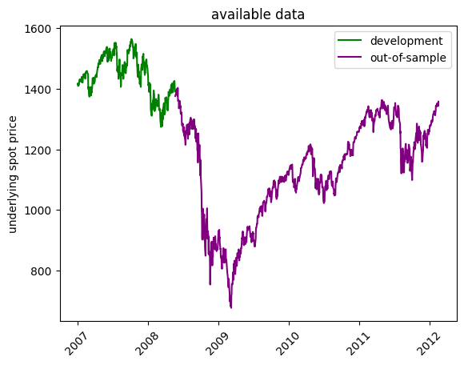
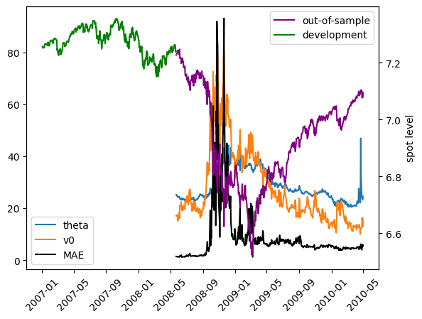

# Loading model


```python
import os
import joblib
import pandas as pd
import numpy as np
import matplotlib.pyplot as plt
from pathlib import Path
from model_settings import ms
root = Path().resolve().parent.parent
models_dir = os.path.join(Path().resolve(),'trained_models','trained_models')
models = [f for f in os.listdir(models_dir) if f.find('ipynb')==-1]
for i,m in enumerate(models):
    print(f"{i}     {m}")
```

    0     2024_10_25 12-23-03 Deep Neural Network asian
    1     2024_10_25 15-28-03 Deep Neural Network barrier_price
    2     2024_10_26 16-52-04 Deep Neural Network asian
    


```python
model = models[2]
model_dir = os.path.join(models_dir,model)
model_files = [f for f in os.listdir(model_dir) if f.find('ipynb')==-1]
for i,m in enumerate(model_files):
    print(f"{i}     {m}")
```

    0     2024_10_26 16-52-04 Deep Neural Network asian insample.csv
    1     2024_10_26 16-52-04 Deep Neural Network asian outsample.csv
    2     2024_10_26 16-52-04 Deep Neural Network asian.pkl
    3     2024_10_26 16-52-04 Deep Neural Network asian.txt
    


```python
train_data = pd.read_csv(os.path.join(model_dir,model_files[0])).iloc[:,1:].copy()
test_data = pd.read_csv(os.path.join(model_dir,model_files[1])).iloc[:,1:].copy()
train_data['calculation_date'] = pd.to_datetime(train_data['calculation_date'])
test_data['calculation_date'] = pd.to_datetime(test_data['calculation_date'])
train_data = train_data.set_index('calculation_date')
test_data = test_data.set_index('calculation_date')
model_fit = joblib.load(os.path.join(model_dir,model_files[2]))
print('maturities:',test_data['days_to_maturity'].unique())
print(model_fit)
```

    maturities: [  7  28  84 168 336   1]
    TransformedTargetRegressor(regressor=Pipeline(steps=[('preprocessor',
                                                          ColumnTransformer(transformers=[('StandardScaler',
                                                                                           StandardScaler(),
                                                                                           ['spot_price',
                                                                                            'strike_price',
                                                                                            'days_to_maturity',
                                                                                            'risk_free_rate',
                                                                                            'dividend_rate',
                                                                                            'kappa',
                                                                                            'theta',
                                                                                            'rho',
                                                                                            'eta',
                                                                                            'v0',
                                                                                            'fixing_frequency',
                                                                                            'n_fixings',
                                                                                            'past_fixings']),
                                                                                          ('OneHotEncoder',
                                                                                           OneHotEncoder(sparse_output=False),
                                                                                           ['averaging_type',
                                                                                            'w'])])),
                                                         ('regressor',
                                                          MLPRegressor(hidden_layer_sizes=(15,
                                                                                           15,
                                                                                           15),
                                                                       learning_rate='adaptive',
                                                                       max_iter=1000,
                                                                       solver='lbfgs'))]),
                               transformer=Pipeline(steps=[('StandardScaler',
                                                            StandardScaler())]))
    


```python
train_spots = train_data['spot_price']
test_spots = test_data['spot_price']
train_dates = pd.Series(train_spots.index)
test_dates = pd.Series(test_spots.index)
plt.figure()
plt.plot(train_spots,color='green',label='development')
plt.plot(test_spots,color='purple',label='out-of-sample')
plt.title('available data')
plt.ylabel('underlying spot price')
plt.xticks(rotation=45)
plt.legend()
plt.show()
print(test_data.shape[0])
```


    

    


    395640
    


```python
diff = test_data['outofsample_error'].copy()
def compute_RMSE(diff):
    return np.sqrt(np.mean(diff**2))
def compute_MAE(diff):
    return np.mean(np.abs(diff))
test_data['RMSE'] = diff.resample('D').apply(compute_RMSE).dropna()
test_data['MAE'] = diff.resample('D').apply(compute_MAE).dropna()
regression_data = test_data[
    [
        'spot_price',
        'theta', 
        'kappa',
        'rho',
        'eta', 
        'v0',
        'RMSE', 'MAE'
    ]
].copy().drop_duplicates()
```

# Testing


```python
from sklearn.linear_model import LinearRegression
import scipy.stats as stats
```

### testing for the effect of the spot level on pricing accuracy


```python
regression_data.dtypes
```


    spot_price    float64
    theta         float64
    kappa         float64
    rho           float64
    eta           float64
    v0            float64
    RMSE          float64
    MAE           float64
    dtype: object


### unrestricted regression


```python
X = regression_data[
    [
        'spot_price',
        'theta', 
        'v0',
    ]
].copy()
X = X[X.index<=pd.Timestamp(2010,5,1)]
X.iloc[:,1:] = np.sqrt(X.iloc[:,1:])*100

# train_spots = train_data['spot_price'].drop_duplicates()
train_spots, X.iloc[:,0] = np.log(train_data['spot_price'].drop_duplicates()),np.log(X.iloc[:,0])

target_name = 'MAE'
y = regression_data[target_name].loc[X.index]

fit_intercept = False


fig, ax1 = plt.subplots()
plt.xticks(rotation=45)
for column in X.columns[1:]:
    ax1.plot(X.index, X[column], label=column)
ax1.plot(X.index, y, label=target_name, color="black")
ax1.legend(loc='lower left')
ax2 = ax1.twinx()
ax2.plot(X.index, X['spot_price'], label='out-of-sample', color="purple")
ax2.plot(train_spots,color='green',label='development')
ax2.set_ylabel("spot level")
ax2.legend(loc="upper right")
plt.show()
```


    

    

run the unrestricted regression with all of
the above features

```python
Ufit = LinearRegression(fit_intercept=fit_intercept).fit(X,y)
Uyhat = Ufit.predict(X)
URSS = sum((Uyhat-y)**2)
print(f"features:\n{X.dtypes}\n\ntarget: {target_name}\n")
for i,c in enumerate(Ufit.coef_):
    print(f"b{i}:   {c}")
print(f"intercept: {Ufit.intercept_}")
print(f"R Squared: {Ufit.score(X,y)}")
print(f"\nURSS: {URSS}")
```

    features:
    spot_price    float64
    theta         float64
    v0            float64
    dtype: object
    
    target: MAE
    
    b0:   0.19560044695752038
    b1:   -0.5261604514504784
    b2:   0.8076135239141494
    intercept: 0.0
    R Squared: 0.6857548259720132
    
    URSS: 20600.204233168934
    

### restricted regression
run the restricted regression where the spot level
is not an explanatory variable to the pricing error

```python
X = X.iloc[:,1:]
Rfit = LinearRegression(fit_intercept=fit_intercept).fit(X,y)
Ryhat = Rfit.predict(X)
RRSS = sum((Ryhat-y)**2)
print(f"features:\n{X.dtypes}\n\ntarget: {target_name}\n")
for i,c in enumerate(Rfit.coef_):
    print(f"b{i+1}:   {c}")
print(f"intercept: {Rfit.intercept_}")
print(f"R Squared: {Rfit.score(X,y)}")
print(f"\nRRSS: {RRSS}")
```

    features:
    theta    float64
    v0       float64
    dtype: object
    
    target: MAE
    
    b1:   -0.4678168271572264
    b2:   0.7948482556543921
    intercept: 0.0
    R Squared: 0.6852279100340946
    
    RRSS: 20634.74597583343
    

### F-Test
next we perform an F-Test to check whether the level 
of the underlying asset's spot value explains the 
pricing error

```python
m = len(Ufit.coef_)-len(Rfit.coef_)
n = len(y)
k = len(Ufit.coef_)
dfn = m
dfd = n-k-1
F = ((RRSS-URSS)/dfn)/(URSS/dfd)
alpha = 0.05
critF = stats.f.ppf(1 - alpha, dfn=dfn, dfd=dfd)
print(f"F: {F}, Critical F: {critF}")
```

    F: 0.8115552283068035, Critical F: 3.860743364946344
    
