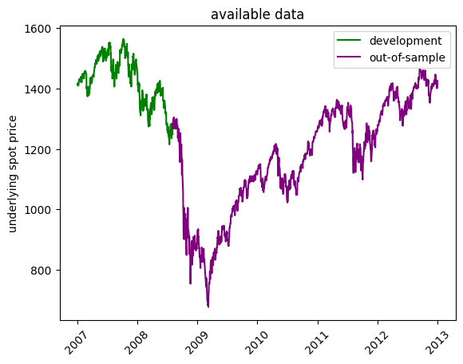

# Loading model


```python
import os
import joblib
import pandas as pd
import numpy as np
import matplotlib.pyplot as plt
from pathlib import Path
from model_settings import ms
root = Path().resolve().parent.parent
models_dir = os.path.join(Path().resolve(),'trained_models','trained_models')
models = [f for f in os.listdir(models_dir) if f.find('ipynb')==-1]
for i,m in enumerate(models):
    print(f"{i}     {m}")
```

    0     2024_10_25 12-23-03 Deep Neural Network asian
    1     2024_10_25 15-28-03 Deep Neural Network barrier_price
    2     2024_10_25 16-04-54 Deep Neural Network asian
    3     2024_10_26 15-23-10 Deep Neural Network asian
    


```python
model = models[1]
model_dir = os.path.join(models_dir,model)
model_files = [f for f in os.listdir(model_dir) if f.find('ipynb')==-1]
for i,m in enumerate(model_files):
    print(f"{i}     {m}")
```

    0     2024_10_25 15-28-03 Deep Neural Network barrier_price insample.csv
    1     2024_10_25 15-28-03 Deep Neural Network barrier_price outsample.csv
    2     2024_10_25 15-28-03 Deep Neural Network barrier_price.pkl
    3     2024_10_25 15-28-03 Deep Neural Network barrier_price.txt
    


```python
train_data = pd.read_csv(os.path.join(model_dir,model_files[0])).iloc[:,1:].copy()
test_data = pd.read_csv(os.path.join(model_dir,model_files[1])).iloc[:,1:].copy()
train_data['calculation_date'] = pd.to_datetime(train_data['calculation_date'])
test_data['calculation_date'] = pd.to_datetime(test_data['calculation_date'])
train_data = train_data.set_index('calculation_date')
test_data = test_data.set_index('calculation_date')
model_fit = joblib.load(os.path.join(model_dir,model_files[2]))
print(model_fit)
```

    TransformedTargetRegressor(regressor=Pipeline(steps=[('preprocessor',
                                                          ColumnTransformer(transformers=[('StandardScaler',
                                                                                           StandardScaler(),
                                                                                           ['spot_price',
                                                                                            'strike_price',
                                                                                            'days_to_maturity',
                                                                                            'risk_free_rate',
                                                                                            'dividend_rate',
                                                                                            'kappa',
                                                                                            'theta',
                                                                                            'rho',
                                                                                            'eta',
                                                                                            'v0',
                                                                                            'barrier']),
                                                                                          ('OneHotEncoder',
                                                                                           OneHotEncoder(sparse_output=False),
                                                                                           ['barrier_type_name',
                                                                                            'w'])])),
                                                         ('regressor',
                                                          MLPRegressor(hidden_layer_sizes=(13,
                                                                                           13,
                                                                                           13),
                                                                       learning_rate='adaptive',
                                                                       max_iter=1000,
                                                                       solver='sgd'))]),
                               transformer=Pipeline(steps=[('StandardScaler',
                                                            StandardScaler())]))
    


```python
train_spots = train_data['spot_price']
test_spots = test_data['spot_price']
train_dates = pd.Series(train_spots.index)
test_dates = pd.Series(test_spots.index)
plt.figure()
plt.plot(train_spots,color='green',label='development')
plt.plot(test_spots,color='purple',label='out-of-sample')
plt.title('available data')
plt.ylabel('underlying spot price')
plt.xticks(rotation=45)
plt.legend()
plt.show()
```


    

    


```python
original_calibrations = os.path.join(root,ms.calibrations_dir)
file = [f for f in os.listdir(original_calibrations) if f.find('bloomberg_spx')!=-1][0]
ogc = pd.read_csv(os.path.join(original_calibrations,file)).iloc[:,1:]
ogc['date'] = pd.to_datetime(ogc['date'],format='%Y-%m-%d')
ogc = ogc.set_index('date')
ivol_keys = ogc.columns[0:7].tolist()
ivols = ogc[ivol_keys].copy()
test_data = test_data.combine_first(ivols).dropna()
test_data.dtypes
```


    12M                       float64
    18M                       float64
    24M                       float64
    30D                       float64
    3M                        float64
    60D                       float64
    6M                        float64
    barrier                   float64
    barrier_price             float64
    barrier_type_name          object
    days_to_maturity          float64
    dividend_rate             float64
    eta                       float64
    kappa                     float64
    observed_price            float64
    outin                      object
    outofsample_error         float64
    outofsample_prediction    float64
    outofsample_target        float64
    rebate                    float64
    rho                       float64
    risk_free_rate            float64
    spot_price                float64
    strike_price              float64
    theta                     float64
    updown                     object
    v0                        float64
    w                          object
    dtype: object


```python
diff = test_data['outofsample_error'].copy()
def compute_RMSE(diff):
    return np.sqrt(np.mean(diff**2))
def compute_MAE(diff):
    return np.mean(np.abs(diff))
test_data['RMSE'] = diff.resample('D').apply(compute_RMSE).dropna()
test_data['MAE'] = diff.resample('D').apply(compute_MAE).dropna()
regression_data = test_data[
    [
        'spot_price',
        'theta', 'kappa', 'rho', 'eta', 
        'v0',
        '30D', '60D', '3M', '6M', '12M', '18M', '24M',
        'RMSE', 'MAE'
    ]
].copy().drop_duplicates()
```

# Testing


```python
from sklearn.linear_model import LinearRegression
import scipy.stats as stats
```

### testing for the effect of the spot level on pricing accuracy


```python
regression_data.dtypes
```


    spot_price    float64
    theta         float64
    kappa         float64
    rho           float64
    eta           float64
    v0            float64
    30D           float64
    60D           float64
    3M            float64
    6M            float64
    12M           float64
    18M           float64
    24M           float64
    RMSE          float64
    MAE           float64
    dtype: object


### unrestricted regression


```python
X = regression_data[
    [
        'spot_price',
        'theta', 
        'kappa','rho', 'eta', 
        'v0',
        '30D', '60D', '3M', '6M', '12M', '18M', '24M'
    ]
].copy()

X.iloc[:,1:] = X.iloc[:,1:]*100

target_name = 'MAE'
y = regression_data[target_name]
X['target'] = y
y = X['target'].values
X = X.iloc[:,:-1].copy()
fit_intercept = False
```
run the unrestricted regression with all of
the above features

```python
Ufit = LinearRegression(fit_intercept=fit_intercept).fit(X,y)
Uyhat = Ufit.predict(X)
URSS = sum((Uyhat-y)**2)
print(f"features:\n{X.dtypes}\n\ntarget: {target_name}\n")
for i,c in enumerate(Ufit.coef_):
    print(f"b{i}:   {c}")
print(f"intercept: {Ufit.intercept_}")
print(f"R Squared: {Ufit.score(X,y)}")
print(f"\nURSS: {URSS}")
```

    features:
    spot_price    float64
    theta         float64
    kappa         float64
    rho           float64
    eta           float64
    v0            float64
    30D           float64
    60D           float64
    3M            float64
    6M            float64
    12M           float64
    18M           float64
    24M           float64
    dtype: object
    
    target: MAE
    
    b0:   0.0011346566110034197
    b1:   0.5552169898927037
    b2:   -0.0007076355997602812
    b3:   0.0933922661520048
    b4:   -0.07694276536575753
    b5:   3.2202769022269155
    b6:   -4.11264434334479
    b7:   1.144294012978351
    b8:   2.449771372578231
    b9:   -0.9638967347414432
    b10:   -0.5184672015721701
    b11:   2.239073186932601
    b12:   -0.5333858493255041
    intercept: 0.0
    R Squared: 0.9194944685216202
    
    URSS: 23418.909909101538
    

### restricted regression
run the restricted regression where the spot level
is not an explanatory variable to the pricing error

```python
X = X.iloc[:,1:]
Rfit = LinearRegression(fit_intercept=fit_intercept).fit(X,y)
Ryhat = Rfit.predict(X)
RRSS = sum((Ryhat-y)**2)
print(f"features:\n{X.dtypes}\n\ntarget: {target_name}\n")
for i,c in enumerate(Rfit.coef_):
    print(f"b{i}:   {c}")
print(f"intercept: {Rfit.intercept_}")
print(f"R Squared: {Rfit.score(X,y)}")
print(f"\nRRSS: {RRSS}")
```

    features:
    theta    float64
    kappa    float64
    rho      float64
    eta      float64
    v0       float64
    30D      float64
    60D      float64
    3M       float64
    6M       float64
    12M      float64
    18M      float64
    24M      float64
    dtype: object
    
    target: MAE
    
    b0:   0.5429207710209374
    b1:   -0.0013140920551730287
    b2:   0.08402864291188167
    b3:   -0.06112859429545572
    b4:   3.2243173193907086
    b5:   -4.052607485823219
    b6:   1.1050369881115556
    b7:   2.401955498498377
    b8:   -1.0868626840963
    b9:   -0.4243479662372407
    b10:   2.206597183319603
    b11:   -0.43143503784867926
    intercept: 0.0
    R Squared: 0.919406519401772
    
    RRSS: 23444.494145072516
    

### F-Test
next we perform an F-Test to check whether the level 
of the underlying asset's spot value explains the p-
ricing error

```python
m = len(Ufit.coef_)-len(Rfit.coef_)
n = len(y)
k = len(Ufit.coef_)
dfn = m
dfd = n-k-1
F = ((RRSS-URSS)/dfn)/(URSS/dfd)
alpha = 0.05
critF = stats.f.ppf(1 - alpha, dfn=dfn, dfd=dfd)
print(f"F: {F}, Critical F: {critF}")
```

    F: 1.1973367988957917, Critical F: 3.8499573439353396
    
