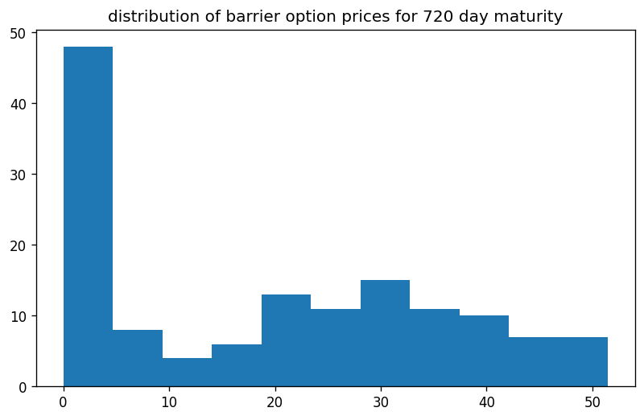

```python
import os
import sys
import requests
import pandas as pd
import numpy as np
import QuantLib as ql
from pathlib import Path
import matplotlib.pyplot as plt
from tqdm import tqdm
from itertools import product
from datetime import datetime
from datetime import timedelta
from model_settings import ms
from historical_av_plot_vol_surface import plot_vol_surface

symbol='SPY'
url = str(
	'https://www.alphavantage.co/query?function=TIME_SERIES_DAILY&symbol='+
	symbol+'&outputsize=full&apikey='+
	ms.av_key)
r = requests.get(url)
spots = pd.Series(pd.DataFrame(r.json()['Time Series (Daily)']).transpose()['4. close'].squeeze())
spots = pd.to_numeric(spots,errors='coerce')
print(spots)
```

    
    pricing settings:
    Actual/365 (Fixed) day counter
    New York stock exchange calendar
    compounding: continuous
    frequency: annual
    
    2024-10-11    579.5800
    2024-10-10    576.1300
    2024-10-09    577.1400
    2024-10-08    573.1700
    2024-10-07    567.8000
                    ...   
    1999-11-05    137.8750
    1999-11-04    136.5312
    1999-11-03    135.5000
    1999-11-02    134.5937
    1999-11-01    135.5625
    Name: 4. close, Length: 6277, dtype: float64
    

# example data collection

let us collect a few recent trading days and inspect the data


```python
dates = spots.index
dates = pd.Series(dates[:5])
print(dates)
```

    0    2024-10-11
    1    2024-10-10
    2    2024-10-09
    3    2024-10-08
    4    2024-10-07
    dtype: object
    


```python
from historical_alphaVantage_collection import collect_av_link
chain = {}
bar = tqdm(total=len(dates))
for date in dates:
    spot = float(spots[date])
    link = collect_av_link(date,spot,symbol)
    printdate = datetime.strptime(date, '%Y-%m-%d').strftime('%A, %Y-%m-%d')
    chain[date] = link
    bar.update(1)
bar.close()
```

    100%|████████████████████████████████████████████████████████████████████████████████████| 5/5 [00:07<00:00,  1.41s/it]
    


```python
demo_spots = spots[dates]
demo_spots.index = pd.to_datetime(demo_spots.index, format='%Y-%m-%d')
plt.figure()
plt.plot(demo_spots,color='black')
plt.title(f'{symbol} option data collected')
plt.xticks(rotation=45)
plt.show()
plt.clf()
```


    

    


    <Figure size 640x480 with 0 Axes>


# example calibraion

now why not select the one trading day and porceed with an example calibration of our Heston (1993) model


```python
date = dates[3]
raw_data = chain[date]
calculation_datetime = datetime.strptime(date,'%Y-%m-%d')
calculation_date = ql.Date(
    calculation_datetime.day,
    calculation_datetime.month,
    calculation_datetime.year,
)
print(str(calculation_datetime.strftime('%A, '))+str(calculation_date))
```

    Tuesday, October 8th, 2024
    

## modelling the volatility surface


```python
df = raw_data.copy()
columns_to_convert = ['strike', 'last', 'mark',
       'bid', 'bid_size', 'ask', 'ask_size', 'volume', 'open_interest',
       'implied_volatility', 'delta', 'gamma', 'theta', 'vega', 'rho']
df[columns_to_convert] = df[
    columns_to_convert].apply(pd.to_numeric, errors='coerce')

df['expiration'] = pd.to_datetime(df['expiration'],format='%Y-%m-%d')
df['date'] = pd.to_datetime(df['date'],format='%Y-%m-%d')
df['days_to_maturity'] = df['expiration'] - df['date']
df['days_to_maturity'] = df['days_to_maturity'] / np.timedelta64(1, 'D')
df['days_to_maturity'] = df['days_to_maturity'].astype('int64')
df = df[(df['days_to_maturity']>=30)&(df['days_to_maturity']<=400)]

df = df[df['volume']>0].copy()
df['spot_price'] = spot

df['moneyness'] = ms.vmoneyness(df['spot_price'],df['strike'],df['type'])
df = df[(df['moneyness']<0)&(df['moneyness']>-0.5)]
indexed = df.copy().set_index(['strike','days_to_maturity'])

T = np.sort(df['days_to_maturity'].unique()).tolist()
K = np.sort(df['strike'].unique()).tolist()
volume_heatmap = pd.DataFrame(
    np.full((len(K), len(T)), np.nan), index=K, columns=T)
for k in K:
    for t in T:
        try:
            volume_heatmap.loc[k,t] = indexed.loc[(k,t),'volume']
        except Exception:
            pass
        
        
hottest_contracts = pd.DataFrame(
    volume_heatmap.unstack().sort_values(
        ascending=False)).head(50).reset_index()
hottest_contracts.columns = ['t','k','volume']
T = np.sort(hottest_contracts['t'].unique()).tolist()
K = np.sort(hottest_contracts['k'].unique()).tolist()

vol_matrix = pd.DataFrame(
    np.full((len(K),len(T)),np.nan),
    index = K,
    columns = T
)
for k in K:
    for t in T:
        try:
            vol_matrix.loc[k,t] = indexed.loc[(k,float(t)),'implied_volatility']
        except Exception:
            pass

vol_matrix = vol_matrix.dropna().copy()
T = vol_matrix.columns.tolist()
K = vol_matrix.index.tolist()

cols_to_map = [
        'contractID', 'symbol', 'expiration', 'type', 'last', 'mark',
        'bid', 'bid_size', 'ask', 'ask_size', 'volume', 'open_interest', 'date',
        'implied_volatility', 'delta', 'gamma', 'theta', 'vega', 'rho',
        'spot_price', 'moneyness'
]
for col in cols_to_map:
    for i,row in hottest_contracts.iterrows():
        hottest_contracts.at[i,col] = indexed.loc[(row['k'],row['t']),col]
        
hottest_contracts = hottest_contracts.rename(
    columns={'t':'days_to_maturity','k':'strike_price'}).copy()
```


```python
s = float(df['spot_price'].unique()[0])
print(f"\n{symbol} spot price: {s}")
print(f"\n{vol_matrix}\n")
plot_vol_surface(vol_matrix)
```

    
    SPY spot price: 567.8
    
               31       38       52       73       84       101      115      164  \
    500.0  0.31159  0.29803  0.27851  0.26617  0.25839  0.25336  0.24940  0.24071   
    510.0  0.29117  0.27928  0.26144  0.25199  0.24513  0.24086  0.23751  0.23095   
    520.0  0.27013  0.26098  0.24544  0.23827  0.23217  0.22882  0.22608  0.22120   
    525.0  0.26083  0.25199  0.23781  0.23156  0.22577  0.22288  0.22013  0.21632   
    530.0  0.25138  0.24330  0.23004  0.22486  0.21983  0.21693  0.21464  0.21160   
    540.0  0.23278  0.22608  0.21495  0.21160  0.20718  0.20519  0.20352  0.20199   
    550.0  0.21495  0.20931  0.20016  0.19818  0.19452  0.19330  0.19239  0.19254   
    555.0  0.20580  0.20077  0.19254  0.19147  0.18812  0.18751  0.18690  0.18797   
    560.0  0.19650  0.19224  0.18492  0.18461  0.18187  0.18187  0.18157  0.18355   
    565.0  0.18705  0.18340  0.17745  0.17791  0.17577  0.17608  0.17623  0.17928   
    570.0  0.18004  0.17562  0.17044  0.16663  0.15702  0.15763  0.15794  0.15931   
    575.0  0.17013  0.16663  0.16221  0.15962  0.15077  0.15199  0.15260  0.15474   
    580.0  0.16114  0.15779  0.15428  0.15276  0.14483  0.14651  0.14742  0.15001   
    585.0  0.15245  0.14940  0.14712  0.14651  0.13919  0.14132  0.14224  0.14529   
    590.0  0.14483  0.14209  0.14026  0.14071  0.13385  0.13645  0.13766  0.14117   
    600.0  0.13263  0.13035  0.12913  0.13035  0.12440  0.12760  0.12913  0.13385   
    605.0  0.12913  0.12669  0.12486  0.12608  0.12044  0.12364  0.12547  0.13050   
    
               346  
    500.0  0.23080  
    510.0  0.22486  
    520.0  0.21907  
    525.0  0.21617  
    530.0  0.21342  
    540.0  0.20748  
    550.0  0.20169  
    555.0  0.19894  
    560.0  0.19620  
    565.0  0.19346  
    570.0  0.15550  
    575.0  0.15245  
    580.0  0.14971  
    585.0  0.14681  
    590.0  0.14391  
    600.0  0.13827  
    605.0  0.13538  
    
    


    

    


    <Figure size 640x480 with 0 Axes>


## calibrating a Heston (1993) model


```python
vol_matrix = vol_matrix.sort_index().drop_duplicates()
pd.to_numeric(raw_data['last'])
raw_data['date'] = pd.to_datetime(raw_data['date'])
raw_data['expiration'] = pd.to_datetime(raw_data['expiration'])
raw_data['implied_volatility'] = pd.to_numeric(raw_data['implied_volatility']).astype(float)
raw_data['strike'] = pd.to_numeric(raw_data['strike'])
raw_data['last'] = pd.to_numeric(raw_data['last'])
contract_maturities = np.array((raw_data['expiration'] - raw_data['date']) / timedelta(days=1)).astype(int)
raw_data['days_to_maturity'] = contract_maturities

T = vol_matrix.columns.tolist()
K = vol_matrix.index.tolist()
r = 0.04
g = 0.0

ql.Settings.instance().evaluationDate = calculation_date
flat_ts, dividend_ts = ms.ql_ts_rg(r, g, calculation_date)
S_handle = ql.QuoteHandle(ql.SimpleQuote(s))

heston_helpers = []
v0 = 0.01; kappa = 0.2; theta = 0.02; rho = -0.75; eta = 0.5;
process = ql.HestonProcess(
    flat_ts,
    dividend_ts,
    S_handle,
    v0,                # Initial volatility
    kappa,             # Mean reversion speed
    theta,             # Long-run variance (volatility squared)
    eta,               # Volatility of the volatility
    rho                # Correlation between asset and volatility
)
model = ql.HestonModel(process)
engine = ql.AnalyticHestonEngine(model)

for t in T:
    for k in K:
        p = ql.Period(int(t),ql.Days)
        volatility = vol_matrix.loc[k,t]
        helper = ql.HestonModelHelper(
            p, ms.calendar, float(s), k, 
            ql.QuoteHandle(ql.SimpleQuote(volatility)), 
            flat_ts, 
            dividend_ts
            )
        helper.setPricingEngine(engine)
        heston_helpers.append(helper)

lm = ql.LevenbergMarquardt(1e-8, 1e-8, 1e-8)


model.calibrate(heston_helpers, lm,
                  ql.EndCriteria(1000, 50, 1.0e-8,1.0e-8, 1.0e-8))

theta, kappa, eta, rho, v0 = model.params()
heston_parameters = pd.Series(
    [theta, kappa, eta, rho, v0],
    index = ['theta', 'kappa', 'eta', 'rho', 'v0'],
    dtype = float
)
calibration_test_data = raw_data.copy()[['strike','type','last','implied_volatility','days_to_maturity']]
calibration_test_data.columns = ['strike_price','w','market_price','volatility','days_to_maturity']
calibration_test_data['spot_price'] = s
calibration_test_data['risk_free_rate'] = r
calibration_test_data['dividend_rate'] = g
calibration_test_data = calibration_test_data[calibration_test_data['days_to_maturity'].isin(df['days_to_maturity'])]
calibration_test_data[heston_parameters.index.tolist()] = np.tile(heston_parameters,(calibration_test_data.shape[0],1))
calibration_test_data.loc[:,'moneyness'] = ms.vmoneyness(
    calibration_test_data['spot_price'].values,
    calibration_test_data['strike_price'].values,
    calibration_test_data['w'].values)
calibration_test_data['calculation_date'] = calculation_datetime
calibration_test_data['black_scholes'] = ms.vector_black_scholes(calibration_test_data)
calibration_test_data['heston_price'] = ms.vector_heston_price(calibration_test_data)
```

## testing calibration accuracy


```python
calibration_test_data.loc[:,'error'] = calibration_test_data['heston_price'].values - calibration_test_data['black_scholes'].values
avg = np.mean(np.abs(calibration_test_data['error']))
print(f"\n{printdate}\n{heston_parameters}\naverage absolute error: {round(avg,3)}")
print(f"calibration testing dataset:\n{calibration_test_data.describe()}")
```

    
    Monday, 2024-10-07
    theta    0.092277
    kappa    0.702582
    eta      1.222380
    rho     -0.779353
    v0       0.042068
    dtype: float64
    average absolute error: 2.569
    calibration testing dataset:
           strike_price  market_price   volatility  days_to_maturity  \
    count   4946.000000   4946.000000  4946.000000       4946.000000   
    mean     516.437525     41.852331     0.249732        163.988273   
    min      120.000000      0.000000     0.012760         31.000000   
    25%      454.000000      0.000000     0.164875         73.000000   
    50%      528.000000      6.140000     0.211365        143.000000   
    75%      585.000000     55.582500     0.292690        265.000000   
    max      830.000000    451.670000     1.349070        357.000000   
    std      125.840010     71.700001     0.145537        108.548043   
    
             spot_price  risk_free_rate  dividend_rate         theta  \
    count  4.946000e+03         4946.00         4946.0  4.946000e+03   
    mean   5.678000e+02            0.04            0.0  9.227674e-02   
    min    5.678000e+02            0.04            0.0  9.227674e-02   
    25%    5.678000e+02            0.04            0.0  9.227674e-02   
    50%    5.678000e+02            0.04            0.0  9.227674e-02   
    75%    5.678000e+02            0.04            0.0  9.227674e-02   
    max    5.678000e+02            0.04            0.0  9.227674e-02   
    std    1.136983e-13            0.00            0.0  1.387919e-17   
    
                  kappa           eta           rho            v0     moneyness  \
    count  4.946000e+03  4.946000e+03  4.946000e+03  4.946000e+03  4.946000e+03   
    mean   7.025824e-01  1.222380e+00 -7.793528e-01  4.206786e-02  5.215181e-02   
    min    7.025824e-01  1.222380e+00 -7.793528e-01  4.206786e-02 -7.886580e-01   
    25%    7.025824e-01  1.222380e+00 -7.793528e-01  4.206786e-02 -1.246918e-01   
    50%    7.025824e-01  1.222380e+00 -7.793528e-01  4.206786e-02  6.201350e-08   
    75%    7.025824e-01  1.222380e+00 -7.793528e-01  4.206786e-02  1.424547e-01   
    max    7.025824e-01  1.222380e+00 -7.793528e-01  4.206786e-02  3.731667e+00   
    std    1.110335e-16  2.220671e-16  1.110335e-16  6.939595e-18  3.755533e-01   
    
              calculation_date  black_scholes  heston_price        error  
    count                 4946    4946.000000   4946.000000  4946.000000  
    mean   2024-10-08 00:00:00      59.586814     58.999693    -0.587121  
    min    2024-10-08 00:00:00       0.006047      0.000017   -34.346707  
    25%    2024-10-08 00:00:00       4.687598      5.475387    -0.369348  
    50%    2024-10-08 00:00:00      22.455073     21.419815     0.332929  
    75%    2024-10-08 00:00:00      83.866605     84.095200     1.204941  
    max    2024-10-08 00:00:00     448.984729    448.756187     8.284504  
    std                    NaN      81.096391     80.270793     5.381363  
    

# train data generation
now that we have calibrated our pricing engine, let us proceed with generating 
all real down barrier option contract combinations for this trading day
(i.e., all barriers less than underlying spot price)

```python
K = np.linspace(s*0.8,s*1.2,7).astype(int).tolist()
down_barriers =  np.linspace(s*0.5,s*0.99,5).astype(int).tolist()
T = [
    30,60,90,
    180,360,540,720
]
print(f"\n{symbol} spot price:\n     {spot}\nstrikes:\n     {K}\n\nbarriers:\n     {down_barriers}\n\nmaturities:\n     {T}\n")
```

    
    SPY spot price:
         567.8
    strikes:
         [454, 492, 529, 567, 605, 643, 681]
    
    barriers:
         [283, 353, 423, 492, 562]
    
    maturities:
         [30, 60, 90, 180, 360, 540, 720]
    
    


```python
features = pd.DataFrame(
    product(
        [spot],
        K,
        T,
        down_barriers,
        [0.0], # rebate
        ['put','call'],
        [0.04], # risk-free rate
        [0.0], # dividend rate
        [theta], 
        [kappa], 
        [eta], 
        [rho], 
        [v0],
        [calculation_datetime],
        ['Out','In']
    ),
    columns = [
        'spot_price',
        'strike_price',
        'days_to_maturity',
        'barrier',
        'rebate',
        'w',
        'risk_free_rate',
        'dividend_rate',
        'theta', 'kappa', 'eta', 'rho', 'v0',
        'calculation_date',
        'outin',
    ]
)
features['moneyness'] = ms.vmoneyness(features['spot_price'],features['strike_price'],features['w'])
features['barrier_type_name'] = 'Down' + features['outin']
features['vanilla_price'] = ms.vector_heston_price(features)
features['barrier_price'] = ms.vector_barrier_price(features)
featuresby_t = features.copy().set_index('days_to_maturity')
```


```python
for t in T:
    plt.figure(figsize=plt.figaspect(0.6),dpi=120)
    prices= featuresby_t.loc[t,'barrier_price']
    plt.hist(prices,bins=int(np.sqrt(prices.shape[0])))
    plt.title(f'distribution of barrier option prices for {t} day maturity')
    plt.show()
    plt.clf()
```


    

    


    <Figure size 640x480 with 0 Axes>


    

    


    <Figure size 640x480 with 0 Axes>


    

    


    <Figure size 640x480 with 0 Axes>


    

    


    <Figure size 640x480 with 0 Axes>


    

    


    <Figure size 640x480 with 0 Axes>


    

    


    <Figure size 640x480 with 0 Axes>


    

    


    <Figure size 640x480 with 0 Axes>


# model training
now that we have a dataset, we can for example, test whether our model is able to predict 
the prices of our two year barrier options while only having seen the others in training

```python
import convsklearn
help(convsklearn)
```

    a proprietary package of convenience wrappers for sklearn
    test size: 1.0%
    random state: None
    maximum iterations: 1000
    
    target: 
    observed_price
    
    features: 
    ['spot_price', 'strike_price', 'days_to_maturity', 'risk_free_rate', 'dividend_rate', 'kappa', 'theta', 'rho', 'eta', 'v0', 'barrier', 'barrier_type_name', 'w']
    
    feature transformer(s):
    ('StandardScaler', StandardScaler(), ['spot_price', 'strike_price', 'days_to_maturity', 'risk_free_rate', 'dividend_rate', 'kappa', 'theta', 'rho', 'eta', 'v0', 'barrier'])
    
    ('OneHotEncoder', OneHotEncoder(sparse_output=False), ['barrier_type_name', 'w'])
    
    target transformer(s):
    StandardScaler()
    
    Help on package convsklearn:
    
    NAME
        convsklearn
    
    PACKAGE CONTENTS
        convsklearn
    
    DATA
        barrier_trainer = <convsklearn.convsklearn.convsklearn object>
        categorical_features = ['barrier_type_name', 'w']
        feature_set = ['spot_price', 'strike_price', 'days_to_maturity', 'risk...
        numerical_features = ['spot_price', 'strike_price', 'days_to_maturity'...
        target_name = 'observed_price'
        target_transformer_pipeline = Pipeline(steps=[('StandardScaler', Stand...
        transformers = [('StandardScaler', StandardScaler(), ['spot_price', 's...
    
    FILE
        e:\python\lib\site-packages\convsklearn\__init__.py
    
    
    


```python
help(convsklearn.convsklearn)
```

    Help on class convsklearn in module convsklearn.convsklearn:
    
    class convsklearn(builtins.object)
     |  convsklearn(target_name, numerical_features, categorical_features, transformers, target_transformer_pipeline, n_layers=None, random_state=None, test_size=0.01, max_iter=1000, solver='sgd', alpha=0.0001, learning_rate='adaptive', activation_function='relu', rf_n_estimators=50, rf_min_samples_leaf=2000)
     |
     |  Methods defined here:
     |
     |  __init__(self, target_name, numerical_features, categorical_features, transformers, target_transformer_pipeline, n_layers=None, random_state=None, test_size=0.01, max_iter=1000, solver='sgd', alpha=0.0001, learning_rate='adaptive', activation_function='relu', rf_n_estimators=50, rf_min_samples_leaf=2000)
     |      Initialize self.  See help(type(self)) for accurate signature.
     |
     |  get_train_test_arrays(self, train_data, test_data, feature_set=None, target_name=None)
     |
     |  plot_model_performance(self, df, X_name, Y_name, xlabel, ylabel, runtime, title)
     |
     |  preprocess(self)
     |
     |  run_dnn(self, preprocessor, train_X, train_y)
     |
     |  run_lm(self, train_X, train_y)
     |
     |  run_nnet(self, preprocessor, train_X, train_y)
     |
     |  run_rf(self, preprocessor, train_X, train_y)
     |
     |  test_model(self, test_data, test_X, test_y, model_fit)
     |
     |  test_prediction_accuracy(self, model_fit, test_data, train_data)
     |
     |  ----------------------------------------------------------------------
     |  Data descriptors defined here:
     |
     |  __dict__
     |      dictionary for instance variables
     |
     |  __weakref__
     |      list of weak references to the object
    
    


```python
from convsklearn import target_name, numerical_features, categorical_features, transformers, target_transformer_pipeline
```


```python
barrier_trainer = convsklearn.convsklearn(
    target_name=target_name, 
    numerical_features=numerical_features, 
    categorical_features=categorical_features, 
    transformers=transformers, 
    target_transformer_pipeline=target_transformer_pipeline, 
    max_iter=1000
)
```

    test size: 1.0%
    random state: None
    maximum iterations: 1000
    
    target: 
    observed_price
    
    features: 
    ['spot_price', 'strike_price', 'days_to_maturity', 'risk_free_rate', 'dividend_rate', 'kappa', 'theta', 'rho', 'eta', 'v0', 'barrier', 'barrier_type_name', 'w']
    
    feature transformer(s):
    ('StandardScaler', StandardScaler(), ['spot_price', 'strike_price', 'days_to_maturity', 'risk_free_rate', 'dividend_rate', 'kappa', 'theta', 'rho', 'eta', 'v0', 'barrier'])
    
    ('OneHotEncoder', OneHotEncoder(sparse_output=False), ['barrier_type_name', 'w'])
    
    target transformer(s):
    StandardScaler()
    
    


```python
features['observed_price'] = ms.noisyfier(features.loc[:,'barrier_price']) # apply slight peturbation in the form of a random normal with standard deviation 0.15
train_data = features[features['days_to_maturity']!=720]
test_data = features[features['days_to_maturity']==720]
print(f"train data count: {train_data.shape[0]}")
print(f"test data count: {test_data.shape[0]}")
arrs = barrier_trainer.get_train_test_arrays(train_data,test_data)
train_X = arrs['train_X']
train_y = arrs['train_y']
test_X = arrs['test_X']
test_y = arrs['train_y']
preprocessor = barrier_trainer.preprocess()
dnn_barriers, runtime, specs = barrier_trainer.run_dnn(preprocessor, train_X, train_y)
insample, outsample, errors = barrier_trainer.test_prediction_accuracy(dnn_barriers, test_data, train_data)
print(dnn_barriers)

outsample = outsample.rename(
    columns = {
        'strike_price':'k',
        'days_to_maturity':'t',
        'barrier_type_name':'type',
        'barrier_price':'price',
        'vanilla_price':'vanilla',
        'spot_price':'spot'
        }
)
outsample = outsample[[
    'spot', 'k', 't', 'barrier','type', 'w', 'price', 'vanilla', 
    'outofsample_target', 'outofsample_prediction', 'outofsample_error'
]]
pd.set_option("display.float_format", "{:.2f}".format)
pd.set_option("display.max_rows",None)
print(outsample.describe())
```

    train data count: 840
    test data count: 140
    
    training...
    
    Deep Neural Network
    hidden layers sizes: (13, 13, 13)
    learning rate: adaptive
    activation: relu
    solver: sgd
    alpha: 0.0001
    
    in sample:
         RSME: 7.316641235311868
         MAE: 4.886395520077746
    
    out of sample:
         RSME: 11.012887813516222
         MAE: 6.802961189071137
    TransformedTargetRegressor(regressor=Pipeline(steps=[('preprocessor',
                                                          ColumnTransformer(transformers=[('StandardScaler',
                                                                                           StandardScaler(),
                                                                                           ['spot_price',
                                                                                            'strike_price',
                                                                                            'days_to_maturity',
                                                                                            'risk_free_rate',
                                                                                            'dividend_rate',
                                                                                            'kappa',
                                                                                            'theta',
                                                                                            'rho',
                                                                                            'eta',
                                                                                            'v0',
                                                                                            'barrier']),
                                                                                          ('OneHotEncoder',
                                                                                           OneHotEncoder(sparse_output=False),
                                                                                           ['barrier_type_name',
                                                                                            'w'])])),
                                                         ('regressor',
                                                          MLPRegressor(hidden_layer_sizes=(13,
                                                                                           13,
                                                                                           13),
                                                                       learning_rate='adaptive',
                                                                       max_iter=1000,
                                                                       solver='sgd'))]),
                               transformer=Pipeline(steps=[('StandardScaler',
                                                            StandardScaler())]))
            spot      k      t  barrier  price  vanilla  outofsample_target  \
    count 140.00 140.00 140.00   140.00 140.00   140.00              140.00   
    mean  567.80 567.29 720.00   422.60  31.93    63.85               31.94   
    std     0.00  75.91   0.00    98.92  38.05    44.46               38.04   
    min   567.80 454.00 720.00   283.00   0.00    17.88                0.00   
    25%   567.80 492.00 720.00   353.00   3.26    29.36                3.51   
    50%   567.80 567.00 720.00   423.00  18.90    50.80               19.05   
    75%   567.80 643.00 720.00   492.00  42.15    80.56               42.12   
    max   567.80 681.00 720.00   562.00 165.32   167.20              165.55   
    
           outofsample_prediction  outofsample_error  
    count                  140.00             140.00  
    mean                    32.32               0.39  
    std                     35.75              11.05  
    min                     -6.56             -69.71  
    25%                      5.99              -3.35  
    50%                     22.61               0.96  
    75%                     46.71               5.25  
    max                    169.86              38.19  
    


```python
outsample
```


<div>
<style scoped>
    .dataframe tbody tr th:only-of-type {
        vertical-align: middle;
    }

    .dataframe tbody tr th {
        vertical-align: top;
    }

    .dataframe thead th {
        text-align: right;
    }
</style>
<table border="1" class="dataframe">
  <thead>
    <tr style="text-align: right;">
      <th></th>
      <th>spot</th>
      <th>k</th>
      <th>t</th>
      <th>barrier</th>
      <th>type</th>
      <th>w</th>
      <th>price</th>
      <th>vanilla</th>
      <th>outofsample_target</th>
      <th>outofsample_prediction</th>
      <th>outofsample_error</th>
    </tr>
  </thead>
  <tbody>
    <tr>
      <th>120</th>
      <td>567.80</td>
      <td>454</td>
      <td>720</td>
      <td>283</td>
      <td>DownOut</td>
      <td>put</td>
      <td>1.53</td>
      <td>18.95</td>
      <td>1.76</td>
      <td>10.18</td>
      <td>8.41</td>
    </tr>
    <tr>
      <th>121</th>
      <td>567.80</td>
      <td>454</td>
      <td>720</td>
      <td>283</td>
      <td>DownIn</td>
      <td>put</td>
      <td>17.38</td>
      <td>18.95</td>
      <td>17.09</td>
      <td>8.71</td>
      <td>-8.38</td>
    </tr>
    <tr>
      <th>122</th>
      <td>567.80</td>
      <td>454</td>
      <td>720</td>
      <td>283</td>
      <td>DownOut</td>
      <td>call</td>
      <td>165.32</td>
      <td>167.20</td>
      <td>165.55</td>
      <td>169.86</td>
      <td>4.30</td>
    </tr>
    <tr>
      <th>123</th>
      <td>567.80</td>
      <td>454</td>
      <td>720</td>
      <td>283</td>
      <td>DownIn</td>
      <td>call</td>
      <td>1.98</td>
      <td>167.20</td>
      <td>1.92</td>
      <td>18.74</td>
      <td>16.83</td>
    </tr>
    <tr>
      <th>124</th>
      <td>567.80</td>
      <td>454</td>
      <td>720</td>
      <td>353</td>
      <td>DownOut</td>
      <td>put</td>
      <td>0.36</td>
      <td>18.95</td>
      <td>0.42</td>
      <td>7.32</td>
      <td>6.90</td>
    </tr>
    <tr>
      <th>125</th>
      <td>567.80</td>
      <td>454</td>
      <td>720</td>
      <td>353</td>
      <td>DownIn</td>
      <td>put</td>
      <td>18.56</td>
      <td>18.95</td>
      <td>18.49</td>
      <td>16.83</td>
      <td>-1.66</td>
    </tr>
    <tr>
      <th>126</th>
      <td>567.80</td>
      <td>454</td>
      <td>720</td>
      <td>353</td>
      <td>DownOut</td>
      <td>call</td>
      <td>161.27</td>
      <td>167.20</td>
      <td>161.50</td>
      <td>160.38</td>
      <td>-1.12</td>
    </tr>
    <tr>
      <th>127</th>
      <td>567.80</td>
      <td>454</td>
      <td>720</td>
      <td>353</td>
      <td>DownIn</td>
      <td>call</td>
      <td>6.03</td>
      <td>167.20</td>
      <td>6.06</td>
      <td>22.45</td>
      <td>16.39</td>
    </tr>
    <tr>
      <th>128</th>
      <td>567.80</td>
      <td>454</td>
      <td>720</td>
      <td>423</td>
      <td>DownOut</td>
      <td>put</td>
      <td>0.03</td>
      <td>18.95</td>
      <td>0.00</td>
      <td>5.72</td>
      <td>5.72</td>
    </tr>
    <tr>
      <th>129</th>
      <td>567.80</td>
      <td>454</td>
      <td>720</td>
      <td>423</td>
      <td>DownIn</td>
      <td>put</td>
      <td>18.88</td>
      <td>18.95</td>
      <td>19.08</td>
      <td>19.63</td>
      <td>0.56</td>
    </tr>
    <tr>
      <th>130</th>
      <td>567.80</td>
      <td>454</td>
      <td>720</td>
      <td>423</td>
      <td>DownOut</td>
      <td>call</td>
      <td>150.52</td>
      <td>167.20</td>
      <td>150.48</td>
      <td>135.68</td>
      <td>-14.81</td>
    </tr>
    <tr>
      <th>131</th>
      <td>567.80</td>
      <td>454</td>
      <td>720</td>
      <td>423</td>
      <td>DownIn</td>
      <td>call</td>
      <td>16.78</td>
      <td>167.20</td>
      <td>16.88</td>
      <td>30.20</td>
      <td>13.31</td>
    </tr>
    <tr>
      <th>132</th>
      <td>567.80</td>
      <td>454</td>
      <td>720</td>
      <td>492</td>
      <td>DownOut</td>
      <td>put</td>
      <td>0.00</td>
      <td>18.95</td>
      <td>0.00</td>
      <td>2.37</td>
      <td>2.37</td>
    </tr>
    <tr>
      <th>133</th>
      <td>567.80</td>
      <td>454</td>
      <td>720</td>
      <td>492</td>
      <td>DownIn</td>
      <td>put</td>
      <td>18.91</td>
      <td>18.95</td>
      <td>19.03</td>
      <td>22.47</td>
      <td>3.44</td>
    </tr>
    <tr>
      <th>134</th>
      <td>567.80</td>
      <td>454</td>
      <td>720</td>
      <td>492</td>
      <td>DownOut</td>
      <td>call</td>
      <td>122.62</td>
      <td>167.20</td>
      <td>122.46</td>
      <td>101.98</td>
      <td>-20.47</td>
    </tr>
    <tr>
      <th>135</th>
      <td>567.80</td>
      <td>454</td>
      <td>720</td>
      <td>492</td>
      <td>DownIn</td>
      <td>call</td>
      <td>44.68</td>
      <td>167.20</td>
      <td>44.61</td>
      <td>56.68</td>
      <td>12.07</td>
    </tr>
    <tr>
      <th>136</th>
      <td>567.80</td>
      <td>454</td>
      <td>720</td>
      <td>562</td>
      <td>DownOut</td>
      <td>put</td>
      <td>0.00</td>
      <td>18.95</td>
      <td>0.09</td>
      <td>-3.61</td>
      <td>-3.70</td>
    </tr>
    <tr>
      <th>137</th>
      <td>567.80</td>
      <td>454</td>
      <td>720</td>
      <td>562</td>
      <td>DownIn</td>
      <td>put</td>
      <td>18.91</td>
      <td>18.95</td>
      <td>19.08</td>
      <td>24.23</td>
      <td>5.16</td>
    </tr>
    <tr>
      <th>138</th>
      <td>567.80</td>
      <td>454</td>
      <td>720</td>
      <td>562</td>
      <td>DownOut</td>
      <td>call</td>
      <td>21.58</td>
      <td>167.20</td>
      <td>21.49</td>
      <td>59.68</td>
      <td>38.19</td>
    </tr>
    <tr>
      <th>139</th>
      <td>567.80</td>
      <td>454</td>
      <td>720</td>
      <td>562</td>
      <td>DownIn</td>
      <td>call</td>
      <td>145.72</td>
      <td>167.20</td>
      <td>145.66</td>
      <td>75.95</td>
      <td>-69.71</td>
    </tr>
    <tr>
      <th>260</th>
      <td>567.80</td>
      <td>492</td>
      <td>720</td>
      <td>283</td>
      <td>DownOut</td>
      <td>put</td>
      <td>3.04</td>
      <td>23.67</td>
      <td>3.21</td>
      <td>2.98</td>
      <td>-0.23</td>
    </tr>
    <tr>
      <th>261</th>
      <td>567.80</td>
      <td>492</td>
      <td>720</td>
      <td>283</td>
      <td>DownIn</td>
      <td>put</td>
      <td>20.58</td>
      <td>23.67</td>
      <td>20.69</td>
      <td>15.15</td>
      <td>-5.54</td>
    </tr>
    <tr>
      <th>262</th>
      <td>567.80</td>
      <td>492</td>
      <td>720</td>
      <td>283</td>
      <td>DownOut</td>
      <td>call</td>
      <td>135.42</td>
      <td>136.80</td>
      <td>135.19</td>
      <td>145.25</td>
      <td>10.06</td>
    </tr>
    <tr>
      <th>263</th>
      <td>567.80</td>
      <td>492</td>
      <td>720</td>
      <td>283</td>
      <td>DownIn</td>
      <td>call</td>
      <td>1.45</td>
      <td>136.80</td>
      <td>1.40</td>
      <td>3.03</td>
      <td>1.63</td>
    </tr>
    <tr>
      <th>264</th>
      <td>567.80</td>
      <td>492</td>
      <td>720</td>
      <td>353</td>
      <td>DownOut</td>
      <td>put</td>
      <td>0.99</td>
      <td>23.67</td>
      <td>0.79</td>
      <td>3.36</td>
      <td>2.58</td>
    </tr>
    <tr>
      <th>265</th>
      <td>567.80</td>
      <td>492</td>
      <td>720</td>
      <td>353</td>
      <td>DownIn</td>
      <td>put</td>
      <td>22.63</td>
      <td>23.67</td>
      <td>22.58</td>
      <td>19.51</td>
      <td>-3.07</td>
    </tr>
    <tr>
      <th>266</th>
      <td>567.80</td>
      <td>492</td>
      <td>720</td>
      <td>353</td>
      <td>DownOut</td>
      <td>call</td>
      <td>132.45</td>
      <td>136.80</td>
      <td>132.39</td>
      <td>144.07</td>
      <td>11.67</td>
    </tr>
    <tr>
      <th>267</th>
      <td>567.80</td>
      <td>492</td>
      <td>720</td>
      <td>353</td>
      <td>DownIn</td>
      <td>call</td>
      <td>4.41</td>
      <td>136.80</td>
      <td>4.44</td>
      <td>10.92</td>
      <td>6.47</td>
    </tr>
    <tr>
      <th>268</th>
      <td>567.80</td>
      <td>492</td>
      <td>720</td>
      <td>423</td>
      <td>DownOut</td>
      <td>put</td>
      <td>0.15</td>
      <td>23.67</td>
      <td>0.11</td>
      <td>3.64</td>
      <td>3.53</td>
    </tr>
    <tr>
      <th>269</th>
      <td>567.80</td>
      <td>492</td>
      <td>720</td>
      <td>423</td>
      <td>DownIn</td>
      <td>put</td>
      <td>23.47</td>
      <td>23.67</td>
      <td>23.73</td>
      <td>23.07</td>
      <td>-0.66</td>
    </tr>
    <tr>
      <th>270</th>
      <td>567.80</td>
      <td>492</td>
      <td>720</td>
      <td>423</td>
      <td>DownOut</td>
      <td>call</td>
      <td>124.36</td>
      <td>136.80</td>
      <td>124.35</td>
      <td>124.57</td>
      <td>0.22</td>
    </tr>
    <tr>
      <th>271</th>
      <td>567.80</td>
      <td>492</td>
      <td>720</td>
      <td>423</td>
      <td>DownIn</td>
      <td>call</td>
      <td>12.51</td>
      <td>136.80</td>
      <td>12.46</td>
      <td>19.92</td>
      <td>7.46</td>
    </tr>
    <tr>
      <th>272</th>
      <td>567.80</td>
      <td>492</td>
      <td>720</td>
      <td>492</td>
      <td>DownOut</td>
      <td>put</td>
      <td>0.00</td>
      <td>23.67</td>
      <td>0.00</td>
      <td>1.82</td>
      <td>1.82</td>
    </tr>
    <tr>
      <th>273</th>
      <td>567.80</td>
      <td>492</td>
      <td>720</td>
      <td>492</td>
      <td>DownIn</td>
      <td>put</td>
      <td>23.62</td>
      <td>23.67</td>
      <td>23.80</td>
      <td>28.83</td>
      <td>5.03</td>
    </tr>
    <tr>
      <th>274</th>
      <td>567.80</td>
      <td>492</td>
      <td>720</td>
      <td>492</td>
      <td>DownOut</td>
      <td>call</td>
      <td>102.17</td>
      <td>136.80</td>
      <td>102.25</td>
      <td>90.12</td>
      <td>-12.13</td>
    </tr>
    <tr>
      <th>275</th>
      <td>567.80</td>
      <td>492</td>
      <td>720</td>
      <td>492</td>
      <td>DownIn</td>
      <td>call</td>
      <td>34.69</td>
      <td>136.80</td>
      <td>34.66</td>
      <td>46.14</td>
      <td>11.49</td>
    </tr>
    <tr>
      <th>276</th>
      <td>567.80</td>
      <td>492</td>
      <td>720</td>
      <td>562</td>
      <td>DownOut</td>
      <td>put</td>
      <td>0.00</td>
      <td>23.67</td>
      <td>0.00</td>
      <td>-3.46</td>
      <td>-3.46</td>
    </tr>
    <tr>
      <th>277</th>
      <td>567.80</td>
      <td>492</td>
      <td>720</td>
      <td>562</td>
      <td>DownIn</td>
      <td>put</td>
      <td>23.62</td>
      <td>23.67</td>
      <td>23.73</td>
      <td>30.59</td>
      <td>6.85</td>
    </tr>
    <tr>
      <th>278</th>
      <td>567.80</td>
      <td>492</td>
      <td>720</td>
      <td>562</td>
      <td>DownOut</td>
      <td>call</td>
      <td>18.18</td>
      <td>136.80</td>
      <td>18.04</td>
      <td>47.92</td>
      <td>29.88</td>
    </tr>
    <tr>
      <th>279</th>
      <td>567.80</td>
      <td>492</td>
      <td>720</td>
      <td>562</td>
      <td>DownIn</td>
      <td>call</td>
      <td>118.68</td>
      <td>136.80</td>
      <td>118.44</td>
      <td>75.25</td>
      <td>-43.20</td>
    </tr>
    <tr>
      <th>400</th>
      <td>567.80</td>
      <td>529</td>
      <td>720</td>
      <td>283</td>
      <td>DownOut</td>
      <td>put</td>
      <td>5.44</td>
      <td>29.36</td>
      <td>5.48</td>
      <td>6.19</td>
      <td>0.70</td>
    </tr>
    <tr>
      <th>401</th>
      <td>567.80</td>
      <td>529</td>
      <td>720</td>
      <td>283</td>
      <td>DownIn</td>
      <td>put</td>
      <td>23.83</td>
      <td>29.36</td>
      <td>23.59</td>
      <td>21.42</td>
      <td>-2.17</td>
    </tr>
    <tr>
      <th>402</th>
      <td>567.80</td>
      <td>529</td>
      <td>720</td>
      <td>283</td>
      <td>DownOut</td>
      <td>call</td>
      <td>107.23</td>
      <td>108.29</td>
      <td>107.23</td>
      <td>115.09</td>
      <td>7.86</td>
    </tr>
    <tr>
      <th>403</th>
      <td>567.80</td>
      <td>529</td>
      <td>720</td>
      <td>283</td>
      <td>DownIn</td>
      <td>call</td>
      <td>1.07</td>
      <td>108.29</td>
      <td>1.06</td>
      <td>-0.27</td>
      <td>-1.33</td>
    </tr>
    <tr>
      <th>404</th>
      <td>567.80</td>
      <td>529</td>
      <td>720</td>
      <td>353</td>
      <td>DownOut</td>
      <td>put</td>
      <td>2.29</td>
      <td>29.36</td>
      <td>2.24</td>
      <td>4.63</td>
      <td>2.39</td>
    </tr>
    <tr>
      <th>405</th>
      <td>567.80</td>
      <td>529</td>
      <td>720</td>
      <td>353</td>
      <td>DownIn</td>
      <td>put</td>
      <td>26.98</td>
      <td>29.36</td>
      <td>27.00</td>
      <td>22.84</td>
      <td>-4.15</td>
    </tr>
    <tr>
      <th>406</th>
      <td>567.80</td>
      <td>529</td>
      <td>720</td>
      <td>353</td>
      <td>DownOut</td>
      <td>call</td>
      <td>105.07</td>
      <td>108.29</td>
      <td>105.26</td>
      <td>114.37</td>
      <td>9.12</td>
    </tr>
    <tr>
      <th>407</th>
      <td>567.80</td>
      <td>529</td>
      <td>720</td>
      <td>353</td>
      <td>DownIn</td>
      <td>call</td>
      <td>3.23</td>
      <td>108.29</td>
      <td>3.54</td>
      <td>7.09</td>
      <td>3.55</td>
    </tr>
    <tr>
      <th>408</th>
      <td>567.80</td>
      <td>529</td>
      <td>720</td>
      <td>423</td>
      <td>DownOut</td>
      <td>put</td>
      <td>0.55</td>
      <td>29.36</td>
      <td>0.43</td>
      <td>3.19</td>
      <td>2.76</td>
    </tr>
    <tr>
      <th>409</th>
      <td>567.80</td>
      <td>529</td>
      <td>720</td>
      <td>423</td>
      <td>DownIn</td>
      <td>put</td>
      <td>28.72</td>
      <td>29.36</td>
      <td>28.88</td>
      <td>26.42</td>
      <td>-2.46</td>
    </tr>
    <tr>
      <th>410</th>
      <td>567.80</td>
      <td>529</td>
      <td>720</td>
      <td>423</td>
      <td>DownOut</td>
      <td>call</td>
      <td>99.15</td>
      <td>108.29</td>
      <td>99.01</td>
      <td>105.24</td>
      <td>6.23</td>
    </tr>
    <tr>
      <th>411</th>
      <td>567.80</td>
      <td>529</td>
      <td>720</td>
      <td>423</td>
      <td>DownIn</td>
      <td>call</td>
      <td>9.15</td>
      <td>108.29</td>
      <td>9.46</td>
      <td>13.95</td>
      <td>4.49</td>
    </tr>
    <tr>
      <th>412</th>
      <td>567.80</td>
      <td>529</td>
      <td>720</td>
      <td>492</td>
      <td>DownOut</td>
      <td>put</td>
      <td>0.05</td>
      <td>29.36</td>
      <td>0.15</td>
      <td>1.68</td>
      <td>1.54</td>
    </tr>
    <tr>
      <th>413</th>
      <td>567.80</td>
      <td>529</td>
      <td>720</td>
      <td>492</td>
      <td>DownIn</td>
      <td>put</td>
      <td>29.23</td>
      <td>29.36</td>
      <td>29.14</td>
      <td>35.02</td>
      <td>5.88</td>
    </tr>
    <tr>
      <th>414</th>
      <td>567.80</td>
      <td>529</td>
      <td>720</td>
      <td>492</td>
      <td>DownOut</td>
      <td>call</td>
      <td>82.31</td>
      <td>108.29</td>
      <td>82.50</td>
      <td>72.09</td>
      <td>-10.41</td>
    </tr>
    <tr>
      <th>415</th>
      <td>567.80</td>
      <td>529</td>
      <td>720</td>
      <td>492</td>
      <td>DownIn</td>
      <td>call</td>
      <td>25.99</td>
      <td>108.29</td>
      <td>26.18</td>
      <td>33.75</td>
      <td>7.56</td>
    </tr>
    <tr>
      <th>416</th>
      <td>567.80</td>
      <td>529</td>
      <td>720</td>
      <td>562</td>
      <td>DownOut</td>
      <td>put</td>
      <td>0.00</td>
      <td>29.36</td>
      <td>0.00</td>
      <td>-3.32</td>
      <td>-3.32</td>
    </tr>
    <tr>
      <th>417</th>
      <td>567.80</td>
      <td>529</td>
      <td>720</td>
      <td>562</td>
      <td>DownIn</td>
      <td>put</td>
      <td>29.27</td>
      <td>29.36</td>
      <td>29.19</td>
      <td>36.78</td>
      <td>7.59</td>
    </tr>
    <tr>
      <th>418</th>
      <td>567.80</td>
      <td>529</td>
      <td>720</td>
      <td>562</td>
      <td>DownOut</td>
      <td>call</td>
      <td>14.87</td>
      <td>108.29</td>
      <td>15.04</td>
      <td>40.43</td>
      <td>25.40</td>
    </tr>
    <tr>
      <th>419</th>
      <td>567.80</td>
      <td>529</td>
      <td>720</td>
      <td>562</td>
      <td>DownIn</td>
      <td>call</td>
      <td>93.43</td>
      <td>108.29</td>
      <td>93.19</td>
      <td>71.79</td>
      <td>-21.40</td>
    </tr>
    <tr>
      <th>540</th>
      <td>567.80</td>
      <td>567</td>
      <td>720</td>
      <td>283</td>
      <td>DownOut</td>
      <td>put</td>
      <td>9.33</td>
      <td>36.74</td>
      <td>9.35</td>
      <td>15.60</td>
      <td>6.25</td>
    </tr>
    <tr>
      <th>541</th>
      <td>567.80</td>
      <td>567</td>
      <td>720</td>
      <td>283</td>
      <td>DownIn</td>
      <td>put</td>
      <td>27.28</td>
      <td>36.74</td>
      <td>27.13</td>
      <td>28.57</td>
      <td>1.44</td>
    </tr>
    <tr>
      <th>542</th>
      <td>567.80</td>
      <td>567</td>
      <td>720</td>
      <td>283</td>
      <td>DownOut</td>
      <td>call</td>
      <td>79.70</td>
      <td>80.56</td>
      <td>79.66</td>
      <td>81.99</td>
      <td>2.33</td>
    </tr>
    <tr>
      <th>543</th>
      <td>567.80</td>
      <td>567</td>
      <td>720</td>
      <td>283</td>
      <td>DownIn</td>
      <td>call</td>
      <td>0.80</td>
      <td>80.56</td>
      <td>0.97</td>
      <td>-3.42</td>
      <td>-4.38</td>
    </tr>
    <tr>
      <th>544</th>
      <td>567.80</td>
      <td>567</td>
      <td>720</td>
      <td>353</td>
      <td>DownOut</td>
      <td>put</td>
      <td>4.82</td>
      <td>36.74</td>
      <td>5.04</td>
      <td>5.32</td>
      <td>0.28</td>
    </tr>
    <tr>
      <th>545</th>
      <td>567.80</td>
      <td>567</td>
      <td>720</td>
      <td>353</td>
      <td>DownIn</td>
      <td>put</td>
      <td>31.78</td>
      <td>36.74</td>
      <td>31.82</td>
      <td>29.28</td>
      <td>-2.54</td>
    </tr>
    <tr>
      <th>546</th>
      <td>567.80</td>
      <td>567</td>
      <td>720</td>
      <td>353</td>
      <td>DownOut</td>
      <td>call</td>
      <td>78.15</td>
      <td>80.56</td>
      <td>78.15</td>
      <td>80.40</td>
      <td>2.25</td>
    </tr>
    <tr>
      <th>547</th>
      <td>567.80</td>
      <td>567</td>
      <td>720</td>
      <td>353</td>
      <td>DownIn</td>
      <td>call</td>
      <td>2.34</td>
      <td>80.56</td>
      <td>2.38</td>
      <td>3.16</td>
      <td>0.78</td>
    </tr>
    <tr>
      <th>548</th>
      <td>567.80</td>
      <td>567</td>
      <td>720</td>
      <td>423</td>
      <td>DownOut</td>
      <td>put</td>
      <td>1.68</td>
      <td>36.74</td>
      <td>1.59</td>
      <td>2.73</td>
      <td>1.14</td>
    </tr>
    <tr>
      <th>549</th>
      <td>567.80</td>
      <td>567</td>
      <td>720</td>
      <td>423</td>
      <td>DownIn</td>
      <td>put</td>
      <td>34.93</td>
      <td>36.74</td>
      <td>34.78</td>
      <td>31.03</td>
      <td>-3.74</td>
    </tr>
    <tr>
      <th>550</th>
      <td>567.80</td>
      <td>567</td>
      <td>720</td>
      <td>423</td>
      <td>DownOut</td>
      <td>call</td>
      <td>73.98</td>
      <td>80.56</td>
      <td>74.10</td>
      <td>78.72</td>
      <td>4.62</td>
    </tr>
    <tr>
      <th>551</th>
      <td>567.80</td>
      <td>567</td>
      <td>720</td>
      <td>423</td>
      <td>DownIn</td>
      <td>call</td>
      <td>6.51</td>
      <td>80.56</td>
      <td>6.38</td>
      <td>8.23</td>
      <td>1.85</td>
    </tr>
    <tr>
      <th>552</th>
      <td>567.80</td>
      <td>567</td>
      <td>720</td>
      <td>492</td>
      <td>DownOut</td>
      <td>put</td>
      <td>0.25</td>
      <td>36.74</td>
      <td>0.07</td>
      <td>1.21</td>
      <td>1.14</td>
    </tr>
    <tr>
      <th>553</th>
      <td>567.80</td>
      <td>567</td>
      <td>720</td>
      <td>492</td>
      <td>DownIn</td>
      <td>put</td>
      <td>36.35</td>
      <td>36.74</td>
      <td>36.33</td>
      <td>38.80</td>
      <td>2.47</td>
    </tr>
    <tr>
      <th>554</th>
      <td>567.80</td>
      <td>567</td>
      <td>720</td>
      <td>492</td>
      <td>DownOut</td>
      <td>call</td>
      <td>62.07</td>
      <td>80.56</td>
      <td>62.19</td>
      <td>51.79</td>
      <td>-10.39</td>
    </tr>
    <tr>
      <th>555</th>
      <td>567.80</td>
      <td>567</td>
      <td>720</td>
      <td>492</td>
      <td>DownIn</td>
      <td>call</td>
      <td>18.42</td>
      <td>80.56</td>
      <td>18.59</td>
      <td>23.54</td>
      <td>4.94</td>
    </tr>
    <tr>
      <th>556</th>
      <td>567.80</td>
      <td>567</td>
      <td>720</td>
      <td>562</td>
      <td>DownOut</td>
      <td>put</td>
      <td>0.00</td>
      <td>36.74</td>
      <td>0.00</td>
      <td>-3.17</td>
      <td>-3.17</td>
    </tr>
    <tr>
      <th>557</th>
      <td>567.80</td>
      <td>567</td>
      <td>720</td>
      <td>562</td>
      <td>DownIn</td>
      <td>put</td>
      <td>36.60</td>
      <td>36.74</td>
      <td>36.51</td>
      <td>43.13</td>
      <td>6.62</td>
    </tr>
    <tr>
      <th>558</th>
      <td>567.80</td>
      <td>567</td>
      <td>720</td>
      <td>562</td>
      <td>DownOut</td>
      <td>call</td>
      <td>11.46</td>
      <td>80.56</td>
      <td>11.45</td>
      <td>33.28</td>
      <td>21.83</td>
    </tr>
    <tr>
      <th>559</th>
      <td>567.80</td>
      <td>567</td>
      <td>720</td>
      <td>562</td>
      <td>DownIn</td>
      <td>call</td>
      <td>69.03</td>
      <td>80.56</td>
      <td>68.98</td>
      <td>67.80</td>
      <td>-1.18</td>
    </tr>
    <tr>
      <th>680</th>
      <td>567.80</td>
      <td>605</td>
      <td>720</td>
      <td>283</td>
      <td>DownOut</td>
      <td>put</td>
      <td>15.33</td>
      <td>46.45</td>
      <td>15.16</td>
      <td>24.10</td>
      <td>8.94</td>
    </tr>
    <tr>
      <th>681</th>
      <td>567.80</td>
      <td>605</td>
      <td>720</td>
      <td>283</td>
      <td>DownIn</td>
      <td>put</td>
      <td>30.81</td>
      <td>46.45</td>
      <td>30.75</td>
      <td>34.25</td>
      <td>3.50</td>
    </tr>
    <tr>
      <th>682</th>
      <td>567.80</td>
      <td>605</td>
      <td>720</td>
      <td>283</td>
      <td>DownOut</td>
      <td>call</td>
      <td>54.28</td>
      <td>55.15</td>
      <td>54.36</td>
      <td>51.91</td>
      <td>-2.45</td>
    </tr>
    <tr>
      <th>683</th>
      <td>567.80</td>
      <td>605</td>
      <td>720</td>
      <td>283</td>
      <td>DownIn</td>
      <td>call</td>
      <td>0.61</td>
      <td>55.15</td>
      <td>0.83</td>
      <td>-6.56</td>
      <td>-7.40</td>
    </tr>
    <tr>
      <th>684</th>
      <td>567.80</td>
      <td>605</td>
      <td>720</td>
      <td>353</td>
      <td>DownOut</td>
      <td>put</td>
      <td>9.33</td>
      <td>46.45</td>
      <td>9.28</td>
      <td>6.03</td>
      <td>-3.25</td>
    </tr>
    <tr>
      <th>685</th>
      <td>567.80</td>
      <td>605</td>
      <td>720</td>
      <td>353</td>
      <td>DownIn</td>
      <td>put</td>
      <td>36.81</td>
      <td>46.45</td>
      <td>36.81</td>
      <td>35.72</td>
      <td>-1.09</td>
    </tr>
    <tr>
      <th>686</th>
      <td>567.80</td>
      <td>605</td>
      <td>720</td>
      <td>353</td>
      <td>DownOut</td>
      <td>call</td>
      <td>53.19</td>
      <td>55.15</td>
      <td>53.42</td>
      <td>48.43</td>
      <td>-4.98</td>
    </tr>
    <tr>
      <th>687</th>
      <td>567.80</td>
      <td>605</td>
      <td>720</td>
      <td>353</td>
      <td>DownIn</td>
      <td>call</td>
      <td>1.69</td>
      <td>55.15</td>
      <td>1.68</td>
      <td>0.10</td>
      <td>-1.59</td>
    </tr>
    <tr>
      <th>688</th>
      <td>567.80</td>
      <td>605</td>
      <td>720</td>
      <td>423</td>
      <td>DownOut</td>
      <td>put</td>
      <td>4.32</td>
      <td>46.45</td>
      <td>4.12</td>
      <td>2.53</td>
      <td>-1.59</td>
    </tr>
    <tr>
      <th>689</th>
      <td>567.80</td>
      <td>605</td>
      <td>720</td>
      <td>423</td>
      <td>DownIn</td>
      <td>put</td>
      <td>41.82</td>
      <td>46.45</td>
      <td>41.66</td>
      <td>37.50</td>
      <td>-4.16</td>
    </tr>
    <tr>
      <th>690</th>
      <td>567.80</td>
      <td>605</td>
      <td>720</td>
      <td>423</td>
      <td>DownOut</td>
      <td>call</td>
      <td>50.33</td>
      <td>55.15</td>
      <td>50.29</td>
      <td>47.43</td>
      <td>-2.85</td>
    </tr>
    <tr>
      <th>691</th>
      <td>567.80</td>
      <td>605</td>
      <td>720</td>
      <td>423</td>
      <td>DownIn</td>
      <td>call</td>
      <td>4.55</td>
      <td>55.15</td>
      <td>4.75</td>
      <td>5.02</td>
      <td>0.26</td>
    </tr>
    <tr>
      <th>692</th>
      <td>567.80</td>
      <td>605</td>
      <td>720</td>
      <td>492</td>
      <td>DownOut</td>
      <td>put</td>
      <td>1.05</td>
      <td>46.45</td>
      <td>1.06</td>
      <td>0.73</td>
      <td>-0.33</td>
    </tr>
    <tr>
      <th>693</th>
      <td>567.80</td>
      <td>605</td>
      <td>720</td>
      <td>492</td>
      <td>DownIn</td>
      <td>put</td>
      <td>45.09</td>
      <td>46.45</td>
      <td>44.99</td>
      <td>42.44</td>
      <td>-2.55</td>
    </tr>
    <tr>
      <th>694</th>
      <td>567.80</td>
      <td>605</td>
      <td>720</td>
      <td>492</td>
      <td>DownOut</td>
      <td>call</td>
      <td>42.42</td>
      <td>55.15</td>
      <td>42.53</td>
      <td>32.73</td>
      <td>-9.80</td>
    </tr>
    <tr>
      <th>695</th>
      <td>567.80</td>
      <td>605</td>
      <td>720</td>
      <td>492</td>
      <td>DownIn</td>
      <td>call</td>
      <td>12.46</td>
      <td>55.15</td>
      <td>12.55</td>
      <td>15.08</td>
      <td>2.53</td>
    </tr>
    <tr>
      <th>696</th>
      <td>567.80</td>
      <td>605</td>
      <td>720</td>
      <td>562</td>
      <td>DownOut</td>
      <td>put</td>
      <td>0.01</td>
      <td>46.45</td>
      <td>0.00</td>
      <td>-3.01</td>
      <td>-3.01</td>
    </tr>
    <tr>
      <th>697</th>
      <td>567.80</td>
      <td>605</td>
      <td>720</td>
      <td>562</td>
      <td>DownIn</td>
      <td>put</td>
      <td>46.13</td>
      <td>46.45</td>
      <td>46.19</td>
      <td>49.53</td>
      <td>3.34</td>
    </tr>
    <tr>
      <th>698</th>
      <td>567.80</td>
      <td>605</td>
      <td>720</td>
      <td>562</td>
      <td>DownOut</td>
      <td>call</td>
      <td>8.07</td>
      <td>55.15</td>
      <td>7.84</td>
      <td>24.29</td>
      <td>16.44</td>
    </tr>
    <tr>
      <th>699</th>
      <td>567.80</td>
      <td>605</td>
      <td>720</td>
      <td>562</td>
      <td>DownIn</td>
      <td>call</td>
      <td>46.81</td>
      <td>55.15</td>
      <td>46.78</td>
      <td>51.37</td>
      <td>4.59</td>
    </tr>
    <tr>
      <th>820</th>
      <td>567.80</td>
      <td>643</td>
      <td>720</td>
      <td>283</td>
      <td>DownOut</td>
      <td>put</td>
      <td>25.39</td>
      <td>59.92</td>
      <td>25.04</td>
      <td>32.79</td>
      <td>7.75</td>
    </tr>
    <tr>
      <th>821</th>
      <td>567.80</td>
      <td>643</td>
      <td>720</td>
      <td>283</td>
      <td>DownIn</td>
      <td>put</td>
      <td>34.37</td>
      <td>59.92</td>
      <td>34.39</td>
      <td>38.92</td>
      <td>4.53</td>
    </tr>
    <tr>
      <th>822</th>
      <td>567.80</td>
      <td>643</td>
      <td>720</td>
      <td>283</td>
      <td>DownOut</td>
      <td>call</td>
      <td>32.92</td>
      <td>33.51</td>
      <td>33.22</td>
      <td>25.33</td>
      <td>-7.89</td>
    </tr>
    <tr>
      <th>823</th>
      <td>567.80</td>
      <td>643</td>
      <td>720</td>
      <td>283</td>
      <td>DownIn</td>
      <td>call</td>
      <td>0.44</td>
      <td>33.51</td>
      <td>0.38</td>
      <td>-4.13</td>
      <td>-4.51</td>
    </tr>
    <tr>
      <th>824</th>
      <td>567.80</td>
      <td>643</td>
      <td>720</td>
      <td>353</td>
      <td>DownOut</td>
      <td>put</td>
      <td>17.69</td>
      <td>59.92</td>
      <td>17.62</td>
      <td>16.10</td>
      <td>-1.52</td>
    </tr>
    <tr>
      <th>825</th>
      <td>567.80</td>
      <td>643</td>
      <td>720</td>
      <td>353</td>
      <td>DownIn</td>
      <td>put</td>
      <td>42.06</td>
      <td>59.92</td>
      <td>41.94</td>
      <td>41.26</td>
      <td>-0.68</td>
    </tr>
    <tr>
      <th>826</th>
      <td>567.80</td>
      <td>643</td>
      <td>720</td>
      <td>353</td>
      <td>DownOut</td>
      <td>call</td>
      <td>32.10</td>
      <td>33.51</td>
      <td>32.32</td>
      <td>22.75</td>
      <td>-9.57</td>
    </tr>
    <tr>
      <th>827</th>
      <td>567.80</td>
      <td>643</td>
      <td>720</td>
      <td>353</td>
      <td>DownIn</td>
      <td>call</td>
      <td>1.26</td>
      <td>33.51</td>
      <td>1.38</td>
      <td>2.74</td>
      <td>1.36</td>
    </tr>
    <tr>
      <th>828</th>
      <td>567.80</td>
      <td>643</td>
      <td>720</td>
      <td>423</td>
      <td>DownOut</td>
      <td>put</td>
      <td>10.38</td>
      <td>59.92</td>
      <td>10.39</td>
      <td>3.69</td>
      <td>-6.70</td>
    </tr>
    <tr>
      <th>829</th>
      <td>567.80</td>
      <td>643</td>
      <td>720</td>
      <td>423</td>
      <td>DownIn</td>
      <td>put</td>
      <td>49.37</td>
      <td>59.92</td>
      <td>49.20</td>
      <td>49.73</td>
      <td>0.54</td>
    </tr>
    <tr>
      <th>830</th>
      <td>567.80</td>
      <td>643</td>
      <td>720</td>
      <td>423</td>
      <td>DownOut</td>
      <td>call</td>
      <td>30.10</td>
      <td>33.51</td>
      <td>29.98</td>
      <td>21.10</td>
      <td>-8.88</td>
    </tr>
    <tr>
      <th>831</th>
      <td>567.80</td>
      <td>643</td>
      <td>720</td>
      <td>423</td>
      <td>DownIn</td>
      <td>call</td>
      <td>3.26</td>
      <td>33.51</td>
      <td>3.42</td>
      <td>7.00</td>
      <td>3.58</td>
    </tr>
    <tr>
      <th>832</th>
      <td>567.80</td>
      <td>643</td>
      <td>720</td>
      <td>492</td>
      <td>DownOut</td>
      <td>put</td>
      <td>4.10</td>
      <td>59.92</td>
      <td>3.94</td>
      <td>0.04</td>
      <td>-3.90</td>
    </tr>
    <tr>
      <th>833</th>
      <td>567.80</td>
      <td>643</td>
      <td>720</td>
      <td>492</td>
      <td>DownIn</td>
      <td>put</td>
      <td>55.66</td>
      <td>59.92</td>
      <td>55.69</td>
      <td>46.47</td>
      <td>-9.22</td>
    </tr>
    <tr>
      <th>834</th>
      <td>567.80</td>
      <td>643</td>
      <td>720</td>
      <td>492</td>
      <td>DownOut</td>
      <td>call</td>
      <td>25.02</td>
      <td>33.51</td>
      <td>24.94</td>
      <td>13.33</td>
      <td>-11.61</td>
    </tr>
    <tr>
      <th>835</th>
      <td>567.80</td>
      <td>643</td>
      <td>720</td>
      <td>492</td>
      <td>DownIn</td>
      <td>call</td>
      <td>8.34</td>
      <td>33.51</td>
      <td>8.49</td>
      <td>14.24</td>
      <td>5.75</td>
    </tr>
    <tr>
      <th>836</th>
      <td>567.80</td>
      <td>643</td>
      <td>720</td>
      <td>562</td>
      <td>DownOut</td>
      <td>put</td>
      <td>0.15</td>
      <td>59.92</td>
      <td>0.36</td>
      <td>-3.33</td>
      <td>-3.69</td>
    </tr>
    <tr>
      <th>837</th>
      <td>567.80</td>
      <td>643</td>
      <td>720</td>
      <td>562</td>
      <td>DownIn</td>
      <td>put</td>
      <td>59.60</td>
      <td>59.92</td>
      <td>59.70</td>
      <td>50.64</td>
      <td>-9.06</td>
    </tr>
    <tr>
      <th>838</th>
      <td>567.80</td>
      <td>643</td>
      <td>720</td>
      <td>562</td>
      <td>DownOut</td>
      <td>call</td>
      <td>4.81</td>
      <td>33.51</td>
      <td>5.05</td>
      <td>15.80</td>
      <td>10.75</td>
    </tr>
    <tr>
      <th>839</th>
      <td>567.80</td>
      <td>643</td>
      <td>720</td>
      <td>562</td>
      <td>DownIn</td>
      <td>call</td>
      <td>28.55</td>
      <td>33.51</td>
      <td>28.55</td>
      <td>34.06</td>
      <td>5.51</td>
    </tr>
    <tr>
      <th>960</th>
      <td>567.80</td>
      <td>681</td>
      <td>720</td>
      <td>283</td>
      <td>DownOut</td>
      <td>put</td>
      <td>42.01</td>
      <td>79.41</td>
      <td>41.99</td>
      <td>48.21</td>
      <td>6.23</td>
    </tr>
    <tr>
      <th>961</th>
      <td>567.80</td>
      <td>681</td>
      <td>720</td>
      <td>283</td>
      <td>DownIn</td>
      <td>put</td>
      <td>37.96</td>
      <td>79.41</td>
      <td>37.98</td>
      <td>44.93</td>
      <td>6.95</td>
    </tr>
    <tr>
      <th>962</th>
      <td>567.80</td>
      <td>681</td>
      <td>720</td>
      <td>283</td>
      <td>DownOut</td>
      <td>call</td>
      <td>18.14</td>
      <td>17.88</td>
      <td>18.16</td>
      <td>13.01</td>
      <td>-5.15</td>
    </tr>
    <tr>
      <th>963</th>
      <td>567.80</td>
      <td>681</td>
      <td>720</td>
      <td>283</td>
      <td>DownIn</td>
      <td>call</td>
      <td>0.31</td>
      <td>17.88</td>
      <td>0.12</td>
      <td>-0.76</td>
      <td>-0.89</td>
    </tr>
    <tr>
      <th>964</th>
      <td>567.80</td>
      <td>681</td>
      <td>720</td>
      <td>353</td>
      <td>DownOut</td>
      <td>put</td>
      <td>32.52</td>
      <td>79.41</td>
      <td>32.35</td>
      <td>32.95</td>
      <td>0.60</td>
    </tr>
    <tr>
      <th>965</th>
      <td>567.80</td>
      <td>681</td>
      <td>720</td>
      <td>353</td>
      <td>DownIn</td>
      <td>put</td>
      <td>47.46</td>
      <td>79.41</td>
      <td>47.50</td>
      <td>50.41</td>
      <td>2.92</td>
    </tr>
    <tr>
      <th>966</th>
      <td>567.80</td>
      <td>681</td>
      <td>720</td>
      <td>353</td>
      <td>DownOut</td>
      <td>call</td>
      <td>17.47</td>
      <td>17.88</td>
      <td>17.56</td>
      <td>13.32</td>
      <td>-4.24</td>
    </tr>
    <tr>
      <th>967</th>
      <td>567.80</td>
      <td>681</td>
      <td>720</td>
      <td>353</td>
      <td>DownIn</td>
      <td>call</td>
      <td>0.98</td>
      <td>17.88</td>
      <td>1.19</td>
      <td>5.87</td>
      <td>4.69</td>
    </tr>
    <tr>
      <th>968</th>
      <td>567.80</td>
      <td>681</td>
      <td>720</td>
      <td>423</td>
      <td>DownOut</td>
      <td>put</td>
      <td>22.60</td>
      <td>79.41</td>
      <td>22.56</td>
      <td>19.61</td>
      <td>-2.95</td>
    </tr>
    <tr>
      <th>969</th>
      <td>567.80</td>
      <td>681</td>
      <td>720</td>
      <td>423</td>
      <td>DownIn</td>
      <td>put</td>
      <td>57.37</td>
      <td>79.41</td>
      <td>57.46</td>
      <td>61.28</td>
      <td>3.82</td>
    </tr>
    <tr>
      <th>970</th>
      <td>567.80</td>
      <td>681</td>
      <td>720</td>
      <td>423</td>
      <td>DownOut</td>
      <td>call</td>
      <td>16.02</td>
      <td>17.88</td>
      <td>16.02</td>
      <td>14.11</td>
      <td>-1.91</td>
    </tr>
    <tr>
      <th>971</th>
      <td>567.80</td>
      <td>681</td>
      <td>720</td>
      <td>423</td>
      <td>DownIn</td>
      <td>call</td>
      <td>2.42</td>
      <td>17.88</td>
      <td>2.30</td>
      <td>9.47</td>
      <td>7.17</td>
    </tr>
    <tr>
      <th>972</th>
      <td>567.80</td>
      <td>681</td>
      <td>720</td>
      <td>492</td>
      <td>DownOut</td>
      <td>put</td>
      <td>12.30</td>
      <td>79.41</td>
      <td>12.22</td>
      <td>11.14</td>
      <td>-1.08</td>
    </tr>
    <tr>
      <th>973</th>
      <td>567.80</td>
      <td>681</td>
      <td>720</td>
      <td>492</td>
      <td>DownIn</td>
      <td>put</td>
      <td>67.68</td>
      <td>79.41</td>
      <td>67.79</td>
      <td>57.85</td>
      <td>-9.95</td>
    </tr>
    <tr>
      <th>974</th>
      <td>567.80</td>
      <td>681</td>
      <td>720</td>
      <td>492</td>
      <td>DownOut</td>
      <td>call</td>
      <td>12.78</td>
      <td>17.88</td>
      <td>12.64</td>
      <td>5.70</td>
      <td>-6.95</td>
    </tr>
    <tr>
      <th>975</th>
      <td>567.80</td>
      <td>681</td>
      <td>720</td>
      <td>492</td>
      <td>DownIn</td>
      <td>call</td>
      <td>5.67</td>
      <td>17.88</td>
      <td>5.83</td>
      <td>12.77</td>
      <td>6.94</td>
    </tr>
    <tr>
      <th>976</th>
      <td>567.80</td>
      <td>681</td>
      <td>720</td>
      <td>562</td>
      <td>DownOut</td>
      <td>put</td>
      <td>1.06</td>
      <td>79.41</td>
      <td>0.98</td>
      <td>-5.07</td>
      <td>-6.05</td>
    </tr>
    <tr>
      <th>977</th>
      <td>567.80</td>
      <td>681</td>
      <td>720</td>
      <td>562</td>
      <td>DownIn</td>
      <td>put</td>
      <td>78.92</td>
      <td>79.41</td>
      <td>79.07</td>
      <td>50.18</td>
      <td>-28.89</td>
    </tr>
    <tr>
      <th>978</th>
      <td>567.80</td>
      <td>681</td>
      <td>720</td>
      <td>562</td>
      <td>DownOut</td>
      <td>call</td>
      <td>2.32</td>
      <td>17.88</td>
      <td>2.39</td>
      <td>7.43</td>
      <td>5.04</td>
    </tr>
    <tr>
      <th>979</th>
      <td>567.80</td>
      <td>681</td>
      <td>720</td>
      <td>562</td>
      <td>DownIn</td>
      <td>call</td>
      <td>16.13</td>
      <td>17.88</td>
      <td>15.94</td>
      <td>20.09</td>
      <td>4.15</td>
    </tr>
  </tbody>
</table>
</div>


```python
pd.reset_option("display.max_rows")
pd.reset_option("display.float_format") 
```
