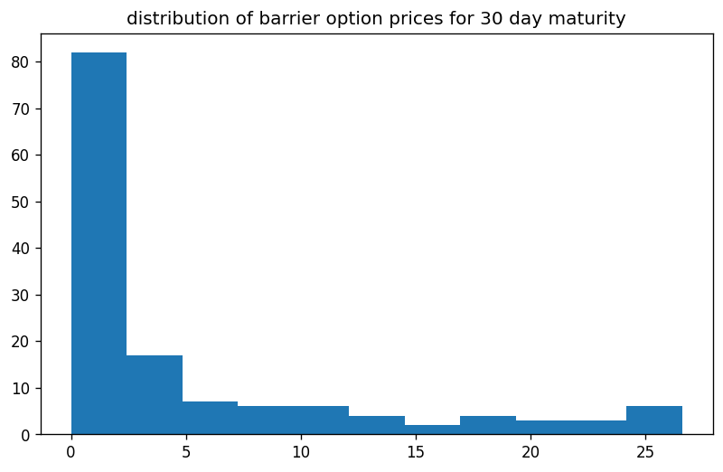
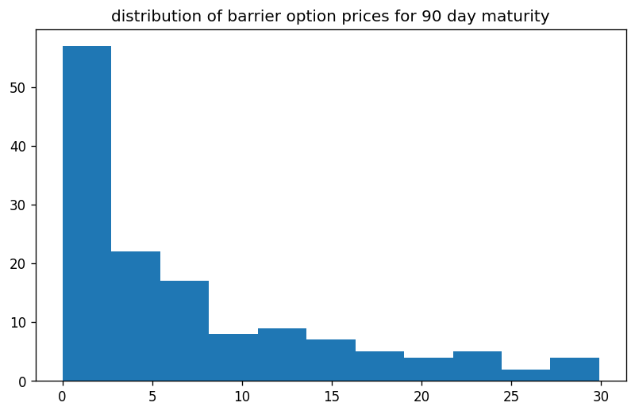
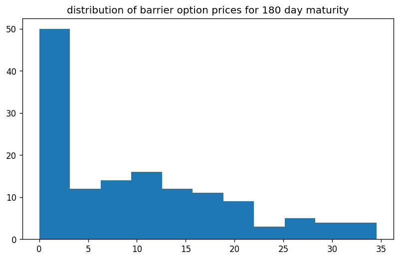
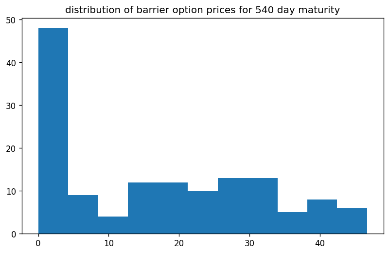

```python
import os
import sys
import requests
import pandas as pd
import numpy as np
import QuantLib as ql
from pathlib import Path
import matplotlib.pyplot as plt
from itertools import product
from datetime import datetime
from datetime import timedelta
from model_settings import ms
from historical_av_plot_vol_surface import plot_vol_surface

symbol='SPY'
url = str(
	'https://www.alphavantage.co/query?function=TIME_SERIES_DAILY&symbol='+
	symbol+'&outputsize=full&apikey='+
	ms.av_key)
r = requests.get(url)
spots = pd.Series(pd.DataFrame(r.json()['Time Series (Daily)']).transpose()['4. close'].squeeze())
spots = pd.to_numeric(spots,errors='coerce')
print(spots)
```

    
    pricing settings:
    Actual/365 (Fixed) day counter
    New York stock exchange calendar
    compounding: continuous
    frequency: annual
    
    2024-10-11    579.5800
    2024-10-10    576.1300
    2024-10-09    577.1400
    2024-10-08    573.1700
    2024-10-07    567.8000
                    ...   
    1999-11-05    137.8750
    1999-11-04    136.5312
    1999-11-03    135.5000
    1999-11-02    134.5937
    1999-11-01    135.5625
    Name: 4. close, Length: 6277, dtype: float64
    

# example data collection

let us collect a few recent trading days and inspect the data


```python
dates = spots.index
dates = dates[:10]
for date in dates:
    print(date)
```

    2024-10-11
    2024-10-10
    2024-10-09
    2024-10-08
    2024-10-07
    2024-10-04
    2024-10-03
    2024-10-02
    2024-10-01
    2024-09-30
    


```python
from historical_alphaVantage_collection import collect_av_link
chain = {}
for date in dates:
    spot = float(spots[date])
    link = collect_av_link(date,spot,symbol)
    printdate = datetime.strptime(date, '%Y-%m-%d').strftime('%A, %Y-%m-%d')
    chain[date] = link
```


```python
demo_spots = spots[dates]
demo_spots.index = pd.to_datetime(demo_spots.index, format='%Y-%m-%d')
plt.figure()
plt.plot(demo_spots,color='black')
plt.title(f'{symbol} option data collected')
plt.xticks(rotation=45)
plt.show()
plt.clf()
```


    

    


    <Figure size 640x480 with 0 Axes>


# example calibraion

now why not select the one trading day and porceed with an example calibration of our Heston (1993) model


```python
date = dates[3]
raw_data = chain[date]
calculation_datetime = datetime.strptime(date,'%Y-%m-%d')
calculation_date = ql.Date(
    calculation_datetime.day,
    calculation_datetime.month,
    calculation_datetime.year,
)
print(str(calculation_datetime.strftime('%A, '))+str(calculation_date))
```

    Tuesday, October 8th, 2024
    

## modelling the volatility surface


```python
df = raw_data.copy()
columns_to_convert = ['strike', 'last', 'mark',
       'bid', 'bid_size', 'ask', 'ask_size', 'volume', 'open_interest',
       'implied_volatility', 'delta', 'gamma', 'theta', 'vega', 'rho']
df[columns_to_convert] = df[
    columns_to_convert].apply(pd.to_numeric, errors='coerce')

df['expiration'] = pd.to_datetime(df['expiration'],format='%Y-%m-%d')
df['date'] = pd.to_datetime(df['date'],format='%Y-%m-%d')
df['days_to_maturity'] = df['expiration'] - df['date']
df['days_to_maturity'] = df['days_to_maturity'] / np.timedelta64(1, 'D')
df['days_to_maturity'] = df['days_to_maturity'].astype('int64')
df = df[(df['days_to_maturity']>=30)&(df['days_to_maturity']<=400)]

df = df[df['volume']>0].copy()
df['spot_price'] = spot

df['moneyness'] = ms.vmoneyness(df['spot_price'],df['strike'],df['type'])
df = df[(df['moneyness']<0)&(df['moneyness']>-0.5)]
indexed = df.copy().set_index(['strike','days_to_maturity'])

T = np.sort(df['days_to_maturity'].unique()).tolist()
K = np.sort(df['strike'].unique()).tolist()
volume_heatmap = pd.DataFrame(
    np.full((len(K), len(T)), np.nan), index=K, columns=T)
for k in K:
    for t in T:
        try:
            volume_heatmap.loc[k,t] = indexed.loc[(k,t),'volume']
        except Exception:
            pass
        
        
hottest_contracts = pd.DataFrame(
    volume_heatmap.unstack().sort_values(
        ascending=False)).head(50).reset_index()
hottest_contracts.columns = ['t','k','volume']
T = np.sort(hottest_contracts['t'].unique()).tolist()
K = np.sort(hottest_contracts['k'].unique()).tolist()

vol_matrix = pd.DataFrame(
    np.full((len(K),len(T)),np.nan),
    index = K,
    columns = T
)
for k in K:
    for t in T:
        try:
            vol_matrix.loc[k,t] = indexed.loc[(k,float(t)),'implied_volatility']
        except Exception:
            pass

vol_matrix = vol_matrix.dropna().copy()
T = vol_matrix.columns.tolist()
K = vol_matrix.index.tolist()

cols_to_map = [
        'contractID', 'symbol', 'expiration', 'type', 'last', 'mark',
        'bid', 'bid_size', 'ask', 'ask_size', 'volume', 'open_interest', 'date',
        'implied_volatility', 'delta', 'gamma', 'theta', 'vega', 'rho',
        'spot_price', 'moneyness'
]
for col in cols_to_map:
    for i,row in hottest_contracts.iterrows():
        hottest_contracts.at[i,col] = indexed.loc[(row['k'],row['t']),col]
        
hottest_contracts = hottest_contracts.rename(
    columns={'t':'days_to_maturity','k':'strike_price'}).copy()

link = {
        'raw_data': raw_data,
        'surface': vol_matrix,
        }
```


```python
vol_matrix = link['surface']
s = float(df['spot_price'].unique()[0])
print(f"\n{symbol} spot price: {s}")
print(f"\n{vol_matrix}\n")
plot_vol_surface(vol_matrix)
```

    
    SPY spot price: 573.76
    
               31       38       52       73       84       101      115      164  \
    500.0  0.31159  0.29803  0.27851  0.26617  0.25839  0.25336  0.24940  0.24071   
    510.0  0.29117  0.27928  0.26144  0.25199  0.24513  0.24086  0.23751  0.23095   
    520.0  0.27013  0.26098  0.24544  0.23827  0.23217  0.22882  0.22608  0.22120   
    525.0  0.26083  0.25199  0.23781  0.23156  0.22577  0.22288  0.22013  0.21632   
    530.0  0.25138  0.24330  0.23004  0.22486  0.21983  0.21693  0.21464  0.21160   
    540.0  0.23278  0.22608  0.21495  0.21160  0.20718  0.20519  0.20352  0.20199   
    550.0  0.21495  0.20931  0.20016  0.19818  0.19452  0.19330  0.19239  0.19254   
    555.0  0.20580  0.20077  0.19254  0.19147  0.18812  0.18751  0.18690  0.18797   
    560.0  0.19650  0.19224  0.18492  0.18461  0.18187  0.18187  0.18157  0.18355   
    565.0  0.18705  0.18340  0.17745  0.17791  0.17577  0.17608  0.17623  0.17928   
    570.0  0.17776  0.17471  0.16998  0.17166  0.16968  0.17090  0.17120  0.17516   
    575.0  0.17013  0.16663  0.16221  0.15962  0.15077  0.15199  0.15260  0.15474   
    580.0  0.16114  0.15779  0.15428  0.15276  0.14483  0.14651  0.14742  0.15001   
    585.0  0.15245  0.14940  0.14712  0.14651  0.13919  0.14132  0.14224  0.14529   
    590.0  0.14483  0.14209  0.14026  0.14071  0.13385  0.13645  0.13766  0.14117   
    600.0  0.13263  0.13035  0.12913  0.13035  0.12440  0.12760  0.12913  0.13385   
    605.0  0.12913  0.12669  0.12486  0.12608  0.12044  0.12364  0.12547  0.13050   
    
               346  
    500.0  0.23080  
    510.0  0.22486  
    520.0  0.21907  
    525.0  0.21617  
    530.0  0.21342  
    540.0  0.20748  
    550.0  0.20169  
    555.0  0.19894  
    560.0  0.19620  
    565.0  0.19346  
    570.0  0.19086  
    575.0  0.15245  
    580.0  0.14971  
    585.0  0.14681  
    590.0  0.14391  
    600.0  0.13827  
    605.0  0.13538  
    
    


    

    


    <Figure size 640x480 with 0 Axes>


## calibrating a Heston (1993) model


```python
vol_matrix = vol_matrix.sort_index().drop_duplicates()
pd.to_numeric(raw_data['last'])
raw_data['date'] = pd.to_datetime(raw_data['date'])
raw_data['expiration'] = pd.to_datetime(raw_data['expiration'])
raw_data['implied_volatility'] = pd.to_numeric(raw_data['implied_volatility']).astype(float)
raw_data['strike'] = pd.to_numeric(raw_data['strike'])
raw_data['last'] = pd.to_numeric(raw_data['last'])
contract_maturities = np.array((raw_data['expiration'] - raw_data['date']) / timedelta(days=1)).astype(int)
raw_data['days_to_maturity'] = contract_maturities

T = vol_matrix.columns.tolist()
K = vol_matrix.index.tolist()
r = 0.04
g = 0.0

ql.Settings.instance().evaluationDate = calculation_date
flat_ts, dividend_ts = ms.ql_ts_rg(r, g, calculation_date)
S_handle = ql.QuoteHandle(ql.SimpleQuote(s))

heston_helpers = []
v0 = 0.01; kappa = 0.2; theta = 0.02; rho = -0.75; eta = 0.5;
process = ql.HestonProcess(
    flat_ts,
    dividend_ts,
    S_handle,
    v0,                # Initial volatility
    kappa,             # Mean reversion speed
    theta,             # Long-run variance (volatility squared)
    eta,               # Volatility of the volatility
    rho                # Correlation between asset and volatility
)
model = ql.HestonModel(process)
engine = ql.AnalyticHestonEngine(model)

for t in T:
    for k in K:
        p = ql.Period(int(t),ql.Days)
        volatility = vol_matrix.loc[k,t]
        helper = ql.HestonModelHelper(
            p, ms.calendar, float(s), k, 
            ql.QuoteHandle(ql.SimpleQuote(volatility)), 
            flat_ts, 
            dividend_ts
            )
        helper.setPricingEngine(engine)
        heston_helpers.append(helper)

lm = ql.LevenbergMarquardt(1e-8, 1e-8, 1e-8)


model.calibrate(heston_helpers, lm,
                  ql.EndCriteria(1000, 50, 1.0e-8,1.0e-8, 1.0e-8))

theta, kappa, eta, rho, v0 = model.params()
heston_parameters = pd.Series(
    [theta, kappa, eta, rho, v0],
    index = ['theta', 'kappa', 'eta', 'rho', 'v0'],
    dtype = float
)
calibration_test_data = raw_data.copy()[['strike','type','last','implied_volatility','days_to_maturity']]
calibration_test_data.columns = ['strike_price','w','market_price','volatility','days_to_maturity']
calibration_test_data['spot_price'] = s
calibration_test_data['risk_free_rate'] = r
calibration_test_data['dividend_rate'] = g
calibration_test_data = calibration_test_data[calibration_test_data['days_to_maturity'].isin(df['days_to_maturity'])]
calibration_test_data[heston_parameters.index.tolist()] = np.tile(heston_parameters,(calibration_test_data.shape[0],1))
calibration_test_data.loc[:,'moneyness'] = ms.vmoneyness(
    calibration_test_data['spot_price'].values,
    calibration_test_data['strike_price'].values,
    calibration_test_data['w'].values)
calibration_test_data['calculation_date'] = calculation_datetime
calibration_test_data['black_scholes'] = ms.vector_black_scholes(calibration_test_data)
calibration_test_data['heston_price'] = ms.vector_heston_price(calibration_test_data)
```

## testing calibration accuracy


```python
calibration_test_data.loc[:,'error'] = calibration_test_data['heston_price'].values - calibration_test_data['black_scholes'].values
avg = np.mean(np.abs(calibration_test_data['error']))
print(f"\n{printdate}\n{heston_parameters}\naverage absolute error: {round(avg,3)}")
print(f"calibration testing dataset:\n{calibration_test_data.describe()}")
```

    
    Monday, 2024-09-30
    theta    0.128750
    kappa    0.507891
    eta      1.326914
    rho     -0.723443
    v0       0.038301
    dtype: float64
    average absolute error: 2.627
    calibration testing dataset:
           strike_price  market_price   volatility  days_to_maturity  \
    count   4946.000000   4946.000000  4946.000000       4946.000000   
    mean     516.437525     41.852331     0.249732        163.988273   
    min      120.000000      0.000000     0.012760         31.000000   
    25%      454.000000      0.000000     0.164875         73.000000   
    50%      528.000000      6.140000     0.211365        143.000000   
    75%      585.000000     55.582500     0.292690        265.000000   
    max      830.000000    451.670000     1.349070        357.000000   
    std      125.840010     71.700001     0.145537        108.548043   
    
             spot_price  risk_free_rate  dividend_rate       theta         kappa  \
    count  4.946000e+03         4946.00         4946.0  4946.00000  4.946000e+03   
    mean   5.737600e+02            0.04            0.0     0.12875  5.078911e-01   
    min    5.737600e+02            0.04            0.0     0.12875  5.078911e-01   
    25%    5.737600e+02            0.04            0.0     0.12875  5.078911e-01   
    50%    5.737600e+02            0.04            0.0     0.12875  5.078911e-01   
    75%    5.737600e+02            0.04            0.0     0.12875  5.078911e-01   
    max    5.737600e+02            0.04            0.0     0.12875  5.078911e-01   
    std    1.136983e-13            0.00            0.0     0.00000  1.110335e-16   
    
                   eta           rho            v0     moneyness  \
    count  4946.000000  4.946000e+03  4.946000e+03  4.946000e+03   
    mean      1.326914 -7.234427e-01  3.830103e-02  5.369833e-02   
    min       1.326914 -7.234427e-01  3.830103e-02 -7.908533e-01   
    25%       1.326914 -7.234427e-01  3.830103e-02 -1.268126e-01   
    50%       1.326914 -7.234427e-01  3.830103e-02  8.744809e-08   
    75%       1.326914 -7.234427e-01  3.830103e-02  1.452295e-01   
    max       1.326914 -7.234427e-01  3.830103e-02  3.781333e+00   
    std       0.000000  1.110335e-16  6.939595e-18  3.818625e-01   
    
              calculation_date  black_scholes  heston_price        error  
    count                 4946    4946.000000   4946.000000  4946.000000  
    mean   2024-10-08 00:00:00      60.648755     60.038268    -0.610487  
    min    2024-10-08 00:00:00       0.008903      0.000025   -35.586976  
    25%    2024-10-08 00:00:00       4.506117      5.453626    -0.308451  
    50%    2024-10-08 00:00:00      21.828682     20.624575     0.412971  
    75%    2024-10-08 00:00:00      87.105267     86.215634     1.262495  
    max    2024-10-08 00:00:00     454.933599    454.716195     8.068505  
    std                    NaN      82.619762     81.845506     5.543815  
    

# train data generation
now that we have calibrated our pricing engine, let us proceed with generating 
all real barrier option contract combinations for this trading day

```python
K = np.linspace(s*0.8,s*1.2,7).astype(int).tolist()
down_barriers =  np.linspace(s*0.5,s*0.99,5).astype(int).tolist()
T = [
    30,60,90,
    180,360,540,720
]
print(f"\n{symbol} spot price:\n     {spot}\nstrikes:\n     {K}\n\nbarriers:\n     {down_barriers}\n\nmaturities:\n     {T}\n")
```

    
    SPY spot price:
         573.76
    strikes:
         [459, 497, 535, 573, 612, 650, 688]
    
    barriers:
         [286, 357, 427, 497, 568]
    
    maturities:
         [30, 60, 90, 180, 360, 540, 720]
    
    


```python
features = pd.DataFrame(
    product(
        [spot],
        K,
        T,
        down_barriers,
        [0.0], # rebate
        ['put','call'],
        [0.04], # risk-free rate
        [0.0], # dividend rate
        [theta], 
        [kappa], 
        [eta], 
        [rho], 
        [v0],
        [calculation_datetime],
        ['Out','In']
    ),
    columns = [
        'spot_price',
        'strike_price',
        'days_to_maturity',
        'barrier',
        'rebate',
        'w',
        'risk_free_rate',
        'dividend_rate',
        'theta', 'kappa', 'eta', 'rho', 'v0',
        'calculation_date',
        'outin',
    ]
)
features['moneyness'] = ms.vmoneyness(features['spot_price'],features['strike_price'],features['w'])
features['barrier_type_name'] = 'Down' + features['outin']
features['vanilla_price'] = ms.vector_heston_price(features)
features['barrier_price'] = ms.vector_barrier_price(features)
featuresby_t = features.copy().set_index('days_to_maturity')
```


```python
for t in T:
    plt.figure(figsize=plt.figaspect(0.6),dpi=120)
    prices= featuresby_t.loc[t,'barrier_price']
    plt.hist(prices,bins=int(np.sqrt(prices.shape[0])))
    plt.title(f'distribution of barrier option prices for {t} day maturity')
    plt.show()
    plt.clf()
```


    

    


    <Figure size 640x480 with 0 Axes>


    

    


    <Figure size 640x480 with 0 Axes>


    

    


    <Figure size 640x480 with 0 Axes>


    

    


    <Figure size 640x480 with 0 Axes>


    

    


    <Figure size 640x480 with 0 Axes>


    

    


    <Figure size 640x480 with 0 Axes>


    

    


    <Figure size 640x480 with 0 Axes>


# model training
now that we have a dataset, we can, for example, try to test whether the model is able to 
predict the prices of our two year barrier options while only having seen the others in training

```python
from convsklearn import barrier_trainer
```


```python
bt = barrier_trainer
```


```python
help(bt)
```

    Help on convsklearn in module convsklearn.convsklearn object:
    
    class convsklearn(builtins.object)
     |  convsklearn(target_name, numerical_features, categorical_features, transformers, target_transformer_pipeline, n_layers=None, random_state=None, test_size=0.01, max_iter=1000, solver='sgd', alpha=0.0001, learning_rate='adaptive', activation_function='relu', rf_n_estimators=50, rf_min_samples_leaf=2000)
     |
     |  Methods defined here:
     |
     |  __init__(self, target_name, numerical_features, categorical_features, transformers, target_transformer_pipeline, n_layers=None, random_state=None, test_size=0.01, max_iter=1000, solver='sgd', alpha=0.0001, learning_rate='adaptive', activation_function='relu', rf_n_estimators=50, rf_min_samples_leaf=2000)
     |      Initialize self.  See help(type(self)) for accurate signature.
     |
     |  get_train_test_arrays(self, train_data, test_data, feature_set=None, target_name=None)
     |
     |  plot_model_performance(self, df, X_name, Y_name, xlabel, ylabel, runtime, title)
     |
     |  preprocess(self)
     |
     |  run_dnn(self, preprocessor, train_X, train_y)
     |
     |  run_lm(self, train_X, train_y)
     |
     |  run_nnet(self, preprocessor, train_X, train_y)
     |
     |  run_rf(self, preprocessor, train_X, train_y)
     |
     |  test_model(self, test_data, test_X, test_y, model_fit)
     |
     |  test_prediction_accuracy(self, model_fit, test_data, train_data)
     |
     |  ----------------------------------------------------------------------
     |  Data descriptors defined here:
     |
     |  __dict__
     |      dictionary for instance variables
     |
     |  __weakref__
     |      list of weak references to the object
    
    


```python
features['observed_price'] = ms.noisyfier(features.loc[:,'barrier_price'])
train_data = features[features['days_to_maturity']!=720]
test_data = features[features['days_to_maturity']==720]
```


```python
arrs = bt.get_train_test_arrays(train_data,test_data)
```


```python
arrs
train_X = arrs['train_X']
train_y = arrs['train_y']
test_X = arrs['test_X']
test_y = arrs['train_y']
preprocessor = bt.preprocess()
```


```python
dnnBarriers, runtime, specs = bt.run_dnn(preprocessor, train_X, train_y)
```

    
    training...
    
    Deep Neural Network
    hidden layers sizes: (13, 13, 13)
    learning rate: adaptive
    activation: relu
    solver: sgd
    alpha: 0.0001
    

    E:\Python\Lib\site-packages\sklearn\neural_network\_multilayer_perceptron.py:690: ConvergenceWarning: Stochastic Optimizer: Maximum iterations (1000) reached and the optimization hasn't converged yet.
    


```python
dnnBarriers
```


<style>#sk-container-id-2 {
  /* Definition of color scheme common for light and dark mode */
  --sklearn-color-text: black;
  --sklearn-color-line: gray;
  /* Definition of color scheme for unfitted estimators */
  --sklearn-color-unfitted-level-0: #fff5e6;
  --sklearn-color-unfitted-level-1: #f6e4d2;
  --sklearn-color-unfitted-level-2: #ffe0b3;
  --sklearn-color-unfitted-level-3: chocolate;
  /* Definition of color scheme for fitted estimators */
  --sklearn-color-fitted-level-0: #f0f8ff;
  --sklearn-color-fitted-level-1: #d4ebff;
  --sklearn-color-fitted-level-2: #b3dbfd;
  --sklearn-color-fitted-level-3: cornflowerblue;

  /* Specific color for light theme */
  --sklearn-color-text-on-default-background: var(--sg-text-color, var(--theme-code-foreground, var(--jp-content-font-color1, black)));
  --sklearn-color-background: var(--sg-background-color, var(--theme-background, var(--jp-layout-color0, white)));
  --sklearn-color-border-box: var(--sg-text-color, var(--theme-code-foreground, var(--jp-content-font-color1, black)));
  --sklearn-color-icon: #696969;

  @media (prefers-color-scheme: dark) {
    /* Redefinition of color scheme for dark theme */
    --sklearn-color-text-on-default-background: var(--sg-text-color, var(--theme-code-foreground, var(--jp-content-font-color1, white)));
    --sklearn-color-background: var(--sg-background-color, var(--theme-background, var(--jp-layout-color0, #111)));
    --sklearn-color-border-box: var(--sg-text-color, var(--theme-code-foreground, var(--jp-content-font-color1, white)));
    --sklearn-color-icon: #878787;
  }
}

#sk-container-id-2 {
  color: var(--sklearn-color-text);
}

#sk-container-id-2 pre {
  padding: 0;
}

#sk-container-id-2 input.sk-hidden--visually {
  border: 0;
  clip: rect(1px 1px 1px 1px);
  clip: rect(1px, 1px, 1px, 1px);
  height: 1px;
  margin: -1px;
  overflow: hidden;
  padding: 0;
  position: absolute;
  width: 1px;
}

#sk-container-id-2 div.sk-dashed-wrapped {
  border: 1px dashed var(--sklearn-color-line);
  margin: 0 0.4em 0.5em 0.4em;
  box-sizing: border-box;
  padding-bottom: 0.4em;
  background-color: var(--sklearn-color-background);
}

#sk-container-id-2 div.sk-container {
  /* jupyter's `normalize.less` sets `[hidden] { display: none; }`
     but bootstrap.min.css set `[hidden] { display: none !important; }`
     so we also need the `!important` here to be able to override the
     default hidden behavior on the sphinx rendered scikit-learn.org.
     See: https://github.com/scikit-learn/scikit-learn/issues/21755 */
  display: inline-block !important;
  position: relative;
}

#sk-container-id-2 div.sk-text-repr-fallback {
  display: none;
}

div.sk-parallel-item,
div.sk-serial,
div.sk-item {
  /* draw centered vertical line to link estimators */
  background-image: linear-gradient(var(--sklearn-color-text-on-default-background), var(--sklearn-color-text-on-default-background));
  background-size: 2px 100%;
  background-repeat: no-repeat;
  background-position: center center;
}

/* Parallel-specific style estimator block */

#sk-container-id-2 div.sk-parallel-item::after {
  content: "";
  width: 100%;
  border-bottom: 2px solid var(--sklearn-color-text-on-default-background);
  flex-grow: 1;
}

#sk-container-id-2 div.sk-parallel {
  display: flex;
  align-items: stretch;
  justify-content: center;
  background-color: var(--sklearn-color-background);
  position: relative;
}

#sk-container-id-2 div.sk-parallel-item {
  display: flex;
  flex-direction: column;
}

#sk-container-id-2 div.sk-parallel-item:first-child::after {
  align-self: flex-end;
  width: 50%;
}

#sk-container-id-2 div.sk-parallel-item:last-child::after {
  align-self: flex-start;
  width: 50%;
}

#sk-container-id-2 div.sk-parallel-item:only-child::after {
  width: 0;
}

/* Serial-specific style estimator block */

#sk-container-id-2 div.sk-serial {
  display: flex;
  flex-direction: column;
  align-items: center;
  background-color: var(--sklearn-color-background);
  padding-right: 1em;
  padding-left: 1em;
}


/* Toggleable style: style used for estimator/Pipeline/ColumnTransformer box that is
clickable and can be expanded/collapsed.
- Pipeline and ColumnTransformer use this feature and define the default style
- Estimators will overwrite some part of the style using the `sk-estimator` class
*/

/* Pipeline and ColumnTransformer style (default) */

#sk-container-id-2 div.sk-toggleable {
  /* Default theme specific background. It is overwritten whether we have a
  specific estimator or a Pipeline/ColumnTransformer */
  background-color: var(--sklearn-color-background);
}

/* Toggleable label */
#sk-container-id-2 label.sk-toggleable__label {
  cursor: pointer;
  display: block;
  width: 100%;
  margin-bottom: 0;
  padding: 0.5em;
  box-sizing: border-box;
  text-align: center;
}

#sk-container-id-2 label.sk-toggleable__label-arrow:before {
  /* Arrow on the left of the label */
  content: "▸";
  float: left;
  margin-right: 0.25em;
  color: var(--sklearn-color-icon);
}

#sk-container-id-2 label.sk-toggleable__label-arrow:hover:before {
  color: var(--sklearn-color-text);
}

/* Toggleable content - dropdown */

#sk-container-id-2 div.sk-toggleable__content {
  max-height: 0;
  max-width: 0;
  overflow: hidden;
  text-align: left;
  /* unfitted */
  background-color: var(--sklearn-color-unfitted-level-0);
}

#sk-container-id-2 div.sk-toggleable__content.fitted {
  /* fitted */
  background-color: var(--sklearn-color-fitted-level-0);
}

#sk-container-id-2 div.sk-toggleable__content pre {
  margin: 0.2em;
  border-radius: 0.25em;
  color: var(--sklearn-color-text);
  /* unfitted */
  background-color: var(--sklearn-color-unfitted-level-0);
}

#sk-container-id-2 div.sk-toggleable__content.fitted pre {
  /* unfitted */
  background-color: var(--sklearn-color-fitted-level-0);
}

#sk-container-id-2 input.sk-toggleable__control:checked~div.sk-toggleable__content {
  /* Expand drop-down */
  max-height: 200px;
  max-width: 100%;
  overflow: auto;
}

#sk-container-id-2 input.sk-toggleable__control:checked~label.sk-toggleable__label-arrow:before {
  content: "▾";
}

/* Pipeline/ColumnTransformer-specific style */

#sk-container-id-2 div.sk-label input.sk-toggleable__control:checked~label.sk-toggleable__label {
  color: var(--sklearn-color-text);
  background-color: var(--sklearn-color-unfitted-level-2);
}

#sk-container-id-2 div.sk-label.fitted input.sk-toggleable__control:checked~label.sk-toggleable__label {
  background-color: var(--sklearn-color-fitted-level-2);
}

/* Estimator-specific style */

/* Colorize estimator box */
#sk-container-id-2 div.sk-estimator input.sk-toggleable__control:checked~label.sk-toggleable__label {
  /* unfitted */
  background-color: var(--sklearn-color-unfitted-level-2);
}

#sk-container-id-2 div.sk-estimator.fitted input.sk-toggleable__control:checked~label.sk-toggleable__label {
  /* fitted */
  background-color: var(--sklearn-color-fitted-level-2);
}

#sk-container-id-2 div.sk-label label.sk-toggleable__label,
#sk-container-id-2 div.sk-label label {
  /* The background is the default theme color */
  color: var(--sklearn-color-text-on-default-background);
}

/* On hover, darken the color of the background */
#sk-container-id-2 div.sk-label:hover label.sk-toggleable__label {
  color: var(--sklearn-color-text);
  background-color: var(--sklearn-color-unfitted-level-2);
}

/* Label box, darken color on hover, fitted */
#sk-container-id-2 div.sk-label.fitted:hover label.sk-toggleable__label.fitted {
  color: var(--sklearn-color-text);
  background-color: var(--sklearn-color-fitted-level-2);
}

/* Estimator label */

#sk-container-id-2 div.sk-label label {
  font-family: monospace;
  font-weight: bold;
  display: inline-block;
  line-height: 1.2em;
}

#sk-container-id-2 div.sk-label-container {
  text-align: center;
}

/* Estimator-specific */
#sk-container-id-2 div.sk-estimator {
  font-family: monospace;
  border: 1px dotted var(--sklearn-color-border-box);
  border-radius: 0.25em;
  box-sizing: border-box;
  margin-bottom: 0.5em;
  /* unfitted */
  background-color: var(--sklearn-color-unfitted-level-0);
}

#sk-container-id-2 div.sk-estimator.fitted {
  /* fitted */
  background-color: var(--sklearn-color-fitted-level-0);
}

/* on hover */
#sk-container-id-2 div.sk-estimator:hover {
  /* unfitted */
  background-color: var(--sklearn-color-unfitted-level-2);
}

#sk-container-id-2 div.sk-estimator.fitted:hover {
  /* fitted */
  background-color: var(--sklearn-color-fitted-level-2);
}

/* Specification for estimator info (e.g. "i" and "?") */

/* Common style for "i" and "?" */

.sk-estimator-doc-link,
a:link.sk-estimator-doc-link,
a:visited.sk-estimator-doc-link {
  float: right;
  font-size: smaller;
  line-height: 1em;
  font-family: monospace;
  background-color: var(--sklearn-color-background);
  border-radius: 1em;
  height: 1em;
  width: 1em;
  text-decoration: none !important;
  margin-left: 1ex;
  /* unfitted */
  border: var(--sklearn-color-unfitted-level-1) 1pt solid;
  color: var(--sklearn-color-unfitted-level-1);
}

.sk-estimator-doc-link.fitted,
a:link.sk-estimator-doc-link.fitted,
a:visited.sk-estimator-doc-link.fitted {
  /* fitted */
  border: var(--sklearn-color-fitted-level-1) 1pt solid;
  color: var(--sklearn-color-fitted-level-1);
}

/* On hover */
div.sk-estimator:hover .sk-estimator-doc-link:hover,
.sk-estimator-doc-link:hover,
div.sk-label-container:hover .sk-estimator-doc-link:hover,
.sk-estimator-doc-link:hover {
  /* unfitted */
  background-color: var(--sklearn-color-unfitted-level-3);
  color: var(--sklearn-color-background);
  text-decoration: none;
}

div.sk-estimator.fitted:hover .sk-estimator-doc-link.fitted:hover,
.sk-estimator-doc-link.fitted:hover,
div.sk-label-container:hover .sk-estimator-doc-link.fitted:hover,
.sk-estimator-doc-link.fitted:hover {
  /* fitted */
  background-color: var(--sklearn-color-fitted-level-3);
  color: var(--sklearn-color-background);
  text-decoration: none;
}

/* Span, style for the box shown on hovering the info icon */
.sk-estimator-doc-link span {
  display: none;
  z-index: 9999;
  position: relative;
  font-weight: normal;
  right: .2ex;
  padding: .5ex;
  margin: .5ex;
  width: min-content;
  min-width: 20ex;
  max-width: 50ex;
  color: var(--sklearn-color-text);
  box-shadow: 2pt 2pt 4pt #999;
  /* unfitted */
  background: var(--sklearn-color-unfitted-level-0);
  border: .5pt solid var(--sklearn-color-unfitted-level-3);
}

.sk-estimator-doc-link.fitted span {
  /* fitted */
  background: var(--sklearn-color-fitted-level-0);
  border: var(--sklearn-color-fitted-level-3);
}

.sk-estimator-doc-link:hover span {
  display: block;
}

/* "?"-specific style due to the `<a>` HTML tag */

#sk-container-id-2 a.estimator_doc_link {
  float: right;
  font-size: 1rem;
  line-height: 1em;
  font-family: monospace;
  background-color: var(--sklearn-color-background);
  border-radius: 1rem;
  height: 1rem;
  width: 1rem;
  text-decoration: none;
  /* unfitted */
  color: var(--sklearn-color-unfitted-level-1);
  border: var(--sklearn-color-unfitted-level-1) 1pt solid;
}

#sk-container-id-2 a.estimator_doc_link.fitted {
  /* fitted */
  border: var(--sklearn-color-fitted-level-1) 1pt solid;
  color: var(--sklearn-color-fitted-level-1);
}

/* On hover */
#sk-container-id-2 a.estimator_doc_link:hover {
  /* unfitted */
  background-color: var(--sklearn-color-unfitted-level-3);
  color: var(--sklearn-color-background);
  text-decoration: none;
}

#sk-container-id-2 a.estimator_doc_link.fitted:hover {
  /* fitted */
  background-color: var(--sklearn-color-fitted-level-3);
}
</style><div id="sk-container-id-2" class="sk-top-container"><div class="sk-text-repr-fallback"><pre>TransformedTargetRegressor(regressor=Pipeline(steps=[(&#x27;preprocessor&#x27;,
                                                      ColumnTransformer(transformers=[(&#x27;StandardScaler&#x27;,
                                                                                       StandardScaler(),
                                                                                       [&#x27;spot_price&#x27;,
                                                                                        &#x27;strike_price&#x27;,
                                                                                        &#x27;days_to_maturity&#x27;,
                                                                                        &#x27;risk_free_rate&#x27;,
                                                                                        &#x27;dividend_rate&#x27;,
                                                                                        &#x27;kappa&#x27;,
                                                                                        &#x27;theta&#x27;,
                                                                                        &#x27;rho&#x27;,
                                                                                        &#x27;eta&#x27;,
                                                                                        &#x27;v0&#x27;,
                                                                                        &#x27;barrier&#x27;]),
                                                                                      (&#x27;OneHotEncoder&#x27;,
                                                                                       OneHotEncoder(sparse_output=False),
                                                                                       [&#x27;barrier_type_name&#x27;,
                                                                                        &#x27;w&#x27;])])),
                                                     (&#x27;regressor&#x27;,
                                                      MLPRegressor(hidden_layer_sizes=(13,
                                                                                       13,
                                                                                       13),
                                                                   learning_rate=&#x27;adaptive&#x27;,
                                                                   max_iter=1000,
                                                                   solver=&#x27;sgd&#x27;))]),
                           transformer=Pipeline(steps=[(&#x27;StandardScaler&#x27;,
                                                        StandardScaler())]))</pre><b>In a Jupyter environment, please rerun this cell to show the HTML representation or trust the notebook. <br />On GitHub, the HTML representation is unable to render, please try loading this page with nbviewer.org.</b></div><div class="sk-container" hidden><div class="sk-item sk-dashed-wrapped"><div class="sk-label-container"><div class="sk-label fitted sk-toggleable"><input class="sk-toggleable__control sk-hidden--visually" id="sk-estimator-id-11" type="checkbox" ><label for="sk-estimator-id-11" class="sk-toggleable__label fitted sk-toggleable__label-arrow fitted">&nbsp;&nbsp;TransformedTargetRegressor<a class="sk-estimator-doc-link fitted" rel="noreferrer" target="_blank" href="https://scikit-learn.org/1.5/modules/generated/sklearn.compose.TransformedTargetRegressor.html">?<span>Documentation for TransformedTargetRegressor</span></a><span class="sk-estimator-doc-link fitted">i<span>Fitted</span></span></label><div class="sk-toggleable__content fitted"><pre>TransformedTargetRegressor(regressor=Pipeline(steps=[(&#x27;preprocessor&#x27;,
                                                      ColumnTransformer(transformers=[(&#x27;StandardScaler&#x27;,
                                                                                       StandardScaler(),
                                                                                       [&#x27;spot_price&#x27;,
                                                                                        &#x27;strike_price&#x27;,
                                                                                        &#x27;days_to_maturity&#x27;,
                                                                                        &#x27;risk_free_rate&#x27;,
                                                                                        &#x27;dividend_rate&#x27;,
                                                                                        &#x27;kappa&#x27;,
                                                                                        &#x27;theta&#x27;,
                                                                                        &#x27;rho&#x27;,
                                                                                        &#x27;eta&#x27;,
                                                                                        &#x27;v0&#x27;,
                                                                                        &#x27;barrier&#x27;]),
                                                                                      (&#x27;OneHotEncoder&#x27;,
                                                                                       OneHotEncoder(sparse_output=False),
                                                                                       [&#x27;barrier_type_name&#x27;,
                                                                                        &#x27;w&#x27;])])),
                                                     (&#x27;regressor&#x27;,
                                                      MLPRegressor(hidden_layer_sizes=(13,
                                                                                       13,
                                                                                       13),
                                                                   learning_rate=&#x27;adaptive&#x27;,
                                                                   max_iter=1000,
                                                                   solver=&#x27;sgd&#x27;))]),
                           transformer=Pipeline(steps=[(&#x27;StandardScaler&#x27;,
                                                        StandardScaler())]))</pre></div> </div></div><div class="sk-parallel"><div class="sk-parallel-item"><div class="sk-item"><div class="sk-label-container"><div class="sk-label fitted sk-toggleable"><input class="sk-toggleable__control sk-hidden--visually" id="sk-estimator-id-12" type="checkbox" ><label for="sk-estimator-id-12" class="sk-toggleable__label fitted sk-toggleable__label-arrow fitted">regressor: Pipeline</label><div class="sk-toggleable__content fitted"><pre>Pipeline(steps=[(&#x27;preprocessor&#x27;,
                 ColumnTransformer(transformers=[(&#x27;StandardScaler&#x27;,
                                                  StandardScaler(),
                                                  [&#x27;spot_price&#x27;, &#x27;strike_price&#x27;,
                                                   &#x27;days_to_maturity&#x27;,
                                                   &#x27;risk_free_rate&#x27;,
                                                   &#x27;dividend_rate&#x27;, &#x27;kappa&#x27;,
                                                   &#x27;theta&#x27;, &#x27;rho&#x27;, &#x27;eta&#x27;, &#x27;v0&#x27;,
                                                   &#x27;barrier&#x27;]),
                                                 (&#x27;OneHotEncoder&#x27;,
                                                  OneHotEncoder(sparse_output=False),
                                                  [&#x27;barrier_type_name&#x27;,
                                                   &#x27;w&#x27;])])),
                (&#x27;regressor&#x27;,
                 MLPRegressor(hidden_layer_sizes=(13, 13, 13),
                              learning_rate=&#x27;adaptive&#x27;, max_iter=1000,
                              solver=&#x27;sgd&#x27;))])</pre></div> </div></div><div class="sk-serial"><div class="sk-item"><div class="sk-serial"><div class="sk-item sk-dashed-wrapped"><div class="sk-label-container"><div class="sk-label fitted sk-toggleable"><input class="sk-toggleable__control sk-hidden--visually" id="sk-estimator-id-13" type="checkbox" ><label for="sk-estimator-id-13" class="sk-toggleable__label fitted sk-toggleable__label-arrow fitted">&nbsp;preprocessor: ColumnTransformer<a class="sk-estimator-doc-link fitted" rel="noreferrer" target="_blank" href="https://scikit-learn.org/1.5/modules/generated/sklearn.compose.ColumnTransformer.html">?<span>Documentation for preprocessor: ColumnTransformer</span></a></label><div class="sk-toggleable__content fitted"><pre>ColumnTransformer(transformers=[(&#x27;StandardScaler&#x27;, StandardScaler(),
                                 [&#x27;spot_price&#x27;, &#x27;strike_price&#x27;,
                                  &#x27;days_to_maturity&#x27;, &#x27;risk_free_rate&#x27;,
                                  &#x27;dividend_rate&#x27;, &#x27;kappa&#x27;, &#x27;theta&#x27;, &#x27;rho&#x27;,
                                  &#x27;eta&#x27;, &#x27;v0&#x27;, &#x27;barrier&#x27;]),
                                (&#x27;OneHotEncoder&#x27;,
                                 OneHotEncoder(sparse_output=False),
                                 [&#x27;barrier_type_name&#x27;, &#x27;w&#x27;])])</pre></div> </div></div><div class="sk-parallel"><div class="sk-parallel-item"><div class="sk-item"><div class="sk-label-container"><div class="sk-label fitted sk-toggleable"><input class="sk-toggleable__control sk-hidden--visually" id="sk-estimator-id-14" type="checkbox" ><label for="sk-estimator-id-14" class="sk-toggleable__label fitted sk-toggleable__label-arrow fitted">StandardScaler</label><div class="sk-toggleable__content fitted"><pre>[&#x27;spot_price&#x27;, &#x27;strike_price&#x27;, &#x27;days_to_maturity&#x27;, &#x27;risk_free_rate&#x27;, &#x27;dividend_rate&#x27;, &#x27;kappa&#x27;, &#x27;theta&#x27;, &#x27;rho&#x27;, &#x27;eta&#x27;, &#x27;v0&#x27;, &#x27;barrier&#x27;]</pre></div> </div></div><div class="sk-serial"><div class="sk-item"><div class="sk-estimator fitted sk-toggleable"><input class="sk-toggleable__control sk-hidden--visually" id="sk-estimator-id-15" type="checkbox" ><label for="sk-estimator-id-15" class="sk-toggleable__label fitted sk-toggleable__label-arrow fitted">&nbsp;StandardScaler<a class="sk-estimator-doc-link fitted" rel="noreferrer" target="_blank" href="https://scikit-learn.org/1.5/modules/generated/sklearn.preprocessing.StandardScaler.html">?<span>Documentation for StandardScaler</span></a></label><div class="sk-toggleable__content fitted"><pre>StandardScaler()</pre></div> </div></div></div></div></div><div class="sk-parallel-item"><div class="sk-item"><div class="sk-label-container"><div class="sk-label fitted sk-toggleable"><input class="sk-toggleable__control sk-hidden--visually" id="sk-estimator-id-16" type="checkbox" ><label for="sk-estimator-id-16" class="sk-toggleable__label fitted sk-toggleable__label-arrow fitted">OneHotEncoder</label><div class="sk-toggleable__content fitted"><pre>[&#x27;barrier_type_name&#x27;, &#x27;w&#x27;]</pre></div> </div></div><div class="sk-serial"><div class="sk-item"><div class="sk-estimator fitted sk-toggleable"><input class="sk-toggleable__control sk-hidden--visually" id="sk-estimator-id-17" type="checkbox" ><label for="sk-estimator-id-17" class="sk-toggleable__label fitted sk-toggleable__label-arrow fitted">&nbsp;OneHotEncoder<a class="sk-estimator-doc-link fitted" rel="noreferrer" target="_blank" href="https://scikit-learn.org/1.5/modules/generated/sklearn.preprocessing.OneHotEncoder.html">?<span>Documentation for OneHotEncoder</span></a></label><div class="sk-toggleable__content fitted"><pre>OneHotEncoder(sparse_output=False)</pre></div> </div></div></div></div></div></div></div><div class="sk-item"><div class="sk-estimator fitted sk-toggleable"><input class="sk-toggleable__control sk-hidden--visually" id="sk-estimator-id-18" type="checkbox" ><label for="sk-estimator-id-18" class="sk-toggleable__label fitted sk-toggleable__label-arrow fitted">&nbsp;MLPRegressor<a class="sk-estimator-doc-link fitted" rel="noreferrer" target="_blank" href="https://scikit-learn.org/1.5/modules/generated/sklearn.neural_network.MLPRegressor.html">?<span>Documentation for MLPRegressor</span></a></label><div class="sk-toggleable__content fitted"><pre>MLPRegressor(hidden_layer_sizes=(13, 13, 13), learning_rate=&#x27;adaptive&#x27;,
             max_iter=1000, solver=&#x27;sgd&#x27;)</pre></div> </div></div></div></div></div></div></div><div class="sk-parallel-item"><div class="sk-item"><div class="sk-label-container"><div class="sk-label fitted sk-toggleable"><input class="sk-toggleable__control sk-hidden--visually" id="sk-estimator-id-19" type="checkbox" ><label for="sk-estimator-id-19" class="sk-toggleable__label fitted sk-toggleable__label-arrow fitted">transformer: Pipeline</label><div class="sk-toggleable__content fitted"><pre>Pipeline(steps=[(&#x27;StandardScaler&#x27;, StandardScaler())])</pre></div> </div></div><div class="sk-serial"><div class="sk-item"><div class="sk-serial"><div class="sk-item"><div class="sk-estimator fitted sk-toggleable"><input class="sk-toggleable__control sk-hidden--visually" id="sk-estimator-id-20" type="checkbox" ><label for="sk-estimator-id-20" class="sk-toggleable__label fitted sk-toggleable__label-arrow fitted">&nbsp;StandardScaler<a class="sk-estimator-doc-link fitted" rel="noreferrer" target="_blank" href="https://scikit-learn.org/1.5/modules/generated/sklearn.preprocessing.StandardScaler.html">?<span>Documentation for StandardScaler</span></a></label><div class="sk-toggleable__content fitted"><pre>StandardScaler()</pre></div> </div></div></div></div></div></div></div></div></div></div></div>


```python
insample, outsample, errors = bt.test_prediction_accuracy(dnnBarriers, test_data, train_data)
```

    
    in sample:
         RSME: 7.8649783877823
         MAE: 5.393343100056204
    
    out of sample:
         RSME: 14.187620009295333
         MAE: 10.11333157054156
    


```python
outsample
```


<div>
<style scoped>
    .dataframe tbody tr th:only-of-type {
        vertical-align: middle;
    }

    .dataframe tbody tr th {
        vertical-align: top;
    }

    .dataframe thead th {
        text-align: right;
    }
</style>
<table border="1" class="dataframe">
  <thead>
    <tr style="text-align: right;">
      <th></th>
      <th>spot_price</th>
      <th>strike_price</th>
      <th>days_to_maturity</th>
      <th>barrier</th>
      <th>rebate</th>
      <th>w</th>
      <th>risk_free_rate</th>
      <th>dividend_rate</th>
      <th>theta</th>
      <th>kappa</th>
      <th>...</th>
      <th>calculation_date</th>
      <th>outin</th>
      <th>moneyness</th>
      <th>barrier_type_name</th>
      <th>vanilla_price</th>
      <th>barrier_price</th>
      <th>observed_price</th>
      <th>outofsample_target</th>
      <th>outofsample_prediction</th>
      <th>outofsample_error</th>
    </tr>
  </thead>
  <tbody>
    <tr>
      <th>120</th>
      <td>573.76</td>
      <td>459</td>
      <td>720</td>
      <td>286</td>
      <td>0.0</td>
      <td>put</td>
      <td>0.04</td>
      <td>0.0</td>
      <td>0.12875</td>
      <td>0.507891</td>
      <td>...</td>
      <td>2024-10-08</td>
      <td>Out</td>
      <td>-0.200014</td>
      <td>DownOut</td>
      <td>19.484414</td>
      <td>1.522133</td>
      <td>1.731024</td>
      <td>1.731024</td>
      <td>21.582767</td>
      <td>19.851743</td>
    </tr>
    <tr>
      <th>121</th>
      <td>573.76</td>
      <td>459</td>
      <td>720</td>
      <td>286</td>
      <td>0.0</td>
      <td>put</td>
      <td>0.04</td>
      <td>0.0</td>
      <td>0.12875</td>
      <td>0.507891</td>
      <td>...</td>
      <td>2024-10-08</td>
      <td>In</td>
      <td>-0.200014</td>
      <td>DownIn</td>
      <td>19.484414</td>
      <td>17.915424</td>
      <td>17.794223</td>
      <td>17.794223</td>
      <td>23.673304</td>
      <td>5.879082</td>
    </tr>
    <tr>
      <th>122</th>
      <td>573.76</td>
      <td>459</td>
      <td>720</td>
      <td>286</td>
      <td>0.0</td>
      <td>call</td>
      <td>0.04</td>
      <td>0.0</td>
      <td>0.12875</td>
      <td>0.507891</td>
      <td>...</td>
      <td>2024-10-08</td>
      <td>Out</td>
      <td>0.250022</td>
      <td>DownOut</td>
      <td>169.069416</td>
      <td>166.662254</td>
      <td>166.535414</td>
      <td>166.535414</td>
      <td>111.670760</td>
      <td>-54.864654</td>
    </tr>
    <tr>
      <th>123</th>
      <td>573.76</td>
      <td>459</td>
      <td>720</td>
      <td>286</td>
      <td>0.0</td>
      <td>call</td>
      <td>0.04</td>
      <td>0.0</td>
      <td>0.12875</td>
      <td>0.507891</td>
      <td>...</td>
      <td>2024-10-08</td>
      <td>In</td>
      <td>0.250022</td>
      <td>DownIn</td>
      <td>169.069416</td>
      <td>2.579340</td>
      <td>2.480801</td>
      <td>2.480801</td>
      <td>10.694152</td>
      <td>8.213351</td>
    </tr>
    <tr>
      <th>124</th>
      <td>573.76</td>
      <td>459</td>
      <td>720</td>
      <td>357</td>
      <td>0.0</td>
      <td>put</td>
      <td>0.04</td>
      <td>0.0</td>
      <td>0.12875</td>
      <td>0.507891</td>
      <td>...</td>
      <td>2024-10-08</td>
      <td>Out</td>
      <td>-0.200014</td>
      <td>DownOut</td>
      <td>19.484414</td>
      <td>0.349273</td>
      <td>0.287819</td>
      <td>0.287819</td>
      <td>15.624066</td>
      <td>15.336247</td>
    </tr>
    <tr>
      <th>...</th>
      <td>...</td>
      <td>...</td>
      <td>...</td>
      <td>...</td>
      <td>...</td>
      <td>...</td>
      <td>...</td>
      <td>...</td>
      <td>...</td>
      <td>...</td>
      <td>...</td>
      <td>...</td>
      <td>...</td>
      <td>...</td>
      <td>...</td>
      <td>...</td>
      <td>...</td>
      <td>...</td>
      <td>...</td>
      <td>...</td>
      <td>...</td>
    </tr>
    <tr>
      <th>975</th>
      <td>573.76</td>
      <td>688</td>
      <td>720</td>
      <td>497</td>
      <td>0.0</td>
      <td>call</td>
      <td>0.04</td>
      <td>0.0</td>
      <td>0.12875</td>
      <td>0.507891</td>
      <td>...</td>
      <td>2024-10-08</td>
      <td>In</td>
      <td>-0.166047</td>
      <td>DownIn</td>
      <td>19.479203</td>
      <td>7.525905</td>
      <td>7.472503</td>
      <td>7.472503</td>
      <td>12.773168</td>
      <td>5.300665</td>
    </tr>
    <tr>
      <th>976</th>
      <td>573.76</td>
      <td>688</td>
      <td>720</td>
      <td>568</td>
      <td>0.0</td>
      <td>put</td>
      <td>0.04</td>
      <td>0.0</td>
      <td>0.12875</td>
      <td>0.507891</td>
      <td>...</td>
      <td>2024-10-08</td>
      <td>Out</td>
      <td>0.199108</td>
      <td>DownOut</td>
      <td>81.519635</td>
      <td>1.813163</td>
      <td>1.916128</td>
      <td>1.916128</td>
      <td>16.422943</td>
      <td>14.506815</td>
    </tr>
    <tr>
      <th>977</th>
      <td>573.76</td>
      <td>688</td>
      <td>720</td>
      <td>568</td>
      <td>0.0</td>
      <td>put</td>
      <td>0.04</td>
      <td>0.0</td>
      <td>0.12875</td>
      <td>0.507891</td>
      <td>...</td>
      <td>2024-10-08</td>
      <td>In</td>
      <td>0.199108</td>
      <td>DownIn</td>
      <td>81.519635</td>
      <td>81.241938</td>
      <td>81.124581</td>
      <td>81.124581</td>
      <td>71.460263</td>
      <td>-9.664318</td>
    </tr>
    <tr>
      <th>978</th>
      <td>573.76</td>
      <td>688</td>
      <td>720</td>
      <td>568</td>
      <td>0.0</td>
      <td>call</td>
      <td>0.04</td>
      <td>0.0</td>
      <td>0.12875</td>
      <td>0.507891</td>
      <td>...</td>
      <td>2024-10-08</td>
      <td>Out</td>
      <td>-0.166047</td>
      <td>DownOut</td>
      <td>19.479203</td>
      <td>2.446905</td>
      <td>2.544363</td>
      <td>2.544363</td>
      <td>0.589685</td>
      <td>-1.954678</td>
    </tr>
    <tr>
      <th>979</th>
      <td>573.76</td>
      <td>688</td>
      <td>720</td>
      <td>568</td>
      <td>0.0</td>
      <td>call</td>
      <td>0.04</td>
      <td>0.0</td>
      <td>0.12875</td>
      <td>0.507891</td>
      <td>...</td>
      <td>2024-10-08</td>
      <td>In</td>
      <td>-0.166047</td>
      <td>DownIn</td>
      <td>19.479203</td>
      <td>18.645028</td>
      <td>18.516014</td>
      <td>18.516014</td>
      <td>34.695838</td>
      <td>16.179824</td>
    </tr>
  </tbody>
</table>
<p>140 rows × 23 columns</p>
</div>


