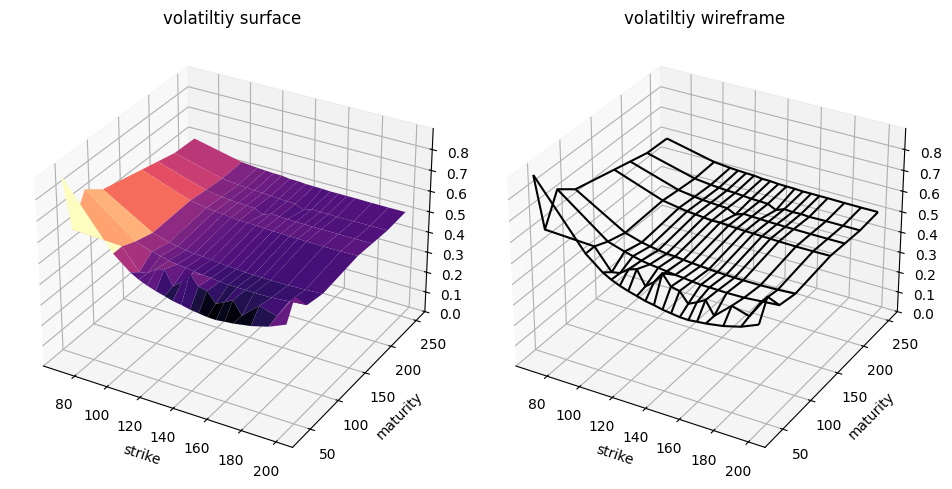
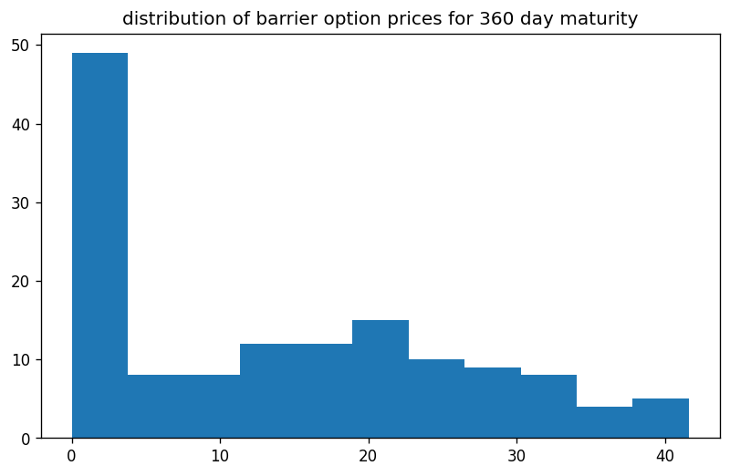

```python
import os
import sys
import requests
import pandas as pd
import numpy as np
import QuantLib as ql
from pathlib import Path
import matplotlib.pyplot as plt
from itertools import product
from datetime import datetime
from datetime import timedelta
from model_settings import ms
from historical_av_plot_vol_surface import plot_vol_surface

symbol='SPY'
url = str(
	'https://www.alphavantage.co/query?function=TIME_SERIES_DAILY&symbol='+
	symbol+'&outputsize=full&apikey='+
	ms.av_key)
r = requests.get(url)
spots = pd.Series(pd.DataFrame(r.json()['Time Series (Daily)']).transpose()['4. close'].squeeze())
spots = pd.to_numeric(spots,errors='coerce')
print(spots)
```

    
    pricing settings:
    Actual/365 (Fixed) day counter
    New York stock exchange calendar
    compounding: continuous
    frequency: annual
    
    2024-10-11    579.5800
    2024-10-10    576.1300
    2024-10-09    577.1400
    2024-10-08    573.1700
    2024-10-07    567.8000
                    ...   
    1999-11-05    137.8750
    1999-11-04    136.5312
    1999-11-03    135.5000
    1999-11-02    134.5937
    1999-11-01    135.5625
    Name: 4. close, Length: 6277, dtype: float64
    

# example data collection

let us collect a few recent trading days and inspect the data


```python
dates = spots.index
dates = dates[:10]
for date in dates:
    print(date)
```

    2024-10-11
    2024-10-10
    2024-10-09
    2024-10-08
    2024-10-07
    2024-10-04
    2024-10-03
    2024-10-02
    2024-10-01
    2024-09-30
    


```python
from historical_alphaVantage_collection import collect_av_link
chain = {}
for date in dates:
    spot = float(spots[date])
    link = collect_av_link(date,spot,symbol)
    printdate = datetime.strptime(date, '%Y-%m-%d').strftime('%A, %Y-%m-%d')
    chain[date] = link
```


```python
demo_spots = spots[dates]
demo_spots.index = pd.to_datetime(demo_spots.index, format='%Y-%m-%d')
plt.figure()
plt.plot(demo_spots,color='black')
plt.title(f'{symbol} option data collected')
plt.xticks(rotation=45)
plt.show()
plt.clf()
```


    

    


    <Figure size 640x480 with 0 Axes>


# example calibraion

now why not select the one trading day and proceed with an example calibration of our Heston (1993) model


```python
date = dates[3]
raw_data = chain[date]
calculation_datetime = datetime.strptime(date,'%Y-%m-%d')
calculation_date = ql.Date(
    calculation_datetime.day,
    calculation_datetime.month,
    calculation_datetime.year,
)
print(str(calculation_datetime.strftime('%A, '))+str(calculation_date))
```

    Tuesday, October 8th, 2024
    

## modelling the volatility surface


```python
df = raw_data.copy()
columns_to_convert = ['strike', 'last', 'mark',
       'bid', 'bid_size', 'ask', 'ask_size', 'volume', 'open_interest',
       'implied_volatility', 'delta', 'gamma', 'theta', 'vega', 'rho']
df[columns_to_convert] = df[
    columns_to_convert].apply(pd.to_numeric, errors='coerce')

df['expiration'] = pd.to_datetime(df['expiration'],format='%Y-%m-%d')
df['date'] = pd.to_datetime(df['date'],format='%Y-%m-%d')
df['days_to_maturity'] = df['expiration'] - df['date']
df['days_to_maturity'] = df['days_to_maturity'] / np.timedelta64(1, 'D')
df['days_to_maturity'] = df['days_to_maturity'].astype('int64')
df = df[(df['days_to_maturity']>=30)&(df['days_to_maturity']<=400)]

df = df[df['volume']>0].copy()
df['spot_price'] = spot

df['moneyness'] = ms.vmoneyness(df['spot_price'],df['strike'],df['type'])
df = df[(df['moneyness']<0)&(df['moneyness']>-0.5)]
indexed = df.copy().set_index(['strike','days_to_maturity'])

T = np.sort(df['days_to_maturity'].unique()).tolist()
K = np.sort(df['strike'].unique()).tolist()
volume_heatmap = pd.DataFrame(
    np.full((len(K), len(T)), np.nan), index=K, columns=T)
for k in K:
    for t in T:
        try:
            volume_heatmap.loc[k,t] = indexed.loc[(k,t),'volume']
        except Exception:
            pass
        
        
hottest_contracts = pd.DataFrame(
    volume_heatmap.unstack().sort_values(
        ascending=False)).head(50).reset_index()
hottest_contracts.columns = ['t','k','volume']
T = np.sort(hottest_contracts['t'].unique()).tolist()
K = np.sort(hottest_contracts['k'].unique()).tolist()

vol_matrix = pd.DataFrame(
    np.full((len(K),len(T)),np.nan),
    index = K,
    columns = T
)
for k in K:
    for t in T:
        try:
            vol_matrix.loc[k,t] = indexed.loc[(k,float(t)),'implied_volatility']
        except Exception:
            pass

vol_matrix = vol_matrix.dropna().copy()
T = vol_matrix.columns.tolist()
K = vol_matrix.index.tolist()

cols_to_map = [
        'contractID', 'symbol', 'expiration', 'type', 'last', 'mark',
        'bid', 'bid_size', 'ask', 'ask_size', 'volume', 'open_interest', 'date',
        'implied_volatility', 'delta', 'gamma', 'theta', 'vega', 'rho',
        'spot_price', 'moneyness'
]
for col in cols_to_map:
    for i,row in hottest_contracts.iterrows():
        hottest_contracts.at[i,col] = indexed.loc[(row['k'],row['t']),col]
        
hottest_contracts = hottest_contracts.rename(
    columns={'t':'days_to_maturity','k':'strike_price'}).copy()

link = {
        'raw_data': raw_data,
        'surface': vol_matrix,
        }
```


```python
vol_matrix = link['surface']
s = float(df['spot_price'].unique()[0])
print(f"\n{symbol} spot price: {s}")
print(f"\n{vol_matrix}\n")
plot_vol_surface(vol_matrix)
```

    
    SPY spot price: 573.76
    
               31       38       52       73       84       101      115      164  \
    500.0  0.31159  0.29803  0.27851  0.26617  0.25839  0.25336  0.24940  0.24071   
    510.0  0.29117  0.27928  0.26144  0.25199  0.24513  0.24086  0.23751  0.23095   
    520.0  0.27013  0.26098  0.24544  0.23827  0.23217  0.22882  0.22608  0.22120   
    525.0  0.26083  0.25199  0.23781  0.23156  0.22577  0.22288  0.22013  0.21632   
    530.0  0.25138  0.24330  0.23004  0.22486  0.21983  0.21693  0.21464  0.21160   
    540.0  0.23278  0.22608  0.21495  0.21160  0.20718  0.20519  0.20352  0.20199   
    550.0  0.21495  0.20931  0.20016  0.19818  0.19452  0.19330  0.19239  0.19254   
    555.0  0.20580  0.20077  0.19254  0.19147  0.18812  0.18751  0.18690  0.18797   
    560.0  0.19650  0.19224  0.18492  0.18461  0.18187  0.18187  0.18157  0.18355   
    565.0  0.18705  0.18340  0.17745  0.17791  0.17577  0.17608  0.17623  0.17928   
    570.0  0.17776  0.17471  0.16998  0.17166  0.16968  0.17090  0.17120  0.17516   
    575.0  0.17013  0.16663  0.16221  0.15962  0.15077  0.15199  0.15260  0.15474   
    580.0  0.16114  0.15779  0.15428  0.15276  0.14483  0.14651  0.14742  0.15001   
    585.0  0.15245  0.14940  0.14712  0.14651  0.13919  0.14132  0.14224  0.14529   
    590.0  0.14483  0.14209  0.14026  0.14071  0.13385  0.13645  0.13766  0.14117   
    600.0  0.13263  0.13035  0.12913  0.13035  0.12440  0.12760  0.12913  0.13385   
    605.0  0.12913  0.12669  0.12486  0.12608  0.12044  0.12364  0.12547  0.13050   
    
               346  
    500.0  0.23080  
    510.0  0.22486  
    520.0  0.21907  
    525.0  0.21617  
    530.0  0.21342  
    540.0  0.20748  
    550.0  0.20169  
    555.0  0.19894  
    560.0  0.19620  
    565.0  0.19346  
    570.0  0.19086  
    575.0  0.15245  
    580.0  0.14971  
    585.0  0.14681  
    590.0  0.14391  
    600.0  0.13827  
    605.0  0.13538  
    
    


    

    


    <Figure size 640x480 with 0 Axes>


## calibrating a Heston (1993) model


```python
vol_matrix = vol_matrix.sort_index().drop_duplicates()
pd.to_numeric(raw_data['last'])
raw_data['date'] = pd.to_datetime(raw_data['date'])
raw_data['expiration'] = pd.to_datetime(raw_data['expiration'])
raw_data['implied_volatility'] = pd.to_numeric(raw_data['implied_volatility']).astype(float)
raw_data['strike'] = pd.to_numeric(raw_data['strike'])
raw_data['last'] = pd.to_numeric(raw_data['last'])
contract_maturities = np.array((raw_data['expiration'] - raw_data['date']) / timedelta(days=1)).astype(int)
raw_data['days_to_maturity'] = contract_maturities

T = vol_matrix.columns.tolist()
K = vol_matrix.index.tolist()
r = 0.04
g = 0.0

ql.Settings.instance().evaluationDate = calculation_date
flat_ts, dividend_ts = ms.ql_ts_rg(r, g, calculation_date)
S_handle = ql.QuoteHandle(ql.SimpleQuote(s))

heston_helpers = []
v0 = 0.01; kappa = 0.2; theta = 0.02; rho = -0.75; eta = 0.5;
process = ql.HestonProcess(
    flat_ts,
    dividend_ts,
    S_handle,
    v0,                # Initial volatility
    kappa,             # Mean reversion speed
    theta,             # Long-run variance (volatility squared)
    eta,               # Volatility of the volatility
    rho                # Correlation between asset and volatility
)
model = ql.HestonModel(process)
engine = ql.AnalyticHestonEngine(model)

for t in T:
    for k in K:
        p = ql.Period(int(t),ql.Days)
        volatility = vol_matrix.loc[k,t]
        helper = ql.HestonModelHelper(
            p, ms.calendar, float(s), k, 
            ql.QuoteHandle(ql.SimpleQuote(volatility)), 
            flat_ts, 
            dividend_ts
            )
        helper.setPricingEngine(engine)
        heston_helpers.append(helper)

lm = ql.LevenbergMarquardt(1e-8, 1e-8, 1e-8)


model.calibrate(heston_helpers, lm,
                  ql.EndCriteria(1000, 50, 1.0e-8,1.0e-8, 1.0e-8))

theta, kappa, eta, rho, v0 = model.params()
heston_parameters = pd.Series(
    [theta, kappa, eta, rho, v0],
    index = ['theta', 'kappa', 'eta', 'rho', 'v0'],
    dtype = float
)
calibration_test_data = raw_data.copy()[['strike','type','last','implied_volatility','days_to_maturity']]
calibration_test_data.columns = ['strike_price','w','market_price','volatility','days_to_maturity']
calibration_test_data['spot_price'] = s
calibration_test_data['risk_free_rate'] = r
calibration_test_data['dividend_rate'] = g
calibration_test_data = calibration_test_data[calibration_test_data['days_to_maturity'].isin(df['days_to_maturity'])]
calibration_test_data[heston_parameters.index.tolist()] = np.tile(heston_parameters,(calibration_test_data.shape[0],1))
calibration_test_data.loc[:,'moneyness'] = ms.vmoneyness(
    calibration_test_data['spot_price'].values,
    calibration_test_data['strike_price'].values,
    calibration_test_data['w'].values)
calibration_test_data['calculation_date'] = calculation_datetime
calibration_test_data['black_scholes'] = ms.vector_black_scholes(calibration_test_data)
calibration_test_data['heston_price'] = ms.vector_heston_price(calibration_test_data)
```

## testing calibration accuracy


```python
calibration_test_data.loc[:,'error'] = calibration_test_data['heston_price'].values - calibration_test_data['black_scholes'].values
avg = np.mean(np.abs(calibration_test_data['error']))
print(f"\n{printdate}\n{heston_parameters}\naverage absolute error: {round(avg,3)}")
print(f"calibration testing dataset:\n{calibration_test_data.describe()}")
```

    
    Monday, 2024-09-30
    theta    0.128750
    kappa    0.507891
    eta      1.326914
    rho     -0.723443
    v0       0.038301
    dtype: float64
    average absolute error: 2.627
    calibration testing dataset:
           strike_price  market_price   volatility  days_to_maturity  \
    count   4946.000000   4946.000000  4946.000000       4946.000000   
    mean     516.437525     41.852331     0.249732        163.988273   
    min      120.000000      0.000000     0.012760         31.000000   
    25%      454.000000      0.000000     0.164875         73.000000   
    50%      528.000000      6.140000     0.211365        143.000000   
    75%      585.000000     55.582500     0.292690        265.000000   
    max      830.000000    451.670000     1.349070        357.000000   
    std      125.840010     71.700001     0.145537        108.548043   
    
             spot_price  risk_free_rate  dividend_rate       theta         kappa  \
    count  4.946000e+03         4946.00         4946.0  4946.00000  4.946000e+03   
    mean   5.737600e+02            0.04            0.0     0.12875  5.078911e-01   
    min    5.737600e+02            0.04            0.0     0.12875  5.078911e-01   
    25%    5.737600e+02            0.04            0.0     0.12875  5.078911e-01   
    50%    5.737600e+02            0.04            0.0     0.12875  5.078911e-01   
    75%    5.737600e+02            0.04            0.0     0.12875  5.078911e-01   
    max    5.737600e+02            0.04            0.0     0.12875  5.078911e-01   
    std    1.136983e-13            0.00            0.0     0.00000  1.110335e-16   
    
                   eta           rho            v0     moneyness  \
    count  4946.000000  4.946000e+03  4.946000e+03  4.946000e+03   
    mean      1.326914 -7.234427e-01  3.830103e-02  5.369833e-02   
    min       1.326914 -7.234427e-01  3.830103e-02 -7.908533e-01   
    25%       1.326914 -7.234427e-01  3.830103e-02 -1.268126e-01   
    50%       1.326914 -7.234427e-01  3.830103e-02  8.744809e-08   
    75%       1.326914 -7.234427e-01  3.830103e-02  1.452295e-01   
    max       1.326914 -7.234427e-01  3.830103e-02  3.781333e+00   
    std       0.000000  1.110335e-16  6.939595e-18  3.818625e-01   
    
              calculation_date  black_scholes  heston_price        error  
    count                 4946    4946.000000   4946.000000  4946.000000  
    mean   2024-10-08 00:00:00      60.648755     60.038268    -0.610487  
    min    2024-10-08 00:00:00       0.008903      0.000025   -35.586976  
    25%    2024-10-08 00:00:00       4.506117      5.453626    -0.308451  
    50%    2024-10-08 00:00:00      21.828682     20.624575     0.412971  
    75%    2024-10-08 00:00:00      87.105267     86.215634     1.262495  
    max    2024-10-08 00:00:00     454.933599    454.716195     8.068505  
    std                    NaN      82.619762     81.845506     5.543815  
    

# train data generation
now that we have calibrated our pricing engine, let us proceed with generating 
all real down barrier option contract combinations for this trading day

```python
K = np.linspace(s*0.8,s*1.2,7).astype(int).tolist()
down_barriers =  np.linspace(s*0.5,s*0.99,5).astype(int).tolist()
T = [
    30,60,90,
    180,360,540,720
]
print(f"\n{symbol} spot price:\n     {spot}\nstrikes:\n     {K}\n\nbarriers:\n     {down_barriers}\n\nmaturities:\n     {T}\n")
```

    
    SPY spot price:
         573.76
    strikes:
         [459, 497, 535, 573, 612, 650, 688]
    
    barriers:
         [286, 357, 427, 497, 568]
    
    maturities:
         [30, 60, 90, 180, 360, 540, 720]
    
    


```python
features = pd.DataFrame(
    product(
        [spot],
        K,
        T,
        down_barriers,
        [0.0], # rebate
        ['put','call'],
        [0.04], # risk-free rate
        [0.0], # dividend rate
        [theta], 
        [kappa], 
        [eta], 
        [rho], 
        [v0],
        [calculation_datetime],
        ['Out','In']
    ),
    columns = [
        'spot_price',
        'strike_price',
        'days_to_maturity',
        'barrier',
        'rebate',
        'w',
        'risk_free_rate',
        'dividend_rate',
        'theta', 'kappa', 'eta', 'rho', 'v0',
        'calculation_date',
        'outin',
    ]
)
features['moneyness'] = ms.vmoneyness(features['spot_price'],features['strike_price'],features['w'])
features['barrier_type_name'] = 'Down' + features['outin']
features['vanilla_price'] = ms.vector_heston_price(features)
features['barrier_price'] = ms.vector_barrier_price(features)
featuresby_t = features.copy().set_index('days_to_maturity')
```


```python
for t in T:
    plt.figure(figsize=plt.figaspect(0.6),dpi=120)
    prices= featuresby_t.loc[t,'barrier_price']
    plt.hist(prices,bins=int(np.sqrt(prices.shape[0])))
    plt.title(f'distribution of barrier option prices for {t} day maturity')
    plt.show()
    plt.clf()
```


    

    


    <Figure size 640x480 with 0 Axes>


    

    


    <Figure size 640x480 with 0 Axes>


    

    


    <Figure size 640x480 with 0 Axes>


    

    


    <Figure size 640x480 with 0 Axes>


    

    


    <Figure size 640x480 with 0 Axes>


    

    


    <Figure size 640x480 with 0 Axes>


    

    


    <Figure size 640x480 with 0 Axes>


# model training
now that we have a dataset, we can, for example, try to test whether the model is able to 
predict the prices of our two year barrier options while only having seen the others in training

```python
from convsklearn import barrier_trainer
bt = barrier_trainer
```

    test size: 1.0%
    random state: None
    maximum iterations: 1000
    
    target: 
    observed_price
    
    features: 
    ['spot_price', 'strike_price', 'days_to_maturity', 'risk_free_rate', 'dividend_rate', 'kappa', 'theta', 'rho', 'eta', 'v0', 'barrier', 'barrier_type_name', 'w']
    
    feature transformer(s):
    ('StandardScaler', StandardScaler(), ['spot_price', 'strike_price', 'days_to_maturity', 'risk_free_rate', 'dividend_rate', 'kappa', 'theta', 'rho', 'eta', 'v0', 'barrier'])
    
    ('OneHotEncoder', OneHotEncoder(sparse_output=False), ['barrier_type_name', 'w'])
    
    target transformer(s):
    StandardScaler()
    
    


```python
features['observed_price'] = ms.noisyfier(features.loc[:,'barrier_price']) # apply slight peturbation in the form of a random normal with standard deviation 0.15
train_data = features[features['days_to_maturity']!=720]
test_data = features[features['days_to_maturity']==720]
arrs = bt.get_train_test_arrays(train_data,test_data)
train_X = arrs['train_X']
train_y = arrs['train_y']
test_X = arrs['test_X']
test_y = arrs['train_y']
preprocessor = bt.preprocess()
dnn_barriers, runtime, specs = bt.run_dnn(preprocessor, train_X, train_y)
insample, outsample, errors = bt.test_prediction_accuracy(dnn_barriers, test_data, train_data)
print(dnn_barriers)
print(outsample)
```

    
    training...
    
    Deep Neural Network
    hidden layers sizes: (13, 13, 13)
    learning rate: adaptive
    activation: relu
    solver: sgd
    alpha: 0.0001
    
    in sample:
         RSME: 7.7295195806531405
         MAE: 5.056006552160728
    
    out of sample:
         RSME: 13.826936968647077
         MAE: 9.877072255579307
    TransformedTargetRegressor(regressor=Pipeline(steps=[('preprocessor',
                                                          ColumnTransformer(transformers=[('StandardScaler',
                                                                                           StandardScaler(),
                                                                                           ['spot_price',
                                                                                            'strike_price',
                                                                                            'days_to_maturity',
                                                                                            'risk_free_rate',
                                                                                            'dividend_rate',
                                                                                            'kappa',
                                                                                            'theta',
                                                                                            'rho',
                                                                                            'eta',
                                                                                            'v0',
                                                                                            'barrier']),
                                                                                          ('OneHotEncoder',
                                                                                           OneHotEncoder(sparse_output=False),
                                                                                           ['barrier_type_name',
                                                                                            'w'])])),
                                                         ('regressor',
                                                          MLPRegressor(hidden_layer_sizes=(13,
                                                                                           13,
                                                                                           13),
                                                                       learning_rate='adaptive',
                                                                       max_iter=1000,
                                                                       solver='sgd'))]),
                               transformer=Pipeline(steps=[('StandardScaler',
                                                            StandardScaler())]))
         spot_price  strike_price  days_to_maturity  barrier  rebate     w  \
    120      573.76           459               720      286     0.0   put   
    121      573.76           459               720      286     0.0   put   
    122      573.76           459               720      286     0.0  call   
    123      573.76           459               720      286     0.0  call   
    124      573.76           459               720      357     0.0   put   
    ..          ...           ...               ...      ...     ...   ...   
    975      573.76           688               720      497     0.0  call   
    976      573.76           688               720      568     0.0   put   
    977      573.76           688               720      568     0.0   put   
    978      573.76           688               720      568     0.0  call   
    979      573.76           688               720      568     0.0  call   
    
         risk_free_rate  dividend_rate    theta     kappa  ...  calculation_date  \
    120            0.04            0.0  0.12875  0.507891  ...        2024-10-08   
    121            0.04            0.0  0.12875  0.507891  ...        2024-10-08   
    122            0.04            0.0  0.12875  0.507891  ...        2024-10-08   
    123            0.04            0.0  0.12875  0.507891  ...        2024-10-08   
    124            0.04            0.0  0.12875  0.507891  ...        2024-10-08   
    ..              ...            ...      ...       ...  ...               ...   
    975            0.04            0.0  0.12875  0.507891  ...        2024-10-08   
    976            0.04            0.0  0.12875  0.507891  ...        2024-10-08   
    977            0.04            0.0  0.12875  0.507891  ...        2024-10-08   
    978            0.04            0.0  0.12875  0.507891  ...        2024-10-08   
    979            0.04            0.0  0.12875  0.507891  ...        2024-10-08   
    
         outin  moneyness barrier_type_name vanilla_price  barrier_price  \
    120    Out  -0.200014           DownOut     19.484414       1.522133   
    121     In  -0.200014            DownIn     19.484414      17.915424   
    122    Out   0.250022           DownOut    169.069416     166.662254   
    123     In   0.250022            DownIn    169.069416       2.579340   
    124    Out  -0.200014           DownOut     19.484414       0.349273   
    ..     ...        ...               ...           ...            ...   
    975     In  -0.166047            DownIn     19.479203       7.525905   
    976    Out   0.199108           DownOut     81.519635       1.813163   
    977     In   0.199108            DownIn     81.519635      81.241938   
    978    Out  -0.166047           DownOut     19.479203       2.446905   
    979     In  -0.166047            DownIn     19.479203      18.645028   
    
        observed_price  outofsample_target  outofsample_prediction  \
    120       1.465758            1.465758                7.541702   
    121      17.951974           17.951974               16.012198   
    122     166.294801          166.294801              144.997890   
    123       2.452313            2.452313               16.521453   
    124       0.189842            0.189842                3.148170   
    ..             ...                 ...                     ...   
    975       7.470836            7.470836               23.046715   
    976       1.851457            1.851457               17.721679   
    977      81.205481           81.205481               88.832182   
    978       2.357371            2.357371                3.552887   
    979      18.810441           18.810441               28.784200   
    
         outofsample_error  
    120           6.075944  
    121          -1.939776  
    122         -21.296911  
    123          14.069139  
    124           2.958328  
    ..                 ...  
    975          15.575879  
    976          15.870222  
    977           7.626702  
    978           1.195516  
    979           9.973759  
    
    [140 rows x 23 columns]
    


```python

```
