```python
import os
import joblib
import pandas as pd
import numpy as np
import matplotlib.pyplot as plt
from pathlib import Path
```

# functions


```python
def compute_RMSE(diff):
    if len(diff)>0:
        return np.sqrt(np.mean(diff.values**2))
        
def compute_MAE(diff):
    if len(diff)>0:
        return np.mean(np.abs(diff.values))

def plot_errors(plotcols, test_data, train_data):
    test_diff = test_data['outofsample_error']
    train_diff = train_data['insample_error']
    
    test_data['RMSE'] = test_diff.resample('D').apply(compute_RMSE).dropna()
    test_data['MAE'] = test_diff.resample('D').apply(compute_MAE).dropna()
    test_plot = test_data[plotcols].copy().drop_duplicates()
    
    train_data['RMSE'] = train_diff.resample('D').apply(compute_RMSE).dropna()
    train_data['MAE'] = train_diff.resample('D').apply(compute_MAE).dropna()
    train_plot = train_data[plotcols].copy().drop_duplicates()
    
    fig,axs = plt.subplots(len(plotcols),figsize=(10,10),sharex=True)
    for i,col in enumerate(plotcols):
        axs[i].plot(train_plot[col],color='green',label='in-sample')
        axs[i].set_title(col.replace('_',' '))
        axs[i].legend()
    for i,col in enumerate(plotcols):
        axs[i].plot(test_plot[col],color='purple',label='out-of-sample')
        axs[i].set_title(col.replace('_',' '))
        axs[i].legend()
    plt.show()

def retrain(old_train_data,old_test_data,train_to_date):
    new_train = pd.concat([old_train_data,old_test_data[old_test_data.index<=train_to_date]],ignore_index=False).dropna(how='any',axis=1).reset_index(drop=False)
    new_test = old_test_data[~old_test_data.index.isin(new_train['calculation_date'])].copy().reset_index(drop=False)
    arrs = trainer.get_train_test_arrays(new_train, new_test)
    train_X = arrs['train_X']
    train_y = arrs['train_y']
    test_X = arrs['test_X']
    test_y = arrs['test_y']
    preprocessor = trainer.preprocess()
    retrained_model = trainer.run_dnn(preprocessor,train_X,train_y)
    train_data, test_data, errors = trainer.test_prediction_accuracy(retrained_model,new_test,new_train)
    new_test_data = test_data.set_index('calculation_date')
    new_train_data = train_data.set_index('calculation_date')
    print()
    plot_errors(plotcols,new_test_data,new_train_data)
    return new_train_data, new_test_data


# """
# from sklearn.inspection import partial_dependence,PartialDependenceDisplay

# part_disp_X = train_data[model_fit.feature_names_in_]
# fig, ax = plt.subplots(figsize=(12, 6))
# disp = PartialDependenceDisplay.from_estimator(model_fit, part_disp_X, model_fit.feature_names_in_, ax=ax)

# part_disp_X = insample[retrained_model.feature_names_in_]
# fig, ax = plt.subplots(figsize=(12, 6))
# disp = PartialDependenceDisplay.from_estimator(retrained_model, part_disp_X, model_fit.feature_names_in_, ax=ax)
# """
```

# loading model


```python
from model_settings import ms
root = Path().resolve().parent.parent
models_dir = os.path.join(root,ms.trained_models)
models = [f for f in os.listdir(models_dir) if f.find('ipynb')==-1]
for i,m in enumerate(models):
    print(f"{i}     {m}")
```

    0     2024_10_29 100027150881 bloomberg barrier options
    1     2024_10_29 100220915287 bloomberg asian options
    

# loading data


```python
"""
select model here
"""
model = models[0]
""""""

plotcols = ['v0','RMSE', 'MAE','spot_price']

from convsklearn import asian_trainer, barrier_trainer

model_dir = os.path.join(models_dir,model)
model_files = [f for f in os.listdir(model_dir) if f.find('ipynb')==-1 and f.find('.html')==-1]
for i,m in enumerate(model_files):
    print(f"{i}     {m}")
print()
if any('asian' in file for file in model_files):
    trainer = asian_trainer
if any('barrier' in file for file in model_files):
    trainer = barrier_trainer

train_data = pd.read_csv(os.path.join(model_dir,[f for f in model_files if f.find('insample')!=-1][0])).iloc[:,1:].copy()
test_data = pd.read_csv(os.path.join(model_dir,[f for f in model_files if f. find('outsample')!=-1][0])).iloc[:,1:].copy()
train_data['calculation_date'] = pd.to_datetime(train_data['calculation_date'])
test_data['calculation_date'] = pd.to_datetime(test_data['calculation_date'])
train_data = train_data.set_index('calculation_date')
test_data = test_data.set_index('calculation_date')
outsample_dates = pd.Series(test_data.index).sort_values(ascending=True).drop_duplicates().reset_index(drop=True)
model_fit = joblib.load(os.path.join(model_dir,[f for f in model_files if f.endswith('.pkl')][0]))

for col in trainer.feature_set:
    print(f"{col.replace("_"," "):}",f"\n{test_data[col].copy().squeeze().sort_values().drop_duplicates().reset_index(drop=True)}\n")
print()
print(model_fit)

plot_errors(plotcols, test_data, train_data)
```

    0     2024_10_29 100027150881 bloomberg barrier options insample.csv
    1     2024_10_29 100027150881 bloomberg barrier options outsample.csv
    2     2024_10_29 100027150881 bloomberg barrier options.pkl
    3     2024_10_29 100027150881 bloomberg barrier options.txt
    
    spot price 
    0        676.03
    1        682.43
    2        683.09
    3        696.44
    4        701.13
             ...   
    1076    1461.17
    1077    1461.21
    1078    1461.31
    1079    1461.36
    1080    1465.27
    Name: spot_price, Length: 1081, dtype: float64
    
    strike price 
    0        608.42700
    1        614.18700
    2        614.78100
    3        625.32775
    4        626.79600
               ...    
    9715    1607.28700
    9716    1607.33100
    9717    1607.44100
    9718    1607.49600
    9719    1611.79700
    Name: strike_price, Length: 9720, dtype: float64
    
    days to maturity 
    0     60
    1     90
    2    180
    3    360
    4    540
    5    720
    Name: days_to_maturity, dtype: int64
    
    risk free rate 
    0    0.04
    Name: risk_free_rate, dtype: float64
    
    dividend rate 
    0      0.017912
    1      0.017942
    2      0.017970
    3      0.017981
    4      0.017985
             ...   
    992    0.035255
    993    0.035276
    994    0.035596
    995    0.035690
    996    0.037735
    Name: dividend_rate, Length: 997, dtype: float64
    
    kappa 
    0        0.083258
    1        0.090921
    2        0.098043
    3        0.098494
    4        0.102884
              ...    
    1086    12.960913
    1087    13.113228
    1088    13.250228
    1089    15.696333
    1090    15.991443
    Name: kappa, Length: 1091, dtype: float64
    
    theta 
    0       0.037838
    1       0.038747
    2       0.039401
    3       0.040521
    4       0.040844
              ...   
    1086    0.311501
    1087    0.312746
    1088    0.340959
    1089    0.350397
    1090    0.356100
    Name: theta, Length: 1091, dtype: float64
    
    rho 
    0      -1.000000
    1      -1.000000
    2      -1.000000
    3      -1.000000
    4      -1.000000
              ...   
    1086   -0.234005
    1087   -0.220616
    1088   -0.203652
    1089   -0.196170
    1090   -0.181764
    Name: rho, Length: 1091, dtype: float64
    
    eta 
    0       0.110964
    1       0.112310
    2       0.113278
    3       0.113457
    4       0.113904
              ...   
    1086    1.109709
    1087    1.213266
    1088    1.394869
    1089    1.523884
    1090    1.528820
    Name: eta, Length: 1091, dtype: float64
    
    v0 
    0       0.007385
    1       0.007560
    2       0.008220
    3       0.008839
    4       0.009003
              ...   
    1086    0.527421
    1087    0.620853
    1088    0.631678
    1089    0.652337
    1090    0.694016
    Name: v0, Length: 1091, dtype: float64
    
    barrier 
    0         338.015
    1         341.215
    2         341.545
    3         348.220
    4         350.565
               ...   
    10804    2191.755
    10805    2191.815
    10806    2191.965
    10807    2192.040
    10808    2197.905
    Name: barrier, Length: 10809, dtype: float64
    
    barrier type name 
    0     DownIn
    1    DownOut
    2       UpIn
    3      UpOut
    Name: barrier_type_name, dtype: object
    
    w 
    0    call
    1     put
    Name: w, dtype: object
    
    
    TransformedTargetRegressor(regressor=Pipeline(steps=[('preprocessor',
                                                          ColumnTransformer(transformers=[('StandardScaler',
                                                                                           StandardScaler(),
                                                                                           ['spot_price',
                                                                                            'strike_price',
                                                                                            'days_to_maturity',
                                                                                            'risk_free_rate',
                                                                                            'dividend_rate',
                                                                                            'kappa',
                                                                                            'theta',
                                                                                            'rho',
                                                                                            'eta',
                                                                                            'v0',
                                                                                            'barrier']),
                                                                                          ('OneHotEncoder',
                                                                                           OneHotEncoder(sparse_output=False),
                                                                                           ['barrier_type_name',
                                                                                            'w'])])),
                                                         ('regressor',
                                                          MLPRegressor(alpha=0.01,
                                                                       hidden_layer_sizes=(13,
                                                                                           13),
                                                                       learning_rate='adaptive',
                                                                       learning_rate_init=0.1,
                                                                       max_iter=500,
                                                                       solver='sgd',
                                                                       warm_start=True))]),
                               transformer=Pipeline(steps=[('StandardScaler',
                                                            StandardScaler())]))
    


    
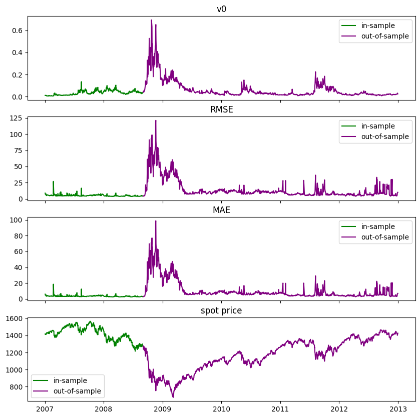
    


# retraining


```python
retraining_frequency = 100  # days
retraining_i = np.arange(retraining_frequency,len(outsample_dates),retraining_frequency)
retraining_dates = outsample_dates[retraining_i].reset_index(drop=True)
print(retraining_dates)
```

    0   2009-01-26
    1   2009-06-18
    2   2009-11-09
    3   2010-04-06
    4   2010-08-26
    5   2011-01-19
    6   2011-06-13
    7   2011-11-02
    8   2012-03-28
    9   2012-08-20
    Name: calculation_date, dtype: datetime64[ns]
    


```python
for date in retraining_dates:
    print()
    print(date.strftime('%c'))
    retrain(train_data,test_data,date)
    print()
```

    
    Mon Jan 26 00:00:00 2009
    
    training...
    
    alpha: 0.01
    hidden_layer_sizes: (13, 13)
    learning_rate: adaptive
    learning_rate_init: 0.1
    solver: sgd
    early_stopping: False
    max_iter: 500
    warm_start: True
    tol: 0.0001
    cpu: 170.77293848991394
    
    in sample:
         RMSE: 6.188532512375753
         MAE: 4.1342199057271305
    
    out of sample:
         RMSE: 8.352552049292736
         MAE: 5.5906455132788055
    
    


    
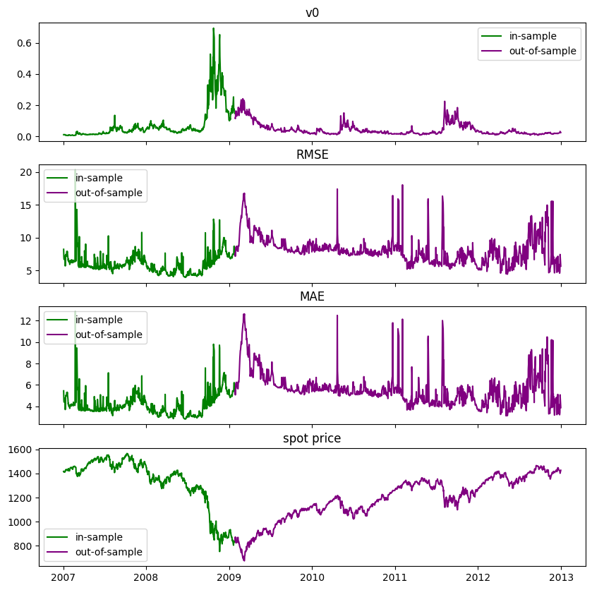
    


    
    
    Thu Jun 18 00:00:00 2009
    
    training...
    
    alpha: 0.01
    hidden_layer_sizes: (13, 13)
    learning_rate: adaptive
    learning_rate_init: 0.1
    solver: sgd
    early_stopping: False
    max_iter: 500
    warm_start: True
    tol: 0.0001
    cpu: 229.3441550731659
    
    in sample:
         RMSE: 6.055875100482312
         MAE: 4.096226585154795
    
    out of sample:
         RMSE: 9.20768505287706
         MAE: 5.965125236486502
    
    


    
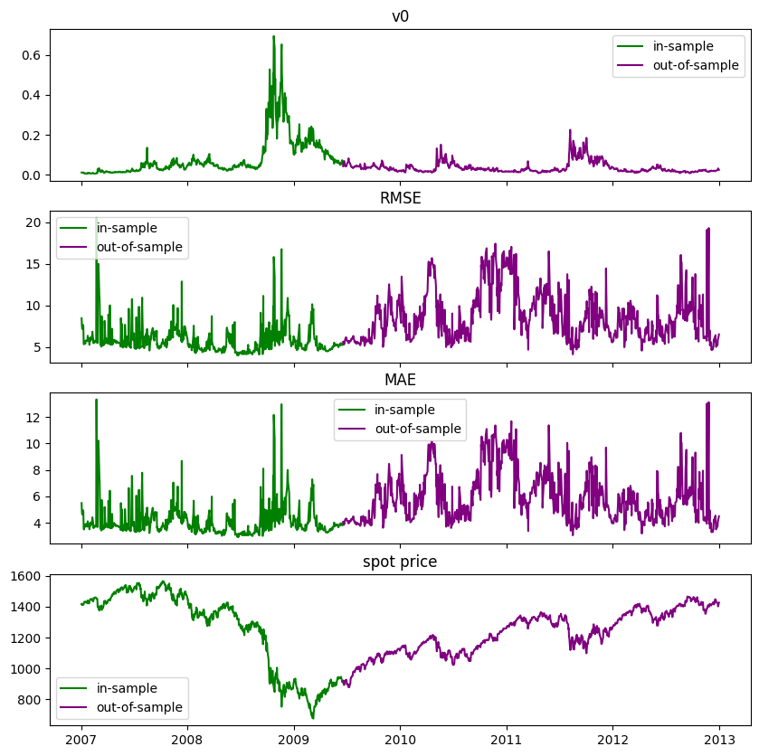
    


    
    
    Mon Nov  9 00:00:00 2009
    
    training...
    
    alpha: 0.01
    hidden_layer_sizes: (13, 13)
    learning_rate: adaptive
    learning_rate_init: 0.1
    solver: sgd
    early_stopping: False
    max_iter: 500
    warm_start: True
    tol: 0.0001
    cpu: 243.68542861938477
    
    in sample:
         RMSE: 5.56421974092635
         MAE: 3.6540789423402313
    
    out of sample:
         RMSE: 6.8396280642361935
         MAE: 4.423856169580675
    
    


    
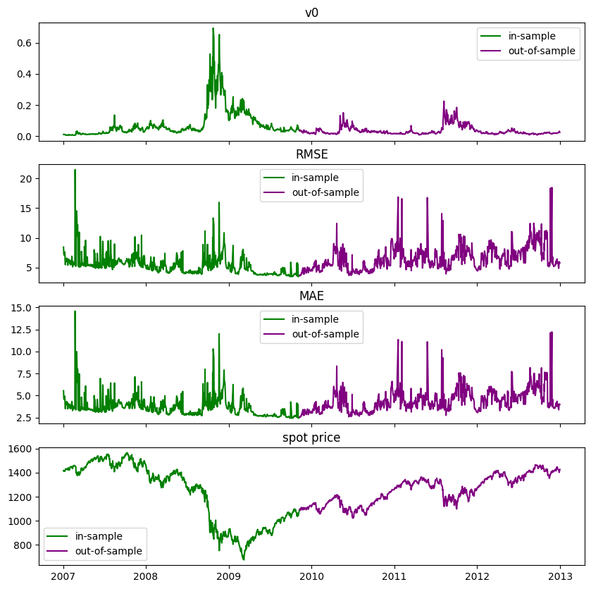
    


    
    
    Tue Apr  6 00:00:00 2010
    
    training...
    
    alpha: 0.01
    hidden_layer_sizes: (13, 13)
    learning_rate: adaptive
    learning_rate_init: 0.1
    solver: sgd
    early_stopping: False
    max_iter: 500
    warm_start: True
    tol: 0.0001
    cpu: 333.8553113937378
    
    in sample:
         RMSE: 5.573777700826749
         MAE: 3.5608254321765522
    
    out of sample:
         RMSE: 7.6970110170846935
         MAE: 4.8362575909641174
    
    


    
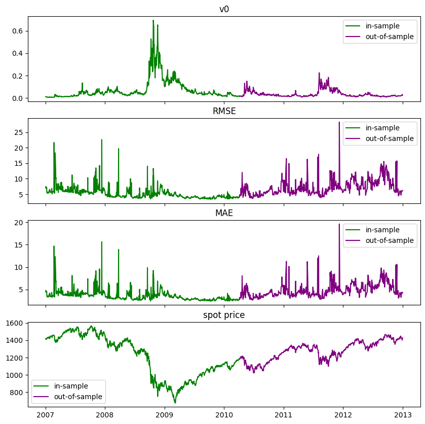
    


    
    
    Thu Aug 26 00:00:00 2010
    
    training...
    
    alpha: 0.01
    hidden_layer_sizes: (13, 13)
    learning_rate: adaptive
    learning_rate_init: 0.1
    solver: sgd
    early_stopping: False
    max_iter: 500
    warm_start: True
    tol: 0.0001
    cpu: 315.4284086227417
    
    in sample:
         RMSE: 6.093852318058742
         MAE: 4.01078552014863
    
    out of sample:
         RMSE: 7.795744517105574
         MAE: 5.0654626825960705
    
    


    
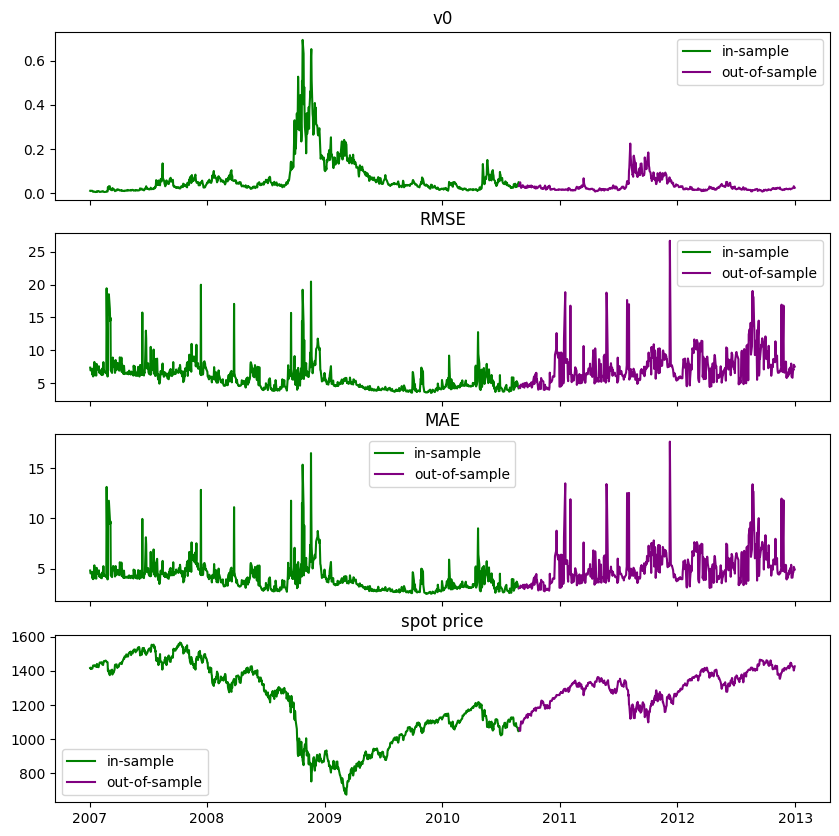
    


    
    
    Wed Jan 19 00:00:00 2011
    
    training...
    
    alpha: 0.01
    hidden_layer_sizes: (13, 13)
    learning_rate: adaptive
    learning_rate_init: 0.1
    solver: sgd
    early_stopping: False
    max_iter: 500
    warm_start: True
    tol: 0.0001
    cpu: 324.78718185424805
    
    in sample:
         RMSE: 5.757448712478732
         MAE: 3.8387208202670604
    
    out of sample:
         RMSE: 7.134485621158836
         MAE: 4.626077636529576
    
    


    
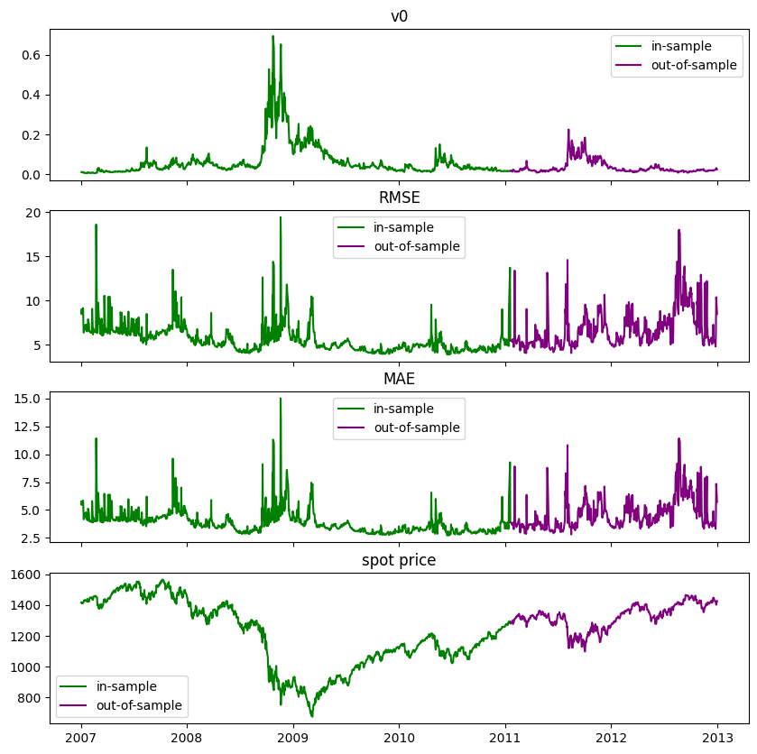
    


    
    
    Mon Jun 13 00:00:00 2011
    
    training...
    
    alpha: 0.01
    hidden_layer_sizes: (13, 13)
    learning_rate: adaptive
    learning_rate_init: 0.1
    solver: sgd
    early_stopping: False
    max_iter: 500
    warm_start: True
    tol: 0.0001
    cpu: 440.3976881504059
    
    in sample:
         RMSE: 5.18153608833761
         MAE: 3.4672518146414397
    
    out of sample:
         RMSE: 7.2957322942438525
         MAE: 4.580311110486777
    
    


    
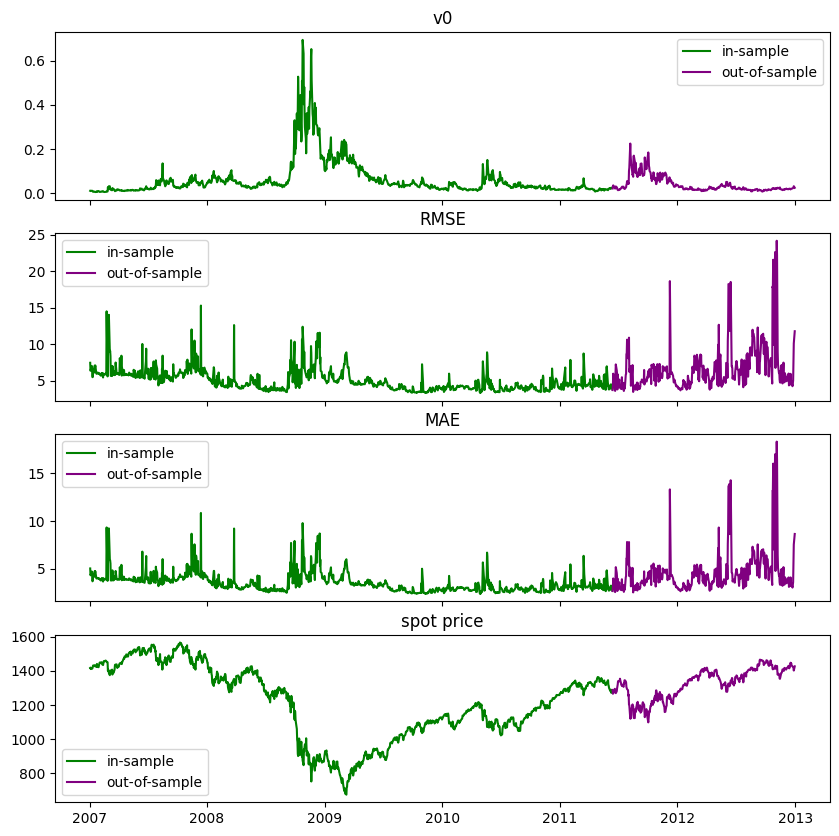
    


    
    
    Wed Nov  2 00:00:00 2011
    
    training...
    
    alpha: 0.01
    hidden_layer_sizes: (13, 13)
    learning_rate: adaptive
    learning_rate_init: 0.1
    solver: sgd
    early_stopping: False
    max_iter: 500
    warm_start: True
    tol: 0.0001
    cpu: 395.6859378814697
    
    in sample:
         RMSE: 5.902748871803263
         MAE: 3.8134663330167555
    
    out of sample:
         RMSE: 7.387501265270432
         MAE: 4.743871070771947
    
    


    
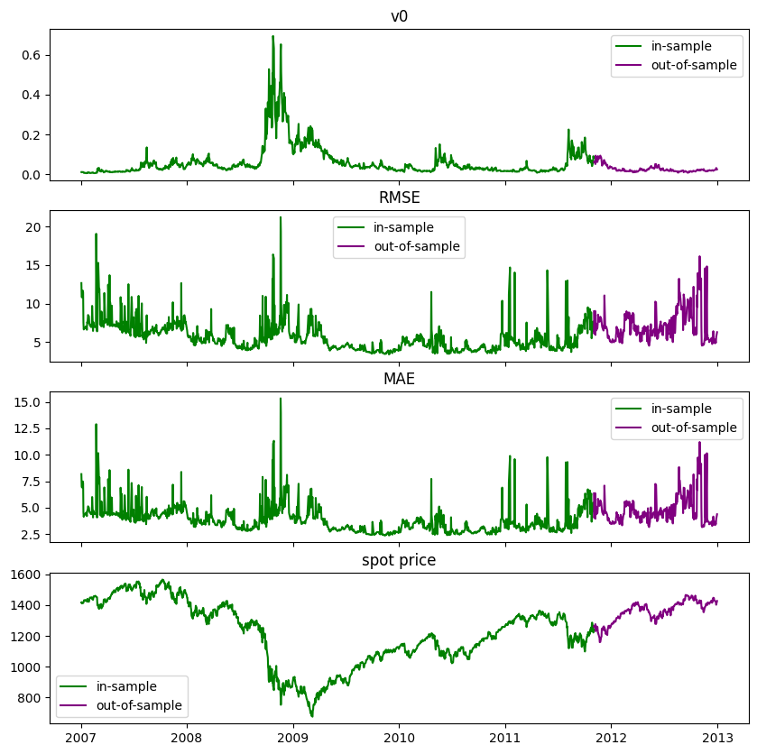
    


    
    
    Wed Mar 28 00:00:00 2012
    
    training...
    
    alpha: 0.01
    hidden_layer_sizes: (13, 13)
    learning_rate: adaptive
    learning_rate_init: 0.1
    solver: sgd
    early_stopping: False
    max_iter: 500
    warm_start: True
    tol: 0.0001
    cpu: 426.3791811466217
    
    in sample:
         RMSE: 6.582831486659215
         MAE: 4.387949958477312
    
    out of sample:
         RMSE: 7.316981819318022
         MAE: 4.8978367770121
    
    


    
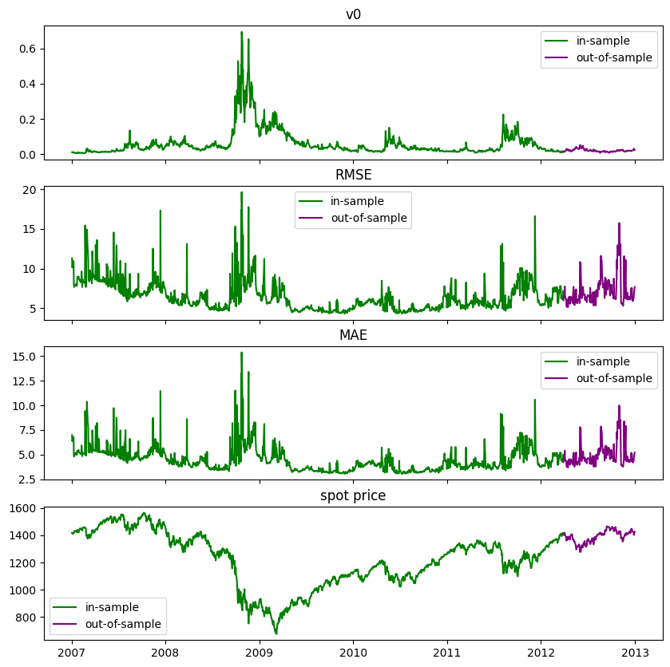
    


    
    
    Mon Aug 20 00:00:00 2012
    
    training...
    
    alpha: 0.01
    hidden_layer_sizes: (13, 13)
    learning_rate: adaptive
    learning_rate_init: 0.1
    solver: sgd
    early_stopping: False
    max_iter: 500
    warm_start: True
    tol: 0.0001
    cpu: 449.84506011009216
    
    in sample:
         RMSE: 5.315164822109582
         MAE: 3.4885084653523566
    
    out of sample:
         RMSE: 7.729498792165851
         MAE: 4.709226002750761
    
    


    
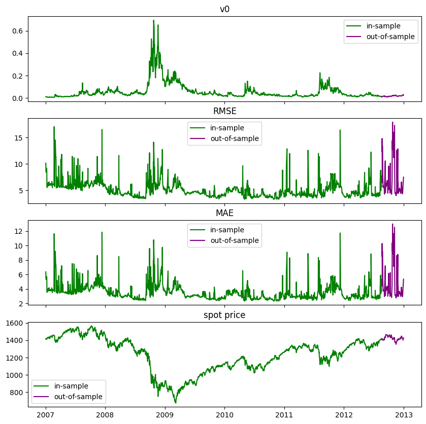
    


    
    
