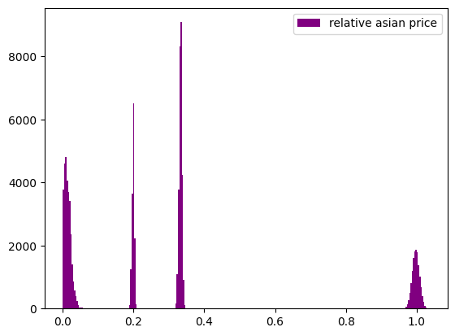
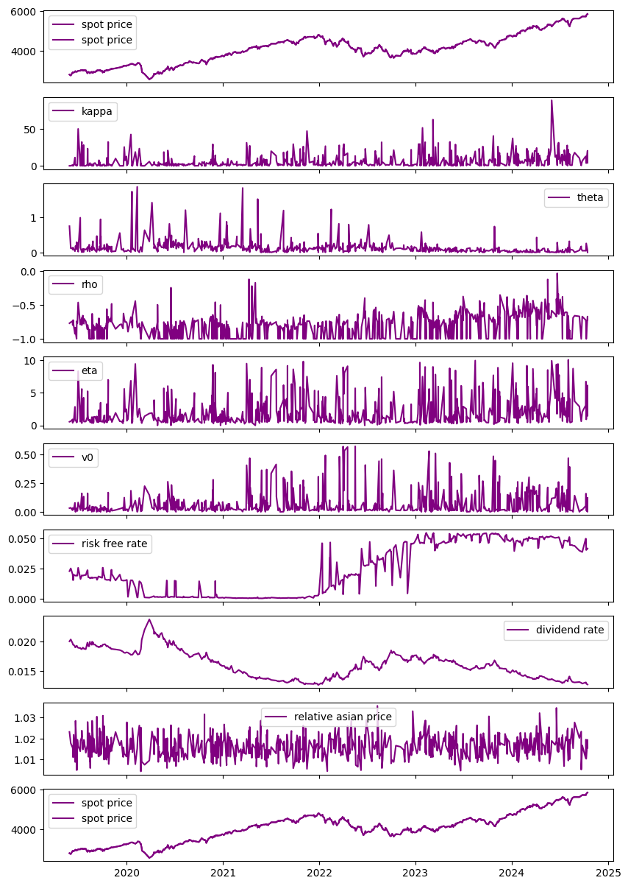
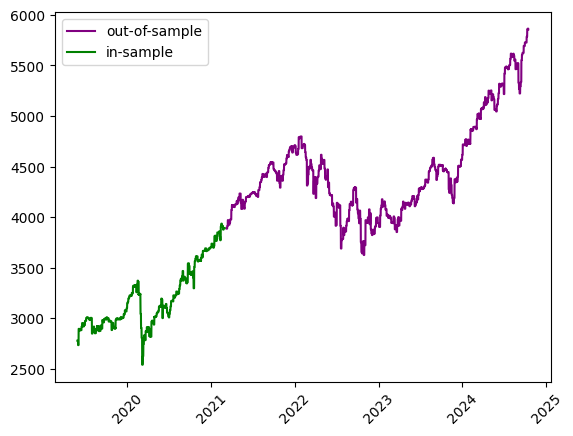
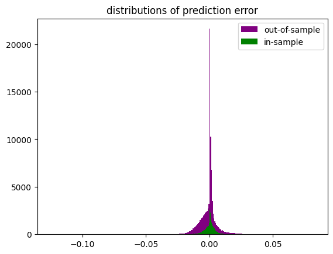

```python
import os
import time
import joblib
import numpy as np
import pandas as pd
import matplotlib.pyplot as plt
from pathlib import Path
from datetime import datetime
from model_settings import ms
from df_collector import df_collector
pd.set_option("display.max_columns",0)
pd.options.display.float_format = '{:.6f}'.format
root = Path().resolve().parent.parent
df_collector.root = root
models_dir = os.path.join(root,ms.trained_models)
train_start = time.time()
train_start_datetime = datetime.fromtimestamp(train_start)
train_start_tag = train_start_datetime.strftime('%c')
print("\n"+"#"*18+"\n# training start #\n"+
      "#"*18+"\n"+f"\n{train_start_tag}")
```

    
    ##################
    # training start #
    ##################
    
    Fri Nov  8 18:00:38 2024
    

# loading data


```python
data = df_collector.cboe_spx_asians().iloc[:,1:]
pricename = [f for f in data.columns if f.find('_price')!=-1 and f.find('spot_')==-1 and f.find('strike_')==-1][0]
relative_pricename = 'relative_'+pricename
data = data[data[pricename]<=data['spot_price']]
print(f'collected {pricename[:pricename.find('_',0)]} options')
print(data.describe())
print(data.dtypes)
print(data['calculation_date'].drop_duplicates().reset_index(drop=True))
```

    collected asian options
             spot_price  strike_price  days_to_maturity     n_fixings  fixing_frequency  past_fixings  ...         kappa         theta           rho           eta            v0   asian_price
    count 138600.000000 138600.000000     138600.000000 138600.000000     138600.000000 138600.000000  ... 138600.000000 138600.000000 138600.000000 138600.000000 138600.000000 138600.000000
    mean    4047.767532   4047.520130         48.222222      2.777778         31.111111      0.000000  ...      5.465363      0.132512     -0.803769      1.995091      0.066596    617.922400
    std      732.038102   1628.173880         32.906646      3.424687         29.718954      0.000000  ...      8.712863      0.193752      0.170211      2.174550      0.096849    818.259492
    min     2541.000000   1270.000000          7.000000      1.000000          7.000000      0.000000  ...      0.000000      0.000000     -1.000000      0.000000      0.000102      0.000000
    25%     3434.000000   2737.000000         28.000000      1.000000          7.000000      0.000000  ...      0.642032      0.037578     -0.999998      0.587554      0.013965      0.000000
    50%     4124.500000   3935.500000         28.000000      1.000000         28.000000      0.000000  ...      1.951057      0.093768     -0.791616      1.108292      0.025599     55.736627
    75%     4497.000000   5240.750000         84.000000      3.000000         28.000000      0.000000  ...      6.056915      0.151943     -0.696545      2.466983      0.076581   1121.264320
    max     5863.000000   8794.000000         84.000000     12.000000         84.000000      0.000000  ...     88.141944      1.869788     -0.032933     10.045761      0.567582   2931.600979
    
    [8 rows x 14 columns]
    spot_price          float64
    strike_price        float64
    days_to_maturity      int64
    n_fixings           float64
    fixing_frequency      int64
    past_fixings          int64
    averaging_type       object
    w                    object
    risk_free_rate      float64
    dividend_rate       float64
    calculation_date     object
    kappa               float64
    theta               float64
    rho                 float64
    eta                 float64
    v0                  float64
    date                 object
    asian_price         float64
    dtype: object
    0         2019-05-29 16:14:27.624
    180       2019-06-03 15:56:27.211
    360       2019-06-10 12:49:28.094
    540       2019-06-10 16:12:40.484
    720       2019-06-12 11:58:17.303
                       ...           
    137700    2024-10-07 15:57:53.651
    137880    2024-10-08 15:48:23.420
    138060    2024-10-09 15:33:43.664
    138240    2024-10-14 12:23:32.382
    138420    2024-10-14 15:26:27.717
    Name: calculation_date, Length: 765, dtype: object
    


```python
filetag = f'cboe spx relative {pricename[:pricename.find('_',0)]}'
```


```python
data[pricename].describe()
```


    count   138600.000000
    mean       617.922400
    std        818.259492
    min          0.000000
    25%          0.000000
    50%         55.736627
    75%       1121.264320
    max       2931.600979
    Name: asian_price, dtype: float64


# data cleaning & preparation


```python
data_strikes = data['strike_price']
data['relative_spot'] = data['spot_price']/data_strikes
data[relative_pricename] = data[pricename]/data_strikes
try:
    data['relative_barrier'] = data['barrier']/data_strikes
    data['relative_rebate'] = data['rebate']/data_strikes
except Exception:
    pass

data['calculation_date'] = pd.to_datetime(data['calculation_date'],format='mixed')
data['date'] = pd.to_datetime(data['date'],format='mixed')
data.dtypes
```


    spot_price                     float64
    strike_price                   float64
    days_to_maturity                 int64
    n_fixings                      float64
    fixing_frequency                 int64
    past_fixings                     int64
    averaging_type                  object
    w                               object
    risk_free_rate                 float64
    dividend_rate                  float64
    calculation_date        datetime64[ns]
    kappa                          float64
    theta                          float64
    rho                            float64
    eta                            float64
    v0                             float64
    date                    datetime64[ns]
    asian_price                    float64
    relative_spot                  float64
    relative_asian_price           float64
    dtype: object


```python
def noisify(x):
    return x + np.random.normal(scale=x*0.01)

relative_observed = data[relative_pricename].values
relative_observed[relative_observed>0] = noisify(relative_observed[relative_observed>0])
targetname = 'relative_observed'
data[targetname]= relative_observed
data[targetname].describe()
```


    count   138600.000000
    mean         0.189353
    std          0.299802
    min          0.000000
    25%          0.000000
    50%          0.013966
    75%          0.330040
    max          1.035671
    Name: relative_observed, dtype: float64


# visualization


```python
"""
plot
"""
rels = data[targetname]
rels = rels[rels>0.0005]
plt.figure()
plt.hist(rels,color='purple',label=relative_pricename.replace('_',' '),bins=int(np.sqrt(len(rels))))
plt.legend()
plt.show()
rels.describe()
```


    

    


    count   85871.000000
    mean        0.305616
    std         0.330972
    min         0.000500
    25%         0.018708
    50%         0.202756
    75%         0.335091
    max         1.035671
    Name: relative_observed, dtype: float64


```python
from plotters import PlotCols
col_names = ['spot_price','kappa','theta','rho','eta','v0','risk_free_rate','dividend_rate',relative_pricename,'spot_price']
index = 'calculation_date'
plot_data = data[col_names+[index]].copy().sort_values(by=relative_pricename).drop_duplicates(subset=index,keep='last').sort_values(by=index).reset_index(drop=True)
data_cols = [index] + col_names
PlotCols(
    plot_data,
    col_names=col_names,
    index=index,
    figsize=(10,15)
)
print(f"where '{relative_pricename}' is the maximum market observed relative {pricename[:pricename.find('_',0)]} option price")
pd.Series(plot_data[index])
data[relative_pricename].describe()
```

    ['spot_price', 'kappa', 'theta', 'rho', 'eta', 'v0', 'risk_free_rate', 'dividend_rate', 'relative_asian_price', 'spot_price']
    


    

    


    where 'relative_asian_price' is the maximum market observed relative asian option price
    


    count   138600.000000
    mean         0.189353
    std          0.299802
    min          0.000000
    25%          0.000000
    50%          0.013966
    75%          0.330040
    max          1.035671
    Name: relative_asian_price, dtype: float64


# training procedure

## model parameterization and initializaiton


```python
from convsklearn import convsklearn
trainer = convsklearn()
trainer.target_name = relative_pricename
trainer.excluded_features = trainer.excluded_features + ['spot_price','strike_price','barrier','rebate',relative_pricename,'relative_observed']
trainer.__dict__
```


    {'seed': 1312,
     'raw_data': Empty DataFrame
     Columns: []
     Index: [],
     'dataset': Empty DataFrame
     Columns: []
     Index: [],
     'target_name': 'relative_asian_price',
     'excluded_features': ['barrier_price',
      'asian_price',
      'observed_price',
      'outin',
      'updown',
      'n_fixings',
      'spot_price',
      'strike_price',
      'barrier',
      'rebate',
      'relative_asian_price',
      'relative_observed'],
     'numerical_features': [],
     'categorical_features': [],
     'feature_set': [],
     'n_features': 0,
     'development_dates': {},
     'test_dates': {},
     'train_data': {},
     'test_data': {},
     'train_X': {},
     'train_y': {},
     'test_X': {},
     'test_y': {},
     'preprocessor': None,
     'pipeline': None,
     'model': None,
     'model_fit': None,
     'dnn_runtime': 0,
     'numerical_scaler': StandardScaler()}


```python
trainer.load_data(data)
print('features:')
for f in trainer.feature_set:
    print(f"   {f}")
print(f"\ntarget:\n   {trainer.target_name}")
```

    features:
       days_to_maturity
       fixing_frequency
       past_fixings
       risk_free_rate
       dividend_rate
       kappa
       theta
       rho
       eta
       v0
       relative_spot
       averaging_type
       w
    
    target:
       relative_asian_price
    


```python
dates = data['date'].drop_duplicates()
```

## prepocessing


```python
development_dates = dates[:len(dates)//3]
test_dates = dates[~dates.isin(development_dates)]
trainer.preprocess_data(development_dates,test_dates)
```


    

    


## training


```python
trainer.run_dnn()
```

    
    training on 45900 samples...
    
    alpha: 0.01
    hidden_layer_sizes: (13, 13)
    learning_rate: adaptive
    learning_rate_init: 0.1
    solver: sgd
    early_stopping: False
    max_iter: 500
    warm_start: True
    tol: 0.0001
    random_state: 1312
    cpu: 6.743483066558838
    


```python
print('instance variables:')

for key, value in trainer.__dict__.items():
    print(f"{key}:\n  {value}\n")
```

    instance variables:
    seed:
      1312
    
    raw_data:
              spot_price  strike_price  days_to_maturity  n_fixings  fixing_frequency  past_fixings averaging_type  ...      eta       v0       date asian_price  relative_spot  relative_asian_price  relative_observed
    0      2779.000000   1389.000000                 7   1.000000                 7             0      geometric  ... 0.551406 0.032300 2019-05-29 1389.385913       2.000720              0.985930           0.985930
    1      2779.000000   1389.000000                 7   1.000000                 7             0      geometric  ... 0.551406 0.032300 2019-05-29    0.000000       2.000720              0.000000           0.000000
    2      2779.000000   1389.000000                 7   1.000000                 7             0     arithmetic  ... 0.551406 0.032300 2019-05-29 1389.526151       2.000720              1.023165           1.023165
    3      2779.000000   1389.000000                 7   1.000000                 7             0     arithmetic  ... 0.551406 0.032300 2019-05-29    0.000000       2.000720              0.000000           0.000000
    4      2779.000000   2083.750000                 7   1.000000                 7             0      geometric  ... 0.551406 0.032300 2019-05-29  694.942324       1.333653              0.336503           0.336503
    ...            ...           ...               ...        ...               ...           ...            ...  ...      ...      ...        ...         ...            ...                   ...                ...
    138595 5857.000000   7320.750000                84   1.000000                84             0     arithmetic  ... 1.487001 0.121595 2024-10-14 1429.795085       0.800055              0.192800           0.192800
    138596 5857.000000   8785.000000                84   1.000000                84             0      geometric  ... 1.487001 0.121595 2024-10-14    0.000000       0.666705              0.000000           0.000000
    138597 5857.000000   8785.000000                84   1.000000                84             0      geometric  ... 1.487001 0.121595 2024-10-14 2887.934074       0.666705              0.329197           0.329197
    138598 5857.000000   8785.000000                84   1.000000                84             0     arithmetic  ... 1.487001 0.121595 2024-10-14    0.000000       0.666705              0.000000           0.000000
    138599 5857.000000   8785.000000                84   1.000000                84             0     arithmetic  ... 1.487001 0.121595 2024-10-14 2879.992268       0.666705              0.332692           0.332692
    
    [138600 rows x 21 columns]
    
    dataset:
              spot_price  strike_price  days_to_maturity  n_fixings  fixing_frequency  past_fixings averaging_type  ...      eta       v0       date asian_price  relative_spot  relative_asian_price  relative_observed
    0      2779.000000   1389.000000                 7   1.000000                 7             0      geometric  ... 0.551406 0.032300 2019-05-29 1389.385913       2.000720              0.985930           0.985930
    1      2779.000000   1389.000000                 7   1.000000                 7             0      geometric  ... 0.551406 0.032300 2019-05-29    0.000000       2.000720              0.000000           0.000000
    2      2779.000000   1389.000000                 7   1.000000                 7             0     arithmetic  ... 0.551406 0.032300 2019-05-29 1389.526151       2.000720              1.023165           1.023165
    3      2779.000000   1389.000000                 7   1.000000                 7             0     arithmetic  ... 0.551406 0.032300 2019-05-29    0.000000       2.000720              0.000000           0.000000
    4      2779.000000   2083.750000                 7   1.000000                 7             0      geometric  ... 0.551406 0.032300 2019-05-29  694.942324       1.333653              0.336503           0.336503
    ...            ...           ...               ...        ...               ...           ...            ...  ...      ...      ...        ...         ...            ...                   ...                ...
    138595 5857.000000   7320.750000                84   1.000000                84             0     arithmetic  ... 1.487001 0.121595 2024-10-14 1429.795085       0.800055              0.192800           0.192800
    138596 5857.000000   8785.000000                84   1.000000                84             0      geometric  ... 1.487001 0.121595 2024-10-14    0.000000       0.666705              0.000000           0.000000
    138597 5857.000000   8785.000000                84   1.000000                84             0      geometric  ... 1.487001 0.121595 2024-10-14 2887.934074       0.666705              0.329197           0.329197
    138598 5857.000000   8785.000000                84   1.000000                84             0     arithmetic  ... 1.487001 0.121595 2024-10-14    0.000000       0.666705              0.000000           0.000000
    138599 5857.000000   8785.000000                84   1.000000                84             0     arithmetic  ... 1.487001 0.121595 2024-10-14 2879.992268       0.666705              0.332692           0.332692
    
    [138600 rows x 21 columns]
    
    target_name:
      relative_asian_price
    
    excluded_features:
      ['barrier_price', 'asian_price', 'observed_price', 'outin', 'updown', 'n_fixings', 'spot_price', 'strike_price', 'barrier', 'rebate', 'relative_asian_price', 'relative_observed']
    
    numerical_features:
      ['days_to_maturity', 'fixing_frequency', 'past_fixings', 'risk_free_rate', 'dividend_rate', 'kappa', 'theta', 'rho', 'eta', 'v0', 'relative_spot']
    
    categorical_features:
      ['averaging_type', 'w']
    
    feature_set:
      ['days_to_maturity', 'fixing_frequency', 'past_fixings', 'risk_free_rate', 'dividend_rate', 'kappa', 'theta', 'rho', 'eta', 'v0', 'relative_spot', 'averaging_type', 'w']
    
    n_features:
      13
    
    development_dates:
      0       2019-05-29
    180     2019-06-03
    360     2019-06-10
    720     2019-06-12
    1080    2019-06-14
               ...    
    44820   2021-02-16
    45000   2021-02-18
    45180   2021-02-19
    45360   2021-02-22
    45720   2021-03-01
    Name: date, Length: 191, dtype: datetime64[ns]
    
    test_dates:
      45900    2021-03-09
    46080    2021-03-10
    46260    2021-03-16
    46440    2021-03-17
    46620    2021-03-19
                ...    
    137520   2024-09-24
    137700   2024-10-07
    137880   2024-10-08
    138060   2024-10-09
    138240   2024-10-14
    Name: date, Length: 384, dtype: datetime64[ns]
    
    train_data:
             spot_price  strike_price  days_to_maturity  n_fixings  fixing_frequency  past_fixings averaging_type  ...      eta       v0       date asian_price  relative_spot  relative_asian_price  relative_observed
    0     2779.000000   1389.000000                 7   1.000000                 7             0      geometric  ... 0.551406 0.032300 2019-05-29 1389.385913       2.000720              0.985930           0.985930
    115   2779.000000   3473.250000                84   1.000000                84             0     arithmetic  ... 0.551406 0.032300 2019-05-29  689.666977       0.800115              0.198823           0.198823
    116   2779.000000   4168.000000                84   1.000000                84             0      geometric  ... 0.551406 0.032300 2019-05-29    0.000000       0.666747              0.000000           0.000000
    117   2779.000000   4168.000000                84   1.000000                84             0      geometric  ... 0.551406 0.032300 2019-05-29 1382.512064       0.666747              0.329459           0.329459
    118   2779.000000   4168.000000                84   1.000000                84             0     arithmetic  ... 0.551406 0.032300 2019-05-29    0.000000       0.666747              0.000000           0.000000
    ...           ...           ...               ...        ...               ...           ...            ...  ...      ...      ...        ...         ...            ...                   ...                ...
    45781 3893.000000   1946.000000                84  12.000000                 7             0      geometric  ... 0.959426 0.021816 2021-03-01    0.000000       2.000514              0.000000           0.000000
    45782 3893.000000   1946.000000                84  12.000000                 7             0     arithmetic  ... 0.959426 0.021816 2021-03-01 1939.143436       2.000514              1.013264           1.013264
    45783 3893.000000   1946.000000                84  12.000000                 7             0     arithmetic  ... 0.959426 0.021816 2021-03-01    0.000000       2.000514              0.000000           0.000000
    45785 3893.000000   2919.250000                84  12.000000                 7             0      geometric  ... 0.959426 0.021816 2021-03-01    0.618147       1.333562              0.000212           0.000212
    45899 3893.000000   5839.000000                84   1.000000                84             0     arithmetic  ... 0.959426 0.021816 2021-03-01 1952.089276       0.666724              0.329308           0.329308
    
    [45900 rows x 21 columns]
    
    test_data:
              spot_price  strike_price  days_to_maturity  n_fixings  fixing_frequency  past_fixings averaging_type  ...      eta       v0       date asian_price  relative_spot  relative_asian_price  relative_observed
    45900  3887.000000   1943.000000                 7   1.000000                 7             0      geometric  ... 0.588086 0.020935 2021-03-09 1943.135955       2.000515              0.990779           0.990779
    46015  3887.000000   4858.250000                84   1.000000                84             0     arithmetic  ... 0.588086 0.020935 2021-03-09  977.470036       0.800082              0.202640           0.202640
    46016  3887.000000   5830.000000                84   1.000000                84             0      geometric  ... 0.588086 0.020935 2021-03-09    0.000000       0.666724              0.000000           0.000000
    46017  3887.000000   5830.000000                84   1.000000                84             0      geometric  ... 0.588086 0.020935 2021-03-09 1951.704500       0.666724              0.344022           0.344022
    46018  3887.000000   5830.000000                84   1.000000                84             0     arithmetic  ... 0.588086 0.020935 2021-03-09    0.000000       0.666724              0.000000           0.000000
    ...            ...           ...               ...        ...               ...           ...            ...  ...      ...      ...        ...         ...            ...                   ...                ...
    138354 5863.000000   7328.250000                84   1.000000                84             0     arithmetic  ... 6.124247 0.000915 2024-10-14    0.031726       0.800055              0.000004           0.000004
    138353 5863.000000   7328.250000                84   1.000000                84             0      geometric  ... 6.124247 0.000915 2024-10-14 1437.338195       0.800055              0.194756           0.194756
    138352 5863.000000   7328.250000                84   1.000000                84             0      geometric  ... 6.124247 0.000915 2024-10-14    0.023693       0.800055              0.000003           0.000003
    138350 5863.000000   5862.500000                84   1.000000                84             0     arithmetic  ... 6.124247 0.000915 2024-10-14   92.102529       1.000085              0.015750           0.015750
    138599 5857.000000   8785.000000                84   1.000000                84             0     arithmetic  ... 1.487001 0.121595 2024-10-14 2879.992268       0.666705              0.332692           0.332692
    
    [92700 rows x 21 columns]
    
    train_X:
             days_to_maturity  fixing_frequency  past_fixings  risk_free_rate  dividend_rate    kappa    theta       rho      eta       v0  relative_spot averaging_type     w
    0                     7                 7             0        0.023002       0.020042 0.026236 0.747621 -0.769944 0.551406 0.032300       2.000720      geometric  call
    115                  84                84             0        0.023002       0.020042 0.026236 0.747621 -0.769944 0.551406 0.032300       0.800115     arithmetic   put
    116                  84                84             0        0.023002       0.020042 0.026236 0.747621 -0.769944 0.551406 0.032300       0.666747      geometric  call
    117                  84                84             0        0.023002       0.020042 0.026236 0.747621 -0.769944 0.551406 0.032300       0.666747      geometric   put
    118                  84                84             0        0.023002       0.020042 0.026236 0.747621 -0.769944 0.551406 0.032300       0.666747     arithmetic  call
    ...                 ...               ...           ...             ...            ...      ...      ...       ...      ...      ...            ...            ...   ...
    45781                84                 7             0        0.000659       0.015162 1.578501 0.190519 -0.999995 0.959426 0.021816       2.000514      geometric   put
    45782                84                 7             0        0.000659       0.015162 1.578501 0.190519 -0.999995 0.959426 0.021816       2.000514     arithmetic  call
    45783                84                 7             0        0.000659       0.015162 1.578501 0.190519 -0.999995 0.959426 0.021816       2.000514     arithmetic   put
    45785                84                 7             0        0.000659       0.015162 1.578501 0.190519 -0.999995 0.959426 0.021816       1.333562      geometric   put
    45899                84                84             0        0.000659       0.015162 1.578501 0.190519 -0.999995 0.959426 0.021816       0.666724     arithmetic   put
    
    [45900 rows x 13 columns]
    
    train_y:
      0       0.985930
    115     0.198823
    116     0.000000
    117     0.329459
    118     0.000000
              ...   
    45781   0.000000
    45782   1.013264
    45783   0.000000
    45785   0.000212
    45899   0.329308
    Name: relative_asian_price, Length: 45900, dtype: float64
    
    test_X:
              days_to_maturity  fixing_frequency  past_fixings  risk_free_rate  dividend_rate     kappa    theta       rho      eta       v0  relative_spot averaging_type     w
    45900                  7                 7             0        0.000609       0.014924  1.385229 0.126486 -0.999995 0.588086 0.020935       2.000515      geometric  call
    46015                 84                84             0        0.000609       0.014924  1.385229 0.126486 -0.999995 0.588086 0.020935       0.800082     arithmetic   put
    46016                 84                84             0        0.000609       0.014924  1.385229 0.126486 -0.999995 0.588086 0.020935       0.666724      geometric  call
    46017                 84                84             0        0.000609       0.014924  1.385229 0.126486 -0.999995 0.588086 0.020935       0.666724      geometric   put
    46018                 84                84             0        0.000609       0.014924  1.385229 0.126486 -0.999995 0.588086 0.020935       0.666724     arithmetic  call
    ...                  ...               ...           ...             ...            ...       ...      ...       ...      ...      ...            ...            ...   ...
    138354                84                84             0        0.041813       0.012687 20.301854 0.055108 -0.670089 6.124247 0.000915       0.800055     arithmetic  call
    138353                84                84             0        0.041813       0.012687 20.301854 0.055108 -0.670089 6.124247 0.000915       0.800055      geometric   put
    138352                84                84             0        0.041813       0.012687 20.301854 0.055108 -0.670089 6.124247 0.000915       0.800055      geometric  call
    138350                84                84             0        0.041813       0.012687 20.301854 0.055108 -0.670089 6.124247 0.000915       1.000085     arithmetic  call
    138599                84                84             0        0.041813       0.012687  4.067045 0.000000 -0.717809 1.487001 0.121595       0.666705     arithmetic   put
    
    [92700 rows x 13 columns]
    
    test_y:
      45900    0.990779
    46015    0.202640
    46016    0.000000
    46017    0.344022
    46018    0.000000
               ...   
    138354   0.000004
    138353   0.194756
    138352   0.000003
    138350   0.015750
    138599   0.332692
    Name: relative_asian_price, Length: 92700, dtype: float64
    
    preprocessor:
      ColumnTransformer(transformers=[('StandardScaler', StandardScaler(),
                                     ['days_to_maturity', 'fixing_frequency',
                                      'past_fixings', 'risk_free_rate',
                                      'dividend_rate', 'kappa', 'theta', 'rho',
                                      'eta', 'v0', 'relative_spot']),
                                    ('OneHotEncoder',
                                     OneHotEncoder(sparse_output=False),
                                     ['averaging_type', 'w'])])
    
    pipeline:
      None
    
    model:
      TransformedTargetRegressor(regressor=Pipeline(steps=[('preprocessor',
                                                          ColumnTransformer(transformers=[('StandardScaler',
                                                                                           StandardScaler(),
                                                                                           ['days_to_maturity',
                                                                                            'fixing_frequency',
                                                                                            'past_fixings',
                                                                                            'risk_free_rate',
                                                                                            'dividend_rate',
                                                                                            'kappa',
                                                                                            'theta',
                                                                                            'rho',
                                                                                            'eta',
                                                                                            'v0',
                                                                                            'relative_spot']),
                                                                                          ('OneHotEncoder',
                                                                                           OneHotEncoder(sparse_output=False),
                                                                                           ['averaging_type',
                                                                                            'w'])])),
                                                         ('regressor',
                                                          MLPRegressor(alpha=0.01,
                                                                       hidden_layer_sizes=(13,
                                                                                           13),
                                                                       learning_rate='adaptive',
                                                                       learning_rate_init=0.1,
                                                                       max_iter=500,
                                                                       random_state=1312,
                                                                       solver='sgd',
                                                                       warm_start=True))]),
                               transformer=StandardScaler())
    
    model_fit:
      TransformedTargetRegressor(regressor=Pipeline(steps=[('preprocessor',
                                                          ColumnTransformer(transformers=[('StandardScaler',
                                                                                           StandardScaler(),
                                                                                           ['days_to_maturity',
                                                                                            'fixing_frequency',
                                                                                            'past_fixings',
                                                                                            'risk_free_rate',
                                                                                            'dividend_rate',
                                                                                            'kappa',
                                                                                            'theta',
                                                                                            'rho',
                                                                                            'eta',
                                                                                            'v0',
                                                                                            'relative_spot']),
                                                                                          ('OneHotEncoder',
                                                                                           OneHotEncoder(sparse_output=False),
                                                                                           ['averaging_type',
                                                                                            'w'])])),
                                                         ('regressor',
                                                          MLPRegressor(alpha=0.01,
                                                                       hidden_layer_sizes=(13,
                                                                                           13),
                                                                       learning_rate='adaptive',
                                                                       learning_rate_init=0.1,
                                                                       max_iter=500,
                                                                       random_state=1312,
                                                                       solver='sgd',
                                                                       warm_start=True))]),
                               transformer=StandardScaler())
    
    dnn_runtime:
      6.743483066558838
    
    numerical_scaler:
      StandardScaler()
    
    dnn_params:
      {'alpha': 0.01, 'hidden_layer_sizes': (13, 13), 'learning_rate': 'adaptive', 'learning_rate_init': 0.1, 'solver': 'sgd', 'early_stopping': False, 'max_iter': 500, 'warm_start': True, 'tol': 0.0001, 'random_state': 1312}
    
    transformers:
      [('StandardScaler', StandardScaler(), ['days_to_maturity', 'fixing_frequency', 'past_fixings', 'risk_free_rate', 'dividend_rate', 'kappa', 'theta', 'rho', 'eta', 'v0', 'relative_spot']), ('OneHotEncoder', OneHotEncoder(sparse_output=False), ['averaging_type', 'w'])]
    
    regressor:
      MLPRegressor(alpha=0.01, hidden_layer_sizes=(13, 13), learning_rate='adaptive',
                 learning_rate_init=0.1, max_iter=500, random_state=1312,
                 solver='sgd', warm_start=True)
    
    dnn_pipeline:
      Pipeline(steps=[('preprocessor',
                     ColumnTransformer(transformers=[('StandardScaler',
                                                      StandardScaler(),
                                                      ['days_to_maturity',
                                                       'fixing_frequency',
                                                       'past_fixings',
                                                       'risk_free_rate',
                                                       'dividend_rate', 'kappa',
                                                       'theta', 'rho', 'eta', 'v0',
                                                       'relative_spot']),
                                                     ('OneHotEncoder',
                                                      OneHotEncoder(sparse_output=False),
                                                      ['averaging_type', 'w'])])),
                    ('regressor',
                     MLPRegressor(alpha=0.01, hidden_layer_sizes=(13, 13),
                                  learning_rate='adaptive', learning_rate_init=0.1,
                                  max_iter=500, random_state=1312, solver='sgd',
                                  warm_start=True))])
    
    

## testing


```python
train_test = trainer.test_prediction_accuracy()
```

    
    in sample:
         RMSE: 0.004374238562425504
         MAE: 0.002563333209347563
    
    out of sample:
         RMSE: 0.007843213955470999
         MAE: 0.004383311882598984
    


```python
oserr = trainer.test_data['outofsample_error']
iserr = trainer.train_data['insample_error']
```


```python
plt.figure()
plt.hist(oserr,color='purple',label='out-of-sample',bins=int(np.sqrt(len(oserr))))
plt.hist(iserr,color='green',label='in-sample',bins=int(np.sqrt(len(iserr))))
plt.legend()
plt.title('distributions of prediction error')
plt.show()
```


    

    


## saving


```python

train_end_tag = ms.timetag()
file_tag = str(train_end_tag + " " + filetag)
files_dir = os.path.join(models_dir,file_tag)

def save_model():
    if Path(files_dir).exists():
        pass
    else:
        os.mkdir(files_dir)
    file_dir = os.path.join(files_dir,file_tag)
    joblib.dump(trainer.__dict__,str(f"{file_dir}.pkl"))
    pd.set_option("display.max_columns",None)
    print(f"model saved to {file_dir}")

print(f"execute the command 'save_model()' to save the following model: {file_tag}")
train_end = time.time()
train_runtime = train_end-train_start
print(f"\ncpu: {train_runtime}")
print(train_end_tag)
```

    execute the command 'save_model()' to save the following model: 2024-11-08 180048237415 cboe spx relative asian
    
    cpu: 10.034063816070557
    2024-11-08 180048237415
    
