```python
import os
import joblib
import pandas as pd
import numpy as np
import matplotlib.pyplot as plt
from pathlib import Path
```

# functions


```python
def compute_RMSE(diff):
    if len(diff)>0:
        return np.sqrt(np.mean(diff.values**2))
        
def compute_MAE(diff):
    if len(diff)>0:
        return np.mean(np.abs(diff.values))

def plot_errors(train_data,test_data):
    test_diff = test_data['outofsample_error']
    train_diff = train_data['insample_error']
    
    test_plot = test_data[['date','spot_price','rho','v0']].copy()
    test_plot = test_plot.reset_index().set_index('date')
    test_plot['MAE'] = test_diff.resample('D').apply(compute_RMSE)
    test_plot['RMSE'] = test_diff.resample('D').apply(compute_RMSE)
    test_plot = test_plot.reset_index()
    test_plot = test_plot.drop_duplicates(subset=['date'],keep='last').set_index('date').drop(columns='calculation_date')
    
    train_plot = train_data[['date','spot_price','rho','v0']].copy()
    train_plot = train_plot.reset_index().set_index('date')
    train_plot['MAE'] = train_diff.resample('D').apply(compute_RMSE)
    train_plot['RMSE'] = train_diff.resample('D').apply(compute_RMSE)
    train_plot = train_plot.reset_index()
    train_plot = train_plot.drop_duplicates(subset=['date'],keep='last').set_index('date').drop(columns='calculation_date')

    
    trainx = pd.date_range(start=min(train_data.index),end=max(train_data.index),periods=train_plot.shape[0])
    testx = pd.date_range(start=min(test_data.index),end=max(test_data.index),periods=test_plot.shape[0])

    train_plot.index = trainx
    test_plot.index = testx
    
    
    fig,axs = plt.subplots(max(len(train_plot.columns),len(test_plot.columns)),figsize=(10,10),sharex=True)
    for i,col in enumerate(train_plot.columns):
        axs[i].plot(train_plot[col],color='green',label='in-sample')
        axs[i].set_title(col.replace('_',' '))
        axs[i].legend()
    for i,col in enumerate(test_plot.columns):
        axs[i].plot(test_plot[col],color='purple',label='out-of-sample')
        axs[i].set_title(col.replace('_',' '))
        axs[i].legend()
    plt.show()
```

# loading model


```python
from model_settings import ms
root = Path().resolve().parent.parent
models_dir = os.path.join(root,ms.trained_models)
models = pd.Series([f for f in os.listdir(models_dir) if f.find('.')==-1])
for i,m in enumerate(models):
    print(f"{i}     {m}")
```

    0     2024-11-08 180048237415 cboe spx relative asian
    1     2024-11-08 180746925336 cboe spx relative barrier
    2     2024_11_01 204910611379 bloomberg barriers
    3     2024_11_01 205356527985 bloomberg asians
    4     2024_11_05 184958719691 Oosterlee test
    


```python
selected_model = models.iloc[0]
model_dir = os.path.join(models_dir,selected_model)
pickle = [f for f in os.listdir(model_dir) if f.endswith('.pkl')][0]
picke_dir = os.path.join(model_dir,pickle)
model = joblib.load(picke_dir)
model
```


    {'seed': 1312,
     'raw_data':         spot_price  strike_price  days_to_maturity  n_fixings  \
     0           2779.0       1389.00                 7        1.0   
     1           2779.0       1389.00                 7        1.0   
     2           2779.0       1389.00                 7        1.0   
     3           2779.0       1389.00                 7        1.0   
     4           2779.0       2083.75                 7        1.0   
     ...            ...           ...               ...        ...   
     138595      5857.0       7320.75                84        1.0   
     138596      5857.0       8785.00                84        1.0   
     138597      5857.0       8785.00                84        1.0   
     138598      5857.0       8785.00                84        1.0   
     138599      5857.0       8785.00                84        1.0   
     
             fixing_frequency  past_fixings averaging_type     w  risk_free_rate  \
     0                      7             0      geometric  call        0.023002   
     1                      7             0      geometric   put        0.023002   
     2                      7             0     arithmetic  call        0.023002   
     3                      7             0     arithmetic   put        0.023002   
     4                      7             0      geometric  call        0.023002   
     ...                  ...           ...            ...   ...             ...   
     138595                84             0     arithmetic   put        0.041813   
     138596                84             0      geometric  call        0.041813   
     138597                84             0      geometric   put        0.041813   
     138598                84             0     arithmetic  call        0.041813   
     138599                84             0     arithmetic   put        0.041813   
     
             dividend_rate  ...     kappa         theta       rho       eta  \
     0            0.020042  ...  0.026236  7.476210e-01 -0.769944  0.551406   
     1            0.020042  ...  0.026236  7.476210e-01 -0.769944  0.551406   
     2            0.020042  ...  0.026236  7.476210e-01 -0.769944  0.551406   
     3            0.020042  ...  0.026236  7.476210e-01 -0.769944  0.551406   
     4            0.020042  ...  0.026236  7.476210e-01 -0.769944  0.551406   
     ...               ...  ...       ...           ...       ...       ...   
     138595       0.012687  ...  4.067045  2.286232e-09 -0.717809  1.487001   
     138596       0.012687  ...  4.067045  2.286232e-09 -0.717809  1.487001   
     138597       0.012687  ...  4.067045  2.286232e-09 -0.717809  1.487001   
     138598       0.012687  ...  4.067045  2.286232e-09 -0.717809  1.487001   
     138599       0.012687  ...  4.067045  2.286232e-09 -0.717809  1.487001   
     
                   v0       date  asian_price  relative_spot  relative_asian_price  \
     0       0.032300 2019-05-29  1389.385913       2.000720              0.985930   
     1       0.032300 2019-05-29     0.000000       2.000720              0.000000   
     2       0.032300 2019-05-29  1389.526151       2.000720              1.023165   
     3       0.032300 2019-05-29     0.000000       2.000720              0.000000   
     4       0.032300 2019-05-29   694.942324       1.333653              0.336503   
     ...          ...        ...          ...            ...                   ...   
     138595  0.121595 2024-10-14  1429.795085       0.800055              0.192800   
     138596  0.121595 2024-10-14     0.000000       0.666705              0.000000   
     138597  0.121595 2024-10-14  2887.934074       0.666705              0.329197   
     138598  0.121595 2024-10-14     0.000000       0.666705              0.000000   
     138599  0.121595 2024-10-14  2879.992268       0.666705              0.332692   
     
             relative_observed  
     0                0.985930  
     1                0.000000  
     2                1.023165  
     3                0.000000  
     4                0.336503  
     ...                   ...  
     138595           0.192800  
     138596           0.000000  
     138597           0.329197  
     138598           0.000000  
     138599           0.332692  
     
     [138600 rows x 21 columns],
     'dataset':         spot_price  strike_price  days_to_maturity  n_fixings  \
     0           2779.0       1389.00                 7        1.0   
     1           2779.0       1389.00                 7        1.0   
     2           2779.0       1389.00                 7        1.0   
     3           2779.0       1389.00                 7        1.0   
     4           2779.0       2083.75                 7        1.0   
     ...            ...           ...               ...        ...   
     138595      5857.0       7320.75                84        1.0   
     138596      5857.0       8785.00                84        1.0   
     138597      5857.0       8785.00                84        1.0   
     138598      5857.0       8785.00                84        1.0   
     138599      5857.0       8785.00                84        1.0   
     
             fixing_frequency  past_fixings averaging_type     w  risk_free_rate  \
     0                      7             0      geometric  call        0.023002   
     1                      7             0      geometric   put        0.023002   
     2                      7             0     arithmetic  call        0.023002   
     3                      7             0     arithmetic   put        0.023002   
     4                      7             0      geometric  call        0.023002   
     ...                  ...           ...            ...   ...             ...   
     138595                84             0     arithmetic   put        0.041813   
     138596                84             0      geometric  call        0.041813   
     138597                84             0      geometric   put        0.041813   
     138598                84             0     arithmetic  call        0.041813   
     138599                84             0     arithmetic   put        0.041813   
     
             dividend_rate  ...     kappa         theta       rho       eta  \
     0            0.020042  ...  0.026236  7.476210e-01 -0.769944  0.551406   
     1            0.020042  ...  0.026236  7.476210e-01 -0.769944  0.551406   
     2            0.020042  ...  0.026236  7.476210e-01 -0.769944  0.551406   
     3            0.020042  ...  0.026236  7.476210e-01 -0.769944  0.551406   
     4            0.020042  ...  0.026236  7.476210e-01 -0.769944  0.551406   
     ...               ...  ...       ...           ...       ...       ...   
     138595       0.012687  ...  4.067045  2.286232e-09 -0.717809  1.487001   
     138596       0.012687  ...  4.067045  2.286232e-09 -0.717809  1.487001   
     138597       0.012687  ...  4.067045  2.286232e-09 -0.717809  1.487001   
     138598       0.012687  ...  4.067045  2.286232e-09 -0.717809  1.487001   
     138599       0.012687  ...  4.067045  2.286232e-09 -0.717809  1.487001   
     
                   v0       date  asian_price  relative_spot  relative_asian_price  \
     0       0.032300 2019-05-29  1389.385913       2.000720              0.985930   
     1       0.032300 2019-05-29     0.000000       2.000720              0.000000   
     2       0.032300 2019-05-29  1389.526151       2.000720              1.023165   
     3       0.032300 2019-05-29     0.000000       2.000720              0.000000   
     4       0.032300 2019-05-29   694.942324       1.333653              0.336503   
     ...          ...        ...          ...            ...                   ...   
     138595  0.121595 2024-10-14  1429.795085       0.800055              0.192800   
     138596  0.121595 2024-10-14     0.000000       0.666705              0.000000   
     138597  0.121595 2024-10-14  2887.934074       0.666705              0.329197   
     138598  0.121595 2024-10-14     0.000000       0.666705              0.000000   
     138599  0.121595 2024-10-14  2879.992268       0.666705              0.332692   
     
             relative_observed  
     0                0.985930  
     1                0.000000  
     2                1.023165  
     3                0.000000  
     4                0.336503  
     ...                   ...  
     138595           0.192800  
     138596           0.000000  
     138597           0.329197  
     138598           0.000000  
     138599           0.332692  
     
     [138600 rows x 21 columns],
     'target_name': 'relative_asian_price',
     'excluded_features': ['barrier_price',
      'asian_price',
      'observed_price',
      'outin',
      'updown',
      'n_fixings',
      'spot_price',
      'strike_price',
      'barrier',
      'rebate',
      'relative_asian_price',
      'relative_observed'],
     'numerical_features': ['days_to_maturity',
      'fixing_frequency',
      'past_fixings',
      'risk_free_rate',
      'dividend_rate',
      'kappa',
      'theta',
      'rho',
      'eta',
      'v0',
      'relative_spot'],
     'categorical_features': ['averaging_type', 'w'],
     'feature_set': ['days_to_maturity',
      'fixing_frequency',
      'past_fixings',
      'risk_free_rate',
      'dividend_rate',
      'kappa',
      'theta',
      'rho',
      'eta',
      'v0',
      'relative_spot',
      'averaging_type',
      'w'],
     'n_features': 13,
     'development_dates': 0       2019-05-29
     180     2019-06-03
     360     2019-06-10
     720     2019-06-12
     1080    2019-06-14
                ...    
     44820   2021-02-16
     45000   2021-02-18
     45180   2021-02-19
     45360   2021-02-22
     45720   2021-03-01
     Name: date, Length: 191, dtype: datetime64[ns],
     'test_dates': 45900    2021-03-09
     46080    2021-03-10
     46260    2021-03-16
     46440    2021-03-17
     46620    2021-03-19
                 ...    
     137520   2024-09-24
     137700   2024-10-07
     137880   2024-10-08
     138060   2024-10-09
     138240   2024-10-14
     Name: date, Length: 384, dtype: datetime64[ns],
     'train_data':        spot_price  strike_price  days_to_maturity  n_fixings  \
     0          2779.0       1389.00                 7        1.0   
     115        2779.0       3473.25                84        1.0   
     116        2779.0       4168.00                84        1.0   
     117        2779.0       4168.00                84        1.0   
     118        2779.0       4168.00                84        1.0   
     ...           ...           ...               ...        ...   
     45781      3893.0       1946.00                84       12.0   
     45782      3893.0       1946.00                84       12.0   
     45783      3893.0       1946.00                84       12.0   
     45785      3893.0       2919.25                84       12.0   
     45899      3893.0       5839.00                84        1.0   
     
            fixing_frequency  past_fixings averaging_type     w  risk_free_rate  \
     0                     7             0      geometric  call        0.023002   
     115                  84             0     arithmetic   put        0.023002   
     116                  84             0      geometric  call        0.023002   
     117                  84             0      geometric   put        0.023002   
     118                  84             0     arithmetic  call        0.023002   
     ...                 ...           ...            ...   ...             ...   
     45781                 7             0      geometric   put        0.000659   
     45782                 7             0     arithmetic  call        0.000659   
     45783                 7             0     arithmetic   put        0.000659   
     45785                 7             0      geometric   put        0.000659   
     45899                84             0     arithmetic   put        0.000659   
     
            dividend_rate  ...       eta        v0       date  asian_price  \
     0           0.020042  ...  0.551406  0.032300 2019-05-29  1389.385913   
     115         0.020042  ...  0.551406  0.032300 2019-05-29   689.666977   
     116         0.020042  ...  0.551406  0.032300 2019-05-29     0.000000   
     117         0.020042  ...  0.551406  0.032300 2019-05-29  1382.512064   
     118         0.020042  ...  0.551406  0.032300 2019-05-29     0.000000   
     ...              ...  ...       ...       ...        ...          ...   
     45781       0.015162  ...  0.959426  0.021816 2021-03-01     0.000000   
     45782       0.015162  ...  0.959426  0.021816 2021-03-01  1939.143436   
     45783       0.015162  ...  0.959426  0.021816 2021-03-01     0.000000   
     45785       0.015162  ...  0.959426  0.021816 2021-03-01     0.618147   
     45899       0.015162  ...  0.959426  0.021816 2021-03-01  1952.089276   
     
            relative_spot  relative_asian_price relative_observed  insample_target  \
     0           2.000720              0.985930          0.985930         0.985930   
     115         0.800115              0.198823          0.198823         0.198823   
     116         0.666747              0.000000          0.000000         0.000000   
     117         0.666747              0.329459          0.329459         0.329459   
     118         0.666747              0.000000          0.000000         0.000000   
     ...              ...                   ...               ...              ...   
     45781       2.000514              0.000000          0.000000         0.000000   
     45782       2.000514              1.013264          1.013264         1.013264   
     45783       2.000514              0.000000          0.000000         0.000000   
     45785       1.333562              0.000212          0.000212         0.000212   
     45899       0.666724              0.329308          0.329308         0.329308   
     
            insample_prediction  insample_error  
     0                 1.000492        0.014562  
     115               0.201750        0.002928  
     116               0.001899        0.001899  
     117               0.331417        0.001958  
     118               0.002147        0.002147  
     ...                    ...             ...  
     45781             0.001318        0.001318  
     45782             0.996426       -0.016838  
     45783             0.001631        0.001631  
     45785             0.001471        0.001260  
     45899             0.332457        0.003150  
     
     [45900 rows x 24 columns],
     'test_data':         spot_price  strike_price  days_to_maturity  n_fixings  \
     45900       3887.0       1943.00                 7        1.0   
     46015       3887.0       4858.25                84        1.0   
     46016       3887.0       5830.00                84        1.0   
     46017       3887.0       5830.00                84        1.0   
     46018       3887.0       5830.00                84        1.0   
     ...            ...           ...               ...        ...   
     138354      5863.0       7328.25                84        1.0   
     138353      5863.0       7328.25                84        1.0   
     138352      5863.0       7328.25                84        1.0   
     138350      5863.0       5862.50                84        1.0   
     138599      5857.0       8785.00                84        1.0   
     
             fixing_frequency  past_fixings averaging_type     w  risk_free_rate  \
     45900                  7             0      geometric  call        0.000609   
     46015                 84             0     arithmetic   put        0.000609   
     46016                 84             0      geometric  call        0.000609   
     46017                 84             0      geometric   put        0.000609   
     46018                 84             0     arithmetic  call        0.000609   
     ...                  ...           ...            ...   ...             ...   
     138354                84             0     arithmetic  call        0.041813   
     138353                84             0      geometric   put        0.041813   
     138352                84             0      geometric  call        0.041813   
     138350                84             0     arithmetic  call        0.041813   
     138599                84             0     arithmetic   put        0.041813   
     
             dividend_rate  ...       eta        v0       date  asian_price  \
     45900        0.014924  ...  0.588086  0.020935 2021-03-09  1943.135955   
     46015        0.014924  ...  0.588086  0.020935 2021-03-09   977.470036   
     46016        0.014924  ...  0.588086  0.020935 2021-03-09     0.000000   
     46017        0.014924  ...  0.588086  0.020935 2021-03-09  1951.704500   
     46018        0.014924  ...  0.588086  0.020935 2021-03-09     0.000000   
     ...               ...  ...       ...       ...        ...          ...   
     138354       0.012687  ...  6.124247  0.000915 2024-10-14     0.031726   
     138353       0.012687  ...  6.124247  0.000915 2024-10-14  1437.338195   
     138352       0.012687  ...  6.124247  0.000915 2024-10-14     0.023693   
     138350       0.012687  ...  6.124247  0.000915 2024-10-14    92.102529   
     138599       0.012687  ...  1.487001  0.121595 2024-10-14  2879.992268   
     
             relative_spot  relative_asian_price relative_observed  \
     45900        2.000515              0.990779          0.990779   
     46015        0.800082              0.202640          0.202640   
     46016        0.666724              0.000000          0.000000   
     46017        0.666724              0.344022          0.344022   
     46018        0.666724              0.000000          0.000000   
     ...               ...                   ...               ...   
     138354       0.800055              0.000004          0.000004   
     138353       0.800055              0.194756          0.194756   
     138352       0.800055              0.000003          0.000003   
     138350       1.000085              0.015750          0.015750   
     138599       0.666705              0.332692          0.332692   
     
             outofsample_target  outofsample_prediction  outofsample_error  
     45900             0.990779                0.999158           0.008379  
     46015             0.202640                0.201862          -0.000778  
     46016             0.000000                0.000000           0.000000  
     46017             0.344022                0.333113          -0.010909  
     46018             0.000000                0.000033           0.000033  
     ...                    ...                     ...                ...  
     138354            0.000004                0.000709           0.000704  
     138353            0.194756                0.169525          -0.025231  
     138352            0.000003                0.000000          -0.000003  
     138350            0.015750                0.004197          -0.011552  
     138599            0.332692                0.324652          -0.008040  
     
     [92700 rows x 24 columns],
     'train_X':        days_to_maturity  fixing_frequency  past_fixings  risk_free_rate  \
     0                     7                 7             0        0.023002   
     115                  84                84             0        0.023002   
     116                  84                84             0        0.023002   
     117                  84                84             0        0.023002   
     118                  84                84             0        0.023002   
     ...                 ...               ...           ...             ...   
     45781                84                 7             0        0.000659   
     45782                84                 7             0        0.000659   
     45783                84                 7             0        0.000659   
     45785                84                 7             0        0.000659   
     45899                84                84             0        0.000659   
     
            dividend_rate     kappa     theta       rho       eta        v0  \
     0           0.020042  0.026236  0.747621 -0.769944  0.551406  0.032300   
     115         0.020042  0.026236  0.747621 -0.769944  0.551406  0.032300   
     116         0.020042  0.026236  0.747621 -0.769944  0.551406  0.032300   
     117         0.020042  0.026236  0.747621 -0.769944  0.551406  0.032300   
     118         0.020042  0.026236  0.747621 -0.769944  0.551406  0.032300   
     ...              ...       ...       ...       ...       ...       ...   
     45781       0.015162  1.578501  0.190519 -0.999995  0.959426  0.021816   
     45782       0.015162  1.578501  0.190519 -0.999995  0.959426  0.021816   
     45783       0.015162  1.578501  0.190519 -0.999995  0.959426  0.021816   
     45785       0.015162  1.578501  0.190519 -0.999995  0.959426  0.021816   
     45899       0.015162  1.578501  0.190519 -0.999995  0.959426  0.021816   
     
            relative_spot averaging_type     w  
     0           2.000720      geometric  call  
     115         0.800115     arithmetic   put  
     116         0.666747      geometric  call  
     117         0.666747      geometric   put  
     118         0.666747     arithmetic  call  
     ...              ...            ...   ...  
     45781       2.000514      geometric   put  
     45782       2.000514     arithmetic  call  
     45783       2.000514     arithmetic   put  
     45785       1.333562      geometric   put  
     45899       0.666724     arithmetic   put  
     
     [45900 rows x 13 columns],
     'train_y': 0        0.985930
     115      0.198823
     116      0.000000
     117      0.329459
     118      0.000000
                ...   
     45781    0.000000
     45782    1.013264
     45783    0.000000
     45785    0.000212
     45899    0.329308
     Name: relative_asian_price, Length: 45900, dtype: float64,
     'test_X':         days_to_maturity  fixing_frequency  past_fixings  risk_free_rate  \
     45900                  7                 7             0        0.000609   
     46015                 84                84             0        0.000609   
     46016                 84                84             0        0.000609   
     46017                 84                84             0        0.000609   
     46018                 84                84             0        0.000609   
     ...                  ...               ...           ...             ...   
     138354                84                84             0        0.041813   
     138353                84                84             0        0.041813   
     138352                84                84             0        0.041813   
     138350                84                84             0        0.041813   
     138599                84                84             0        0.041813   
     
             dividend_rate      kappa         theta       rho       eta        v0  \
     45900        0.014924   1.385229  1.264861e-01 -0.999995  0.588086  0.020935   
     46015        0.014924   1.385229  1.264861e-01 -0.999995  0.588086  0.020935   
     46016        0.014924   1.385229  1.264861e-01 -0.999995  0.588086  0.020935   
     46017        0.014924   1.385229  1.264861e-01 -0.999995  0.588086  0.020935   
     46018        0.014924   1.385229  1.264861e-01 -0.999995  0.588086  0.020935   
     ...               ...        ...           ...       ...       ...       ...   
     138354       0.012687  20.301854  5.510754e-02 -0.670089  6.124247  0.000915   
     138353       0.012687  20.301854  5.510754e-02 -0.670089  6.124247  0.000915   
     138352       0.012687  20.301854  5.510754e-02 -0.670089  6.124247  0.000915   
     138350       0.012687  20.301854  5.510754e-02 -0.670089  6.124247  0.000915   
     138599       0.012687   4.067045  2.286232e-09 -0.717809  1.487001  0.121595   
     
             relative_spot averaging_type     w  
     45900        2.000515      geometric  call  
     46015        0.800082     arithmetic   put  
     46016        0.666724      geometric  call  
     46017        0.666724      geometric   put  
     46018        0.666724     arithmetic  call  
     ...               ...            ...   ...  
     138354       0.800055     arithmetic  call  
     138353       0.800055      geometric   put  
     138352       0.800055      geometric  call  
     138350       1.000085     arithmetic  call  
     138599       0.666705     arithmetic   put  
     
     [92700 rows x 13 columns],
     'test_y': 45900     0.990779
     46015     0.202640
     46016     0.000000
     46017     0.344022
     46018     0.000000
                 ...   
     138354    0.000004
     138353    0.194756
     138352    0.000003
     138350    0.015750
     138599    0.332692
     Name: relative_asian_price, Length: 92700, dtype: float64,
     'preprocessor': ColumnTransformer(transformers=[('StandardScaler', StandardScaler(),
                                      ['days_to_maturity', 'fixing_frequency',
                                       'past_fixings', 'risk_free_rate',
                                       'dividend_rate', 'kappa', 'theta', 'rho',
                                       'eta', 'v0', 'relative_spot']),
                                     ('OneHotEncoder',
                                      OneHotEncoder(sparse_output=False),
                                      ['averaging_type', 'w'])]),
     'pipeline': None,
     'model': TransformedTargetRegressor(regressor=Pipeline(steps=[('preprocessor',
                                                           ColumnTransformer(transformers=[('StandardScaler',
                                                                                            StandardScaler(),
                                                                                            ['days_to_maturity',
                                                                                             'fixing_frequency',
                                                                                             'past_fixings',
                                                                                             'risk_free_rate',
                                                                                             'dividend_rate',
                                                                                             'kappa',
                                                                                             'theta',
                                                                                             'rho',
                                                                                             'eta',
                                                                                             'v0',
                                                                                             'relative_spot']),
                                                                                           ('OneHotEncoder',
                                                                                            OneHotEncoder(sparse_output=False),
                                                                                            ['averaging_type',
                                                                                             'w'])])),
                                                          ('regressor',
                                                           MLPRegressor(alpha=0.01,
                                                                        hidden_layer_sizes=(13,
                                                                                            13),
                                                                        learning_rate='adaptive',
                                                                        learning_rate_init=0.1,
                                                                        max_iter=500,
                                                                        random_state=1312,
                                                                        solver='sgd',
                                                                        warm_start=True))]),
                                transformer=StandardScaler()),
     'model_fit': TransformedTargetRegressor(regressor=Pipeline(steps=[('preprocessor',
                                                           ColumnTransformer(transformers=[('StandardScaler',
                                                                                            StandardScaler(),
                                                                                            ['days_to_maturity',
                                                                                             'fixing_frequency',
                                                                                             'past_fixings',
                                                                                             'risk_free_rate',
                                                                                             'dividend_rate',
                                                                                             'kappa',
                                                                                             'theta',
                                                                                             'rho',
                                                                                             'eta',
                                                                                             'v0',
                                                                                             'relative_spot']),
                                                                                           ('OneHotEncoder',
                                                                                            OneHotEncoder(sparse_output=False),
                                                                                            ['averaging_type',
                                                                                             'w'])])),
                                                          ('regressor',
                                                           MLPRegressor(alpha=0.01,
                                                                        hidden_layer_sizes=(13,
                                                                                            13),
                                                                        learning_rate='adaptive',
                                                                        learning_rate_init=0.1,
                                                                        max_iter=500,
                                                                        random_state=1312,
                                                                        solver='sgd',
                                                                        warm_start=True))]),
                                transformer=StandardScaler()),
     'dnn_runtime': 6.743483066558838,
     'numerical_scaler': StandardScaler(),
     'dnn_params': {'alpha': 0.01,
      'hidden_layer_sizes': (13, 13),
      'learning_rate': 'adaptive',
      'learning_rate_init': 0.1,
      'solver': 'sgd',
      'early_stopping': False,
      'max_iter': 500,
      'warm_start': True,
      'tol': 0.0001,
      'random_state': 1312},
     'transformers': [('StandardScaler',
       StandardScaler(),
       ['days_to_maturity',
        'fixing_frequency',
        'past_fixings',
        'risk_free_rate',
        'dividend_rate',
        'kappa',
        'theta',
        'rho',
        'eta',
        'v0',
        'relative_spot']),
      ('OneHotEncoder',
       OneHotEncoder(sparse_output=False),
       ['averaging_type', 'w'])],
     'regressor': MLPRegressor(alpha=0.01, hidden_layer_sizes=(13, 13), learning_rate='adaptive',
                  learning_rate_init=0.1, max_iter=500, random_state=1312,
                  solver='sgd', warm_start=True),
     'dnn_pipeline': Pipeline(steps=[('preprocessor',
                      ColumnTransformer(transformers=[('StandardScaler',
                                                       StandardScaler(),
                                                       ['days_to_maturity',
                                                        'fixing_frequency',
                                                        'past_fixings',
                                                        'risk_free_rate',
                                                        'dividend_rate', 'kappa',
                                                        'theta', 'rho', 'eta', 'v0',
                                                        'relative_spot']),
                                                      ('OneHotEncoder',
                                                       OneHotEncoder(sparse_output=False),
                                                       ['averaging_type', 'w'])])),
                     ('regressor',
                      MLPRegressor(alpha=0.01, hidden_layer_sizes=(13, 13),
                                   learning_rate='adaptive', learning_rate_init=0.1,
                                   max_iter=500, random_state=1312, solver='sgd',
                                   warm_start=True))])}


```python
model['train_data']
```


<div>
<style scoped>
    .dataframe tbody tr th:only-of-type {
        vertical-align: middle;
    }

    .dataframe tbody tr th {
        vertical-align: top;
    }

    .dataframe thead th {
        text-align: right;
    }
</style>
<table border="1" class="dataframe">
  <thead>
    <tr style="text-align: right;">
      <th></th>
      <th>spot_price</th>
      <th>strike_price</th>
      <th>days_to_maturity</th>
      <th>n_fixings</th>
      <th>fixing_frequency</th>
      <th>past_fixings</th>
      <th>averaging_type</th>
      <th>w</th>
      <th>risk_free_rate</th>
      <th>dividend_rate</th>
      <th>...</th>
      <th>eta</th>
      <th>v0</th>
      <th>date</th>
      <th>asian_price</th>
      <th>relative_spot</th>
      <th>relative_asian_price</th>
      <th>relative_observed</th>
      <th>insample_target</th>
      <th>insample_prediction</th>
      <th>insample_error</th>
    </tr>
  </thead>
  <tbody>
    <tr>
      <th>0</th>
      <td>2779.0</td>
      <td>1389.00</td>
      <td>7</td>
      <td>1.0</td>
      <td>7</td>
      <td>0</td>
      <td>geometric</td>
      <td>call</td>
      <td>0.023002</td>
      <td>0.020042</td>
      <td>...</td>
      <td>0.551406</td>
      <td>0.032300</td>
      <td>2019-05-29</td>
      <td>1389.385913</td>
      <td>2.000720</td>
      <td>0.985930</td>
      <td>0.985930</td>
      <td>0.985930</td>
      <td>1.000492</td>
      <td>0.014562</td>
    </tr>
    <tr>
      <th>115</th>
      <td>2779.0</td>
      <td>3473.25</td>
      <td>84</td>
      <td>1.0</td>
      <td>84</td>
      <td>0</td>
      <td>arithmetic</td>
      <td>put</td>
      <td>0.023002</td>
      <td>0.020042</td>
      <td>...</td>
      <td>0.551406</td>
      <td>0.032300</td>
      <td>2019-05-29</td>
      <td>689.666977</td>
      <td>0.800115</td>
      <td>0.198823</td>
      <td>0.198823</td>
      <td>0.198823</td>
      <td>0.201750</td>
      <td>0.002928</td>
    </tr>
    <tr>
      <th>116</th>
      <td>2779.0</td>
      <td>4168.00</td>
      <td>84</td>
      <td>1.0</td>
      <td>84</td>
      <td>0</td>
      <td>geometric</td>
      <td>call</td>
      <td>0.023002</td>
      <td>0.020042</td>
      <td>...</td>
      <td>0.551406</td>
      <td>0.032300</td>
      <td>2019-05-29</td>
      <td>0.000000</td>
      <td>0.666747</td>
      <td>0.000000</td>
      <td>0.000000</td>
      <td>0.000000</td>
      <td>0.001899</td>
      <td>0.001899</td>
    </tr>
    <tr>
      <th>117</th>
      <td>2779.0</td>
      <td>4168.00</td>
      <td>84</td>
      <td>1.0</td>
      <td>84</td>
      <td>0</td>
      <td>geometric</td>
      <td>put</td>
      <td>0.023002</td>
      <td>0.020042</td>
      <td>...</td>
      <td>0.551406</td>
      <td>0.032300</td>
      <td>2019-05-29</td>
      <td>1382.512064</td>
      <td>0.666747</td>
      <td>0.329459</td>
      <td>0.329459</td>
      <td>0.329459</td>
      <td>0.331417</td>
      <td>0.001958</td>
    </tr>
    <tr>
      <th>118</th>
      <td>2779.0</td>
      <td>4168.00</td>
      <td>84</td>
      <td>1.0</td>
      <td>84</td>
      <td>0</td>
      <td>arithmetic</td>
      <td>call</td>
      <td>0.023002</td>
      <td>0.020042</td>
      <td>...</td>
      <td>0.551406</td>
      <td>0.032300</td>
      <td>2019-05-29</td>
      <td>0.000000</td>
      <td>0.666747</td>
      <td>0.000000</td>
      <td>0.000000</td>
      <td>0.000000</td>
      <td>0.002147</td>
      <td>0.002147</td>
    </tr>
    <tr>
      <th>...</th>
      <td>...</td>
      <td>...</td>
      <td>...</td>
      <td>...</td>
      <td>...</td>
      <td>...</td>
      <td>...</td>
      <td>...</td>
      <td>...</td>
      <td>...</td>
      <td>...</td>
      <td>...</td>
      <td>...</td>
      <td>...</td>
      <td>...</td>
      <td>...</td>
      <td>...</td>
      <td>...</td>
      <td>...</td>
      <td>...</td>
      <td>...</td>
    </tr>
    <tr>
      <th>45781</th>
      <td>3893.0</td>
      <td>1946.00</td>
      <td>84</td>
      <td>12.0</td>
      <td>7</td>
      <td>0</td>
      <td>geometric</td>
      <td>put</td>
      <td>0.000659</td>
      <td>0.015162</td>
      <td>...</td>
      <td>0.959426</td>
      <td>0.021816</td>
      <td>2021-03-01</td>
      <td>0.000000</td>
      <td>2.000514</td>
      <td>0.000000</td>
      <td>0.000000</td>
      <td>0.000000</td>
      <td>0.001318</td>
      <td>0.001318</td>
    </tr>
    <tr>
      <th>45782</th>
      <td>3893.0</td>
      <td>1946.00</td>
      <td>84</td>
      <td>12.0</td>
      <td>7</td>
      <td>0</td>
      <td>arithmetic</td>
      <td>call</td>
      <td>0.000659</td>
      <td>0.015162</td>
      <td>...</td>
      <td>0.959426</td>
      <td>0.021816</td>
      <td>2021-03-01</td>
      <td>1939.143436</td>
      <td>2.000514</td>
      <td>1.013264</td>
      <td>1.013264</td>
      <td>1.013264</td>
      <td>0.996426</td>
      <td>-0.016838</td>
    </tr>
    <tr>
      <th>45783</th>
      <td>3893.0</td>
      <td>1946.00</td>
      <td>84</td>
      <td>12.0</td>
      <td>7</td>
      <td>0</td>
      <td>arithmetic</td>
      <td>put</td>
      <td>0.000659</td>
      <td>0.015162</td>
      <td>...</td>
      <td>0.959426</td>
      <td>0.021816</td>
      <td>2021-03-01</td>
      <td>0.000000</td>
      <td>2.000514</td>
      <td>0.000000</td>
      <td>0.000000</td>
      <td>0.000000</td>
      <td>0.001631</td>
      <td>0.001631</td>
    </tr>
    <tr>
      <th>45785</th>
      <td>3893.0</td>
      <td>2919.25</td>
      <td>84</td>
      <td>12.0</td>
      <td>7</td>
      <td>0</td>
      <td>geometric</td>
      <td>put</td>
      <td>0.000659</td>
      <td>0.015162</td>
      <td>...</td>
      <td>0.959426</td>
      <td>0.021816</td>
      <td>2021-03-01</td>
      <td>0.618147</td>
      <td>1.333562</td>
      <td>0.000212</td>
      <td>0.000212</td>
      <td>0.000212</td>
      <td>0.001471</td>
      <td>0.001260</td>
    </tr>
    <tr>
      <th>45899</th>
      <td>3893.0</td>
      <td>5839.00</td>
      <td>84</td>
      <td>1.0</td>
      <td>84</td>
      <td>0</td>
      <td>arithmetic</td>
      <td>put</td>
      <td>0.000659</td>
      <td>0.015162</td>
      <td>...</td>
      <td>0.959426</td>
      <td>0.021816</td>
      <td>2021-03-01</td>
      <td>1952.089276</td>
      <td>0.666724</td>
      <td>0.329308</td>
      <td>0.329308</td>
      <td>0.329308</td>
      <td>0.332457</td>
      <td>0.003150</td>
    </tr>
  </tbody>
</table>
<p>45900 rows × 24 columns</p>
</div>


```python
print('model attributes:\n')
for k in model.keys():
    print(k)
```

    model attributes:
    
    seed
    raw_data
    dataset
    target_name
    excluded_features
    numerical_features
    categorical_features
    feature_set
    n_features
    development_dates
    test_dates
    train_data
    test_data
    train_X
    train_y
    test_X
    test_y
    preprocessor
    pipeline
    model
    model_fit
    dnn_runtime
    numerical_scaler
    dnn_params
    transformers
    regressor
    dnn_pipeline
    


```python
for col in model['feature_set']:
    print(f"{col.replace("_"," ")}:",f"\n{model['test_data'][col].copy().squeeze().sort_values().drop_duplicates().reset_index(drop=True)}\n")
print()
```

    days to maturity: 
    0     7
    1    28
    2    84
    Name: days_to_maturity, dtype: int64
    
    fixing frequency: 
    0     7
    1    28
    2    84
    Name: fixing_frequency, dtype: int64
    
    past fixings: 
    0    0
    Name: past_fixings, dtype: int64
    
    risk free rate: 
    0      0.000330
    1      0.000355
    2      0.000380
    3      0.000406
    4      0.000431
             ...   
    308    0.054494
    309    0.054500
    310    0.054513
    311    0.054801
    312    0.054889
    Name: risk_free_rate, Length: 313, dtype: float64
    
    dividend rate: 
    0      0.012624
    1      0.012628
    2      0.012641
    3      0.012671
    4      0.012687
             ...   
    344    0.018021
    345    0.018067
    346    0.018212
    347    0.018300
    348    0.018494
    Name: dividend_rate, Length: 349, dtype: float64
    
    kappa: 
    0      3.553361e-10
    1      3.573693e-09
    2      6.275163e-09
    3      1.376649e-08
    4      1.761361e-08
               ...     
    510    4.023112e+01
    511    4.676727e+01
    512    5.110843e+01
    513    6.214923e+01
    514    8.814194e+01
    Name: kappa, Length: 515, dtype: float64
    
    theta: 
    0      8.181674e-11
    1      4.564269e-10
    2      4.968155e-10
    3      2.185459e-09
    4      2.286232e-09
               ...     
    510    8.143050e-01
    511    1.193730e+00
    512    1.225467e+00
    513    1.518398e+00
    514    1.836051e+00
    Name: theta, Length: 515, dtype: float64
    
    rho: 
    0     -1.000000
    1     -1.000000
    2     -1.000000
    3     -1.000000
    4     -1.000000
             ...   
    510   -0.220776
    511   -0.171731
    512   -0.123455
    513   -0.120773
    514   -0.032933
    Name: rho, Length: 515, dtype: float64
    
    eta: 
    0      1.350544e-07
    1      6.176044e-07
    2      6.740692e-02
    3      8.637348e-02
    4      1.143571e-01
               ...     
    510    9.634333e+00
    511    9.789614e+00
    512    9.897272e+00
    513    9.933107e+00
    514    1.004576e+01
    Name: eta, Length: 515, dtype: float64
    
    v0: 
    0      0.000102
    1      0.000120
    2      0.000161
    3      0.000168
    4      0.000175
             ...   
    510    0.529879
    511    0.558913
    512    0.561926
    513    0.566090
    514    0.567582
    Name: v0, Length: 515, dtype: float64
    
    relative spot: 
    0       0.666667
    1       0.666705
    2       0.666705
    3       0.666705
    4       0.666705
              ...   
    1030    2.000522
    1031    2.000523
    1032    2.000529
    1033    2.000534
    1034    2.000537
    Name: relative_spot, Length: 1035, dtype: float64
    
    averaging type: 
    0    arithmetic
    1     geometric
    Name: averaging_type, dtype: object
    
    w: 
    0    call
    1     put
    Name: w, dtype: object
    
    
    
from sklearn.inspection import partial_dependence,PartialDependenceDisplay

part_disp_X = train_data[model_fit.feature_names_in_]
fig, ax = plt.subplots(figsize=(12, 6))
disp = PartialDependenceDisplay.from_estimator(model_fit, part_disp_X, ['spot_price','v0'], ax=ax)

```python
train_data = model['train_data'].copy()
test_data = model['test_data'].copy()
train_data['calculation_date'] = pd.to_datetime(train_data['calculation_date'],format='mixed')
test_data['calculation_date'] = pd.to_datetime(test_data['calculation_date'],format='mixed')
test_data = test_data.set_index('calculation_date').sort_index()
train_data = train_data.set_index('calculation_date').sort_index()
plot_errors(train_data,test_data)
```


    
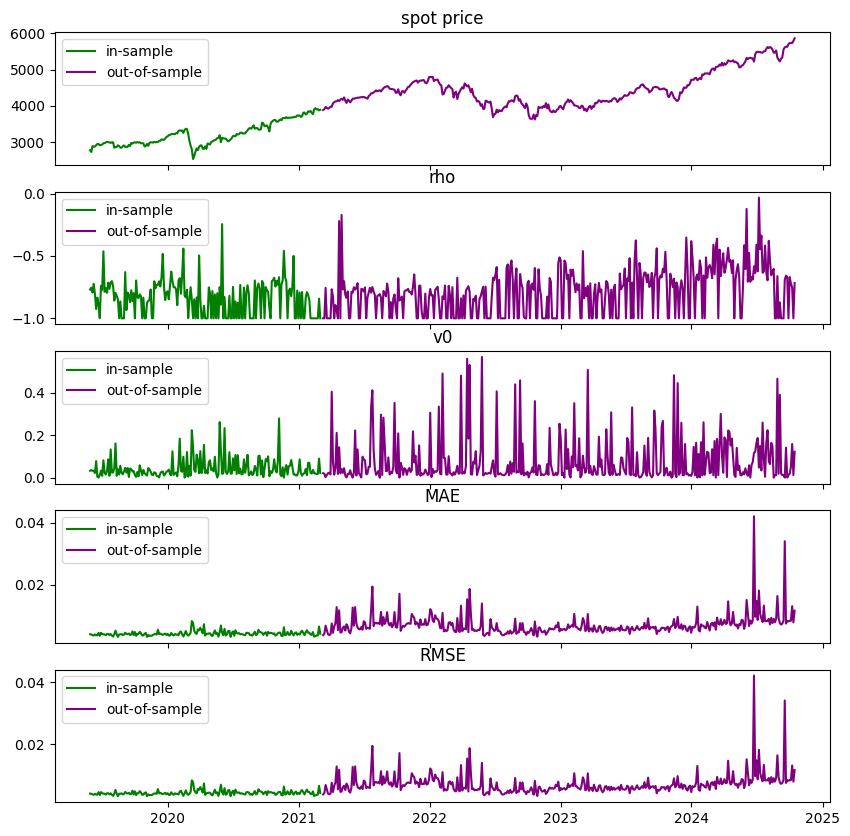
    


# retraining


```python
from convsklearn import convsklearn
help(convsklearn)
```

    Help on class convsklearn in module convsklearn.convsklearn:
    
    class convsklearn(builtins.object)
     |  convsklearn(target_name='observed_price', excluded_features=['barrier_price', 'asian_price', 'observed_price', 'outin', 'updown', 'n_fixings'], seed=1312)
     |
     |  a proprietary class of convenience wrappers for sklearn
     |
     |  Methods defined here:
     |
     |  __init__(self, target_name='observed_price', excluded_features=['barrier_price', 'asian_price', 'observed_price', 'outin', 'updown', 'n_fixings'], seed=1312)
     |      Initialize self.  See help(type(self)) for accurate signature.
     |
     |  load_data(self, data)
     |
     |  preprocess_data(self, development_dates, test_dates, plot=True)
     |
     |  run_dnn(self, print_details=True)
     |
     |  test_prediction_accuracy(self)
     |
     |  ----------------------------------------------------------------------
     |  Data descriptors defined here:
     |
     |  __dict__
     |      dictionary for instance variables
     |
     |  __weakref__
     |      list of weak references to the object
    
    


```python
retraining_frequency = 30 #days
test_dates = model['test_dates']
full_dataset = model['dataset']
models = {}
for i, date in enumerate(test_dates):
    development_dates = pd.concat([model['development_dates'],test_dates[:(i+1)*retraining_frequency]])
    subset_test_dates = test_dates[~test_dates.isin(development_dates)]
    if development_dates.shape == 0:
        break
    try:
        retrainer = convsklearn()
        retrainer.exluded_features = model['excluded_features']
        retrainer.target_name = model['target_name']
        retrainer.load_data(full_dataset)
        retrainer.preprocess_data(development_dates, subset_test_dates,plot=False)
        retrainer.run_dnn()
        retrainer.test_prediction_accuracy()
        models[date] = retrainer.__dict__
        plot_errors(retrainer.train_data.set_index('calculation_date'),retrainer.test_data.set_index('calculation_date'))
        print()
    except Exception as e:
        if str(e).find('Found array with 0 sample(s)')==-1:
            print(e)
        break
```

    
    training on 53460 samples...
    
    alpha: 0.01
    hidden_layer_sizes: (17, 17)
    learning_rate: adaptive
    learning_rate_init: 0.1
    solver: sgd
    early_stopping: False
    max_iter: 500
    warm_start: True
    tol: 0.0001
    random_state: 1312
    cpu: 7.56909441947937
    
    in sample:
         RMSE: 0.0010219112131620658
         MAE: 0.0006912121347382381
    
    out of sample:
         RMSE: 0.01073344596736594
         MAE: 0.006283507734270654
    


    
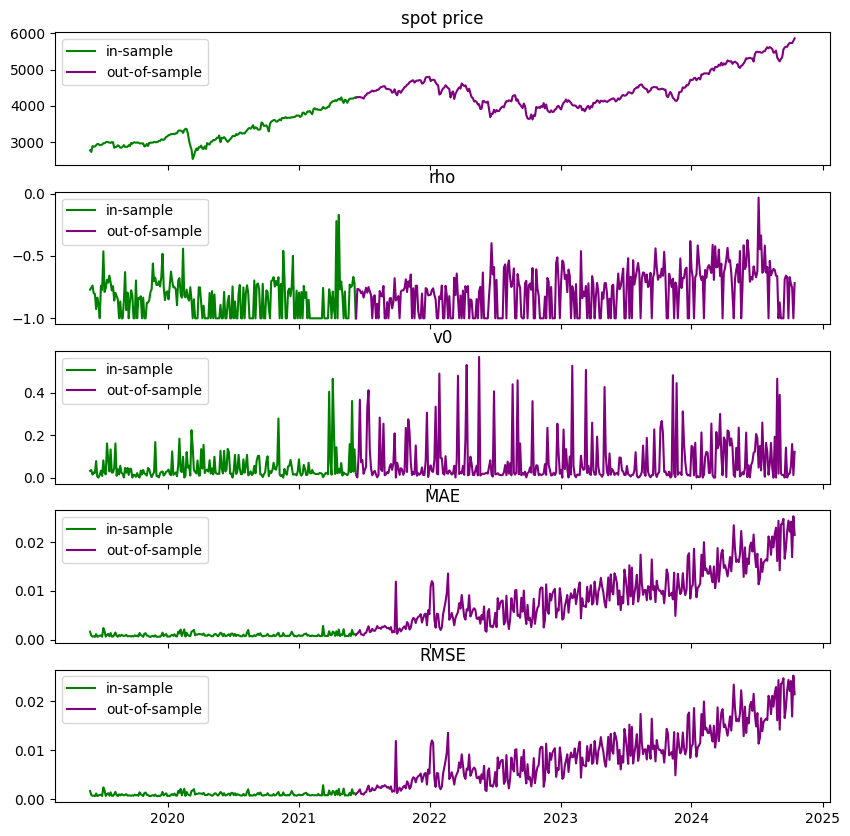
    


    
    
    training on 61560 samples...
    
    alpha: 0.01
    hidden_layer_sizes: (17, 17)
    learning_rate: adaptive
    learning_rate_init: 0.1
    solver: sgd
    early_stopping: False
    max_iter: 500
    warm_start: True
    tol: 0.0001
    random_state: 1312
    cpu: 10.15702509880066
    
    in sample:
         RMSE: 0.0010127731412637668
         MAE: 0.0006967043769468309
    
    out of sample:
         RMSE: 0.006861480692697212
         MAE: 0.004035787598252871
    


    
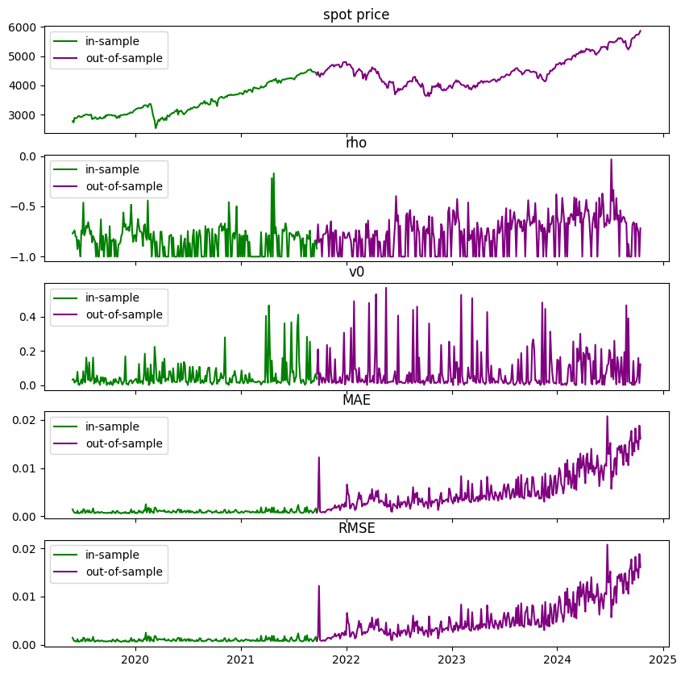
    


    
    
    training on 68940 samples...
    
    alpha: 0.01
    hidden_layer_sizes: (17, 17)
    learning_rate: adaptive
    learning_rate_init: 0.1
    solver: sgd
    early_stopping: False
    max_iter: 500
    warm_start: True
    tol: 0.0001
    random_state: 1312
    cpu: 11.360161304473877
    
    in sample:
         RMSE: 0.0008283593081183745
         MAE: 0.0005668662184492946
    
    out of sample:
         RMSE: 0.005677874009030405
         MAE: 0.0029989541046815623
    


    
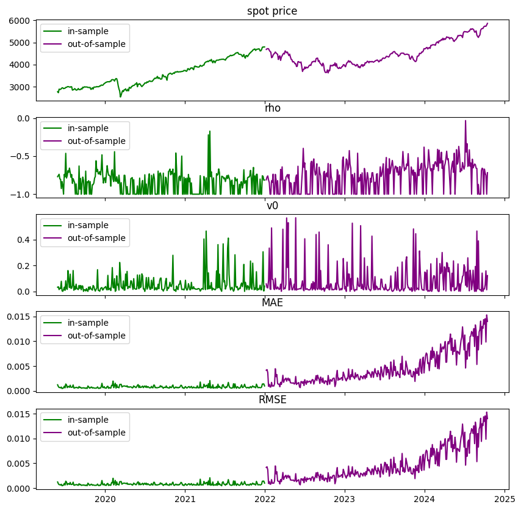
    


    
    
    training on 76140 samples...
    
    alpha: 0.01
    hidden_layer_sizes: (17, 17)
    learning_rate: adaptive
    learning_rate_init: 0.1
    solver: sgd
    early_stopping: False
    max_iter: 500
    warm_start: True
    tol: 0.0001
    random_state: 1312
    cpu: 12.607097864151001
    
    in sample:
         RMSE: 0.0007134134717052571
         MAE: 0.00047393294272208235
    
    out of sample:
         RMSE: 0.002234463562425465
         MAE: 0.0011562051334034964
    


    

    


    
    
    training on 83520 samples...
    
    alpha: 0.01
    hidden_layer_sizes: (17, 17)
    learning_rate: adaptive
    learning_rate_init: 0.1
    solver: sgd
    early_stopping: False
    max_iter: 500
    warm_start: True
    tol: 0.0001
    random_state: 1312
    cpu: 13.696157455444336
    
    in sample:
         RMSE: 0.0006806428653742499
         MAE: 0.00044711481708071453
    
    out of sample:
         RMSE: 0.0020458972531323533
         MAE: 0.0010431629702490875
    


    
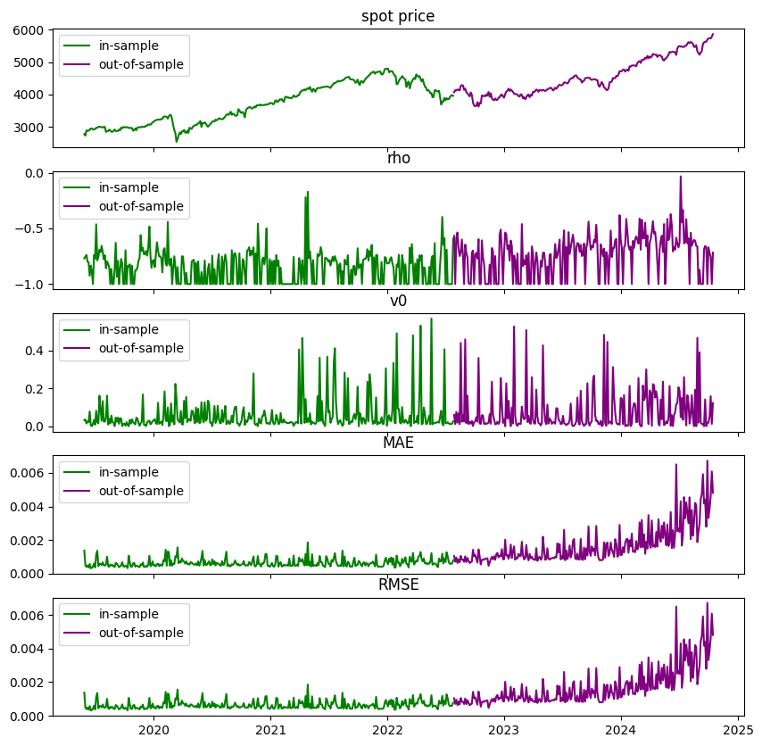
    


    
    
    training on 89460 samples...
    
    alpha: 0.01
    hidden_layer_sizes: (17, 17)
    learning_rate: adaptive
    learning_rate_init: 0.1
    solver: sgd
    early_stopping: False
    max_iter: 500
    warm_start: True
    tol: 0.0001
    random_state: 1312
    cpu: 14.456658601760864
    
    in sample:
         RMSE: 0.000847187488436362
         MAE: 0.0005899841804391337
    
    out of sample:
         RMSE: 0.001576277819473147
         MAE: 0.000982348034900729
    


    
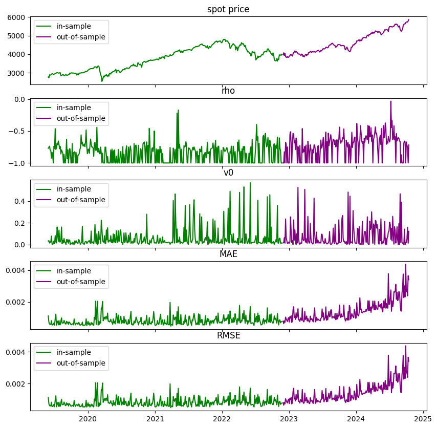
    


    
    
    training on 97200 samples...
    
    alpha: 0.01
    hidden_layer_sizes: (17, 17)
    learning_rate: adaptive
    learning_rate_init: 0.1
    solver: sgd
    early_stopping: False
    max_iter: 500
    warm_start: True
    tol: 0.0001
    random_state: 1312
    cpu: 15.968860387802124
    
    in sample:
         RMSE: 0.0008242425111981112
         MAE: 0.0005622644976097464
    
    out of sample:
         RMSE: 0.0019399318445172335
         MAE: 0.0010779124379844765
    


    
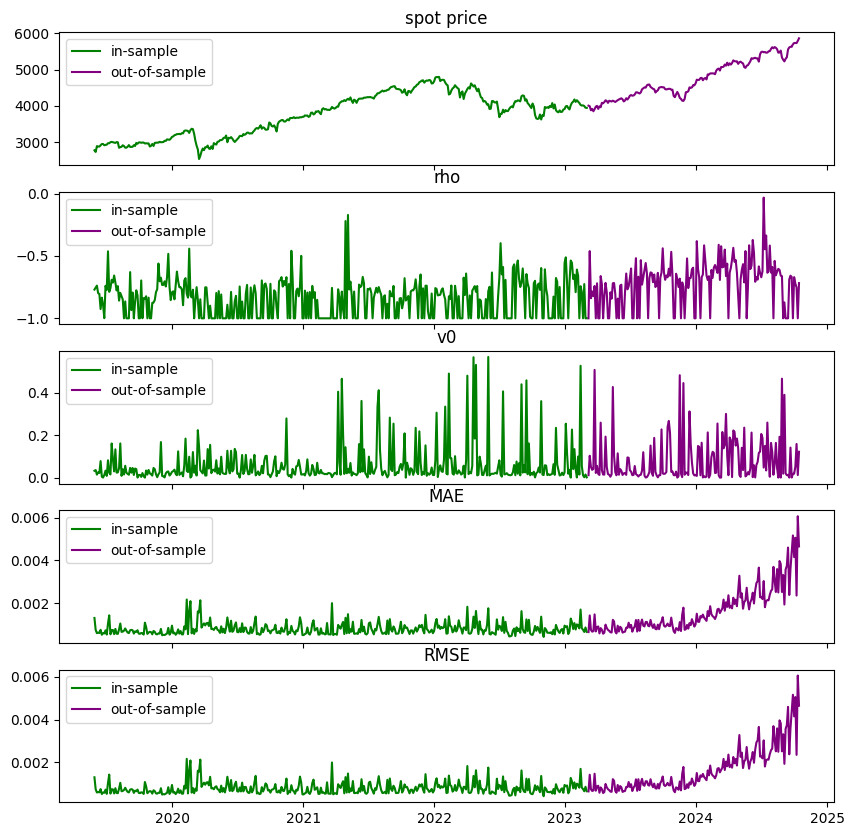
    


    
    
    training on 104040 samples...
    
    alpha: 0.01
    hidden_layer_sizes: (17, 17)
    learning_rate: adaptive
    learning_rate_init: 0.1
    solver: sgd
    early_stopping: False
    max_iter: 500
    warm_start: True
    tol: 0.0001
    random_state: 1312
    cpu: 17.358901023864746
    
    in sample:
         RMSE: 0.0005174775339532737
         MAE: 0.00035475511894982585
    
    out of sample:
         RMSE: 0.0015227738266672649
         MAE: 0.0006680165137314706
    


    
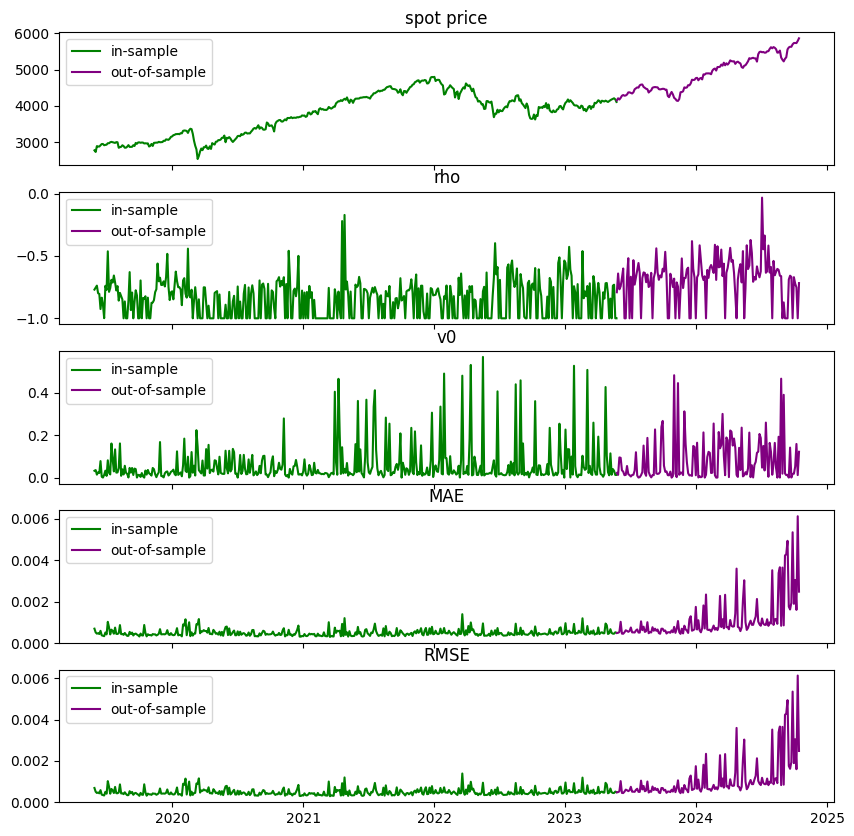
    


    
    
    training on 111420 samples...
    
    alpha: 0.01
    hidden_layer_sizes: (17, 17)
    learning_rate: adaptive
    learning_rate_init: 0.1
    solver: sgd
    early_stopping: False
    max_iter: 500
    warm_start: True
    tol: 0.0001
    random_state: 1312
    cpu: 18.63351607322693
    
    in sample:
         RMSE: 0.0007819618658775106
         MAE: 0.0005325220553512843
    
    out of sample:
         RMSE: 0.0013723912366681967
         MAE: 0.0008162171234922766
    


    
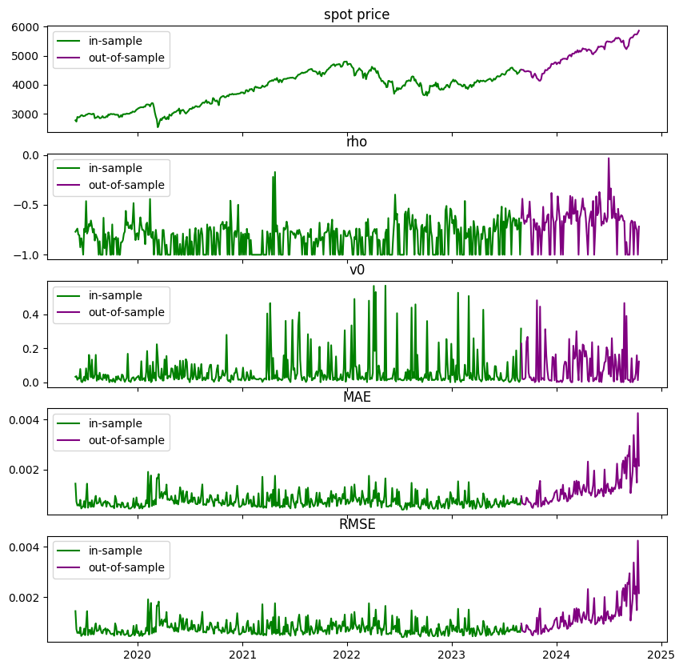
    


    
    
    training on 118620 samples...
    
    alpha: 0.01
    hidden_layer_sizes: (17, 17)
    learning_rate: adaptive
    learning_rate_init: 0.1
    solver: sgd
    early_stopping: False
    max_iter: 500
    warm_start: True
    tol: 0.0001
    random_state: 1312
    cpu: 19.64426875114441
    
    in sample:
         RMSE: 0.0006755450797430144
         MAE: 0.0004761432780554504
    
    out of sample:
         RMSE: 0.0014609524761494388
         MAE: 0.0008523650286057084
    


    
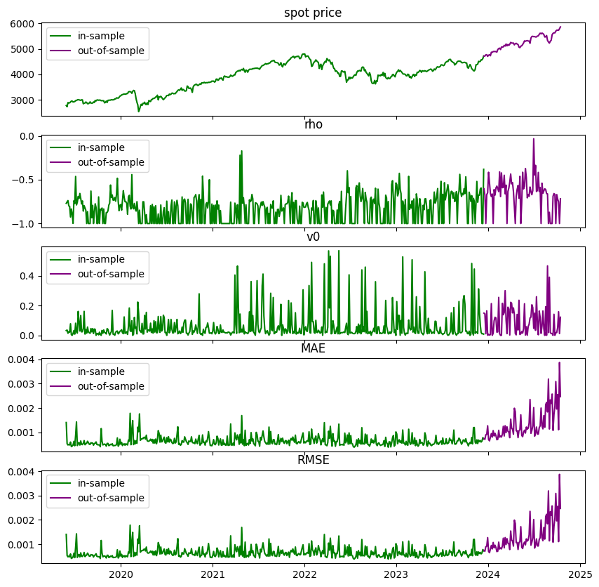
    


    
    
    training on 126540 samples...
    
    alpha: 0.01
    hidden_layer_sizes: (17, 17)
    learning_rate: adaptive
    learning_rate_init: 0.1
    solver: sgd
    early_stopping: False
    max_iter: 500
    warm_start: True
    tol: 0.0001
    random_state: 1312
    cpu: 21.184109687805176
    
    in sample:
         RMSE: 0.0006879053932472276
         MAE: 0.0004645832966795182
    
    out of sample:
         RMSE: 0.0010233922564084495
         MAE: 0.0006886992472136418
    


    
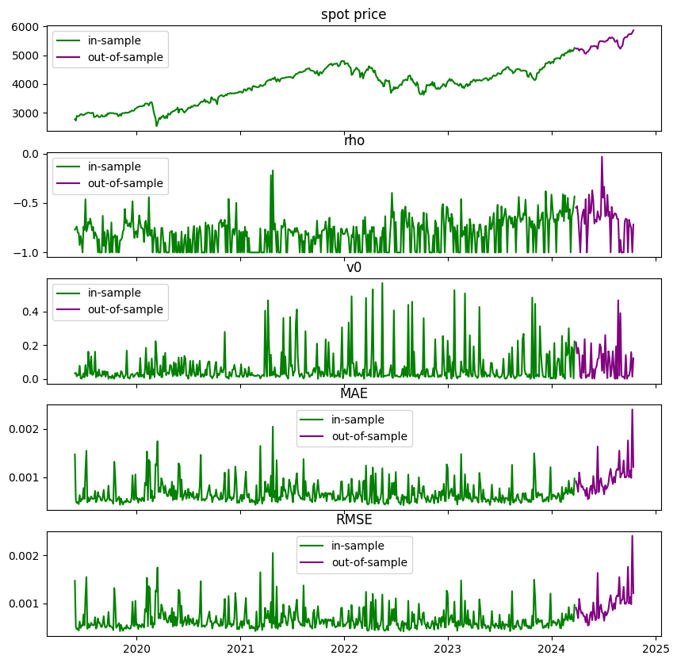
    


    
    
    training on 133020 samples...
    
    alpha: 0.01
    hidden_layer_sizes: (17, 17)
    learning_rate: adaptive
    learning_rate_init: 0.1
    solver: sgd
    early_stopping: False
    max_iter: 500
    warm_start: True
    tol: 0.0001
    random_state: 1312
    cpu: 21.544552326202393
    
    in sample:
         RMSE: 0.0007793271288087221
         MAE: 0.0005366726338208251
    
    out of sample:
         RMSE: 0.00173865125932311
         MAE: 0.0009673194347471107
    


    
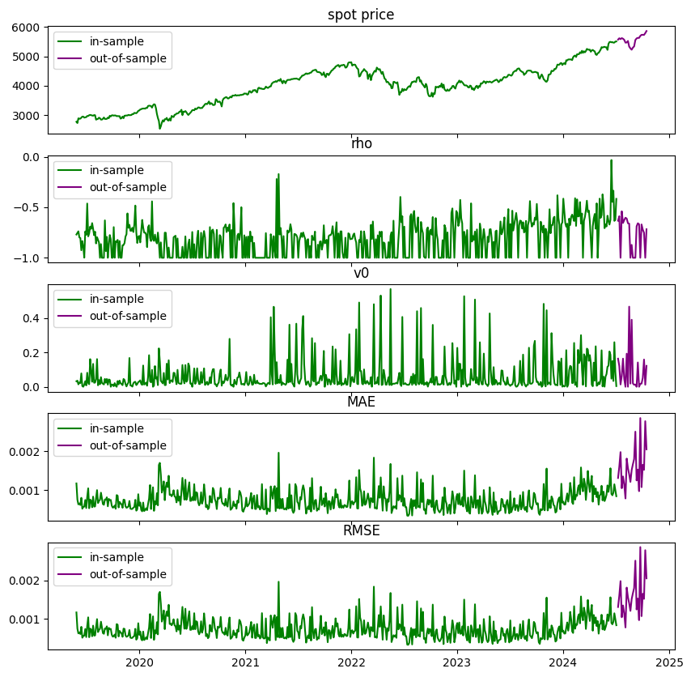
    


    
    
    training on 138600 samples...
    
    alpha: 0.01
    hidden_layer_sizes: (17, 17)
    learning_rate: adaptive
    learning_rate_init: 0.1
    solver: sgd
    early_stopping: False
    max_iter: 500
    warm_start: True
    tol: 0.0001
    random_state: 1312
    cpu: 22.683245182037354
    


```python
pd.concat([model['development_dates'],model['test_dates']])
```


    0        2019-05-29
    180      2019-06-03
    360      2019-06-10
    720      2019-06-12
    1080     2019-06-14
                ...    
    137520   2024-09-24
    137700   2024-10-07
    137880   2024-10-08
    138060   2024-10-09
    138240   2024-10-14
    Name: date, Length: 575, dtype: datetime64[ns]


```python
for k,m in models.items():
    print(k)
    print(m['test_data'].iloc[:,-4:].describe())
    print()
    print('%'*20)
```

    2021-03-09 00:00:00
           relative_observed  outofsample_target  outofsample_prediction  \
    count       85140.000000        85140.000000            85140.000000   
    mean            0.189307            0.189307                0.190992   
    std             0.299840            0.299840                0.292652   
    min             0.000000            0.000000                0.000000   
    25%             0.000000            0.000000                0.005654   
    50%             0.014116            0.014116                0.021735   
    75%             0.329742            0.329742                0.328759   
    max             1.035671            1.035671                1.035540   
    
           outofsample_error  
    count       85140.000000  
    mean            0.001684  
    std             0.010601  
    min            -0.085464  
    25%             0.000000  
    50%             0.002447  
    75%             0.006489  
    max             0.054524  
    
    %%%%%%%%%%%%%%%%%%%%
    2021-03-10 00:00:00
           relative_observed  outofsample_target  outofsample_prediction  \
    count       77040.000000        77040.000000            77040.000000   
    mean            0.189245            0.189245                0.190253   
    std             0.299835            0.299835                0.295547   
    min             0.000000            0.000000                0.000000   
    25%             0.000000            0.000000                0.003435   
    50%             0.014034            0.014034                0.018379   
    75%             0.329611            0.329611                0.328746   
    max             1.035671            1.035671                1.027798   
    
           outofsample_error  
    count       77040.000000  
    mean            0.001008  
    std             0.006787  
    min            -0.067432  
    25%            -0.000366  
    50%             0.001453  
    75%             0.003950  
    max             0.044998  
    
    %%%%%%%%%%%%%%%%%%%%
    2021-03-16 00:00:00
           relative_observed  outofsample_target  outofsample_prediction  \
    count       69660.000000        69660.000000            69660.000000   
    mean            0.189219            0.189219                0.189442   
    std             0.299803            0.299803                0.296160   
    min             0.000000            0.000000                0.000000   
    25%             0.000000            0.000000                0.002484   
    50%             0.013980            0.013980                0.016746   
    75%             0.329471            0.329471                0.328151   
    max             1.035671            1.035671                1.032167   
    
           outofsample_error  
    count       69660.000000  
    mean            0.000223  
    std             0.005674  
    min            -0.056885  
    25%            -0.000778  
    50%             0.000802  
    75%             0.002583  
    max             0.038785  
    
    %%%%%%%%%%%%%%%%%%%%
    2021-03-17 00:00:00
           relative_observed  outofsample_target  outofsample_prediction  \
    count       62460.000000        62460.000000            62460.000000   
    mean            0.189117            0.189117                0.189316   
    std             0.299837            0.299837                0.298975   
    min             0.000000            0.000000                0.000000   
    25%             0.000000            0.000000                0.000632   
    50%             0.013737            0.013737                0.014410   
    75%             0.329340            0.329340                0.328907   
    max             1.035671            1.035671                1.036507   
    
           outofsample_error  
    count       62460.000000  
    mean            0.000198  
    std             0.002226  
    min            -0.036302  
    25%            -0.000336  
    50%             0.000185  
    75%             0.000952  
    max             0.030252  
    
    %%%%%%%%%%%%%%%%%%%%
    2021-03-19 00:00:00
           relative_observed  outofsample_target  outofsample_prediction  \
    count       55080.000000        55080.000000            55080.000000   
    mean            0.189041            0.189041                0.189119   
    std             0.299861            0.299861                0.299166   
    min             0.000000            0.000000                0.000000   
    25%             0.000000            0.000000                0.000566   
    50%             0.013691            0.013691                0.013748   
    75%             0.329173            0.329173                0.329133   
    max             1.035671            1.035671                1.035373   
    
           outofsample_error  
    count       55080.000000  
    mean            0.000078  
    std             0.002044  
    min            -0.027497  
    25%            -0.000527  
    50%             0.000000  
    75%             0.000730  
    max             0.019426  
    
    %%%%%%%%%%%%%%%%%%%%
    2021-03-23 00:00:00
           relative_observed  outofsample_target  outofsample_prediction  \
    count       49140.000000        49140.000000            49140.000000   
    mean            0.189007            0.189007                0.189277   
    std             0.299899            0.299899                0.299328   
    min             0.000000            0.000000                0.000000   
    25%             0.000000            0.000000                0.000612   
    50%             0.013528            0.013528                0.013956   
    75%             0.329067            0.329067                0.328876   
    max             1.034671            1.034671                1.035810   
    
           outofsample_error  
    count       49140.000000  
    mean            0.000270  
    std             0.001553  
    min            -0.019212  
    25%            -0.000252  
    50%             0.000102  
    75%             0.000938  
    max             0.009489  
    
    %%%%%%%%%%%%%%%%%%%%
    2021-03-29 00:00:00
           relative_observed  outofsample_target  outofsample_prediction  \
    count       41400.000000        41400.000000            41400.000000   
    mean            0.188970            0.188970                0.189346   
    std             0.299901            0.299901                0.299322   
    min             0.000000            0.000000                0.000000   
    25%             0.000000            0.000000                0.000652   
    50%             0.013382            0.013382                0.013744   
    75%             0.329038            0.329038                0.328999   
    max             1.034671            1.034671                1.037668   
    
           outofsample_error  
    count       41400.000000  
    mean            0.000376  
    std             0.001903  
    min            -0.023757  
    25%            -0.000028  
    50%             0.000334  
    75%             0.001081  
    max             0.009990  
    
    %%%%%%%%%%%%%%%%%%%%
    2021-03-31 00:00:00
           relative_observed  outofsample_target  outofsample_prediction  \
    count       34560.000000        34560.000000            34560.000000   
    mean            0.188940            0.188940                0.189144   
    std             0.299912            0.299912                0.299367   
    min             0.000000            0.000000                0.000000   
    25%             0.000000            0.000000                0.000582   
    50%             0.013138            0.013138                0.013513   
    75%             0.328952            0.328952                0.329311   
    max             1.034671            1.034671                1.034795   
    
           outofsample_error  
    count       34560.000000  
    mean            0.000204  
    std             0.001509  
    min            -0.027291  
    25%             0.000000  
    50%             0.000323  
    75%             0.000693  
    max             0.010421  
    
    %%%%%%%%%%%%%%%%%%%%
    2021-04-07 00:00:00
           relative_observed  outofsample_target  outofsample_prediction  \
    count       2.718000e+04        2.718000e+04            27180.000000   
    mean        1.890779e-01        1.890779e-01                0.189278   
    std         2.998956e-01        2.998956e-01                0.299532   
    min         0.000000e+00        0.000000e+00                0.000000   
    25%         2.662836e-09        2.662836e-09                0.000530   
    50%         1.366082e-02        1.366082e-02                0.013675   
    75%         3.290462e-01        3.290462e-01                0.328675   
    max         1.034671e+00        1.034671e+00                1.036827   
    
           outofsample_error  
    count       27180.000000  
    mean            0.000200  
    std             0.001358  
    min            -0.017959  
    25%            -0.000124  
    50%             0.000256  
    75%             0.000693  
    max             0.004800  
    
    %%%%%%%%%%%%%%%%%%%%
    2021-04-09 00:00:00
           relative_observed  outofsample_target  outofsample_prediction  \
    count       1.998000e+04        1.998000e+04            19980.000000   
    mean        1.891567e-01        1.891567e-01                0.189382   
    std         2.998112e-01        2.998112e-01                0.299196   
    min         0.000000e+00        0.000000e+00                0.000000   
    25%         2.418839e-07        2.418839e-07                0.000815   
    50%         1.394851e-02        1.394851e-02                0.014132   
    75%         3.290935e-01        3.290935e-01                0.329048   
    max         1.034671e+00        1.034671e+00                1.034536   
    
           outofsample_error  
    count       19980.000000  
    mean            0.000225  
    std             0.001444  
    min            -0.017097  
    25%            -0.000071  
    50%             0.000305  
    75%             0.000874  
    max             0.008274  
    
    %%%%%%%%%%%%%%%%%%%%
    2021-04-12 00:00:00
           relative_observed  outofsample_target  outofsample_prediction  \
    count       1.206000e+04        1.206000e+04            12060.000000   
    mean        1.890623e-01        1.890623e-01                0.189253   
    std         2.998566e-01        2.998566e-01                0.299344   
    min         0.000000e+00        0.000000e+00                0.000000   
    25%         2.968780e-07        2.968780e-07                0.000642   
    50%         1.363474e-02        1.363474e-02                0.013756   
    75%         3.291491e-01        3.291491e-01                0.329423   
    max         1.034671e+00        1.034671e+00                1.031999   
    
           outofsample_error  
    count       12060.000000  
    mean            0.000190  
    std             0.001006  
    min            -0.010161  
    25%            -0.000011  
    50%             0.000314  
    75%             0.000689  
    max             0.004277  
    
    %%%%%%%%%%%%%%%%%%%%
    2021-04-14 00:00:00
           relative_observed  outofsample_target  outofsample_prediction  \
    count        5580.000000         5580.000000             5580.000000   
    mean            0.189203            0.189203                0.189157   
    std             0.299890            0.299890                0.299167   
    min             0.000000            0.000000                0.000000   
    25%             0.000000            0.000000                0.000561   
    50%             0.014037            0.014037                0.013256   
    75%             0.329305            0.329305                0.329324   
    max             1.027717            1.027717                1.024800   
    
           outofsample_error  
    count        5580.000000  
    mean           -0.000046  
    std             0.001738  
    min            -0.015536  
    25%            -0.000393  
    50%             0.000080  
    75%             0.000685  
    max             0.003074  
    
    %%%%%%%%%%%%%%%%%%%%
    


```python
retraining_dates = [d for d in models.keys()]
cols = ['cpu','isMAE','isRMSE','osMAE','osRMSE']
df = pd.DataFrame(np.tile(np.nan,(len(retraining_dates),len(cols))),columns=cols,index=retraining_dates)

for i,row in df.iterrows():
    m = models[i]
    df.at[i,'cpu'] = m['dnn_runtime']
    df.at[i,'isMAE'] = compute_MAE(m['train_data']['insample_error'])
    df.at[i,'isRMSE'] = compute_RMSE(m['train_data']['insample_error'])
    df.at[i,'osMAE'] = compute_MAE(m['test_data']['outofsample_error'])
    df.at[i,'osRMSE'] = compute_RMSE(m['test_data']['outofsample_error'])


print(df)
```

                      cpu     isMAE    isRMSE     osMAE    osRMSE
    2021-03-09   7.569094  0.000691  0.001022  0.006284  0.010733
    2021-03-10  10.157025  0.000697  0.001013  0.004036  0.006861
    2021-03-16  11.360161  0.000567  0.000828  0.002999  0.005678
    2021-03-17  12.607098  0.000474  0.000713  0.001156  0.002234
    2021-03-19  13.696157  0.000447  0.000681  0.001043  0.002046
    2021-03-23  14.456659  0.000590  0.000847  0.000982  0.001576
    2021-03-29  15.968860  0.000562  0.000824  0.001078  0.001940
    2021-03-31  17.358901  0.000355  0.000517  0.000668  0.001523
    2021-04-07  18.633516  0.000533  0.000782  0.000816  0.001372
    2021-04-09  19.644269  0.000476  0.000676  0.000852  0.001461
    2021-04-12  21.184110  0.000465  0.000688  0.000689  0.001023
    2021-04-14  21.544552  0.000537  0.000779  0.000967  0.001739
    


```python

```
