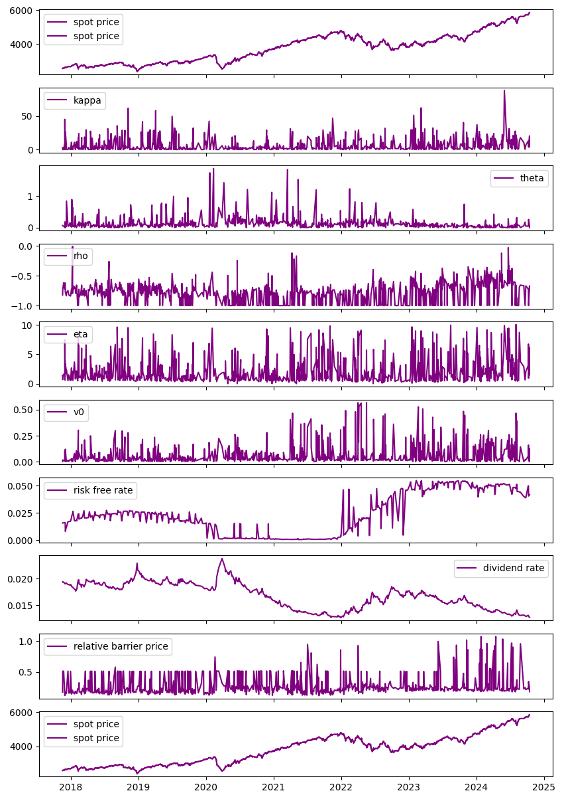
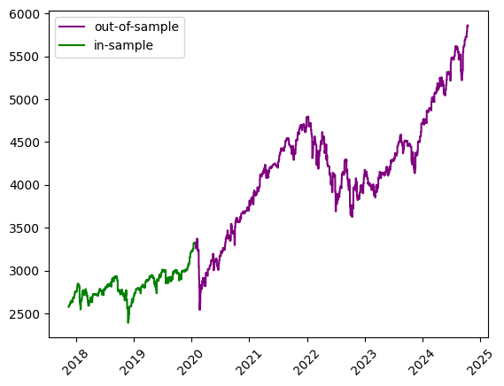
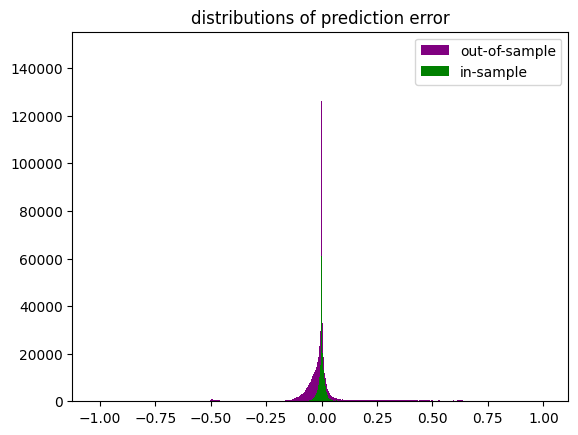

```python
import os
import time
import joblib
import numpy as np
import pandas as pd
import matplotlib.pyplot as plt
from pathlib import Path
from datetime import datetime
from model_settings import ms
from df_collector import df_collector
pd.set_option("display.max_columns",0)
pd.options.display.float_format = '{:.6f}'.format
root = Path().resolve().parent.parent
df_collector.root = root
models_dir = os.path.join(root,ms.trained_models)
train_start = time.time()
train_start_datetime = datetime.fromtimestamp(train_start)
train_start_tag = train_start_datetime.strftime('%c')
print("\n"+"#"*18+"\n# training start #\n"+
      "#"*18+"\n"+f"\n{train_start_tag}")
```

    
    ##################
    # training start #
    ##################
    
    Fri Nov  8 17:48:05 2024
    

# loading data


```python
data = df_collector.cboe_spx_barriers().iloc[:,1:]
pricename = [f for f in data.columns if f.find('_price')!=-1 and f.find('spot_')==-1 and f.find('strike_')==-1][0]
relative_pricename = 'relative_'+pricename
data = data[data[pricename]<=data['spot_price']]
print(f'collected {pricename[:pricename.find('_',0)]} options')
print(data.describe())
print(data.dtypes)
print(data['calculation_date'].drop_duplicates())
```

    collected barrier options
              spot_price   strike_price        barrier  days_to_maturity         rebate  dividend_rate  risk_free_rate          theta          kappa            rho            eta             v0  barrier_price
    count 2037988.000000 2037988.000000 2037988.000000    2037988.000000 2037988.000000 2037988.000000  2037988.000000 2037988.000000 2037988.000000 2037988.000000 2037988.000000 2037988.000000 2037988.000000
    mean     3771.972490    3771.988511    3785.619135        323.112634       0.000000       0.016717        0.023852       0.127303       5.861038      -0.795742       2.001972       0.060612     177.360437
    std       844.635317     880.736463    1459.605277        240.806413       0.000000       0.002448        0.018788       0.186416       9.132415       0.162223       2.112885       0.090671     328.070614
    min      2389.000000    2150.100000    1194.500000         60.000000       0.000000       0.012624        0.000330       0.000000       0.000000      -1.000000       0.000000       0.000102       0.000000
    25%      2916.000000    2955.000000    2677.510000         90.000000       0.000000       0.014215        0.002183       0.035144       0.671483      -0.999982       0.610257       0.012647       1.635566
    50%      3906.000000    3798.975000    3629.662500        180.000000       0.000000       0.016776        0.020822       0.083088       2.102587      -0.783729       1.183543       0.023179      50.164341
    75%      4401.000000    4412.850000    4676.092500        540.000000       0.000000       0.019006        0.045853       0.145793       6.534477      -0.696753       2.462491       0.067072     225.734882
    max      5863.000000    6449.300000    8794.500000        720.000000       0.000000       0.023780        0.054889       1.869788      88.141944      -0.012846      10.045761       0.567582    5424.825644
    spot_price           float64
    strike_price         float64
    barrier              float64
    days_to_maturity       int64
    updown                object
    outin                 object
    w                     object
    barrier_type_name     object
    rebate               float64
    dividend_rate        float64
    risk_free_rate       float64
    theta                float64
    kappa                float64
    rho                  float64
    eta                  float64
    v0                   float64
    calculation_date      object
    date                  object
    barrier_price        float64
    dtype: object
    0          2017-11-16 15:56:27.025
    2161       2017-11-17 13:06:50.720
    4321       2017-11-22 09:30:04.794
    6480       2017-11-28 15:46:56.031
    8640       2017-11-28 16:06:47.133
                        ...           
    2131920    2024-10-07 15:57:53.651
    2134080    2024-10-08 15:48:23.420
    2136240    2024-10-09 15:33:43.664
    2138400    2024-10-14 12:23:32.382
    2140560    2024-10-14 15:26:27.717
    Name: calculation_date, Length: 987, dtype: object
    


```python
filetag = f'cboe spx relative {pricename[:pricename.find('_',0)]}'
```


```python
data[pricename].describe()
```


    count   2037988.000000
    mean        177.360437
    std         328.070614
    min           0.000000
    25%           1.635566
    50%          50.164341
    75%         225.734882
    max        5424.825644
    Name: barrier_price, dtype: float64


# data cleaning & preparation


```python
data_strikes = data['strike_price']
data['relative_spot'] = data['spot_price']/data_strikes
data[relative_pricename] = data[pricename]/data_strikes
try:
    data['relative_barrier'] = data['barrier']/data_strikes
    data['relative_rebate'] = data['rebate']/data_strikes
except Exception:
    pass

data['calculation_date'] = pd.to_datetime(data['calculation_date'],format='mixed')
data['date'] = pd.to_datetime(data['date'],format='mixed')
data.dtypes
```


    spot_price                       float64
    strike_price                     float64
    barrier                          float64
    days_to_maturity                   int64
    updown                            object
    outin                             object
    w                                 object
    barrier_type_name                 object
    rebate                           float64
    dividend_rate                    float64
    risk_free_rate                   float64
    theta                            float64
    kappa                            float64
    rho                              float64
    eta                              float64
    v0                               float64
    calculation_date          datetime64[ns]
    date                      datetime64[ns]
    barrier_price                    float64
    relative_spot                    float64
    relative_barrier_price           float64
    relative_barrier                 float64
    relative_rebate                  float64
    dtype: object


```python
def noisify(x):
    return x + np.random.normal(scale=x*0.01)

relative_observed = data[relative_pricename].values
relative_observed[relative_observed>0] = noisify(relative_observed[relative_observed>0])
targetname = 'relative_observed'
data[targetname]= relative_observed
data[targetname].describe()
```


    count   2037988.000000
    mean          0.048599
    std           0.090974
    min           0.000000
    25%           0.000452
    50%           0.013576
    75%           0.061705
    max           1.073617
    Name: relative_observed, dtype: float64


# visualization


```python
"""
plot
"""
rels = data[targetname]
rels = rels[rels>0.0005]
plt.figure()
plt.hist(rels,color='purple',label=relative_pricename.replace('_',' '),bins=int(np.sqrt(len(rels))))
plt.legend()
plt.show()
rels.describe()
```


    

    


    count   1521171.000000
    mean          0.065089
    std           0.100079
    min           0.000500
    25%           0.008640
    50%           0.032352
    75%           0.081031
    max           1.073617
    Name: relative_observed, dtype: float64


```python
from plotters import PlotCols
col_names = ['spot_price','kappa','theta','rho','eta','v0','risk_free_rate','dividend_rate',relative_pricename,'spot_price']
index = 'calculation_date'
plot_data = data[col_names+[index]].copy().sort_values(by=relative_pricename).drop_duplicates(subset=index,keep='last').sort_values(by=index).reset_index(drop=True)
data_cols = [index] + col_names
PlotCols(
    plot_data,
    col_names=col_names,
    index=index,
    figsize=(10,15)
)
print(f"where '{relative_pricename}' is the maximum market observed relative {pricename[:pricename.find('_',0)]} option price")
pd.Series(plot_data[index])
data[relative_pricename].describe()
```

    ['spot_price', 'kappa', 'theta', 'rho', 'eta', 'v0', 'risk_free_rate', 'dividend_rate', 'relative_barrier_price', 'spot_price']
    


    

    


    where 'relative_barrier_price' is the maximum market observed relative barrier option price
    


    count   2037988.000000
    mean          0.048599
    std           0.090974
    min           0.000000
    25%           0.000452
    50%           0.013576
    75%           0.061705
    max           1.073617
    Name: relative_barrier_price, dtype: float64


# training procedure

## model parameterization and initializaiton


```python
from convsklearn import convsklearn
trainer = convsklearn()
trainer.target_name = relative_pricename
trainer.excluded_features = trainer.excluded_features + ['spot_price','strike_price','barrier','rebate',relative_pricename,'relative_observed']
trainer.__dict__
```


    {'seed': 1312,
     'raw_data': Empty DataFrame
     Columns: []
     Index: [],
     'dataset': Empty DataFrame
     Columns: []
     Index: [],
     'target_name': 'relative_barrier_price',
     'excluded_features': ['barrier_price',
      'asian_price',
      'observed_price',
      'outin',
      'updown',
      'n_fixings',
      'spot_price',
      'strike_price',
      'barrier',
      'rebate',
      'relative_barrier_price',
      'relative_observed'],
     'numerical_features': [],
     'categorical_features': [],
     'feature_set': [],
     'n_features': 0,
     'development_dates': {},
     'test_dates': {},
     'train_data': {},
     'test_data': {},
     'train_X': {},
     'train_y': {},
     'test_X': {},
     'test_y': {},
     'preprocessor': None,
     'pipeline': None,
     'model': None,
     'model_fit': None,
     'dnn_runtime': 0,
     'numerical_scaler': StandardScaler()}


```python
trainer.load_data(data)
print('features:')
for f in trainer.feature_set:
    print(f"   {f}")
print(f"\ntarget:\n   {trainer.target_name}")
```

    features:
       days_to_maturity
       dividend_rate
       risk_free_rate
       theta
       kappa
       rho
       eta
       v0
       relative_spot
       relative_barrier
       relative_rebate
       w
       barrier_type_name
    
    target:
       relative_barrier_price
    


```python
dates = data['date'].drop_duplicates()
```

## prepocessing


```python
development_dates = dates[:len(dates)//3]
test_dates = dates[~dates.isin(development_dates)]
trainer.preprocess_data(development_dates,test_dates)
```


    

    


## training


```python
trainer.run_dnn()
```

    
    training on 650860 samples...
    
    alpha: 0.01
    hidden_layer_sizes: (13, 13)
    learning_rate: adaptive
    learning_rate_init: 0.1
    solver: sgd
    early_stopping: False
    max_iter: 500
    warm_start: True
    tol: 0.0001
    random_state: 1312
    cpu: 163.63143968582153
    


```python
print('instance variables:')

for key, value in trainer.__dict__.items():
    print(f"{key}:\n  {value}\n")
```

    instance variables:
    seed:
      1312
    
    raw_data:
               spot_price  strike_price     barrier  days_to_maturity updown outin     w  ...       date  barrier_price  relative_spot  relative_barrier_price  relative_barrier  relative_rebate  relative_observed
    0       2576.000000   2318.400000 1288.000000                60   Down   Out  call  ... 2017-11-16     261.916242       1.111111                0.113760          0.555556         0.000000           0.113760
    1       2576.000000   2318.400000 1288.000000                60   Down   Out   put  ... 2017-11-16       6.430122       1.111111                0.002800          0.555556         0.000000           0.002800
    2       2576.000000   2318.400000 1288.000000                60   Down    In  call  ... 2017-11-16       0.000000       1.111111                0.000000          0.555556         0.000000           0.000000
    3       2576.000000   2318.400000 1288.000000                60   Down    In   put  ... 2017-11-16       0.000000       1.111111                0.000000          0.555556         0.000000           0.000000
    4       2576.000000   2318.400000 1288.000000                90   Down   Out  call  ... 2017-11-16     268.635580       1.111111                0.115570          0.555556         0.000000           0.115570
    ...             ...           ...         ...               ...    ...   ...   ...  ...        ...            ...            ...                     ...               ...              ...                ...
    2142715 5857.000000   6442.700000 8785.500000               540     Up    In   put  ... 2024-10-14      20.718472       0.909091                0.003242          1.363636         0.000000           0.003242
    2142716 5857.000000   6442.700000 8785.500000               720     Up   Out  call  ... 2024-10-14     107.869068       0.909091                0.016743          1.363636         0.000000           0.016743
    2142717 5857.000000   6442.700000 8785.500000               720     Up   Out   put  ... 2024-10-14     293.413202       0.909091                0.044717          1.363636         0.000000           0.044717
    2142718 5857.000000   6442.700000 8785.500000               720     Up    In  call  ... 2024-10-14       0.000000       0.909091                0.000000          1.363636         0.000000           0.000000
    2142719 5857.000000   6442.700000 8785.500000               720     Up    In   put  ... 2024-10-14      26.012100       0.909091                0.004044          1.363636         0.000000           0.004044
    
    [2037988 rows x 24 columns]
    
    dataset:
               spot_price  strike_price     barrier  days_to_maturity updown outin     w  ...       date  barrier_price  relative_spot  relative_barrier_price  relative_barrier  relative_rebate  relative_observed
    0       2576.000000   2318.400000 1288.000000                60   Down   Out  call  ... 2017-11-16     261.916242       1.111111                0.113760          0.555556         0.000000           0.113760
    1       2576.000000   2318.400000 1288.000000                60   Down   Out   put  ... 2017-11-16       6.430122       1.111111                0.002800          0.555556         0.000000           0.002800
    2       2576.000000   2318.400000 1288.000000                60   Down    In  call  ... 2017-11-16       0.000000       1.111111                0.000000          0.555556         0.000000           0.000000
    3       2576.000000   2318.400000 1288.000000                60   Down    In   put  ... 2017-11-16       0.000000       1.111111                0.000000          0.555556         0.000000           0.000000
    4       2576.000000   2318.400000 1288.000000                90   Down   Out  call  ... 2017-11-16     268.635580       1.111111                0.115570          0.555556         0.000000           0.115570
    ...             ...           ...         ...               ...    ...   ...   ...  ...        ...            ...            ...                     ...               ...              ...                ...
    2142715 5857.000000   6442.700000 8785.500000               540     Up    In   put  ... 2024-10-14      20.718472       0.909091                0.003242          1.363636         0.000000           0.003242
    2142716 5857.000000   6442.700000 8785.500000               720     Up   Out  call  ... 2024-10-14     107.869068       0.909091                0.016743          1.363636         0.000000           0.016743
    2142717 5857.000000   6442.700000 8785.500000               720     Up   Out   put  ... 2024-10-14     293.413202       0.909091                0.044717          1.363636         0.000000           0.044717
    2142718 5857.000000   6442.700000 8785.500000               720     Up    In  call  ... 2024-10-14       0.000000       0.909091                0.000000          1.363636         0.000000           0.000000
    2142719 5857.000000   6442.700000 8785.500000               720     Up    In   put  ... 2024-10-14      26.012100       0.909091                0.004044          1.363636         0.000000           0.004044
    
    [2037988 rows x 24 columns]
    
    target_name:
      relative_barrier_price
    
    excluded_features:
      ['barrier_price', 'asian_price', 'observed_price', 'outin', 'updown', 'n_fixings', 'spot_price', 'strike_price', 'barrier', 'rebate', 'relative_barrier_price', 'relative_observed']
    
    numerical_features:
      ['days_to_maturity', 'dividend_rate', 'risk_free_rate', 'theta', 'kappa', 'rho', 'eta', 'v0', 'relative_spot', 'relative_barrier', 'relative_rebate']
    
    categorical_features:
      ['w', 'barrier_type_name']
    
    feature_set:
      ['days_to_maturity', 'dividend_rate', 'risk_free_rate', 'theta', 'kappa', 'rho', 'eta', 'v0', 'relative_spot', 'relative_barrier', 'relative_rebate', 'w', 'barrier_type_name']
    
    n_features:
      13
    
    development_dates:
      0        2017-11-16
    2161     2017-11-17
    4321     2017-11-22
    6480     2017-11-28
    10800    2017-11-29
                ...    
    682560   2020-01-02
    684720   2020-01-06
    686880   2020-01-16
    689040   2020-01-17
    691201   2020-01-21
    Name: date, Length: 249, dtype: datetime64[ns]
    
    test_dates:
      693360    2020-01-23
    699840    2020-02-03
    702000    2020-02-10
    704160    2020-02-12
    706320    2020-02-18
                 ...    
    2129760   2024-09-24
    2131920   2024-10-07
    2134080   2024-10-08
    2136240   2024-10-09
    2138400   2024-10-14
    Name: date, Length: 499, dtype: datetime64[ns]
    
    train_data:
              spot_price  strike_price     barrier  days_to_maturity updown outin     w  ...       date  barrier_price  relative_spot  relative_barrier_price  relative_barrier  relative_rebate  relative_observed
    0      2576.000000   2318.400000 1288.000000                60   Down   Out  call  ... 2017-11-16     261.916242       1.111111                0.113760          0.555556         0.000000           0.113760
    1449   2576.000000   2511.600000 2601.760000               180     Up   Out   put  ... 2017-11-16      20.376872       1.025641                0.007960          1.035897         0.000000           0.007960
    1448   2576.000000   2511.600000 2601.760000               180     Up   Out  call  ... 2017-11-16       0.905546       1.025641                0.000363          1.035897         0.000000           0.000363
    1447   2576.000000   2511.600000 2601.760000                90     Up    In   put  ... 2017-11-16      19.134441       1.025641                0.007650          1.035897         0.000000           0.007650
    1446   2576.000000   2511.600000 2601.760000                90     Up    In  call  ... 2017-11-16      93.958198       1.025641                0.036963          1.035897         0.000000           0.036963
    ...            ...           ...         ...               ...    ...   ...   ...  ...        ...            ...            ...                     ...               ...              ...                ...
    692091 3321.000000   3570.075000 2474.145000                60   Down    In   put  ... 2020-01-21    1782.071542       0.930233                0.497357          0.693023         0.000000           0.497357
    692089 3321.000000   3570.075000 2474.145000                60   Down   Out   put  ... 2020-01-21       0.000000       0.930233                0.000000          0.693023         0.000000           0.000000
    692087 3321.000000   3570.075000 2067.322500               720   Down    In   put  ... 2020-01-21    1732.710785       0.930233                0.490338          0.579070         0.000000           0.490338
    692103 3321.000000   3570.075000 2474.145000               360   Down    In   put  ... 2020-01-21    1759.136325       0.930233                0.497790          0.693023         0.000000           0.497790
    693359 3321.000000   3653.100000 4981.500000               720     Up    In   put  ... 2020-01-21    1767.638937       0.909091                0.485876          1.363636         0.000000           0.485876
    
    [650860 rows x 24 columns]
    
    test_data:
               spot_price  strike_price     barrier  days_to_maturity updown outin     w  ...       date  barrier_price  relative_spot  relative_barrier_price  relative_barrier  relative_rebate  relative_observed
    693360  3315.000000   2983.500000 1657.500000                60   Down   Out  call  ... 2020-01-23     341.659682       1.111111                0.113044          0.555556         0.000000           0.113044
    697144  3311.000000   3311.000000 4155.305000               540     Up   Out  call  ... 2020-01-23     158.176788       1.000000                0.047471          1.255000         0.000000           0.047471
    697143  3311.000000   3311.000000 4155.305000               360     Up    In   put  ... 2020-01-23       0.336809       1.000000                0.000102          1.255000         0.000000           0.000102
    697142  3311.000000   3311.000000 4155.305000               360     Up    In  call  ... 2020-01-23       9.391873       1.000000                0.002804          1.255000         0.000000           0.002804
    697141  3311.000000   3311.000000 4155.305000               360     Up   Out   put  ... 2020-01-23     165.530956       1.000000                0.049834          1.255000         0.000000           0.049834
    ...             ...           ...         ...               ...    ...   ...   ...  ...        ...            ...            ...                     ...               ...              ...                ...
    2139844 5863.000000   5716.425000 5921.630000                90     Up   Out  call  ... 2024-10-14       3.605032       1.025641                0.000643          1.035897         0.000000           0.000643
    2139845 5863.000000   5716.425000 5921.630000                90     Up   Out   put  ... 2024-10-14      29.226579       1.025641                0.005114          1.035897         0.000000           0.005114
    2139846 5863.000000   5716.425000 5921.630000                90     Up    In  call  ... 2024-10-14     297.359035       1.025641                0.051744          1.035897         0.000000           0.051744
    2139832 5863.000000   5569.850000 8794.500000               540     Up   Out  call  ... 2024-10-14     772.704574       1.052632                0.139485          1.578947         0.000000           0.139485
    2142719 5857.000000   6442.700000 8785.500000               720     Up    In   put  ... 2024-10-14      26.012100       0.909091                0.004044          1.363636         0.000000           0.004044
    
    [1387128 rows x 24 columns]
    
    train_X:
              days_to_maturity  dividend_rate  risk_free_rate    theta    kappa       rho      eta       v0  relative_spot  relative_barrier  relative_rebate     w barrier_type_name
    0                     60       0.019360        0.015691 0.065331 2.860057 -0.823604 1.407877 0.000409       1.111111          0.555556         0.000000  call           DownOut
    1449                 180       0.019360        0.015691 0.065331 2.860057 -0.823604 1.407877 0.000409       1.025641          1.035897         0.000000   put             UpOut
    1448                 180       0.019360        0.015691 0.065331 2.860057 -0.823604 1.407877 0.000409       1.025641          1.035897         0.000000  call             UpOut
    1447                  90       0.019360        0.015691 0.065331 2.860057 -0.823604 1.407877 0.000409       1.025641          1.035897         0.000000   put              UpIn
    1446                  90       0.019360        0.015691 0.065331 2.860057 -0.823604 1.407877 0.000409       1.025641          1.035897         0.000000  call              UpIn
    ...                  ...            ...             ...      ...      ...       ...      ...      ...            ...               ...              ...   ...               ...
    692091                60       0.017779        0.015312 1.732709 0.000315 -0.802688 0.336862 0.031861       0.930233          0.693023         0.000000   put            DownIn
    692089                60       0.017779        0.015312 1.732709 0.000315 -0.802688 0.336862 0.031861       0.930233          0.693023         0.000000   put           DownOut
    692087               720       0.017779        0.015312 1.732709 0.000315 -0.802688 0.336862 0.031861       0.930233          0.579070         0.000000   put            DownIn
    692103               360       0.017779        0.015312 1.732709 0.000315 -0.802688 0.336862 0.031861       0.930233          0.693023         0.000000   put            DownIn
    693359               720       0.017779        0.015312 1.732709 0.000315 -0.802688 0.336862 0.031861       0.909091          1.363636         0.000000   put              UpIn
    
    [650860 rows x 13 columns]
    
    train_y:
      0        0.113760
    1449     0.007960
    1448     0.000363
    1447     0.007650
    1446     0.036963
               ...   
    692091   0.497357
    692089   0.000000
    692087   0.490338
    692103   0.497790
    693359   0.485876
    Name: relative_barrier_price, Length: 650860, dtype: float64
    
    test_X:
               days_to_maturity  dividend_rate  risk_free_rate    theta     kappa       rho      eta       v0  relative_spot  relative_barrier  relative_rebate     w barrier_type_name
    693360                 60       0.017758        0.015363 0.083606  1.963595 -0.800183 1.048057 0.009697       1.111111          0.555556         0.000000  call           DownOut
    697144                540       0.017758        0.015363 0.089668  0.139512 -0.834103 0.495438 0.026245       1.000000          1.255000         0.000000  call             UpOut
    697143                360       0.017758        0.015363 0.089668  0.139512 -0.834103 0.495438 0.026245       1.000000          1.255000         0.000000   put              UpIn
    697142                360       0.017758        0.015363 0.089668  0.139512 -0.834103 0.495438 0.026245       1.000000          1.255000         0.000000  call              UpIn
    697141                360       0.017758        0.015363 0.089668  0.139512 -0.834103 0.495438 0.026245       1.000000          1.255000         0.000000   put             UpOut
    ...                   ...            ...             ...      ...       ...       ...      ...      ...            ...               ...              ...   ...               ...
    2139844                90       0.012687        0.041813 0.055108 20.301854 -0.670089 6.124247 0.000915       1.025641          1.035897         0.000000  call             UpOut
    2139845                90       0.012687        0.041813 0.055108 20.301854 -0.670089 6.124247 0.000915       1.025641          1.035897         0.000000   put             UpOut
    2139846                90       0.012687        0.041813 0.055108 20.301854 -0.670089 6.124247 0.000915       1.025641          1.035897         0.000000  call              UpIn
    2139832               540       0.012687        0.041813 0.055108 20.301854 -0.670089 6.124247 0.000915       1.052632          1.578947         0.000000  call             UpOut
    2142719               720       0.012687        0.041813 0.000000  4.067045 -0.717809 1.487001 0.121595       0.909091          1.363636         0.000000   put              UpIn
    
    [1387128 rows x 13 columns]
    
    test_y:
      693360    0.113044
    697144    0.047471
    697143    0.000102
    697142    0.002804
    697141    0.049834
                ...   
    2139844   0.000643
    2139845   0.005114
    2139846   0.051744
    2139832   0.139485
    2142719   0.004044
    Name: relative_barrier_price, Length: 1387128, dtype: float64
    
    preprocessor:
      ColumnTransformer(transformers=[('StandardScaler', StandardScaler(),
                                     ['days_to_maturity', 'dividend_rate',
                                      'risk_free_rate', 'theta', 'kappa', 'rho',
                                      'eta', 'v0', 'relative_spot',
                                      'relative_barrier', 'relative_rebate']),
                                    ('OneHotEncoder',
                                     OneHotEncoder(sparse_output=False),
                                     ['w', 'barrier_type_name'])])
    
    pipeline:
      None
    
    model:
      TransformedTargetRegressor(regressor=Pipeline(steps=[('preprocessor',
                                                          ColumnTransformer(transformers=[('StandardScaler',
                                                                                           StandardScaler(),
                                                                                           ['days_to_maturity',
                                                                                            'dividend_rate',
                                                                                            'risk_free_rate',
                                                                                            'theta',
                                                                                            'kappa',
                                                                                            'rho',
                                                                                            'eta',
                                                                                            'v0',
                                                                                            'relative_spot',
                                                                                            'relative_barrier',
                                                                                            'relative_rebate']),
                                                                                          ('OneHotEncoder',
                                                                                           OneHotEncoder(sparse_output=False),
                                                                                           ['w',
                                                                                            'barrier_type_name'])])),
                                                         ('regressor',
                                                          MLPRegressor(alpha=0.01,
                                                                       hidden_layer_sizes=(13,
                                                                                           13),
                                                                       learning_rate='adaptive',
                                                                       learning_rate_init=0.1,
                                                                       max_iter=500,
                                                                       random_state=1312,
                                                                       solver='sgd',
                                                                       warm_start=True))]),
                               transformer=StandardScaler())
    
    model_fit:
      TransformedTargetRegressor(regressor=Pipeline(steps=[('preprocessor',
                                                          ColumnTransformer(transformers=[('StandardScaler',
                                                                                           StandardScaler(),
                                                                                           ['days_to_maturity',
                                                                                            'dividend_rate',
                                                                                            'risk_free_rate',
                                                                                            'theta',
                                                                                            'kappa',
                                                                                            'rho',
                                                                                            'eta',
                                                                                            'v0',
                                                                                            'relative_spot',
                                                                                            'relative_barrier',
                                                                                            'relative_rebate']),
                                                                                          ('OneHotEncoder',
                                                                                           OneHotEncoder(sparse_output=False),
                                                                                           ['w',
                                                                                            'barrier_type_name'])])),
                                                         ('regressor',
                                                          MLPRegressor(alpha=0.01,
                                                                       hidden_layer_sizes=(13,
                                                                                           13),
                                                                       learning_rate='adaptive',
                                                                       learning_rate_init=0.1,
                                                                       max_iter=500,
                                                                       random_state=1312,
                                                                       solver='sgd',
                                                                       warm_start=True))]),
                               transformer=StandardScaler())
    
    dnn_runtime:
      163.63143968582153
    
    numerical_scaler:
      StandardScaler()
    
    dnn_params:
      {'alpha': 0.01, 'hidden_layer_sizes': (13, 13), 'learning_rate': 'adaptive', 'learning_rate_init': 0.1, 'solver': 'sgd', 'early_stopping': False, 'max_iter': 500, 'warm_start': True, 'tol': 0.0001, 'random_state': 1312}
    
    transformers:
      [('StandardScaler', StandardScaler(), ['days_to_maturity', 'dividend_rate', 'risk_free_rate', 'theta', 'kappa', 'rho', 'eta', 'v0', 'relative_spot', 'relative_barrier', 'relative_rebate']), ('OneHotEncoder', OneHotEncoder(sparse_output=False), ['w', 'barrier_type_name'])]
    
    regressor:
      MLPRegressor(alpha=0.01, hidden_layer_sizes=(13, 13), learning_rate='adaptive',
                 learning_rate_init=0.1, max_iter=500, random_state=1312,
                 solver='sgd', warm_start=True)
    
    dnn_pipeline:
      Pipeline(steps=[('preprocessor',
                     ColumnTransformer(transformers=[('StandardScaler',
                                                      StandardScaler(),
                                                      ['days_to_maturity',
                                                       'dividend_rate',
                                                       'risk_free_rate', 'theta',
                                                       'kappa', 'rho', 'eta', 'v0',
                                                       'relative_spot',
                                                       'relative_barrier',
                                                       'relative_rebate']),
                                                     ('OneHotEncoder',
                                                      OneHotEncoder(sparse_output=False),
                                                      ['w',
                                                       'barrier_type_name'])])),
                    ('regressor',
                     MLPRegressor(alpha=0.01, hidden_layer_sizes=(13, 13),
                                  learning_rate='adaptive', learning_rate_init=0.1,
                                  max_iter=500, random_state=1312, solver='sgd',
                                  warm_start=True))])
    
    

## testing


```python
train_test = trainer.test_prediction_accuracy()
```

    
    in sample:
         RMSE: 0.021575797317663934
         MAE: 0.010853557037405016
    
    out of sample:
         RMSE: 0.1617864252065067
         MAE: 0.07226816187077142
    


```python
oserr = trainer.test_data['outofsample_error']
iserr = trainer.train_data['insample_error']
```


```python
plt.figure()
plt.hist(oserr,color='purple',label='out-of-sample',bins=int(np.sqrt(len(oserr))))
plt.hist(iserr,color='green',label='in-sample',bins=int(np.sqrt(len(iserr))))
plt.legend()
plt.title('distributions of prediction error')
plt.show()
```


    

    


## saving


```python
train_end = time.time()
train_end_tag = str(datetime.fromtimestamp(
    train_end).strftime("%Y_%m_%d %H%M%S%f"))
file_tag = str(train_end_tag + " " + filetag)
files_dir = os.path.join(models_dir,file_tag)

def save_model():
    if Path(files_dir).exists():
        pass
    else:
        os.mkdir(files_dir)
    file_dir = os.path.join(files_dir,file_tag)
    joblib.dump(trainer.__dict__,str(f"{file_dir}.pkl"))
    pd.set_option("display.max_columns",None)
    print(f"model saved to {file_dir}")

print(f"execute the command 'save_model()' to save the following model: {file_tag}")
train_runtime = train_end-train_start
print(f"\ncpu: {train_runtime}")
```

    execute the command 'save_model()' to save the following model: 2024_11_08 175101227443 cboe spx relative barrier
    
    cpu: 175.51972007751465
    
