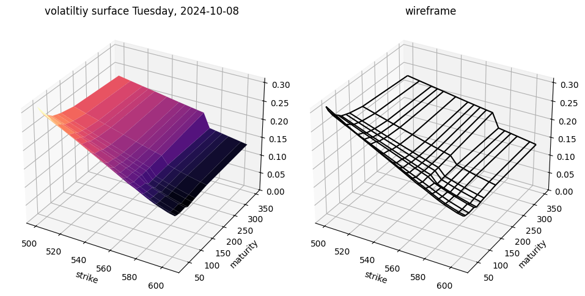
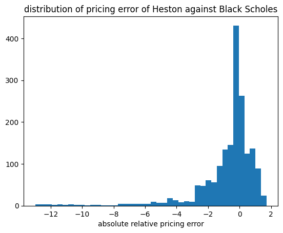

```python
from pathlib import Path
from model_settings import ms
import pandas as pd
import sys
import os
import numpy as np
from model_settings import ms
import numpy as np
import matplotlib.pyplot as plt
from matplotlib import cm
from datetime import datetime
from datetime import timedelta
import QuantLib as ql
from itertools import product
```

    
    pricing settings:
    Actual/365 (Fixed) day counter
    New York stock exchange calendar
    compounding: continuous
    frequency: annual
    
    


```python
jupyter_dir = os.path.abspath(str(Path()))
os.chdir(jupyter_dir)
```


```python
store = pd.HDFStore(r'alphaVantage Vanillas.h5')
keys = store.keys()
len(keys)
```


    3000


```python
contract_keys = [key for key in keys if key.find('hottest_contracts')!= -1]
len(contract_keys)
```


    1000


```python
surface_keys = [key for key in keys if key.find('surface')!= -1]
len(surface_keys)
```


    1000


```python
raw_data_keys = [key for key in keys if key.find('raw_data')!=-1]
len(raw_data_keys)
```


    1000


# Routine Start


```python
surface_key = surface_keys[1]
surface_key
```


    '/date_2024_10_08/surface'


## loop start


```python
second_backslash_pos = surface_key.find('/', 1)
date_key_component = surface_key[:second_backslash_pos+1]
date_key_component
```


    '/date_2024_10_08/'


```python
accomp = [key for key in contract_keys if f'{date_key_component}hottest_contracts' in contract_keys][0]
accomp
```


    '/date_2024_10_09/hottest_contracts'


```python
raw_data_key = [key for key in raw_data_keys if f'{date_key_component}raw_data' in raw_data_keys][0]
raw_data_key
```


    '/date_2024_10_09/raw_data'


```python
date_string = date_key_component[date_key_component.find('_',0)+1:date_key_component.find('_',0)+11]
date_string
```


    '2024_10_08'


```python
calculation_datetime = datetime.strptime(date_string,'%Y_%m_%d')
calculation_datetime
```


    datetime.datetime(2024, 10, 8, 0, 0)


```python
raw_data = pd.DataFrame(store[raw_data_key])
raw_data.iloc[:5,:]
```


<div>
<style scoped>
    .dataframe tbody tr th:only-of-type {
        vertical-align: middle;
    }

    .dataframe tbody tr th {
        vertical-align: top;
    }

    .dataframe thead th {
        text-align: right;
    }
</style>
<table border="1" class="dataframe">
  <thead>
    <tr style="text-align: right;">
      <th></th>
      <th>contractID</th>
      <th>symbol</th>
      <th>expiration</th>
      <th>strike</th>
      <th>type</th>
      <th>last</th>
      <th>mark</th>
      <th>bid</th>
      <th>bid_size</th>
      <th>ask</th>
      <th>ask_size</th>
      <th>volume</th>
      <th>open_interest</th>
      <th>date</th>
      <th>implied_volatility</th>
      <th>delta</th>
      <th>gamma</th>
      <th>theta</th>
      <th>vega</th>
      <th>rho</th>
    </tr>
  </thead>
  <tbody>
    <tr>
      <th>0</th>
      <td>SPY241009C00300000</td>
      <td>SPY</td>
      <td>2024-10-09</td>
      <td>300.00</td>
      <td>call</td>
      <td>273.09</td>
      <td>276.56</td>
      <td>275.94</td>
      <td>40</td>
      <td>277.17</td>
      <td>50</td>
      <td>13</td>
      <td>0</td>
      <td>2024-10-09</td>
      <td>3.85357</td>
      <td>1.00000</td>
      <td>0.00000</td>
      <td>-0.14488</td>
      <td>0.00000</td>
      <td>0.00822</td>
    </tr>
    <tr>
      <th>1</th>
      <td>SPY241009P00300000</td>
      <td>SPY</td>
      <td>2024-10-09</td>
      <td>300.00</td>
      <td>put</td>
      <td>0.01</td>
      <td>0.01</td>
      <td>0.00</td>
      <td>0</td>
      <td>0.01</td>
      <td>2300</td>
      <td>1</td>
      <td>0</td>
      <td>2024-10-09</td>
      <td>3.77630</td>
      <td>-0.00033</td>
      <td>0.00001</td>
      <td>-0.24808</td>
      <td>0.00036</td>
      <td>-0.00001</td>
    </tr>
    <tr>
      <th>2</th>
      <td>SPY241009C00305000</td>
      <td>SPY</td>
      <td>2024-10-09</td>
      <td>305.00</td>
      <td>call</td>
      <td>0.00</td>
      <td>271.56</td>
      <td>270.94</td>
      <td>40</td>
      <td>272.17</td>
      <td>50</td>
      <td>0</td>
      <td>0</td>
      <td>2024-10-09</td>
      <td>3.78404</td>
      <td>1.00000</td>
      <td>0.00000</td>
      <td>-0.14730</td>
      <td>0.00000</td>
      <td>0.00836</td>
    </tr>
    <tr>
      <th>3</th>
      <td>SPY241009P00305000</td>
      <td>SPY</td>
      <td>2024-10-09</td>
      <td>305.00</td>
      <td>put</td>
      <td>0.00</td>
      <td>0.01</td>
      <td>0.00</td>
      <td>0</td>
      <td>0.11</td>
      <td>1</td>
      <td>0</td>
      <td>0</td>
      <td>2024-10-09</td>
      <td>3.68560</td>
      <td>-0.00033</td>
      <td>0.00001</td>
      <td>-0.24760</td>
      <td>0.00037</td>
      <td>-0.00001</td>
    </tr>
    <tr>
      <th>4</th>
      <td>SPY241009C00310000</td>
      <td>SPY</td>
      <td>2024-10-09</td>
      <td>310.00</td>
      <td>call</td>
      <td>0.00</td>
      <td>266.56</td>
      <td>265.94</td>
      <td>40</td>
      <td>267.17</td>
      <td>50</td>
      <td>0</td>
      <td>0</td>
      <td>2024-10-09</td>
      <td>3.71452</td>
      <td>1.00000</td>
      <td>0.00000</td>
      <td>-0.14971</td>
      <td>0.00000</td>
      <td>0.00849</td>
    </tr>
  </tbody>
</table>
</div>


```python
pd.to_numeric(raw_data['last'])
```


    0       273.09
    1         0.01
    2         0.00
    3         0.00
    4         0.00
             ...  
    9801      0.00
    9802      1.31
    9803      0.00
    9804      1.19
    9805      0.00
    Name: last, Length: 9806, dtype: float64


```python
raw_data['date'] = pd.to_datetime(raw_data['date'])
raw_data['expiration'] = pd.to_datetime(raw_data['expiration'])
raw_data['implied_volatility'] = pd.to_numeric(raw_data['implied_volatility'])
raw_data['strike'] = pd.to_numeric(raw_data['strike'])
raw_data['last'] = pd.to_numeric(raw_data['last'])
raw_data.dtypes
```


    contractID                    object
    symbol                        object
    expiration            datetime64[ns]
    strike                       float64
    type                          object
    last                         float64
    mark                          object
    bid                           object
    bid_size                      object
    ask                           object
    ask_size                      object
    volume                        object
    open_interest                 object
    date                  datetime64[ns]
    implied_volatility           float64
    delta                         object
    gamma                         object
    theta                         object
    vega                          object
    rho                           object
    dtype: object


```python
contract_maturities = np.array((raw_data['expiration'] - raw_data['date']) / timedelta(days=1)).astype(int)
raw_data['days_to_maturity'] = contract_maturities
raw_data.iloc[:5,:]
```


<div>
<style scoped>
    .dataframe tbody tr th:only-of-type {
        vertical-align: middle;
    }

    .dataframe tbody tr th {
        vertical-align: top;
    }

    .dataframe thead th {
        text-align: right;
    }
</style>
<table border="1" class="dataframe">
  <thead>
    <tr style="text-align: right;">
      <th></th>
      <th>contractID</th>
      <th>symbol</th>
      <th>expiration</th>
      <th>strike</th>
      <th>type</th>
      <th>last</th>
      <th>mark</th>
      <th>bid</th>
      <th>bid_size</th>
      <th>ask</th>
      <th>...</th>
      <th>volume</th>
      <th>open_interest</th>
      <th>date</th>
      <th>implied_volatility</th>
      <th>delta</th>
      <th>gamma</th>
      <th>theta</th>
      <th>vega</th>
      <th>rho</th>
      <th>days_to_maturity</th>
    </tr>
  </thead>
  <tbody>
    <tr>
      <th>0</th>
      <td>SPY241009C00300000</td>
      <td>SPY</td>
      <td>2024-10-09</td>
      <td>300.0</td>
      <td>call</td>
      <td>273.09</td>
      <td>276.56</td>
      <td>275.94</td>
      <td>40</td>
      <td>277.17</td>
      <td>...</td>
      <td>13</td>
      <td>0</td>
      <td>2024-10-09</td>
      <td>3.85357</td>
      <td>1.00000</td>
      <td>0.00000</td>
      <td>-0.14488</td>
      <td>0.00000</td>
      <td>0.00822</td>
      <td>0</td>
    </tr>
    <tr>
      <th>1</th>
      <td>SPY241009P00300000</td>
      <td>SPY</td>
      <td>2024-10-09</td>
      <td>300.0</td>
      <td>put</td>
      <td>0.01</td>
      <td>0.01</td>
      <td>0.00</td>
      <td>0</td>
      <td>0.01</td>
      <td>...</td>
      <td>1</td>
      <td>0</td>
      <td>2024-10-09</td>
      <td>3.77630</td>
      <td>-0.00033</td>
      <td>0.00001</td>
      <td>-0.24808</td>
      <td>0.00036</td>
      <td>-0.00001</td>
      <td>0</td>
    </tr>
    <tr>
      <th>2</th>
      <td>SPY241009C00305000</td>
      <td>SPY</td>
      <td>2024-10-09</td>
      <td>305.0</td>
      <td>call</td>
      <td>0.00</td>
      <td>271.56</td>
      <td>270.94</td>
      <td>40</td>
      <td>272.17</td>
      <td>...</td>
      <td>0</td>
      <td>0</td>
      <td>2024-10-09</td>
      <td>3.78404</td>
      <td>1.00000</td>
      <td>0.00000</td>
      <td>-0.14730</td>
      <td>0.00000</td>
      <td>0.00836</td>
      <td>0</td>
    </tr>
    <tr>
      <th>3</th>
      <td>SPY241009P00305000</td>
      <td>SPY</td>
      <td>2024-10-09</td>
      <td>305.0</td>
      <td>put</td>
      <td>0.00</td>
      <td>0.01</td>
      <td>0.00</td>
      <td>0</td>
      <td>0.11</td>
      <td>...</td>
      <td>0</td>
      <td>0</td>
      <td>2024-10-09</td>
      <td>3.68560</td>
      <td>-0.00033</td>
      <td>0.00001</td>
      <td>-0.24760</td>
      <td>0.00037</td>
      <td>-0.00001</td>
      <td>0</td>
    </tr>
    <tr>
      <th>4</th>
      <td>SPY241009C00310000</td>
      <td>SPY</td>
      <td>2024-10-09</td>
      <td>310.0</td>
      <td>call</td>
      <td>0.00</td>
      <td>266.56</td>
      <td>265.94</td>
      <td>40</td>
      <td>267.17</td>
      <td>...</td>
      <td>0</td>
      <td>0</td>
      <td>2024-10-09</td>
      <td>3.71452</td>
      <td>1.00000</td>
      <td>0.00000</td>
      <td>-0.14971</td>
      <td>0.00000</td>
      <td>0.00849</td>
      <td>0</td>
    </tr>
  </tbody>
</table>
<p>5 rows × 21 columns</p>
</div>


```python
vol_matrix = pd.DataFrame(store[surface_key])
vol_matrix
```


<div>
<style scoped>
    .dataframe tbody tr th:only-of-type {
        vertical-align: middle;
    }

    .dataframe tbody tr th {
        vertical-align: top;
    }

    .dataframe thead th {
        text-align: right;
    }
</style>
<table border="1" class="dataframe">
  <thead>
    <tr style="text-align: right;">
      <th></th>
      <th>31</th>
      <th>38</th>
      <th>52</th>
      <th>73</th>
      <th>84</th>
      <th>101</th>
      <th>115</th>
      <th>164</th>
      <th>346</th>
    </tr>
  </thead>
  <tbody>
    <tr>
      <th>500.0</th>
      <td>0.31159</td>
      <td>0.29803</td>
      <td>0.27851</td>
      <td>0.26617</td>
      <td>0.25839</td>
      <td>0.25336</td>
      <td>0.24940</td>
      <td>0.24071</td>
      <td>0.23080</td>
    </tr>
    <tr>
      <th>510.0</th>
      <td>0.29117</td>
      <td>0.27928</td>
      <td>0.26144</td>
      <td>0.25199</td>
      <td>0.24513</td>
      <td>0.24086</td>
      <td>0.23751</td>
      <td>0.23095</td>
      <td>0.22486</td>
    </tr>
    <tr>
      <th>520.0</th>
      <td>0.27013</td>
      <td>0.26098</td>
      <td>0.24544</td>
      <td>0.23827</td>
      <td>0.23217</td>
      <td>0.22882</td>
      <td>0.22608</td>
      <td>0.22120</td>
      <td>0.21907</td>
    </tr>
    <tr>
      <th>525.0</th>
      <td>0.26083</td>
      <td>0.25199</td>
      <td>0.23781</td>
      <td>0.23156</td>
      <td>0.22577</td>
      <td>0.22288</td>
      <td>0.22013</td>
      <td>0.21632</td>
      <td>0.21617</td>
    </tr>
    <tr>
      <th>530.0</th>
      <td>0.25138</td>
      <td>0.24330</td>
      <td>0.23004</td>
      <td>0.22486</td>
      <td>0.21983</td>
      <td>0.21693</td>
      <td>0.21464</td>
      <td>0.21160</td>
      <td>0.21342</td>
    </tr>
    <tr>
      <th>540.0</th>
      <td>0.23278</td>
      <td>0.22608</td>
      <td>0.21495</td>
      <td>0.21160</td>
      <td>0.20718</td>
      <td>0.20519</td>
      <td>0.20352</td>
      <td>0.20199</td>
      <td>0.20748</td>
    </tr>
    <tr>
      <th>550.0</th>
      <td>0.21495</td>
      <td>0.20931</td>
      <td>0.20016</td>
      <td>0.19818</td>
      <td>0.19452</td>
      <td>0.19330</td>
      <td>0.19239</td>
      <td>0.19254</td>
      <td>0.20169</td>
    </tr>
    <tr>
      <th>555.0</th>
      <td>0.20580</td>
      <td>0.20077</td>
      <td>0.19254</td>
      <td>0.19147</td>
      <td>0.18812</td>
      <td>0.18751</td>
      <td>0.18690</td>
      <td>0.18797</td>
      <td>0.19894</td>
    </tr>
    <tr>
      <th>560.0</th>
      <td>0.19650</td>
      <td>0.19224</td>
      <td>0.18492</td>
      <td>0.18461</td>
      <td>0.18187</td>
      <td>0.18187</td>
      <td>0.18157</td>
      <td>0.18355</td>
      <td>0.19620</td>
    </tr>
    <tr>
      <th>565.0</th>
      <td>0.18705</td>
      <td>0.18340</td>
      <td>0.17745</td>
      <td>0.17791</td>
      <td>0.17577</td>
      <td>0.17608</td>
      <td>0.17623</td>
      <td>0.17928</td>
      <td>0.19346</td>
    </tr>
    <tr>
      <th>570.0</th>
      <td>0.17776</td>
      <td>0.17471</td>
      <td>0.16998</td>
      <td>0.17166</td>
      <td>0.16968</td>
      <td>0.17090</td>
      <td>0.17120</td>
      <td>0.17516</td>
      <td>0.19086</td>
    </tr>
    <tr>
      <th>575.0</th>
      <td>0.17013</td>
      <td>0.16663</td>
      <td>0.16221</td>
      <td>0.15962</td>
      <td>0.15077</td>
      <td>0.15199</td>
      <td>0.15260</td>
      <td>0.15474</td>
      <td>0.15245</td>
    </tr>
    <tr>
      <th>580.0</th>
      <td>0.16114</td>
      <td>0.15779</td>
      <td>0.15428</td>
      <td>0.15276</td>
      <td>0.14483</td>
      <td>0.14651</td>
      <td>0.14742</td>
      <td>0.15001</td>
      <td>0.14971</td>
    </tr>
    <tr>
      <th>585.0</th>
      <td>0.15245</td>
      <td>0.14940</td>
      <td>0.14712</td>
      <td>0.14651</td>
      <td>0.13919</td>
      <td>0.14132</td>
      <td>0.14224</td>
      <td>0.14529</td>
      <td>0.14681</td>
    </tr>
    <tr>
      <th>590.0</th>
      <td>0.14483</td>
      <td>0.14209</td>
      <td>0.14026</td>
      <td>0.14071</td>
      <td>0.13385</td>
      <td>0.13645</td>
      <td>0.13766</td>
      <td>0.14117</td>
      <td>0.14391</td>
    </tr>
    <tr>
      <th>600.0</th>
      <td>0.13263</td>
      <td>0.13035</td>
      <td>0.12913</td>
      <td>0.13035</td>
      <td>0.12440</td>
      <td>0.12760</td>
      <td>0.12913</td>
      <td>0.13385</td>
      <td>0.13827</td>
    </tr>
    <tr>
      <th>605.0</th>
      <td>0.12913</td>
      <td>0.12669</td>
      <td>0.12486</td>
      <td>0.12608</td>
      <td>0.12044</td>
      <td>0.12364</td>
      <td>0.12547</td>
      <td>0.13050</td>
      <td>0.13538</td>
    </tr>
  </tbody>
</table>
</div>


```python
contracts = pd.DataFrame(store[accomp])
contracts.iloc[:5,:]
```


<div>
<style scoped>
    .dataframe tbody tr th:only-of-type {
        vertical-align: middle;
    }

    .dataframe tbody tr th {
        vertical-align: top;
    }

    .dataframe thead th {
        text-align: right;
    }
</style>
<table border="1" class="dataframe">
  <thead>
    <tr style="text-align: right;">
      <th></th>
      <th>days_to_maturity</th>
      <th>strike_price</th>
      <th>volume</th>
      <th>contractID</th>
      <th>symbol</th>
      <th>expiration</th>
      <th>type</th>
      <th>last</th>
      <th>mark</th>
      <th>bid</th>
      <th>...</th>
      <th>open_interest</th>
      <th>date</th>
      <th>implied_volatility</th>
      <th>delta</th>
      <th>gamma</th>
      <th>theta</th>
      <th>vega</th>
      <th>rho</th>
      <th>spot_price</th>
      <th>moneyness</th>
    </tr>
  </thead>
  <tbody>
    <tr>
      <th>0</th>
      <td>37</td>
      <td>590.0</td>
      <td>67397.0</td>
      <td>SPY241115C00590000</td>
      <td>SPY</td>
      <td>2024-11-15</td>
      <td>call</td>
      <td>6.12</td>
      <td>6.11</td>
      <td>6.08</td>
      <td>...</td>
      <td>12092.0</td>
      <td>2024-10-09</td>
      <td>0.13995</td>
      <td>0.35852</td>
      <td>0.01453</td>
      <td>-0.57086</td>
      <td>0.68647</td>
      <td>0.20355</td>
      <td>577.14</td>
      <td>-0.021797</td>
    </tr>
    <tr>
      <th>1</th>
      <td>72</td>
      <td>605.0</td>
      <td>64064.0</td>
      <td>SPY241220C00605000</td>
      <td>SPY</td>
      <td>2024-12-20</td>
      <td>call</td>
      <td>4.87</td>
      <td>4.85</td>
      <td>4.82</td>
      <td>...</td>
      <td>6212.0</td>
      <td>2024-10-09</td>
      <td>0.12501</td>
      <td>0.25794</td>
      <td>0.01008</td>
      <td>-0.33194</td>
      <td>0.82803</td>
      <td>0.28409</td>
      <td>577.14</td>
      <td>-0.046050</td>
    </tr>
    <tr>
      <th>2</th>
      <td>72</td>
      <td>560.0</td>
      <td>17404.0</td>
      <td>SPY241220P00560000</td>
      <td>SPY</td>
      <td>2024-12-20</td>
      <td>put</td>
      <td>9.45</td>
      <td>9.53</td>
      <td>9.51</td>
      <td>...</td>
      <td>26576.0</td>
      <td>2024-10-09</td>
      <td>0.18599</td>
      <td>-0.30097</td>
      <td>0.00730</td>
      <td>-0.33227</td>
      <td>0.89254</td>
      <td>-0.36144</td>
      <td>577.14</td>
      <td>-0.029698</td>
    </tr>
    <tr>
      <th>3</th>
      <td>100</td>
      <td>620.0</td>
      <td>16420.0</td>
      <td>SPY250117C00620000</td>
      <td>SPY</td>
      <td>2025-01-17</td>
      <td>call</td>
      <td>3.20</td>
      <td>3.12</td>
      <td>3.10</td>
      <td>...</td>
      <td>6897.0</td>
      <td>2024-10-09</td>
      <td>0.11465</td>
      <td>0.17279</td>
      <td>0.00738</td>
      <td>-0.20827</td>
      <td>0.77243</td>
      <td>0.26465</td>
      <td>577.14</td>
      <td>-0.069129</td>
    </tr>
    <tr>
      <th>4</th>
      <td>37</td>
      <td>545.0</td>
      <td>11945.0</td>
      <td>SPY241115P00545000</td>
      <td>SPY</td>
      <td>2024-11-15</td>
      <td>put</td>
      <td>3.97</td>
      <td>3.98</td>
      <td>3.96</td>
      <td>...</td>
      <td>37018.0</td>
      <td>2024-10-09</td>
      <td>0.21907</td>
      <td>-0.17707</td>
      <td>0.00645</td>
      <td>-0.46435</td>
      <td>0.47721</td>
      <td>-0.10762</td>
      <td>577.14</td>
      <td>-0.055688</td>
    </tr>
  </tbody>
</table>
<p>5 rows × 23 columns</p>
</div>


```python
contracts['spot_price'].unique()
```


    array([577.14])


```python
spot = float(contracts['spot_price'].unique()[0])
spot
```


    577.14


```python
T = vol_matrix.columns.tolist()
K = vol_matrix.index.tolist()
print(f"\nmaturitites:\n     {T}\nstrikes:\n     {K}\n")
```

    
    maturitites:
         [31, 38, 52, 73, 84, 101, 115, 164, 346]
    strikes:
         [500.0, 510.0, 520.0, 525.0, 530.0, 540.0, 550.0, 555.0, 560.0, 565.0, 570.0, 575.0, 580.0, 585.0, 590.0, 600.0, 605.0]
    
    


```python
calculation_date = ql.Date(
    calculation_datetime.day,
    calculation_datetime.month,
    calculation_datetime.year)
print(calculation_date)
```

    October 8th, 2024
    


```python
r = 0.04
g = 0.018
```


```python
s = spot
s
```


    577.14


```python
ql.Settings.instance().evaluationDate = calculation_date
flat_ts, dividend_ts = ms.ql_ts_rg(r, g, calculation_date)
S_handle = ql.QuoteHandle(ql.SimpleQuote(s))

heston_helpers = []
v0 = 0.01; kappa = 0.2; theta = 0.02; rho = -0.75; eta = 0.5;
process = ql.HestonProcess(
    flat_ts,
    dividend_ts,
    S_handle,
    v0,                # Initial volatility
    kappa,             # Mean reversion speed
    theta,             # Long-run variance (volatility squared)
    eta,               # Volatility of the volatility
    rho                # Correlation between asset and volatility
)
model = ql.HestonModel(process)
engine = ql.AnalyticHestonEngine(model)

for t in T:
    for k in K:
        p = ql.Period(int(t),ql.Days)
        volatility = vol_matrix.loc[k,t]
        helper = ql.HestonModelHelper(
            p, ms.calendar, float(s), k, 
            ql.QuoteHandle(ql.SimpleQuote(volatility)), 
            flat_ts, 
            dividend_ts
            )
        helper.setPricingEngine(engine)
        heston_helpers.append(helper)

lm = ql.LevenbergMarquardt(1e-8, 1e-8, 1e-8)


model.calibrate(heston_helpers, lm,
                  ql.EndCriteria(1000, 50, 1.0e-8,1.0e-8, 1.0e-8))

theta, kappa, eta, rho, v0 = model.params()
heston_parameters = pd.Series(
    [theta, kappa, eta, rho, v0],
    index = ['theta', 'kappa', 'eta', 'rho', 'v0'],
    dtype = float
)
print(heston_parameters)
```

    theta    0.213263
    kappa    0.336359
    eta      1.356718
    rho     -0.709446
    v0       0.036446
    dtype: float64
    

# Plotting


```python
printdate = calculation_datetime.strftime('%A, %Y-%m-%d')
KK,TT = np.meshgrid(K,T)
VV = np.array(
        [[vol_matrix.loc[k,t] for k in K] for t in T]
        )
fig = plt.figure(figsize=plt.figaspect(0.5))

ax1 = fig.add_subplot(1, 2, 1, projection='3d')
surf = ax1.plot_surface(KK, TT, VV, rstride=1, cstride=1, cmap=cm.magma, linewidth=0.1)


ax1.set_zlim(0, float(max(vol_matrix.values.flatten())))
ax1.set_title(f"volatiltiy surface {printdate}")
ax1.set_xlabel('strike')
ax1.set_ylabel('maturity')

# Second subplot for wireframe plot
ax2 = fig.add_subplot(1, 2, 2, projection='3d')
ax2.plot_wireframe(KK, TT, VV, rstride=1, cstride=1,color='black')
ax2.set_zlim(0, float(max(vol_matrix.values.flatten())))
ax2.set_title('wireframe')
ax2.set_xlabel('strike')
ax2.set_ylabel('maturity')
plt.tight_layout()
plt.show()
plt.clf()
```


    

    


    <Figure size 640x480 with 0 Axes>


# Testing


```python
raw_data
```


<div>
<style scoped>
    .dataframe tbody tr th:only-of-type {
        vertical-align: middle;
    }

    .dataframe tbody tr th {
        vertical-align: top;
    }

    .dataframe thead th {
        text-align: right;
    }
</style>
<table border="1" class="dataframe">
  <thead>
    <tr style="text-align: right;">
      <th></th>
      <th>contractID</th>
      <th>symbol</th>
      <th>expiration</th>
      <th>strike</th>
      <th>type</th>
      <th>last</th>
      <th>mark</th>
      <th>bid</th>
      <th>bid_size</th>
      <th>ask</th>
      <th>...</th>
      <th>volume</th>
      <th>open_interest</th>
      <th>date</th>
      <th>implied_volatility</th>
      <th>delta</th>
      <th>gamma</th>
      <th>theta</th>
      <th>vega</th>
      <th>rho</th>
      <th>days_to_maturity</th>
    </tr>
  </thead>
  <tbody>
    <tr>
      <th>0</th>
      <td>SPY241009C00300000</td>
      <td>SPY</td>
      <td>2024-10-09</td>
      <td>300.0</td>
      <td>call</td>
      <td>273.09</td>
      <td>276.56</td>
      <td>275.94</td>
      <td>40</td>
      <td>277.17</td>
      <td>...</td>
      <td>13</td>
      <td>0</td>
      <td>2024-10-09</td>
      <td>3.85357</td>
      <td>1.00000</td>
      <td>0.00000</td>
      <td>-0.14488</td>
      <td>0.00000</td>
      <td>0.00822</td>
      <td>0</td>
    </tr>
    <tr>
      <th>1</th>
      <td>SPY241009P00300000</td>
      <td>SPY</td>
      <td>2024-10-09</td>
      <td>300.0</td>
      <td>put</td>
      <td>0.01</td>
      <td>0.01</td>
      <td>0.00</td>
      <td>0</td>
      <td>0.01</td>
      <td>...</td>
      <td>1</td>
      <td>0</td>
      <td>2024-10-09</td>
      <td>3.77630</td>
      <td>-0.00033</td>
      <td>0.00001</td>
      <td>-0.24808</td>
      <td>0.00036</td>
      <td>-0.00001</td>
      <td>0</td>
    </tr>
    <tr>
      <th>2</th>
      <td>SPY241009C00305000</td>
      <td>SPY</td>
      <td>2024-10-09</td>
      <td>305.0</td>
      <td>call</td>
      <td>0.00</td>
      <td>271.56</td>
      <td>270.94</td>
      <td>40</td>
      <td>272.17</td>
      <td>...</td>
      <td>0</td>
      <td>0</td>
      <td>2024-10-09</td>
      <td>3.78404</td>
      <td>1.00000</td>
      <td>0.00000</td>
      <td>-0.14730</td>
      <td>0.00000</td>
      <td>0.00836</td>
      <td>0</td>
    </tr>
    <tr>
      <th>3</th>
      <td>SPY241009P00305000</td>
      <td>SPY</td>
      <td>2024-10-09</td>
      <td>305.0</td>
      <td>put</td>
      <td>0.00</td>
      <td>0.01</td>
      <td>0.00</td>
      <td>0</td>
      <td>0.11</td>
      <td>...</td>
      <td>0</td>
      <td>0</td>
      <td>2024-10-09</td>
      <td>3.68560</td>
      <td>-0.00033</td>
      <td>0.00001</td>
      <td>-0.24760</td>
      <td>0.00037</td>
      <td>-0.00001</td>
      <td>0</td>
    </tr>
    <tr>
      <th>4</th>
      <td>SPY241009C00310000</td>
      <td>SPY</td>
      <td>2024-10-09</td>
      <td>310.0</td>
      <td>call</td>
      <td>0.00</td>
      <td>266.56</td>
      <td>265.94</td>
      <td>40</td>
      <td>267.17</td>
      <td>...</td>
      <td>0</td>
      <td>0</td>
      <td>2024-10-09</td>
      <td>3.71452</td>
      <td>1.00000</td>
      <td>0.00000</td>
      <td>-0.14971</td>
      <td>0.00000</td>
      <td>0.00849</td>
      <td>0</td>
    </tr>
    <tr>
      <th>...</th>
      <td>...</td>
      <td>...</td>
      <td>...</td>
      <td>...</td>
      <td>...</td>
      <td>...</td>
      <td>...</td>
      <td>...</td>
      <td>...</td>
      <td>...</td>
      <td>...</td>
      <td>...</td>
      <td>...</td>
      <td>...</td>
      <td>...</td>
      <td>...</td>
      <td>...</td>
      <td>...</td>
      <td>...</td>
      <td>...</td>
      <td>...</td>
    </tr>
    <tr>
      <th>9801</th>
      <td>SPY270115P00890000</td>
      <td>SPY</td>
      <td>2027-01-15</td>
      <td>890.0</td>
      <td>put</td>
      <td>0.00</td>
      <td>313.46</td>
      <td>311.00</td>
      <td>10</td>
      <td>315.92</td>
      <td>...</td>
      <td>0</td>
      <td>0</td>
      <td>2024-10-09</td>
      <td>0.45412</td>
      <td>-0.55215</td>
      <td>0.00100</td>
      <td>-0.03883</td>
      <td>3.43818</td>
      <td>-14.33941</td>
      <td>828</td>
    </tr>
    <tr>
      <th>9802</th>
      <td>SPY270115C00895000</td>
      <td>SPY</td>
      <td>2027-01-15</td>
      <td>895.0</td>
      <td>call</td>
      <td>1.31</td>
      <td>1.84</td>
      <td>0.31</td>
      <td>138</td>
      <td>3.38</td>
      <td>...</td>
      <td>0</td>
      <td>2</td>
      <td>2024-10-09</td>
      <td>0.12227</td>
      <td>0.04500</td>
      <td>0.00089</td>
      <td>-0.03386</td>
      <td>0.82396</td>
      <td>0.54743</td>
      <td>828</td>
    </tr>
    <tr>
      <th>9803</th>
      <td>SPY270115P00895000</td>
      <td>SPY</td>
      <td>2027-01-15</td>
      <td>895.0</td>
      <td>put</td>
      <td>0.00</td>
      <td>318.46</td>
      <td>316.00</td>
      <td>10</td>
      <td>320.92</td>
      <td>...</td>
      <td>0</td>
      <td>0</td>
      <td>2024-10-09</td>
      <td>0.45839</td>
      <td>-0.55234</td>
      <td>0.00099</td>
      <td>-0.03956</td>
      <td>3.43796</td>
      <td>-14.45592</td>
      <td>828</td>
    </tr>
    <tr>
      <th>9804</th>
      <td>SPY270115C00900000</td>
      <td>SPY</td>
      <td>2027-01-15</td>
      <td>900.0</td>
      <td>call</td>
      <td>1.19</td>
      <td>1.16</td>
      <td>1.15</td>
      <td>3</td>
      <td>1.17</td>
      <td>...</td>
      <td>49</td>
      <td>402</td>
      <td>2024-10-09</td>
      <td>0.11449</td>
      <td>0.03180</td>
      <td>0.00072</td>
      <td>-0.02397</td>
      <td>0.62075</td>
      <td>0.38997</td>
      <td>828</td>
    </tr>
    <tr>
      <th>9805</th>
      <td>SPY270115P00900000</td>
      <td>SPY</td>
      <td>2027-01-15</td>
      <td>900.0</td>
      <td>put</td>
      <td>0.00</td>
      <td>323.46</td>
      <td>321.00</td>
      <td>10</td>
      <td>325.92</td>
      <td>...</td>
      <td>0</td>
      <td>0</td>
      <td>2024-10-09</td>
      <td>0.46250</td>
      <td>-0.55260</td>
      <td>0.00098</td>
      <td>-0.04017</td>
      <td>3.43766</td>
      <td>-14.57227</td>
      <td>828</td>
    </tr>
  </tbody>
</table>
<p>9806 rows × 21 columns</p>
</div>


```python
contracts.iloc[:5,:]
```


<div>
<style scoped>
    .dataframe tbody tr th:only-of-type {
        vertical-align: middle;
    }

    .dataframe tbody tr th {
        vertical-align: top;
    }

    .dataframe thead th {
        text-align: right;
    }
</style>
<table border="1" class="dataframe">
  <thead>
    <tr style="text-align: right;">
      <th></th>
      <th>days_to_maturity</th>
      <th>strike_price</th>
      <th>volume</th>
      <th>contractID</th>
      <th>symbol</th>
      <th>expiration</th>
      <th>type</th>
      <th>last</th>
      <th>mark</th>
      <th>bid</th>
      <th>...</th>
      <th>open_interest</th>
      <th>date</th>
      <th>implied_volatility</th>
      <th>delta</th>
      <th>gamma</th>
      <th>theta</th>
      <th>vega</th>
      <th>rho</th>
      <th>spot_price</th>
      <th>moneyness</th>
    </tr>
  </thead>
  <tbody>
    <tr>
      <th>0</th>
      <td>37</td>
      <td>590.0</td>
      <td>67397.0</td>
      <td>SPY241115C00590000</td>
      <td>SPY</td>
      <td>2024-11-15</td>
      <td>call</td>
      <td>6.12</td>
      <td>6.11</td>
      <td>6.08</td>
      <td>...</td>
      <td>12092.0</td>
      <td>2024-10-09</td>
      <td>0.13995</td>
      <td>0.35852</td>
      <td>0.01453</td>
      <td>-0.57086</td>
      <td>0.68647</td>
      <td>0.20355</td>
      <td>577.14</td>
      <td>-0.021797</td>
    </tr>
    <tr>
      <th>1</th>
      <td>72</td>
      <td>605.0</td>
      <td>64064.0</td>
      <td>SPY241220C00605000</td>
      <td>SPY</td>
      <td>2024-12-20</td>
      <td>call</td>
      <td>4.87</td>
      <td>4.85</td>
      <td>4.82</td>
      <td>...</td>
      <td>6212.0</td>
      <td>2024-10-09</td>
      <td>0.12501</td>
      <td>0.25794</td>
      <td>0.01008</td>
      <td>-0.33194</td>
      <td>0.82803</td>
      <td>0.28409</td>
      <td>577.14</td>
      <td>-0.046050</td>
    </tr>
    <tr>
      <th>2</th>
      <td>72</td>
      <td>560.0</td>
      <td>17404.0</td>
      <td>SPY241220P00560000</td>
      <td>SPY</td>
      <td>2024-12-20</td>
      <td>put</td>
      <td>9.45</td>
      <td>9.53</td>
      <td>9.51</td>
      <td>...</td>
      <td>26576.0</td>
      <td>2024-10-09</td>
      <td>0.18599</td>
      <td>-0.30097</td>
      <td>0.00730</td>
      <td>-0.33227</td>
      <td>0.89254</td>
      <td>-0.36144</td>
      <td>577.14</td>
      <td>-0.029698</td>
    </tr>
    <tr>
      <th>3</th>
      <td>100</td>
      <td>620.0</td>
      <td>16420.0</td>
      <td>SPY250117C00620000</td>
      <td>SPY</td>
      <td>2025-01-17</td>
      <td>call</td>
      <td>3.20</td>
      <td>3.12</td>
      <td>3.10</td>
      <td>...</td>
      <td>6897.0</td>
      <td>2024-10-09</td>
      <td>0.11465</td>
      <td>0.17279</td>
      <td>0.00738</td>
      <td>-0.20827</td>
      <td>0.77243</td>
      <td>0.26465</td>
      <td>577.14</td>
      <td>-0.069129</td>
    </tr>
    <tr>
      <th>4</th>
      <td>37</td>
      <td>545.0</td>
      <td>11945.0</td>
      <td>SPY241115P00545000</td>
      <td>SPY</td>
      <td>2024-11-15</td>
      <td>put</td>
      <td>3.97</td>
      <td>3.98</td>
      <td>3.96</td>
      <td>...</td>
      <td>37018.0</td>
      <td>2024-10-09</td>
      <td>0.21907</td>
      <td>-0.17707</td>
      <td>0.00645</td>
      <td>-0.46435</td>
      <td>0.47721</td>
      <td>-0.10762</td>
      <td>577.14</td>
      <td>-0.055688</td>
    </tr>
  </tbody>
</table>
<p>5 rows × 23 columns</p>
</div>


```python
calibration_test_data = raw_data.copy()[['strike','type','last','implied_volatility','days_to_maturity']]
calibration_test_data.columns = ['strike_price','w','market_price','volatility','days_to_maturity']
calibration_test_data['spot_price'] = s
calibration_test_data['risk_free_rate'] = r
calibration_test_data['dividend_rate'] = g
calibration_test_data = calibration_test_data[calibration_test_data['days_to_maturity'].isin(contracts['days_to_maturity'])]
calibration_test_data = calibration_test_data[calibration_test_data['days_to_maturity'].isin(contracts['days_to_maturity'])]
calibration_test_data.dtypes
```


    strike_price        float64
    w                    object
    market_price        float64
    volatility          float64
    days_to_maturity      int64
    spot_price          float64
    risk_free_rate      float64
    dividend_rate       float64
    dtype: object


```python
calibration_test_data
```


<div>
<style scoped>
    .dataframe tbody tr th:only-of-type {
        vertical-align: middle;
    }

    .dataframe tbody tr th {
        vertical-align: top;
    }

    .dataframe thead th {
        text-align: right;
    }
</style>
<table border="1" class="dataframe">
  <thead>
    <tr style="text-align: right;">
      <th></th>
      <th>strike_price</th>
      <th>w</th>
      <th>market_price</th>
      <th>volatility</th>
      <th>days_to_maturity</th>
      <th>spot_price</th>
      <th>risk_free_rate</th>
      <th>dividend_rate</th>
    </tr>
  </thead>
  <tbody>
    <tr>
      <th>3584</th>
      <td>325.0</td>
      <td>call</td>
      <td>0.00</td>
      <td>0.22619</td>
      <td>30</td>
      <td>577.14</td>
      <td>0.04</td>
      <td>0.018</td>
    </tr>
    <tr>
      <th>3585</th>
      <td>325.0</td>
      <td>put</td>
      <td>0.09</td>
      <td>0.74085</td>
      <td>30</td>
      <td>577.14</td>
      <td>0.04</td>
      <td>0.018</td>
    </tr>
    <tr>
      <th>3586</th>
      <td>330.0</td>
      <td>call</td>
      <td>0.00</td>
      <td>0.74603</td>
      <td>30</td>
      <td>577.14</td>
      <td>0.04</td>
      <td>0.018</td>
    </tr>
    <tr>
      <th>3587</th>
      <td>330.0</td>
      <td>put</td>
      <td>0.10</td>
      <td>0.73049</td>
      <td>30</td>
      <td>577.14</td>
      <td>0.04</td>
      <td>0.018</td>
    </tr>
    <tr>
      <th>3588</th>
      <td>335.0</td>
      <td>call</td>
      <td>0.00</td>
      <td>0.73963</td>
      <td>30</td>
      <td>577.14</td>
      <td>0.04</td>
      <td>0.018</td>
    </tr>
    <tr>
      <th>...</th>
      <td>...</td>
      <td>...</td>
      <td>...</td>
      <td>...</td>
      <td>...</td>
      <td>...</td>
      <td>...</td>
      <td>...</td>
    </tr>
    <tr>
      <th>6479</th>
      <td>810.0</td>
      <td>put</td>
      <td>0.00</td>
      <td>0.47622</td>
      <td>163</td>
      <td>577.14</td>
      <td>0.04</td>
      <td>0.018</td>
    </tr>
    <tr>
      <th>6480</th>
      <td>815.0</td>
      <td>call</td>
      <td>0.03</td>
      <td>0.16236</td>
      <td>163</td>
      <td>577.14</td>
      <td>0.04</td>
      <td>0.018</td>
    </tr>
    <tr>
      <th>6481</th>
      <td>815.0</td>
      <td>put</td>
      <td>0.00</td>
      <td>0.48278</td>
      <td>163</td>
      <td>577.14</td>
      <td>0.04</td>
      <td>0.018</td>
    </tr>
    <tr>
      <th>6482</th>
      <td>820.0</td>
      <td>call</td>
      <td>0.03</td>
      <td>0.16510</td>
      <td>163</td>
      <td>577.14</td>
      <td>0.04</td>
      <td>0.018</td>
    </tr>
    <tr>
      <th>6483</th>
      <td>820.0</td>
      <td>put</td>
      <td>0.00</td>
      <td>0.48933</td>
      <td>163</td>
      <td>577.14</td>
      <td>0.04</td>
      <td>0.018</td>
    </tr>
  </tbody>
</table>
<p>1796 rows × 8 columns</p>
</div>


```python
calibration_test_data[heston_parameters.index.tolist()] = np.tile(heston_parameters,(calibration_test_data.shape[0],1))
calibration_test_data.loc[:,'moneyness'] = ms.vmoneyness(calibration_test_data['spot_price'].values,calibration_test_data['strike_price'].values,calibration_test_data['w'].values)
calibration_test_data['calculation_date'] = calculation_datetime
calibration_test_data['black_scholes'] = ms.vector_black_scholes(calibration_test_data)
calibration_test_data['heston_price'] = ms.vector_heston_price(calibration_test_data)
calibration_test_data.loc[:,'absolute_error'] = calibration_test_data['heston_price'].values - calibration_test_data['black_scholes'].values
plt.figure()
plt.hist(calibration_test_data['absolute_error'],bins=int(calibration_test_data.shape[0]**(1/2)))
plt.xlabel('absolute relative pricing error')
plt.title('distribution of pricing error of Heston against Black Scholes')
plt.show()
plt.clf()
```


    

    


    <Figure size 640x480 with 0 Axes>


```python
large_errors = calibration_test_data.copy()[calibration_test_data['absolute_error']>=1]
pd.set_option("display.max_rows",None)
print(large_errors.describe())
```

           strike_price  market_price  volatility  days_to_maturity    spot_price  \
    count    113.000000    113.000000  113.000000        113.000000  1.130000e+02   
    mean     527.743363      5.725841    0.222604         89.469027  5.771400e+02   
    min      425.000000      0.000000    0.112210         51.000000  5.771400e+02   
    25%      520.000000      4.320000    0.201840         51.000000  5.771400e+02   
    50%      536.000000      5.570000    0.217540         72.000000  5.771400e+02   
    75%      548.000000      7.200000    0.233090        100.000000  5.771400e+02   
    max      665.000000     12.290000    0.320740        163.000000  5.771400e+02   
    std       34.597631      2.239622    0.032889         43.404878  1.141932e-13   
    
           risk_free_rate  dividend_rate         theta         kappa  \
    count    1.130000e+02   1.130000e+02  1.130000e+02  1.130000e+02   
    mean     4.000000e-02   1.800000e-02  2.132628e-01  3.363589e-01   
    min      4.000000e-02   1.800000e-02  2.132628e-01  3.363589e-01   
    25%      4.000000e-02   1.800000e-02  2.132628e-01  3.363589e-01   
    50%      4.000000e-02   1.800000e-02  2.132628e-01  3.363589e-01   
    75%      4.000000e-02   1.800000e-02  2.132628e-01  3.363589e-01   
    max      4.000000e-02   1.800000e-02  2.132628e-01  3.363589e-01   
    std      6.969802e-18   3.484901e-18  5.575842e-17  1.115168e-16   
    
                    eta         rho            v0   moneyness  \
    count  1.130000e+02  113.000000  1.130000e+02  113.000000   
    mean   1.356718e+00   -0.709446  3.644629e-02   -0.088105   
    min    1.356718e+00   -0.709446  3.644629e-02   -0.263610   
    25%    1.356718e+00   -0.709446  3.644629e-02   -0.107669   
    50%    1.356718e+00   -0.709446  3.644629e-02   -0.073015   
    75%    1.356718e+00   -0.709446  3.644629e-02   -0.052223   
    max    1.356718e+00   -0.709446  3.644629e-02   -0.017569   
    std    2.230337e-16    0.000000  6.969802e-18    0.055692   
    
              calculation_date  black_scholes  heston_price  absolute_error  
    count                  113     113.000000    113.000000      113.000000  
    mean   2024-10-08 00:00:00       6.118213      7.344970        1.226757  
    min    2024-10-08 00:00:00       0.946252      1.952844        1.006592  
    25%    2024-10-08 00:00:00       4.604936      5.861252        1.107487  
    50%    2024-10-08 00:00:00       5.877747      7.102632        1.172141  
    75%    2024-10-08 00:00:00       7.438966      8.684535        1.265017  
    max    2024-10-08 00:00:00      12.993424     14.022659        1.700438  
    std                    NaN       2.111066      2.131949        0.181338  
    


```python
pd.reset_option("display.max_rows")
```
