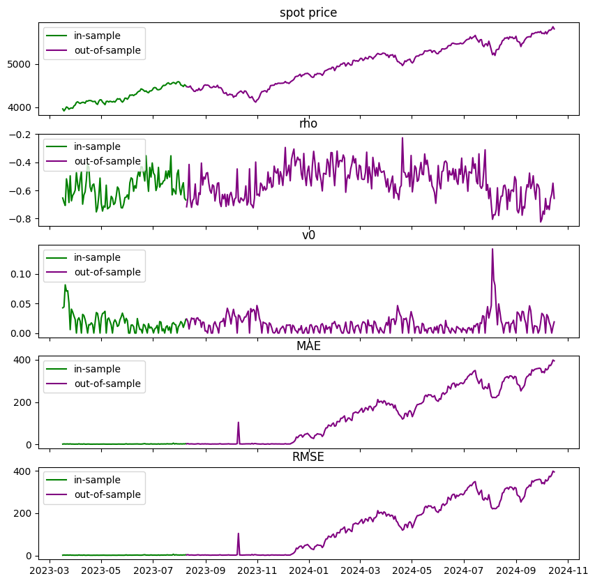
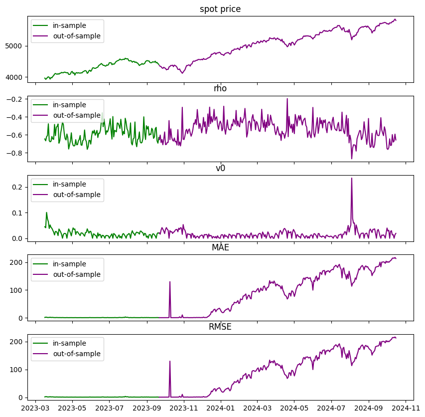
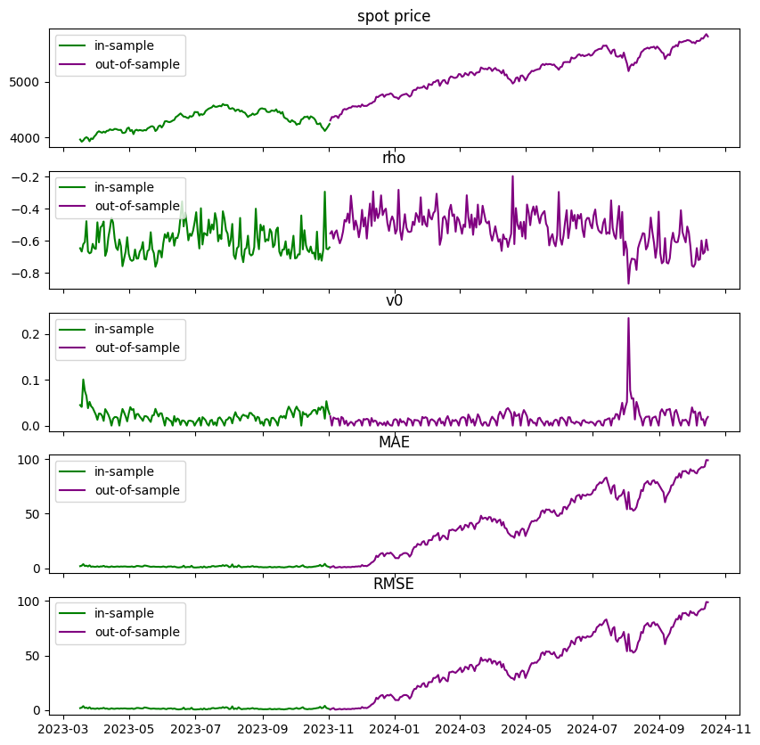
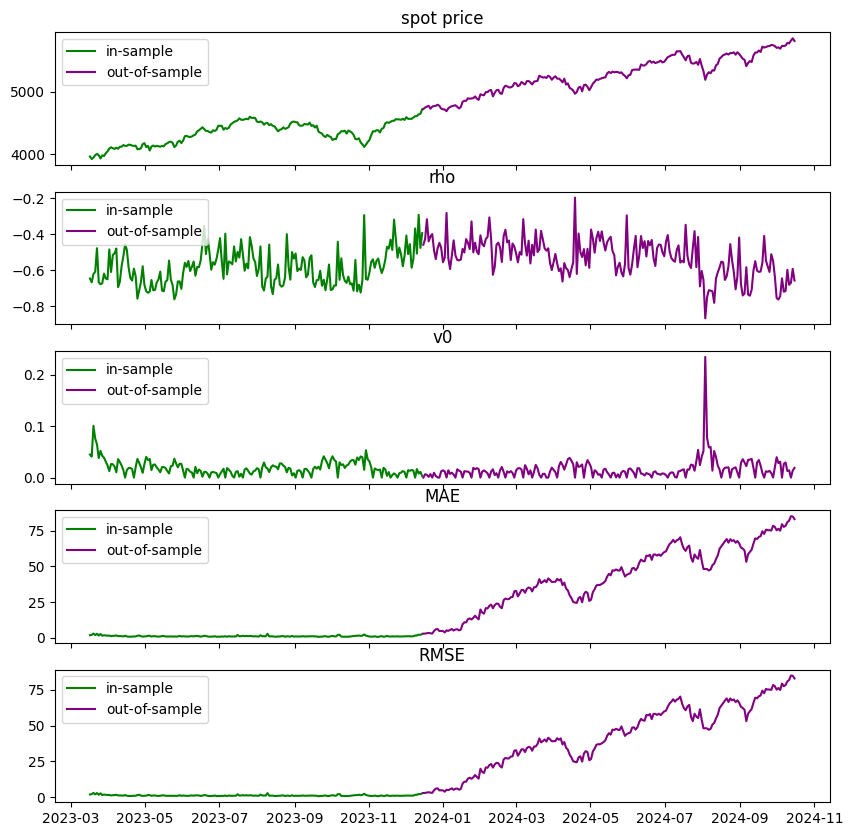
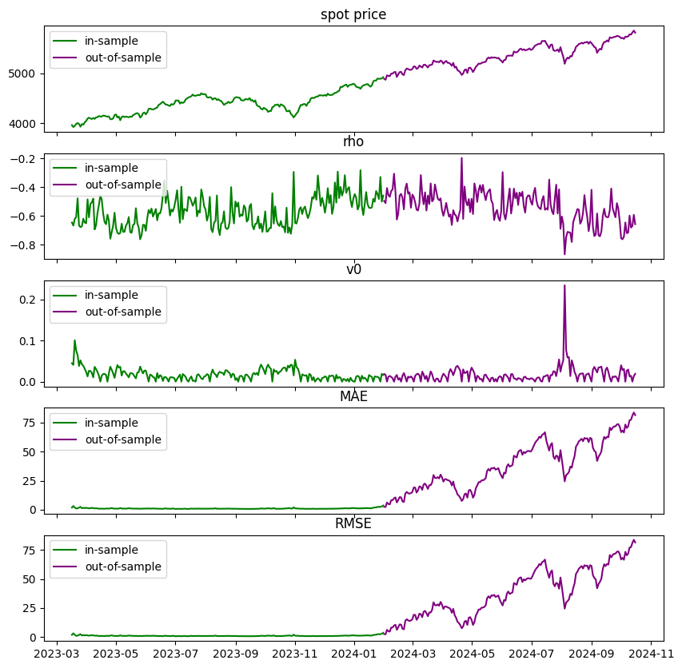
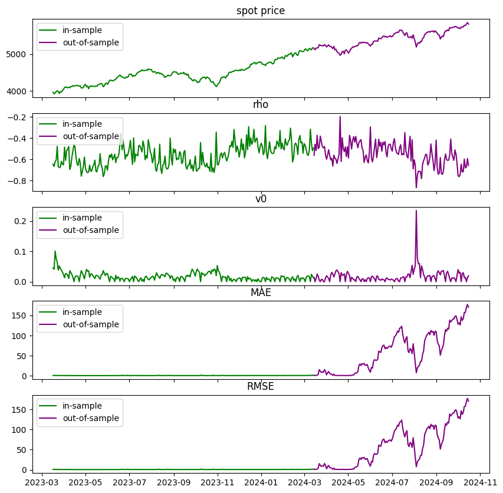
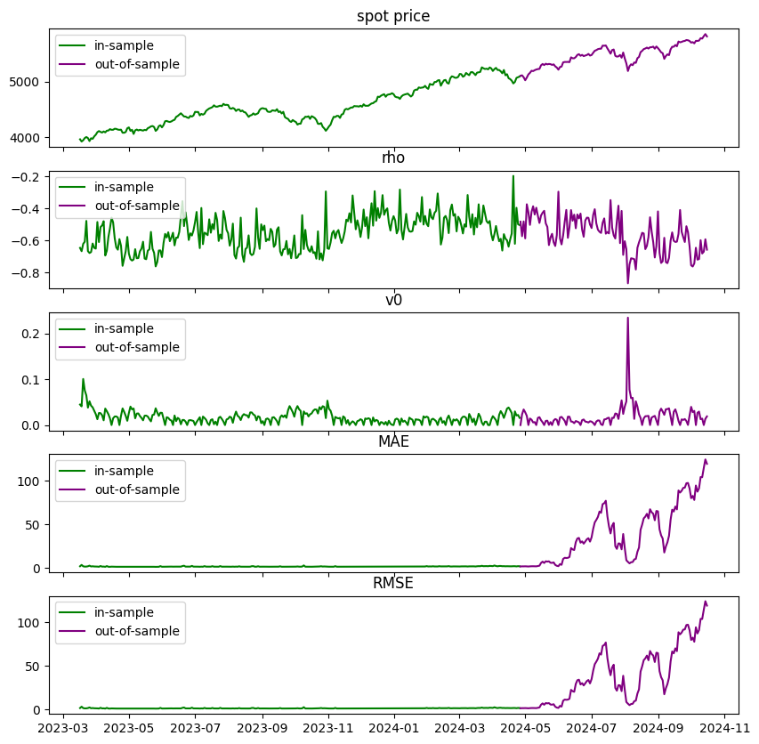
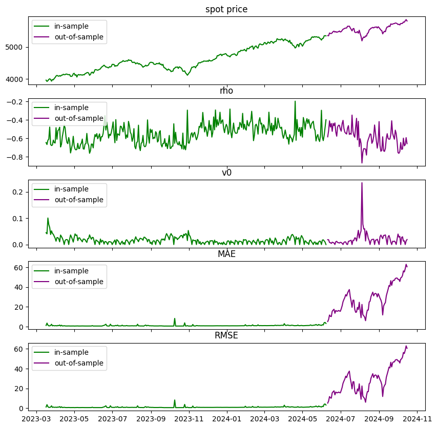
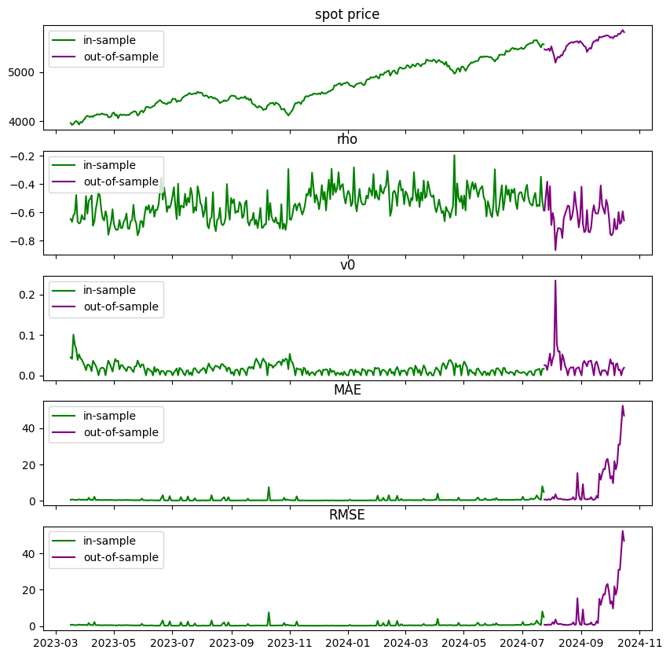
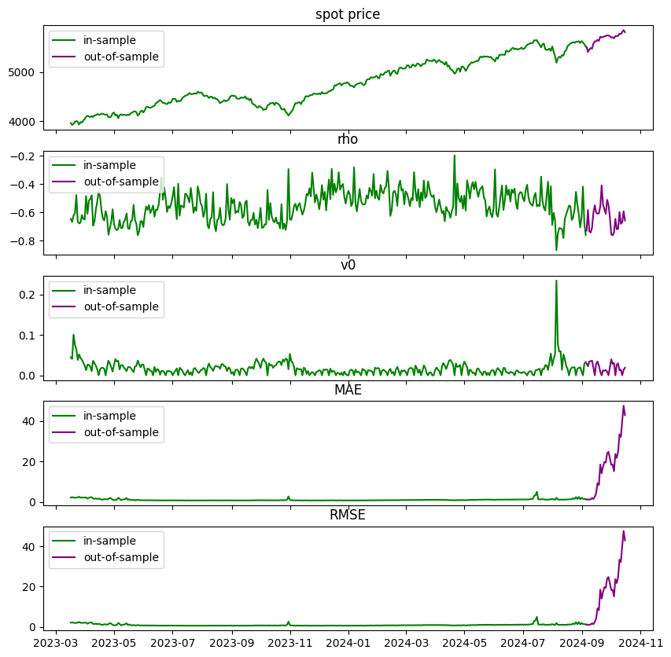

```python
import os
import joblib
import pandas as pd
import numpy as np
import matplotlib.pyplot as plt
from pathlib import Path
```

# functions

# loading model


```python
from model_settings import ms
root = Path().resolve().parent.parent
models_dir = os.path.join(root,ms.trained_models)
models = pd.Series([f for f in os.listdir(models_dir) if f.find('.')==-1])
for i,m in enumerate(models):
    print(f"{i}     {m}")
```

    0     2024_11_01 204910611379 bloomberg barriers
    1     2024_11_01 205356527985 bloomberg asians
    2     2024_11_05 184958719691 Oosterlee test
    3     2024_11_07 124002946108 cboe spx asian
    


```python
selected_model = models.iloc[3]
model_dir = os.path.join(models_dir,selected_model)
pickle = [f for f in os.listdir(model_dir) if f.endswith('.pkl')][0]
picke_dir = os.path.join(model_dir,pickle)
model = joblib.load(picke_dir)
model
```


    {'raw_data':         spot_price  strike_price  days_to_maturity  n_fixings  \
     0           3959.0       1979.00                 7        1.0   
     1           3959.0       1979.00                 7        1.0   
     2           3959.0       2968.75                 7        1.0   
     3           3959.0       2968.75                 7        1.0   
     4           3959.0       4948.25                 7        1.0   
     ...            ...           ...               ...        ...   
     656642      5813.5       5813.00                84        1.0   
     656643      5813.5       7266.50                84        1.0   
     656644      5813.5       7266.50                84        1.0   
     656645      5813.5       8720.00                84        1.0   
     656646      5813.5       8720.00                84        1.0   
     
             fixing_frequency  past_fixings averaging_type     w  risk_free_rate  \
     0                      7             0      geometric  call            0.04   
     1                      7             0     arithmetic  call            0.04   
     2                      7             0      geometric  call            0.04   
     3                      7             0     arithmetic  call            0.04   
     4                      7             0      geometric   put            0.04   
     ...                  ...           ...            ...   ...             ...   
     656642                84             0     arithmetic   put            0.04   
     656643                84             0      geometric   put            0.04   
     656644                84             0     arithmetic   put            0.04   
     656645                84             0      geometric   put            0.04   
     656646                84             0     arithmetic   put            0.04   
     
             dividend_rate         calculation_date     kappa     theta       rho  \
     0                 0.0  2023-03-16 16:04:07.216  3.018196  0.097475 -0.613187   
     1                 0.0  2023-03-16 16:04:07.216  3.018196  0.097475 -0.613187   
     2                 0.0  2023-03-16 16:04:07.216  3.018196  0.097475 -0.613187   
     3                 0.0  2023-03-16 16:04:07.216  3.018196  0.097475 -0.613187   
     4                 0.0  2023-03-16 16:04:07.216  3.018196  0.097475 -0.613187   
     ...               ...                      ...       ...       ...       ...   
     656642            0.0  2024-10-15 16:50:04.131  1.982234  0.087499 -0.657095   
     656643            0.0  2024-10-15 16:50:04.131  1.982234  0.087499 -0.657095   
     656644            0.0  2024-10-15 16:50:04.131  1.982234  0.087499 -0.657095   
     656645            0.0  2024-10-15 16:50:04.131  1.982234  0.087499 -0.657095   
     656646            0.0  2024-10-15 16:50:04.131  1.982234  0.087499 -0.657095   
     
                  eta        v0        date  asian_price  observed_price  
     0       2.478317  0.043614  2023-03-16  1980.121502     1980.121919  
     1       2.478317  0.043614  2023-03-16  1980.396806     1980.397510  
     2       2.478317  0.043614  2023-03-16   991.130471      991.131126  
     3       2.478317  0.043614  2023-03-16   991.405775      991.406642  
     4       2.478317  0.043614  2023-03-16   986.851591      986.851698  
     ...          ...       ...         ...          ...             ...  
     656642  1.705566  0.018946  2024-10-15    71.361056       71.359889  
     656643  1.705566  0.018946  2024-10-15  1417.102748     1417.104940  
     656644  1.705566  0.018946  2024-10-15  1413.687021     1413.687462  
     656645  1.705566  0.018946  2024-10-15  2857.281876     2857.279718  
     656646  1.705566  0.018946  2024-10-15  2853.864967     2853.868259  
     
     [656647 rows x 19 columns],
     'dataset':         spot_price  strike_price  days_to_maturity  n_fixings  \
     0           3959.0       1979.00                 7        1.0   
     1           3959.0       1979.00                 7        1.0   
     2           3959.0       2968.75                 7        1.0   
     3           3959.0       2968.75                 7        1.0   
     4           3959.0       4948.25                 7        1.0   
     ...            ...           ...               ...        ...   
     656642      5813.5       5813.00                84        1.0   
     656643      5813.5       7266.50                84        1.0   
     656644      5813.5       7266.50                84        1.0   
     656645      5813.5       8720.00                84        1.0   
     656646      5813.5       8720.00                84        1.0   
     
             fixing_frequency  past_fixings averaging_type     w  risk_free_rate  \
     0                      7             0      geometric  call            0.04   
     1                      7             0     arithmetic  call            0.04   
     2                      7             0      geometric  call            0.04   
     3                      7             0     arithmetic  call            0.04   
     4                      7             0      geometric   put            0.04   
     ...                  ...           ...            ...   ...             ...   
     656642                84             0     arithmetic   put            0.04   
     656643                84             0      geometric   put            0.04   
     656644                84             0     arithmetic   put            0.04   
     656645                84             0      geometric   put            0.04   
     656646                84             0     arithmetic   put            0.04   
     
             dividend_rate        calculation_date     kappa     theta       rho  \
     0                 0.0 2023-03-16 16:04:07.216  3.018196  0.097475 -0.613187   
     1                 0.0 2023-03-16 16:04:07.216  3.018196  0.097475 -0.613187   
     2                 0.0 2023-03-16 16:04:07.216  3.018196  0.097475 -0.613187   
     3                 0.0 2023-03-16 16:04:07.216  3.018196  0.097475 -0.613187   
     4                 0.0 2023-03-16 16:04:07.216  3.018196  0.097475 -0.613187   
     ...               ...                     ...       ...       ...       ...   
     656642            0.0 2024-10-15 16:50:04.131  1.982234  0.087499 -0.657095   
     656643            0.0 2024-10-15 16:50:04.131  1.982234  0.087499 -0.657095   
     656644            0.0 2024-10-15 16:50:04.131  1.982234  0.087499 -0.657095   
     656645            0.0 2024-10-15 16:50:04.131  1.982234  0.087499 -0.657095   
     656646            0.0 2024-10-15 16:50:04.131  1.982234  0.087499 -0.657095   
     
                  eta        v0       date  asian_price  observed_price  
     0       2.478317  0.043614 2023-03-16  1980.121502     1980.121919  
     1       2.478317  0.043614 2023-03-16  1980.396806     1980.397510  
     2       2.478317  0.043614 2023-03-16   991.130471      991.131126  
     3       2.478317  0.043614 2023-03-16   991.405775      991.406642  
     4       2.478317  0.043614 2023-03-16   986.851591      986.851698  
     ...          ...       ...        ...          ...             ...  
     656642  1.705566  0.018946 2024-10-15    71.361056       71.359889  
     656643  1.705566  0.018946 2024-10-15  1417.102748     1417.104940  
     656644  1.705566  0.018946 2024-10-15  1413.687021     1413.687462  
     656645  1.705566  0.018946 2024-10-15  2857.281876     2857.279718  
     656646  1.705566  0.018946 2024-10-15  2853.864967     2853.868259  
     
     [656647 rows x 19 columns],
     'target_name': 'observed_price',
     'excluded_features': ['barrier_price',
      'asian',
      'observed_price',
      'outin',
      'updown',
      'n_fixings'],
     'numerical_features': ['spot_price',
      'strike_price',
      'days_to_maturity',
      'fixing_frequency',
      'past_fixings',
      'risk_free_rate',
      'dividend_rate',
      'kappa',
      'theta',
      'rho',
      'eta',
      'v0',
      'asian_price'],
     'categorical_features': ['averaging_type', 'w'],
     'feature_set': ['spot_price',
      'strike_price',
      'days_to_maturity',
      'fixing_frequency',
      'past_fixings',
      'risk_free_rate',
      'dividend_rate',
      'kappa',
      'theta',
      'rho',
      'eta',
      'v0',
      'asian_price',
      'averaging_type',
      'w'],
     'n_features': 15,
     'development_dates': 0     2023-03-16
     1     2023-03-17
     2     2023-03-20
     3     2023-03-21
     4     2023-03-22
              ...    
     95    2023-08-02
     96    2023-08-03
     97    2023-08-04
     98    2023-08-07
     99    2023-08-08
     Length: 100, dtype: object,
     'test_dates': 100    2023-08-09
     101    2023-08-10
     102    2023-08-11
     103    2023-08-14
     104    2023-08-15
               ...    
     394    2024-10-09
     395    2024-10-10
     396    2024-10-11
     397    2024-10-14
     398    2024-10-15
     Length: 299, dtype: object,
     'train_data':         spot_price  strike_price  days_to_maturity  n_fixings  \
     0          3959.00       1979.00                 7        1.0   
     341        3960.75       4950.75                84       12.0   
     340        3960.75       4950.75                84       12.0   
     339        3960.75       3960.50                84       12.0   
     338        3960.75       3960.50                84       12.0   
     ...            ...           ...               ...        ...   
     171228     4470.25       3352.50                28        1.0   
     171227     4470.25       3352.50                28        1.0   
     171226     4470.25       2235.00                28        1.0   
     171196     4469.50       2234.00                84        1.0   
     172436     4497.50       6746.00                84        1.0   
     
             fixing_frequency  past_fixings averaging_type     w  risk_free_rate  \
     0                      7             0      geometric  call            0.04   
     341                    7             0     arithmetic   put            0.04   
     340                    7             0      geometric   put            0.04   
     339                    7             0     arithmetic   put            0.04   
     338                    7             0     arithmetic  call            0.04   
     ...                  ...           ...            ...   ...             ...   
     171228                28             0     arithmetic  call            0.04   
     171227                28             0      geometric  call            0.04   
     171226                28             0     arithmetic  call            0.04   
     171196                84             0     arithmetic  call            0.04   
     172436                84             0     arithmetic   put            0.04   
     
             dividend_rate  ...     theta       rho       eta        v0       date  \
     0                 0.0  ...  0.097475 -0.613187  2.478317  0.043614 2023-03-16   
     341               0.0  ...  0.070227 -0.641217  2.173351  0.043379 2023-03-16   
     340               0.0  ...  0.070227 -0.641217  2.173351  0.043379 2023-03-16   
     339               0.0  ...  0.070227 -0.641217  2.173351  0.043379 2023-03-16   
     338               0.0  ...  0.070227 -0.641217  2.173351  0.043379 2023-03-16   
     ...               ...  ...       ...       ...       ...       ...        ...   
     171228            0.0  ...  0.040097 -0.712814  2.314096  0.029393 2023-08-08   
     171227            0.0  ...  0.040097 -0.712814  2.314096  0.029393 2023-08-08   
     171226            0.0  ...  0.040097 -0.712814  2.314096  0.029393 2023-08-08   
     171196            0.0  ...  0.057179 -0.749865  1.819486  0.030833 2023-08-08   
     172436            0.0  ...  0.037897 -0.668246  1.604673  0.023194 2023-08-08   
     
             asian_price observed_price  insample_target  insample_prediction  \
     0       1980.121502    1980.121919      1980.121919          1981.674650   
     341      959.295638     959.295487       959.295487           959.559485   
     340      962.992962     962.993719       962.993719           963.155869   
     339       77.895017      77.894539        77.894539            78.135346   
     338       99.826977      99.823032        99.823032           100.103836   
     ...             ...            ...              ...                  ...   
     171228  1121.178642    1121.181291      1121.181291          1120.085108   
     171227  1120.285606    1120.284114      1120.284114          1119.009773   
     171226  2235.251086    2235.250618      2235.250618          2232.948501   
     171196  2235.090530    2235.091536      2235.091536          2229.577967   
     172436  2207.705724    2207.707605      2207.707605          2212.109097   
     
             insample_error  
     0             1.552731  
     341           0.263998  
     340           0.162151  
     339           0.240807  
     338           0.280804  
     ...                ...  
     171228       -1.096184  
     171227       -1.274341  
     171226       -2.302117  
     171196       -5.513569  
     172436        4.401492  
     
     [172437 rows x 22 columns],
     'test_data':         spot_price  strike_price  days_to_maturity  n_fixings  \
     172437     4497.00       2248.00                 7        1.0   
     173660     4486.75       3364.75                84        1.0   
     173659     4486.75       3364.75                84        1.0   
     173658     4486.75       2243.00                84        1.0   
     173657     4486.75       2243.00                84        1.0   
     ...            ...           ...               ...        ...   
     655466     5841.00       5840.50                84        1.0   
     655465     5841.00       5840.50                84        1.0   
     655464     5841.00       4380.25                84        1.0   
     655475     5841.00       4380.25                 7        1.0   
     656646     5813.50       8720.00                84        1.0   
     
             fixing_frequency  past_fixings averaging_type     w  risk_free_rate  \
     172437                 7             0      geometric  call            0.04   
     173660                84             0     arithmetic  call            0.04   
     173659                84             0      geometric  call            0.04   
     173658                84             0     arithmetic  call            0.04   
     173657                84             0      geometric  call            0.04   
     ...                  ...           ...            ...   ...             ...   
     655466                84             0      geometric   put            0.04   
     655465                84             0      geometric  call            0.04   
     655464                84             0     arithmetic  call            0.04   
     655475                 7             0      geometric  call            0.04   
     656646                84             0     arithmetic   put            0.04   
     
             dividend_rate  ...     theta       rho       eta        v0       date  \
     172437            0.0  ...  0.070852 -0.650763  1.567145  0.020306 2023-08-09   
     173660            0.0  ...  0.052356 -0.691690  1.264150  0.021699 2023-08-09   
     173659            0.0  ...  0.052356 -0.691690  1.264150  0.021699 2023-08-09   
     173658            0.0  ...  0.052356 -0.691690  1.264150  0.021699 2023-08-09   
     173657            0.0  ...  0.052356 -0.691690  1.264150  0.021699 2023-08-09   
     ...               ...  ...       ...       ...       ...       ...        ...   
     655466            0.0  ...  0.040597 -0.564181  2.637817  0.016191 2024-10-15   
     655465            0.0  ...  0.040597 -0.564181  2.637817  0.016191 2024-10-15   
     655464            0.0  ...  0.040597 -0.564181  2.637817  0.016191 2024-10-15   
     655475            0.0  ...  0.040597 -0.564181  2.637817  0.016191 2024-10-15   
     656646            0.0  ...  0.087499 -0.657095  1.705566  0.018946 2024-10-15   
     
             asian_price observed_price  outofsample_target  \
     172437  2249.237160    2249.237093         2249.237093   
     173660  1132.112451    1132.109864         1132.109864   
     173659  1129.932345    1129.930797         1129.930797   
     173658  2243.441603    2243.439640         2243.439640   
     173657  2241.168507    2241.167924         2241.167924   
     ...             ...            ...                 ...   
     655466    72.177629      72.179840           72.179840   
     655465    94.683075      94.683739           94.683739   
     655464  1473.314260    1473.313991         1473.313991   
     655475  1462.230563    1462.229434         1462.229434   
     656646  2853.864967    2853.868259         2853.868259   
     
             outofsample_prediction  outofsample_error  
     172437             2246.809795          -2.427298  
     173660             1131.225731          -0.884133  
     173659             1129.362658          -0.568138  
     173658             2240.128503          -3.311137  
     173657             2237.816239          -3.351685  
     ...                        ...                ...  
     655466              101.117275          28.937435  
     655465              114.147650          19.463911  
     655464             2115.670768         642.356777  
     655475             2103.561816         641.332381  
     656646             2822.359461         -31.508798  
     
     [484210 rows x 22 columns],
     'train_X':         spot_price  strike_price  days_to_maturity  fixing_frequency  \
     0          3959.00       1979.00                 7                 7   
     341        3960.75       4950.75                84                 7   
     340        3960.75       4950.75                84                 7   
     339        3960.75       3960.50                84                 7   
     338        3960.75       3960.50                84                 7   
     ...            ...           ...               ...               ...   
     171228     4470.25       3352.50                28                28   
     171227     4470.25       3352.50                28                28   
     171226     4470.25       2235.00                28                28   
     171196     4469.50       2234.00                84                84   
     172436     4497.50       6746.00                84                84   
     
             past_fixings  risk_free_rate  dividend_rate     kappa     theta  \
     0                  0            0.04            0.0  3.018196  0.097475   
     341                0            0.04            0.0  4.779983  0.070227   
     340                0            0.04            0.0  4.779983  0.070227   
     339                0            0.04            0.0  4.779983  0.070227   
     338                0            0.04            0.0  4.779983  0.070227   
     ...              ...             ...            ...       ...       ...   
     171228             0            0.04            0.0  7.431173  0.040097   
     171227             0            0.04            0.0  7.431173  0.040097   
     171226             0            0.04            0.0  7.431173  0.040097   
     171196             0            0.04            0.0  2.916940  0.057179   
     172436             0            0.04            0.0  4.043226  0.037897   
     
                  rho       eta        v0  asian_price averaging_type     w  
     0      -0.613187  2.478317  0.043614  1980.121502      geometric  call  
     341    -0.641217  2.173351  0.043379   959.295638     arithmetic   put  
     340    -0.641217  2.173351  0.043379   962.992962      geometric   put  
     339    -0.641217  2.173351  0.043379    77.895017     arithmetic   put  
     338    -0.641217  2.173351  0.043379    99.826977     arithmetic  call  
     ...          ...       ...       ...          ...            ...   ...  
     171228 -0.712814  2.314096  0.029393  1121.178642     arithmetic  call  
     171227 -0.712814  2.314096  0.029393  1120.285606      geometric  call  
     171226 -0.712814  2.314096  0.029393  2235.251086     arithmetic  call  
     171196 -0.749865  1.819486  0.030833  2235.090530     arithmetic  call  
     172436 -0.668246  1.604673  0.023194  2207.705724     arithmetic   put  
     
     [172437 rows x 15 columns],
     'train_y': 0         1980.121919
     341        959.295487
     340        962.993719
     339         77.894539
     338         99.823032
                  ...     
     171228    1121.181291
     171227    1120.284114
     171226    2235.250618
     171196    2235.091536
     172436    2207.707605
     Name: observed_price, Length: 172437, dtype: float64,
     'test_X':         spot_price  strike_price  days_to_maturity  fixing_frequency  \
     172437     4497.00       2248.00                 7                 7   
     173660     4486.75       3364.75                84                84   
     173659     4486.75       3364.75                84                84   
     173658     4486.75       2243.00                84                84   
     173657     4486.75       2243.00                84                84   
     ...            ...           ...               ...               ...   
     655466     5841.00       5840.50                84                84   
     655465     5841.00       5840.50                84                84   
     655464     5841.00       4380.25                84                84   
     655475     5841.00       4380.25                 7                 7   
     656646     5813.50       8720.00                84                84   
     
             past_fixings  risk_free_rate  dividend_rate     kappa     theta  \
     172437             0            0.04            0.0  1.596091  0.070852   
     173660             0            0.04            0.0  2.002502  0.052356   
     173659             0            0.04            0.0  2.002502  0.052356   
     173658             0            0.04            0.0  2.002502  0.052356   
     173657             0            0.04            0.0  2.002502  0.052356   
     ...              ...             ...            ...       ...       ...   
     655466             0            0.04            0.0  9.630364  0.040597   
     655465             0            0.04            0.0  9.630364  0.040597   
     655464             0            0.04            0.0  9.630364  0.040597   
     655475             0            0.04            0.0  9.630364  0.040597   
     656646             0            0.04            0.0  1.982234  0.087499   
     
                  rho       eta        v0  asian_price averaging_type     w  
     172437 -0.650763  1.567145  0.020306  2249.237160      geometric  call  
     173660 -0.691690  1.264150  0.021699  1132.112451     arithmetic  call  
     173659 -0.691690  1.264150  0.021699  1129.932345      geometric  call  
     173658 -0.691690  1.264150  0.021699  2243.441603     arithmetic  call  
     173657 -0.691690  1.264150  0.021699  2241.168507      geometric  call  
     ...          ...       ...       ...          ...            ...   ...  
     655466 -0.564181  2.637817  0.016191    72.177629      geometric   put  
     655465 -0.564181  2.637817  0.016191    94.683075      geometric  call  
     655464 -0.564181  2.637817  0.016191  1473.314260     arithmetic  call  
     655475 -0.564181  2.637817  0.016191  1462.230563      geometric  call  
     656646 -0.657095  1.705566  0.018946  2853.864967     arithmetic   put  
     
     [484210 rows x 15 columns],
     'test_y': 172437    2249.237093
     173660    1132.109864
     173659    1129.930797
     173658    2243.439640
     173657    2241.167924
                  ...     
     655466      72.179840
     655465      94.683739
     655464    1473.313991
     655475    1462.229434
     656646    2853.868259
     Name: observed_price, Length: 484210, dtype: float64,
     'preprocessor': ColumnTransformer(transformers=[('StandardScaler', StandardScaler(),
                                      ['spot_price', 'strike_price',
                                       'days_to_maturity', 'fixing_frequency',
                                       'past_fixings', 'risk_free_rate',
                                       'dividend_rate', 'kappa', 'theta', 'rho',
                                       'eta', 'v0', 'asian_price']),
                                     ('OneHotEncoder',
                                      OneHotEncoder(sparse_output=False),
                                      ['averaging_type', 'w'])]),
     'pipeline': None,
     'model': TransformedTargetRegressor(regressor=Pipeline(steps=[('preprocessor',
                                                           ColumnTransformer(transformers=[('StandardScaler',
                                                                                            StandardScaler(),
                                                                                            ['spot_price',
                                                                                             'strike_price',
                                                                                             'days_to_maturity',
                                                                                             'fixing_frequency',
                                                                                             'past_fixings',
                                                                                             'risk_free_rate',
                                                                                             'dividend_rate',
                                                                                             'kappa',
                                                                                             'theta',
                                                                                             'rho',
                                                                                             'eta',
                                                                                             'v0',
                                                                                             'asian_price']),
                                                                                           ('OneHotEncoder',
                                                                                            OneHotEncoder(sparse_output=False),
                                                                                            ['averaging_type',
                                                                                             'w'])])),
                                                          ('regressor',
                                                           MLPRegressor(alpha=0.01,
                                                                        hidden_layer_sizes=(15,
                                                                                            15),
                                                                        learning_rate='adaptive',
                                                                        learning_rate_init=0.1,
                                                                        max_iter=500,
                                                                        solver='sgd',
                                                                        warm_start=True))]),
                                transformer=StandardScaler()),
     'model_fit': TransformedTargetRegressor(regressor=Pipeline(steps=[('preprocessor',
                                                           ColumnTransformer(transformers=[('StandardScaler',
                                                                                            StandardScaler(),
                                                                                            ['spot_price',
                                                                                             'strike_price',
                                                                                             'days_to_maturity',
                                                                                             'fixing_frequency',
                                                                                             'past_fixings',
                                                                                             'risk_free_rate',
                                                                                             'dividend_rate',
                                                                                             'kappa',
                                                                                             'theta',
                                                                                             'rho',
                                                                                             'eta',
                                                                                             'v0',
                                                                                             'asian_price']),
                                                                                           ('OneHotEncoder',
                                                                                            OneHotEncoder(sparse_output=False),
                                                                                            ['averaging_type',
                                                                                             'w'])])),
                                                          ('regressor',
                                                           MLPRegressor(alpha=0.01,
                                                                        hidden_layer_sizes=(15,
                                                                                            15),
                                                                        learning_rate='adaptive',
                                                                        learning_rate_init=0.1,
                                                                        max_iter=500,
                                                                        solver='sgd',
                                                                        warm_start=True))]),
                                transformer=StandardScaler()),
     'dnn_runtime': 23.878990650177002,
     'numerical_scaler': StandardScaler(),
     'dnn_params': {'alpha': 0.01,
      'hidden_layer_sizes': (15, 15),
      'learning_rate': 'adaptive',
      'learning_rate_init': 0.1,
      'solver': 'sgd',
      'early_stopping': False,
      'max_iter': 500,
      'warm_start': True,
      'tol': 0.0001},
     'transformers': [('StandardScaler',
       StandardScaler(),
       ['spot_price',
        'strike_price',
        'days_to_maturity',
        'fixing_frequency',
        'past_fixings',
        'risk_free_rate',
        'dividend_rate',
        'kappa',
        'theta',
        'rho',
        'eta',
        'v0',
        'asian_price']),
      ('OneHotEncoder',
       OneHotEncoder(sparse_output=False),
       ['averaging_type', 'w'])],
     'regressor': MLPRegressor(alpha=0.01, hidden_layer_sizes=(15, 15), learning_rate='adaptive',
                  learning_rate_init=0.1, max_iter=500, solver='sgd',
                  warm_start=True),
     'dnn_pipeline': Pipeline(steps=[('preprocessor',
                      ColumnTransformer(transformers=[('StandardScaler',
                                                       StandardScaler(),
                                                       ['spot_price', 'strike_price',
                                                        'days_to_maturity',
                                                        'fixing_frequency',
                                                        'past_fixings',
                                                        'risk_free_rate',
                                                        'dividend_rate', 'kappa',
                                                        'theta', 'rho', 'eta', 'v0',
                                                        'asian_price']),
                                                      ('OneHotEncoder',
                                                       OneHotEncoder(sparse_output=False),
                                                       ['averaging_type', 'w'])])),
                     ('regressor',
                      MLPRegressor(alpha=0.01, hidden_layer_sizes=(15, 15),
                                   learning_rate='adaptive', learning_rate_init=0.1,
                                   max_iter=500, solver='sgd', warm_start=True))])}


```python
model['train_data']
```


<div>
<style scoped>
    .dataframe tbody tr th:only-of-type {
        vertical-align: middle;
    }

    .dataframe tbody tr th {
        vertical-align: top;
    }

    .dataframe thead th {
        text-align: right;
    }
</style>
<table border="1" class="dataframe">
  <thead>
    <tr style="text-align: right;">
      <th></th>
      <th>spot_price</th>
      <th>strike_price</th>
      <th>days_to_maturity</th>
      <th>n_fixings</th>
      <th>fixing_frequency</th>
      <th>past_fixings</th>
      <th>averaging_type</th>
      <th>w</th>
      <th>risk_free_rate</th>
      <th>dividend_rate</th>
      <th>...</th>
      <th>theta</th>
      <th>rho</th>
      <th>eta</th>
      <th>v0</th>
      <th>date</th>
      <th>asian_price</th>
      <th>observed_price</th>
      <th>insample_target</th>
      <th>insample_prediction</th>
      <th>insample_error</th>
    </tr>
  </thead>
  <tbody>
    <tr>
      <th>0</th>
      <td>3959.00</td>
      <td>1979.00</td>
      <td>7</td>
      <td>1.0</td>
      <td>7</td>
      <td>0</td>
      <td>geometric</td>
      <td>call</td>
      <td>0.04</td>
      <td>0.0</td>
      <td>...</td>
      <td>0.097475</td>
      <td>-0.613187</td>
      <td>2.478317</td>
      <td>0.043614</td>
      <td>2023-03-16</td>
      <td>1980.121502</td>
      <td>1980.121919</td>
      <td>1980.121919</td>
      <td>1981.674650</td>
      <td>1.552731</td>
    </tr>
    <tr>
      <th>341</th>
      <td>3960.75</td>
      <td>4950.75</td>
      <td>84</td>
      <td>12.0</td>
      <td>7</td>
      <td>0</td>
      <td>arithmetic</td>
      <td>put</td>
      <td>0.04</td>
      <td>0.0</td>
      <td>...</td>
      <td>0.070227</td>
      <td>-0.641217</td>
      <td>2.173351</td>
      <td>0.043379</td>
      <td>2023-03-16</td>
      <td>959.295638</td>
      <td>959.295487</td>
      <td>959.295487</td>
      <td>959.559485</td>
      <td>0.263998</td>
    </tr>
    <tr>
      <th>340</th>
      <td>3960.75</td>
      <td>4950.75</td>
      <td>84</td>
      <td>12.0</td>
      <td>7</td>
      <td>0</td>
      <td>geometric</td>
      <td>put</td>
      <td>0.04</td>
      <td>0.0</td>
      <td>...</td>
      <td>0.070227</td>
      <td>-0.641217</td>
      <td>2.173351</td>
      <td>0.043379</td>
      <td>2023-03-16</td>
      <td>962.992962</td>
      <td>962.993719</td>
      <td>962.993719</td>
      <td>963.155869</td>
      <td>0.162151</td>
    </tr>
    <tr>
      <th>339</th>
      <td>3960.75</td>
      <td>3960.50</td>
      <td>84</td>
      <td>12.0</td>
      <td>7</td>
      <td>0</td>
      <td>arithmetic</td>
      <td>put</td>
      <td>0.04</td>
      <td>0.0</td>
      <td>...</td>
      <td>0.070227</td>
      <td>-0.641217</td>
      <td>2.173351</td>
      <td>0.043379</td>
      <td>2023-03-16</td>
      <td>77.895017</td>
      <td>77.894539</td>
      <td>77.894539</td>
      <td>78.135346</td>
      <td>0.240807</td>
    </tr>
    <tr>
      <th>338</th>
      <td>3960.75</td>
      <td>3960.50</td>
      <td>84</td>
      <td>12.0</td>
      <td>7</td>
      <td>0</td>
      <td>arithmetic</td>
      <td>call</td>
      <td>0.04</td>
      <td>0.0</td>
      <td>...</td>
      <td>0.070227</td>
      <td>-0.641217</td>
      <td>2.173351</td>
      <td>0.043379</td>
      <td>2023-03-16</td>
      <td>99.826977</td>
      <td>99.823032</td>
      <td>99.823032</td>
      <td>100.103836</td>
      <td>0.280804</td>
    </tr>
    <tr>
      <th>...</th>
      <td>...</td>
      <td>...</td>
      <td>...</td>
      <td>...</td>
      <td>...</td>
      <td>...</td>
      <td>...</td>
      <td>...</td>
      <td>...</td>
      <td>...</td>
      <td>...</td>
      <td>...</td>
      <td>...</td>
      <td>...</td>
      <td>...</td>
      <td>...</td>
      <td>...</td>
      <td>...</td>
      <td>...</td>
      <td>...</td>
      <td>...</td>
    </tr>
    <tr>
      <th>171228</th>
      <td>4470.25</td>
      <td>3352.50</td>
      <td>28</td>
      <td>1.0</td>
      <td>28</td>
      <td>0</td>
      <td>arithmetic</td>
      <td>call</td>
      <td>0.04</td>
      <td>0.0</td>
      <td>...</td>
      <td>0.040097</td>
      <td>-0.712814</td>
      <td>2.314096</td>
      <td>0.029393</td>
      <td>2023-08-08</td>
      <td>1121.178642</td>
      <td>1121.181291</td>
      <td>1121.181291</td>
      <td>1120.085108</td>
      <td>-1.096184</td>
    </tr>
    <tr>
      <th>171227</th>
      <td>4470.25</td>
      <td>3352.50</td>
      <td>28</td>
      <td>1.0</td>
      <td>28</td>
      <td>0</td>
      <td>geometric</td>
      <td>call</td>
      <td>0.04</td>
      <td>0.0</td>
      <td>...</td>
      <td>0.040097</td>
      <td>-0.712814</td>
      <td>2.314096</td>
      <td>0.029393</td>
      <td>2023-08-08</td>
      <td>1120.285606</td>
      <td>1120.284114</td>
      <td>1120.284114</td>
      <td>1119.009773</td>
      <td>-1.274341</td>
    </tr>
    <tr>
      <th>171226</th>
      <td>4470.25</td>
      <td>2235.00</td>
      <td>28</td>
      <td>1.0</td>
      <td>28</td>
      <td>0</td>
      <td>arithmetic</td>
      <td>call</td>
      <td>0.04</td>
      <td>0.0</td>
      <td>...</td>
      <td>0.040097</td>
      <td>-0.712814</td>
      <td>2.314096</td>
      <td>0.029393</td>
      <td>2023-08-08</td>
      <td>2235.251086</td>
      <td>2235.250618</td>
      <td>2235.250618</td>
      <td>2232.948501</td>
      <td>-2.302117</td>
    </tr>
    <tr>
      <th>171196</th>
      <td>4469.50</td>
      <td>2234.00</td>
      <td>84</td>
      <td>1.0</td>
      <td>84</td>
      <td>0</td>
      <td>arithmetic</td>
      <td>call</td>
      <td>0.04</td>
      <td>0.0</td>
      <td>...</td>
      <td>0.057179</td>
      <td>-0.749865</td>
      <td>1.819486</td>
      <td>0.030833</td>
      <td>2023-08-08</td>
      <td>2235.090530</td>
      <td>2235.091536</td>
      <td>2235.091536</td>
      <td>2229.577967</td>
      <td>-5.513569</td>
    </tr>
    <tr>
      <th>172436</th>
      <td>4497.50</td>
      <td>6746.00</td>
      <td>84</td>
      <td>1.0</td>
      <td>84</td>
      <td>0</td>
      <td>arithmetic</td>
      <td>put</td>
      <td>0.04</td>
      <td>0.0</td>
      <td>...</td>
      <td>0.037897</td>
      <td>-0.668246</td>
      <td>1.604673</td>
      <td>0.023194</td>
      <td>2023-08-08</td>
      <td>2207.705724</td>
      <td>2207.707605</td>
      <td>2207.707605</td>
      <td>2212.109097</td>
      <td>4.401492</td>
    </tr>
  </tbody>
</table>
<p>172437 rows × 22 columns</p>
</div>


```python
print('model attributes:\n')
for k in model.keys():
    print(k)
```

    model attributes:
    
    raw_data
    dataset
    target_name
    excluded_features
    numerical_features
    categorical_features
    feature_set
    n_features
    development_dates
    test_dates
    train_data
    test_data
    train_X
    train_y
    test_X
    test_y
    preprocessor
    pipeline
    model
    model_fit
    dnn_runtime
    numerical_scaler
    dnn_params
    transformers
    regressor
    dnn_pipeline
    


```python
for col in model['feature_set']:
    print(f"{col.replace("_"," ")}:",f"\n{model['test_data'][col].copy().squeeze().sort_values().drop_duplicates().reset_index(drop=True)}\n")
print()
```

    spot price: 
    0       4106.00
    1       4108.50
    2       4110.75
    3       4112.75
    4       4114.00
             ...   
    3562    5864.25
    3563    5864.50
    3564    5865.00
    3565    5865.50
    3566    5866.50
    Name: spot_price, Length: 3567, dtype: float64
    
    strike price: 
    0       2053.0
    1       2054.0
    2       2055.0
    3       2056.0
    4       2057.0
             ...  
    7505    8795.0
    7506    8796.0
    7507    8797.0
    7508    8798.0
    7509    8799.0
    Name: strike_price, Length: 7510, dtype: float64
    
    days to maturity: 
    0     7
    1    28
    2    84
    Name: days_to_maturity, dtype: int64
    
    fixing frequency: 
    0     7
    1    28
    2    84
    Name: fixing_frequency, dtype: int64
    
    past fixings: 
    0    0
    Name: past_fixings, dtype: int64
    
    risk free rate: 
    0    0.04
    Name: risk_free_rate, dtype: float64
    
    dividend rate: 
    0    0.0
    Name: dividend_rate, dtype: float64
    
    kappa: 
    0         0.000004
    1         0.000238
    2         0.000824
    3         0.001284
    4         0.001362
               ...    
    5486    194.119326
    5487    198.548712
    5488    201.729013
    5489    222.834541
    5490    326.631238
    Name: kappa, Length: 5491, dtype: float64
    
    theta: 
    0         0.011056
    1         0.011549
    2         0.011632
    3         0.011831
    4         0.011890
               ...    
    5486     25.968767
    5487     32.275708
    5488     33.237322
    5489     45.374701
    5490    199.685113
    Name: theta, Length: 5491, dtype: float64
    
    rho: 
    0      -0.878653
    1      -0.869045
    2      -0.866640
    3      -0.862340
    4      -0.861312
              ...   
    5486   -0.197912
    5487   -0.197241
    5488   -0.193686
    5489   -0.186944
    5490   -0.107984
    Name: rho, Length: 5491, dtype: float64
    
    eta: 
    0       1.000078
    1       1.000184
    2       1.001397
    3       1.002052
    4       1.002340
              ...   
    5486    9.199660
    5487    9.237272
    5488    9.305510
    5489    9.450265
    5490    9.846639
    Name: eta, Length: 5491, dtype: float64
    
    v0: 
    0       3.401120e-12
    1       4.845611e-12
    2       5.292657e-12
    3       1.004460e-11
    4       1.131993e-11
                ...     
    5486    1.790538e-01
    5487    1.901946e-01
    5488    1.951745e-01
    5489    2.338909e-01
    5490    2.347798e-01
    Name: v0, Length: 5491, dtype: float64
    
    asian price: 
    0           41.162574
    1           41.221199
    2           41.243964
    3           41.347836
    4           41.359320
                 ...     
    329962    2937.102582
    329963    2937.152195
    329964    2937.286111
    329965    2937.975238
    329966    2938.133931
    Name: asian_price, Length: 329967, dtype: float64
    
    averaging type: 
    0    arithmetic
    1     geometric
    Name: averaging_type, dtype: object
    
    w: 
    0    call
    1     put
    Name: w, dtype: object
    
    
    
from sklearn.inspection import partial_dependence,PartialDependenceDisplay

part_disp_X = train_data[model_fit.feature_names_in_]
fig, ax = plt.subplots(figsize=(12, 6))
disp = PartialDependenceDisplay.from_estimator(model_fit, part_disp_X, ['spot_price','v0'], ax=ax)

```python
def compute_RMSE(diff):
    if len(diff)>0:
        return np.sqrt(np.mean(diff.values**2))
        
def compute_MAE(diff):
    if len(diff)>0:
        return np.mean(np.abs(diff.values))

def plot_errors(train_data,test_data):
    test_diff = test_data['outofsample_error']
    train_diff = train_data['insample_error']
    
    test_plot = test_data[['date','spot_price','rho','v0']].copy()
    test_plot = test_plot.reset_index().set_index('date')
    test_plot['MAE'] = test_diff.resample('D').apply(compute_RMSE)
    test_plot['RMSE'] = test_diff.resample('D').apply(compute_RMSE)
    test_plot = test_plot.reset_index()
    test_plot = test_plot.drop_duplicates(subset=['date'],keep='last').set_index('date').drop(columns='calculation_date')
    
    train_plot = train_data[['date','spot_price','rho','v0']].copy()
    train_plot = train_plot.reset_index().set_index('date')
    train_plot['MAE'] = train_diff.resample('D').apply(compute_RMSE)
    train_plot['RMSE'] = train_diff.resample('D').apply(compute_RMSE)
    train_plot = train_plot.reset_index()
    train_plot = train_plot.drop_duplicates(subset=['date'],keep='last').set_index('date').drop(columns='calculation_date')

    
    trainx = pd.date_range(start=min(train_data.index),end=max(train_data.index),periods=train_plot.shape[0])
    testx = pd.date_range(start=min(test_data.index),end=max(test_data.index),periods=test_plot.shape[0])

    train_plot.index = trainx
    test_plot.index = testx
    
    
    fig,axs = plt.subplots(max(len(train_plot.columns),len(test_plot.columns)),figsize=(10,10),sharex=True)
    for i,col in enumerate(train_plot.columns):
        axs[i].plot(train_plot[col],color='green',label='in-sample')
        axs[i].set_title(col.replace('_',' '))
        axs[i].legend()
    for i,col in enumerate(test_plot.columns):
        axs[i].plot(test_plot[col],color='purple',label='out-of-sample')
        axs[i].set_title(col.replace('_',' '))
        axs[i].legend()
    plt.show()


train_data = model['train_data'].copy()
test_data = model['test_data'].copy()
train_data['calculation_date'] = pd.to_datetime(train_data['calculation_date'],format='mixed')
test_data['calculation_date'] = pd.to_datetime(test_data['calculation_date'],format='mixed')
test_data = test_data.set_index('calculation_date').sort_index()
train_data = train_data.set_index('calculation_date').sort_index()
plot_errors(train_data,test_data)
```


    

    


# retraining


```python
from convsklearn import convsklearn
help(convsklearn)
```

    Help on class convsklearn in module convsklearn.convsklearn:
    
    class convsklearn(builtins.object)
     |  convsklearn(target_name='observed_price', excluded_features=['barrier_price', 'asian', 'observed_price', 'outin', 'updown', 'n_fixings'])
     |
     |  a proprietary class of convenience wrappers for sklearn
     |
     |  Methods defined here:
     |
     |  __init__(self, target_name='observed_price', excluded_features=['barrier_price', 'asian', 'observed_price', 'outin', 'updown', 'n_fixings'])
     |      Initialize self.  See help(type(self)) for accurate signature.
     |
     |  load_data(self, data)
     |
     |  preprocess_data(self, development_dates, test_dates, plot=True)
     |
     |  run_dnn(self, print_details=True)
     |
     |  test_prediction_accuracy(self)
     |
     |  ----------------------------------------------------------------------
     |  Data descriptors defined here:
     |
     |  __dict__
     |      dictionary for instance variables
     |
     |  __weakref__
     |      list of weak references to the object
    
    


```python
retraining_frequency = 30 #days
test_dates = model['test_dates']
full_dataset = model['dataset']
models = {}
for i, date in enumerate(test_dates):
    development_dates = pd.concat([model['development_dates'],test_dates[:(i+1)*retraining_frequency]])
    subset_test_dates = test_dates[~test_dates.isin(development_dates)]
    if development_dates.shape == 0:
        break
    try:
        retrainer = convsklearn()
        retrainer.load_data(full_dataset)
        retrainer.preprocess_data(development_dates, subset_test_dates,plot=False)
        retrainer.run_dnn()
        retrainer.test_prediction_accuracy()
        models[date] = retrainer.__dict__
        plot_errors(retrainer.train_data.set_index('calculation_date'),retrainer.test_data.set_index('calculation_date'))
        print()
    except Exception as e:
        if str(e).find('Found array with 0 sample(s)')==-1:
            print(e)
        break
```

    
    training on 221958 samples...
    
    alpha: 0.01
    hidden_layer_sizes: (15, 15)
    learning_rate: adaptive
    learning_rate_init: 0.1
    solver: sgd
    early_stopping: False
    max_iter: 500
    warm_start: True
    tol: 0.0001
    cpu: 32.63132190704346
    
    in sample:
         RMSE: 1.1956919546051796
         MAE: 0.7218231020728721
    
    out of sample:
         RMSE: 119.44668571336227
         MAE: 86.24066704898055
    


    

    


    
    
    training on 278301 samples...
    
    alpha: 0.01
    hidden_layer_sizes: (15, 15)
    learning_rate: adaptive
    learning_rate_init: 0.1
    solver: sgd
    early_stopping: False
    max_iter: 500
    warm_start: True
    tol: 0.0001
    cpu: 42.821656942367554
    
    in sample:
         RMSE: 1.5702147081428517
         MAE: 1.014537668729029
    
    out of sample:
         RMSE: 52.90668499261181
         MAE: 40.04841895394918
    


    

    


    
    
    training on 322950 samples...
    
    alpha: 0.01
    hidden_layer_sizes: (15, 15)
    learning_rate: adaptive
    learning_rate_init: 0.1
    solver: sgd
    early_stopping: False
    max_iter: 500
    warm_start: True
    tol: 0.0001
    cpu: 47.988558292388916
    
    in sample:
         RMSE: 1.2556730721301022
         MAE: 0.8529755689643378
    
    out of sample:
         RMSE: 48.502706308472675
         MAE: 29.558307962139594
    


    

    


    
    
    training on 368860 samples...
    
    alpha: 0.01
    hidden_layer_sizes: (15, 15)
    learning_rate: adaptive
    learning_rate_init: 0.1
    solver: sgd
    early_stopping: False
    max_iter: 500
    warm_start: True
    tol: 0.0001
    cpu: 54.396915912628174
    
    in sample:
         RMSE: 1.143101289540705
         MAE: 0.8279566484342202
    
    out of sample:
         RMSE: 43.54092002460661
         MAE: 35.5037370126748
    


    

    


    
    
    training on 419077 samples...
    
    alpha: 0.01
    hidden_layer_sizes: (15, 15)
    learning_rate: adaptive
    learning_rate_init: 0.1
    solver: sgd
    early_stopping: False
    max_iter: 500
    warm_start: True
    tol: 0.0001
    cpu: 65.2006151676178
    
    in sample:
         RMSE: 0.6478436026885304
         MAE: 0.423263740325762
    
    out of sample:
         RMSE: 79.46880562770967
         MAE: 43.980111647600566
    


    

    


    
    
    training on 471042 samples...
    
    alpha: 0.01
    hidden_layer_sizes: (15, 15)
    learning_rate: adaptive
    learning_rate_init: 0.1
    solver: sgd
    early_stopping: False
    max_iter: 500
    warm_start: True
    tol: 0.0001
    cpu: 73.99574446678162
    
    in sample:
         RMSE: 1.5061326114874838
         MAE: 1.215377211292181
    
    out of sample:
         RMSE: 53.21831294142662
         MAE: 37.65456331287472
    


    

    


    
    
    training on 511848 samples...
    
    alpha: 0.01
    hidden_layer_sizes: (15, 15)
    learning_rate: adaptive
    learning_rate_init: 0.1
    solver: sgd
    early_stopping: False
    max_iter: 500
    warm_start: True
    tol: 0.0001
    cpu: 77.98128175735474
    
    in sample:
         RMSE: 1.2258855675876983
         MAE: 0.7498651411320749
    
    out of sample:
         RMSE: 32.594026611936016
         MAE: 26.334688346620677
    


    

    


    
    
    training on 552467 samples...
    
    alpha: 0.01
    hidden_layer_sizes: (15, 15)
    learning_rate: adaptive
    learning_rate_init: 0.1
    solver: sgd
    early_stopping: False
    max_iter: 500
    warm_start: True
    tol: 0.0001
    cpu: 79.65702056884766
    
    in sample:
         RMSE: 1.040089556265406
         MAE: 0.35994618393525807
    
    out of sample:
         RMSE: 14.888472654057425
         MAE: 5.511227405254607
    


    

    


    
    
    training on 604137 samples...
    
    alpha: 0.01
    hidden_layer_sizes: (15, 15)
    learning_rate: adaptive
    learning_rate_init: 0.1
    solver: sgd
    early_stopping: False
    max_iter: 500
    warm_start: True
    tol: 0.0001
    cpu: 83.80694508552551
    
    in sample:
         RMSE: 1.085550291685338
         MAE: 0.7170130398309402
    
    out of sample:
         RMSE: 21.664469928398887
         MAE: 14.005591989924921
    


    

    


    
    
    training on 656647 samples...
    
    alpha: 0.01
    hidden_layer_sizes: (15, 15)
    learning_rate: adaptive
    learning_rate_init: 0.1
    solver: sgd
    early_stopping: False
    max_iter: 500
    warm_start: True
    tol: 0.0001
    cpu: 106.10516500473022
    


```python
pd.concat([model['development_dates'],model['test_dates']])
```


    0      2023-03-16
    1      2023-03-17
    2      2023-03-20
    3      2023-03-21
    4      2023-03-22
              ...    
    394    2024-10-09
    395    2024-10-10
    396    2024-10-11
    397    2024-10-14
    398    2024-10-15
    Length: 399, dtype: object


```python
for k,m in models.items():
    print(k)
    print(m['test_data'].iloc[:,-4:].describe())
    print()
    print('%'*20)
```

    2023-08-09
           observed_price  outofsample_target  outofsample_prediction  \
    count   434689.000000       434689.000000           434689.000000   
    mean      1557.725800         1557.725800             1571.885102   
    std        919.198017          919.198017              869.212176   
    min         41.159813           41.159813               42.061618   
    25%       1114.788312         1114.788312             1114.825378   
    50%       1363.688955         1363.688955             1570.063426   
    75%       2488.197847         2488.197847             2421.288622   
    max       2938.135999         2938.135999             2727.371674   
    
           outofsample_error  
    count      434689.000000  
    mean           14.159302  
    std           118.604626  
    min          -236.921407  
    25%           -64.433924  
    50%            -0.074372  
    75%            98.705670  
    max           658.355953  
    
    %%%%%%%%%%%%%%%%%%%%
    2023-08-10
           observed_price  outofsample_target  outofsample_prediction  \
    count   378346.000000       378346.000000           378346.000000   
    mean      1608.507782         1608.507782             1633.230260   
    std        924.141825          924.141825              896.834145   
    min         43.139266           43.139266               41.810952   
    25%       1191.225350         1191.225350             1211.940833   
    50%       1375.514240         1375.514240             1470.804643   
    75%       2538.211153         2538.211153             2528.995451   
    max       2938.135999         2938.135999             2884.500814   
    
           outofsample_error  
    count      378346.000000  
    mean           24.722478  
    std            46.775230  
    min           -95.033581  
    25%            -6.324670  
    50%            12.874652  
    75%            63.307081  
    max           133.013371  
    
    %%%%%%%%%%%%%%%%%%%%
    2023-08-11
           observed_price  outofsample_target  outofsample_prediction  \
    count   333697.000000       333697.000000           333697.000000   
    mean      1630.847529         1630.847529             1657.357020   
    std        939.967303          939.967303              930.228180   
    min         47.028094           47.028094               35.926772   
    25%       1232.668775         1232.668775             1263.107279   
    50%       1382.334561         1382.334561             1481.118061   
    75%       2569.795921         2569.795921             2566.946533   
    max       2938.135999         2938.135999             2933.643370   
    
           outofsample_error  
    count      333697.000000  
    mean           26.509491  
    std            40.617291  
    min           -25.132900  
    25%            -2.395965  
    50%             3.036716  
    75%            55.261542  
    max           141.771265  
    
    %%%%%%%%%%%%%%%%%%%%
    2023-08-14
           observed_price  outofsample_target  outofsample_prediction  \
    count   287787.000000       287787.000000           287787.000000   
    mean      1643.740873         1643.740873             1649.031523   
    std        958.224549          958.224549              933.097671   
    min         48.967591           48.967591               49.554185   
    25%       1261.910812         1261.910812             1280.663340   
    50%       1388.395288         1388.395288             1457.953121   
    75%       2603.068399         2603.068399             2577.957071   
    max       2938.135999         2938.135999             2850.795602   
    
           outofsample_error  
    count      287787.000000  
    mean            5.290650  
    std            43.218367  
    min           -96.743460  
    25%           -25.062182  
    50%             8.567126  
    75%            33.322705  
    max           114.832807  
    
    %%%%%%%%%%%%%%%%%%%%
    2023-08-15
           observed_price  outofsample_target  outofsample_prediction  \
    count   237570.000000       237570.000000           237570.000000   
    mean      1654.198004         1654.198004             1623.200957   
    std        974.108772          974.108772              930.571798   
    min         49.821138           49.821138               49.718683   
    25%       1282.882152         1282.882152             1282.779233   
    50%       1395.005732         1395.005732             1424.248175   
    75%       2646.224852         2646.224852             2601.704258   
    max       2938.135999         2938.135999             2649.622841   
    
           outofsample_error  
    count      237570.000000  
    mean          -30.997047  
    std            73.174427  
    min          -293.189214  
    25%           -43.689472  
    50%             0.021782  
    75%             7.310629  
    max            45.240897  
    
    %%%%%%%%%%%%%%%%%%%%
    2023-08-16
           observed_price  outofsample_target  outofsample_prediction  \
    count   185605.000000       185605.000000           185605.000000   
    mean      1680.025883         1680.025883             1679.862838   
    std        984.180592          984.180592              956.171754   
    min         50.388514           50.388514               47.273544   
    25%       1310.563081         1310.563081             1310.851429   
    50%       1405.214162         1405.214162             1473.828108   
    75%       2706.545615         2706.545615             2685.280342   
    max       2938.135999         2938.135999             2809.666373   
    
           outofsample_error  
    count      185605.000000  
    mean           -0.163046  
    std            53.218207  
    min          -173.376771  
    25%           -14.843104  
    50%             3.158047  
    75%            29.660011  
    max           121.668095  
    
    %%%%%%%%%%%%%%%%%%%%
    2023-08-17
           observed_price  outofsample_target  outofsample_prediction  \
    count   144799.000000       144799.000000           144799.000000   
    mean      1683.069814         1683.069814             1682.589134   
    std       1005.676151         1005.676151              990.235984   
    min         52.079378           52.079378               44.246356   
    25%       1336.635893         1336.635893             1348.278519   
    50%       1411.679901         1411.679901             1457.129441   
    75%       2739.005818         2739.005818             2717.996718   
    max       2938.135999         2938.135999             2862.839740   
    
           outofsample_error  
    count      144799.000000  
    mean           -0.480680  
    std            32.590595  
    min           -79.895419  
    25%           -21.537274  
    50%            -4.776220  
    75%            23.833618  
    max            79.770038  
    
    %%%%%%%%%%%%%%%%%%%%
    2023-08-18
           observed_price  outofsample_target  outofsample_prediction  \
    count   104180.000000       104180.000000           104180.000000   
    mean      1635.868931         1635.868931             1632.010363   
    std       1032.618274         1032.618274             1027.201090   
    min         52.079378           52.079378               51.828087   
    25%       1320.944766         1320.944766             1321.842077   
    50%       1415.669814         1415.669814             1417.110565   
    75%       2745.624603         2745.624603             2745.503950   
    max       2938.135999         2938.135999             2843.955768   
    
           outofsample_error  
    count      104180.000000  
    mean           -3.858568  
    std            14.379849  
    min           -96.738422  
    25%            -0.453701  
    50%             0.135894  
    75%             1.096299  
    max             9.858792  
    
    %%%%%%%%%%%%%%%%%%%%
    2023-08-21
           observed_price  outofsample_target  outofsample_prediction  \
    count    52510.000000        52510.000000            52510.000000   
    mean      1688.612104         1688.612104             1692.042958   
    std       1041.205071         1041.205071             1033.387480   
    min         54.154970           54.154970               54.259082   
    25%       1365.215908         1365.215908             1365.149279   
    50%       1436.772564         1436.772564             1469.842994   
    75%       2813.968101         2813.968101             2813.197968   
    max       2938.135999         2938.135999             2882.360334   
    
           outofsample_error  
    count       52510.000000  
    mean            3.430854  
    std            21.391288  
    min           -56.063941  
    25%            -2.119260  
    50%             0.185798  
    75%             6.537229  
    max            73.129294  
    
    %%%%%%%%%%%%%%%%%%%%
    


```python
joblib.dump(models,'asian_options_retraining_test.pkl')
```


    ['asian_options_retraining_test.pkl']


