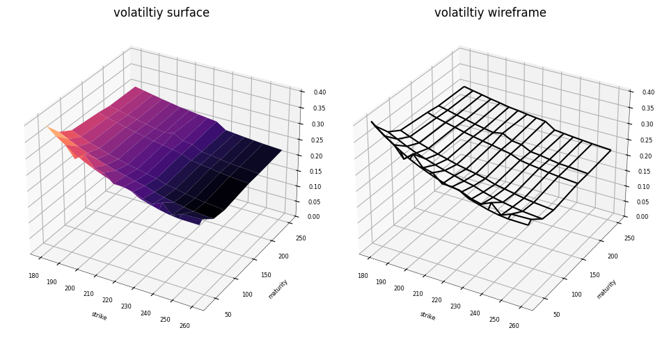
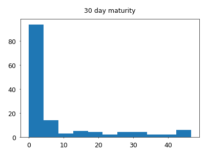
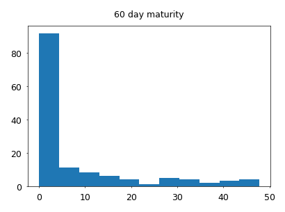
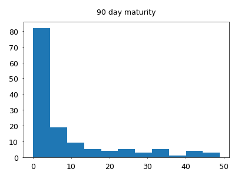
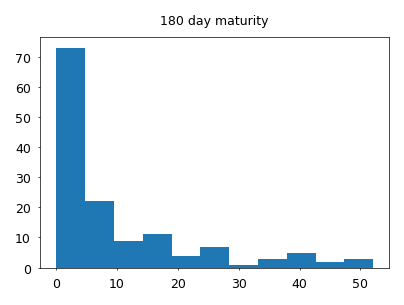
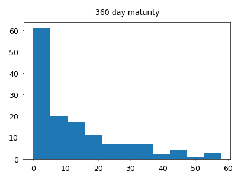
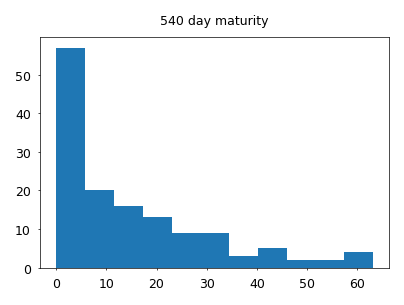
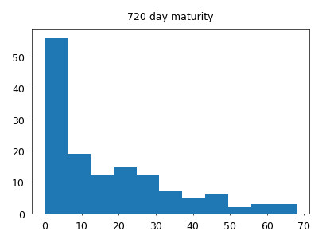

```python
import os
import sys
import requests
import pandas as pd
import numpy as np
import QuantLib as ql
from pathlib import Path
import matplotlib.pyplot as plt
from tqdm import tqdm
from itertools import product
from datetime import datetime
from datetime import timedelta
import model_settings
help(model_settings)
from model_settings import ms
from historical_av_plot_vol_surface import plot_vol_surface
fontsize=6
plt.rcParams.update(
    {
        'axes.labelsize': fontsize,
        'xtick.labelsize': fontsize,
        'ytick.labelsize': fontsize,
        'figure.titlesize': fontsize,
        'axes.linewidth': 1/3,
    }
)
search_symbol = 'AAPL'
url = f"https://www.alphavantage.co/query?function=SYMBOL_SEARCH&keywords={search_symbol}&apikey={ms.av_key}"
r = requests.get(url)
data = r.json()
pd.DataFrame(data['bestMatches'])
```

    
    pricing settings:
    Actual/365 (Fixed) day counter
    New York stock exchange calendar
    compounding: continuous
    frequency: annual
    
    Help on package model_settings:
    
    NAME
        model_settings - a proprietary package of convenience wrappers for QuantLib
    
    PACKAGE CONTENTS
        model_settings
    
    DATA
        ms = <model_settings.model_settings.model_settings object>
    
    FILE
        e:\python\lib\site-packages\model_settings\__init__.py
    
    
    


<div>
<style scoped>
    .dataframe tbody tr th:only-of-type {
        vertical-align: middle;
    }

    .dataframe tbody tr th {
        vertical-align: top;
    }

    .dataframe thead th {
        text-align: right;
    }
</style>
<table border="1" class="dataframe">
  <thead>
    <tr style="text-align: right;">
      <th></th>
      <th>1. symbol</th>
      <th>2. name</th>
      <th>3. type</th>
      <th>4. region</th>
      <th>5. marketOpen</th>
      <th>6. marketClose</th>
      <th>7. timezone</th>
      <th>8. currency</th>
      <th>9. matchScore</th>
    </tr>
  </thead>
  <tbody>
    <tr>
      <th>0</th>
      <td>AAPL</td>
      <td>Apple Inc</td>
      <td>Equity</td>
      <td>United States</td>
      <td>09:30</td>
      <td>16:00</td>
      <td>UTC-04</td>
      <td>USD</td>
      <td>1.0000</td>
    </tr>
    <tr>
      <th>1</th>
      <td>AAPL34.SAO</td>
      <td>Apple Inc</td>
      <td>Equity</td>
      <td>Brazil/Sao Paolo</td>
      <td>10:00</td>
      <td>17:30</td>
      <td>UTC-03</td>
      <td>BRL</td>
      <td>0.6154</td>
    </tr>
    <tr>
      <th>2</th>
      <td>AAPLUSTRAD.BSE</td>
      <td>AA Plus Tradelink Ltd</td>
      <td>Equity</td>
      <td>India/Bombay</td>
      <td>09:15</td>
      <td>15:30</td>
      <td>UTC+5.5</td>
      <td>INR</td>
      <td>0.4706</td>
    </tr>
  </tbody>
</table>
</div>


```python
symbol=search_symbol
url = str(
	'https://www.alphavantage.co/query?function=TIME_SERIES_DAILY&symbol='+
	symbol+'&outputsize=full&apikey='+
	ms.av_key)
print(symbol)
r = requests.get(url)
spots = pd.Series(pd.DataFrame(r.json()['Time Series (Daily)']).transpose()['4. close'].squeeze())
spots = pd.to_numeric(spots,errors='coerce')
print(spots)
```

    AAPL
    2024-10-14    231.30
    2024-10-11    227.55
    2024-10-10    229.04
    2024-10-09    229.54
    2024-10-08    225.77
                   ...  
    1999-11-05     88.31
    1999-11-04     83.62
    1999-11-03     81.50
    1999-11-02     80.25
    1999-11-01     77.62
    Name: 4. close, Length: 6278, dtype: float64
    

# example data collection

let us collect a few recent trading days and inspect the data


```python
dates = spots.index
dates = pd.Series(dates[:5])
print(dates)
```

    0    2024-10-14
    1    2024-10-11
    2    2024-10-10
    3    2024-10-09
    4    2024-10-08
    dtype: object
    


```python
from historical_alphaVantage_collection import collect_av_link
chain = {}
bar = tqdm(total=len(dates))
for date in dates:
    spot = float(spots[date])
    link = collect_av_link(date,spot,symbol)
    printdate = datetime.strptime(date, '%Y-%m-%d').strftime('%A, %Y-%m-%d')
    chain[date] = link
    bar.update(1)
bar.close()
```

    100%|████████████████████████████████████████████████████████████████████████████████████| 5/5 [00:06<00:00,  1.20s/it]
    


```python
demo_spots = spots[dates]
demo_spots.index = pd.to_datetime(demo_spots.index, format='%Y-%m-%d')
plt.figure()
plt.plot(demo_spots,color='black')
plt.title(f'{symbol} option data collected')
plt.xticks(rotation=45)
plt.show()
plt.clf()
```


    

    


    <Figure size 640x480 with 0 Axes>


# example calibraion

now why not select the one trading day and porceed with an example calibration of our Heston (1993) model


```python
date = dates[2]
raw_data = chain[date]
calculation_datetime = datetime.strptime(date,'%Y-%m-%d')
calculation_date = ql.Date(
    calculation_datetime.day,
    calculation_datetime.month,
    calculation_datetime.year,
)
notebook_printdate = str(calculation_datetime.strftime('%A, '))+str(calculation_date)
print(notebook_printdate)
```

    Thursday, October 10th, 2024
    

## modelling the volatility surface


```python
df = raw_data.copy()
df['volume'] = pd.to_numeric(df['volume'])
df['implied_volatility'] = pd.to_numeric(df['implied_volatility'])
df['strike'] = pd.to_numeric(df['strike'])
df['volume'] = pd.to_numeric(df['volume'])
df['expiration'] = pd.to_datetime(df['expiration'],format='%Y-%m-%d')
df['date'] = pd.to_datetime(df['date'],format='%Y-%m-%d')
df['days_to_maturity'] = df['expiration'] - df['date']
df['days_to_maturity'] = df['days_to_maturity'] / np.timedelta64(1, 'D')
df['days_to_maturity'] = df['days_to_maturity'].astype('int64')
df = df[(df['days_to_maturity']>=30)&(df['days_to_maturity']<=400)]
df = df[df['volume']>0].copy()
df['spot_price'] = spot
df['moneyness'] = ms.vmoneyness(df['spot_price'],df['strike'],df['type'])
df = df[(df['moneyness']<0)&(df['moneyness']>-0.5)]
indexed = df.copy().set_index(['strike','days_to_maturity'])

T = np.sort(df['days_to_maturity'].unique()).tolist()
K = np.sort(df['strike'].unique()).tolist()
volume_heatmap = pd.DataFrame(
    np.full((len(K), len(T)), np.nan), index=K, columns=T)
for k in K:
    for t in T:
        try:
            volume_heatmap.loc[k,t] = indexed.loc[(k,t),'volume']
        except Exception:
            pass
        
        
hottest_contracts = pd.DataFrame(
    volume_heatmap.unstack().sort_values(
        ascending=False)).head(50).reset_index()
hottest_contracts.columns = ['t','k','volume']
T = np.sort(hottest_contracts['t'].unique()).tolist()
K = np.sort(hottest_contracts['k'].unique()).tolist()

vol_matrix = pd.DataFrame(
    np.full((len(K),len(T)),np.nan),
    index = K,
    columns = T
)
for k in K:
    for t in T:
        try:
            vol_matrix.loc[k,t] = indexed.loc[(k,float(t)),'implied_volatility']
        except Exception:
            pass

vol_matrix = vol_matrix.dropna().copy()
T = vol_matrix.columns.tolist()
K = vol_matrix.index.tolist()

cols_to_map = [
        'contractID', 'symbol', 'expiration', 'type', 'last', 'mark',
        'bid', 'bid_size', 'ask', 'ask_size', 'volume', 'open_interest', 'date',
        'implied_volatility', 'delta', 'gamma', 'theta', 'vega', 'rho',
        'spot_price', 'moneyness'
]
for col in cols_to_map:
    for i,row in hottest_contracts.iterrows():
        hottest_contracts.at[i,col] = indexed.loc[(row['k'],row['t']),col]
        
hottest_contracts = hottest_contracts.rename(
    columns={'t':'days_to_maturity','k':'strike_price'}).copy()

s = float(df['spot_price'].unique()[0])
print(f"\n{symbol} spot price: {s}")
plot_vol_surface(vol_matrix)
vol_matrix
```

    
    AAPL spot price: 225.77
    


    

    


<div>
<style scoped>
    .dataframe tbody tr th:only-of-type {
        vertical-align: middle;
    }

    .dataframe tbody tr th {
        vertical-align: top;
    }

    .dataframe thead th {
        text-align: right;
    }
</style>
<table border="1" class="dataframe">
  <thead>
    <tr style="text-align: right;">
      <th></th>
      <th>36</th>
      <th>43</th>
      <th>71</th>
      <th>99</th>
      <th>162</th>
      <th>189</th>
      <th>253</th>
    </tr>
  </thead>
  <tbody>
    <tr>
      <th>180.0</th>
      <td>0.40702</td>
      <td>0.38659</td>
      <td>0.33934</td>
      <td>0.31540</td>
      <td>0.30733</td>
      <td>0.30138</td>
      <td>0.30016</td>
    </tr>
    <tr>
      <th>185.0</th>
      <td>0.38324</td>
      <td>0.36418</td>
      <td>0.32531</td>
      <td>0.30367</td>
      <td>0.29803</td>
      <td>0.29483</td>
      <td>0.29437</td>
    </tr>
    <tr>
      <th>190.0</th>
      <td>0.36235</td>
      <td>0.34528</td>
      <td>0.31144</td>
      <td>0.29269</td>
      <td>0.29101</td>
      <td>0.28751</td>
      <td>0.28873</td>
    </tr>
    <tr>
      <th>195.0</th>
      <td>0.34299</td>
      <td>0.31068</td>
      <td>0.29940</td>
      <td>0.28385</td>
      <td>0.28431</td>
      <td>0.28111</td>
      <td>0.28278</td>
    </tr>
    <tr>
      <th>200.0</th>
      <td>0.32562</td>
      <td>0.33446</td>
      <td>0.28919</td>
      <td>0.27440</td>
      <td>0.27699</td>
      <td>0.27470</td>
      <td>0.27791</td>
    </tr>
    <tr>
      <th>205.0</th>
      <td>0.31159</td>
      <td>0.30123</td>
      <td>0.27958</td>
      <td>0.26708</td>
      <td>0.27105</td>
      <td>0.26891</td>
      <td>0.27242</td>
    </tr>
    <tr>
      <th>210.0</th>
      <td>0.29940</td>
      <td>0.29452</td>
      <td>0.27074</td>
      <td>0.25916</td>
      <td>0.26541</td>
      <td>0.26388</td>
      <td>0.26891</td>
    </tr>
    <tr>
      <th>215.0</th>
      <td>0.28873</td>
      <td>0.26967</td>
      <td>0.26342</td>
      <td>0.25352</td>
      <td>0.26068</td>
      <td>0.26967</td>
      <td>0.26480</td>
    </tr>
    <tr>
      <th>220.0</th>
      <td>0.27912</td>
      <td>0.26906</td>
      <td>0.25550</td>
      <td>0.24727</td>
      <td>0.25519</td>
      <td>0.25428</td>
      <td>0.26114</td>
    </tr>
    <tr>
      <th>225.0</th>
      <td>0.27638</td>
      <td>0.26251</td>
      <td>0.24970</td>
      <td>0.24117</td>
      <td>0.24940</td>
      <td>0.25047</td>
      <td>0.25778</td>
    </tr>
    <tr>
      <th>230.0</th>
      <td>0.25916</td>
      <td>0.24986</td>
      <td>0.23949</td>
      <td>0.23172</td>
      <td>0.23781</td>
      <td>0.23614</td>
      <td>0.23842</td>
    </tr>
    <tr>
      <th>235.0</th>
      <td>0.25062</td>
      <td>0.24284</td>
      <td>0.23172</td>
      <td>0.22653</td>
      <td>0.23309</td>
      <td>0.23324</td>
      <td>0.23522</td>
    </tr>
    <tr>
      <th>240.0</th>
      <td>0.24254</td>
      <td>0.25626</td>
      <td>0.22562</td>
      <td>0.22044</td>
      <td>0.22928</td>
      <td>0.22836</td>
      <td>0.23217</td>
    </tr>
    <tr>
      <th>245.0</th>
      <td>0.23675</td>
      <td>0.22730</td>
      <td>0.22028</td>
      <td>0.21541</td>
      <td>0.22455</td>
      <td>0.22364</td>
      <td>0.22958</td>
    </tr>
    <tr>
      <th>250.0</th>
      <td>0.23324</td>
      <td>0.23964</td>
      <td>0.21571</td>
      <td>0.21114</td>
      <td>0.22135</td>
      <td>0.22211</td>
      <td>0.22699</td>
    </tr>
    <tr>
      <th>260.0</th>
      <td>0.23263</td>
      <td>0.24193</td>
      <td>0.21068</td>
      <td>0.20535</td>
      <td>0.21663</td>
      <td>0.21754</td>
      <td>0.22333</td>
    </tr>
  </tbody>
</table>
</div>


    <Figure size 640x480 with 0 Axes>


## calibrating a Heston (1993) model


```python
vol_matrix = vol_matrix.sort_index().drop_duplicates()
pd.to_numeric(raw_data['last'])
raw_data['date'] = pd.to_datetime(raw_data['date'])
raw_data['expiration'] = pd.to_datetime(raw_data['expiration'])
raw_data['implied_volatility'] = pd.to_numeric(raw_data['implied_volatility']).astype(float)
raw_data['strike'] = pd.to_numeric(raw_data['strike'])
raw_data['last'] = pd.to_numeric(raw_data['last'])
contract_maturities = np.array((raw_data['expiration'] - raw_data['date']) / timedelta(days=1)).astype(int)
raw_data['days_to_maturity'] = contract_maturities

T = vol_matrix.columns.tolist()
K = vol_matrix.index.tolist()
r = 0.04
g = 0.0

ql.Settings.instance().evaluationDate = calculation_date
flat_ts, dividend_ts = ms.ql_ts_rg(r, g, calculation_date)
S_handle = ql.QuoteHandle(ql.SimpleQuote(s))

heston_helpers = []
v0 = 0.01; kappa = 0.2; theta = 0.02; rho = -0.75; eta = 0.5;
process = ql.HestonProcess(
    flat_ts,
    dividend_ts,
    S_handle,
    v0,                # Initial volatility
    kappa,             # Mean reversion speed
    theta,             # Long-run variance (volatility squared)
    eta,               # Volatility of the volatility
    rho                # Correlation between asset and volatility
)
model = ql.HestonModel(process)
engine = ql.AnalyticHestonEngine(model)

for t in T:
    for k in K:
        p = ql.Period(int(t),ql.Days)
        volatility = vol_matrix.loc[k,t]
        helper = ql.HestonModelHelper(
            p, ms.calendar, float(s), k, 
            ql.QuoteHandle(ql.SimpleQuote(volatility)), 
            flat_ts, 
            dividend_ts
            )
        helper.setPricingEngine(engine)
        heston_helpers.append(helper)

lm = ql.LevenbergMarquardt(1e-8, 1e-8, 1e-8)


model.calibrate(heston_helpers, lm,
                  ql.EndCriteria(1000, 50, 1.0e-8,1.0e-8, 1.0e-8))

theta, kappa, eta, rho, v0 = model.params()
heston_parameters = pd.Series(
    [theta, kappa, eta, rho, v0],
    index = ['theta', 'kappa', 'eta', 'rho', 'v0'],
    dtype = float
)
calibration_test_data = raw_data.copy()[['strike','type','last','implied_volatility','days_to_maturity']]
calibration_test_data.columns = ['strike_price','w','market_price','volatility','days_to_maturity']
calibration_test_data['spot_price'] = s
calibration_test_data['risk_free_rate'] = r
calibration_test_data['dividend_rate'] = g
calibration_test_data = calibration_test_data[calibration_test_data['days_to_maturity'].isin(df['days_to_maturity'])]
calibration_test_data[heston_parameters.index.tolist()] = np.tile(heston_parameters,(calibration_test_data.shape[0],1))
calibration_test_data.loc[:,'moneyness'] = ms.vmoneyness(
    calibration_test_data['spot_price'].values,
    calibration_test_data['strike_price'].values,
    calibration_test_data['w'].values)
calibration_test_data['calculation_date'] = calculation_datetime
calibration_test_data['black_scholes'] = ms.vector_black_scholes(calibration_test_data)
calibration_test_data['heston_price'] = ms.vector_heston_price(calibration_test_data)
calibration_test_data.loc[:,'error'] = calibration_test_data['heston_price'].values - calibration_test_data['black_scholes'].values
avg = np.mean(np.abs(calibration_test_data['error']))
print(f"\n{printdate}\n{heston_parameters}\naverage absolute error: {round(avg,3)}")
print(f"calibration testing dataset:\n{calibration_test_data.describe()}")
```

    
    Tuesday, 2024-10-08
    theta    0.065619
    kappa    9.874003
    eta      2.152300
    rho     -0.472365
    v0       0.095979
    dtype: float64
    average absolute error: 0.85
    calibration testing dataset:
           strike_price  market_price   volatility  days_to_maturity  spot_price  \
    count   1242.000000   1242.000000  1242.000000       1242.000000     1242.00   
    mean     190.692432     25.166377     0.404290        156.265700      225.77   
    min        5.000000      0.000000     0.019100         36.000000      225.77   
    25%      120.000000      0.000000     0.234118         71.000000      225.77   
    50%      195.000000      0.460000     0.286365        134.000000      225.77   
    75%      265.000000     23.100000     0.450310        253.000000      225.77   
    max      380.000000    225.720000     4.457380        344.000000      225.77   
    std       94.380821     47.030219     0.401733        103.486437        0.00   
    
           risk_free_rate  dividend_rate         theta        kappa           eta  \
    count         1242.00         1242.0  1.242000e+03  1242.000000  1.242000e+03   
    mean             0.04            0.0  6.561935e-02     9.874003  2.152300e+00   
    min              0.04            0.0  6.561935e-02     9.874003  2.152300e+00   
    25%              0.04            0.0  6.561935e-02     9.874003  2.152300e+00   
    50%              0.04            0.0  6.561935e-02     9.874003  2.152300e+00   
    75%              0.04            0.0  6.561935e-02     9.874003  2.152300e+00   
    max              0.04            0.0  6.561935e-02     9.874003  2.152300e+00   
    std              0.00            0.0  1.388338e-17     0.000000  4.442681e-16   
    
                   rho            v0    moneyness     calculation_date  \
    count  1242.000000  1.242000e+03  1242.000000                 1242   
    mean     -0.472365  9.597875e-02     0.663712  2024-10-10 00:00:00   
    min      -0.472365  9.597875e-02    -0.977854  2024-10-10 00:00:00   
    25%      -0.472365  9.597875e-02    -0.271710  2024-10-10 00:00:00   
    50%      -0.472365  9.597875e-02     0.000006  2024-10-10 00:00:00   
    75%      -0.472365  9.597875e-02     0.373079  2024-10-10 00:00:00   
    max      -0.472365  9.597875e-02    44.154000  2024-10-10 00:00:00   
    std       0.000000  1.388338e-17     3.740638                  NaN   
    
           black_scholes  heston_price        error  
    count    1242.000000   1242.000000  1242.000000  
    mean       44.150923     43.561421    -0.589502  
    min         0.002930      0.000000   -13.550768  
    25%         0.423413      0.508456    -0.203579  
    50%        14.138110     14.080428    -0.010516  
    75%        74.556243     72.786447     0.132774  
    max       220.954984    220.954985     2.632668  
    std        57.234233     56.801149     1.942445  
    

# train data generation
now that we have calibrated our pricing engine, let us proceed with generating 
all real down barrier option contract combinations for this trading day
(i.e., all barriers less than underlying spot price)

```python
strike_spread = 0.2
K = np.linspace(
    int(s*(1-strike_spread)),
    int(s*(1+strike_spread)),
    7
).astype(int).tolist()

barrier_step = 10
down_barriers =  np.linspace(
    s*0.5,
    s*0.99,
    5
).astype(int).tolist()

T = [
    30,60,90,
    180,360,540,720
]
print(f"\n{symbol} spot price:\n     {spot}\n\nstrikes:\n     {K}\n\nbarriers:\n     {down_barriers}\n\nmaturities:\n     {T}\n")
```

    
    AAPL spot price:
         225.77
    
    strikes:
         [180, 195, 210, 225, 240, 255, 270]
    
    barriers:
         [112, 140, 168, 195, 223]
    
    maturities:
         [30, 60, 90, 180, 360, 540, 720]
    
    


```python
print('generating contracts...')
features = pd.DataFrame(
    product(
        [spot],
        K,
        T,
        down_barriers,
        [0.0], # rebate
        ['put','call'],
        [0.04], # risk-free rate
        [0.0], # dividend rate
        [theta], 
        [kappa], 
        [eta], 
        [rho], 
        [v0],
        [calculation_datetime],
        ['Out','In']
    ),
    columns = [
        'spot_price',
        'strike_price',
        'days_to_maturity',
        'barrier',
        'rebate',
        'w',
        'risk_free_rate',
        'dividend_rate',
        'theta', 'kappa', 'eta', 'rho', 'v0',
        'calculation_date',
        'outin',
    ]
)
features['moneyness'] = ms.vmoneyness(features['spot_price'],features['strike_price'],features['w'])
features['barrier_type_name'] = 'Down' + features['outin']
print('contracts generated')
print(f'pricing {features.shape[0]} contracts...')
features['vanilla_price'] = ms.vector_heston_price(features)
features['barrier_price'] = ms.vector_barrier_price(features)
featuresby_t = features.copy().set_index('days_to_maturity')
print('priced!')
```

    generating contracts...
    contracts generated
    pricing 980 contracts...
    priced!
    


```python
for t in T:
    plt.figure(figsize=(3, 2), dpi=150)
    prices= featuresby_t.loc[t,'barrier_price']
    plt.hist(prices,bins=int(np.sqrt(prices.shape[0])))
    plt.tick_params(axis='both', which='major', length=1, width=1/3)  # Thinner tick marks
    plt.title(f'{t} day maturity', fontsize=fontsize)
    plt.show()
    plt.clf()
```


    

    


    <Figure size 640x480 with 0 Axes>


    

    


    <Figure size 640x480 with 0 Axes>


    

    


    <Figure size 640x480 with 0 Axes>


    

    


    <Figure size 640x480 with 0 Axes>


    

    


    <Figure size 640x480 with 0 Axes>


    

    


    <Figure size 640x480 with 0 Axes>


    

    


    <Figure size 640x480 with 0 Axes>


# model training
now that we have a dataset, we can for example, test whether our model is able to predict 
the prices of our two-year barrier options while only having seen the others in training.
naturally, the result will not be great with a small dataset. kindly refer to 
/example_outs/Bloomberg_data_testing/testing.md for analysis of a large historcial dataset.

```python
import convsklearn
help(convsklearn)
```

    Help on package convsklearn:
    
    NAME
        convsklearn - a proprietary package of convenience wrappers for sklearn
    
    PACKAGE CONTENTS
        convsklearn
    
    DATA
        barrier_trainer = <convsklearn.convsklearn.convsklearn object>
        categorical_features = ['barrier_type_name', 'w']
        feature_set = ['spot_price', 'strike_price', 'days_to_maturity', 'risk...
        numerical_features = ['spot_price', 'strike_price', 'days_to_maturity'...
        target_name = 'observed_price'
        target_transformer_pipeline = Pipeline(steps=[('StandardScaler', Stand...
        transformers = [('StandardScaler', StandardScaler(), ['spot_price', 's...
    
    FILE
        e:\python\lib\site-packages\convsklearn\__init__.py
    
    
    


```python
from convsklearn import target_name, numerical_features, categorical_features, transformers, target_transformer_pipeline
```


```python
barrier_trainer = convsklearn.convsklearn(
    target_name=target_name, 
    numerical_features=numerical_features, 
    categorical_features=categorical_features, 
    transformers=transformers, 
    target_transformer_pipeline=target_transformer_pipeline, 
    max_iter=1000
)
```


```python
features['observed_price'] = ms.noisyfier(features.loc[:,'barrier_price']) 
    # apply slight peturbation in the form of a random normal with standard deviation 0.15
train_data = features[features['days_to_maturity']!=720]
test_data = features[features['days_to_maturity']==720]
print(f"train data count: {train_data.shape[0]}")
print(f"test data count: {test_data.shape[0]}")
arrs = barrier_trainer.get_train_test_arrays(train_data,test_data)
train_X = arrs['train_X']
train_y = arrs['train_y']
test_X = arrs['test_X']
test_y = arrs['train_y']
preprocessor = barrier_trainer.preprocess()
dnn_barriers, runtime, specs = barrier_trainer.run_dnn(preprocessor, train_X, train_y)
in_sample, out_of_sample, errors = barrier_trainer.test_prediction_accuracy(dnn_barriers, test_data, train_data)
outsample = out_of_sample.rename(
    columns = {
        'strike_price':'k',
        'days_to_maturity':'t',
        'barrier_type_name':'type',
        'barrier_price':'price',
        'vanilla_price':'vanilla',
        'spot_price':'spot',
        'outofsample_target':'target',
        'outofsample_prediction':'dnn',
        'outofsample_error':'error',
        'barrier':'b'
        }
)
outsample = outsample[[
    'spot', 'k', 'b','price', 'vanilla', 'type', 'w','t', 
    'target', 'dnn', 'error'
]]
print(f"\n{dnn_barriers}")
```

    train data count: 840
    test data count: 140
    
    training...
    
    Deep Neural Network
    hidden layers sizes: (13, 13, 13)
    learning rate: adaptive
    activation: relu
    solver: sgd
    alpha: 0.0001
    
    in sample:
         RSME: 3.0293508187542137
         MAE: 2.1762109626687858
    
    out of sample:
         RSME: 5.663211193488862
         MAE: 4.4408336578022185
    
    TransformedTargetRegressor(regressor=Pipeline(steps=[('preprocessor',
                                                          ColumnTransformer(transformers=[('StandardScaler',
                                                                                           StandardScaler(),
                                                                                           ['spot_price',
                                                                                            'strike_price',
                                                                                            'days_to_maturity',
                                                                                            'risk_free_rate',
                                                                                            'dividend_rate',
                                                                                            'kappa',
                                                                                            'theta',
                                                                                            'rho',
                                                                                            'eta',
                                                                                            'v0',
                                                                                            'barrier']),
                                                                                          ('OneHotEncoder',
                                                                                           OneHotEncoder(sparse_output=False),
                                                                                           ['barrier_type_name',
                                                                                            'w'])])),
                                                         ('regressor',
                                                          MLPRegressor(hidden_layer_sizes=(13,
                                                                                           13,
                                                                                           13),
                                                                       learning_rate='adaptive',
                                                                       max_iter=1000,
                                                                       solver='sgd'))]),
                               transformer=Pipeline(steps=[('StandardScaler',
                                                            StandardScaler())]))
    


```python
pd.set_option("display.float_format", "{:.2f}".format)
pd.set_option("display.max_rows",None)
print(f"\n{outsample.describe()}")
outsample_preview = outsample.copy().sort_values(by=['w','type','k','b'],ascending=False).reset_index(drop=True)
print(f"\n{symbol} down barrier options for {notebook_printdate}")
outsample_preview
```

    
            spot      k      b  price  vanilla      t  target    dnn  error
    count 140.00 140.00 140.00 140.00   140.00 140.00  140.00 140.00 140.00
    mean  225.77 225.00 167.60  16.51    33.02 720.00   16.53  17.05   0.53
    std     0.00  30.11  39.32  17.09    16.75   0.00   17.10  13.85   6.20
    min   225.77 180.00 112.00   0.00     8.76 720.00    0.00  -2.52 -17.76
    25%   225.77 195.00 140.00   1.72    20.63 720.00    1.77   6.59  -4.66
    50%   225.77 225.00 168.00  11.32    30.51 720.00   11.44  12.59   0.25
    75%   225.77 255.00 195.00  25.43    44.38 720.00   25.34  24.22   5.26
    max   225.77 270.00 223.00  68.05    68.19 720.00   68.17  60.21  15.58
    
    AAPL down barrier options for Thursday, October 10th, 2024
    


<div>
<style scoped>
    .dataframe tbody tr th:only-of-type {
        vertical-align: middle;
    }

    .dataframe tbody tr th {
        vertical-align: top;
    }

    .dataframe thead th {
        text-align: right;
    }
</style>
<table border="1" class="dataframe">
  <thead>
    <tr style="text-align: right;">
      <th></th>
      <th>spot</th>
      <th>k</th>
      <th>b</th>
      <th>price</th>
      <th>vanilla</th>
      <th>type</th>
      <th>w</th>
      <th>t</th>
      <th>target</th>
      <th>dnn</th>
      <th>error</th>
    </tr>
  </thead>
  <tbody>
    <tr>
      <th>0</th>
      <td>225.77</td>
      <td>270</td>
      <td>223</td>
      <td>0.05</td>
      <td>44.38</td>
      <td>DownOut</td>
      <td>put</td>
      <td>720</td>
      <td>0.00</td>
      <td>-0.42</td>
      <td>-0.42</td>
    </tr>
    <tr>
      <th>1</th>
      <td>225.77</td>
      <td>270</td>
      <td>195</td>
      <td>2.34</td>
      <td>44.38</td>
      <td>DownOut</td>
      <td>put</td>
      <td>720</td>
      <td>2.23</td>
      <td>5.87</td>
      <td>3.64</td>
    </tr>
    <tr>
      <th>2</th>
      <td>225.77</td>
      <td>270</td>
      <td>168</td>
      <td>8.92</td>
      <td>44.38</td>
      <td>DownOut</td>
      <td>put</td>
      <td>720</td>
      <td>8.91</td>
      <td>12.61</td>
      <td>3.70</td>
    </tr>
    <tr>
      <th>3</th>
      <td>225.77</td>
      <td>270</td>
      <td>140</td>
      <td>19.32</td>
      <td>44.38</td>
      <td>DownOut</td>
      <td>put</td>
      <td>720</td>
      <td>19.13</td>
      <td>24.16</td>
      <td>5.03</td>
    </tr>
    <tr>
      <th>4</th>
      <td>225.77</td>
      <td>270</td>
      <td>112</td>
      <td>30.00</td>
      <td>44.38</td>
      <td>DownOut</td>
      <td>put</td>
      <td>720</td>
      <td>30.21</td>
      <td>24.38</td>
      <td>-5.83</td>
    </tr>
    <tr>
      <th>5</th>
      <td>225.77</td>
      <td>255</td>
      <td>223</td>
      <td>0.02</td>
      <td>35.95</td>
      <td>DownOut</td>
      <td>put</td>
      <td>720</td>
      <td>0.24</td>
      <td>-0.00</td>
      <td>-0.24</td>
    </tr>
    <tr>
      <th>6</th>
      <td>225.77</td>
      <td>255</td>
      <td>195</td>
      <td>1.19</td>
      <td>35.95</td>
      <td>DownOut</td>
      <td>put</td>
      <td>720</td>
      <td>1.32</td>
      <td>6.28</td>
      <td>4.96</td>
    </tr>
    <tr>
      <th>7</th>
      <td>225.77</td>
      <td>255</td>
      <td>168</td>
      <td>5.66</td>
      <td>35.95</td>
      <td>DownOut</td>
      <td>put</td>
      <td>720</td>
      <td>5.67</td>
      <td>12.56</td>
      <td>6.89</td>
    </tr>
    <tr>
      <th>8</th>
      <td>225.77</td>
      <td>255</td>
      <td>140</td>
      <td>13.85</td>
      <td>35.95</td>
      <td>DownOut</td>
      <td>put</td>
      <td>720</td>
      <td>13.81</td>
      <td>20.34</td>
      <td>6.53</td>
    </tr>
    <tr>
      <th>9</th>
      <td>225.77</td>
      <td>255</td>
      <td>112</td>
      <td>22.96</td>
      <td>35.95</td>
      <td>DownOut</td>
      <td>put</td>
      <td>720</td>
      <td>23.07</td>
      <td>19.46</td>
      <td>-3.62</td>
    </tr>
    <tr>
      <th>10</th>
      <td>225.77</td>
      <td>240</td>
      <td>223</td>
      <td>0.00</td>
      <td>28.52</td>
      <td>DownOut</td>
      <td>put</td>
      <td>720</td>
      <td>0.07</td>
      <td>0.13</td>
      <td>0.06</td>
    </tr>
    <tr>
      <th>11</th>
      <td>225.77</td>
      <td>240</td>
      <td>195</td>
      <td>0.48</td>
      <td>28.52</td>
      <td>DownOut</td>
      <td>put</td>
      <td>720</td>
      <td>0.34</td>
      <td>5.56</td>
      <td>5.21</td>
    </tr>
    <tr>
      <th>12</th>
      <td>225.77</td>
      <td>240</td>
      <td>168</td>
      <td>3.23</td>
      <td>28.52</td>
      <td>DownOut</td>
      <td>put</td>
      <td>720</td>
      <td>3.09</td>
      <td>11.77</td>
      <td>8.67</td>
    </tr>
    <tr>
      <th>13</th>
      <td>225.77</td>
      <td>240</td>
      <td>140</td>
      <td>9.35</td>
      <td>28.52</td>
      <td>DownOut</td>
      <td>put</td>
      <td>720</td>
      <td>9.32</td>
      <td>16.61</td>
      <td>7.28</td>
    </tr>
    <tr>
      <th>14</th>
      <td>225.77</td>
      <td>240</td>
      <td>112</td>
      <td>16.92</td>
      <td>28.52</td>
      <td>DownOut</td>
      <td>put</td>
      <td>720</td>
      <td>16.86</td>
      <td>15.39</td>
      <td>-1.47</td>
    </tr>
    <tr>
      <th>15</th>
      <td>225.77</td>
      <td>225</td>
      <td>223</td>
      <td>0.00</td>
      <td>22.11</td>
      <td>DownOut</td>
      <td>put</td>
      <td>720</td>
      <td>0.26</td>
      <td>-1.32</td>
      <td>-1.59</td>
    </tr>
    <tr>
      <th>16</th>
      <td>225.77</td>
      <td>225</td>
      <td>195</td>
      <td>0.14</td>
      <td>22.11</td>
      <td>DownOut</td>
      <td>put</td>
      <td>720</td>
      <td>0.07</td>
      <td>4.54</td>
      <td>4.48</td>
    </tr>
    <tr>
      <th>17</th>
      <td>225.77</td>
      <td>225</td>
      <td>168</td>
      <td>1.58</td>
      <td>22.11</td>
      <td>DownOut</td>
      <td>put</td>
      <td>720</td>
      <td>1.70</td>
      <td>9.66</td>
      <td>7.96</td>
    </tr>
    <tr>
      <th>18</th>
      <td>225.77</td>
      <td>225</td>
      <td>140</td>
      <td>5.84</td>
      <td>22.11</td>
      <td>DownOut</td>
      <td>put</td>
      <td>720</td>
      <td>6.10</td>
      <td>12.42</td>
      <td>6.32</td>
    </tr>
    <tr>
      <th>19</th>
      <td>225.77</td>
      <td>225</td>
      <td>112</td>
      <td>11.90</td>
      <td>22.11</td>
      <td>DownOut</td>
      <td>put</td>
      <td>720</td>
      <td>11.84</td>
      <td>12.50</td>
      <td>0.66</td>
    </tr>
    <tr>
      <th>20</th>
      <td>225.77</td>
      <td>210</td>
      <td>223</td>
      <td>0.00</td>
      <td>16.71</td>
      <td>DownOut</td>
      <td>put</td>
      <td>720</td>
      <td>0.20</td>
      <td>-2.52</td>
      <td>-2.72</td>
    </tr>
    <tr>
      <th>21</th>
      <td>225.77</td>
      <td>210</td>
      <td>195</td>
      <td>0.02</td>
      <td>16.71</td>
      <td>DownOut</td>
      <td>put</td>
      <td>720</td>
      <td>0.00</td>
      <td>4.08</td>
      <td>4.08</td>
    </tr>
    <tr>
      <th>22</th>
      <td>225.77</td>
      <td>210</td>
      <td>168</td>
      <td>0.61</td>
      <td>16.71</td>
      <td>DownOut</td>
      <td>put</td>
      <td>720</td>
      <td>0.47</td>
      <td>7.76</td>
      <td>7.29</td>
    </tr>
    <tr>
      <th>23</th>
      <td>225.77</td>
      <td>210</td>
      <td>140</td>
      <td>3.27</td>
      <td>16.71</td>
      <td>DownOut</td>
      <td>put</td>
      <td>720</td>
      <td>3.14</td>
      <td>10.75</td>
      <td>7.61</td>
    </tr>
    <tr>
      <th>24</th>
      <td>225.77</td>
      <td>210</td>
      <td>112</td>
      <td>7.89</td>
      <td>16.71</td>
      <td>DownOut</td>
      <td>put</td>
      <td>720</td>
      <td>8.07</td>
      <td>10.75</td>
      <td>2.68</td>
    </tr>
    <tr>
      <th>25</th>
      <td>225.77</td>
      <td>195</td>
      <td>223</td>
      <td>0.00</td>
      <td>12.29</td>
      <td>DownOut</td>
      <td>put</td>
      <td>720</td>
      <td>0.00</td>
      <td>-1.06</td>
      <td>-1.06</td>
    </tr>
    <tr>
      <th>26</th>
      <td>225.77</td>
      <td>195</td>
      <td>195</td>
      <td>0.00</td>
      <td>12.29</td>
      <td>DownOut</td>
      <td>put</td>
      <td>720</td>
      <td>0.02</td>
      <td>6.94</td>
      <td>6.92</td>
    </tr>
    <tr>
      <th>27</th>
      <td>225.77</td>
      <td>195</td>
      <td>168</td>
      <td>0.16</td>
      <td>12.29</td>
      <td>DownOut</td>
      <td>put</td>
      <td>720</td>
      <td>0.00</td>
      <td>8.02</td>
      <td>8.02</td>
    </tr>
    <tr>
      <th>28</th>
      <td>225.77</td>
      <td>195</td>
      <td>140</td>
      <td>1.56</td>
      <td>12.29</td>
      <td>DownOut</td>
      <td>put</td>
      <td>720</td>
      <td>1.47</td>
      <td>9.98</td>
      <td>8.50</td>
    </tr>
    <tr>
      <th>29</th>
      <td>225.77</td>
      <td>195</td>
      <td>112</td>
      <td>4.84</td>
      <td>12.29</td>
      <td>DownOut</td>
      <td>put</td>
      <td>720</td>
      <td>4.79</td>
      <td>9.85</td>
      <td>5.06</td>
    </tr>
    <tr>
      <th>30</th>
      <td>225.77</td>
      <td>180</td>
      <td>223</td>
      <td>0.00</td>
      <td>8.76</td>
      <td>DownOut</td>
      <td>put</td>
      <td>720</td>
      <td>0.00</td>
      <td>1.45</td>
      <td>1.45</td>
    </tr>
    <tr>
      <th>31</th>
      <td>225.77</td>
      <td>180</td>
      <td>195</td>
      <td>0.00</td>
      <td>8.76</td>
      <td>DownOut</td>
      <td>put</td>
      <td>720</td>
      <td>0.00</td>
      <td>10.76</td>
      <td>10.76</td>
    </tr>
    <tr>
      <th>32</th>
      <td>225.77</td>
      <td>180</td>
      <td>168</td>
      <td>0.02</td>
      <td>8.76</td>
      <td>DownOut</td>
      <td>put</td>
      <td>720</td>
      <td>0.24</td>
      <td>11.65</td>
      <td>11.41</td>
    </tr>
    <tr>
      <th>33</th>
      <td>225.77</td>
      <td>180</td>
      <td>140</td>
      <td>0.58</td>
      <td>8.76</td>
      <td>DownOut</td>
      <td>put</td>
      <td>720</td>
      <td>0.69</td>
      <td>11.51</td>
      <td>10.83</td>
    </tr>
    <tr>
      <th>34</th>
      <td>225.77</td>
      <td>180</td>
      <td>112</td>
      <td>2.66</td>
      <td>8.76</td>
      <td>DownOut</td>
      <td>put</td>
      <td>720</td>
      <td>2.84</td>
      <td>10.68</td>
      <td>7.84</td>
    </tr>
    <tr>
      <th>35</th>
      <td>225.77</td>
      <td>270</td>
      <td>223</td>
      <td>44.32</td>
      <td>44.38</td>
      <td>DownIn</td>
      <td>put</td>
      <td>720</td>
      <td>44.41</td>
      <td>41.80</td>
      <td>-2.61</td>
    </tr>
    <tr>
      <th>36</th>
      <td>225.77</td>
      <td>270</td>
      <td>195</td>
      <td>42.03</td>
      <td>44.38</td>
      <td>DownIn</td>
      <td>put</td>
      <td>720</td>
      <td>42.07</td>
      <td>41.37</td>
      <td>-0.70</td>
    </tr>
    <tr>
      <th>37</th>
      <td>225.77</td>
      <td>270</td>
      <td>168</td>
      <td>35.46</td>
      <td>44.38</td>
      <td>DownIn</td>
      <td>put</td>
      <td>720</td>
      <td>35.32</td>
      <td>34.45</td>
      <td>-0.87</td>
    </tr>
    <tr>
      <th>38</th>
      <td>225.77</td>
      <td>270</td>
      <td>140</td>
      <td>25.06</td>
      <td>44.38</td>
      <td>DownIn</td>
      <td>put</td>
      <td>720</td>
      <td>25.23</td>
      <td>25.62</td>
      <td>0.38</td>
    </tr>
    <tr>
      <th>39</th>
      <td>225.77</td>
      <td>270</td>
      <td>112</td>
      <td>14.38</td>
      <td>44.38</td>
      <td>DownIn</td>
      <td>put</td>
      <td>720</td>
      <td>14.44</td>
      <td>22.98</td>
      <td>8.54</td>
    </tr>
    <tr>
      <th>40</th>
      <td>225.77</td>
      <td>255</td>
      <td>223</td>
      <td>35.93</td>
      <td>35.95</td>
      <td>DownIn</td>
      <td>put</td>
      <td>720</td>
      <td>35.91</td>
      <td>37.46</td>
      <td>1.56</td>
    </tr>
    <tr>
      <th>41</th>
      <td>225.77</td>
      <td>255</td>
      <td>195</td>
      <td>34.76</td>
      <td>35.95</td>
      <td>DownIn</td>
      <td>put</td>
      <td>720</td>
      <td>34.43</td>
      <td>36.47</td>
      <td>2.03</td>
    </tr>
    <tr>
      <th>42</th>
      <td>225.77</td>
      <td>255</td>
      <td>168</td>
      <td>30.28</td>
      <td>35.95</td>
      <td>DownIn</td>
      <td>put</td>
      <td>720</td>
      <td>30.25</td>
      <td>28.91</td>
      <td>-1.34</td>
    </tr>
    <tr>
      <th>43</th>
      <td>225.77</td>
      <td>255</td>
      <td>140</td>
      <td>22.09</td>
      <td>35.95</td>
      <td>DownIn</td>
      <td>put</td>
      <td>720</td>
      <td>22.04</td>
      <td>23.50</td>
      <td>1.47</td>
    </tr>
    <tr>
      <th>44</th>
      <td>225.77</td>
      <td>255</td>
      <td>112</td>
      <td>12.98</td>
      <td>35.95</td>
      <td>DownIn</td>
      <td>put</td>
      <td>720</td>
      <td>13.06</td>
      <td>20.25</td>
      <td>7.19</td>
    </tr>
    <tr>
      <th>45</th>
      <td>225.77</td>
      <td>240</td>
      <td>223</td>
      <td>28.50</td>
      <td>28.52</td>
      <td>DownIn</td>
      <td>put</td>
      <td>720</td>
      <td>28.58</td>
      <td>33.30</td>
      <td>4.73</td>
    </tr>
    <tr>
      <th>46</th>
      <td>225.77</td>
      <td>240</td>
      <td>195</td>
      <td>28.02</td>
      <td>28.52</td>
      <td>DownIn</td>
      <td>put</td>
      <td>720</td>
      <td>28.08</td>
      <td>29.79</td>
      <td>1.70</td>
    </tr>
    <tr>
      <th>47</th>
      <td>225.77</td>
      <td>240</td>
      <td>168</td>
      <td>25.28</td>
      <td>28.52</td>
      <td>DownIn</td>
      <td>put</td>
      <td>720</td>
      <td>25.22</td>
      <td>22.55</td>
      <td>-2.67</td>
    </tr>
    <tr>
      <th>48</th>
      <td>225.77</td>
      <td>240</td>
      <td>140</td>
      <td>19.15</td>
      <td>28.52</td>
      <td>DownIn</td>
      <td>put</td>
      <td>720</td>
      <td>19.37</td>
      <td>19.10</td>
      <td>-0.27</td>
    </tr>
    <tr>
      <th>49</th>
      <td>225.77</td>
      <td>240</td>
      <td>112</td>
      <td>11.59</td>
      <td>28.52</td>
      <td>DownIn</td>
      <td>put</td>
      <td>720</td>
      <td>11.66</td>
      <td>14.33</td>
      <td>2.67</td>
    </tr>
    <tr>
      <th>50</th>
      <td>225.77</td>
      <td>225</td>
      <td>223</td>
      <td>22.10</td>
      <td>22.11</td>
      <td>DownIn</td>
      <td>put</td>
      <td>720</td>
      <td>22.18</td>
      <td>29.14</td>
      <td>6.96</td>
    </tr>
    <tr>
      <th>51</th>
      <td>225.77</td>
      <td>225</td>
      <td>195</td>
      <td>21.96</td>
      <td>22.11</td>
      <td>DownIn</td>
      <td>put</td>
      <td>720</td>
      <td>22.15</td>
      <td>22.86</td>
      <td>0.71</td>
    </tr>
    <tr>
      <th>52</th>
      <td>225.77</td>
      <td>225</td>
      <td>168</td>
      <td>20.52</td>
      <td>22.11</td>
      <td>DownIn</td>
      <td>put</td>
      <td>720</td>
      <td>20.61</td>
      <td>17.08</td>
      <td>-3.54</td>
    </tr>
    <tr>
      <th>53</th>
      <td>225.77</td>
      <td>225</td>
      <td>140</td>
      <td>16.26</td>
      <td>22.11</td>
      <td>DownIn</td>
      <td>put</td>
      <td>720</td>
      <td>16.03</td>
      <td>11.94</td>
      <td>-4.09</td>
    </tr>
    <tr>
      <th>54</th>
      <td>225.77</td>
      <td>225</td>
      <td>112</td>
      <td>10.20</td>
      <td>22.11</td>
      <td>DownIn</td>
      <td>put</td>
      <td>720</td>
      <td>10.44</td>
      <td>9.77</td>
      <td>-0.66</td>
    </tr>
    <tr>
      <th>55</th>
      <td>225.77</td>
      <td>210</td>
      <td>223</td>
      <td>16.70</td>
      <td>16.71</td>
      <td>DownIn</td>
      <td>put</td>
      <td>720</td>
      <td>16.52</td>
      <td>21.48</td>
      <td>4.97</td>
    </tr>
    <tr>
      <th>56</th>
      <td>225.77</td>
      <td>210</td>
      <td>195</td>
      <td>16.68</td>
      <td>16.71</td>
      <td>DownIn</td>
      <td>put</td>
      <td>720</td>
      <td>16.78</td>
      <td>13.64</td>
      <td>-3.14</td>
    </tr>
    <tr>
      <th>57</th>
      <td>225.77</td>
      <td>210</td>
      <td>168</td>
      <td>16.09</td>
      <td>16.71</td>
      <td>DownIn</td>
      <td>put</td>
      <td>720</td>
      <td>16.21</td>
      <td>10.71</td>
      <td>-5.50</td>
    </tr>
    <tr>
      <th>58</th>
      <td>225.77</td>
      <td>210</td>
      <td>140</td>
      <td>13.44</td>
      <td>16.71</td>
      <td>DownIn</td>
      <td>put</td>
      <td>720</td>
      <td>13.13</td>
      <td>8.47</td>
      <td>-4.66</td>
    </tr>
    <tr>
      <th>59</th>
      <td>225.77</td>
      <td>210</td>
      <td>112</td>
      <td>8.82</td>
      <td>16.71</td>
      <td>DownIn</td>
      <td>put</td>
      <td>720</td>
      <td>8.71</td>
      <td>6.64</td>
      <td>-2.07</td>
    </tr>
    <tr>
      <th>60</th>
      <td>225.77</td>
      <td>195</td>
      <td>223</td>
      <td>12.28</td>
      <td>12.29</td>
      <td>DownIn</td>
      <td>put</td>
      <td>720</td>
      <td>12.35</td>
      <td>11.05</td>
      <td>-1.30</td>
    </tr>
    <tr>
      <th>61</th>
      <td>225.77</td>
      <td>195</td>
      <td>195</td>
      <td>12.28</td>
      <td>12.29</td>
      <td>DownIn</td>
      <td>put</td>
      <td>720</td>
      <td>12.60</td>
      <td>9.36</td>
      <td>-3.24</td>
    </tr>
    <tr>
      <th>62</th>
      <td>225.77</td>
      <td>195</td>
      <td>168</td>
      <td>12.12</td>
      <td>12.29</td>
      <td>DownIn</td>
      <td>put</td>
      <td>720</td>
      <td>11.98</td>
      <td>7.30</td>
      <td>-4.68</td>
    </tr>
    <tr>
      <th>63</th>
      <td>225.77</td>
      <td>195</td>
      <td>140</td>
      <td>10.72</td>
      <td>12.29</td>
      <td>DownIn</td>
      <td>put</td>
      <td>720</td>
      <td>10.45</td>
      <td>4.99</td>
      <td>-5.46</td>
    </tr>
    <tr>
      <th>64</th>
      <td>225.77</td>
      <td>195</td>
      <td>112</td>
      <td>7.45</td>
      <td>12.29</td>
      <td>DownIn</td>
      <td>put</td>
      <td>720</td>
      <td>7.46</td>
      <td>3.50</td>
      <td>-3.96</td>
    </tr>
    <tr>
      <th>65</th>
      <td>225.77</td>
      <td>180</td>
      <td>223</td>
      <td>8.75</td>
      <td>8.76</td>
      <td>DownIn</td>
      <td>put</td>
      <td>720</td>
      <td>8.69</td>
      <td>8.38</td>
      <td>-0.31</td>
    </tr>
    <tr>
      <th>66</th>
      <td>225.77</td>
      <td>180</td>
      <td>195</td>
      <td>8.75</td>
      <td>8.76</td>
      <td>DownIn</td>
      <td>put</td>
      <td>720</td>
      <td>8.74</td>
      <td>6.04</td>
      <td>-2.70</td>
    </tr>
    <tr>
      <th>67</th>
      <td>225.77</td>
      <td>180</td>
      <td>168</td>
      <td>8.73</td>
      <td>8.76</td>
      <td>DownIn</td>
      <td>put</td>
      <td>720</td>
      <td>9.03</td>
      <td>3.83</td>
      <td>-5.20</td>
    </tr>
    <tr>
      <th>68</th>
      <td>225.77</td>
      <td>180</td>
      <td>140</td>
      <td>8.17</td>
      <td>8.76</td>
      <td>DownIn</td>
      <td>put</td>
      <td>720</td>
      <td>8.11</td>
      <td>1.52</td>
      <td>-6.59</td>
    </tr>
    <tr>
      <th>69</th>
      <td>225.77</td>
      <td>180</td>
      <td>112</td>
      <td>6.10</td>
      <td>8.76</td>
      <td>DownIn</td>
      <td>put</td>
      <td>720</td>
      <td>6.36</td>
      <td>0.36</td>
      <td>-6.00</td>
    </tr>
    <tr>
      <th>70</th>
      <td>225.77</td>
      <td>270</td>
      <td>223</td>
      <td>2.47</td>
      <td>20.63</td>
      <td>DownOut</td>
      <td>call</td>
      <td>720</td>
      <td>2.36</td>
      <td>2.20</td>
      <td>-0.15</td>
    </tr>
    <tr>
      <th>71</th>
      <td>225.77</td>
      <td>270</td>
      <td>195</td>
      <td>16.22</td>
      <td>20.63</td>
      <td>DownOut</td>
      <td>call</td>
      <td>720</td>
      <td>16.40</td>
      <td>9.48</td>
      <td>-6.92</td>
    </tr>
    <tr>
      <th>72</th>
      <td>225.77</td>
      <td>270</td>
      <td>168</td>
      <td>19.78</td>
      <td>20.63</td>
      <td>DownOut</td>
      <td>call</td>
      <td>720</td>
      <td>19.89</td>
      <td>14.52</td>
      <td>-5.37</td>
    </tr>
    <tr>
      <th>73</th>
      <td>225.77</td>
      <td>270</td>
      <td>140</td>
      <td>20.51</td>
      <td>20.63</td>
      <td>DownOut</td>
      <td>call</td>
      <td>720</td>
      <td>20.52</td>
      <td>13.74</td>
      <td>-6.78</td>
    </tr>
    <tr>
      <th>74</th>
      <td>225.77</td>
      <td>270</td>
      <td>112</td>
      <td>20.61</td>
      <td>20.63</td>
      <td>DownOut</td>
      <td>call</td>
      <td>720</td>
      <td>20.52</td>
      <td>11.05</td>
      <td>-9.47</td>
    </tr>
    <tr>
      <th>75</th>
      <td>225.77</td>
      <td>255</td>
      <td>223</td>
      <td>2.94</td>
      <td>26.07</td>
      <td>DownOut</td>
      <td>call</td>
      <td>720</td>
      <td>2.96</td>
      <td>5.54</td>
      <td>2.58</td>
    </tr>
    <tr>
      <th>76</th>
      <td>225.77</td>
      <td>255</td>
      <td>195</td>
      <td>20.03</td>
      <td>26.07</td>
      <td>DownOut</td>
      <td>call</td>
      <td>720</td>
      <td>20.06</td>
      <td>13.10</td>
      <td>-6.96</td>
    </tr>
    <tr>
      <th>77</th>
      <td>225.77</td>
      <td>255</td>
      <td>168</td>
      <td>24.84</td>
      <td>26.07</td>
      <td>DownOut</td>
      <td>call</td>
      <td>720</td>
      <td>25.03</td>
      <td>23.57</td>
      <td>-1.46</td>
    </tr>
    <tr>
      <th>78</th>
      <td>225.77</td>
      <td>255</td>
      <td>140</td>
      <td>25.89</td>
      <td>26.07</td>
      <td>DownOut</td>
      <td>call</td>
      <td>720</td>
      <td>25.66</td>
      <td>20.94</td>
      <td>-4.72</td>
    </tr>
    <tr>
      <th>79</th>
      <td>225.77</td>
      <td>255</td>
      <td>112</td>
      <td>26.04</td>
      <td>26.07</td>
      <td>DownOut</td>
      <td>call</td>
      <td>720</td>
      <td>26.12</td>
      <td>19.49</td>
      <td>-6.63</td>
    </tr>
    <tr>
      <th>80</th>
      <td>225.77</td>
      <td>240</td>
      <td>223</td>
      <td>3.43</td>
      <td>32.49</td>
      <td>DownOut</td>
      <td>call</td>
      <td>720</td>
      <td>3.47</td>
      <td>8.87</td>
      <td>5.40</td>
    </tr>
    <tr>
      <th>81</th>
      <td>225.77</td>
      <td>240</td>
      <td>195</td>
      <td>24.30</td>
      <td>32.49</td>
      <td>DownOut</td>
      <td>call</td>
      <td>720</td>
      <td>24.24</td>
      <td>18.35</td>
      <td>-5.89</td>
    </tr>
    <tr>
      <th>82</th>
      <td>225.77</td>
      <td>240</td>
      <td>168</td>
      <td>30.74</td>
      <td>32.49</td>
      <td>DownOut</td>
      <td>call</td>
      <td>720</td>
      <td>30.85</td>
      <td>26.25</td>
      <td>-4.60</td>
    </tr>
    <tr>
      <th>83</th>
      <td>225.77</td>
      <td>240</td>
      <td>140</td>
      <td>32.24</td>
      <td>32.49</td>
      <td>DownOut</td>
      <td>call</td>
      <td>720</td>
      <td>32.24</td>
      <td>30.76</td>
      <td>-1.49</td>
    </tr>
    <tr>
      <th>84</th>
      <td>225.77</td>
      <td>240</td>
      <td>112</td>
      <td>32.46</td>
      <td>32.49</td>
      <td>DownOut</td>
      <td>call</td>
      <td>720</td>
      <td>32.51</td>
      <td>27.30</td>
      <td>-5.21</td>
    </tr>
    <tr>
      <th>85</th>
      <td>225.77</td>
      <td>225</td>
      <td>223</td>
      <td>3.94</td>
      <td>39.95</td>
      <td>DownOut</td>
      <td>call</td>
      <td>720</td>
      <td>3.74</td>
      <td>12.40</td>
      <td>8.66</td>
    </tr>
    <tr>
      <th>86</th>
      <td>225.77</td>
      <td>225</td>
      <td>195</td>
      <td>28.92</td>
      <td>39.95</td>
      <td>DownOut</td>
      <td>call</td>
      <td>720</td>
      <td>29.00</td>
      <td>20.67</td>
      <td>-8.33</td>
    </tr>
    <tr>
      <th>87</th>
      <td>225.77</td>
      <td>225</td>
      <td>168</td>
      <td>37.42</td>
      <td>39.95</td>
      <td>DownOut</td>
      <td>call</td>
      <td>720</td>
      <td>37.69</td>
      <td>32.70</td>
      <td>-4.99</td>
    </tr>
    <tr>
      <th>88</th>
      <td>225.77</td>
      <td>225</td>
      <td>140</td>
      <td>39.57</td>
      <td>39.95</td>
      <td>DownOut</td>
      <td>call</td>
      <td>720</td>
      <td>39.50</td>
      <td>37.76</td>
      <td>-1.74</td>
    </tr>
    <tr>
      <th>89</th>
      <td>225.77</td>
      <td>225</td>
      <td>112</td>
      <td>39.90</td>
      <td>39.95</td>
      <td>DownOut</td>
      <td>call</td>
      <td>720</td>
      <td>39.84</td>
      <td>34.96</td>
      <td>-4.88</td>
    </tr>
    <tr>
      <th>90</th>
      <td>225.77</td>
      <td>210</td>
      <td>223</td>
      <td>4.45</td>
      <td>48.41</td>
      <td>DownOut</td>
      <td>call</td>
      <td>720</td>
      <td>4.49</td>
      <td>14.38</td>
      <td>9.90</td>
    </tr>
    <tr>
      <th>91</th>
      <td>225.77</td>
      <td>210</td>
      <td>195</td>
      <td>33.77</td>
      <td>48.41</td>
      <td>DownOut</td>
      <td>call</td>
      <td>720</td>
      <td>33.69</td>
      <td>25.49</td>
      <td>-8.20</td>
    </tr>
    <tr>
      <th>92</th>
      <td>225.77</td>
      <td>210</td>
      <td>168</td>
      <td>44.78</td>
      <td>48.41</td>
      <td>DownOut</td>
      <td>call</td>
      <td>720</td>
      <td>44.87</td>
      <td>38.69</td>
      <td>-6.18</td>
    </tr>
    <tr>
      <th>93</th>
      <td>225.77</td>
      <td>210</td>
      <td>140</td>
      <td>47.86</td>
      <td>48.41</td>
      <td>DownOut</td>
      <td>call</td>
      <td>720</td>
      <td>47.97</td>
      <td>45.39</td>
      <td>-2.58</td>
    </tr>
    <tr>
      <th>94</th>
      <td>225.77</td>
      <td>210</td>
      <td>112</td>
      <td>48.35</td>
      <td>48.41</td>
      <td>DownOut</td>
      <td>call</td>
      <td>720</td>
      <td>48.31</td>
      <td>42.35</td>
      <td>-5.95</td>
    </tr>
    <tr>
      <th>95</th>
      <td>225.77</td>
      <td>195</td>
      <td>223</td>
      <td>4.96</td>
      <td>57.85</td>
      <td>DownOut</td>
      <td>call</td>
      <td>720</td>
      <td>4.99</td>
      <td>17.08</td>
      <td>12.09</td>
    </tr>
    <tr>
      <th>96</th>
      <td>225.77</td>
      <td>195</td>
      <td>195</td>
      <td>38.71</td>
      <td>57.85</td>
      <td>DownOut</td>
      <td>call</td>
      <td>720</td>
      <td>38.38</td>
      <td>31.97</td>
      <td>-6.41</td>
    </tr>
    <tr>
      <th>97</th>
      <td>225.77</td>
      <td>195</td>
      <td>168</td>
      <td>52.65</td>
      <td>57.85</td>
      <td>DownOut</td>
      <td>call</td>
      <td>720</td>
      <td>52.80</td>
      <td>44.33</td>
      <td>-8.47</td>
    </tr>
    <tr>
      <th>98</th>
      <td>225.77</td>
      <td>195</td>
      <td>140</td>
      <td>57.00</td>
      <td>57.85</td>
      <td>DownOut</td>
      <td>call</td>
      <td>720</td>
      <td>56.68</td>
      <td>53.19</td>
      <td>-3.49</td>
    </tr>
    <tr>
      <th>99</th>
      <td>225.77</td>
      <td>195</td>
      <td>112</td>
      <td>57.76</td>
      <td>57.85</td>
      <td>DownOut</td>
      <td>call</td>
      <td>720</td>
      <td>57.91</td>
      <td>49.76</td>
      <td>-8.16</td>
    </tr>
    <tr>
      <th>100</th>
      <td>225.77</td>
      <td>180</td>
      <td>223</td>
      <td>5.47</td>
      <td>68.19</td>
      <td>DownOut</td>
      <td>call</td>
      <td>720</td>
      <td>5.15</td>
      <td>20.73</td>
      <td>15.58</td>
    </tr>
    <tr>
      <th>101</th>
      <td>225.77</td>
      <td>180</td>
      <td>195</td>
      <td>43.68</td>
      <td>68.19</td>
      <td>DownOut</td>
      <td>call</td>
      <td>720</td>
      <td>43.70</td>
      <td>37.64</td>
      <td>-6.05</td>
    </tr>
    <tr>
      <th>102</th>
      <td>225.77</td>
      <td>180</td>
      <td>168</td>
      <td>60.84</td>
      <td>68.19</td>
      <td>DownOut</td>
      <td>call</td>
      <td>720</td>
      <td>61.18</td>
      <td>50.28</td>
      <td>-10.91</td>
    </tr>
    <tr>
      <th>103</th>
      <td>225.77</td>
      <td>180</td>
      <td>140</td>
      <td>66.87</td>
      <td>68.19</td>
      <td>DownOut</td>
      <td>call</td>
      <td>720</td>
      <td>66.99</td>
      <td>60.21</td>
      <td>-6.78</td>
    </tr>
    <tr>
      <th>104</th>
      <td>225.77</td>
      <td>180</td>
      <td>112</td>
      <td>68.05</td>
      <td>68.19</td>
      <td>DownOut</td>
      <td>call</td>
      <td>720</td>
      <td>68.17</td>
      <td>56.81</td>
      <td>-11.36</td>
    </tr>
    <tr>
      <th>105</th>
      <td>225.77</td>
      <td>270</td>
      <td>223</td>
      <td>18.16</td>
      <td>20.63</td>
      <td>DownIn</td>
      <td>call</td>
      <td>720</td>
      <td>18.41</td>
      <td>23.19</td>
      <td>4.79</td>
    </tr>
    <tr>
      <th>106</th>
      <td>225.77</td>
      <td>270</td>
      <td>195</td>
      <td>4.41</td>
      <td>20.63</td>
      <td>DownIn</td>
      <td>call</td>
      <td>720</td>
      <td>4.71</td>
      <td>13.93</td>
      <td>9.22</td>
    </tr>
    <tr>
      <th>107</th>
      <td>225.77</td>
      <td>270</td>
      <td>168</td>
      <td>0.85</td>
      <td>20.63</td>
      <td>DownIn</td>
      <td>call</td>
      <td>720</td>
      <td>0.95</td>
      <td>6.50</td>
      <td>5.55</td>
    </tr>
    <tr>
      <th>108</th>
      <td>225.77</td>
      <td>270</td>
      <td>140</td>
      <td>0.12</td>
      <td>20.63</td>
      <td>DownIn</td>
      <td>call</td>
      <td>720</td>
      <td>0.31</td>
      <td>2.98</td>
      <td>2.67</td>
    </tr>
    <tr>
      <th>109</th>
      <td>225.77</td>
      <td>270</td>
      <td>112</td>
      <td>0.02</td>
      <td>20.63</td>
      <td>DownIn</td>
      <td>call</td>
      <td>720</td>
      <td>0.07</td>
      <td>0.79</td>
      <td>0.72</td>
    </tr>
    <tr>
      <th>110</th>
      <td>225.77</td>
      <td>255</td>
      <td>223</td>
      <td>23.13</td>
      <td>26.07</td>
      <td>DownIn</td>
      <td>call</td>
      <td>720</td>
      <td>22.84</td>
      <td>15.35</td>
      <td>-7.49</td>
    </tr>
    <tr>
      <th>111</th>
      <td>225.77</td>
      <td>255</td>
      <td>195</td>
      <td>6.04</td>
      <td>26.07</td>
      <td>DownIn</td>
      <td>call</td>
      <td>720</td>
      <td>6.18</td>
      <td>9.81</td>
      <td>3.63</td>
    </tr>
    <tr>
      <th>112</th>
      <td>225.77</td>
      <td>255</td>
      <td>168</td>
      <td>1.22</td>
      <td>26.07</td>
      <td>DownIn</td>
      <td>call</td>
      <td>720</td>
      <td>1.10</td>
      <td>5.79</td>
      <td>4.68</td>
    </tr>
    <tr>
      <th>113</th>
      <td>225.77</td>
      <td>255</td>
      <td>140</td>
      <td>0.18</td>
      <td>26.07</td>
      <td>DownIn</td>
      <td>call</td>
      <td>720</td>
      <td>0.05</td>
      <td>2.92</td>
      <td>2.87</td>
    </tr>
    <tr>
      <th>114</th>
      <td>225.77</td>
      <td>255</td>
      <td>112</td>
      <td>0.03</td>
      <td>26.07</td>
      <td>DownIn</td>
      <td>call</td>
      <td>720</td>
      <td>0.08</td>
      <td>0.19</td>
      <td>0.11</td>
    </tr>
    <tr>
      <th>115</th>
      <td>225.77</td>
      <td>240</td>
      <td>223</td>
      <td>29.07</td>
      <td>32.49</td>
      <td>DownIn</td>
      <td>call</td>
      <td>720</td>
      <td>29.23</td>
      <td>21.10</td>
      <td>-8.13</td>
    </tr>
    <tr>
      <th>116</th>
      <td>225.77</td>
      <td>240</td>
      <td>195</td>
      <td>8.21</td>
      <td>32.49</td>
      <td>DownIn</td>
      <td>call</td>
      <td>720</td>
      <td>8.44</td>
      <td>12.12</td>
      <td>3.68</td>
    </tr>
    <tr>
      <th>117</th>
      <td>225.77</td>
      <td>240</td>
      <td>168</td>
      <td>1.76</td>
      <td>32.49</td>
      <td>DownIn</td>
      <td>call</td>
      <td>720</td>
      <td>1.80</td>
      <td>5.96</td>
      <td>4.17</td>
    </tr>
    <tr>
      <th>118</th>
      <td>225.77</td>
      <td>240</td>
      <td>140</td>
      <td>0.26</td>
      <td>32.49</td>
      <td>DownIn</td>
      <td>call</td>
      <td>720</td>
      <td>0.02</td>
      <td>2.21</td>
      <td>2.18</td>
    </tr>
    <tr>
      <th>119</th>
      <td>225.77</td>
      <td>240</td>
      <td>112</td>
      <td>0.04</td>
      <td>32.49</td>
      <td>DownIn</td>
      <td>call</td>
      <td>720</td>
      <td>0.00</td>
      <td>-0.90</td>
      <td>-0.90</td>
    </tr>
    <tr>
      <th>120</th>
      <td>225.77</td>
      <td>225</td>
      <td>223</td>
      <td>36.02</td>
      <td>39.95</td>
      <td>DownIn</td>
      <td>call</td>
      <td>720</td>
      <td>35.77</td>
      <td>27.10</td>
      <td>-8.67</td>
    </tr>
    <tr>
      <th>121</th>
      <td>225.77</td>
      <td>225</td>
      <td>195</td>
      <td>11.04</td>
      <td>39.95</td>
      <td>DownIn</td>
      <td>call</td>
      <td>720</td>
      <td>11.22</td>
      <td>17.40</td>
      <td>6.17</td>
    </tr>
    <tr>
      <th>122</th>
      <td>225.77</td>
      <td>225</td>
      <td>168</td>
      <td>2.55</td>
      <td>39.95</td>
      <td>DownIn</td>
      <td>call</td>
      <td>720</td>
      <td>2.27</td>
      <td>7.52</td>
      <td>5.25</td>
    </tr>
    <tr>
      <th>123</th>
      <td>225.77</td>
      <td>225</td>
      <td>140</td>
      <td>0.39</td>
      <td>39.95</td>
      <td>DownIn</td>
      <td>call</td>
      <td>720</td>
      <td>0.17</td>
      <td>3.52</td>
      <td>3.35</td>
    </tr>
    <tr>
      <th>124</th>
      <td>225.77</td>
      <td>225</td>
      <td>112</td>
      <td>0.06</td>
      <td>39.95</td>
      <td>DownIn</td>
      <td>call</td>
      <td>720</td>
      <td>0.00</td>
      <td>-0.08</td>
      <td>-0.08</td>
    </tr>
    <tr>
      <th>125</th>
      <td>225.77</td>
      <td>210</td>
      <td>223</td>
      <td>43.99</td>
      <td>48.41</td>
      <td>DownIn</td>
      <td>call</td>
      <td>720</td>
      <td>44.13</td>
      <td>33.10</td>
      <td>-11.03</td>
    </tr>
    <tr>
      <th>126</th>
      <td>225.77</td>
      <td>210</td>
      <td>195</td>
      <td>14.67</td>
      <td>48.41</td>
      <td>DownIn</td>
      <td>call</td>
      <td>720</td>
      <td>14.65</td>
      <td>22.67</td>
      <td>8.02</td>
    </tr>
    <tr>
      <th>127</th>
      <td>225.77</td>
      <td>210</td>
      <td>168</td>
      <td>3.66</td>
      <td>48.41</td>
      <td>DownIn</td>
      <td>call</td>
      <td>720</td>
      <td>3.58</td>
      <td>9.07</td>
      <td>5.49</td>
    </tr>
    <tr>
      <th>128</th>
      <td>225.77</td>
      <td>210</td>
      <td>140</td>
      <td>0.59</td>
      <td>48.41</td>
      <td>DownIn</td>
      <td>call</td>
      <td>720</td>
      <td>0.60</td>
      <td>5.07</td>
      <td>4.47</td>
    </tr>
    <tr>
      <th>129</th>
      <td>225.77</td>
      <td>210</td>
      <td>112</td>
      <td>0.09</td>
      <td>48.41</td>
      <td>DownIn</td>
      <td>call</td>
      <td>720</td>
      <td>0.16</td>
      <td>1.82</td>
      <td>1.65</td>
    </tr>
    <tr>
      <th>130</th>
      <td>225.77</td>
      <td>195</td>
      <td>223</td>
      <td>52.93</td>
      <td>57.85</td>
      <td>DownIn</td>
      <td>call</td>
      <td>720</td>
      <td>52.93</td>
      <td>39.10</td>
      <td>-13.83</td>
    </tr>
    <tr>
      <th>131</th>
      <td>225.77</td>
      <td>195</td>
      <td>195</td>
      <td>19.18</td>
      <td>57.85</td>
      <td>DownIn</td>
      <td>call</td>
      <td>720</td>
      <td>19.17</td>
      <td>28.38</td>
      <td>9.21</td>
    </tr>
    <tr>
      <th>132</th>
      <td>225.77</td>
      <td>195</td>
      <td>168</td>
      <td>5.24</td>
      <td>57.85</td>
      <td>DownIn</td>
      <td>call</td>
      <td>720</td>
      <td>4.98</td>
      <td>13.44</td>
      <td>8.47</td>
    </tr>
    <tr>
      <th>133</th>
      <td>225.77</td>
      <td>195</td>
      <td>140</td>
      <td>0.89</td>
      <td>57.85</td>
      <td>DownIn</td>
      <td>call</td>
      <td>720</td>
      <td>0.77</td>
      <td>6.63</td>
      <td>5.86</td>
    </tr>
    <tr>
      <th>134</th>
      <td>225.77</td>
      <td>195</td>
      <td>112</td>
      <td>0.13</td>
      <td>57.85</td>
      <td>DownIn</td>
      <td>call</td>
      <td>720</td>
      <td>0.35</td>
      <td>3.71</td>
      <td>3.36</td>
    </tr>
    <tr>
      <th>135</th>
      <td>225.77</td>
      <td>180</td>
      <td>223</td>
      <td>62.77</td>
      <td>68.19</td>
      <td>DownIn</td>
      <td>call</td>
      <td>720</td>
      <td>62.63</td>
      <td>44.87</td>
      <td>-17.76</td>
    </tr>
    <tr>
      <th>136</th>
      <td>225.77</td>
      <td>180</td>
      <td>195</td>
      <td>24.55</td>
      <td>68.19</td>
      <td>DownIn</td>
      <td>call</td>
      <td>720</td>
      <td>24.49</td>
      <td>34.26</td>
      <td>9.77</td>
    </tr>
    <tr>
      <th>137</th>
      <td>225.77</td>
      <td>180</td>
      <td>168</td>
      <td>7.39</td>
      <td>68.19</td>
      <td>DownIn</td>
      <td>call</td>
      <td>720</td>
      <td>7.32</td>
      <td>19.33</td>
      <td>12.01</td>
    </tr>
    <tr>
      <th>138</th>
      <td>225.77</td>
      <td>180</td>
      <td>140</td>
      <td>1.37</td>
      <td>68.19</td>
      <td>DownIn</td>
      <td>call</td>
      <td>720</td>
      <td>1.37</td>
      <td>8.18</td>
      <td>6.81</td>
    </tr>
    <tr>
      <th>139</th>
      <td>225.77</td>
      <td>180</td>
      <td>112</td>
      <td>0.19</td>
      <td>68.19</td>
      <td>DownIn</td>
      <td>call</td>
      <td>720</td>
      <td>0.31</td>
      <td>5.60</td>
      <td>5.30</td>
    </tr>
  </tbody>
</table>
</div>


```python
pd.reset_option("display.max_rows")
pd.reset_option("display.float_format") 
```
