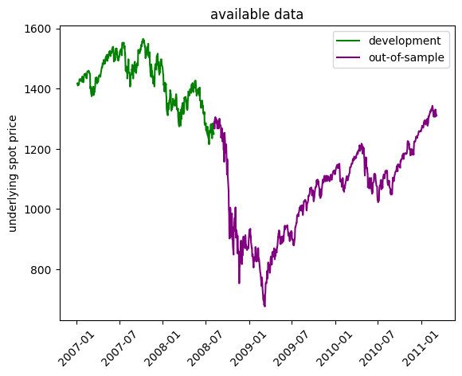
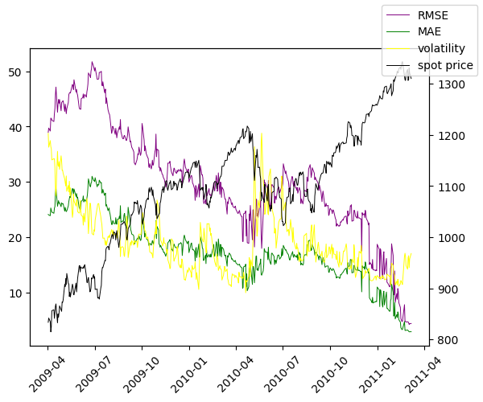
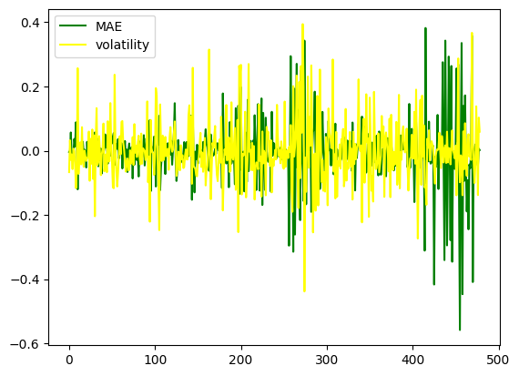

# Loading model


```python
import os
import joblib
import pandas as pd
import numpy as np
import matplotlib.pyplot as plt
from pathlib import Path
models_dir = os.path.join(Path().resolve(),'trained_models','trained_models')
models = [f for f in os.listdir(models_dir) if f.find('ipynb')==-1]
for i,m in enumerate(models):
    print(f"{i}     {m}")
```

    0     2024_10_25 12-23-03 Deep Neural Network asian
    


```python
model = models[0]
model_dir = os.path.join(models_dir,model)
model_files = [f for f in os.listdir(model_dir) if f.find('ipynb')==-1]
for i,m in enumerate(model_files):
    print(f"{i}     {m}")
```

    0     2024_10_25 12-23-03 Deep Neural Network asian insample.csv
    1     2024_10_25 12-23-03 Deep Neural Network asian outsample.csv
    2     2024_10_25 12-23-03 Deep Neural Network asian.pkl
    3     2024_10_25 12-23-03 Deep Neural Network asian.txt
    


```python
train_data = pd.read_csv(os.path.join(model_dir,model_files[0])).iloc[:,1:].copy()
test_data = pd.read_csv(os.path.join(model_dir,model_files[1])).iloc[:,1:].copy()
train_data['calculation_date'] = pd.to_datetime(train_data['calculation_date'])
test_data['calculation_date'] = pd.to_datetime(test_data['calculation_date'])
model_fit = joblib.load(os.path.join(model_dir,model_files[2]))
model_fit
```


```python
train_spots = train_data[['calculation_date','spot_price']].copy().set_index('calculation_date').drop_duplicates().dropna()
test_spots = test_data[['calculation_date','spot_price']].copy().set_index('calculation_date').drop_duplicates().dropna()
train_dates = pd.Series(train_spots.index)
test_dates = pd.Series(test_spots.index)
plt.figure()
plt.plot(train_spots,color='green',label='development')
plt.plot(test_spots,color='purple',label='out-of-sample')
plt.title('available data')
plt.ylabel('underlying spot price')
plt.xticks(rotation=45)
plt.legend()
plt.show()
test_data.dtypes
```


    

    


    spot_price                       float64
    strike_price                     float64
    days_to_maturity                   int64
    n_fixings                        float64
    fixing_frequency                   int64
    past_fixings                       int64
    averaging_type                    object
    w                                 object
    risk_free_rate                   float64
    dividend_rate                    float64
    calculation_date          datetime64[ns]
    kappa                            float64
    theta                            float64
    rho                              float64
    eta                              float64
    v0                               float64
    asian                            float64
    observed_price                   float64
    outofsample_target               float64
    outofsample_prediction           float64
    outofsample_error                float64
    dtype: object


```python
test_dates = test_dates[test_dates>pd.Timestamp(2009,4,1)]
test_spots = test_spots[test_spots.index.isin(test_dates)]
MAES = []
RMSES = []
vols = []
linew = 0.7

for i,date in enumerate(test_dates):
    df = test_data[test_data['calculation_date']==date].set_index('calculation_date')
    prediction = df['outofsample_prediction']
    target = df['observed_price']
    diff = prediction - target
    RMSES.append(np.sqrt(np.mean(diff**2)))
    MAES.append(np.mean(np.abs(diff)))
    vols.append(100*(float(df['v0'].unique()[0]))**(1/2))
    
fig, ax1 = plt.subplots()
MAES = np.array(MAES)
RMSES = np.array(RMSES)
vols = np.array(vols)
plt.xticks(rotation=45)
ax1.plot(test_dates,RMSES,color='purple',label='RMSE',linewidth=linew)
ax1.plot(test_dates,MAES,color='green',label='MAE',linewidth=linew)
ax1.plot(test_dates,vols,color='yellow',label='volatility',linewidth=linew)
ax2 = ax1.twinx()
ax2.plot(test_spots,color='black',label='spot price',linewidth=linew)
fig.legend()
plt.show()
```


    

    


# Testing


```python
from sklearn.linear_model import LinearRegression
```


```python
y = vols
X = MAES.reshape(-1,1)
reg = LinearRegression().fit(X, y)
R2 = reg.score(X,y)
b = reg.coef_[0]
print(f"R squared: {R2},",f"slope: {b}")
```

    R squared: 0.3369865076288605, slope: 0.5645095147915072
    


```python
X = X.flatten()
lX = np.log(X)
dlX = lX[1:] - lX[:-1]
dlX = dlX.reshape(-1,1)

ly = np.log(y)
dly = ly[1:] - ly[:-1]

plt.figure()
plt.plot(dlX,color='green',label='MAE')
plt.plot(dly,color='yellow',label='volatility')
plt.legend()
plt.show()

reg = LinearRegression().fit(dlX, dly)
R2 = reg.score(dlX,dly)
b = reg.coef_[0]
print(f"R squared: {R2},",f"slope: {b}")
```


    

    


    R squared: 0.004976175419618145, slope: -0.0707423841196273
    
