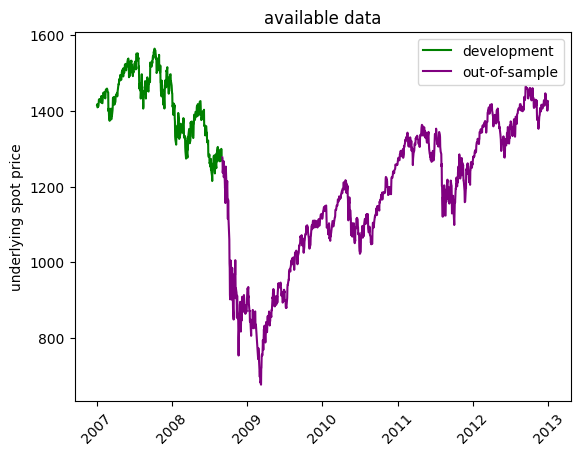
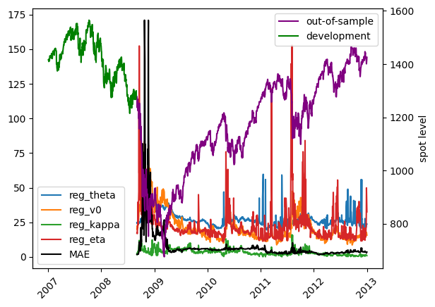

# Loading model


```python
import os
import joblib
import pandas as pd
import numpy as np
import matplotlib.pyplot as plt
from pathlib import Path
from model_settings import ms
root = Path().resolve().parent.parent
models_dir = os.path.join(Path().resolve(),'trained_models','trained_models')
models = [f for f in os.listdir(models_dir) if f.find('ipynb')==-1]
for i,m in enumerate(models):
    print(f"{i}     {m}")
```

    0     2024_10_27 08-05-24 Deep Neural Network asian options
    


```python
model = models[0]
model_dir = os.path.join(models_dir,model)
model_files = [f for f in os.listdir(model_dir) if f.find('ipynb')==-1 and f.find('.html')==-1]
for i,m in enumerate(model_files):
    print(f"{i}     {m}")
```

    0     2024_10_27 08-05-24 Deep Neural Network asian options insample.csv
    1     2024_10_27 08-05-24 Deep Neural Network asian options outsample.csv
    2     2024_10_27 08-05-24 Deep Neural Network asian options.pkl
    3     2024_10_27 08-05-24 Deep Neural Network asian options.txt
    


```python
train_data = pd.read_csv(os.path.join(model_dir,[f for f in model_files if f.find('insample')!=-1][0])).iloc[:,1:].copy()
test_data = pd.read_csv(os.path.join(model_dir,[f for f in model_files if f. find('outsample')!=-1][0])).iloc[:,1:].copy()
train_data['calculation_date'] = pd.to_datetime(train_data['calculation_date'])
test_data['calculation_date'] = pd.to_datetime(test_data['calculation_date'])
train_data = train_data.set_index('calculation_date')
test_data = test_data.set_index('calculation_date')
model_fit = joblib.load(os.path.join(model_dir,[f for f in model_files if f.endswith('.pkl')][0]))
print('maturities:',np.sort(test_data['days_to_maturity'].unique()))
print(model_fit)
```

    maturities: [  1   7  28  84 168 336]
    TransformedTargetRegressor(regressor=Pipeline(steps=[('preprocessor',
                                                          ColumnTransformer(transformers=[('StandardScaler',
                                                                                           StandardScaler(),
                                                                                           ['spot_price',
                                                                                            'strike_price',
                                                                                            'days_to_maturity',
                                                                                            'risk_free_rate',
                                                                                            'dividend_rate',
                                                                                            'kappa',
                                                                                            'theta',
                                                                                            'rho',
                                                                                            'eta',
                                                                                            'v0',
                                                                                            'fixing_frequency',
                                                                                            'n_fixings',
                                                                                            'past_fixings']),
                                                                                          ('OneHotEncoder',
                                                                                           OneHotEncoder(sparse_output=False),
                                                                                           ['averaging_type',
                                                                                            'w'])])),
                                                         ('regressor',
                                                          MLPRegressor(hidden_layer_sizes=(15,
                                                                                           15,
                                                                                           15),
                                                                       learning_rate='adaptive',
                                                                       max_iter=1000,
                                                                       solver='lbfgs'))]),
                               transformer=Pipeline(steps=[('StandardScaler',
                                                            StandardScaler())]))
    


```python
train_spots = train_data['spot_price']
test_spots = test_data['spot_price']
train_dates = pd.Series(train_spots.index)
test_dates = pd.Series(test_spots.index)
plt.figure()
plt.plot(train_spots,color='green',label='development')
plt.plot(test_spots,color='purple',label='out-of-sample')
plt.title('available data')
plt.ylabel('underlying spot price')
plt.xticks(rotation=45)
plt.legend()
plt.show()
print(test_data.shape[0])
```


    

    


    458220
    


```python
diff = test_data['outofsample_error'].copy()
def compute_RMSE(diff):
    return np.sqrt(np.mean(diff**2))
def compute_MAE(diff):
    return np.mean(np.abs(diff))
test_data['RMSE'] = diff.resample('D').apply(compute_RMSE).dropna()
test_data['MAE'] = diff.resample('D').apply(compute_MAE).dropna()
regression_data = test_data[
    [
        'spot_price',
        'theta', 
        'kappa',
        'rho',
        'eta', 
        'v0',
        'RMSE', 'MAE'
    ]
].copy().drop_duplicates()
```

# Testing


```python
regression_data
```


<div>
<style scoped>
    .dataframe tbody tr th:only-of-type {
        vertical-align: middle;
    }

    .dataframe tbody tr th {
        vertical-align: top;
    }

    .dataframe thead th {
        text-align: right;
    }
</style>
<table border="1" class="dataframe">
  <thead>
    <tr style="text-align: right;">
      <th></th>
      <th>spot_price</th>
      <th>theta</th>
      <th>kappa</th>
      <th>rho</th>
      <th>eta</th>
      <th>v0</th>
      <th>RMSE</th>
      <th>MAE</th>
    </tr>
    <tr>
      <th>calculation_date</th>
      <th></th>
      <th></th>
      <th></th>
      <th></th>
      <th></th>
      <th></th>
      <th></th>
      <th></th>
    </tr>
  </thead>
  <tbody>
    <tr>
      <th>2008-09-02</th>
      <td>1277.53</td>
      <td>0.060409</td>
      <td>2.129509</td>
      <td>-1.000000</td>
      <td>0.172868</td>
      <td>0.040641</td>
      <td>2.757522</td>
      <td>1.789542</td>
    </tr>
    <tr>
      <th>2008-09-03</th>
      <td>1275.25</td>
      <td>0.058609</td>
      <td>2.693908</td>
      <td>-1.000000</td>
      <td>0.178095</td>
      <td>0.038360</td>
      <td>2.810832</td>
      <td>1.781569</td>
    </tr>
    <tr>
      <th>2008-09-04</th>
      <td>1236.81</td>
      <td>0.062183</td>
      <td>1.521139</td>
      <td>-1.000000</td>
      <td>0.167885</td>
      <td>0.050277</td>
      <td>2.844644</td>
      <td>1.781019</td>
    </tr>
    <tr>
      <th>2008-09-05</th>
      <td>1242.38</td>
      <td>0.059311</td>
      <td>2.859490</td>
      <td>-1.000000</td>
      <td>0.183520</td>
      <td>0.044849</td>
      <td>2.865858</td>
      <td>1.795580</td>
    </tr>
    <tr>
      <th>2008-09-08</th>
      <td>1267.76</td>
      <td>0.055250</td>
      <td>3.372719</td>
      <td>-0.735338</td>
      <td>0.256952</td>
      <td>0.043867</td>
      <td>2.994667</td>
      <td>1.907757</td>
    </tr>
    <tr>
      <th>...</th>
      <td>...</td>
      <td>...</td>
      <td>...</td>
      <td>...</td>
      <td>...</td>
      <td>...</td>
      <td>...</td>
      <td>...</td>
    </tr>
    <tr>
      <th>2012-12-24</th>
      <td>1425.78</td>
      <td>0.045075</td>
      <td>1.533653</td>
      <td>-0.758727</td>
      <td>0.187296</td>
      <td>0.021678</td>
      <td>5.811224</td>
      <td>3.491105</td>
    </tr>
    <tr>
      <th>2012-12-26</th>
      <td>1419.95</td>
      <td>0.045965</td>
      <td>1.502570</td>
      <td>-0.631430</td>
      <td>0.230292</td>
      <td>0.024230</td>
      <td>5.515436</td>
      <td>3.396736</td>
    </tr>
    <tr>
      <th>2012-12-27</th>
      <td>1417.38</td>
      <td>0.049897</td>
      <td>1.254997</td>
      <td>-0.471477</td>
      <td>0.306944</td>
      <td>0.026584</td>
      <td>5.195527</td>
      <td>3.311010</td>
    </tr>
    <tr>
      <th>2012-12-28</th>
      <td>1401.16</td>
      <td>0.054307</td>
      <td>1.224926</td>
      <td>-0.301439</td>
      <td>0.498256</td>
      <td>0.031667</td>
      <td>4.198202</td>
      <td>2.796987</td>
    </tr>
    <tr>
      <th>2012-12-31</th>
      <td>1425.77</td>
      <td>0.056212</td>
      <td>0.898211</td>
      <td>-0.418973</td>
      <td>0.324868</td>
      <td>0.024660</td>
      <td>5.531494</td>
      <td>3.495263</td>
    </tr>
  </tbody>
</table>
<p>1091 rows × 8 columns</p>
</div>


```python
from sklearn.linear_model import LinearRegression
import scipy.stats as stats
```

### testing for the effect of the spot level on pricing accuracy


```python
regression_data.dtypes
```


    spot_price    float64
    theta         float64
    kappa         float64
    rho           float64
    eta           float64
    v0            float64
    RMSE          float64
    MAE           float64
    dtype: object


### unrestricted regression


```python
X = pd.DataFrame()
X['reg_s'] = regression_data['spot_price']
X[['reg_theta', 'reg_v0',]] = np.sqrt(regression_data[['theta', 'v0']])*100 
X['reg_kappa'] = regression_data['kappa']
X['reg_eta'] = regression_data['eta']*100

target_name = 'MAE'
y = regression_data[target_name].loc[X.index]
fit_intercept = False

fig, ax1 = plt.subplots()
plt.xticks(rotation=45)
ax2 = ax1.twinx()
for column in X.columns[1:]:
    ax1.plot(X.index, X[column], label=column)
ax1.plot(X.index, y, label=target_name, color="black")
ax2.plot(X.index, X['reg_s'], label='out-of-sample', color="purple")
ax2.plot(train_spots,color='green',label='development')
ax2.set_ylabel("spot level")
ax1.legend(loc='lower left')
ax2.legend(loc="upper right")
plt.show()
```


    

    

run the unrestricted regression with all of
the above features

```python
Ufit = LinearRegression(fit_intercept=fit_intercept).fit(X,y)
Uyhat = Ufit.predict(X)
URSS = sum((Uyhat-y)**2)
print(f"features:\n{X.dtypes}\n\ntarget: {target_name}\n")
for i,c in enumerate(Ufit.coef_):
    print(f"b{i}:   {c}")
print(f"intercept: {Ufit.intercept_}")
print(f"R Squared: {Ufit.score(X,y)}")
print(f"\nURSS: {URSS}")
```

    features:
    reg_s        float64
    reg_theta    float64
    reg_v0       float64
    reg_kappa    float64
    reg_eta      float64
    dtype: object
    
    target: MAE
    
    b0:   -0.0005738270943283799
    b1:   -0.2661412077456525
    b2:   0.9458323004212624
    b3:   -1.1265043473839738
    b4:   -0.07875935948241203
    intercept: 0.0
    R Squared: 0.5522304210256508
    
    URSS: 80858.22404861341
    

### restricted regression
run the restricted regression where the spot level
is not an explanatory variable to the pricing error

```python
X = X.iloc[:,1:]
Rfit = LinearRegression(fit_intercept=fit_intercept).fit(X,y)
Ryhat = Rfit.predict(X)
RRSS = sum((Ryhat-y)**2)
print(f"features:\n{X.dtypes}\n\ntarget: {target_name}\n")
for i,c in enumerate(Rfit.coef_):
    print(f"b{i+1}:   {c}")
print(f"intercept: {Rfit.intercept_}")
print(f"R Squared: {Rfit.score(X,y)}")
print(f"\nRRSS: {RRSS}")
```

    features:
    reg_theta    float64
    reg_v0       float64
    reg_kappa    float64
    reg_eta      float64
    dtype: object
    
    target: MAE
    
    b1:   -0.294833354535959
    b2:   0.9574186511093356
    b3:   -1.1160881512344198
    b4:   -0.08564463648193255
    intercept: 0.0
    R Squared: 0.5520747559066435
    
    RRSS: 80886.33405353621
    

### F-Test
next we perform an F-Test to check whether the level 
of the underlying asset's spot value explains the 
pricing error

```python
m = len(Ufit.coef_)-len(Rfit.coef_)
n = len(y)
k = len(Ufit.coef_)
dfn = m
dfd = n-k-1
F = ((RRSS-URSS)/dfn)/(URSS/dfd)
alpha = 0.05
critF = stats.f.ppf(1 - alpha, dfn=dfn, dfd=dfd)
print(f"F: {F}, Critical F: {critF}")
```

    F: 0.3771954640371285, Critical F: 3.850043646752174
    


```python
for col in X.columns:
    regression_data[col] = X[col]
regression_data['y'] = y
regression_data['Uyhat'] = Uyhat
regression_data['Ryhat'] = Ryhat
regression_data
```


<div>
<style scoped>
    .dataframe tbody tr th:only-of-type {
        vertical-align: middle;
    }

    .dataframe tbody tr th {
        vertical-align: top;
    }

    .dataframe thead th {
        text-align: right;
    }
</style>
<table border="1" class="dataframe">
  <thead>
    <tr style="text-align: right;">
      <th></th>
      <th>spot_price</th>
      <th>theta</th>
      <th>kappa</th>
      <th>rho</th>
      <th>eta</th>
      <th>v0</th>
      <th>RMSE</th>
      <th>MAE</th>
      <th>reg_theta</th>
      <th>reg_v0</th>
      <th>reg_kappa</th>
      <th>reg_eta</th>
      <th>y</th>
      <th>Uyhat</th>
      <th>Ryhat</th>
    </tr>
    <tr>
      <th>calculation_date</th>
      <th></th>
      <th></th>
      <th></th>
      <th></th>
      <th></th>
      <th></th>
      <th></th>
      <th></th>
      <th></th>
      <th></th>
      <th></th>
      <th></th>
      <th></th>
      <th></th>
      <th></th>
    </tr>
  </thead>
  <tbody>
    <tr>
      <th>2008-09-02</th>
      <td>1277.53</td>
      <td>0.060409</td>
      <td>2.129509</td>
      <td>-1.000000</td>
      <td>0.172868</td>
      <td>0.040641</td>
      <td>2.757522</td>
      <td>1.789542</td>
      <td>24.578213</td>
      <td>20.159720</td>
      <td>2.129509</td>
      <td>17.286782</td>
      <td>1.789542</td>
      <td>8.032961</td>
      <td>8.197575</td>
    </tr>
    <tr>
      <th>2008-09-03</th>
      <td>1275.25</td>
      <td>0.058609</td>
      <td>2.693908</td>
      <td>-1.000000</td>
      <td>0.178095</td>
      <td>0.038360</td>
      <td>2.810832</td>
      <td>1.781569</td>
      <td>24.209285</td>
      <td>19.585714</td>
      <td>2.693908</td>
      <td>17.809461</td>
      <td>1.781569</td>
      <td>6.912579</td>
      <td>7.082100</td>
    </tr>
    <tr>
      <th>2008-09-04</th>
      <td>1236.81</td>
      <td>0.062183</td>
      <td>1.521139</td>
      <td>-1.000000</td>
      <td>0.167885</td>
      <td>0.050277</td>
      <td>2.844644</td>
      <td>1.781019</td>
      <td>24.936516</td>
      <td>22.422504</td>
      <td>1.521139</td>
      <td>16.788463</td>
      <td>1.781019</td>
      <td>10.825760</td>
      <td>10.980039</td>
    </tr>
    <tr>
      <th>2008-09-05</th>
      <td>1242.38</td>
      <td>0.059311</td>
      <td>2.859490</td>
      <td>-1.000000</td>
      <td>0.183520</td>
      <td>0.044849</td>
      <td>2.865858</td>
      <td>1.795580</td>
      <td>24.353805</td>
      <td>21.177557</td>
      <td>2.859490</td>
      <td>18.351988</td>
      <td>1.795580</td>
      <td>8.169336</td>
      <td>8.332282</td>
    </tr>
    <tr>
      <th>2008-09-08</th>
      <td>1267.76</td>
      <td>0.055250</td>
      <td>3.372719</td>
      <td>-0.735338</td>
      <td>0.256952</td>
      <td>0.043867</td>
      <td>2.994667</td>
      <td>1.907757</td>
      <td>23.505214</td>
      <td>20.944396</td>
      <td>3.372719</td>
      <td>25.695196</td>
      <td>1.907757</td>
      <td>7.003585</td>
      <td>7.157527</td>
    </tr>
    <tr>
      <th>...</th>
      <td>...</td>
      <td>...</td>
      <td>...</td>
      <td>...</td>
      <td>...</td>
      <td>...</td>
      <td>...</td>
      <td>...</td>
      <td>...</td>
      <td>...</td>
      <td>...</td>
      <td>...</td>
      <td>...</td>
      <td>...</td>
      <td>...</td>
    </tr>
    <tr>
      <th>2012-12-24</th>
      <td>1425.78</td>
      <td>0.045075</td>
      <td>1.533653</td>
      <td>-0.758727</td>
      <td>0.187296</td>
      <td>0.021678</td>
      <td>5.811224</td>
      <td>3.491105</td>
      <td>21.230839</td>
      <td>14.723486</td>
      <td>1.533653</td>
      <td>18.729596</td>
      <td>3.491105</td>
      <td>4.254598</td>
      <td>4.521199</td>
    </tr>
    <tr>
      <th>2012-12-26</th>
      <td>1419.95</td>
      <td>0.045965</td>
      <td>1.502570</td>
      <td>-0.631430</td>
      <td>0.230292</td>
      <td>0.024230</td>
      <td>5.515436</td>
      <td>3.396736</td>
      <td>21.439524</td>
      <td>15.566046</td>
      <td>1.502570</td>
      <td>23.029183</td>
      <td>3.396736</td>
      <td>4.695707</td>
      <td>4.932809</td>
    </tr>
    <tr>
      <th>2012-12-27</th>
      <td>1417.38</td>
      <td>0.049897</td>
      <td>1.254997</td>
      <td>-0.471477</td>
      <td>0.306944</td>
      <td>0.026584</td>
      <td>5.195527</td>
      <td>3.311010</td>
      <td>22.337609</td>
      <td>16.304571</td>
      <td>1.254997</td>
      <td>30.694357</td>
      <td>3.311010</td>
      <td>4.831874</td>
      <td>4.994934</td>
    </tr>
    <tr>
      <th>2012-12-28</th>
      <td>1401.16</td>
      <td>0.054307</td>
      <td>1.224926</td>
      <td>-0.301439</td>
      <td>0.498256</td>
      <td>0.031667</td>
      <td>4.198202</td>
      <td>2.796987</td>
      <td>23.303771</td>
      <td>17.795183</td>
      <td>1.224926</td>
      <td>49.825605</td>
      <td>2.796987</td>
      <td>4.521024</td>
      <td>4.532289</td>
    </tr>
    <tr>
      <th>2012-12-31</th>
      <td>1425.77</td>
      <td>0.056212</td>
      <td>0.898211</td>
      <td>-0.418973</td>
      <td>0.324868</td>
      <td>0.024660</td>
      <td>5.531494</td>
      <td>3.495263</td>
      <td>23.709146</td>
      <td>15.703616</td>
      <td>0.898211</td>
      <td>32.486783</td>
      <td>3.495263</td>
      <td>4.154384</td>
      <td>4.259886</td>
    </tr>
  </tbody>
</table>
<p>1091 rows × 15 columns</p>
</div>


```python

```
