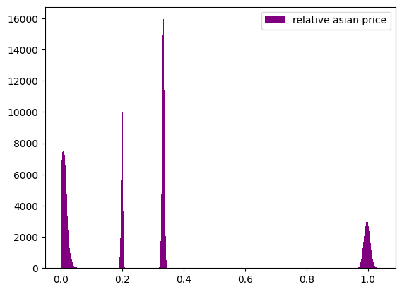
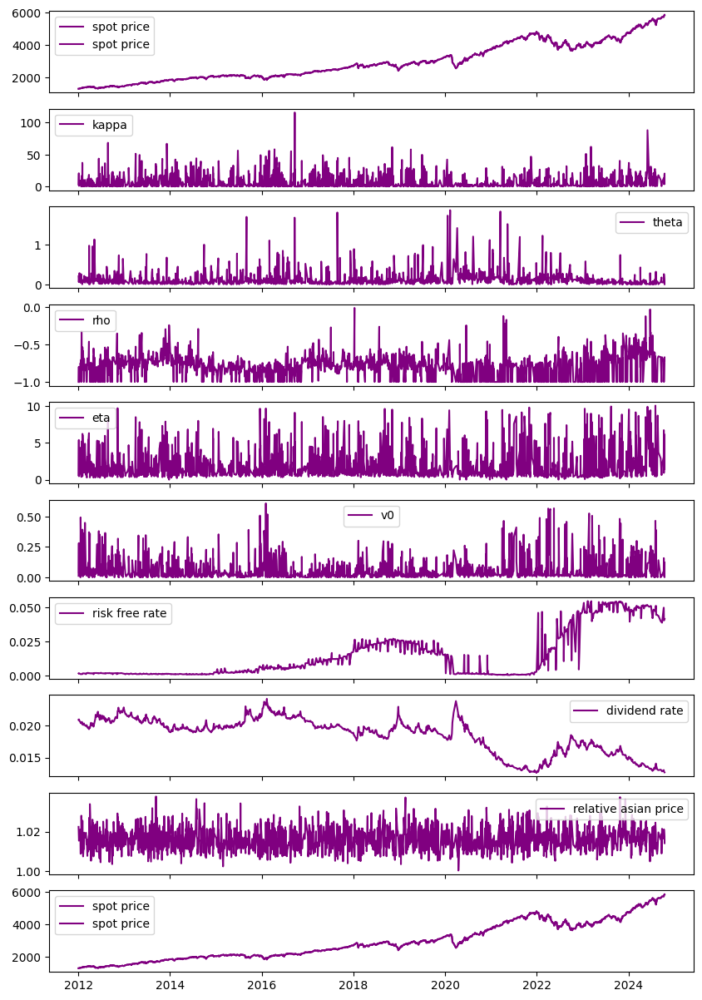
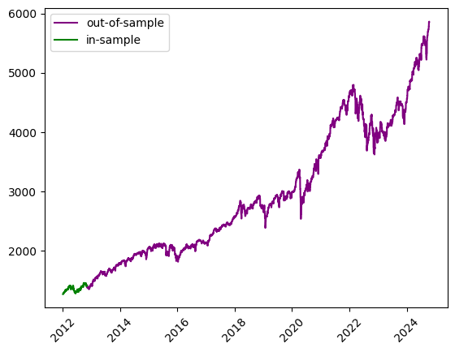
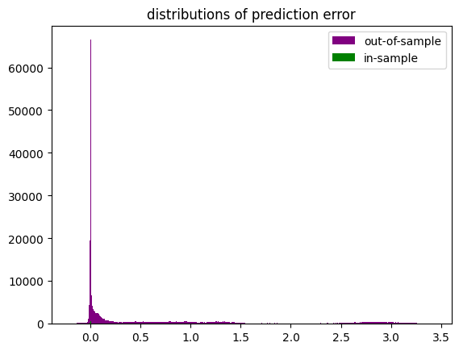

```python
import os
import time
import joblib
import numpy as np
import pandas as pd
import matplotlib.pyplot as plt
from pathlib import Path
from datetime import datetime
from model_settings import ms
from df_collector import df_collector
pd.set_option("display.max_columns",0)
pd.options.display.float_format = '{:.6f}'.format
root = Path().resolve().parent.parent
df_collector.root = root
models_dir = os.path.join(root,ms.trained_models)
train_start = time.time()
train_start_datetime = datetime.fromtimestamp(train_start)
train_start_tag = train_start_datetime.strftime('%c')
print("\n"+"#"*18+"\n# training start #\n"+
      "#"*18+"\n"+f"\n{train_start_tag}")
```

    
    ##################
    # training start #
    ##################
    
    Sat Nov  9 11:28:16 2024
    

# loading data


```python
data = df_collector.cboe_spx_asians().iloc[:,1:]
pricename = [f for f in data.columns if f.find('_price')!=-1 and f.find('spot_')==-1 and f.find('strike_')==-1][0]
relative_pricename = 'relative_'+pricename
data = data[data[pricename]<=data['spot_price']]
print(f'collected {pricename[:pricename.find('_',0)]} options')
print(data.describe())
print(data.dtypes)
print(data['calculation_date'].drop_duplicates().reset_index(drop=True))
```

    collected asian options
             spot_price  strike_price  days_to_maturity     n_fixings  fixing_frequency  past_fixings  ...         kappa         theta           rho           eta            v0   asian_price
    count 338940.000000 338940.000000     338940.000000 338940.000000     338940.000000 338940.000000  ... 338940.000000 338940.000000 338940.000000 338940.000000 338940.000000 338940.000000
    mean    2879.296867   2879.040892         48.222222      2.777778         31.111111      0.000000  ...      6.420617      0.116565     -0.787240      1.867973      0.058536    439.228650
    std     1134.771669   1576.383527         32.906575      3.424679         29.718891      0.000000  ...     10.177984      0.179997      0.143343      1.915014      0.085634    634.706607
    min     1274.000000    637.000000          7.000000      1.000000          7.000000      0.000000  ...      0.000000      0.000000     -1.000000      0.000000      0.000102      0.000000
    25%     1981.000000   1680.750000         28.000000      1.000000          7.000000      0.000000  ...      0.521983      0.029260     -0.860987      0.629183      0.012884      0.000000
    50%     2678.000000   2505.000000         28.000000      1.000000         28.000000      0.000000  ...      2.081820      0.069359     -0.779445      1.141247      0.024668     31.950246
    75%     3940.000000   3698.500000         84.000000      3.000000         28.000000      0.000000  ...      7.949938      0.130302     -0.706287      2.216932      0.063882    771.502172
    max     5863.000000   8794.000000         84.000000     12.000000         84.000000      0.000000  ...    115.850379      1.869788     -0.012846     10.045761      0.608722   2931.600979
    
    [8 rows x 14 columns]
    spot_price          float64
    strike_price        float64
    days_to_maturity      int64
    n_fixings           float64
    fixing_frequency      int64
    past_fixings          int64
    averaging_type       object
    w                    object
    risk_free_rate      float64
    dividend_rate       float64
    calculation_date     object
    kappa               float64
    theta               float64
    rho                 float64
    eta                 float64
    v0                  float64
    date                 object
    asian_price         float64
    dtype: object
    0       2012-01-03 13:00:22.494
    1       2012-01-05 16:07:08.939
    2       2012-01-06 15:31:47.973
    3       2012-01-10 16:14:23.010
    4       2012-01-18 09:46:15.111
                     ...           
    1869    2024-10-07 15:57:53.651
    1870    2024-10-08 15:48:23.420
    1871    2024-10-09 15:33:43.664
    1872    2024-10-14 12:23:32.382
    1873    2024-10-14 15:26:27.717
    Name: calculation_date, Length: 1874, dtype: object
    


```python
filetag = f'cboe spx relative {pricename[:pricename.find('_',0)]}'
```


```python
data[pricename].describe()
```


    count   338940.000000
    mean       439.228650
    std        634.706607
    min          0.000000
    25%          0.000000
    50%         31.950246
    75%        771.502172
    max       2931.600979
    Name: asian_price, dtype: float64


# data cleaning & preparation


```python
data_strikes = data['strike_price']
data['relative_spot'] = data['spot_price']/data_strikes
data[relative_pricename] = data[pricename]/data_strikes
try:
    data['relative_barrier'] = data['barrier']/data_strikes
    data['relative_rebate'] = data['rebate']/data_strikes
except Exception:
    pass

data['calculation_date'] = pd.to_datetime(data['calculation_date'],format='mixed')
data['date'] = pd.to_datetime(data['date'],format='mixed')
data.dtypes
```


    spot_price                     float64
    strike_price                   float64
    days_to_maturity                 int64
    n_fixings                      float64
    fixing_frequency                 int64
    past_fixings                     int64
    averaging_type                  object
    w                               object
    risk_free_rate                 float64
    dividend_rate                  float64
    calculation_date        datetime64[ns]
    kappa                          float64
    theta                          float64
    rho                            float64
    eta                            float64
    v0                             float64
    date                    datetime64[ns]
    asian_price                    float64
    relative_spot                  float64
    relative_asian_price           float64
    dtype: object


```python
def noisify(x):
    return x + np.random.normal(scale=x*0.01)

relative_observed = data[relative_pricename].values
relative_observed[relative_observed>0] = noisify(relative_observed[relative_observed>0])
targetname = 'relative_observed'
data[targetname]= relative_observed
data[targetname].describe()
```


    count   338940.000000
    mean         0.189156
    std          0.299911
    min          0.000000
    25%          0.000000
    50%          0.012626
    75%          0.330249
    max          1.037593
    Name: relative_observed, dtype: float64


# visualization


```python
"""
plot
"""
rels = data[targetname]
rels = rels[rels>0.0005]
plt.figure()
plt.hist(rels,color='purple',label=relative_pricename.replace('_',' '),bins=int(np.sqrt(len(rels))))
plt.legend()
plt.show()
rels.describe()
```


    

    


    count   208269.000000
    mean         0.307827
    std          0.331439
    min          0.000500
    25%          0.017247
    50%          0.203631
    75%          0.335103
    max          1.037593
    Name: relative_observed, dtype: float64


```python
from plotters import PlotCols
col_names = ['spot_price','kappa','theta','rho','eta','v0','risk_free_rate','dividend_rate',relative_pricename,'spot_price']
index = 'calculation_date'
plot_data = data[col_names+[index]].copy().sort_values(by=relative_pricename).drop_duplicates(subset=index,keep='last').sort_values(by=index).reset_index(drop=True)
data_cols = [index] + col_names
PlotCols(
    plot_data,
    col_names=col_names,
    index=index,
    figsize=(10,15)
)
print(f"where '{relative_pricename}' is the maximum market observed relative {pricename[:pricename.find('_',0)]} option price")
pd.Series(plot_data[index])
data[relative_pricename].describe()
```

    ['spot_price', 'kappa', 'theta', 'rho', 'eta', 'v0', 'risk_free_rate', 'dividend_rate', 'relative_asian_price', 'spot_price']
    


    

    


    where 'relative_asian_price' is the maximum market observed relative asian option price
    


    count   338940.000000
    mean         0.189156
    std          0.299911
    min          0.000000
    25%          0.000000
    50%          0.012626
    75%          0.330249
    max          1.037593
    Name: relative_asian_price, dtype: float64


# training procedure

## model parameterization and initializaiton


```python
from convsklearn import convsklearn
trainer = convsklearn()
trainer.target_name = relative_pricename
trainer.excluded_features = trainer.excluded_features + ['spot_price','strike_price','barrier','rebate',relative_pricename,'relative_observed']
trainer.__dict__
```


    {'seed': 1312,
     'raw_data': Empty DataFrame
     Columns: []
     Index: [],
     'dataset': Empty DataFrame
     Columns: []
     Index: [],
     'target_name': 'relative_asian_price',
     'excluded_features': ['barrier_price',
      'asian_price',
      'observed_price',
      'outin',
      'updown',
      'n_fixings',
      'spot_price',
      'strike_price',
      'barrier',
      'rebate',
      'relative_asian_price',
      'relative_observed'],
     'numerical_features': [],
     'categorical_features': [],
     'feature_set': [],
     'n_features': 0,
     'development_dates': {},
     'test_dates': {},
     'train_data': {},
     'test_data': {},
     'train_X': {},
     'train_y': {},
     'test_X': {},
     'test_y': {},
     'preprocessor': None,
     'pipeline': None,
     'model': None,
     'model_fit': None,
     'dnn_runtime': 0,
     'numerical_scaler': StandardScaler()}


```python
trainer.load_data(data)
print('features:')
for f in trainer.feature_set:
    print(f"   {f}")
print(f"\ntarget:\n   {trainer.target_name}",trainer.n_features)
print(trainer.dnn_params)
```

    features:
       days_to_maturity
       fixing_frequency
       past_fixings
       risk_free_rate
       dividend_rate
       kappa
       theta
       rho
       eta
       v0
       relative_spot
       averaging_type
       w
    
    target:
       relative_asian_price 13
    {'alpha': 0.01, 'hidden_layer_sizes': (13, 13), 'learning_rate': 'adaptive', 'learning_rate_init': 0.1, 'solver': 'sgd', 'early_stopping': False, 'max_iter': 500, 'warm_start': True, 'tol': 0.0001, 'random_state': 1312}
    


```python
dates = data['date'].drop_duplicates()
```

## prepocessing


```python
development_dates = dates[:100]#len(dates)//3]
test_dates = dates[~dates.isin(development_dates)]
trainer.preprocess_data(development_dates,test_dates)
```


    

    


## training


```python
trainer.run_dnn()
```

    
    training on 23580 samples...
    
    alpha: 0.01
    hidden_layer_sizes: (13, 13)
    learning_rate: adaptive
    learning_rate_init: 0.1
    solver: sgd
    early_stopping: False
    max_iter: 500
    warm_start: True
    tol: 0.0001
    random_state: 1312
    cpu: 3.5039987564086914
    


```python
print('instance variables:')

for key, value in trainer.__dict__.items():
    print(f"{key}:\n  {value}\n")
```

    instance variables:
    seed:
      1312
    
    raw_data:
              spot_price  strike_price  days_to_maturity  n_fixings  fixing_frequency  past_fixings averaging_type  ...      eta       v0       date asian_price  relative_spot  relative_asian_price  relative_observed
    0      1274.000000    637.000000                 7   1.000000                 7             0      geometric  ... 0.601996 0.012430 2012-01-03  636.645019       2.000000              1.001100           1.001100
    1      1274.000000    637.000000                 7   1.000000                 7             0      geometric  ... 0.601996 0.012430 2012-01-03    0.000000       2.000000              0.000000           0.000000
    2      1274.000000    637.000000                 7   1.000000                 7             0     arithmetic  ... 0.601996 0.012430 2012-01-03  636.682271       2.000000              1.014481           1.014481
    3      1274.000000    637.000000                 7   1.000000                 7             0     arithmetic  ... 0.601996 0.012430 2012-01-03    0.000000       2.000000              0.000000           0.000000
    4      1274.000000    955.500000                 7   1.000000                 7             0      geometric  ... 0.601996 0.012430 2012-01-03  318.154658       1.333333              0.329424           0.329424
    ...            ...           ...               ...        ...               ...           ...            ...  ...      ...      ...        ...         ...            ...                   ...                ...
    338935 5857.000000   7320.750000                84   1.000000                84             0     arithmetic  ... 1.487001 0.121595 2024-10-14 1429.795085       0.800055              0.192091           0.192091
    338936 5857.000000   8785.000000                84   1.000000                84             0      geometric  ... 1.487001 0.121595 2024-10-14    0.000000       0.666705              0.000000           0.000000
    338937 5857.000000   8785.000000                84   1.000000                84             0      geometric  ... 1.487001 0.121595 2024-10-14 2887.934074       0.666705              0.322388           0.322388
    338938 5857.000000   8785.000000                84   1.000000                84             0     arithmetic  ... 1.487001 0.121595 2024-10-14    0.000000       0.666705              0.000000           0.000000
    338939 5857.000000   8785.000000                84   1.000000                84             0     arithmetic  ... 1.487001 0.121595 2024-10-14 2879.992268       0.666705              0.326430           0.326430
    
    [338940 rows x 21 columns]
    
    dataset:
              spot_price  strike_price  days_to_maturity  n_fixings  fixing_frequency  past_fixings averaging_type  ...      eta       v0       date asian_price  relative_spot  relative_asian_price  relative_observed
    0      1274.000000    637.000000                 7   1.000000                 7             0      geometric  ... 0.601996 0.012430 2012-01-03  636.645019       2.000000              1.001100           1.001100
    1      1274.000000    637.000000                 7   1.000000                 7             0      geometric  ... 0.601996 0.012430 2012-01-03    0.000000       2.000000              0.000000           0.000000
    2      1274.000000    637.000000                 7   1.000000                 7             0     arithmetic  ... 0.601996 0.012430 2012-01-03  636.682271       2.000000              1.014481           1.014481
    3      1274.000000    637.000000                 7   1.000000                 7             0     arithmetic  ... 0.601996 0.012430 2012-01-03    0.000000       2.000000              0.000000           0.000000
    4      1274.000000    955.500000                 7   1.000000                 7             0      geometric  ... 0.601996 0.012430 2012-01-03  318.154658       1.333333              0.329424           0.329424
    ...            ...           ...               ...        ...               ...           ...            ...  ...      ...      ...        ...         ...            ...                   ...                ...
    338935 5857.000000   7320.750000                84   1.000000                84             0     arithmetic  ... 1.487001 0.121595 2024-10-14 1429.795085       0.800055              0.192091           0.192091
    338936 5857.000000   8785.000000                84   1.000000                84             0      geometric  ... 1.487001 0.121595 2024-10-14    0.000000       0.666705              0.000000           0.000000
    338937 5857.000000   8785.000000                84   1.000000                84             0      geometric  ... 1.487001 0.121595 2024-10-14 2887.934074       0.666705              0.322388           0.322388
    338938 5857.000000   8785.000000                84   1.000000                84             0     arithmetic  ... 1.487001 0.121595 2024-10-14    0.000000       0.666705              0.000000           0.000000
    338939 5857.000000   8785.000000                84   1.000000                84             0     arithmetic  ... 1.487001 0.121595 2024-10-14 2879.992268       0.666705              0.326430           0.326430
    
    [338940 rows x 21 columns]
    
    target_name:
      relative_asian_price
    
    excluded_features:
      ['barrier_price', 'asian_price', 'observed_price', 'outin', 'updown', 'n_fixings', 'spot_price', 'strike_price', 'barrier', 'rebate', 'relative_asian_price', 'relative_observed']
    
    numerical_features:
      ['days_to_maturity', 'fixing_frequency', 'past_fixings', 'risk_free_rate', 'dividend_rate', 'kappa', 'theta', 'rho', 'eta', 'v0', 'relative_spot']
    
    categorical_features:
      ['averaging_type', 'w']
    
    feature_set:
      ['days_to_maturity', 'fixing_frequency', 'past_fixings', 'risk_free_rate', 'dividend_rate', 'kappa', 'theta', 'rho', 'eta', 'v0', 'relative_spot', 'averaging_type', 'w']
    
    n_features:
      13
    
    development_dates:
      0       2012-01-03
    180     2012-01-05
    360     2012-01-06
    540     2012-01-10
    720     2012-01-18
               ...    
    22500   2012-10-15
    22680   2012-10-23
    23040   2012-10-31
    23220   2012-11-02
    23400   2012-11-05
    Name: date, Length: 100, dtype: datetime64[ns]
    
    test_dates:
      23580    2012-11-06
    23760    2012-11-08
    24480    2012-11-09
    24660    2012-11-12
    25020    2012-11-14
                ...    
    337860   2024-09-24
    338040   2024-10-07
    338220   2024-10-08
    338400   2024-10-09
    338580   2024-10-14
    Name: date, Length: 1314, dtype: datetime64[ns]
    
    train_data:
             spot_price  strike_price  days_to_maturity  n_fixings  fixing_frequency  past_fixings averaging_type  ...      eta       v0       date asian_price  relative_spot  relative_asian_price  relative_observed
    0     1274.000000    637.000000                 7   1.000000                 7             0      geometric  ... 0.601996 0.012430 2012-01-03  636.645019       2.000000              1.001100           1.001100
    115   1274.000000   1592.500000                84   1.000000                84             0     arithmetic  ... 0.601996 0.012430 2012-01-03  321.256274       0.800000              0.202428           0.202428
    116   1274.000000   1911.000000                84   1.000000                84             0      geometric  ... 0.601996 0.012430 2012-01-03    0.000000       0.666667              0.000000           0.000000
    117   1274.000000   1911.000000                84   1.000000                84             0      geometric  ... 0.601996 0.012430 2012-01-03  641.283817       0.666667              0.331488           0.331488
    118   1274.000000   1911.000000                84   1.000000                84             0     arithmetic  ... 0.601996 0.012430 2012-01-03    0.000000       0.666667              0.000000           0.000000
    ...           ...           ...               ...        ...               ...           ...            ...  ...      ...      ...        ...         ...            ...                   ...                ...
    23461 1420.000000    710.000000                84  12.000000                 7             0      geometric  ... 1.634967 0.056625 2012-11-05    0.002892       2.000000              0.000004           0.000004
    23462 1420.000000    710.000000                84  12.000000                 7             0     arithmetic  ... 1.634967 0.056625 2012-11-05  706.342936       2.000000              0.988223           0.988223
    23463 1420.000000    710.000000                84  12.000000                 7             0     arithmetic  ... 1.634967 0.056625 2012-11-05    0.000221       2.000000              0.000000           0.000000
    23465 1420.000000   1065.000000                84  12.000000                 7             0      geometric  ... 1.634967 0.056625 2012-11-05    0.659695       1.333333              0.000611           0.000611
    23579 1420.000000   2130.000000                84   1.000000                84             0     arithmetic  ... 1.634967 0.056625 2012-11-05  713.139406       0.666667              0.338953           0.338953
    
    [23580 rows x 21 columns]
    
    test_data:
              spot_price  strike_price  days_to_maturity  n_fixings  fixing_frequency  past_fixings averaging_type  ...      eta       v0       date asian_price  relative_spot  relative_asian_price  relative_observed
    23580  1425.000000    712.000000                 7   1.000000                 7             0      geometric  ... 1.861134 0.105190 2012-11-06  712.549220       2.001404              0.986432           0.986432
    23695  1425.000000   1780.750000                84   1.000000                84             0     arithmetic  ... 1.861134 0.105190 2012-11-06  358.884247       0.800225              0.202240           0.202240
    23696  1425.000000   2137.000000                84   1.000000                84             0      geometric  ... 1.861134 0.105190 2012-11-06    0.000000       0.666823              0.000000           0.000000
    23697  1425.000000   2137.000000                84   1.000000                84             0      geometric  ... 1.861134 0.105190 2012-11-06  715.894262       0.666823              0.328607           0.328607
    23698  1425.000000   2137.000000                84   1.000000                84             0     arithmetic  ... 1.861134 0.105190 2012-11-06    0.000000       0.666823              0.000000           0.000000
    ...            ...           ...               ...        ...               ...           ...            ...  ...      ...      ...        ...         ...            ...                   ...                ...
    338695 5863.000000   7328.250000                84   1.000000                84             0     arithmetic  ... 6.124247 0.000915 2024-10-14 1432.480205       0.800055              0.193646           0.193646
    338694 5863.000000   7328.250000                84   1.000000                84             0     arithmetic  ... 6.124247 0.000915 2024-10-14    0.031726       0.800055              0.000004           0.000004
    338693 5863.000000   7328.250000                84   1.000000                84             0      geometric  ... 6.124247 0.000915 2024-10-14 1437.338195       0.800055              0.193161           0.193161
    338691 5863.000000   5862.500000                84   1.000000                84             0     arithmetic  ... 6.124247 0.000915 2024-10-14   72.837863       1.000085              0.012327           0.012327
    338939 5857.000000   8785.000000                84   1.000000                84             0     arithmetic  ... 1.487001 0.121595 2024-10-14 2879.992268       0.666705              0.326430           0.326430
    
    [315360 rows x 21 columns]
    
    train_X:
             days_to_maturity  fixing_frequency  past_fixings  risk_free_rate  dividend_rate    kappa    theta       rho      eta       v0  relative_spot averaging_type     w
    0                     7                 7             0        0.001578       0.020858 3.183380 0.200851 -1.000000 0.601996 0.012430       2.000000      geometric  call
    115                  84                84             0        0.001578       0.020858 3.183380 0.200851 -1.000000 0.601996 0.012430       0.800000     arithmetic   put
    116                  84                84             0        0.001578       0.020858 3.183380 0.200851 -1.000000 0.601996 0.012430       0.666667      geometric  call
    117                  84                84             0        0.001578       0.020858 3.183380 0.200851 -1.000000 0.601996 0.012430       0.666667      geometric   put
    118                  84                84             0        0.001578       0.020858 3.183380 0.200851 -1.000000 0.601996 0.012430       0.666667     arithmetic  call
    ...                 ...               ...           ...             ...            ...      ...      ...       ...      ...      ...            ...            ...   ...
    23461                84                 7             0        0.001726       0.021313 0.000002 0.318321 -0.353806 1.634967 0.056625       2.000000      geometric   put
    23462                84                 7             0        0.001726       0.021313 0.000002 0.318321 -0.353806 1.634967 0.056625       2.000000     arithmetic  call
    23463                84                 7             0        0.001726       0.021313 0.000002 0.318321 -0.353806 1.634967 0.056625       2.000000     arithmetic   put
    23465                84                 7             0        0.001726       0.021313 0.000002 0.318321 -0.353806 1.634967 0.056625       1.333333      geometric   put
    23579                84                84             0        0.001726       0.021313 0.000002 0.318321 -0.353806 1.634967 0.056625       0.666667     arithmetic   put
    
    [23580 rows x 13 columns]
    
    train_y:
      0       1.001100
    115     0.202428
    116     0.000000
    117     0.331488
    118     0.000000
              ...   
    23461   0.000004
    23462   0.988223
    23463   0.000000
    23465   0.000611
    23579   0.338953
    Name: relative_asian_price, Length: 23580, dtype: float64
    
    test_X:
              days_to_maturity  fixing_frequency  past_fixings  risk_free_rate  dividend_rate     kappa    theta       rho      eta       v0  relative_spot averaging_type     w
    23580                  7                 7             0        0.001675       0.021159 16.470329 0.016595 -0.730494 1.861134 0.105190       2.001404      geometric  call
    23695                 84                84             0        0.001675       0.021159 16.470329 0.016595 -0.730494 1.861134 0.105190       0.800225     arithmetic   put
    23696                 84                84             0        0.001675       0.021159 16.470329 0.016595 -0.730494 1.861134 0.105190       0.666823      geometric  call
    23697                 84                84             0        0.001675       0.021159 16.470329 0.016595 -0.730494 1.861134 0.105190       0.666823      geometric   put
    23698                 84                84             0        0.001675       0.021159 16.470329 0.016595 -0.730494 1.861134 0.105190       0.666823     arithmetic  call
    ...                  ...               ...           ...             ...            ...       ...      ...       ...      ...      ...            ...            ...   ...
    338695                84                84             0        0.041813       0.012687 20.301854 0.055108 -0.670089 6.124247 0.000915       0.800055     arithmetic   put
    338694                84                84             0        0.041813       0.012687 20.301854 0.055108 -0.670089 6.124247 0.000915       0.800055     arithmetic  call
    338693                84                84             0        0.041813       0.012687 20.301854 0.055108 -0.670089 6.124247 0.000915       0.800055      geometric   put
    338691                84                84             0        0.041813       0.012687 20.301854 0.055108 -0.670089 6.124247 0.000915       1.000085     arithmetic   put
    338939                84                84             0        0.041813       0.012687  4.067045 0.000000 -0.717809 1.487001 0.121595       0.666705     arithmetic   put
    
    [315360 rows x 13 columns]
    
    test_y:
      23580    0.986432
    23695    0.202240
    23696    0.000000
    23697    0.328607
    23698    0.000000
               ...   
    338695   0.193646
    338694   0.000004
    338693   0.193161
    338691   0.012327
    338939   0.326430
    Name: relative_asian_price, Length: 315360, dtype: float64
    
    preprocessor:
      ColumnTransformer(transformers=[('StandardScaler', StandardScaler(),
                                     ['days_to_maturity', 'fixing_frequency',
                                      'past_fixings', 'risk_free_rate',
                                      'dividend_rate', 'kappa', 'theta', 'rho',
                                      'eta', 'v0', 'relative_spot']),
                                    ('OneHotEncoder',
                                     OneHotEncoder(sparse_output=False),
                                     ['averaging_type', 'w'])])
    
    pipeline:
      None
    
    model:
      TransformedTargetRegressor(regressor=Pipeline(steps=[('preprocessor',
                                                          ColumnTransformer(transformers=[('StandardScaler',
                                                                                           StandardScaler(),
                                                                                           ['days_to_maturity',
                                                                                            'fixing_frequency',
                                                                                            'past_fixings',
                                                                                            'risk_free_rate',
                                                                                            'dividend_rate',
                                                                                            'kappa',
                                                                                            'theta',
                                                                                            'rho',
                                                                                            'eta',
                                                                                            'v0',
                                                                                            'relative_spot']),
                                                                                          ('OneHotEncoder',
                                                                                           OneHotEncoder(sparse_output=False),
                                                                                           ['averaging_type',
                                                                                            'w'])])),
                                                         ('regressor',
                                                          MLPRegressor(alpha=0.01,
                                                                       hidden_layer_sizes=(13,
                                                                                           13),
                                                                       learning_rate='adaptive',
                                                                       learning_rate_init=0.1,
                                                                       max_iter=500,
                                                                       random_state=1312,
                                                                       solver='sgd',
                                                                       warm_start=True))]),
                               transformer=StandardScaler())
    
    model_fit:
      TransformedTargetRegressor(regressor=Pipeline(steps=[('preprocessor',
                                                          ColumnTransformer(transformers=[('StandardScaler',
                                                                                           StandardScaler(),
                                                                                           ['days_to_maturity',
                                                                                            'fixing_frequency',
                                                                                            'past_fixings',
                                                                                            'risk_free_rate',
                                                                                            'dividend_rate',
                                                                                            'kappa',
                                                                                            'theta',
                                                                                            'rho',
                                                                                            'eta',
                                                                                            'v0',
                                                                                            'relative_spot']),
                                                                                          ('OneHotEncoder',
                                                                                           OneHotEncoder(sparse_output=False),
                                                                                           ['averaging_type',
                                                                                            'w'])])),
                                                         ('regressor',
                                                          MLPRegressor(alpha=0.01,
                                                                       hidden_layer_sizes=(13,
                                                                                           13),
                                                                       learning_rate='adaptive',
                                                                       learning_rate_init=0.1,
                                                                       max_iter=500,
                                                                       random_state=1312,
                                                                       solver='sgd',
                                                                       warm_start=True))]),
                               transformer=StandardScaler())
    
    dnn_runtime:
      3.5039987564086914
    
    numerical_scaler:
      StandardScaler()
    
    dnn_params:
      {'alpha': 0.01, 'hidden_layer_sizes': (13, 13), 'learning_rate': 'adaptive', 'learning_rate_init': 0.1, 'solver': 'sgd', 'early_stopping': False, 'max_iter': 500, 'warm_start': True, 'tol': 0.0001, 'random_state': 1312}
    
    transformers:
      [('StandardScaler', StandardScaler(), ['days_to_maturity', 'fixing_frequency', 'past_fixings', 'risk_free_rate', 'dividend_rate', 'kappa', 'theta', 'rho', 'eta', 'v0', 'relative_spot']), ('OneHotEncoder', OneHotEncoder(sparse_output=False), ['averaging_type', 'w'])]
    
    regressor:
      MLPRegressor(alpha=0.01, hidden_layer_sizes=(13, 13), learning_rate='adaptive',
                 learning_rate_init=0.1, max_iter=500, random_state=1312,
                 solver='sgd', warm_start=True)
    
    dnn_pipeline:
      Pipeline(steps=[('preprocessor',
                     ColumnTransformer(transformers=[('StandardScaler',
                                                      StandardScaler(),
                                                      ['days_to_maturity',
                                                       'fixing_frequency',
                                                       'past_fixings',
                                                       'risk_free_rate',
                                                       'dividend_rate', 'kappa',
                                                       'theta', 'rho', 'eta', 'v0',
                                                       'relative_spot']),
                                                     ('OneHotEncoder',
                                                      OneHotEncoder(sparse_output=False),
                                                      ['averaging_type', 'w'])])),
                    ('regressor',
                     MLPRegressor(alpha=0.01, hidden_layer_sizes=(13, 13),
                                  learning_rate='adaptive', learning_rate_init=0.1,
                                  max_iter=500, random_state=1312, solver='sgd',
                                  warm_start=True))])
    
    

## testing


```python
train_test = trainer.test_prediction_accuracy()
```

    
    in sample:
         RMSE: 0.004642732115114155
         MAE: 0.002831425731926119
    
    out of sample:
         RMSE: 1.2174200290897115
         MAE: 0.7113102404817716
    


```python
oserr = trainer.test_data['outofsample_error']
iserr = trainer.train_data['insample_error']
```


```python
plt.figure()
plt.hist(oserr,color='purple',label='out-of-sample',bins=int(np.sqrt(len(oserr))))
plt.hist(iserr,color='green',label='in-sample',bins=int(np.sqrt(len(iserr))))
plt.legend()
plt.title('distributions of prediction error')
plt.show()
```


    

    


## saving


```python

train_end_tag = ms.timetag()
file_tag = str(train_end_tag + " " + filetag)
files_dir = os.path.join(models_dir,file_tag)

def save_model():
    if Path(files_dir).exists():
        pass
    else:
        os.mkdir(files_dir)
    file_dir = os.path.join(files_dir,file_tag)
    joblib.dump(trainer.__dict__,str(f"{file_dir}.pkl"))
    pd.set_option("display.max_columns",None)
    print(f"model saved to {file_dir}")

print(f"execute the command 'save_model()' to save the following model: {file_tag}")
train_end = time.time()
train_runtime = train_end-train_start
print(f"\ncpu: {train_runtime}")
print(train_end_tag)
```

    execute the command 'save_model()' to save the following model: 2024-11-09 112825652640 cboe spx relative asian
    
    cpu: 8.742932558059692
    2024-11-09 112825652640
    
