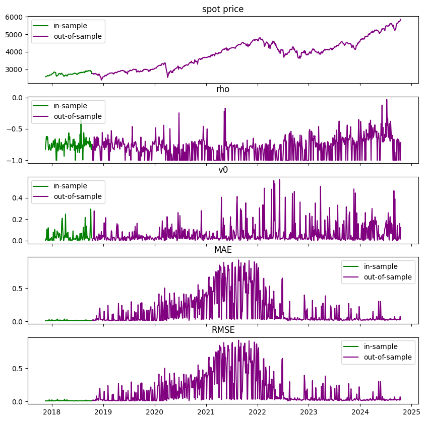
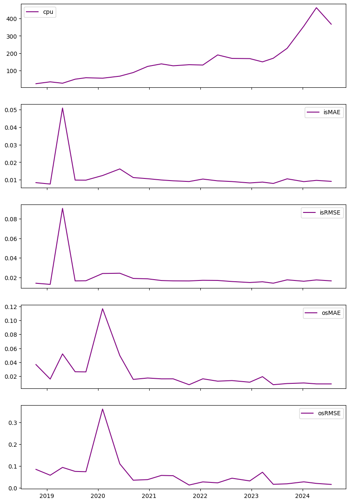

```python
import os
import joblib
import pandas as pd
import numpy as np
import matplotlib.pyplot as plt
from pathlib import Path
```

# functions


```python
def compute_RMSE(diff):
    if len(diff)>0:
        return np.sqrt(np.mean(diff.values**2))
        
def compute_MAE(diff):
    if len(diff)>0:
        return np.mean(np.abs(diff.values))

def plot_errors(train_data,test_data):
    test_diff = test_data['outofsample_error']
    train_diff = train_data['insample_error']
    
    test_plot = test_data[['date','spot_price','rho','v0']].copy()
    test_plot = test_plot.reset_index().set_index('date')
    test_plot['MAE'] = test_diff.resample('D').apply(compute_RMSE)
    test_plot['RMSE'] = test_diff.resample('D').apply(compute_RMSE)
    test_plot = test_plot.reset_index()
    test_plot = test_plot.drop_duplicates(subset=['date'],keep='last').set_index('date').drop(columns='calculation_date')
    
    train_plot = train_data[['date','spot_price','rho','v0']].copy()
    train_plot = train_plot.reset_index().set_index('date')
    train_plot['MAE'] = train_diff.resample('D').apply(compute_RMSE)
    train_plot['RMSE'] = train_diff.resample('D').apply(compute_RMSE)
    train_plot = train_plot.reset_index()
    train_plot = train_plot.drop_duplicates(subset=['date'],keep='last').set_index('date').drop(columns='calculation_date')
    trainx = pd.date_range(start=min(train_data.index),end=max(train_data.index),periods=train_plot.shape[0])
    train_plot.index = trainx

    
    testx = pd.date_range(start=min(test_data.index),end=max(test_data.index),periods=test_plot.shape[0])
    test_plot.index = testx
    
    
    fig,axs = plt.subplots(max(len(train_plot.columns),len(test_plot.columns)),figsize=(10,10),sharex=True)
    for i,col in enumerate(train_plot.columns):
        axs[i].plot(train_plot[col],color='green',label='in-sample')
        axs[i].set_title(col.replace('_',' '))
        axs[i].legend()
    for i,col in enumerate(test_plot.columns):
        axs[i].plot(test_plot[col],color='purple',label='out-of-sample')
        axs[i].set_title(col.replace('_',' '))
        axs[i].legend()
    plt.show()
```

# loading model


```python
from model_settings import ms
root = Path().resolve().parent.parent
models_dir = os.path.join(root,ms.trained_models)
models = pd.Series([f for f in os.listdir(models_dir) if f.find('Legacy')==-1])
for i,m in enumerate(models):
    print(f"{i}     {m}")
```

    0     2024-11-09 024203778497 cboe spx relative barrier
    


```python
selected_model = models.iloc[0]
model_dir = os.path.join(models_dir,selected_model)
pickle = [f for f in os.listdir(model_dir) if f.endswith('.pkl')][0]
picke_dir = os.path.join(model_dir,pickle)
model = joblib.load(picke_dir)
model
```


    {'seed': 1312,
     'raw_data':          spot_price  strike_price  barrier  days_to_maturity updown outin  \
     0            2576.0        2318.4   1288.0                60   Down   Out   
     1            2576.0        2318.4   1288.0                60   Down   Out   
     2            2576.0        2318.4   1288.0                60   Down    In   
     3            2576.0        2318.4   1288.0                60   Down    In   
     4            2576.0        2318.4   1288.0                90   Down   Out   
     ...             ...           ...      ...               ...    ...   ...   
     2142715      5857.0        6442.7   8785.5               540     Up    In   
     2142716      5857.0        6442.7   8785.5               720     Up   Out   
     2142717      5857.0        6442.7   8785.5               720     Up   Out   
     2142718      5857.0        6442.7   8785.5               720     Up    In   
     2142719      5857.0        6442.7   8785.5               720     Up    In   
     
                 w barrier_type_name  rebate  dividend_rate  ...       eta  \
     0        call           DownOut     0.0       0.019360  ...  1.407877   
     1         put           DownOut     0.0       0.019360  ...  1.407877   
     2        call            DownIn     0.0       0.019360  ...  1.407877   
     3         put            DownIn     0.0       0.019360  ...  1.407877   
     4        call           DownOut     0.0       0.019360  ...  1.407877   
     ...       ...               ...     ...            ...  ...       ...   
     2142715   put              UpIn     0.0       0.012687  ...  1.487001   
     2142716  call             UpOut     0.0       0.012687  ...  1.487001   
     2142717   put             UpOut     0.0       0.012687  ...  1.487001   
     2142718  call              UpIn     0.0       0.012687  ...  1.487001   
     2142719   put              UpIn     0.0       0.012687  ...  1.487001   
     
                    v0        calculation_date       date  barrier_price  \
     0        0.000409 2017-11-16 15:56:27.025 2017-11-16     261.916242   
     1        0.000409 2017-11-16 15:56:27.025 2017-11-16       6.430122   
     2        0.000409 2017-11-16 15:56:27.025 2017-11-16       0.000000   
     3        0.000409 2017-11-16 15:56:27.025 2017-11-16       0.000000   
     4        0.000409 2017-11-16 15:56:27.025 2017-11-16     268.635580   
     ...           ...                     ...        ...            ...   
     2142715  0.121595 2024-10-14 15:26:27.717 2024-10-14      20.718472   
     2142716  0.121595 2024-10-14 15:26:27.717 2024-10-14     107.869068   
     2142717  0.121595 2024-10-14 15:26:27.717 2024-10-14     293.413202   
     2142718  0.121595 2024-10-14 15:26:27.717 2024-10-14       0.000000   
     2142719  0.121595 2024-10-14 15:26:27.717 2024-10-14      26.012100   
     
              relative_spot relative_barrier_price relative_barrier  \
     0             1.111111               0.109538         0.555556   
     1             1.111111               0.002802         0.555556   
     2             1.111111               0.000000         0.555556   
     3             1.111111               0.000000         0.555556   
     4             1.111111               0.116342         0.555556   
     ...                ...                    ...              ...   
     2142715       0.909091               0.003237         1.363636   
     2142716       0.909091               0.016883         1.363636   
     2142717       0.909091               0.046247         1.363636   
     2142718       0.909091               0.000000         1.363636   
     2142719       0.909091               0.004019         1.363636   
     
              relative_rebate  relative_observed  
     0                    0.0           0.109538  
     1                    0.0           0.002802  
     2                    0.0           0.000000  
     3                    0.0           0.000000  
     4                    0.0           0.116342  
     ...                  ...                ...  
     2142715              0.0           0.003237  
     2142716              0.0           0.016883  
     2142717              0.0           0.046247  
     2142718              0.0           0.000000  
     2142719              0.0           0.004019  
     
     [2037988 rows x 24 columns],
     'dataset':          spot_price  strike_price  barrier  days_to_maturity updown outin  \
     0            2576.0        2318.4   1288.0                60   Down   Out   
     1            2576.0        2318.4   1288.0                60   Down   Out   
     2            2576.0        2318.4   1288.0                60   Down    In   
     3            2576.0        2318.4   1288.0                60   Down    In   
     4            2576.0        2318.4   1288.0                90   Down   Out   
     ...             ...           ...      ...               ...    ...   ...   
     2142715      5857.0        6442.7   8785.5               540     Up    In   
     2142716      5857.0        6442.7   8785.5               720     Up   Out   
     2142717      5857.0        6442.7   8785.5               720     Up   Out   
     2142718      5857.0        6442.7   8785.5               720     Up    In   
     2142719      5857.0        6442.7   8785.5               720     Up    In   
     
                 w barrier_type_name  rebate  dividend_rate  ...       eta  \
     0        call           DownOut     0.0       0.019360  ...  1.407877   
     1         put           DownOut     0.0       0.019360  ...  1.407877   
     2        call            DownIn     0.0       0.019360  ...  1.407877   
     3         put            DownIn     0.0       0.019360  ...  1.407877   
     4        call           DownOut     0.0       0.019360  ...  1.407877   
     ...       ...               ...     ...            ...  ...       ...   
     2142715   put              UpIn     0.0       0.012687  ...  1.487001   
     2142716  call             UpOut     0.0       0.012687  ...  1.487001   
     2142717   put             UpOut     0.0       0.012687  ...  1.487001   
     2142718  call              UpIn     0.0       0.012687  ...  1.487001   
     2142719   put              UpIn     0.0       0.012687  ...  1.487001   
     
                    v0        calculation_date       date  barrier_price  \
     0        0.000409 2017-11-16 15:56:27.025 2017-11-16     261.916242   
     1        0.000409 2017-11-16 15:56:27.025 2017-11-16       6.430122   
     2        0.000409 2017-11-16 15:56:27.025 2017-11-16       0.000000   
     3        0.000409 2017-11-16 15:56:27.025 2017-11-16       0.000000   
     4        0.000409 2017-11-16 15:56:27.025 2017-11-16     268.635580   
     ...           ...                     ...        ...            ...   
     2142715  0.121595 2024-10-14 15:26:27.717 2024-10-14      20.718472   
     2142716  0.121595 2024-10-14 15:26:27.717 2024-10-14     107.869068   
     2142717  0.121595 2024-10-14 15:26:27.717 2024-10-14     293.413202   
     2142718  0.121595 2024-10-14 15:26:27.717 2024-10-14       0.000000   
     2142719  0.121595 2024-10-14 15:26:27.717 2024-10-14      26.012100   
     
              relative_spot relative_barrier_price relative_barrier  \
     0             1.111111               0.109538         0.555556   
     1             1.111111               0.002802         0.555556   
     2             1.111111               0.000000         0.555556   
     3             1.111111               0.000000         0.555556   
     4             1.111111               0.116342         0.555556   
     ...                ...                    ...              ...   
     2142715       0.909091               0.003237         1.363636   
     2142716       0.909091               0.016883         1.363636   
     2142717       0.909091               0.046247         1.363636   
     2142718       0.909091               0.000000         1.363636   
     2142719       0.909091               0.004019         1.363636   
     
              relative_rebate  relative_observed  
     0                    0.0           0.109538  
     1                    0.0           0.002802  
     2                    0.0           0.000000  
     3                    0.0           0.000000  
     4                    0.0           0.116342  
     ...                  ...                ...  
     2142715              0.0           0.003237  
     2142716              0.0           0.016883  
     2142717              0.0           0.046247  
     2142718              0.0           0.000000  
     2142719              0.0           0.004019  
     
     [2037988 rows x 24 columns],
     'target_name': 'relative_barrier_price',
     'excluded_features': ['barrier_price',
      'asian_price',
      'observed_price',
      'outin',
      'updown',
      'n_fixings',
      'spot_price',
      'strike_price',
      'barrier',
      'rebate',
      'relative_barrier_price',
      'relative_observed'],
     'numerical_features': ['days_to_maturity',
      'dividend_rate',
      'risk_free_rate',
      'theta',
      'kappa',
      'rho',
      'eta',
      'v0',
      'relative_spot',
      'relative_barrier',
      'relative_rebate'],
     'categorical_features': ['w', 'barrier_type_name'],
     'feature_set': ['days_to_maturity',
      'dividend_rate',
      'risk_free_rate',
      'theta',
      'kappa',
      'rho',
      'eta',
      'v0',
      'relative_spot',
      'relative_barrier',
      'relative_rebate',
      'w',
      'barrier_type_name'],
     'n_features': 13,
     'development_dates': 0        2017-11-16
     2161     2017-11-17
     4321     2017-11-22
     6480     2017-11-28
     10800    2017-11-29
                 ...    
     263520   2018-10-01
     265680   2018-10-03
     267840   2018-10-04
     270001   2018-10-09
     272161   2018-10-11
     Name: date, Length: 100, dtype: datetime64[ns],
     'test_dates': 274320    2018-10-15
     278640    2018-10-19
     282960    2018-10-22
     285120    2018-10-31
     287280    2018-11-05
                  ...    
     2129760   2024-09-24
     2131920   2024-10-07
     2134080   2024-10-08
     2136240   2024-10-09
     2138400   2024-10-14
     Name: date, Length: 648, dtype: datetime64[ns],
     'train_data':         spot_price  strike_price    barrier  days_to_maturity updown outin  \
     0           2576.0      2318.400  1288.0000                60   Down   Out   
     1449        2576.0      2511.600  2601.7600               180     Up   Out   
     1448        2576.0      2511.600  2601.7600               180     Up   Out   
     1447        2576.0      2511.600  2601.7600                90     Up    In   
     1446        2576.0      2511.600  2601.7600                90     Up    In   
     ...            ...           ...        ...               ...    ...   ...   
     273051      2767.0      2974.525  2061.4150                60   Down    In   
     273049      2767.0      2974.525  2061.4150                60   Down   Out   
     273047      2767.0      2974.525  1722.4575               720   Down    In   
     273063      2767.0      2974.525  2061.4150               360   Down    In   
     274319      2767.0      3043.700  4150.5000               720     Up    In   
     
                w barrier_type_name  rebate  dividend_rate  ...       date  \
     0       call           DownOut     0.0       0.019360  ... 2017-11-16   
     1449     put             UpOut     0.0       0.019360  ... 2017-11-16   
     1448    call             UpOut     0.0       0.019360  ... 2017-11-16   
     1447     put              UpIn     0.0       0.019360  ... 2017-11-16   
     1446    call              UpIn     0.0       0.019360  ... 2017-11-16   
     ...      ...               ...     ...            ...  ...        ...   
     273051   put            DownIn     0.0       0.018894  ... 2018-10-11   
     273049   put           DownOut     0.0       0.018894  ... 2018-10-11   
     273047   put            DownIn     0.0       0.018894  ... 2018-10-11   
     273063   put            DownIn     0.0       0.018894  ... 2018-10-11   
     274319   put              UpIn     0.0       0.018894  ... 2018-10-11   
     
             barrier_price  relative_spot  relative_barrier_price  \
     0        2.619162e+02       1.111111            1.095377e-01   
     1449     2.037687e+01       1.025641            8.174880e-03   
     1448     9.055459e-01       1.025641            3.634210e-04   
     1447     1.913444e+01       1.025641            7.633000e-03   
     1446     9.395820e+01       1.025641            3.700910e-02   
     ...               ...            ...                     ...   
     273051   1.480799e+03       0.930233            4.963244e-01   
     273049   3.475816e-20       0.930233            1.184061e-23   
     273047   1.411523e+03       0.930233            4.814074e-01   
     273063   1.448898e+03       0.930233            4.854901e-01   
     274319   1.444349e+03       0.909091            4.747775e-01   
     
             relative_barrier  relative_rebate relative_observed insample_target  \
     0               0.555556              0.0      1.095377e-01    1.095377e-01   
     1449            1.035897              0.0      8.174880e-03    8.174880e-03   
     1448            1.035897              0.0      3.634210e-04    3.634210e-04   
     1447            1.035897              0.0      7.633000e-03    7.633000e-03   
     1446            1.035897              0.0      3.700910e-02    3.700910e-02   
     ...                  ...              ...               ...             ...   
     273051          0.693023              0.0      4.963244e-01    4.963244e-01   
     273049          0.693023              0.0      1.184061e-23    1.184061e-23   
     273047          0.579070              0.0      4.814074e-01    4.814074e-01   
     273063          0.693023              0.0      4.854901e-01    4.854901e-01   
     274319          1.363636              0.0      4.747775e-01    4.747775e-01   
     
             insample_prediction  insample_error  
     0                  0.111199    1.661479e-03  
     1449               0.001913   -6.262110e-03  
     1448               0.002506    2.142239e-03  
     1447               0.027197    1.956368e-02  
     1446               0.033295   -3.714343e-03  
     ...                     ...             ...  
     273051             0.481384   -1.494029e-02  
     273049             0.000000   -1.184061e-23  
     273047             0.505964    2.455636e-02  
     273063             0.497392    1.190193e-02  
     274319             0.483033    8.255101e-03  
     
     [255094 rows x 27 columns],
     'test_data':          spot_price  strike_price  barrier  days_to_maturity updown outin  \
     274320       2754.0      2478.600  1377.00                60   Down   Out   
     277191       2759.0      2827.975  2731.41               360   Down    In   
     277192       2759.0      2827.975  2731.41               540   Down   Out   
     277193       2759.0      2827.975  2731.41               540   Down   Out   
     277194       2759.0      2827.975  2731.41               540   Down    In   
     ...             ...           ...      ...               ...    ...   ...   
     2139845      5863.0      5716.425  5921.63                90     Up   Out   
     2139846      5863.0      5716.425  5921.63                90     Up    In   
     2139847      5863.0      5716.425  5921.63                90     Up    In   
     2139833      5863.0      5569.850  8794.50               540     Up   Out   
     2142719      5857.0      6442.700  8785.50               720     Up    In   
     
                 w barrier_type_name  rebate  dividend_rate  ...       date  \
     274320   call           DownOut     0.0       0.019157  ... 2018-10-15   
     277191    put            DownIn     0.0       0.019157  ... 2018-10-15   
     277192   call           DownOut     0.0       0.019157  ... 2018-10-15   
     277193    put           DownOut     0.0       0.019157  ... 2018-10-15   
     277194   call            DownIn     0.0       0.019157  ... 2018-10-15   
     ...       ...               ...     ...            ...  ...        ...   
     2139845   put             UpOut     0.0       0.012687  ... 2024-10-14   
     2139846  call              UpIn     0.0       0.012687  ... 2024-10-14   
     2139847   put              UpIn     0.0       0.012687  ... 2024-10-14   
     2139833   put             UpOut     0.0       0.012687  ... 2024-10-14   
     2142719   put              UpIn     0.0       0.012687  ... 2024-10-14   
     
              barrier_price  relative_spot  relative_barrier_price  \
     274320      295.166997       1.111111                0.119161   
     277191      305.182833       0.975610                0.107304   
     277192       26.455734       0.975610                0.009419   
     277193        0.013818       0.975610                0.000005   
     277194      344.627481       0.975610                0.122804   
     ...                ...            ...                     ...   
     2139845      29.226579       1.025641                0.005165   
     2139846     297.359035       1.025641                0.051579   
     2139847      84.709384       1.025641                0.014941   
     2139833     347.700989       1.052632                0.062590   
     2142719      26.012100       0.909091                0.004019   
     
              relative_barrier  relative_rebate relative_observed  \
     274320           0.555556              0.0          0.119161   
     277191           0.965854              0.0          0.107304   
     277192           0.965854              0.0          0.009419   
     277193           0.965854              0.0          0.000005   
     277194           0.965854              0.0          0.122804   
     ...                   ...              ...               ...   
     2139845          1.035897              0.0          0.005165   
     2139846          1.035897              0.0          0.051579   
     2139847          1.035897              0.0          0.014941   
     2139833          1.578947              0.0          0.062590   
     2142719          1.363636              0.0          0.004019   
     
             outofsample_target  outofsample_prediction  outofsample_error  
     274320            0.119161                0.144113           0.024951  
     277191            0.107304                0.087450          -0.019853  
     277192            0.009419                0.035540           0.026121  
     277193            0.000005                0.001913           0.001908  
     277194            0.122804                0.072967          -0.049837  
     ...                    ...                     ...                ...  
     2139845           0.005165                0.034015           0.028850  
     2139846           0.051579                0.016658          -0.034922  
     2139847           0.014941                0.029108           0.014167  
     2139833           0.062590                0.045861          -0.016729  
     2142719           0.004019                0.001913          -0.002106  
     
     [1782894 rows x 27 columns],
     'train_X':         days_to_maturity  dividend_rate  risk_free_rate     theta  \
     0                     60       0.019360        0.015691  0.065331   
     1449                 180       0.019360        0.015691  0.065331   
     1448                 180       0.019360        0.015691  0.065331   
     1447                  90       0.019360        0.015691  0.065331   
     1446                  90       0.019360        0.015691  0.065331   
     ...                  ...            ...             ...       ...   
     273051                60       0.018894        0.026497  0.155648   
     273049                60       0.018894        0.026497  0.155648   
     273047               720       0.018894        0.026497  0.155648   
     273063               360       0.018894        0.026497  0.155648   
     274319               720       0.018894        0.026497  0.155648   
     
                    kappa       rho       eta        v0  relative_spot  \
     0       2.860057e+00 -0.823604  1.407877  0.000409       1.111111   
     1449    2.860057e+00 -0.823604  1.407877  0.000409       1.025641   
     1448    2.860057e+00 -0.823604  1.407877  0.000409       1.025641   
     1447    2.860057e+00 -0.823604  1.407877  0.000409       1.025641   
     1446    2.860057e+00 -0.823604  1.407877  0.000409       1.025641   
     ...              ...       ...       ...       ...            ...   
     273051  6.822457e-08 -0.745486  1.291029  0.048640       0.930233   
     273049  6.822457e-08 -0.745486  1.291029  0.048640       0.930233   
     273047  6.822457e-08 -0.745486  1.291029  0.048640       0.930233   
     273063  6.822457e-08 -0.745486  1.291029  0.048640       0.930233   
     274319  6.822457e-08 -0.745486  1.291029  0.048640       0.909091   
     
             relative_barrier  relative_rebate     w barrier_type_name  
     0               0.555556              0.0  call           DownOut  
     1449            1.035897              0.0   put             UpOut  
     1448            1.035897              0.0  call             UpOut  
     1447            1.035897              0.0   put              UpIn  
     1446            1.035897              0.0  call              UpIn  
     ...                  ...              ...   ...               ...  
     273051          0.693023              0.0   put            DownIn  
     273049          0.693023              0.0   put           DownOut  
     273047          0.579070              0.0   put            DownIn  
     273063          0.693023              0.0   put            DownIn  
     274319          1.363636              0.0   put              UpIn  
     
     [255094 rows x 13 columns],
     'train_y': 0         1.095377e-01
     1449      8.174880e-03
     1448      3.634210e-04
     1447      7.633000e-03
     1446      3.700910e-02
                   ...     
     273051    4.963244e-01
     273049    1.184061e-23
     273047    4.814074e-01
     273063    4.854901e-01
     274319    4.747775e-01
     Name: relative_barrier_price, Length: 255094, dtype: float64,
     'test_X':          days_to_maturity  dividend_rate  risk_free_rate         theta  \
     274320                 60       0.019157        0.026542  1.072631e-01   
     277191                360       0.019157        0.026542  4.294828e-01   
     277192                540       0.019157        0.026542  4.294828e-01   
     277193                540       0.019157        0.026542  4.294828e-01   
     277194                540       0.019157        0.026542  4.294828e-01   
     ...                   ...            ...             ...           ...   
     2139845                90       0.012687        0.041813  5.510754e-02   
     2139846                90       0.012687        0.041813  5.510754e-02   
     2139847                90       0.012687        0.041813  5.510754e-02   
     2139833               540       0.012687        0.041813  5.510754e-02   
     2142719               720       0.012687        0.041813  2.286232e-09   
     
                  kappa       rho       eta        v0  relative_spot  \
     274320    4.900270 -0.793524  2.158919  0.000133       1.111111   
     277191    0.881996 -0.750606  1.919647  0.000725       0.975610   
     277192    0.881996 -0.750606  1.919647  0.000725       0.975610   
     277193    0.881996 -0.750606  1.919647  0.000725       0.975610   
     277194    0.881996 -0.750606  1.919647  0.000725       0.975610   
     ...            ...       ...       ...       ...            ...   
     2139845  20.301854 -0.670089  6.124247  0.000915       1.025641   
     2139846  20.301854 -0.670089  6.124247  0.000915       1.025641   
     2139847  20.301854 -0.670089  6.124247  0.000915       1.025641   
     2139833  20.301854 -0.670089  6.124247  0.000915       1.052632   
     2142719   4.067045 -0.717809  1.487001  0.121595       0.909091   
     
              relative_barrier  relative_rebate     w barrier_type_name  
     274320           0.555556              0.0  call           DownOut  
     277191           0.965854              0.0   put            DownIn  
     277192           0.965854              0.0  call           DownOut  
     277193           0.965854              0.0   put           DownOut  
     277194           0.965854              0.0  call            DownIn  
     ...                   ...              ...   ...               ...  
     2139845          1.035897              0.0   put             UpOut  
     2139846          1.035897              0.0  call              UpIn  
     2139847          1.035897              0.0   put              UpIn  
     2139833          1.578947              0.0   put             UpOut  
     2142719          1.363636              0.0   put              UpIn  
     
     [1782894 rows x 13 columns],
     'test_y': 274320     0.119161
     277191     0.107304
     277192     0.009419
     277193     0.000005
     277194     0.122804
                  ...   
     2139845    0.005165
     2139846    0.051579
     2139847    0.014941
     2139833    0.062590
     2142719    0.004019
     Name: relative_barrier_price, Length: 1782894, dtype: float64,
     'preprocessor': ColumnTransformer(transformers=[('StandardScaler', StandardScaler(),
                                      ['days_to_maturity', 'dividend_rate',
                                       'risk_free_rate', 'theta', 'kappa', 'rho',
                                       'eta', 'v0', 'relative_spot',
                                       'relative_barrier', 'relative_rebate']),
                                     ('OneHotEncoder',
                                      OneHotEncoder(sparse_output=False),
                                      ['w', 'barrier_type_name'])]),
     'pipeline': None,
     'model': TransformedTargetRegressor(regressor=Pipeline(steps=[('preprocessor',
                                                           ColumnTransformer(transformers=[('StandardScaler',
                                                                                            StandardScaler(),
                                                                                            ['days_to_maturity',
                                                                                             'dividend_rate',
                                                                                             'risk_free_rate',
                                                                                             'theta',
                                                                                             'kappa',
                                                                                             'rho',
                                                                                             'eta',
                                                                                             'v0',
                                                                                             'relative_spot',
                                                                                             'relative_barrier',
                                                                                             'relative_rebate']),
                                                                                           ('OneHotEncoder',
                                                                                            OneHotEncoder(sparse_output=False),
                                                                                            ['w',
                                                                                             'barrier_type_name'])])),
                                                          ('regressor',
                                                           MLPRegressor(alpha=0.01,
                                                                        hidden_layer_sizes=(13,
                                                                                            13),
                                                                        learning_rate='adaptive',
                                                                        learning_rate_init=0.1,
                                                                        max_iter=500,
                                                                        random_state=1312,
                                                                        solver='sgd',
                                                                        warm_start=True))]),
                                transformer=StandardScaler()),
     'model_fit': TransformedTargetRegressor(regressor=Pipeline(steps=[('preprocessor',
                                                           ColumnTransformer(transformers=[('StandardScaler',
                                                                                            StandardScaler(),
                                                                                            ['days_to_maturity',
                                                                                             'dividend_rate',
                                                                                             'risk_free_rate',
                                                                                             'theta',
                                                                                             'kappa',
                                                                                             'rho',
                                                                                             'eta',
                                                                                             'v0',
                                                                                             'relative_spot',
                                                                                             'relative_barrier',
                                                                                             'relative_rebate']),
                                                                                           ('OneHotEncoder',
                                                                                            OneHotEncoder(sparse_output=False),
                                                                                            ['w',
                                                                                             'barrier_type_name'])])),
                                                          ('regressor',
                                                           MLPRegressor(alpha=0.01,
                                                                        hidden_layer_sizes=(13,
                                                                                            13),
                                                                        learning_rate='adaptive',
                                                                        learning_rate_init=0.1,
                                                                        max_iter=500,
                                                                        random_state=1312,
                                                                        solver='sgd',
                                                                        warm_start=True))]),
                                transformer=StandardScaler()),
     'dnn_runtime': 57.319037437438965,
     'numerical_scaler': StandardScaler(),
     'dnn_params': {'alpha': 0.01,
      'hidden_layer_sizes': (13, 13),
      'learning_rate': 'adaptive',
      'learning_rate_init': 0.1,
      'solver': 'sgd',
      'early_stopping': False,
      'max_iter': 500,
      'warm_start': True,
      'tol': 0.0001,
      'random_state': 1312},
     'transformers': [('StandardScaler',
       StandardScaler(),
       ['days_to_maturity',
        'dividend_rate',
        'risk_free_rate',
        'theta',
        'kappa',
        'rho',
        'eta',
        'v0',
        'relative_spot',
        'relative_barrier',
        'relative_rebate']),
      ('OneHotEncoder',
       OneHotEncoder(sparse_output=False),
       ['w', 'barrier_type_name'])],
     'regressor': MLPRegressor(alpha=0.01, hidden_layer_sizes=(13, 13), learning_rate='adaptive',
                  learning_rate_init=0.1, max_iter=500, random_state=1312,
                  solver='sgd', warm_start=True),
     'dnn_pipeline': Pipeline(steps=[('preprocessor',
                      ColumnTransformer(transformers=[('StandardScaler',
                                                       StandardScaler(),
                                                       ['days_to_maturity',
                                                        'dividend_rate',
                                                        'risk_free_rate', 'theta',
                                                        'kappa', 'rho', 'eta', 'v0',
                                                        'relative_spot',
                                                        'relative_barrier',
                                                        'relative_rebate']),
                                                      ('OneHotEncoder',
                                                       OneHotEncoder(sparse_output=False),
                                                       ['w',
                                                        'barrier_type_name'])])),
                     ('regressor',
                      MLPRegressor(alpha=0.01, hidden_layer_sizes=(13, 13),
                                   learning_rate='adaptive', learning_rate_init=0.1,
                                   max_iter=500, random_state=1312, solver='sgd',
                                   warm_start=True))])}


```python
model['train_data']
```


<div>
<style scoped>
    .dataframe tbody tr th:only-of-type {
        vertical-align: middle;
    }

    .dataframe tbody tr th {
        vertical-align: top;
    }

    .dataframe thead th {
        text-align: right;
    }
</style>
<table border="1" class="dataframe">
  <thead>
    <tr style="text-align: right;">
      <th></th>
      <th>spot_price</th>
      <th>strike_price</th>
      <th>barrier</th>
      <th>days_to_maturity</th>
      <th>updown</th>
      <th>outin</th>
      <th>w</th>
      <th>barrier_type_name</th>
      <th>rebate</th>
      <th>dividend_rate</th>
      <th>...</th>
      <th>date</th>
      <th>barrier_price</th>
      <th>relative_spot</th>
      <th>relative_barrier_price</th>
      <th>relative_barrier</th>
      <th>relative_rebate</th>
      <th>relative_observed</th>
      <th>insample_target</th>
      <th>insample_prediction</th>
      <th>insample_error</th>
    </tr>
  </thead>
  <tbody>
    <tr>
      <th>0</th>
      <td>2576.0</td>
      <td>2318.400</td>
      <td>1288.0000</td>
      <td>60</td>
      <td>Down</td>
      <td>Out</td>
      <td>call</td>
      <td>DownOut</td>
      <td>0.0</td>
      <td>0.019360</td>
      <td>...</td>
      <td>2017-11-16</td>
      <td>2.619162e+02</td>
      <td>1.111111</td>
      <td>1.095377e-01</td>
      <td>0.555556</td>
      <td>0.0</td>
      <td>1.095377e-01</td>
      <td>1.095377e-01</td>
      <td>0.111199</td>
      <td>1.661479e-03</td>
    </tr>
    <tr>
      <th>1449</th>
      <td>2576.0</td>
      <td>2511.600</td>
      <td>2601.7600</td>
      <td>180</td>
      <td>Up</td>
      <td>Out</td>
      <td>put</td>
      <td>UpOut</td>
      <td>0.0</td>
      <td>0.019360</td>
      <td>...</td>
      <td>2017-11-16</td>
      <td>2.037687e+01</td>
      <td>1.025641</td>
      <td>8.174880e-03</td>
      <td>1.035897</td>
      <td>0.0</td>
      <td>8.174880e-03</td>
      <td>8.174880e-03</td>
      <td>0.001913</td>
      <td>-6.262110e-03</td>
    </tr>
    <tr>
      <th>1448</th>
      <td>2576.0</td>
      <td>2511.600</td>
      <td>2601.7600</td>
      <td>180</td>
      <td>Up</td>
      <td>Out</td>
      <td>call</td>
      <td>UpOut</td>
      <td>0.0</td>
      <td>0.019360</td>
      <td>...</td>
      <td>2017-11-16</td>
      <td>9.055459e-01</td>
      <td>1.025641</td>
      <td>3.634210e-04</td>
      <td>1.035897</td>
      <td>0.0</td>
      <td>3.634210e-04</td>
      <td>3.634210e-04</td>
      <td>0.002506</td>
      <td>2.142239e-03</td>
    </tr>
    <tr>
      <th>1447</th>
      <td>2576.0</td>
      <td>2511.600</td>
      <td>2601.7600</td>
      <td>90</td>
      <td>Up</td>
      <td>In</td>
      <td>put</td>
      <td>UpIn</td>
      <td>0.0</td>
      <td>0.019360</td>
      <td>...</td>
      <td>2017-11-16</td>
      <td>1.913444e+01</td>
      <td>1.025641</td>
      <td>7.633000e-03</td>
      <td>1.035897</td>
      <td>0.0</td>
      <td>7.633000e-03</td>
      <td>7.633000e-03</td>
      <td>0.027197</td>
      <td>1.956368e-02</td>
    </tr>
    <tr>
      <th>1446</th>
      <td>2576.0</td>
      <td>2511.600</td>
      <td>2601.7600</td>
      <td>90</td>
      <td>Up</td>
      <td>In</td>
      <td>call</td>
      <td>UpIn</td>
      <td>0.0</td>
      <td>0.019360</td>
      <td>...</td>
      <td>2017-11-16</td>
      <td>9.395820e+01</td>
      <td>1.025641</td>
      <td>3.700910e-02</td>
      <td>1.035897</td>
      <td>0.0</td>
      <td>3.700910e-02</td>
      <td>3.700910e-02</td>
      <td>0.033295</td>
      <td>-3.714343e-03</td>
    </tr>
    <tr>
      <th>...</th>
      <td>...</td>
      <td>...</td>
      <td>...</td>
      <td>...</td>
      <td>...</td>
      <td>...</td>
      <td>...</td>
      <td>...</td>
      <td>...</td>
      <td>...</td>
      <td>...</td>
      <td>...</td>
      <td>...</td>
      <td>...</td>
      <td>...</td>
      <td>...</td>
      <td>...</td>
      <td>...</td>
      <td>...</td>
      <td>...</td>
      <td>...</td>
    </tr>
    <tr>
      <th>273051</th>
      <td>2767.0</td>
      <td>2974.525</td>
      <td>2061.4150</td>
      <td>60</td>
      <td>Down</td>
      <td>In</td>
      <td>put</td>
      <td>DownIn</td>
      <td>0.0</td>
      <td>0.018894</td>
      <td>...</td>
      <td>2018-10-11</td>
      <td>1.480799e+03</td>
      <td>0.930233</td>
      <td>4.963244e-01</td>
      <td>0.693023</td>
      <td>0.0</td>
      <td>4.963244e-01</td>
      <td>4.963244e-01</td>
      <td>0.481384</td>
      <td>-1.494029e-02</td>
    </tr>
    <tr>
      <th>273049</th>
      <td>2767.0</td>
      <td>2974.525</td>
      <td>2061.4150</td>
      <td>60</td>
      <td>Down</td>
      <td>Out</td>
      <td>put</td>
      <td>DownOut</td>
      <td>0.0</td>
      <td>0.018894</td>
      <td>...</td>
      <td>2018-10-11</td>
      <td>3.475816e-20</td>
      <td>0.930233</td>
      <td>1.184061e-23</td>
      <td>0.693023</td>
      <td>0.0</td>
      <td>1.184061e-23</td>
      <td>1.184061e-23</td>
      <td>0.000000</td>
      <td>-1.184061e-23</td>
    </tr>
    <tr>
      <th>273047</th>
      <td>2767.0</td>
      <td>2974.525</td>
      <td>1722.4575</td>
      <td>720</td>
      <td>Down</td>
      <td>In</td>
      <td>put</td>
      <td>DownIn</td>
      <td>0.0</td>
      <td>0.018894</td>
      <td>...</td>
      <td>2018-10-11</td>
      <td>1.411523e+03</td>
      <td>0.930233</td>
      <td>4.814074e-01</td>
      <td>0.579070</td>
      <td>0.0</td>
      <td>4.814074e-01</td>
      <td>4.814074e-01</td>
      <td>0.505964</td>
      <td>2.455636e-02</td>
    </tr>
    <tr>
      <th>273063</th>
      <td>2767.0</td>
      <td>2974.525</td>
      <td>2061.4150</td>
      <td>360</td>
      <td>Down</td>
      <td>In</td>
      <td>put</td>
      <td>DownIn</td>
      <td>0.0</td>
      <td>0.018894</td>
      <td>...</td>
      <td>2018-10-11</td>
      <td>1.448898e+03</td>
      <td>0.930233</td>
      <td>4.854901e-01</td>
      <td>0.693023</td>
      <td>0.0</td>
      <td>4.854901e-01</td>
      <td>4.854901e-01</td>
      <td>0.497392</td>
      <td>1.190193e-02</td>
    </tr>
    <tr>
      <th>274319</th>
      <td>2767.0</td>
      <td>3043.700</td>
      <td>4150.5000</td>
      <td>720</td>
      <td>Up</td>
      <td>In</td>
      <td>put</td>
      <td>UpIn</td>
      <td>0.0</td>
      <td>0.018894</td>
      <td>...</td>
      <td>2018-10-11</td>
      <td>1.444349e+03</td>
      <td>0.909091</td>
      <td>4.747775e-01</td>
      <td>1.363636</td>
      <td>0.0</td>
      <td>4.747775e-01</td>
      <td>4.747775e-01</td>
      <td>0.483033</td>
      <td>8.255101e-03</td>
    </tr>
  </tbody>
</table>
<p>255094 rows × 27 columns</p>
</div>


```python
print('model attributes:\n')
for k in model.keys():
    print(k)
```

    model attributes:
    
    seed
    raw_data
    dataset
    target_name
    excluded_features
    numerical_features
    categorical_features
    feature_set
    n_features
    development_dates
    test_dates
    train_data
    test_data
    train_X
    train_y
    test_X
    test_y
    preprocessor
    pipeline
    model
    model_fit
    dnn_runtime
    numerical_scaler
    dnn_params
    transformers
    regressor
    dnn_pipeline
    


```python
for col in model['feature_set']:
    print(f"{col.replace("_"," ")}:",f"\n{model['test_data'][col].copy().squeeze().sort_values().drop_duplicates().reset_index(drop=True)}\n")
print()
```

    days to maturity: 
    0     60
    1     90
    2    180
    3    360
    4    540
    5    720
    Name: days_to_maturity, dtype: int64
    
    dividend rate: 
    0      0.012624
    1      0.012628
    2      0.012641
    3      0.012671
    4      0.012687
             ...   
    580    0.021949
    581    0.022022
    582    0.022742
    583    0.022894
    584    0.023780
    Name: dividend_rate, Length: 585, dtype: float64
    
    risk free rate: 
    0      0.000330
    1      0.000355
    2      0.000380
    3      0.000406
    4      0.000431
             ...   
    483    0.054494
    484    0.054500
    485    0.054513
    486    0.054801
    487    0.054889
    Name: risk_free_rate, Length: 488, dtype: float64
    
    theta: 
    0      8.181674e-11
    1      4.564269e-10
    2      4.968155e-10
    3      2.185459e-09
    4      2.286232e-09
               ...     
    860    1.418934e+00
    861    1.518398e+00
    862    1.732709e+00
    863    1.836051e+00
    864    1.869788e+00
    Name: theta, Length: 865, dtype: float64
    
    kappa: 
    0      3.553361e-10
    1      2.253735e-09
    2      2.648255e-09
    3      3.573693e-09
    4      6.275163e-09
               ...     
    860    5.110843e+01
    861    5.793030e+01
    862    6.161121e+01
    863    6.214923e+01
    864    8.814194e+01
    Name: kappa, Length: 865, dtype: float64
    
    rho: 
    0     -1.000000
    1     -1.000000
    2     -1.000000
    3     -1.000000
    4     -1.000000
             ...   
    860   -0.220776
    861   -0.171731
    862   -0.123455
    863   -0.120773
    864   -0.032933
    Name: rho, Length: 865, dtype: float64
    
    eta: 
    0      1.076358e-08
    1      1.121416e-08
    2      1.220099e-08
    3      1.350544e-07
    4      6.176044e-07
               ...     
    860    9.634333e+00
    861    9.789614e+00
    862    9.897272e+00
    863    9.933107e+00
    864    1.004576e+01
    Name: eta, Length: 865, dtype: float64
    
    v0: 
    0      0.000102
    1      0.000112
    2      0.000120
    3      0.000121
    4      0.000133
             ...   
    860    0.529879
    861    0.558913
    862    0.561926
    863    0.566090
    864    0.567582
    Name: v0, Length: 865, dtype: float64
    
    relative spot: 
    0     0.909091
    1     0.909091
    2     0.909091
    3     0.909091
    4     0.930233
    5     0.930233
    6     0.930233
    7     0.930233
    8     0.952381
    9     0.952381
    10    0.952381
    11    0.952381
    12    0.975610
    13    0.975610
    14    0.975610
    15    0.975610
    16    1.000000
    17    1.000000
    18    1.025641
    19    1.025641
    20    1.052632
    21    1.052632
    22    1.052632
    23    1.081081
    24    1.081081
    25    1.111111
    26    1.111111
    Name: relative_spot, dtype: float64
    
    relative barrier: 
    0      0.454545
    1      0.454545
    2      0.454545
    3      0.454545
    4      0.465116
             ...   
    320    1.621622
    321    1.621622
    322    1.621622
    323    1.666667
    324    1.666667
    Name: relative_barrier, Length: 325, dtype: float64
    
    relative rebate: 
    0    0.0
    Name: relative_rebate, dtype: float64
    
    w: 
    0    call
    1     put
    Name: w, dtype: object
    
    barrier type name: 
    0     DownIn
    1    DownOut
    2       UpIn
    3      UpOut
    Name: barrier_type_name, dtype: object
    
    
    
from sklearn.inspection import partial_dependence,PartialDependenceDisplay

part_disp_X = train_data[model_fit.feature_names_in_]
fig, ax = plt.subplots(figsize=(12, 6))
disp = PartialDependenceDisplay.from_estimator(model_fit, part_disp_X, ['spot_price','v0'], ax=ax)

```python
train_data = model['train_data'].copy()
test_data = model['test_data'].copy()
train_data['calculation_date'] = pd.to_datetime(train_data['calculation_date'],format='mixed')
test_data['calculation_date'] = pd.to_datetime(test_data['calculation_date'],format='mixed')
test_data = test_data.set_index('calculation_date').sort_index()
train_data = train_data.set_index('calculation_date').sort_index()
plot_errors(train_data,test_data)
print(model['feature_set'])
```


    

    


    ['days_to_maturity', 'dividend_rate', 'risk_free_rate', 'theta', 'kappa', 'rho', 'eta', 'v0', 'relative_spot', 'relative_barrier', 'relative_rebate', 'w', 'barrier_type_name']
    

# retraining


```python
from convsklearn import convsklearn
help(convsklearn)
```

    Help on class convsklearn in module convsklearn.convsklearn:
    
    class convsklearn(builtins.object)
     |  convsklearn(target_name='observed_price', excluded_features=['barrier_price', 'asian_price', 'observed_price', 'outin', 'updown', 'n_fixings'], seed=1312)
     |
     |  a proprietary class of convenience wrappers for sklearn
     |
     |  Methods defined here:
     |
     |  __init__(self, target_name='observed_price', excluded_features=['barrier_price', 'asian_price', 'observed_price', 'outin', 'updown', 'n_fixings'], seed=1312)
     |      Initialize self.  See help(type(self)) for accurate signature.
     |
     |  load_data(self, data)
     |
     |  preprocess_data(self, development_dates, test_dates, plot=True)
     |
     |  run_dnn(self, print_details=True)
     |
     |  test_prediction_accuracy(self)
     |
     |  ----------------------------------------------------------------------
     |  Data descriptors defined here:
     |
     |  __dict__
     |      dictionary for instance variables
     |
     |  __weakref__
     |      list of weak references to the object
    
    


```python
test_dates = model['test_dates']
full_dataset = model['dataset']
all_dates = full_dataset['date'].drop_duplicates().sort_values().reset_index(drop=True)
all_dates
```


    0     2017-11-16
    1     2017-11-17
    2     2017-11-22
    3     2017-11-28
    4     2017-11-29
             ...    
    743   2024-09-24
    744   2024-10-07
    745   2024-10-08
    746   2024-10-09
    747   2024-10-14
    Name: date, Length: 748, dtype: datetime64[ns]


```python
retraining_dates = test_dates.iloc[0::retraining_frequency]
retraining_dates = retraining_dates.reset_index(drop=True)

cols = ['cpu','isMAE','isRMSE','osMAE','osRMSE']
df = pd.DataFrame(np.tile(np.nan,(len(retraining_dates),len(cols))),columns=cols,index=retraining_dates)

models = {}
for date in retraining_dates:
    print(date)
    development_dates = all_dates[all_dates<=date]
    subset_test_dates = all_dates[~all_dates.isin(development_dates)].iloc[:retraining_frequency]
    retrainer = convsklearn()
    retrainer.excluded_features += model['excluded_features']
    retrainer.target_name = model['target_name']
    retrainer.load_data(full_dataset)
    retrainer.preprocess_data(development_dates, subset_test_dates,plot=False)
    retrainer.run_dnn(print_details=False)
    retrainer.test_prediction_accuracy()
    models[date] = retrainer.__dict__
    m = retrainer.__dict__
    df.at[date,'cpu'] = m['dnn_runtime']
    df.at[date,'isMAE'] = compute_MAE(m['train_data']['insample_error'])
    df.at[date,'isRMSE'] = compute_RMSE(m['train_data']['insample_error'])
    df.at[date,'osMAE'] = compute_MAE(m['test_data']['outofsample_error'])
    df.at[date,'osRMSE'] = compute_RMSE(m['test_data']['outofsample_error'])
    print(df.dropna())
    print()
```

    2018-10-15 00:00:00
    
    in sample:
         RMSE: 0.013948707376607387
         MAE: 0.008351881129919171
    
    out of sample:
         RMSE: 0.0846781968569097
         MAE: 0.03679471203151676
                      cpu     isMAE    isRMSE     osMAE    osRMSE
    date                                                         
    2018-10-15  24.671341  0.008352  0.013949  0.036795  0.084678
    
    2019-01-25 00:00:00
    
    in sample:
         RMSE: 0.01277469206724158
         MAE: 0.007553749823746203
    
    out of sample:
         RMSE: 0.05771866648268276
         MAE: 0.01602821619742397
                      cpu     isMAE    isRMSE     osMAE    osRMSE
    date                                                         
    2018-10-15  24.671341  0.008352  0.013949  0.036795  0.084678
    2019-01-25  35.381258  0.007554  0.012775  0.016028  0.057719
    
    2019-04-23 00:00:00
    
    in sample:
         RMSE: 0.09076038646191435
         MAE: 0.050911408770733704
    
    out of sample:
         RMSE: 0.09365814858148053
         MAE: 0.05198639625726105
                      cpu     isMAE    isRMSE     osMAE    osRMSE
    date                                                         
    2018-10-15  24.671341  0.008352  0.013949  0.036795  0.084678
    2019-01-25  35.381258  0.007554  0.012775  0.016028  0.057719
    2019-04-23  27.425508  0.050911  0.090760  0.051986  0.093658
    
    2019-07-22 00:00:00
    
    in sample:
         RMSE: 0.016329735358823642
         MAE: 0.009808570590456984
    
    out of sample:
         RMSE: 0.07531962256836884
         MAE: 0.026514701340772124
                      cpu     isMAE    isRMSE     osMAE    osRMSE
    date                                                         
    2018-10-15  24.671341  0.008352  0.013949  0.036795  0.084678
    2019-01-25  35.381258  0.007554  0.012775  0.016028  0.057719
    2019-04-23  27.425508  0.050911  0.090760  0.051986  0.093658
    2019-07-22  50.602227  0.009809  0.016330  0.026515  0.075320
    
    2019-10-07 00:00:00
    
    in sample:
         RMSE: 0.01649515220306235
         MAE: 0.009772521466935512
    
    out of sample:
         RMSE: 0.07396572791404565
         MAE: 0.0263032274969519
                      cpu     isMAE    isRMSE     osMAE    osRMSE
    date                                                         
    2018-10-15  24.671341  0.008352  0.013949  0.036795  0.084678
    2019-01-25  35.381258  0.007554  0.012775  0.016028  0.057719
    2019-04-23  27.425508  0.050911  0.090760  0.051986  0.093658
    2019-07-22  50.602227  0.009809  0.016330  0.026515  0.075320
    2019-10-07  59.047178  0.009773  0.016495  0.026303  0.073966
    
    2020-02-03 00:00:00
    
    in sample:
         RMSE: 0.023927688673629596
         MAE: 0.01240776418635672
    
    out of sample:
         RMSE: 0.3615955196405738
         MAE: 0.11657322117178232
                      cpu     isMAE    isRMSE     osMAE    osRMSE
    date                                                         
    2018-10-15  24.671341  0.008352  0.013949  0.036795  0.084678
    2019-01-25  35.381258  0.007554  0.012775  0.016028  0.057719
    2019-04-23  27.425508  0.050911  0.090760  0.051986  0.093658
    2019-07-22  50.602227  0.009809  0.016330  0.026515  0.075320
    2019-10-07  59.047178  0.009773  0.016495  0.026303  0.073966
    2020-02-03  56.385158  0.012408  0.023928  0.116573  0.361596
    
    2020-06-05 00:00:00
    
    in sample:
         RMSE: 0.024217637104782336
         MAE: 0.016177974311060866
    
    out of sample:
         RMSE: 0.11000146870589605
         MAE: 0.04962843085412662
                      cpu     isMAE    isRMSE     osMAE    osRMSE
    date                                                         
    2018-10-15  24.671341  0.008352  0.013949  0.036795  0.084678
    2019-01-25  35.381258  0.007554  0.012775  0.016028  0.057719
    2019-04-23  27.425508  0.050911  0.090760  0.051986  0.093658
    2019-07-22  50.602227  0.009809  0.016330  0.026515  0.075320
    2019-10-07  59.047178  0.009773  0.016495  0.026303  0.073966
    2020-02-03  56.385158  0.012408  0.023928  0.116573  0.361596
    2020-06-05  67.982938  0.016178  0.024218  0.049628  0.110001
    
    2020-09-09 00:00:00
    
    in sample:
         RMSE: 0.018881901762068602
         MAE: 0.01125539984842567
    
    out of sample:
         RMSE: 0.03490511571491671
         MAE: 0.015562152005421584
                      cpu     isMAE    isRMSE     osMAE    osRMSE
    date                                                         
    2018-10-15  24.671341  0.008352  0.013949  0.036795  0.084678
    2019-01-25  35.381258  0.007554  0.012775  0.016028  0.057719
    2019-04-23  27.425508  0.050911  0.090760  0.051986  0.093658
    2019-07-22  50.602227  0.009809  0.016330  0.026515  0.075320
    2019-10-07  59.047178  0.009773  0.016495  0.026303  0.073966
    2020-02-03  56.385158  0.012408  0.023928  0.116573  0.361596
    2020-06-05  67.982938  0.016178  0.024218  0.049628  0.110001
    2020-09-09  88.866964  0.011255  0.018882  0.015562  0.034905
    
    2020-12-21 00:00:00
    
    in sample:
         RMSE: 0.01846948560087197
         MAE: 0.010604854950996499
    
    out of sample:
         RMSE: 0.03772393955410571
         MAE: 0.01755054271273054
                       cpu     isMAE    isRMSE     osMAE    osRMSE
    date                                                          
    2018-10-15   24.671341  0.008352  0.013949  0.036795  0.084678
    2019-01-25   35.381258  0.007554  0.012775  0.016028  0.057719
    2019-04-23   27.425508  0.050911  0.090760  0.051986  0.093658
    2019-07-22   50.602227  0.009809  0.016330  0.026515  0.075320
    2019-10-07   59.047178  0.009773  0.016495  0.026303  0.073966
    2020-02-03   56.385158  0.012408  0.023928  0.116573  0.361596
    2020-06-05   67.982938  0.016178  0.024218  0.049628  0.110001
    2020-09-09   88.866964  0.011255  0.018882  0.015562  0.034905
    2020-12-21  124.168883  0.010605  0.018469  0.017551  0.037724
    
    2021-03-29 00:00:00
    
    in sample:
         RMSE: 0.0167315403225273
         MAE: 0.009862403490584577
    
    out of sample:
         RMSE: 0.05689407529162297
         MAE: 0.016349967120176983
                       cpu     isMAE    isRMSE     osMAE    osRMSE
    date                                                          
    2018-10-15   24.671341  0.008352  0.013949  0.036795  0.084678
    2019-01-25   35.381258  0.007554  0.012775  0.016028  0.057719
    2019-04-23   27.425508  0.050911  0.090760  0.051986  0.093658
    2019-07-22   50.602227  0.009809  0.016330  0.026515  0.075320
    2019-10-07   59.047178  0.009773  0.016495  0.026303  0.073966
    2020-02-03   56.385158  0.012408  0.023928  0.116573  0.361596
    2020-06-05   67.982938  0.016178  0.024218  0.049628  0.110001
    2020-09-09   88.866964  0.011255  0.018882  0.015562  0.034905
    2020-12-21  124.168883  0.010605  0.018469  0.017551  0.037724
    2021-03-29  138.660298  0.009862  0.016732  0.016350  0.056894
    
    2021-06-21 00:00:00
    
    in sample:
         RMSE: 0.016366767816861968
         MAE: 0.009410102779184125
    
    out of sample:
         RMSE: 0.05556369511699327
         MAE: 0.016377870230138022
                       cpu     isMAE    isRMSE     osMAE    osRMSE
    date                                                          
    2018-10-15   24.671341  0.008352  0.013949  0.036795  0.084678
    2019-01-25   35.381258  0.007554  0.012775  0.016028  0.057719
    2019-04-23   27.425508  0.050911  0.090760  0.051986  0.093658
    2019-07-22   50.602227  0.009809  0.016330  0.026515  0.075320
    2019-10-07   59.047178  0.009773  0.016495  0.026303  0.073966
    2020-02-03   56.385158  0.012408  0.023928  0.116573  0.361596
    2020-06-05   67.982938  0.016178  0.024218  0.049628  0.110001
    2020-09-09   88.866964  0.011255  0.018882  0.015562  0.034905
    2020-12-21  124.168883  0.010605  0.018469  0.017551  0.037724
    2021-03-29  138.660298  0.009862  0.016732  0.016350  0.056894
    2021-06-21  127.728899  0.009410  0.016367  0.016378  0.055564
    
    2021-10-13 00:00:00
    
    in sample:
         RMSE: 0.01630790641120965
         MAE: 0.008984227220923364
    
    out of sample:
         RMSE: 0.012729992143364113
         MAE: 0.007975786911321007
                       cpu     isMAE    isRMSE     osMAE    osRMSE
    date                                                          
    2018-10-15   24.671341  0.008352  0.013949  0.036795  0.084678
    2019-01-25   35.381258  0.007554  0.012775  0.016028  0.057719
    2019-04-23   27.425508  0.050911  0.090760  0.051986  0.093658
    2019-07-22   50.602227  0.009809  0.016330  0.026515  0.075320
    2019-10-07   59.047178  0.009773  0.016495  0.026303  0.073966
    2020-02-03   56.385158  0.012408  0.023928  0.116573  0.361596
    2020-06-05   67.982938  0.016178  0.024218  0.049628  0.110001
    2020-09-09   88.866964  0.011255  0.018882  0.015562  0.034905
    2020-12-21  124.168883  0.010605  0.018469  0.017551  0.037724
    2021-03-29  138.660298  0.009862  0.016732  0.016350  0.056894
    2021-06-21  127.728899  0.009410  0.016367  0.016378  0.055564
    2021-10-13  134.013829  0.008984  0.016308  0.007976  0.012730
    
    2022-01-19 00:00:00
    
    in sample:
         RMSE: 0.01694951566199922
         MAE: 0.010389701510500135
    
    out of sample:
         RMSE: 0.02717230872950508
         MAE: 0.016425974666855393
                       cpu     isMAE    isRMSE     osMAE    osRMSE
    date                                                          
    2018-10-15   24.671341  0.008352  0.013949  0.036795  0.084678
    2019-01-25   35.381258  0.007554  0.012775  0.016028  0.057719
    2019-04-23   27.425508  0.050911  0.090760  0.051986  0.093658
    2019-07-22   50.602227  0.009809  0.016330  0.026515  0.075320
    2019-10-07   59.047178  0.009773  0.016495  0.026303  0.073966
    2020-02-03   56.385158  0.012408  0.023928  0.116573  0.361596
    2020-06-05   67.982938  0.016178  0.024218  0.049628  0.110001
    2020-09-09   88.866964  0.011255  0.018882  0.015562  0.034905
    2020-12-21  124.168883  0.010605  0.018469  0.017551  0.037724
    2021-03-29  138.660298  0.009862  0.016732  0.016350  0.056894
    2021-06-21  127.728899  0.009410  0.016367  0.016378  0.055564
    2021-10-13  134.013829  0.008984  0.016308  0.007976  0.012730
    2022-01-19  132.006220  0.010390  0.016950  0.016426  0.027172
    
    2022-05-05 00:00:00
    
    in sample:
         RMSE: 0.016795872664423186
         MAE: 0.009377492584899618
    
    out of sample:
         RMSE: 0.022788539230639945
         MAE: 0.013021596172273945
                       cpu     isMAE    isRMSE     osMAE    osRMSE
    date                                                          
    2018-10-15   24.671341  0.008352  0.013949  0.036795  0.084678
    2019-01-25   35.381258  0.007554  0.012775  0.016028  0.057719
    2019-04-23   27.425508  0.050911  0.090760  0.051986  0.093658
    2019-07-22   50.602227  0.009809  0.016330  0.026515  0.075320
    2019-10-07   59.047178  0.009773  0.016495  0.026303  0.073966
    2020-02-03   56.385158  0.012408  0.023928  0.116573  0.361596
    2020-06-05   67.982938  0.016178  0.024218  0.049628  0.110001
    2020-09-09   88.866964  0.011255  0.018882  0.015562  0.034905
    2020-12-21  124.168883  0.010605  0.018469  0.017551  0.037724
    2021-03-29  138.660298  0.009862  0.016732  0.016350  0.056894
    2021-06-21  127.728899  0.009410  0.016367  0.016378  0.055564
    2021-10-13  134.013829  0.008984  0.016308  0.007976  0.012730
    2022-01-19  132.006220  0.010390  0.016950  0.016426  0.027172
    2022-05-05  190.101634  0.009377  0.016796  0.013022  0.022789
    
    2022-08-15 00:00:00
    
    in sample:
         RMSE: 0.01570139817327618
         MAE: 0.008972371428430178
    
    out of sample:
         RMSE: 0.0441202588320882
         MAE: 0.01389126049692252
                       cpu     isMAE    isRMSE     osMAE    osRMSE
    date                                                          
    2018-10-15   24.671341  0.008352  0.013949  0.036795  0.084678
    2019-01-25   35.381258  0.007554  0.012775  0.016028  0.057719
    2019-04-23   27.425508  0.050911  0.090760  0.051986  0.093658
    2019-07-22   50.602227  0.009809  0.016330  0.026515  0.075320
    2019-10-07   59.047178  0.009773  0.016495  0.026303  0.073966
    2020-02-03   56.385158  0.012408  0.023928  0.116573  0.361596
    2020-06-05   67.982938  0.016178  0.024218  0.049628  0.110001
    2020-09-09   88.866964  0.011255  0.018882  0.015562  0.034905
    2020-12-21  124.168883  0.010605  0.018469  0.017551  0.037724
    2021-03-29  138.660298  0.009862  0.016732  0.016350  0.056894
    2021-06-21  127.728899  0.009410  0.016367  0.016378  0.055564
    2021-10-13  134.013829  0.008984  0.016308  0.007976  0.012730
    2022-01-19  132.006220  0.010390  0.016950  0.016426  0.027172
    2022-05-05  190.101634  0.009377  0.016796  0.013022  0.022789
    2022-08-15  170.166833  0.008972  0.015701  0.013891  0.044120
    
    2022-12-20 00:00:00
    
    in sample:
         RMSE: 0.014684033810606463
         MAE: 0.008184713887195123
    
    out of sample:
         RMSE: 0.03155832241413112
         MAE: 0.011553950679924452
                       cpu     isMAE    isRMSE     osMAE    osRMSE
    date                                                          
    2018-10-15   24.671341  0.008352  0.013949  0.036795  0.084678
    2019-01-25   35.381258  0.007554  0.012775  0.016028  0.057719
    2019-04-23   27.425508  0.050911  0.090760  0.051986  0.093658
    2019-07-22   50.602227  0.009809  0.016330  0.026515  0.075320
    2019-10-07   59.047178  0.009773  0.016495  0.026303  0.073966
    2020-02-03   56.385158  0.012408  0.023928  0.116573  0.361596
    2020-06-05   67.982938  0.016178  0.024218  0.049628  0.110001
    2020-09-09   88.866964  0.011255  0.018882  0.015562  0.034905
    2020-12-21  124.168883  0.010605  0.018469  0.017551  0.037724
    2021-03-29  138.660298  0.009862  0.016732  0.016350  0.056894
    2021-06-21  127.728899  0.009410  0.016367  0.016378  0.055564
    2021-10-13  134.013829  0.008984  0.016308  0.007976  0.012730
    2022-01-19  132.006220  0.010390  0.016950  0.016426  0.027172
    2022-05-05  190.101634  0.009377  0.016796  0.013022  0.022789
    2022-08-15  170.166833  0.008972  0.015701  0.013891  0.044120
    2022-12-20  169.018661  0.008185  0.014684  0.011554  0.031558
    
    2023-03-21 00:00:00
    
    in sample:
         RMSE: 0.01543491294820455
         MAE: 0.008664811665844008
    
    out of sample:
         RMSE: 0.07158115674110667
         MAE: 0.01950290468789362
                       cpu     isMAE    isRMSE     osMAE    osRMSE
    date                                                          
    2018-10-15   24.671341  0.008352  0.013949  0.036795  0.084678
    2019-01-25   35.381258  0.007554  0.012775  0.016028  0.057719
    2019-04-23   27.425508  0.050911  0.090760  0.051986  0.093658
    2019-07-22   50.602227  0.009809  0.016330  0.026515  0.075320
    2019-10-07   59.047178  0.009773  0.016495  0.026303  0.073966
    2020-02-03   56.385158  0.012408  0.023928  0.116573  0.361596
    2020-06-05   67.982938  0.016178  0.024218  0.049628  0.110001
    2020-09-09   88.866964  0.011255  0.018882  0.015562  0.034905
    2020-12-21  124.168883  0.010605  0.018469  0.017551  0.037724
    2021-03-29  138.660298  0.009862  0.016732  0.016350  0.056894
    2021-06-21  127.728899  0.009410  0.016367  0.016378  0.055564
    2021-10-13  134.013829  0.008984  0.016308  0.007976  0.012730
    2022-01-19  132.006220  0.010390  0.016950  0.016426  0.027172
    2022-05-05  190.101634  0.009377  0.016796  0.013022  0.022789
    2022-08-15  170.166833  0.008972  0.015701  0.013891  0.044120
    2022-12-20  169.018661  0.008185  0.014684  0.011554  0.031558
    2023-03-21  150.228331  0.008665  0.015435  0.019503  0.071581
    
    2023-06-06 00:00:00
    
    in sample:
         RMSE: 0.01398777394099167
         MAE: 0.007881311023087461
    
    out of sample:
         RMSE: 0.016080884427425637
         MAE: 0.007987584069362504
                       cpu     isMAE    isRMSE     osMAE    osRMSE
    date                                                          
    2018-10-15   24.671341  0.008352  0.013949  0.036795  0.084678
    2019-01-25   35.381258  0.007554  0.012775  0.016028  0.057719
    2019-04-23   27.425508  0.050911  0.090760  0.051986  0.093658
    2019-07-22   50.602227  0.009809  0.016330  0.026515  0.075320
    2019-10-07   59.047178  0.009773  0.016495  0.026303  0.073966
    2020-02-03   56.385158  0.012408  0.023928  0.116573  0.361596
    2020-06-05   67.982938  0.016178  0.024218  0.049628  0.110001
    2020-09-09   88.866964  0.011255  0.018882  0.015562  0.034905
    2020-12-21  124.168883  0.010605  0.018469  0.017551  0.037724
    2021-03-29  138.660298  0.009862  0.016732  0.016350  0.056894
    2021-06-21  127.728899  0.009410  0.016367  0.016378  0.055564
    2021-10-13  134.013829  0.008984  0.016308  0.007976  0.012730
    2022-01-19  132.006220  0.010390  0.016950  0.016426  0.027172
    2022-05-05  190.101634  0.009377  0.016796  0.013022  0.022789
    2022-08-15  170.166833  0.008972  0.015701  0.013891  0.044120
    2022-12-20  169.018661  0.008185  0.014684  0.011554  0.031558
    2023-03-21  150.228331  0.008665  0.015435  0.019503  0.071581
    2023-06-06  171.086010  0.007881  0.013988  0.007988  0.016081
    
    2023-09-13 00:00:00
    
    in sample:
         RMSE: 0.0174322611438462
         MAE: 0.010527008286245015
    
    out of sample:
         RMSE: 0.01840952195889214
         MAE: 0.00963951593012852
                       cpu     isMAE    isRMSE     osMAE    osRMSE
    date                                                          
    2018-10-15   24.671341  0.008352  0.013949  0.036795  0.084678
    2019-01-25   35.381258  0.007554  0.012775  0.016028  0.057719
    2019-04-23   27.425508  0.050911  0.090760  0.051986  0.093658
    2019-07-22   50.602227  0.009809  0.016330  0.026515  0.075320
    2019-10-07   59.047178  0.009773  0.016495  0.026303  0.073966
    2020-02-03   56.385158  0.012408  0.023928  0.116573  0.361596
    2020-06-05   67.982938  0.016178  0.024218  0.049628  0.110001
    2020-09-09   88.866964  0.011255  0.018882  0.015562  0.034905
    2020-12-21  124.168883  0.010605  0.018469  0.017551  0.037724
    2021-03-29  138.660298  0.009862  0.016732  0.016350  0.056894
    2021-06-21  127.728899  0.009410  0.016367  0.016378  0.055564
    2021-10-13  134.013829  0.008984  0.016308  0.007976  0.012730
    2022-01-19  132.006220  0.010390  0.016950  0.016426  0.027172
    2022-05-05  190.101634  0.009377  0.016796  0.013022  0.022789
    2022-08-15  170.166833  0.008972  0.015701  0.013891  0.044120
    2022-12-20  169.018661  0.008185  0.014684  0.011554  0.031558
    2023-03-21  150.228331  0.008665  0.015435  0.019503  0.071581
    2023-06-06  171.086010  0.007881  0.013988  0.007988  0.016081
    2023-09-13  228.140574  0.010527  0.017432  0.009640  0.018410
    
    2024-01-10 00:00:00
    
    in sample:
         RMSE: 0.015980852062026832
         MAE: 0.008927564255046802
    
    out of sample:
         RMSE: 0.027469254904369102
         MAE: 0.010475603173727019
                       cpu     isMAE    isRMSE     osMAE    osRMSE
    date                                                          
    2018-10-15   24.671341  0.008352  0.013949  0.036795  0.084678
    2019-01-25   35.381258  0.007554  0.012775  0.016028  0.057719
    2019-04-23   27.425508  0.050911  0.090760  0.051986  0.093658
    2019-07-22   50.602227  0.009809  0.016330  0.026515  0.075320
    2019-10-07   59.047178  0.009773  0.016495  0.026303  0.073966
    2020-02-03   56.385158  0.012408  0.023928  0.116573  0.361596
    2020-06-05   67.982938  0.016178  0.024218  0.049628  0.110001
    2020-09-09   88.866964  0.011255  0.018882  0.015562  0.034905
    2020-12-21  124.168883  0.010605  0.018469  0.017551  0.037724
    2021-03-29  138.660298  0.009862  0.016732  0.016350  0.056894
    2021-06-21  127.728899  0.009410  0.016367  0.016378  0.055564
    2021-10-13  134.013829  0.008984  0.016308  0.007976  0.012730
    2022-01-19  132.006220  0.010390  0.016950  0.016426  0.027172
    2022-05-05  190.101634  0.009377  0.016796  0.013022  0.022789
    2022-08-15  170.166833  0.008972  0.015701  0.013891  0.044120
    2022-12-20  169.018661  0.008185  0.014684  0.011554  0.031558
    2023-03-21  150.228331  0.008665  0.015435  0.019503  0.071581
    2023-06-06  171.086010  0.007881  0.013988  0.007988  0.016081
    2023-09-13  228.140574  0.010527  0.017432  0.009640  0.018410
    2024-01-10  355.490923  0.008928  0.015981  0.010476  0.027469
    
    2024-04-09 00:00:00
    
    in sample:
         RMSE: 0.017345631446629383
         MAE: 0.009648850694868457
    
    out of sample:
         RMSE: 0.020173306106159975
         MAE: 0.009123578744707405
                       cpu     isMAE    isRMSE     osMAE    osRMSE
    date                                                          
    2018-10-15   24.671341  0.008352  0.013949  0.036795  0.084678
    2019-01-25   35.381258  0.007554  0.012775  0.016028  0.057719
    2019-04-23   27.425508  0.050911  0.090760  0.051986  0.093658
    2019-07-22   50.602227  0.009809  0.016330  0.026515  0.075320
    2019-10-07   59.047178  0.009773  0.016495  0.026303  0.073966
    2020-02-03   56.385158  0.012408  0.023928  0.116573  0.361596
    2020-06-05   67.982938  0.016178  0.024218  0.049628  0.110001
    2020-09-09   88.866964  0.011255  0.018882  0.015562  0.034905
    2020-12-21  124.168883  0.010605  0.018469  0.017551  0.037724
    2021-03-29  138.660298  0.009862  0.016732  0.016350  0.056894
    2021-06-21  127.728899  0.009410  0.016367  0.016378  0.055564
    2021-10-13  134.013829  0.008984  0.016308  0.007976  0.012730
    2022-01-19  132.006220  0.010390  0.016950  0.016426  0.027172
    2022-05-05  190.101634  0.009377  0.016796  0.013022  0.022789
    2022-08-15  170.166833  0.008972  0.015701  0.013891  0.044120
    2022-12-20  169.018661  0.008185  0.014684  0.011554  0.031558
    2023-03-21  150.228331  0.008665  0.015435  0.019503  0.071581
    2023-06-06  171.086010  0.007881  0.013988  0.007988  0.016081
    2023-09-13  228.140574  0.010527  0.017432  0.009640  0.018410
    2024-01-10  355.490923  0.008928  0.015981  0.010476  0.027469
    2024-04-09  461.648249  0.009649  0.017346  0.009124  0.020173
    
    2024-07-24 00:00:00
    
    in sample:
         RMSE: 0.01635725391042906
         MAE: 0.009080265980242508
    
    out of sample:
         RMSE: 0.015509965136221146
         MAE: 0.009109083187525045
                       cpu     isMAE    isRMSE     osMAE    osRMSE
    date                                                          
    2018-10-15   24.671341  0.008352  0.013949  0.036795  0.084678
    2019-01-25   35.381258  0.007554  0.012775  0.016028  0.057719
    2019-04-23   27.425508  0.050911  0.090760  0.051986  0.093658
    2019-07-22   50.602227  0.009809  0.016330  0.026515  0.075320
    2019-10-07   59.047178  0.009773  0.016495  0.026303  0.073966
    2020-02-03   56.385158  0.012408  0.023928  0.116573  0.361596
    2020-06-05   67.982938  0.016178  0.024218  0.049628  0.110001
    2020-09-09   88.866964  0.011255  0.018882  0.015562  0.034905
    2020-12-21  124.168883  0.010605  0.018469  0.017551  0.037724
    2021-03-29  138.660298  0.009862  0.016732  0.016350  0.056894
    2021-06-21  127.728899  0.009410  0.016367  0.016378  0.055564
    2021-10-13  134.013829  0.008984  0.016308  0.007976  0.012730
    2022-01-19  132.006220  0.010390  0.016950  0.016426  0.027172
    2022-05-05  190.101634  0.009377  0.016796  0.013022  0.022789
    2022-08-15  170.166833  0.008972  0.015701  0.013891  0.044120
    2022-12-20  169.018661  0.008185  0.014684  0.011554  0.031558
    2023-03-21  150.228331  0.008665  0.015435  0.019503  0.071581
    2023-06-06  171.086010  0.007881  0.013988  0.007988  0.016081
    2023-09-13  228.140574  0.010527  0.017432  0.009640  0.018410
    2024-01-10  355.490923  0.008928  0.015981  0.010476  0.027469
    2024-04-09  461.648249  0.009649  0.017346  0.009124  0.020173
    2024-07-24  366.825937  0.009080  0.016357  0.009109  0.015510
    
    


```python
from plotters import PlotCols
PlotCols(df)
```

    ['cpu', 'isMAE', 'isRMSE', 'osMAE', 'osRMSE']
    


    

    

