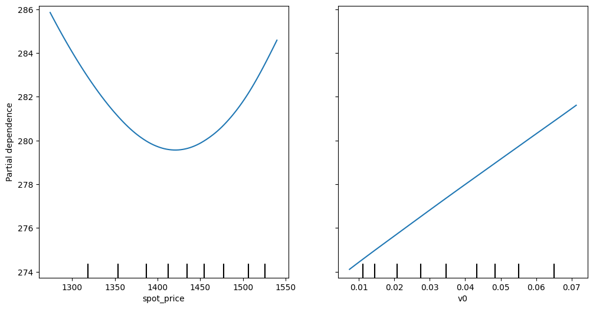
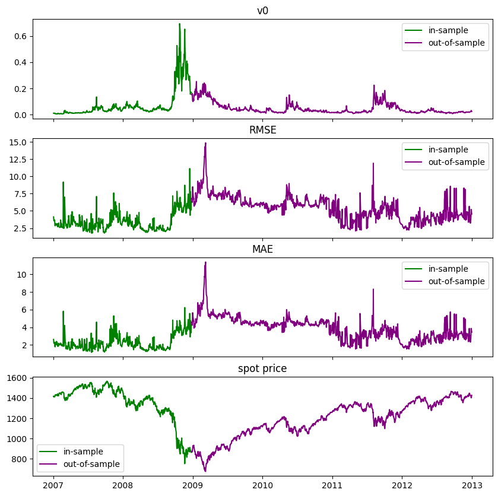
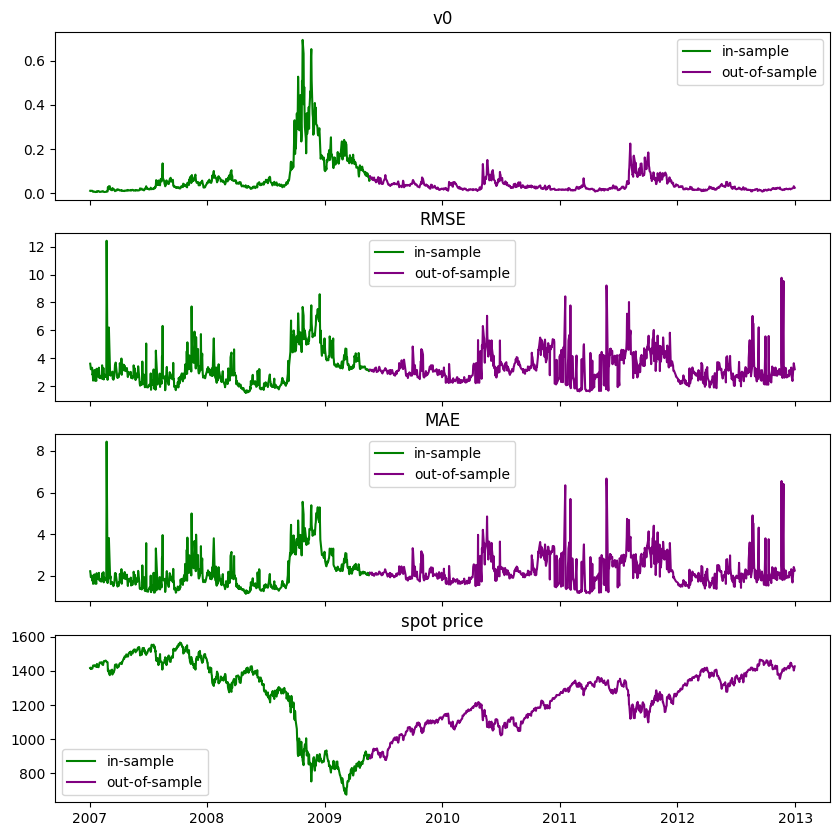
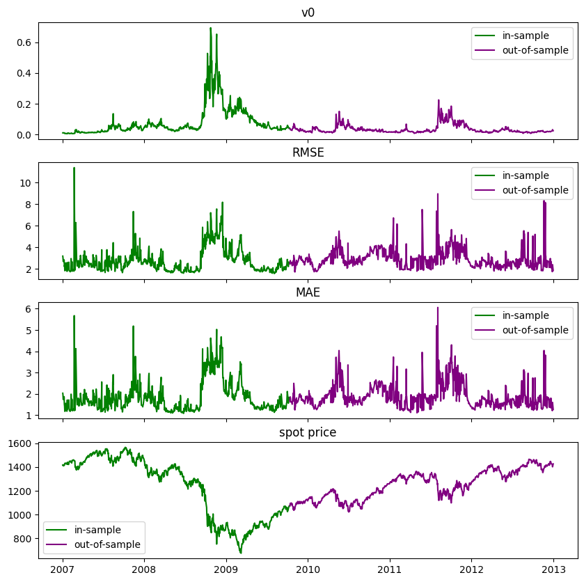
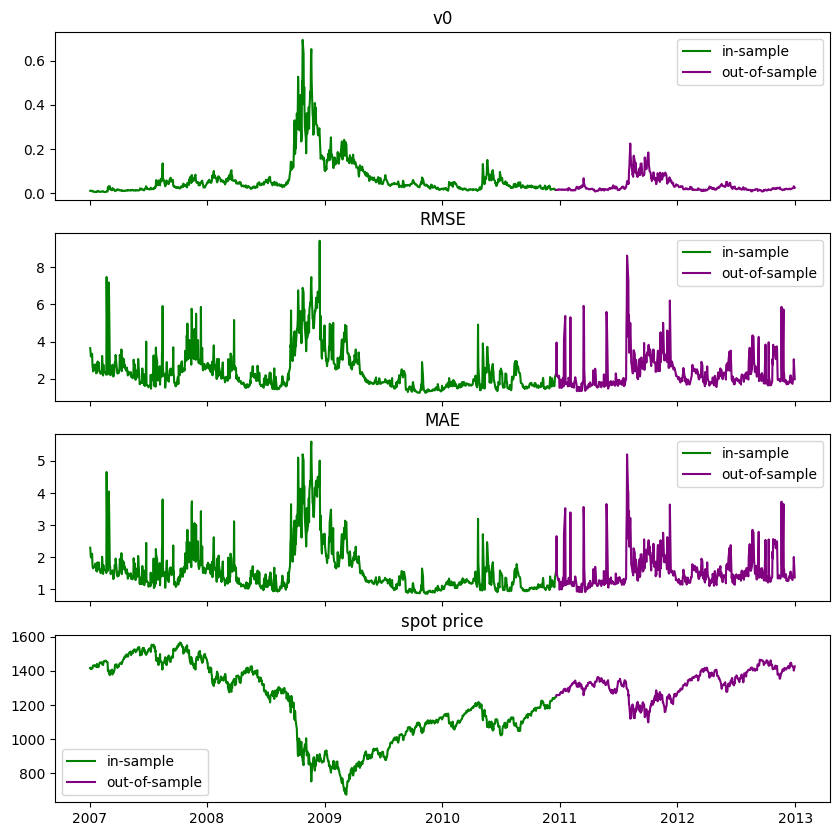
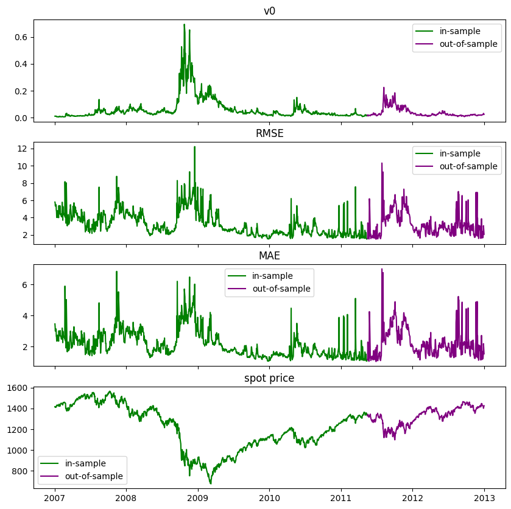
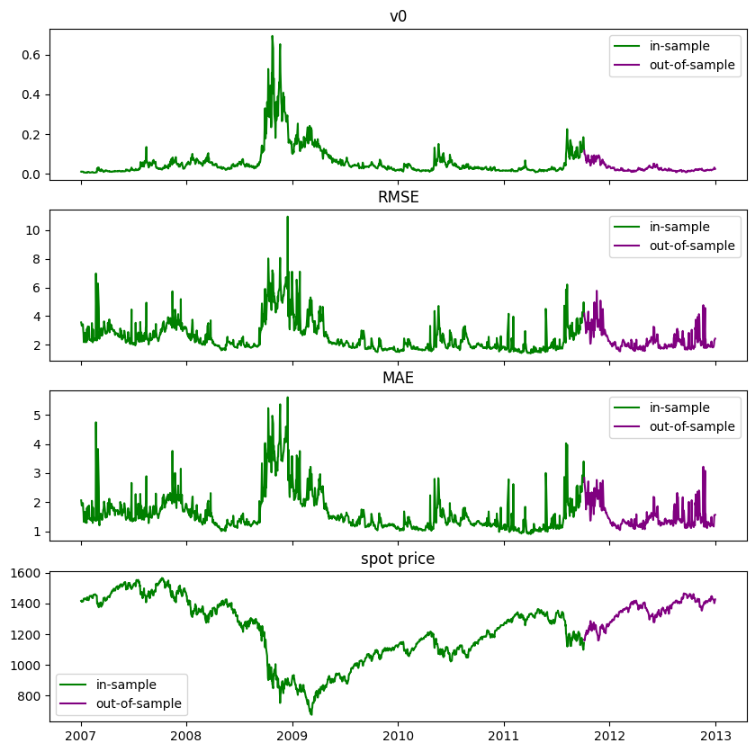
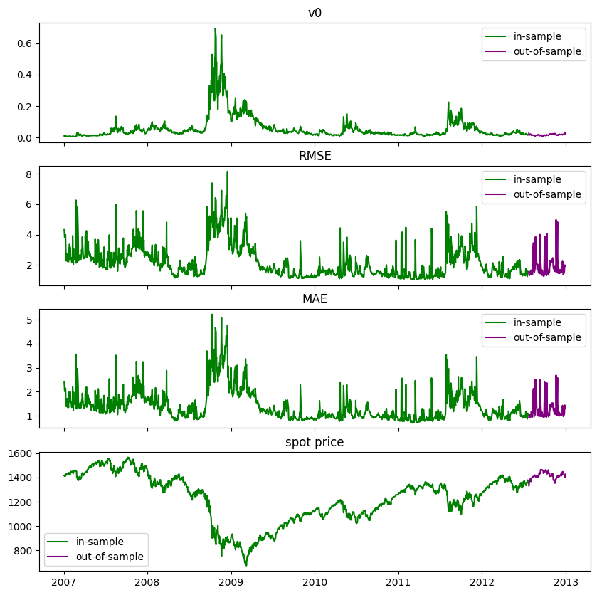
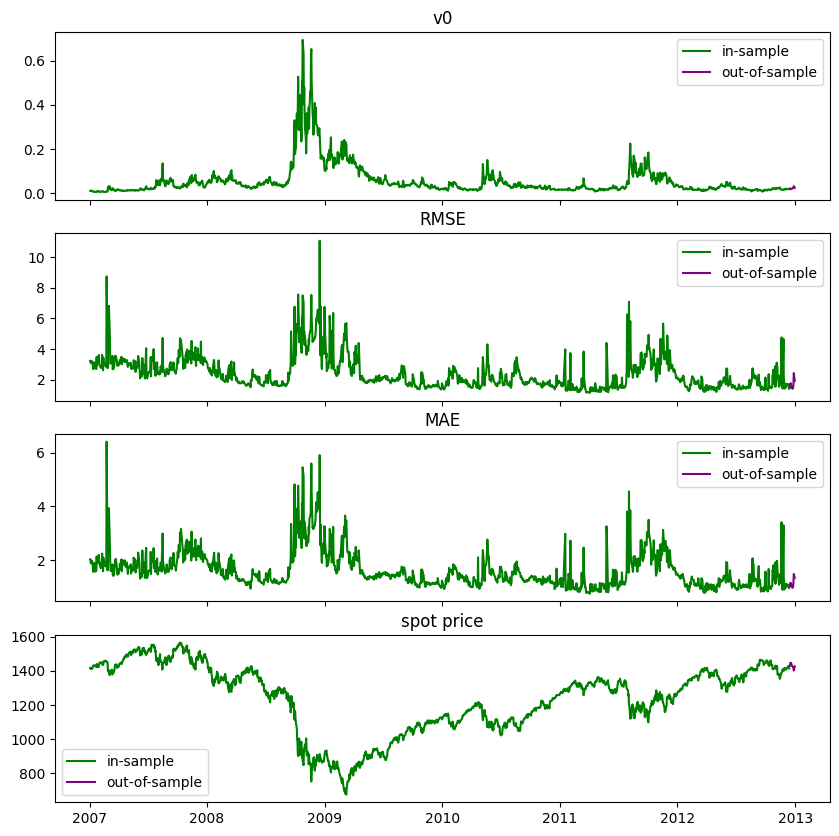

```python
import os
import joblib
import pandas as pd
import numpy as np
import matplotlib.pyplot as plt
from pathlib import Path
```

# functions


```python
def compute_RMSE(diff):
    if len(diff)>0:
        return np.sqrt(np.mean(diff.values**2))
        
def compute_MAE(diff):
    if len(diff)>0:
        return np.mean(np.abs(diff.values))

def plot_errors(plotcols, test_data, train_data):
    test_diff = test_data['outofsample_error']
    train_diff = train_data['insample_error']
    
    test_data['RMSE'] = test_diff.resample('D').apply(compute_RMSE).dropna()
    test_data['MAE'] = test_diff.resample('D').apply(compute_MAE).dropna()
    test_plot = test_data[plotcols].copy().drop_duplicates()
    
    train_data['RMSE'] = train_diff.resample('D').apply(compute_RMSE).dropna()
    train_data['MAE'] = train_diff.resample('D').apply(compute_MAE).dropna()
    train_plot = train_data[plotcols].copy().drop_duplicates()
    
    fig,axs = plt.subplots(len(plotcols),figsize=(10,10),sharex=True)
    for i,col in enumerate(plotcols):
        axs[i].plot(train_plot[col],color='green',label='in-sample')
        axs[i].set_title(col.replace('_',' '))
        axs[i].legend()
    for i,col in enumerate(plotcols):
        axs[i].plot(test_plot[col],color='purple',label='out-of-sample')
        axs[i].set_title(col.replace('_',' '))
        axs[i].legend()
    plt.show()

def retrain(old_train_data,old_test_data,train_to_date):
    new_train = pd.concat([old_train_data,old_test_data[old_test_data.index<=train_to_date]],ignore_index=False).dropna(how='any',axis=1).reset_index(drop=False)
    new_test = old_test_data[~old_test_data.index.isin(new_train['calculation_date'])].copy().reset_index(drop=False)
    arrs = trainer.get_train_test_arrays(new_train, new_test)
    train_X = arrs['train_X']
    train_y = arrs['train_y']
    test_X = arrs['test_X']
    test_y = arrs['test_y']
    preprocessor = trainer.preprocess()
    retrained_model = trainer.run_dnn(preprocessor,train_X,train_y)
    train_test = trainer.test_prediction_accuracy(new_train,new_test,retrained_model)
    new_test_data = train_test['test_data'].set_index('calculation_date')
    new_train_data = train_test['train_data'].set_index('calculation_date')
    print()
    plot_errors(plotcols,new_test_data,new_train_data)
    return new_train_data, new_test_data
```

# loading model


```python
from model_settings import ms
root = Path().resolve().parent.parent
models_dir = os.path.join(root,ms.trained_models)
models = [f for f in os.listdir(models_dir) if f.find('ipynb')==-1]
for i,m in enumerate(models):
    print(f"{i}     {m}")
```

    0     2024_10_31 203810934918 tuned bloomberg barriers
    1     2024_10_31 204451887463 tuned bloomberg asians
    

# loading data


```python
"""
select model here
"""
model = models[1]
""""""

plotcols = ['v0','RMSE', 'MAE','spot_price']

from convsklearn import asian_trainer, barrier_trainer

model_dir = os.path.join(models_dir,model)
model_files = [f for f in os.listdir(model_dir) if f.find('ipynb')==-1 and f.find('.html')==-1]
for i,m in enumerate(model_files):
    print(f"{i}     {m}")
print()
if any('asian' in file for file in model_files):
    trainer = asian_trainer
if any('barrier' in file for file in model_files):
    trainer = barrier_trainer

train_data = pd.read_csv(os.path.join(model_dir,[f for f in model_files if f.find('train')!=-1][0])).iloc[:,1:].copy()
test_data = pd.read_csv(os.path.join(model_dir,[f for f in model_files if f. find('test')!=-1][0])).iloc[:,1:].copy()
train_data['calculation_date'] = pd.to_datetime(train_data['calculation_date'])
test_data['calculation_date'] = pd.to_datetime(test_data['calculation_date'])
train_data = train_data.set_index('calculation_date')
test_data = test_data.set_index('calculation_date')
test_dates = pd.Series(test_data.index).sort_values(ascending=True).drop_duplicates().reset_index(drop=True)
model_fit = joblib.load(os.path.join(model_dir,[f for f in model_files if f.endswith('.pkl')][0]))

for col in trainer.feature_set:
    print(f"{col.replace("_"," "):}",f"\n{test_data[col].copy().squeeze().sort_values().drop_duplicates().reset_index(drop=True)}\n")
print()
print(model_fit)

plot_errors(plotcols, test_data, train_data)
```

    0     2024_10_31 204451887463 tuned bloomberg asians test_data.csv
    1     2024_10_31 204451887463 tuned bloomberg asians train_data.csv
    2     2024_10_31 204451887463 tuned bloomberg asians.pkl
    
    spot price 
    0        676.03
    1        682.43
    2        683.09
    3        696.44
    4        701.13
             ...   
    1095    1461.17
    1096    1461.21
    1097    1461.31
    1098    1461.36
    1099    1465.27
    Name: spot_price, Length: 1100, dtype: float64
    
    strike price 
    0        338.0
    1        341.0
    2        348.0
    3        350.0
    4        356.0
             ...  
    2380    2189.0
    2381    2190.0
    2382    2191.0
    2383    2192.0
    2384    2197.0
    Name: strike_price, Length: 2385, dtype: float64
    
    days to maturity 
    0      1
    1      7
    2     28
    3     84
    4    168
    5    336
    Name: days_to_maturity, dtype: int64
    
    risk free rate 
    0    0.04
    Name: risk_free_rate, dtype: float64
    
    dividend rate 
    0       0.017912
    1       0.017942
    2       0.017970
    3       0.017981
    4       0.017985
              ...   
    1008    0.035255
    1009    0.035276
    1010    0.035596
    1011    0.035690
    1012    0.037735
    Name: dividend_rate, Length: 1013, dtype: float64
    
    kappa 
    0        0.083258
    1        0.090921
    2        0.098043
    3        0.098494
    4        0.102884
              ...    
    1106    12.960913
    1107    13.113228
    1108    13.250228
    1109    15.696333
    1110    15.991443
    Name: kappa, Length: 1111, dtype: float64
    
    theta 
    0       0.037838
    1       0.038747
    2       0.039401
    3       0.040521
    4       0.040844
              ...   
    1106    0.311501
    1107    0.312746
    1108    0.340959
    1109    0.350397
    1110    0.356100
    Name: theta, Length: 1111, dtype: float64
    
    rho 
    0      -1.000000
    1      -1.000000
    2      -1.000000
    3      -1.000000
    4      -1.000000
              ...   
    1106   -0.234005
    1107   -0.220616
    1108   -0.203652
    1109   -0.196170
    1110   -0.181764
    Name: rho, Length: 1111, dtype: float64
    
    eta 
    0       0.110964
    1       0.112310
    2       0.113278
    3       0.113457
    4       0.113904
              ...   
    1106    1.109709
    1107    1.213266
    1108    1.394869
    1109    1.523884
    1110    1.528820
    Name: eta, Length: 1111, dtype: float64
    
    v0 
    0       0.007385
    1       0.007560
    2       0.008220
    3       0.008839
    4       0.009003
              ...   
    1106    0.527421
    1107    0.620853
    1108    0.631678
    1109    0.652337
    1110    0.694016
    Name: v0, Length: 1111, dtype: float64
    
    fixing frequency 
    0      1
    1      7
    2     28
    3     84
    4    168
    5    336
    Name: fixing_frequency, dtype: int64
    
    n fixings 
    0       1.0
    1       2.0
    2       3.0
    3       4.0
    4       6.0
    5       7.0
    6      12.0
    7      24.0
    8      28.0
    9      48.0
    10     84.0
    11    168.0
    12    336.0
    Name: n_fixings, dtype: float64
    
    past fixings 
    0    0
    Name: past_fixings, dtype: int64
    
    averaging type 
    0    arithmetic
    1     geometric
    Name: averaging_type, dtype: object
    
    w 
    0    call
    1     put
    Name: w, dtype: object
    
    
    TransformedTargetRegressor(regressor=Pipeline(steps=[('preprocessor',
                                                          ColumnTransformer(transformers=[('StandardScaler',
                                                                                           StandardScaler(),
                                                                                           ['spot_price',
                                                                                            'strike_price',
                                                                                            'days_to_maturity',
                                                                                            'risk_free_rate',
                                                                                            'dividend_rate',
                                                                                            'kappa',
                                                                                            'theta',
                                                                                            'rho',
                                                                                            'eta',
                                                                                            'v0',
                                                                                            'fixing_frequency',
                                                                                            'n_fixings',
                                                                                            'past_fixings']),
                                                                                          ('OneHotEncoder',
                                                                                           OneHotEncoder(sparse_output=False),
                                                                                           ['averaging_type',
                                                                                            'w'])])),
                                                         ('regressor',
                                                          MLPRegressor(alpha=0.01,
                                                                       hidden_layer_sizes=(15,
                                                                                           15),
                                                                       learning_rate='adaptive',
                                                                       learning_rate_init=0.1,
                                                                       max_iter=500,
                                                                       solver='sgd',
                                                                       warm_start=True))]),
                               transformer=Pipeline(steps=[('StandardScaler',
                                                            StandardScaler())]))
    


    

    


```python
from sklearn.inspection import partial_dependence,PartialDependenceDisplay

part_disp_X = train_data[model_fit.feature_names_in_]
fig, ax = plt.subplots(figsize=(12, 6))
disp = PartialDependenceDisplay.from_estimator(model_fit, part_disp_X, ['spot_price','v0'], ax=ax)
```


    

    


# retraining


```python
retraining_frequency = 100  # days
retraining_i = np.arange(retraining_frequency,len(test_dates),retraining_frequency)
retraining_dates = test_dates[retraining_i].reset_index(drop=True)
print(retraining_dates)
```

    0    2008-12-24
    1    2009-05-20
    2    2009-10-12
    3    2010-03-08
    4    2010-07-29
    5    2010-12-20
    6    2011-05-13
    7    2011-10-05
    8    2012-02-29
    9    2012-07-23
    10   2012-12-14
    Name: calculation_date, dtype: datetime64[ns]
    


```python
for date in retraining_dates:
    print()
    print(date.strftime('%c'))
    retrain(train_data,test_data,date)
    print()
```

    
    Wed Dec 24 00:00:00 2008
    
    training...
    
    alpha: 0.01
    hidden_layer_sizes: (15, 15)
    learning_rate: adaptive
    learning_rate_init: 0.1
    solver: sgd
    early_stopping: False
    max_iter: 500
    warm_start: True
    tol: 0.0001
    cpu: 29.620647192001343
    
    in sample:
         RMSE: 3.773002088805194
         MAE: 2.3182461650655197
    
    out of sample:
         RMSE: 5.764383897231534
         MAE: 3.950303491896393
    
    


    

    


    
    
    Wed May 20 00:00:00 2009
    
    training...
    
    alpha: 0.01
    hidden_layer_sizes: (15, 15)
    learning_rate: adaptive
    learning_rate_init: 0.1
    solver: sgd
    early_stopping: False
    max_iter: 500
    warm_start: True
    tol: 0.0001
    cpu: 35.89863634109497
    
    in sample:
         RMSE: 3.602324192178917
         MAE: 2.23164676908002
    
    out of sample:
         RMSE: 3.5030862175828177
         MAE: 2.272099233916727
    
    


    

    


    
    
    Mon Oct 12 00:00:00 2009
    
    training...
    
    alpha: 0.01
    hidden_layer_sizes: (15, 15)
    learning_rate: adaptive
    learning_rate_init: 0.1
    solver: sgd
    early_stopping: False
    max_iter: 500
    warm_start: True
    tol: 0.0001
    cpu: 42.035061836242676
    
    in sample:
         RMSE: 3.0125768460660747
         MAE: 1.8708849806022894
    
    out of sample:
         RMSE: 3.059481402388582
         MAE: 1.90893879429721
    
    


    

    


    
    
    Mon Mar  8 00:00:00 2010
    
    training...
    
    alpha: 0.01
    hidden_layer_sizes: (15, 15)
    learning_rate: adaptive
    learning_rate_init: 0.1
    solver: sgd
    early_stopping: False
    max_iter: 500
    warm_start: True
    tol: 0.0001
    cpu: 50.33138608932495
    
    in sample:
         RMSE: 2.7523803417141384
         MAE: 1.6074693146815087
    
    out of sample:
         RMSE: 2.6263640308614415
         MAE: 1.5504487205639428
    
    


    

    


    
    
    Thu Jul 29 00:00:00 2010
    
    training...
    
    alpha: 0.01
    hidden_layer_sizes: (15, 15)
    learning_rate: adaptive
    learning_rate_init: 0.1
    solver: sgd
    early_stopping: False
    max_iter: 500
    warm_start: True
    tol: 0.0001
    cpu: 53.99391508102417
    
    in sample:
         RMSE: 3.0686367236002217
         MAE: 1.8951388407943566
    
    out of sample:
         RMSE: 2.756903419457834
         MAE: 1.7436067379489901
    
    


    

    


    
    
    Mon Dec 20 00:00:00 2010
    
    training...
    
    alpha: 0.01
    hidden_layer_sizes: (15, 15)
    learning_rate: adaptive
    learning_rate_init: 0.1
    solver: sgd
    early_stopping: False
    max_iter: 500
    warm_start: True
    tol: 0.0001
    cpu: 59.601287603378296
    
    in sample:
         RMSE: 2.6893540054944856
         MAE: 1.595534051583427
    
    out of sample:
         RMSE: 2.5613121281960063
         MAE: 1.571554981964868
    
    


    

    


    
    
    Fri May 13 00:00:00 2011
    
    training...
    
    alpha: 0.01
    hidden_layer_sizes: (15, 15)
    learning_rate: adaptive
    learning_rate_init: 0.1
    solver: sgd
    early_stopping: False
    max_iter: 500
    warm_start: True
    tol: 0.0001
    cpu: 65.43385028839111
    
    in sample:
         RMSE: 3.589399880282746
         MAE: 2.186115337370316
    
    out of sample:
         RMSE: 3.541833044388677
         MAE: 2.272450739134991
    
    


    

    


    
    
    Wed Oct  5 00:00:00 2011
    
    training...
    
    alpha: 0.01
    hidden_layer_sizes: (15, 15)
    learning_rate: adaptive
    learning_rate_init: 0.1
    solver: sgd
    early_stopping: False
    max_iter: 500
    warm_start: True
    tol: 0.0001
    cpu: 73.29834532737732
    
    in sample:
         RMSE: 2.8629758999037414
         MAE: 1.6786975795644425
    
    out of sample:
         RMSE: 2.4482647003874947
         MAE: 1.5137793865346414
    
    


    

    


    
    
    Wed Feb 29 00:00:00 2012
    
    training...
    
    alpha: 0.01
    hidden_layer_sizes: (15, 15)
    learning_rate: adaptive
    learning_rate_init: 0.1
    solver: sgd
    early_stopping: False
    max_iter: 500
    warm_start: True
    tol: 0.0001
    cpu: 76.53242349624634
    
    in sample:
         RMSE: 2.751475619579555
         MAE: 1.6275804689711826
    
    out of sample:
         RMSE: 2.279495148785543
         MAE: 1.5352460704401882
    
    


    

    


    
    
    Mon Jul 23 00:00:00 2012
    
    training...
    
    alpha: 0.01
    hidden_layer_sizes: (15, 15)
    learning_rate: adaptive
    learning_rate_init: 0.1
    solver: sgd
    early_stopping: False
    max_iter: 500
    warm_start: True
    tol: 0.0001
    cpu: 82.79901576042175
    
    in sample:
         RMSE: 2.471863179994992
         MAE: 1.4292061397881999
    
    out of sample:
         RMSE: 2.052222101613885
         MAE: 1.2574460312550588
    
    


    

    


    
    
    Fri Dec 14 00:00:00 2012
    
    training...
    
    alpha: 0.01
    hidden_layer_sizes: (15, 15)
    learning_rate: adaptive
    learning_rate_init: 0.1
    solver: sgd
    early_stopping: False
    max_iter: 500
    warm_start: True
    tol: 0.0001
    cpu: 87.5305655002594
    
    in sample:
         RMSE: 2.6574523137890864
         MAE: 1.6435928319659494
    
    out of sample:
         RMSE: 1.7126566114580903
         MAE: 1.1496911107696346
    
    


    

    


    
    
