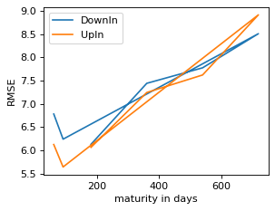
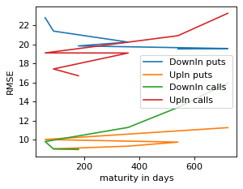
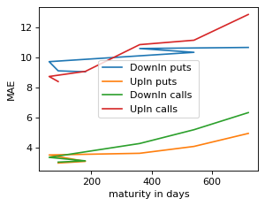

```python
import os
import pandas as pd
import numpy as np
import matplotlib.pyplot as plt
import time
pd.set_option('display.float_format', '{:.2f}'.format)
start_time = time.time()
```

# Import Model


```python
models_path = os.path.join(os.getcwd(),'trained_models')
models = os.listdir(models_path)
for i, path in enumerate(models):
    print(f"{i}   {path}")
```

    0   2024_10_07 17-55-55 Deep Neural Network 3oosRMSE
    1   2024_10_08 00-00-41 Deep Neural Network 3oosRMSE
    2   2024_10_08 00-24-59 Deep Neural Network 3oosRMSE
    3   2024_10_08 00-42-22 Deep Neural Network 3oosRMSE
    4   2024_10_09 09-01-43 Deep Neural Network 6oosRMSE
    5   2024_10_09 09-08-27 Deep Neural Network 9oosRMSE
    6   2024_10_09 09-11-43 Deep Neural Network 11oosRMSE
    7   2024_10_09 10-09-20 Deep Neural Network 15oosRMSE
    8   2024_10_09 11-11-13 Deep Neural Network 16oosRMSE
    


```python
model = models[8]
model
```


    '2024_10_09 11-11-13 Deep Neural Network 16oosRMSE'


```python
model_path = os.path.join(models_path,model)
```


```python
model_files = os.listdir(model_path)
model_files
```


    ['2024_10_09 11-11-13 Deep Neural Network 16oosRMSE insample.csv',
     '2024_10_09 11-11-13 Deep Neural Network 16oosRMSE outsample.csv',
     '2024_10_09 11-11-13 Deep Neural Network 16oosRMSE.pkl',
     '2024_10_09 11-11-13 Deep Neural Network 16oosRMSE.txt']


```python
spec_path = os.path.join(model_path,[file for file in model_files if file.endswith('.txt')][0])
```


```python
with open(spec_path, "r") as specs:
    for line in specs:
        print(line.strip())
```

    Wed Oct  9 11:09:07 2024
    spot(s):
    [1214.91 1228.34 1235.03 1240.01 1244.81 1245.64 1251.98 1253.33 1253.75
    1257.85 1259.82 1260.44 1260.47 1261.75 1263.07 1263.23 1267.3  1273.68
    1274.24 1276.78 1276.84 1279.06 1279.51 1281.9  1283.57 1284.14 1285.13
    1288.77 1293.41 1298.46 1304.46 1308.8  1311.13 1314.51 1314.81 1315.19
    1317.94 1318.45 1320.45 1322.21 1322.24 1325.42 1325.9  1326.38 1326.79
    1328.62 1329.65 1329.75 1330.53 1330.91 1331.14 1331.49 1333.24 1333.44
    1333.8  1334.79 1335.63 1336.97 1337.24 1338.18 1338.73 1339.01 1340.15
    1340.92 1342.48 1342.83 1348.8  1348.82 1348.83 1349.69 1349.91 1350.78
    1351.52 1352.69 1353.69 1353.73 1354.63 1354.95 1358.24 1359.88 1360.
    1360.03 1360.47 1360.48 1362.14 1363.84 1365.56 1365.65 1366.54 1367.41
    1367.69 1369.22 1369.79 1370.68 1371.44 1372.41 1372.91 1374.2  1376.17
    1376.18 1376.5  1377.07 1377.59 1377.99 1379.83 1380.11 1380.72 1380.79
    1381.38 1385.23 1385.42 1385.74 1386.77 1386.98 1387.16 1388.04 1388.3
    1388.63 1390.08 1390.45 1390.84 1391.01 1391.18 1391.82 1392.05 1392.46
    1394.07 1395.   1395.15 1396.31 1397.45 1398.   1398.05 1399.4  1399.96
    1401.2  1401.5  1401.77 1402.74 1403.05 1403.12 1403.51 1403.52 1406.48
    1406.58 1406.64 1406.77 1407.53 1408.06 1409.11 1409.14 1409.82 1410.74
    1411.59 1412.12 1412.71 1413.18 1413.53 1413.8  1414.71 1416.12 1416.34
    1416.4  1416.59 1416.97 1418.28 1418.38 1419.95 1420.46 1420.83 1422.42
    1422.43 1423.07 1423.24 1423.8  1424.27 1424.44 1425.15 1426.09 1426.43
    1426.6  1428.02 1428.35 1428.7  1428.81 1430.36 1430.59 1430.69 1431.78
    1433.18 1433.19 1433.55 1433.65 1434.56 1434.69 1436.11 1437.38 1437.45
    1438.07 1438.45 1438.91 1438.99 1439.15 1439.53 1439.88 1439.97 1443.66
    1444.24 1444.47 1445.28 1445.5  1445.71 1446.04 1446.9  1447.03 1447.04
    1447.54 1447.77 1447.89 1448.38 1448.46 1449.6  1449.93 1451.21 1451.23
    1451.6  1452.52 1452.78 1452.95 1452.96 1453.53 1453.85 1454.4  1454.47
    1454.78 1455.05 1455.51 1456.3  1456.93 1457.51 1457.85 1458.35 1459.18
    1459.53 1460.37 1462.63 1462.85 1463.59 1463.78 1466.35 1466.84 1467.25
    1467.54 1467.95 1468.23 1469.04 1469.89 1470.07 1470.62 1471.33 1471.43
    1471.49 1471.93 1471.99 1472.32 1472.58 1472.83 1473.51 1474.26 1475.44
    1476.23 1476.68 1476.91 1477.65 1477.88 1478.45 1479.09 1480.49 1480.57
    1481.12 1481.25 1482.47 1483.7  1484.16 1484.4  1484.51 1484.68 1484.86
    1486.09 1486.9  1488.85 1489.28 1489.55 1491.66 1492.47 1493.24 1494.22
    1494.32 1495.27 1496.   1496.9  1497.37 1497.42 1497.46 1500.66 1501.4
    1502.13 1502.3  1502.37 1503.06 1503.36 1504.31 1505.36 1505.49 1506.
    1506.03 1506.09 1506.44 1507.3  1507.68 1507.84 1507.94 1508.33 1509.13
    1510.2  1510.29 1511.77 1512.26 1512.52 1512.61 1513.95 1514.24 1515.42
    1515.75 1515.9  1516.16 1516.28 1517.65 1517.78 1517.93 1518.08 1518.59
    1518.8  1519.26 1519.38 1519.66 1520.45 1521.61 1522.16 1522.51 1522.95
    1523.96 1524.76 1524.84 1525.35 1525.39 1525.5  1526.61 1528.78 1529.95
    1530.14 1530.37 1530.69 1531.05 1531.08 1531.44 1531.83 1532.93 1533.31
    1534.08 1535.14 1536.18 1538.87 1539.04 1539.62 1539.7  1540.86 1541.15
    1542.85 1544.83 1546.47 1546.48 1547.66 1548.82 1549.07 1549.66 1549.68
    1552.26 1552.65 1552.8  1554.55 1557.09 1561.58 1562.09 1565.18]
    
    strikes:
    [1093.419      1098.37781633 1103.33663265 ... 1717.738      1718.299
    1721.698     ]
    
    maturities:
    [ 60  90 180 360 540 720]
    
    types:
    ['call' 'put']
    
    ['DownIn' 'UpIn']
    number of calls, puts:
    959972,1008740
    
    total prices:
    1968712
    Deep Neural Network
    hidden layers sizes: (13, 13, 13)
    learning rate: constant
    activation: relu
    solver: sgd
    alpha: 0.0001
    #################
    # training data #
    #################
    spot_price  strike_price       barrier  days_to_maturity  \
    count  1.968712e+06  1.968712e+06  1.968712e+06      1.968712e+06
    mean   1.427610e+03  1.425406e+03  1.426947e+03      3.368174e+02
    min    1.214910e+03  1.093419e+03  6.074550e+02      6.000000e+01
    25%    1.360480e+03  1.342078e+03  1.087350e+03      9.000000e+01
    50%    1.445500e+03  1.423829e+03  1.435217e+03      3.600000e+02
    75%    1.502370e+03  1.511238e+03  1.754494e+03      5.400000e+02
    max    1.565180e+03  1.721698e+03  2.347770e+03      7.200000e+02
    std    8.511051e+01  1.185308e+02  4.399769e+02      2.415676e+02
    
    barrier_price     rebate  dividend_rate  risk_free_rate         theta  \
    count   1.968712e+06  1968712.0   1.968712e+06    1.968712e+06  1.968712e+06
    mean    4.153048e+01        0.0   2.010490e-02    4.000000e-02  4.830705e-02
    min     2.593117e-08        0.0   1.779800e-02    4.000000e-02  1.992058e-02
    25%     7.679127e-02        0.0   1.865900e-02    4.000000e-02  3.823572e-02
    50%     9.740769e+00        0.0   1.944200e-02    4.000000e-02  5.280953e-02
    75%     7.167740e+01        0.0   2.154000e-02    4.000000e-02  5.672751e-02
    max     2.930981e+02        0.0   2.406300e-02    4.000000e-02  4.050494e-01
    std     5.642643e+01        0.0   1.621310e-03    1.179612e-16  1.457861e-02
    
    kappa           rho           eta            v0  \
    count  1.968712e+06  1.968712e+06  1.968712e+06  1.968712e+06
    mean   2.172358e+00 -9.597577e-01  2.010952e-01  4.075129e-02
    min    3.970018e-02 -1.000000e+00  8.817807e-02  5.244166e-03
    25%    1.156641e+00 -1.000000e+00  1.547296e-01  2.495668e-02
    50%    1.772838e+00 -9.999999e-01  1.763190e-01  4.048236e-02
    75%    2.348951e+00 -9.999998e-01  2.048197e-01  5.463662e-02
    max    1.232603e+01 -2.766103e-01  1.457690e+00  1.350097e-01
    std    1.742574e+00  1.334455e-01  1.338098e-01  2.013266e-02
    
    calculation_date                expiration_date  \
    count                        1968712                        1968712
    mean   2007-11-29 22:14:28.222472192  2008-10-31 17:51:31.266980864
    min              2007-01-03 00:00:00            2007-03-04 00:00:00
    25%              2007-08-07 00:00:00            2008-03-30 00:00:00
    50%              2007-11-29 00:00:00            2008-09-30 00:00:00
    75%              2008-04-01 00:00:00            2009-06-03 00:00:00
    max              2008-07-31 00:00:00            2010-07-21 00:00:00
    std                              NaN                            NaN
    
    observed_price
    count    1.968712e+06
    mean     4.154330e+01
    min      0.000000e+00
    25%      1.691917e-01
    50%      9.742224e+00
    75%      7.167614e+01
    max      2.932578e+02
    std      5.641707e+01
    #############
    # test data #
    #############
    spot_price   strike_price        barrier  days_to_maturity  \
    count  315679.000000  315679.000000  315679.000000      315679.00000
    mean     1231.500786    1230.327178    1233.684717         331.51502
    min       969.870000     872.883000     484.935000          60.00000
    25%      1210.160000    1170.459367     933.559500          90.00000
    50%      1252.020000    1236.759898    1249.178100         360.00000
    75%      1277.540000    1305.435306    1545.808600         540.00000
    max      1305.090000    1435.599000    1957.635000         720.00000
    std        73.889117     102.697137     383.223734         241.21689
    
    barrier_price    rebate  dividend_rate  risk_free_rate          theta  \
    count   3.156790e+05  315679.0  315679.000000    3.156790e+05  315679.000000
    mean    4.664539e+01       0.0       0.023577    4.000000e-02       0.062186
    min     3.889439e-07       0.0       0.022270    4.000000e-02       0.052443
    25%     2.468714e-01       0.0       0.022695    4.000000e-02       0.056433
    50%     1.950760e+01       0.0       0.023290    4.000000e-02       0.060409
    75%     8.474893e+01       0.0       0.023942    4.000000e-02       0.063357
    max     2.483543e+02       0.0       0.029362    4.000000e-02       0.128301
    std     5.633766e+01       0.0       0.001472    1.387781e-17       0.011141
    
    kappa            rho            eta             v0  \
    count  315679.000000  315679.000000  315679.000000  315679.000000
    mean        4.252673      -0.850775       0.332153       0.079388
    min         1.521139      -1.000000       0.151586       0.026830
    25%         2.065011      -1.000000       0.167817       0.037092
    50%         2.859490      -1.000000       0.183520       0.044849
    75%         6.798887      -0.735338       0.366019       0.111412
    max        11.877831      -0.244331       1.523884       0.299631
    std         2.988006       0.233639       0.284622       0.063091
    
    calculation_date                expiration_date  \
    count                         315679                         315679
    mean   2008-09-05 08:14:08.365586176  2009-08-02 20:35:46.093975040
    min              2008-08-01 00:00:00            2008-09-30 00:00:00
    25%              2008-08-20 00:00:00            2008-12-10 00:00:00
    50%              2008-09-05 00:00:00            2009-08-02 00:00:00
    75%              2008-09-18 00:00:00            2010-03-02 00:00:00
    max              2008-10-31 00:00:00            2010-10-21 00:00:00
    std                              NaN                            NaN
    
    observed_price
    count   315679.000000
    mean        46.655065
    min          0.000000
    25%          0.319261
    50%         19.501602
    75%         84.731914
    max        248.423572
    std         56.329710
    
    spot_price                  float64
    strike_price                float64
    barrier                     float64
    days_to_maturity              int64
    barrier_price               float64
    updown                       object
    outin                        object
    w                            object
    barrier_type_name            object
    rebate                      float64
    dividend_rate               float64
    risk_free_rate              float64
    theta                       float64
    kappa                       float64
    rho                         float64
    eta                         float64
    v0                          float64
    calculation_date     datetime64[ns]
    expiration_date      datetime64[ns]
    observed_price              float64
    dtype: object
    in sample results:
    RMSE: 3.3220230658035885
    MAE: 2.1095253706243
    
    out of sample results:
    RMSE: 16.186222910522616
    MAE: 7.061417230484218
    
    features:
    spot_price
    strike_price
    days_to_maturity
    risk_free_rate
    dividend_rate
    kappa
    theta
    rho
    eta
    v0
    barrier
    barrier_type_name
    w
    
    target: observed_price
    
    cpu: 125.60541701316833
    Wed Oct  9 11:11:13 2024
    


```python
model_path
```


    'E:\\git\\machine-learning-option-pricing\\trained_models\\trained_models\\2024_10_09 11-11-13 Deep Neural Network 16oosRMSE'


```python
model_files
```


    ['2024_10_09 11-11-13 Deep Neural Network 16oosRMSE insample.csv',
     '2024_10_09 11-11-13 Deep Neural Network 16oosRMSE outsample.csv',
     '2024_10_09 11-11-13 Deep Neural Network 16oosRMSE.pkl',
     '2024_10_09 11-11-13 Deep Neural Network 16oosRMSE.txt']


```python
# insample_path = os.path.join(model_path,[file for file in model_files if file.find('insample') != -1][0])
# insample = pd.read_csv(insample_path).iloc[:,1:]
# insample
```


```python
outsample_path = os.path.join(model_path,[file for file in model_files if file.find('outsample') != -1][0])
outsample = pd.read_csv(outsample_path).iloc[:,1:]
outsample
```


<div>
<style scoped>
    .dataframe tbody tr th:only-of-type {
        vertical-align: middle;
    }

    .dataframe tbody tr th {
        vertical-align: top;
    }

    .dataframe thead th {
        text-align: right;
    }
</style>
<table border="1" class="dataframe">
  <thead>
    <tr style="text-align: right;">
      <th></th>
      <th>spot_price</th>
      <th>strike_price</th>
      <th>barrier</th>
      <th>days_to_maturity</th>
      <th>barrier_price</th>
      <th>updown</th>
      <th>outin</th>
      <th>w</th>
      <th>barrier_type_name</th>
      <th>rebate</th>
      <th>...</th>
      <th>kappa</th>
      <th>rho</th>
      <th>eta</th>
      <th>v0</th>
      <th>calculation_date</th>
      <th>expiration_date</th>
      <th>observed_price</th>
      <th>outofsample_target</th>
      <th>outofsample_prediction</th>
      <th>outofsample_error</th>
    </tr>
  </thead>
  <tbody>
    <tr>
      <th>0</th>
      <td>1260.39</td>
      <td>1134.35</td>
      <td>630.20</td>
      <td>180</td>
      <td>0.29</td>
      <td>Down</td>
      <td>In</td>
      <td>put</td>
      <td>DownIn</td>
      <td>0.00</td>
      <td>...</td>
      <td>1.69</td>
      <td>-1.00</td>
      <td>0.15</td>
      <td>0.04</td>
      <td>2008-08-01</td>
      <td>2009-01-28</td>
      <td>0.66</td>
      <td>0.66</td>
      <td>0.24</td>
      <td>-0.42</td>
    </tr>
    <tr>
      <th>1</th>
      <td>1260.39</td>
      <td>1134.35</td>
      <td>630.20</td>
      <td>360</td>
      <td>5.81</td>
      <td>Down</td>
      <td>In</td>
      <td>put</td>
      <td>DownIn</td>
      <td>0.00</td>
      <td>...</td>
      <td>1.69</td>
      <td>-1.00</td>
      <td>0.15</td>
      <td>0.04</td>
      <td>2008-08-01</td>
      <td>2009-07-27</td>
      <td>5.98</td>
      <td>5.98</td>
      <td>8.43</td>
      <td>2.45</td>
    </tr>
    <tr>
      <th>2</th>
      <td>1260.39</td>
      <td>1134.35</td>
      <td>630.20</td>
      <td>540</td>
      <td>16.96</td>
      <td>Down</td>
      <td>In</td>
      <td>put</td>
      <td>DownIn</td>
      <td>0.00</td>
      <td>...</td>
      <td>1.69</td>
      <td>-1.00</td>
      <td>0.15</td>
      <td>0.04</td>
      <td>2008-08-01</td>
      <td>2010-01-23</td>
      <td>16.91</td>
      <td>16.91</td>
      <td>14.30</td>
      <td>-2.60</td>
    </tr>
    <tr>
      <th>3</th>
      <td>1260.39</td>
      <td>1134.35</td>
      <td>630.20</td>
      <td>720</td>
      <td>29.92</td>
      <td>Down</td>
      <td>In</td>
      <td>put</td>
      <td>DownIn</td>
      <td>0.00</td>
      <td>...</td>
      <td>1.69</td>
      <td>-1.00</td>
      <td>0.15</td>
      <td>0.04</td>
      <td>2008-08-01</td>
      <td>2010-07-22</td>
      <td>30.00</td>
      <td>30.00</td>
      <td>32.32</td>
      <td>2.33</td>
    </tr>
    <tr>
      <th>4</th>
      <td>1260.39</td>
      <td>1134.35</td>
      <td>784.59</td>
      <td>90</td>
      <td>0.14</td>
      <td>Down</td>
      <td>In</td>
      <td>put</td>
      <td>DownIn</td>
      <td>0.00</td>
      <td>...</td>
      <td>1.69</td>
      <td>-1.00</td>
      <td>0.15</td>
      <td>0.04</td>
      <td>2008-08-01</td>
      <td>2008-10-30</td>
      <td>0.33</td>
      <td>0.33</td>
      <td>-0.29</td>
      <td>-0.62</td>
    </tr>
    <tr>
      <th>...</th>
      <td>...</td>
      <td>...</td>
      <td>...</td>
      <td>...</td>
      <td>...</td>
      <td>...</td>
      <td>...</td>
      <td>...</td>
      <td>...</td>
      <td>...</td>
      <td>...</td>
      <td>...</td>
      <td>...</td>
      <td>...</td>
      <td>...</td>
      <td>...</td>
      <td>...</td>
      <td>...</td>
      <td>...</td>
      <td>...</td>
      <td>...</td>
    </tr>
    <tr>
      <th>315674</th>
      <td>969.87</td>
      <td>1066.86</td>
      <td>1454.81</td>
      <td>90</td>
      <td>21.11</td>
      <td>Up</td>
      <td>In</td>
      <td>call</td>
      <td>UpIn</td>
      <td>0.00</td>
      <td>...</td>
      <td>3.47</td>
      <td>-1.00</td>
      <td>0.31</td>
      <td>0.30</td>
      <td>2008-10-31</td>
      <td>2009-01-29</td>
      <td>21.15</td>
      <td>21.15</td>
      <td>91.85</td>
      <td>70.70</td>
    </tr>
    <tr>
      <th>315675</th>
      <td>969.87</td>
      <td>1066.86</td>
      <td>1454.81</td>
      <td>180</td>
      <td>54.06</td>
      <td>Up</td>
      <td>In</td>
      <td>call</td>
      <td>UpIn</td>
      <td>0.00</td>
      <td>...</td>
      <td>3.47</td>
      <td>-1.00</td>
      <td>0.31</td>
      <td>0.30</td>
      <td>2008-10-31</td>
      <td>2009-04-29</td>
      <td>53.80</td>
      <td>53.80</td>
      <td>123.18</td>
      <td>69.37</td>
    </tr>
    <tr>
      <th>315676</th>
      <td>969.87</td>
      <td>1066.86</td>
      <td>1454.81</td>
      <td>360</td>
      <td>98.65</td>
      <td>Up</td>
      <td>In</td>
      <td>call</td>
      <td>UpIn</td>
      <td>0.00</td>
      <td>...</td>
      <td>3.47</td>
      <td>-1.00</td>
      <td>0.31</td>
      <td>0.30</td>
      <td>2008-10-31</td>
      <td>2009-10-26</td>
      <td>98.79</td>
      <td>98.79</td>
      <td>174.31</td>
      <td>75.52</td>
    </tr>
    <tr>
      <th>315677</th>
      <td>969.87</td>
      <td>1066.86</td>
      <td>1454.81</td>
      <td>540</td>
      <td>130.38</td>
      <td>Up</td>
      <td>In</td>
      <td>call</td>
      <td>UpIn</td>
      <td>0.00</td>
      <td>...</td>
      <td>3.47</td>
      <td>-1.00</td>
      <td>0.31</td>
      <td>0.30</td>
      <td>2008-10-31</td>
      <td>2010-04-24</td>
      <td>130.28</td>
      <td>130.28</td>
      <td>213.92</td>
      <td>83.64</td>
    </tr>
    <tr>
      <th>315678</th>
      <td>969.87</td>
      <td>1066.86</td>
      <td>1454.81</td>
      <td>720</td>
      <td>155.60</td>
      <td>Up</td>
      <td>In</td>
      <td>call</td>
      <td>UpIn</td>
      <td>0.00</td>
      <td>...</td>
      <td>3.47</td>
      <td>-1.00</td>
      <td>0.31</td>
      <td>0.30</td>
      <td>2008-10-31</td>
      <td>2010-10-21</td>
      <td>155.99</td>
      <td>155.99</td>
      <td>241.91</td>
      <td>85.92</td>
    </tr>
  </tbody>
</table>
<p>315679 rows × 23 columns</p>
</div>


# Train Model


```python
# from train_main import model_fit, outsample, insample
```

# Test Model


```python
maturities = outsample['days_to_maturity'].unique().tolist()
barrier_type_names = outsample['barrier_type_name'].unique().tolist()
ws = outsample['w'].unique().tolist()
print(f"\nmaturities:\n     maturities = {maturities}")
print(f"\ntypes:\n     barrier_type_names = {barrier_type_names}\n     ws = {ws}\n")
```

    
    maturities:
         maturities = [180, 360, 540, 720, 90, 60]
    
    types:
         barrier_type_names = ['DownIn', 'UpIn']
         ws = ['put', 'call']
    
    


```python
by_wbt = outsample.copy().set_index(['w','barrier_type_name','days_to_maturity']).sort_index()
```


```python
RMSE = pd.DataFrame(
    np.zeros((len(maturities),len(barrier_type_names)),dtype=float),
    columns = barrier_type_names,
    index = maturities
)

for t in maturities:
    for b in barrier_type_names:
        RMSE.loc[t,b] = np.sqrt(np.average((by_wbt.loc[(slice(None), b, t),'outofsample_error'])**2))
print(f"\nRMSE:\n{RMSE}")
```

    
    RMSE:
         DownIn  UpIn
    180   15.50 13.41
    360   16.40 15.04
    540   16.75 16.33
    720   17.87 18.29
    90    16.75 13.83
    60    18.02 15.27
    


```python
MAE = pd.DataFrame(
    np.zeros((len(maturities),len(barrier_type_names)),dtype=float),
    index = maturities,
    columns = barrier_type_names
)
for t in maturities:
    for b in barrier_type_names:
        MAE.loc[t,b] = np.average(np.abs(by_wbt.loc[(slice(None), b, t),'outofsample_error']))
print(f"\nMAE:\n{MAE}")
```

    
    MAE:
         DownIn  UpIn
    180    6.13  6.07
    360    7.44  7.25
    540    7.78  7.62
    720    8.51  8.92
    90     6.24  5.64
    60     6.78  6.13
    


```python
plt.figure(figsize=(4, 3),dpi=80)
for b in barrier_type_names:
    plt.plot(MAE.loc[:, b], label=b)
plt.xlabel('maturity in days')
plt.ylabel('RMSE')
plt.legend()
plt.show()
plt.close()
```


    

    


```python
errors_bypayoff = {}
for w in ws:
    errors = {}
    RMSE = pd.DataFrame(
        np.zeros((len(maturities),len(barrier_type_names)),dtype=float),
        columns = barrier_type_names
        )
    RMSE[w] = maturities
    RMSE = RMSE.set_index(w,drop=True)
    for t in maturities:
        for b in barrier_type_names:
            RMSE.loc[t,b] = np.sqrt(np.average((by_wbt.loc[(w, b, t),'outofsample_error'])**2))
    errors['RMSE'] = RMSE

    MAE = pd.DataFrame(
        np.zeros((len(maturities),len(barrier_type_names)),dtype=float),
        columns = barrier_type_names
    )
    MAE[w] = maturities
    MAE = MAE.set_index(w,drop=True)
    for t in maturities:
        for b in barrier_type_names:
            MAE.loc[t,b] = np.average(np.abs(by_wbt.loc[(w, b, t),'outofsample_error']))
    errors['MAE'] = MAE

    errors_bypayoff[w] = errors
```


```python
for w, errors in errors_bypayoff.items():
    print("RMSE:\n")
    print(errors['RMSE'])
    print()
```

    RMSE:
    
         DownIn  UpIn
    put              
    180   19.86  8.98
    360   20.25  9.34
    540   19.54  9.76
    720   19.58 11.28
    90    21.41  9.06
    60    22.82 10.04
    
    RMSE:
    
          DownIn  UpIn
    call              
    180     9.03 16.73
    360    11.31 19.11
    540    13.40 20.93
    720    15.97 23.28
    90      9.06 17.44
    60      9.82 19.12
    
    


```python
plt.figure(figsize=(4, 3),dpi=80)
for w, errors in errors_bypayoff.items():
    for b in barrier_type_names: 
        MAE = errors['RMSE'][b]
        plt.plot(
            MAE.sort_values(), label=f"{b} {w}s ",
        )
plt.legend(loc='best')
plt.ylabel('RMSE')
plt.xlabel('maturity in days')
plt.show()
plt.close()
```


    

    


```python
for w, errors in errors_bypayoff.items():
    print("MAE:\n")
    print(errors['MAE'])
    print()
```

    MAE:
    
         DownIn  UpIn
    put              
    180    9.06  3.08
    360   10.62  3.62
    540   10.36  4.08
    720   10.69  4.95
    90     9.12  2.97
    60     9.74  3.51
    
    MAE:
    
          DownIn  UpIn
    call              
    180     3.11  9.09
    360     4.27 10.87
    540     5.19 11.17
    720     6.33 12.89
    90      3.03  8.41
    60      3.34  8.75
    
    


```python
plt.figure(figsize=(4, 3),dpi=80)
for w, errors in errors_bypayoff.items():
    for b in barrier_type_names: 
        MAE = errors['MAE'][b]
        plt.plot(
            MAE.sort_values(), label=f"{b} {w}s ",
        )
plt.legend(loc='best')
plt.ylabel('MAE')
plt.xlabel('maturity in days')
plt.show()
plt.close()
```


    

    


```python
end_time = time.time()
runtime = end_time - start_time
print(f"cpu: {runtime}")
```

    cpu: 0.8188481330871582
    
